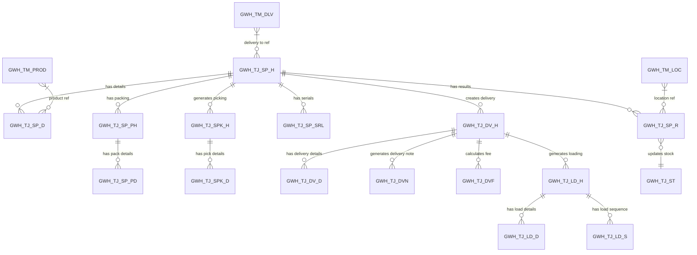
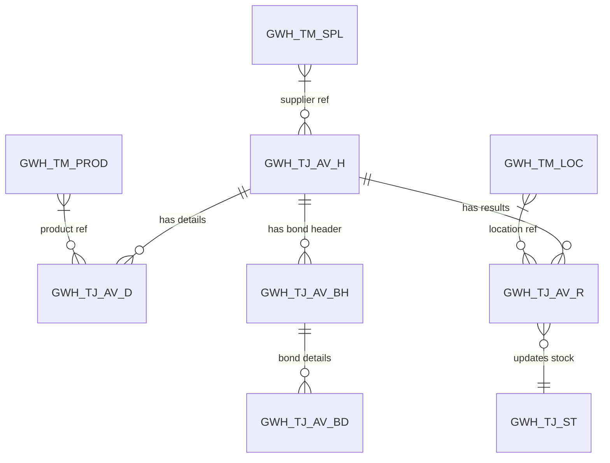
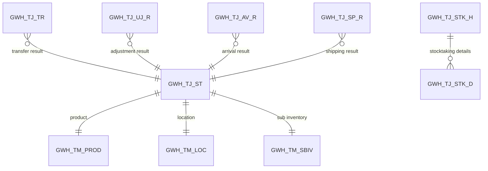
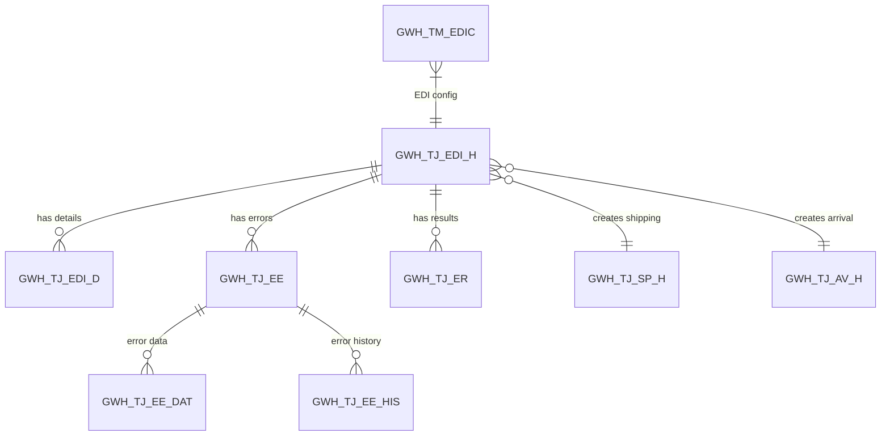
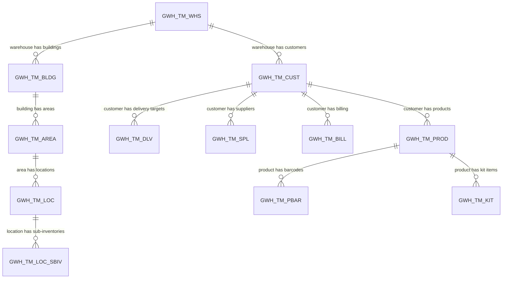

# GWH Warehouse Management System - Comprehensive Database Documentation

> **Auto-generated from live Oracle database (SGWH0001 schema)**
> **Database:** RDBGWH01 | **Schema:** SGWH0001 | **Platform:** Oracle on AWS RDS

## Table of Contents

1. [Database Overview](#1-database-overview)
2. [Schema Architecture](#2-schema-architecture)
3. [Naming Conventions](#3-naming-conventions)
4. [Transaction Tables (GWH_TJ_*)](#4-transaction-tables)
5. [Master Tables (GWH_TM_*)](#5-master-tables)
6. [Work Tables (GWH_TT_*)](#6-work-tables)
7. [Agility System Tables (AGS_*)](#7-agility-system-tables)
8. [Customer-Specific Tables](#8-customer-specific-tables)
9. [Views](#9-views)
10. [Miscellaneous Tables](#10-miscellaneous-tables)
11. [Common Key Fields](#11-common-key-fields)
12. [Data Relationships & Join Patterns](#12-data-relationships)
13. [Index Summary](#13-index-summary)
14. [Module-Table Mapping](#14-module-table-mapping)
15. [Entity Relationship Diagrams](#15-entity-relationship-diagrams)

---

## 1. Database Overview

The GWH (Global Warehouse Hub) database is a comprehensive WMS (Warehouse Management System) database
running on Oracle Database hosted on AWS RDS in the ap-northeast-1 (Tokyo) region.

| Metric | Count |
|--------|-------|
| **Total Tables** | 488 |
| **Total Views** | 443 |
| **Transaction Tables (GWH_TJ_\*)** | 55 |
| **Master Tables (GWH_TM_\*)** | 87 |
| **Work Tables (GWH_TT_\*)** | 16 |
| **Agility Tables (AGS_\*)** | 10 |
| **Customer-Specific A Tables (GWH_A_\*)** | 245 |
| **Customer-Specific B Tables (GWH_B_\*)** | 63 |
| **Documented Columns (core tables)** | 9862 |
| **Indexes** | 185 |
| **Foreign Key Constraints** | 0 (application-managed) |
| **Primary Key Constraints** | 0 (application-managed) |

> **Note:** Data integrity is managed at the application layer (Java EE), not through database-level
> constraints. There are no database-level primary keys or foreign keys. Uniqueness is enforced
> through unique indexes and application logic.

## 2. Schema Architecture

### Available Schemas

| Schema | Tables | Views | Purpose |
|--------|--------|-------|---------|
| **SGWH0001** | 488 | 443 | Primary production schema |
| **TMP_SGWH0001** | 80 | 46 | Temporary/staging schema |
| **INFGWH03** | 2 | 1 | Infrastructure schema |
| **RLSGWH01** | - | 1 | Release management |

## 3. Naming Conventions

### Table Name Prefixes

| Prefix | Category | Description |
|--------|----------|-------------|
| `GWH_TJ_` | Transaction | Operational data (arrivals, shipments, stock, etc.) |
| `GWH_TM_` | Master | Configuration and reference data |
| `GWH_TT_` | Work/Temporary | Processing work tables |
| `GWH_TW_` | Work | Additional work tables |
| `GWH_TH_` | History | Historical/archived data |
| `GWH_TR_` | Report | Report-specific data |
| `AGS_TM_` | Agility Master | Agility system (HHT/Scanner) configuration |
| `AGS_TJ_` | Agility Transaction | Agility system operational data |
| `GWH_A_` | Customer Extension (A) | Customer-specific customization tables |
| `GWH_B_` | Customer Extension (B) | Bonded warehouse customer-specific tables |
| `GWH_D_` | Data Exchange | External system data exchange tables |
| `GWH_G_` | Global/Common | Cross-system global data |
| `VGWH_TJ_` | Transaction View | Views on transaction tables |
| `VGWH_TM_` | Master View | Views on master tables |

### Table Name Suffixes

| Suffix | Meaning | Example |
|--------|---------|----------|
| `_H` | Header | `GWH_TJ_SP_H` (Shipping Header) |
| `_D` | Detail | `GWH_TJ_SP_D` (Shipping Detail) |
| `_R` | Result | `GWH_TJ_SP_R` (Shipping Result) |
| `_BD` | Bond Detail | `GWH_TJ_AV_BD` (Arrival Bond Detail) |
| `_BH` | Bond Header | `GWH_TJ_AV_BH` (Arrival Bond Header) |
| `_PH` | Pack Header | `GWH_TJ_SP_PH` (Packing Header) |
| `_PD` | Pack Detail | `GWH_TJ_SP_PD` (Packing Detail) |
| `_SRL` | Serial | `GWH_TJ_SP_SRL` (Serial) |
| `_HIS` | History | `GWH_TJ_OPE_HIS` (Operation History) |
| `_WK` | Work | `GWH_TT_BTG_WK` (Batch Group Work) |

### Common Column Name Patterns

| Pattern | Meaning | Example |
|---------|---------|----------|
| `CPNY_COD` | Company Code | Multi-tenant partition key |
| `WHS_COD` | Warehouse Code | Multi-tenant partition key |
| `CUST_COD` | Customer Code | Multi-tenant partition key |
| `*_STS` | Status | `SP_STS` (Shipping Status) |
| `*_COD` | Code | `PROD_COD` (Product Code) |
| `*_NAM` | Name | `PROD_NAM` (Product Name) |
| `*_QTY` | Quantity | `SP_QTY` (Shipping Quantity) |
| `*_DAT` | Date | `SP_DAT` (Shipping Date) |
| `*_NUM` | Number | `SP_NUM` (Shipping Number) |
| `*_FLG` | Flag (0/1) | `DEL_FLG` (Delete Flag) |
| `*_KBN` | Kind/Type | `TRN_KBN` (Transaction Kind) |
| `CRE_DAT` | Created Date | Standard audit field |
| `CRE_USR` | Created By User | Standard audit field |
| `UPD_DAT` | Updated Date | Standard audit field |
| `UPD_USR` | Updated By User | Standard audit field |
| `UPD_CNT` | Update Count | Optimistic locking counter |
| `DEL_FLG` | Delete Flag | Logical deletion (0=active, 1=deleted) |

## 4. Transaction Tables

Transaction tables store operational data for warehouse processes including arrivals, shipments,
stock management, deliveries, EDI processing, and more.

### Transaction Table Groups

| Functional Area | Tables | Description |
|----------------|--------|-------------|
| **Arrival (入荷)** | `GWH_TJ_AV_H`, `GWH_TJ_AV_D`, `GWH_TJ_AV_R`, `GWH_TJ_AV_BH`, `GWH_TJ_AV_BD` | |
| **Shipping (出荷)** | `GWH_TJ_SP_H`, `GWH_TJ_SP_D`, `GWH_TJ_SP_R`, `GWH_TJ_SP_PH`, `GWH_TJ_SP_PD`, `GWH_TJ_SP_SRL` | |
| **Stock & Inventory (在庫)** | `GWH_TJ_ST`, `GWH_TJ_STK_H`, `GWH_TJ_STK_D`, `GWH_TJ_TR`, `GWH_TJ_UJ_R` | |
| **Picking** | `GWH_TJ_SPK_H`, `GWH_TJ_SPK_D` | |
| **Loading (積込)** | `GWH_TJ_LD_H`, `GWH_TJ_LD_D`, `GWH_TJ_LD_S` | |
| **Delivery (配送)** | `GWH_TJ_DV_H`, `GWH_TJ_DV_D`, `GWH_TJ_DVN`, `GWH_TJ_DVF` | |
| **EDI** | `GWH_TJ_EDI_H`, `GWH_TJ_EDI_D`, `GWH_TJ_EE`, `GWH_TJ_EE_DAT`, `GWH_TJ_EE_HIS`, `GWH_TJ_ER` | |
| **Pallet** | `GWH_TJ_PLT_H`, `GWH_TJ_PLT_D` | |
| **Serial** | `GWH_TJ_SRL` | |
| **Batch Job** | `GWH_TJ_BJP`, `GWH_TJ_BJST` | |
| **Warehouse Charge** | `GWH_TJ_WEMB`, `GWH_TJ_WEMS`, `GWH_TJ_WMBF`, `GWH_TJ_WMBS`, `GWH_TJ_WSPR`, `GWH_TJ_WSSP` | |
| **System & History** | `GWH_TJ_GWES_HIS`, `GWH_TJ_IF_HIS`, `GWH_TJ_IF_SRL`, `GWH_TJ_OPE_HIS`, `GWH_TJ_DD_HIS`, `GWH_TJ_MHIS`, `GWH_TJ_LPR_HIS`, `GWH_TJ_MGTG` | |
| **Trace & Cancel** | `GWH_TJ_XT`, `GWH_TJ_XT_KPI`, `GWH_TJ_XT_STR`, `GWH_TJ_XC` | |
| **Other** | `GWH_TJ_YERR` | |

### 4.1. Arrival (入荷)

### GWH_TJ_AV_H

**Description:** 入荷ヘッダ/Arrival Header

**Columns:** 169

| # | Column Name | Data Type | Nullable | Description |
|---|------------|-----------|----------|-------------|
| 1 | DEL_FLG | CHAR(1) | N | Delete Flag / 論理削除フラグ |
| 2 | CRT_YMD | CHAR(8) | N | Create Date (UTC) / 作成日(標準時) |
| 3 | CRT_TIM | CHAR(6) | N | Create HMS (UTC) / 作成時分秒(標準時) |
| 4 | CRT_TMID | NVARCHAR2(200) | N | Create Term Id / 作成端末ID |
| 5 | CRT_USER | NVARCHAR2(100) | N | Create User Id / 作成ユーザID |
| 6 | CRT_PGM | NVARCHAR2(60) | N | Create Program Id / 作成プログラムID |
| 7 | CRT_TM_ZONE | NVARCHAR2(6) | N | Create User Time Zone / 作成ユーザタイムゾーン |
| 8 | CRT_YMDHMS | TIMESTAMP(6) | N | Create Time Stamp (UTC) / 作成タイムスタンプ（標準時） |
| 9 | CRT_L_YMDHMS | TIMESTAMP(6) | N | Create Time Stamp (Local) / 作成タイムスタンプ（ローカル） |
| 10 | UPD_YMD | CHAR(8) | N | Update Date (UTC) / 更新日(標準時) |
| 11 | UPD_TIM | CHAR(6) | N | Update HMS (UTC) / 更新時分秒(標準時) |
| 12 | UPD_TMID | NVARCHAR2(200) | N | Update Terminal ID / 更新端末ID |
| 13 | UPD_USER | NVARCHAR2(100) | N | Update User ID / 更新ユーザID |
| 14 | UPD_PGM | NVARCHAR2(60) | N | Update Program ID / 更新プログラムID |
| 15 | UPD_TM_ZONE | NVARCHAR2(6) | N | Update User Time Zone / 更新ユーザタイムゾーン |
| 16 | UPD_YMDHMS | TIMESTAMP(6) | N | Update Time Stamp (UTC) / 更新タイムスタンプ（標準時） |
| 17 | UPD_L_YMDHMS | TIMESTAMP(6) | N | Update Time Stamp (Local) / 更新タイムスタンプ（ローカル） |
| 18 | AVH_CPNY_COD | NVARCHAR2(12) | N | Company Code / カンパニーコード |
| 19 | AVH_WHS_COD | NVARCHAR2(8) | N | Warehouse Code / 倉庫コード |
| 20 | AVH_CUST_COD | NVARCHAR2(26) | N | Customer Code / 顧客コード |
| 21 | AVH_AV_NUM | NVARCHAR2(12) | N | Arrival Number / 入荷番号 |
| 22 | AVH_SCDL_YMD | DATE | N | Arrival Schduled Date / 入荷予定日 |
| 23 | AVH_TRN_KND | NVARCHAR2(6) | N | Transaction Kind / 伝票区分 |
| 24 | AVH_AV_STS | NVARCHAR2(6) | N | Arrival Status / 入荷ステータス |
| 25 | AVH_ARV_FLG | CHAR(1) | N | Arrived Flag / 入荷フラグ |
| 26 | AVH_ARV_YMD | DATE | Y | Arrived Date / 入荷日 |
| 27 | AVH_CNOP_YMD | DATE | Y | Arrival Confirmation Operation Time / 入荷確定処理日 |
| 28 | AVH_IV_NUM | NVARCHAR2(100) | Y | Invoice Number / 伝票番号 |
| 29 | AVH_RF_NUM | NVARCHAR2(100) | Y | Customer Ref# / 顧客リファレンスNo |
| 30 | AVH_PO_NUM | NVARCHAR2(100) | Y | P/O Number / P/O No |
| 31 | AVH_RMKS | NVARCHAR2(1000) | Y | Remarks / 伝票備考 |
| 32 | AVH_WGT | NUMBER(12,6) | Y | Weight / 重量 |
| 33 | AVH_M3 | NUMBER(12,6) | Y | Volume / 容積 |
| 34 | AVH_TRSP_COD | NVARCHAR2(10) | Y | Transport Type Code / 輸送手段 |
| 35 | AVH_LDPC | NVARCHAR2(80) | Y | Loading Place / 積載場所 |
| 36 | AVH_SPL_COD | NVARCHAR2(80) | Y | Supplier Code / 納入元コード |
| 37 | AVH_SPL_NAM1 | NVARCHAR2(100) | Y | Supplier Name1 / 納入元名称1 |
| 38 | AVH_SPL_NAM2 | NVARCHAR2(100) | Y | Supplier Name2 / 納入元名称2 |
| 39 | AVH_SPL_ADR1 | NVARCHAR2(100) | Y | Supplier Address1 / 納入元住所1 |
| 40 | AVH_SPL_ADR2 | NVARCHAR2(100) | Y | Supplier Address2 / 納入元住所2 |
| 41 | AVH_SPL_ADR3 | NVARCHAR2(100) | Y | Supplier Address3 / 納入元住所3 |
| 42 | AVH_SPL_ADR4 | NVARCHAR2(100) | Y | Supplier Address4 / 納入元住所4 |
| 43 | AVH_SPL_ADR5 | NVARCHAR2(100) | Y | Supplier Address5 / 納入元住所5 |
| 44 | AVH_SPL_ZIP | NVARCHAR2(20) | Y | Supplier Zip / 納入元郵便番号 |
| 45 | AVH_SPL_TEL | NVARCHAR2(40) | Y | Supplier Tel / 納入元電話番号 |
| 46 | AVH_RTSP_NUM | NVARCHAR2(12) | Y | Returned Number (Shipped) / 返品管理番号（出荷番号） |
| 47 | AVH_RTRS_COD | CHAR(3) | Y | Returned Goods Reason Code / 返品理由コード |
| 48 | AVH_TRSF_NUM | NVARCHAR2(12) | Y | Transfer Number / 転送番号 |
| 49 | AVH_PTDV_FLG | CHAR(1) | N | Partial Delivery Flag / 分納フラグ |
| 50 | AVH_ORAV_NUM | NVARCHAR2(12) | Y | Original Arrival No. / 元入荷番号 |
| 51 | AVH_BOND_FLG | CHAR(1) | Y | Bond Flag / 保税フラグ |
| 52 | AVH_BL_NUM | NVARCHAR2(40) | Y | B/L No / B/L No |
| 53 | AVH_CT_NUM | NVARCHAR2(60) | Y | Container No. / コンテナNo |
| 54 | AVH_DAPR_FLG | CHAR(1) | N | Document Arrival Printed Flag / 入庫伝票発行フラグ |
| 55 | AVH_CLPR_FLG | CHAR(1) | N | Cargo ID Printed Flag / カーゴIDラベル発行フラグ |
| 56 | AVH_IPPR_FLG | CHAR(1) | N | Arrival Inspection List Printed Flag / 入荷検品リスト発行フラグ |
| 57 | AVH_IRPR_FLG | CHAR(1) | N | Arrival Inspection Result List Printed Flag / 入荷検品結果リスト発行フラグ |
| 58 | AVH_IDPR_FLG | CHAR(1) | N | Arrival Inspection Discrepancy List Printed Flag / 入荷検品差異リスト発行フラグ |
| 59 | AVH_CLP1_FLG | CHAR(1) | N | Customized List Printed Flag 01 / 顧客専用リスト発行フラグ01 |
| 60 | AVH_CLP2_FLG | CHAR(1) | N | Customized List Printed Flag 02 / 顧客専用リスト発行フラグ02 |
| 61 | AVH_CLP3_FLG | CHAR(1) | N | Customized List Printed Flag 03 / 顧客専用リスト発行フラグ03 |
| 62 | AVH_CLP4_FLG | CHAR(1) | N | Customized List Printed Flag 04 / 顧客専用リスト発行フラグ04 |
| 63 | AVH_CLP5_FLG | CHAR(1) | N | Customized List Printed Flag 05 / 顧客専用リスト発行フラグ05 |
| 64 | AVH_EDI_FLG | CHAR(1) | N | EDI Flag / EDI登録フラグ |
| 65 | AVH_RCV_BTCH_NUM | NVARCHAR2(60) | Y | Recive Batch Number / 受信バッチNo |
| 66 | AVH_SND_BTCH_NUM | NVARCHAR2(60) | Y | Send Batch Number / 送信バッチNo |
| 67 | AVH_SND_BTCH_YMD | DATE | Y | Send Batch Date / 送信バッチ日 |
| 68 | AVH_RWGT | NUMBER(12,6) | Y | Weight(Result.) / 実績重量 |
| 69 | AVH_RM3 | NUMBER(12,6) | Y | Volume(Result.) / 実績容積 |
| 70 | AVH_CLI1 | NVARCHAR2(100) | Y | Customized List Items for printing 01 / 顧客専用リスト印字用項目01 |
| 71 | AVH_CLI2 | NVARCHAR2(100) | Y | Customized List Items for printing 02 / 顧客専用リスト印字用項目02 |
| 72 | AVH_CLI3 | NVARCHAR2(100) | Y | Customized List Items for printing 03 / 顧客専用リスト印字用項目03 |
| 73 | AVH_CLI4 | NVARCHAR2(100) | Y | Customized List Items for printing 04 / 顧客専用リスト印字用項目04 |
| 74 | AVH_CLI5 | NVARCHAR2(100) | Y | Customized List Items for printing 05 / 顧客専用リスト印字用項目05 |
| 75 | AVH_CLI6 | NVARCHAR2(100) | Y | Customized List Items for printing 06 / 顧客専用リスト印字用項目06 |
| 76 | AVH_CLI7 | NVARCHAR2(100) | Y | Customized List Items for printing 07 / 顧客専用リスト印字用項目07 |
| 77 | AVH_CLI8 | NVARCHAR2(100) | Y | Customized List Items for printing 08 / 顧客専用リスト印字用項目08 |
| 78 | AVH_CLI9 | NVARCHAR2(100) | Y | Customized List Items for printing 09 / 顧客専用リスト印字用項目09 |
| 79 | AVH_CLI10 | NVARCHAR2(100) | Y | Customized List Items for printing 10 / 顧客専用リスト印字用項目10 |
| 80 | AVH_CLI11 | NVARCHAR2(100) | Y | Customized List Items for printing 11 / 顧客専用リスト印字用項目11 |
| 81 | AVH_CLI12 | NVARCHAR2(100) | Y | Customized List Items for printing 12 / 顧客専用リスト印字用項目12 |
| 82 | AVH_CLI13 | NVARCHAR2(100) | Y | Customized List Items for printing 13 / 顧客専用リスト印字用項目13 |
| 83 | AVH_CLI14 | NVARCHAR2(100) | Y | Customized List Items for printing 14 / 顧客専用リスト印字用項目14 |
| 84 | AVH_CLI15 | NVARCHAR2(100) | Y | Customized List Items for printing 15 / 顧客専用リスト印字用項目15 |
| 85 | AVH_CFG1_FLG | CHAR(1) | N | Customized Flag 01 / 顧客専用フラグ01 |
| 86 | AVH_CFG2_FLG | CHAR(1) | N | Customized Flag 02 / 顧客専用フラグ02 |
| 87 | AVH_CFG3_FLG | CHAR(1) | N | Customized Flag 03 / 顧客専用フラグ03 |
| 88 | AVH_CFG4_FLG | CHAR(1) | N | Customized Flag 04 / 顧客専用フラグ04 |
| 89 | AVH_CFG5_FLG | CHAR(1) | N | Customized Flag 05 / 顧客専用フラグ05 |
| 90 | AVH_CFG6_FLG | CHAR(1) | N | Customized Flag 06 / 顧客専用フラグ06 |
| 91 | AVH_CFG7_FLG | CHAR(1) | N | Customized Flag 07 / 顧客専用フラグ07 |
| 92 | AVH_CFG8_FLG | CHAR(1) | N | Customized Flag 08 / 顧客専用フラグ08 |
| 93 | AVH_CFG9_FLG | CHAR(1) | N | Customized Flag 09 / 顧客専用フラグ09 |
| 94 | AVH_CFG10_FLG | CHAR(1) | N | Customized Flag 10 / 顧客専用フラグ10 |
| 95 | AVH_CFG11_FLG | CHAR(1) | N | Customized Flag 11 / 顧客専用フラグ11 |
| 96 | AVH_CFG12_FLG | CHAR(1) | N | Customized Flag 12 / 顧客専用フラグ12 |
| 97 | AVH_CFG13_FLG | CHAR(1) | N | Customized Flag 13 / 顧客専用フラグ13 |
| 98 | AVH_CFG14_FLG | CHAR(1) | N | Customized Flag 14 / 顧客専用フラグ14 |
| 99 | AVH_CFG15_FLG | CHAR(1) | N | Customized Flag 15 / 顧客専用フラグ15 |
| 100 | AVH_CNI1_NUM | NUMBER(9) | Y | Customized Number Item 01 / 顧客専用数字項目01 |
| 101 | AVH_CNI2_NUM | NUMBER(9) | Y | Customized Number Item 02 / 顧客専用数字項目02 |
| 102 | AVH_CNI3_NUM | NUMBER(9) | Y | Customized Number Item 03 / 顧客専用数字項目03 |
| 103 | AVH_CNI4_NUM | NUMBER(9) | Y | Customized Number Item 04 / 顧客専用数字項目04 |
| 104 | AVH_CNI5_NUM | NUMBER(9) | Y | Customized Number Item 05 / 顧客専用数字項目05 |
| 105 | AVH_CNI6_NUM | NUMBER(9) | Y | Customized Number Item 06 / 顧客専用数字項目06 |
| 106 | AVH_CNI7_NUM | NUMBER(9) | Y | Customized Number Item 07 / 顧客専用数字項目07 |
| 107 | AVH_CNI8_NUM | NUMBER(9) | Y | Customized Number Item 08 / 顧客専用数字項目08 |
| 108 | AVH_CNI9_NUM | NUMBER(9) | Y | Customized Number Item 09 / 顧客専用数字項目09 |
| 109 | AVH_CNI10_NUM | NUMBER(14,4) | Y | Customized Number Item 10 / 顧客専用数字項目10 |
| 110 | AVH_CNI11_NUM | NUMBER(14,4) | Y | Customized Number Item 11 / 顧客専用数字項目11 |
| 111 | AVH_CNI12_NUM | NUMBER(14,4) | Y | Customized Number Item 12 / 顧客専用数字項目12 |
| 112 | AVH_CNI13_NUM | NUMBER(14,4) | Y | Customized Number Item 13 / 顧客専用数字項目13 |
| 113 | AVH_CNI14_NUM | NUMBER(14,4) | Y | Customized Number Item 14 / 顧客専用数字項目14 |
| 114 | AVH_CNI15_NUM | NUMBER(14,4) | Y | Customized Number Item 15 / 顧客専用数字項目15 |
| 115 | AVH_PLPR_FLG | CHAR(1) | N | Product Label Printed Flag / 商品ラベル発行フラグ |
| 116 | AVH_ISPR_FLG | CHAR(1) | N | Arrival Pallet Sheet Printed Flag / 入荷シート発行フラグ |
| 117 | AVH_COI1 | NVARCHAR2(200) | Y | Customized Only Item 01 / カスタマイズ項目01 |
| 118 | AVH_COI2 | NVARCHAR2(200) | Y | Customized Only Item 02 / カスタマイズ項目02 |
| 119 | AVH_COI3 | NVARCHAR2(200) | Y | Customized Only Item 03 / カスタマイズ項目03 |
| 120 | AVH_COI4 | NVARCHAR2(200) | Y | Customized Only Item 04 / カスタマイズ項目04 |
| 121 | AVH_COI5 | NVARCHAR2(200) | Y | Customized Only Item 05 / カスタマイズ項目05 |
| 122 | AVH_COI6 | NVARCHAR2(200) | Y | Customized Only Item 06 / カスタマイズ項目06 |
| 123 | AVH_COI7 | NVARCHAR2(200) | Y | Customized Only Item 07 / カスタマイズ項目07 |
| 124 | AVH_COI8 | NVARCHAR2(200) | Y | Customized Only Item 08 / カスタマイズ項目08 |
| 125 | AVH_COI9 | NVARCHAR2(200) | Y | Customized Only Item 09 / カスタマイズ項目09 |
| 126 | AVH_COI10 | NVARCHAR2(200) | Y | Customized Only Item 10 / カスタマイズ項目10 |
| 127 | AVH_COI11 | NVARCHAR2(200) | Y | Customized Only Item 11 / カスタマイズ項目11 |
| 128 | AVH_COI12 | NVARCHAR2(200) | Y | Customized Only Item 12 / カスタマイズ項目12 |
| 129 | AVH_COI13 | NVARCHAR2(200) | Y | Customized Only Item 13 / カスタマイズ項目13 |
| 130 | AVH_COI14 | NVARCHAR2(200) | Y | Customized Only Item 14 / カスタマイズ項目14 |
| 131 | AVH_COI15 | NVARCHAR2(200) | Y | Customized Only Item 15 / カスタマイズ項目15 |
| 132 | AVH_COI16 | NVARCHAR2(200) | Y | Customized Only Item 16 / カスタマイズ項目16 |
| 133 | AVH_COI17 | NVARCHAR2(200) | Y | Customized Only Item 17 / カスタマイズ項目17 |
| 134 | AVH_COI18 | NVARCHAR2(200) | Y | Customized Only Item 18 / カスタマイズ項目18 |
| 135 | AVH_COI19 | NVARCHAR2(200) | Y | Customized Only Item 19 / カスタマイズ項目19 |
| 136 | AVH_COI20 | NVARCHAR2(200) | Y | Customized Only Item 20 / カスタマイズ項目20 |
| 137 | AVH_COI21 | NVARCHAR2(200) | Y | Customized Only Item 21 / カスタマイズ項目21 |
| 138 | AVH_COI22 | NVARCHAR2(200) | Y | Customized Only Item 22 / カスタマイズ項目22 |
| 139 | AVH_COI23 | NVARCHAR2(200) | Y | Customized Only Item 23 / カスタマイズ項目23 |
| 140 | AVH_COI24 | NVARCHAR2(200) | Y | Customized Only Item 24 / カスタマイズ項目24 |
| 141 | AVH_COI25 | NVARCHAR2(200) | Y | Customized Only Item 25 / カスタマイズ項目25 |
| 142 | AVH_COI26 | NVARCHAR2(200) | Y | Customized Only Item 26 / カスタマイズ項目26 |
| 143 | AVH_COI27 | NVARCHAR2(200) | Y | Customized Only Item 27 / カスタマイズ項目27 |
| 144 | AVH_COI28 | NVARCHAR2(200) | Y | Customized Only Item 28 / カスタマイズ項目28 |
| 145 | AVH_COI29 | NVARCHAR2(200) | Y | Customized Only Item 29 / カスタマイズ項目29 |
| 146 | AVH_COI30 | NVARCHAR2(200) | Y | Customized Only Item 30 / カスタマイズ項目30 |
| 147 | AVH_COI31 | NVARCHAR2(200) | Y | Customized Only Item 31 / カスタマイズ項目31 |
| 148 | AVH_COI32 | NVARCHAR2(200) | Y | Customized Only Item 32 / カスタマイズ項目32 |
| 149 | AVH_COI33 | NVARCHAR2(200) | Y | Customized Only Item 33 / カスタマイズ項目33 |
| 150 | AVH_COI34 | NVARCHAR2(200) | Y | Customized Only Item 34 / カスタマイズ項目34 |
| 151 | AVH_COI35 | NVARCHAR2(200) | Y | Customized Only Item 35 / カスタマイズ項目35 |
| 152 | AVH_COI36 | NVARCHAR2(200) | Y | Customized Only Item 36 / カスタマイズ項目36 |
| 153 | AVH_COI37 | NVARCHAR2(200) | Y | Customized Only Item 37 / カスタマイズ項目37 |
| 154 | AVH_COI38 | NVARCHAR2(200) | Y | Customized Only Item 38 / カスタマイズ項目38 |
| 155 | AVH_COI39 | NVARCHAR2(200) | Y | Customized Only Item 39 / カスタマイズ項目39 |
| 156 | AVH_COI40 | NVARCHAR2(200) | Y | Customized Only Item 40 / カスタマイズ項目40 |
| 157 | AVH_COIL1 | NVARCHAR2(510) | Y | Customized Only Item (Long) 01 / カスタマイズ項目(long)01 |
| 158 | AVH_COIL2 | NVARCHAR2(510) | Y | Customized Only Item (Long) 02 / カスタマイズ項目(long)02 |
| 159 | AVH_COIL3 | NVARCHAR2(510) | Y | Customized Only Item (Long) 03 / カスタマイズ項目(long)03 |
| 160 | AVH_COIL4 | NVARCHAR2(510) | Y | Customized Only Item (Long) 04 / カスタマイズ項目(long)04 |
| 161 | AVH_COIL5 | NVARCHAR2(510) | Y | Customized Only Item (Long) 05 / カスタマイズ項目(long)05 |
| 162 | AVH_COIL6 | NVARCHAR2(510) | Y | Customized Only Item (Long) 06 / カスタマイズ項目(long)06 |
| 163 | AVH_COIL7 | NVARCHAR2(510) | Y | Customized Only Item (Long) 07 / カスタマイズ項目(long)07 |
| 164 | AVH_COIL8 | NVARCHAR2(510) | Y | Customized Only Item (Long) 08 / カスタマイズ項目(long)08 |
| 165 | AVH_COIL9 | NVARCHAR2(510) | Y | Customized Only Item (Long) 09 / カスタマイズ項目(long)09 |
| 166 | AVH_COIL10 | NVARCHAR2(510) | Y | Customized Only Item (Long) 10 / カスタマイズ項目(long)10 |
| 167 | AVH_CNF_MAIL_ADR | NVARCHAR2(1000) | Y | Email address for sending confirmation(TO) / 実績送信先メールアドレス(TO) |
| 168 | AVH_SRT_FLG | CHAR(1) | N | Sorting Flag / 仕分けフラグ |
| 169 | AVH_SRPR_FLG | CHAR(1) | N | Sorting Printed Flag / 仕分伝票発行フラグ |

**Indexes:**

- `IGWH_TJ_AV_H_1D` : AVH_CPNY_COD, AVH_WHS_COD, AVH_CUST_COD, AVH_IV_NUM
- `IGWH_TJ_AV_H_1U` (UNIQUE): AVH_CPNY_COD, AVH_WHS_COD, AVH_CUST_COD, AVH_AV_NUM

### GWH_TJ_AV_D

**Description:** 入荷ディテール/Arrival Detail

**Columns:** 152

| # | Column Name | Data Type | Nullable | Description |
|---|------------|-----------|----------|-------------|
| 1 | DEL_FLG | CHAR(1) | N | Delete Flag / 論理削除フラグ |
| 2 | CRT_YMD | CHAR(8) | N | Create Date (UTC) / 作成日(標準時) |
| 3 | CRT_TIM | CHAR(6) | N | Create HMS (UTC) / 作成時分秒(標準時) |
| 4 | CRT_TMID | NVARCHAR2(200) | N | Create Term Id / 作成端末ID |
| 5 | CRT_USER | NVARCHAR2(100) | N | Create User Id / 作成ユーザID |
| 6 | CRT_PGM | NVARCHAR2(60) | N | Create Program Id / 作成プログラムID |
| 7 | CRT_TM_ZONE | NVARCHAR2(6) | N | Create User Time Zone / 作成ユーザタイムゾーン |
| 8 | CRT_YMDHMS | TIMESTAMP(6) | N | Create Time Stamp (UTC) / 作成タイムスタンプ（標準時） |
| 9 | CRT_L_YMDHMS | TIMESTAMP(6) | N | Create Time Stamp (Local) / 作成タイムスタンプ（ローカル） |
| 10 | UPD_YMD | CHAR(8) | N | Update Date (UTC) / 更新日(標準時) |
| 11 | UPD_TIM | CHAR(6) | N | Update HMS (UTC) / 更新時分秒(標準時) |
| 12 | UPD_TMID | NVARCHAR2(200) | N | Update Terminal ID / 更新端末ID |
| 13 | UPD_USER | NVARCHAR2(100) | N | Update User ID / 更新ユーザID |
| 14 | UPD_PGM | NVARCHAR2(60) | N | Update Program ID / 更新プログラムID |
| 15 | UPD_TM_ZONE | NVARCHAR2(6) | N | Update User Time Zone / 更新ユーザタイムゾーン |
| 16 | UPD_YMDHMS | TIMESTAMP(6) | N | Update Time Stamp (UTC) / 更新タイムスタンプ（標準時） |
| 17 | UPD_L_YMDHMS | TIMESTAMP(6) | N | Update Time Stamp (Local) / 更新タイムスタンプ（ローカル） |
| 18 | AVD_CPNY_COD | NVARCHAR2(12) | N | Company Code / カンパニーコード |
| 19 | AVD_WHS_COD | NVARCHAR2(8) | N | Warehouse Code / 倉庫コード |
| 20 | AVD_CUST_COD | NVARCHAR2(26) | N | Customer Code / 顧客コード |
| 21 | AVD_AV_NUM | NVARCHAR2(12) | N | Arrival Number / 入荷番号 |
| 22 | AVD_AVLN_NUM | NUMBER(4) | N | Arrival Line No / 入荷ラインNo |
| 23 | AVD_AV_STS | NVARCHAR2(6) | N | Arrival Status / 入荷ステータス |
| 24 | AVD_INSP_STS | CHAR(1) | N | Arrival Inspected Flag / 入荷検品済フラグ |
| 25 | AVD_PROD_COD | NVARCHAR2(100) | N | Product Code / 商品コード |
| 26 | AVD_PROD_NAM | NVARCHAR2(200) | Y | Product Name / 商品名称 |
| 27 | AVD_ORGN_COD | CHAR(2) | Y | Country Of Origin / 原産国 |
| 28 | AVD_SPPR_COD | NVARCHAR2(100) | Y | Supplier Product Code / サプライヤ商品コード |
| 29 | AVD_SPPR_NAM | NVARCHAR2(200) | Y | Supplier Product Name / サプライヤ商品名称 |
| 30 | AVD_PPCS_QTY | NUMBER(9) | N | Number Of Pieces Per Case / ケース入数 |
| 31 | AVD_SCS_QTY | NUMBER(9) | N | Case QTY(Sched.) / ケース予定数 |
| 32 | AVD_SPC_QTY | NUMBER(12,3) | N | Piece QTY(Sched.) / バラ予定数 |
| 33 | AVD_STPC_QTY | NUMBER(12,3) | N | Total Piece QTY(Sched.) / 総バラ予定数 |
| 34 | AVD_SRPC_QTY | NUMBER(12,3) | N | Original Total Piece QTY(Sched.) / 総バラ予定受信数 |
| 35 | AVD_PCUM_PCS | NVARCHAR2(6) | Y | UOM(Piece) / 単位(バラ数) |
| 36 | AVD_PCUM_CS | NVARCHAR2(6) | Y | UOM(Case) / 単位(ケース数) |
| 37 | AVD_WGT | NUMBER(12,6) | Y | Weight / 重量 |
| 38 | AVD_M3 | NUMBER(12,6) | Y | Volume / 容積 |
| 39 | AVD_SBIV_COD | NVARCHAR2(40) | N | Sub Inventry / 等級コード |
| 40 | AVD_PIK1 | NVARCHAR2(60) | Y | PICKING KEY1 / ピッキングキー1 |
| 41 | AVD_PIK2 | NVARCHAR2(60) | Y | PICKING KEY2 / ピッキングキー2 |
| 42 | AVD_PIK3 | NVARCHAR2(60) | Y | PICKING KEY3 / ピッキングキー3 |
| 43 | AVD_PIK4 | NVARCHAR2(60) | Y | PICKING KEY4 / ピッキングキー4 |
| 44 | AVD_PIK5 | NVARCHAR2(60) | Y | PICKING KEY5 / ピッキングキー5 |
| 45 | AVD_PIK6 | NVARCHAR2(60) | Y | PICKING KEY6 / ピッキングキー6 |
| 46 | AVD_PIK7 | NVARCHAR2(60) | Y | PICKING KEY7 / ピッキングキー7 |
| 47 | AVD_PSSA_FLG | CHAR(1) | N | PSSA Kind(Perfect Shaped Stock Allocation) / 成体管理フラグ |
| 48 | AVD_CLPR_FLG | CHAR(1) | N | Cargo ID Printed Flag / カーゴIDラベル発行フラグ |
| 49 | AVD_CDSQ_NUM | NVARCHAR2(20) | Y | Customer Detail SEQ / 顧客明細SEQ |
| 50 | AVD_DMG_FLG | CHAR(1) | N | Damage/Hold Flag / ダメージ/ホールドフラグ |
| 51 | AVD_CGID_NUM | NUMBER(4) | Y | Number Of Printed Cargo ID Label / カーゴIDラベル発行枚数 |
| 52 | AVD_RMKS | NVARCHAR2(1000) | Y | Remarks for Line / 明細備考 |
| 53 | AVD_CLI1 | NVARCHAR2(100) | Y | Customized List Items for printing 01 / 顧客専用リスト印字用項目01 |
| 54 | AVD_CLI2 | NVARCHAR2(100) | Y | Customized List Items for printing 02 / 顧客専用リスト印字用項目02 |
| 55 | AVD_CLI3 | NVARCHAR2(100) | Y | Customized List Items for printing 03 / 顧客専用リスト印字用項目03 |
| 56 | AVD_CLI4 | NVARCHAR2(100) | Y | Customized List Items for printing 04 / 顧客専用リスト印字用項目04 |
| 57 | AVD_CLI5 | NVARCHAR2(100) | Y | Customized List Items for printing 05 / 顧客専用リスト印字用項目05 |
| 58 | AVD_CLI6 | NVARCHAR2(100) | Y | Customized List Items for printing 06 / 顧客専用リスト印字用項目06 |
| 59 | AVD_CLI7 | NVARCHAR2(100) | Y | Customized List Items for printing 07 / 顧客専用リスト印字用項目07 |
| 60 | AVD_CLI8 | NVARCHAR2(100) | Y | Customized List Items for printing 08 / 顧客専用リスト印字用項目08 |
| 61 | AVD_CLI9 | NVARCHAR2(100) | Y | Customized List Items for printing 09 / 顧客専用リスト印字用項目09 |
| 62 | AVD_CLI10 | NVARCHAR2(100) | Y | Customized List Items for printing 10 / 顧客専用リスト印字用項目10 |
| 63 | AVD_CLI11 | NVARCHAR2(100) | Y | Customized List Items for printing 11 / 顧客専用リスト印字用項目11 |
| 64 | AVD_CLI12 | NVARCHAR2(100) | Y | Customized List Items for printing 12 / 顧客専用リスト印字用項目12 |
| 65 | AVD_CLI13 | NVARCHAR2(100) | Y | Customized List Items for printing 13 / 顧客専用リスト印字用項目13 |
| 66 | AVD_CLI14 | NVARCHAR2(100) | Y | Customized List Items for printing 14 / 顧客専用リスト印字用項目14 |
| 67 | AVD_CLI15 | NVARCHAR2(100) | Y | Customized List Items for printing 15 / 顧客専用リスト印字用項目15 |
| 68 | AVD_CFG1_FLG | CHAR(1) | N | Customized Flag 01 / 顧客専用フラグ01 |
| 69 | AVD_CFG2_FLG | CHAR(1) | N | Customized Flag 02 / 顧客専用フラグ02 |
| 70 | AVD_CFG3_FLG | CHAR(1) | N | Customized Flag 03 / 顧客専用フラグ03 |
| 71 | AVD_CFG4_FLG | CHAR(1) | N | Customized Flag 04 / 顧客専用フラグ04 |
| 72 | AVD_CFG5_FLG | CHAR(1) | N | Customized Flag 05 / 顧客専用フラグ05 |
| 73 | AVD_CFG6_FLG | CHAR(1) | N | Customized Flag 06 / 顧客専用フラグ06 |
| 74 | AVD_CFG7_FLG | CHAR(1) | N | Customized Flag 07 / 顧客専用フラグ07 |
| 75 | AVD_CFG8_FLG | CHAR(1) | N | Customized Flag 08 / 顧客専用フラグ08 |
| 76 | AVD_CFG9_FLG | CHAR(1) | N | Customized Flag 09 / 顧客専用フラグ09 |
| 77 | AVD_CFG10_FLG | CHAR(1) | N | Customized Flag 10 / 顧客専用フラグ10 |
| 78 | AVD_CFG11_FLG | CHAR(1) | N | Customized Flag 11 / 顧客専用フラグ11 |
| 79 | AVD_CFG12_FLG | CHAR(1) | N | Customized Flag 12 / 顧客専用フラグ12 |
| 80 | AVD_CFG13_FLG | CHAR(1) | N | Customized Flag 13 / 顧客専用フラグ13 |
| 81 | AVD_CFG14_FLG | CHAR(1) | N | Customized Flag 14 / 顧客専用フラグ14 |
| 82 | AVD_CFG15_FLG | CHAR(1) | N | Customized Flag 15 / 顧客専用フラグ15 |
| 83 | AVD_CNI1_NUM | NUMBER(9) | Y | Customized Number Item 01 / 顧客専用数字項目01 |
| 84 | AVD_CNI2_NUM | NUMBER(9) | Y | Customized Number Item 02 / 顧客専用数字項目02 |
| 85 | AVD_CNI3_NUM | NUMBER(9) | Y | Customized Number Item 03 / 顧客専用数字項目03 |
| 86 | AVD_CNI4_NUM | NUMBER(9) | Y | Customized Number Item 04 / 顧客専用数字項目04 |
| 87 | AVD_CNI5_NUM | NUMBER(9) | Y | Customized Number Item 05 / 顧客専用数字項目05 |
| 88 | AVD_CNI6_NUM | NUMBER(9) | Y | Customized Number Item 06 / 顧客専用数字項目06 |
| 89 | AVD_CNI7_NUM | NUMBER(9) | Y | Customized Number Item 07 / 顧客専用数字項目07 |
| 90 | AVD_CNI8_NUM | NUMBER(9) | Y | Customized Number Item 08 / 顧客専用数字項目08 |
| 91 | AVD_CNI9_NUM | NUMBER(9) | Y | Customized Number Item 09 / 顧客専用数字項目09 |
| 92 | AVD_CNI10_NUM | NUMBER(14,4) | Y | Customized Number Item 10 / 顧客専用数字項目10 |
| 93 | AVD_CNI11_NUM | NUMBER(14,4) | Y | Customized Number Item 11 / 顧客専用数字項目11 |
| 94 | AVD_CNI12_NUM | NUMBER(14,4) | Y | Customized Number Item 12 / 顧客専用数字項目12 |
| 95 | AVD_CNI13_NUM | NUMBER(14,4) | Y | Customized Number Item 13 / 顧客専用数字項目13 |
| 96 | AVD_CNI14_NUM | NUMBER(14,4) | Y | Customized Number Item 14 / 顧客専用数字項目14 |
| 97 | AVD_CNI15_NUM | NUMBER(14,4) | Y | Customized Number Item 15 / 顧客専用数字項目15 |
| 98 | AVD_PLPR_FLG | CHAR(1) | N | Product Label Printed Flag / 商品ラベル発行フラグ |
| 99 | AVD_ISPR_FLG | CHAR(1) | N | Arrival Pallet Sheet Printed Flag / 入荷シート発行フラグ |
| 100 | AVD_COI1 | NVARCHAR2(200) | Y | Customized Only Item 01 / カスタマイズ項目01 |
| 101 | AVD_COI2 | NVARCHAR2(200) | Y | Customized Only Item 02 / カスタマイズ項目02 |
| 102 | AVD_COI3 | NVARCHAR2(200) | Y | Customized Only Item 03 / カスタマイズ項目03 |
| 103 | AVD_COI4 | NVARCHAR2(200) | Y | Customized Only Item 04 / カスタマイズ項目04 |
| 104 | AVD_COI5 | NVARCHAR2(200) | Y | Customized Only Item 05 / カスタマイズ項目05 |
| 105 | AVD_COI6 | NVARCHAR2(200) | Y | Customized Only Item 06 / カスタマイズ項目06 |
| 106 | AVD_COI7 | NVARCHAR2(200) | Y | Customized Only Item 07 / カスタマイズ項目07 |
| 107 | AVD_COI8 | NVARCHAR2(200) | Y | Customized Only Item 08 / カスタマイズ項目08 |
| 108 | AVD_COI9 | NVARCHAR2(200) | Y | Customized Only Item 09 / カスタマイズ項目09 |
| 109 | AVD_COI10 | NVARCHAR2(200) | Y | Customized Only Item 10 / カスタマイズ項目10 |
| 110 | AVD_COI11 | NVARCHAR2(200) | Y | Customized Only Item 11 / カスタマイズ項目11 |
| 111 | AVD_COI12 | NVARCHAR2(200) | Y | Customized Only Item 12 / カスタマイズ項目12 |
| 112 | AVD_COI13 | NVARCHAR2(200) | Y | Customized Only Item 13 / カスタマイズ項目13 |
| 113 | AVD_COI14 | NVARCHAR2(200) | Y | Customized Only Item 14 / カスタマイズ項目14 |
| 114 | AVD_COI15 | NVARCHAR2(200) | Y | Customized Only Item 15 / カスタマイズ項目15 |
| 115 | AVD_COI16 | NVARCHAR2(200) | Y | Customized Only Item 16 / カスタマイズ項目16 |
| 116 | AVD_COI17 | NVARCHAR2(200) | Y | Customized Only Item 17 / カスタマイズ項目17 |
| 117 | AVD_COI18 | NVARCHAR2(200) | Y | Customized Only Item 18 / カスタマイズ項目18 |
| 118 | AVD_COI19 | NVARCHAR2(200) | Y | Customized Only Item 19 / カスタマイズ項目19 |
| 119 | AVD_COI20 | NVARCHAR2(200) | Y | Customized Only Item 20 / カスタマイズ項目20 |
| 120 | AVD_COI21 | NVARCHAR2(200) | Y | Customized Only Item 21 / カスタマイズ項目21 |
| 121 | AVD_COI22 | NVARCHAR2(200) | Y | Customized Only Item 22 / カスタマイズ項目22 |
| 122 | AVD_COI23 | NVARCHAR2(200) | Y | Customized Only Item 23 / カスタマイズ項目23 |
| 123 | AVD_COI24 | NVARCHAR2(200) | Y | Customized Only Item 24 / カスタマイズ項目24 |
| 124 | AVD_COI25 | NVARCHAR2(200) | Y | Customized Only Item 25 / カスタマイズ項目25 |
| 125 | AVD_COI26 | NVARCHAR2(200) | Y | Customized Only Item 26 / カスタマイズ項目26 |
| 126 | AVD_COI27 | NVARCHAR2(200) | Y | Customized Only Item 27 / カスタマイズ項目27 |
| 127 | AVD_COI28 | NVARCHAR2(200) | Y | Customized Only Item 28 / カスタマイズ項目28 |
| 128 | AVD_COI29 | NVARCHAR2(200) | Y | Customized Only Item 29 / カスタマイズ項目29 |
| 129 | AVD_COI30 | NVARCHAR2(200) | Y | Customized Only Item 30 / カスタマイズ項目30 |
| 130 | AVD_COI31 | NVARCHAR2(200) | Y | Customized Only Item 31 / カスタマイズ項目31 |
| 131 | AVD_COI32 | NVARCHAR2(200) | Y | Customized Only Item 32 / カスタマイズ項目32 |
| 132 | AVD_COI33 | NVARCHAR2(200) | Y | Customized Only Item 33 / カスタマイズ項目33 |
| 133 | AVD_COI34 | NVARCHAR2(200) | Y | Customized Only Item 34 / カスタマイズ項目34 |
| 134 | AVD_COI35 | NVARCHAR2(200) | Y | Customized Only Item 35 / カスタマイズ項目35 |
| 135 | AVD_COI36 | NVARCHAR2(200) | Y | Customized Only Item 36 / カスタマイズ項目36 |
| 136 | AVD_COI37 | NVARCHAR2(200) | Y | Customized Only Item 37 / カスタマイズ項目37 |
| 137 | AVD_COI38 | NVARCHAR2(200) | Y | Customized Only Item 38 / カスタマイズ項目38 |
| 138 | AVD_COI39 | NVARCHAR2(200) | Y | Customized Only Item 39 / カスタマイズ項目39 |
| 139 | AVD_COI40 | NVARCHAR2(200) | Y | Customized Only Item 40 / カスタマイズ項目40 |
| 140 | AVD_COIL1 | NVARCHAR2(510) | Y | Customized Only Item (Long) 01 / カスタマイズ項目(long)01 |
| 141 | AVD_COIL2 | NVARCHAR2(510) | Y | Customized Only Item (Long) 02 / カスタマイズ項目(long)02 |
| 142 | AVD_COIL3 | NVARCHAR2(510) | Y | Customized Only Item (Long) 03 / カスタマイズ項目(long)03 |
| 143 | AVD_COIL4 | NVARCHAR2(510) | Y | Customized Only Item (Long) 04 / カスタマイズ項目(long)04 |
| 144 | AVD_COIL5 | NVARCHAR2(510) | Y | Customized Only Item (Long) 05 / カスタマイズ項目(long)05 |
| 145 | AVD_COIL6 | NVARCHAR2(510) | Y | Customized Only Item (Long) 06 / カスタマイズ項目(long)06 |
| 146 | AVD_COIL7 | NVARCHAR2(510) | Y | Customized Only Item (Long) 07 / カスタマイズ項目(long)07 |
| 147 | AVD_COIL8 | NVARCHAR2(510) | Y | Customized Only Item (Long) 08 / カスタマイズ項目(long)08 |
| 148 | AVD_COIL9 | NVARCHAR2(510) | Y | Customized Only Item (Long) 09 / カスタマイズ項目(long)09 |
| 149 | AVD_COIL10 | NVARCHAR2(510) | Y | Customized Only Item (Long) 10 / カスタマイズ項目(long)10 |
| 150 | AVD_PPB_QTY | NUMBER(9) | Y | Number Of Pieces Per Ball / ボール入数 |
| 151 | AVD_SBL_QTY | NUMBER(9) | N | Ball QTY(Sched.) / ボール予定数 |
| 152 | AVD_PCUM_BL | NVARCHAR2(6) | Y | UOM (Ball) / 単位(Ball数) |

**Indexes:**

- `IGWH_TJ_AV_D_1U` (UNIQUE): AVD_CPNY_COD, AVD_WHS_COD, AVD_CUST_COD, AVD_AV_NUM, AVD_AVLN_NUM

### GWH_TJ_AV_R

**Description:** 入荷結果/Arrival Result

**Columns:** 123

| # | Column Name | Data Type | Nullable | Description |
|---|------------|-----------|----------|-------------|
| 1 | DEL_FLG | CHAR(1) | N | Delete Flag / 論理削除フラグ |
| 2 | CRT_YMD | CHAR(8) | N | Create Date (UTC) / 作成日(標準時) |
| 3 | CRT_TIM | CHAR(6) | N | Create HMS (UTC) / 作成時分秒(標準時) |
| 4 | CRT_TMID | NVARCHAR2(200) | N | Create Term Id / 作成端末ID |
| 5 | CRT_USER | NVARCHAR2(100) | N | Create User Id / 作成ユーザID |
| 6 | CRT_PGM | NVARCHAR2(60) | N | Create Program Id / 作成プログラムID |
| 7 | CRT_TM_ZONE | NVARCHAR2(6) | N | Create User Time Zone / 作成ユーザタイムゾーン |
| 8 | CRT_YMDHMS | TIMESTAMP(6) | N | Create Time Stamp (UTC) / 作成タイムスタンプ（標準時） |
| 9 | CRT_L_YMDHMS | TIMESTAMP(6) | N | Create Time Stamp (Local) / 作成タイムスタンプ（ローカル） |
| 10 | UPD_YMD | CHAR(8) | N | Update Date (UTC) / 更新日(標準時) |
| 11 | UPD_TIM | CHAR(6) | N | Update HMS (UTC) / 更新時分秒(標準時) |
| 12 | UPD_TMID | NVARCHAR2(200) | N | Update Terminal ID / 更新端末ID |
| 13 | UPD_USER | NVARCHAR2(100) | N | Update User ID / 更新ユーザID |
| 14 | UPD_PGM | NVARCHAR2(60) | N | Update Program ID / 更新プログラムID |
| 15 | UPD_TM_ZONE | NVARCHAR2(6) | N | Update User Time Zone / 更新ユーザタイムゾーン |
| 16 | UPD_YMDHMS | TIMESTAMP(6) | N | Update Time Stamp (UTC) / 更新タイムスタンプ（標準時） |
| 17 | UPD_L_YMDHMS | TIMESTAMP(6) | N | Update Time Stamp (Local) / 更新タイムスタンプ（ローカル） |
| 18 | AVR_CPNY_COD | NVARCHAR2(12) | N | Company Code / カンパニーコード |
| 19 | AVR_WHS_COD | NVARCHAR2(8) | N | Warehouse Code / 倉庫コード |
| 20 | AVR_CUST_COD | NVARCHAR2(26) | N | Customer Code / 顧客コード |
| 21 | AVR_AS_NUM | NVARCHAR2(12) | N | Arrival and Shipping Number / 入出荷番号 |
| 22 | AVR_ASLN_NUM | NUMBER(4) | N | Arrival and Shipping Line Number / 入出荷ラインNo |
| 23 | AVR_ASSQ_NUM | NUMBER(4) | N | Arrival and Shipping Seq Number / 入出荷SEQNo |
| 24 | AVR_AS_KND | NVARCHAR2(4) | N | Arrival and Shipping Kind / 入出荷区分 |
| 25 | AVR_TRN_KND | NVARCHAR2(6) | N | Transaction Kind / 伝票区分 |
| 26 | AVR_CRT_YMD | DATE | N | Create Date / レコード作成日 |
| 27 | AVR_AVSP_YMD | DATE | Y | Arrived and Shipped Date / 入出荷日 |
| 28 | AVR_AVSP_STS | NVARCHAR2(6) | N | Arrival and Shipping Status / 入出荷ステータス |
| 29 | AVR_PROD_COD | NVARCHAR2(100) | N | Product Code / 商品コード |
| 30 | AVR_ORGN_COD | CHAR(2) | Y | Country Of Origin / 原産国 |
| 31 | AVR_PPCS_QTY | NUMBER(9) | N | Number Of Pieces Per Case / ケース入数 |
| 32 | AVR_RCS_QTY | NUMBER(9) | N | Case QTY(Result.) / ケース実績数 |
| 33 | AVR_RPC_QTY | NUMBER(12,3) | N | Piece QTY(Result.) / バラ実績数 |
| 34 | AVR_RTPC_QTY | NUMBER(12,3) | N | Total Piece QTY(Result.) / 総バラ実績数 |
| 35 | AVR_AREA_COD | CHAR(3) | Y | Area / エリア |
| 36 | AVR_RACK_COD | NVARCHAR2(20) | Y | Rack / ラック |
| 37 | AVR_PSTN_COD | NVARCHAR2(6) | Y | Position / ポジション |
| 38 | AVR_LVL_COD | NVARCHAR2(4) | Y | Level / レベル |
| 39 | AVR_SBIV_COD | NVARCHAR2(40) | N | Sub Inventry / 等級コード |
| 40 | AVR_PIK1 | NVARCHAR2(60) | Y | PICKING KEY1 / ピッキングキー1 |
| 41 | AVR_PIK2 | NVARCHAR2(60) | Y | PICKING KEY2 / ピッキングキー2 |
| 42 | AVR_PIK3 | NVARCHAR2(60) | Y | PICKING KEY3 / ピッキングキー3 |
| 43 | AVR_PIK4 | NVARCHAR2(60) | Y | PICKING KEY4 / ピッキングキー4 |
| 44 | AVR_PIK5 | NVARCHAR2(60) | Y | PICKING KEY5 / ピッキングキー5 |
| 45 | AVR_PIK6 | NVARCHAR2(60) | Y | PICKING KEY6 / ピッキングキー6 |
| 46 | AVR_PIK7 | NVARCHAR2(60) | Y | PICKING KEY7 / ピッキングキー7 |
| 47 | AVR_AV_NUM | NVARCHAR2(12) | Y | Arrival Number / 入荷番号 |
| 48 | AVR_AVLN_NUM | NUMBER(4) | Y | Arrival Line No / 入荷ラインNo |
| 49 | AVR_AVSQ_NUM | NUMBER(4) | Y | Arrival Seq No / 入荷SEQNo |
| 50 | AVR_DMG_FLG | CHAR(1) | N | Damage/Hold Flag / ダメージ/ホールドフラグ |
| 51 | AVR_OP_FLG | CHAR(1) | N | Operation Flag / 作業フラグ(入荷：棚付、出荷：ピッキング) |
| 52 | AVR_CNFM_FLG | CHAR(1) | N | Confirmed Flag / 確定フラグ |
| 53 | AVR_RSN_COD | NVARCHAR2(6) | Y | Reason Code / 理由コード |
| 54 | AVR_RMKS | NVARCHAR2(1000) | Y | Remarks / 備考 |
| 55 | AVR_RWGT | NUMBER(12,6) | Y | Weight(Result.) / 実績重量 |
| 56 | AVR_RM3 | NUMBER(12,6) | Y | Volume(Result.) / 実績容積 |
| 57 | AVR_COI1 | NVARCHAR2(200) | Y | Customized Only Item 01 / カスタマイズ項目01 |
| 58 | AVR_COI2 | NVARCHAR2(200) | Y | Customized Only Item 02 / カスタマイズ項目02 |
| 59 | AVR_COI3 | NVARCHAR2(200) | Y | Customized Only Item 03 / カスタマイズ項目03 |
| 60 | AVR_COI4 | NVARCHAR2(200) | Y | Customized Only Item 04 / カスタマイズ項目04 |
| 61 | AVR_COI5 | NVARCHAR2(200) | Y | Customized Only Item 05 / カスタマイズ項目05 |
| 62 | AVR_COI6 | NVARCHAR2(200) | Y | Customized Only Item 06 / カスタマイズ項目06 |
| 63 | AVR_COI7 | NVARCHAR2(200) | Y | Customized Only Item 07 / カスタマイズ項目07 |
| 64 | AVR_COI8 | NVARCHAR2(200) | Y | Customized Only Item 08 / カスタマイズ項目08 |
| 65 | AVR_COI9 | NVARCHAR2(200) | Y | Customized Only Item 09 / カスタマイズ項目09 |
| 66 | AVR_COI10 | NVARCHAR2(200) | Y | Customized Only Item 10 / カスタマイズ項目10 |
| 67 | AVR_COI11 | NVARCHAR2(200) | Y | Customized Only Item 11 / カスタマイズ項目11 |
| 68 | AVR_COI12 | NVARCHAR2(200) | Y | Customized Only Item 12 / カスタマイズ項目12 |
| 69 | AVR_COI13 | NVARCHAR2(200) | Y | Customized Only Item 13 / カスタマイズ項目13 |
| 70 | AVR_COI14 | NVARCHAR2(200) | Y | Customized Only Item 14 / カスタマイズ項目14 |
| 71 | AVR_COI15 | NVARCHAR2(200) | Y | Customized Only Item 15 / カスタマイズ項目15 |
| 72 | AVR_COI16 | NVARCHAR2(200) | Y | Customized Only Item 16 / カスタマイズ項目16 |
| 73 | AVR_COI17 | NVARCHAR2(200) | Y | Customized Only Item 17 / カスタマイズ項目17 |
| 74 | AVR_COI18 | NVARCHAR2(200) | Y | Customized Only Item 18 / カスタマイズ項目18 |
| 75 | AVR_COI19 | NVARCHAR2(200) | Y | Customized Only Item 19 / カスタマイズ項目19 |
| 76 | AVR_COI20 | NVARCHAR2(200) | Y | Customized Only Item 20 / カスタマイズ項目20 |
| 77 | AVR_COI21 | NVARCHAR2(200) | Y | Customized Only Item 21 / カスタマイズ項目21 |
| 78 | AVR_COI22 | NVARCHAR2(200) | Y | Customized Only Item 22 / カスタマイズ項目22 |
| 79 | AVR_COI23 | NVARCHAR2(200) | Y | Customized Only Item 23 / カスタマイズ項目23 |
| 80 | AVR_COI24 | NVARCHAR2(200) | Y | Customized Only Item 24 / カスタマイズ項目24 |
| 81 | AVR_COI25 | NVARCHAR2(200) | Y | Customized Only Item 25 / カスタマイズ項目25 |
| 82 | AVR_COI26 | NVARCHAR2(200) | Y | Customized Only Item 26 / カスタマイズ項目26 |
| 83 | AVR_COI27 | NVARCHAR2(200) | Y | Customized Only Item 27 / カスタマイズ項目27 |
| 84 | AVR_COI28 | NVARCHAR2(200) | Y | Customized Only Item 28 / カスタマイズ項目28 |
| 85 | AVR_COI29 | NVARCHAR2(200) | Y | Customized Only Item 29 / カスタマイズ項目29 |
| 86 | AVR_COI30 | NVARCHAR2(200) | Y | Customized Only Item 30 / カスタマイズ項目30 |
| 87 | AVR_COI31 | NVARCHAR2(200) | Y | Customized Only Item 31 / カスタマイズ項目31 |
| 88 | AVR_COI32 | NVARCHAR2(200) | Y | Customized Only Item 32 / カスタマイズ項目32 |
| 89 | AVR_COI33 | NVARCHAR2(200) | Y | Customized Only Item 33 / カスタマイズ項目33 |
| 90 | AVR_COI34 | NVARCHAR2(200) | Y | Customized Only Item 34 / カスタマイズ項目34 |
| 91 | AVR_COI35 | NVARCHAR2(200) | Y | Customized Only Item 35 / カスタマイズ項目35 |
| 92 | AVR_COI36 | NVARCHAR2(200) | Y | Customized Only Item 36 / カスタマイズ項目36 |
| 93 | AVR_COI37 | NVARCHAR2(200) | Y | Customized Only Item 37 / カスタマイズ項目37 |
| 94 | AVR_COI38 | NVARCHAR2(200) | Y | Customized Only Item 38 / カスタマイズ項目38 |
| 95 | AVR_COI39 | NVARCHAR2(200) | Y | Customized Only Item 39 / カスタマイズ項目39 |
| 96 | AVR_COI40 | NVARCHAR2(200) | Y | Customized Only Item 40 / カスタマイズ項目40 |
| 97 | AVR_COIL1 | NVARCHAR2(510) | Y | Customized Only Item (Long) 01 / カスタマイズ項目(long)01 |
| 98 | AVR_COIL2 | NVARCHAR2(510) | Y | Customized Only Item (Long) 02 / カスタマイズ項目(long)02 |
| 99 | AVR_COIL3 | NVARCHAR2(510) | Y | Customized Only Item (Long) 03 / カスタマイズ項目(long)03 |
| 100 | AVR_COIL4 | NVARCHAR2(510) | Y | Customized Only Item (Long) 04 / カスタマイズ項目(long)04 |
| 101 | AVR_COIL5 | NVARCHAR2(510) | Y | Customized Only Item (Long) 05 / カスタマイズ項目(long)05 |
| 102 | AVR_COIL6 | NVARCHAR2(510) | Y | Customized Only Item (Long) 06 / カスタマイズ項目(long)06 |
| 103 | AVR_COIL7 | NVARCHAR2(510) | Y | Customized Only Item (Long) 07 / カスタマイズ項目(long)07 |
| 104 | AVR_COIL8 | NVARCHAR2(510) | Y | Customized Only Item (Long) 08 / カスタマイズ項目(long)08 |
| 105 | AVR_COIL9 | NVARCHAR2(510) | Y | Customized Only Item (Long) 09 / カスタマイズ項目(long)09 |
| 106 | AVR_COIL10 | NVARCHAR2(510) | Y | Customized Only Item (Long) 10 / カスタマイズ項目(long)10 |
| 107 | AVR_CNI1_NUM | NUMBER(9) | Y | Customized Number Item 01 / 顧客専用数字項目01 |
| 108 | AVR_CNI2_NUM | NUMBER(9) | Y | Customized Number Item 02 / 顧客専用数字項目02 |
| 109 | AVR_CNI3_NUM | NUMBER(9) | Y | Customized Number Item 03 / 顧客専用数字項目03 |
| 110 | AVR_CNI4_NUM | NUMBER(9) | Y | Customized Number Item 04 / 顧客専用数字項目04 |
| 111 | AVR_CNI5_NUM | NUMBER(9) | Y | Customized Number Item 05 / 顧客専用数字項目05 |
| 112 | AVR_CNI6_NUM | NUMBER(9) | Y | Customized Number Item 06 / 顧客専用数字項目06 |
| 113 | AVR_CNI7_NUM | NUMBER(9) | Y | Customized Number Item 07 / 顧客専用数字項目07 |
| 114 | AVR_CNI8_NUM | NUMBER(9) | Y | Customized Number Item 08 / 顧客専用数字項目08 |
| 115 | AVR_CNI9_NUM | NUMBER(9) | Y | Customized Number Item 09 / 顧客専用数字項目09 |
| 116 | AVR_CNI10_NUM | NUMBER(14,4) | Y | Customized Number Item 10 / 顧客専用数字項目10 |
| 117 | AVR_CNI11_NUM | NUMBER(14,4) | Y | Customized Number Item 11 / 顧客専用数字項目11 |
| 118 | AVR_CNI12_NUM | NUMBER(14,4) | Y | Customized Number Item 12 / 顧客専用数字項目12 |
| 119 | AVR_CNI13_NUM | NUMBER(14,4) | Y | Customized Number Item 13 / 顧客専用数字項目13 |
| 120 | AVR_CNI14_NUM | NUMBER(14,4) | Y | Customized Number Item 14 / 顧客専用数字項目14 |
| 121 | AVR_CNI15_NUM | NUMBER(14,4) | Y | Customized Number Item 15 / 顧客専用数字項目15 |
| 122 | AVR_PPB_QTY | NUMBER(9) | Y | Number Of Pieces Per Ball / ボール入数 |
| 123 | AVR_RBL_QTY | NUMBER(9) | N | Ball QTY(Result.) / ボール実績数 |

**Indexes:**

- `IGWH_TJ_AV_R_1D` : AVR_CPNY_COD, AVR_WHS_COD, AVR_CUST_COD, AVR_AS_NUM, AVR_RTPC_QTY
- `IGWH_TJ_AV_R_1U` (UNIQUE): AVR_CPNY_COD, AVR_WHS_COD, AVR_CUST_COD, AVR_AS_NUM, AVR_ASLN_NUM, AVR_ASSQ_NUM
- `IGWH_TJ_AV_R_2D` : AVR_CPNY_COD, AVR_WHS_COD, AVR_CUST_COD, AVR_PROD_COD, AVR_AV_NUM, AVR_AS_KND
- `IGWH_TJ_AV_R_3D` : AVR_CPNY_COD, AVR_WHS_COD, AVR_CUST_COD, SYS_NC00124$
- `IGWH_TJ_AV_R_4D` : AVR_CPNY_COD, AVR_WHS_COD, AVR_CUST_COD, AVR_AV_NUM, AVR_AVLN_NUM, AVR_AVSQ_NUM

### GWH_TJ_AV_BH

**Description:** 入荷保税ヘッダ/Arrival Bond Header

**Columns:** 101

| # | Column Name | Data Type | Nullable | Description |
|---|------------|-----------|----------|-------------|
| 1 | DEL_FLG | CHAR(1) | N | Delete Flag / 論理削除フラグ |
| 2 | CRT_YMD | CHAR(8) | N | Create Date (UTC) / 作成日(標準時) |
| 3 | CRT_TIM | CHAR(6) | N | Create HMS (UTC) / 作成時分秒(標準時) |
| 4 | CRT_TMID | NVARCHAR2(200) | N | Create Term Id / 作成端末ID |
| 5 | CRT_USER | NVARCHAR2(100) | N | Create User Id / 作成ユーザID |
| 6 | CRT_PGM | NVARCHAR2(60) | N | Create Program Id / 作成プログラムID |
| 7 | CRT_TM_ZONE | NVARCHAR2(6) | N | Create User Time Zone / 作成ユーザタイムゾーン |
| 8 | CRT_YMDHMS | TIMESTAMP(6) | N | Create Time Stamp (UTC) / 作成タイムスタンプ（標準時） |
| 9 | CRT_L_YMDHMS | TIMESTAMP(6) | N | Create Time Stamp (Local) / 作成タイムスタンプ（ローカル） |
| 10 | UPD_YMD | CHAR(8) | N | Update Date (UTC) / 更新日(標準時) |
| 11 | UPD_TIM | CHAR(6) | N | Update HMS (UTC) / 更新時分秒(標準時) |
| 12 | UPD_TMID | NVARCHAR2(200) | N | Update Terminal ID / 更新端末ID |
| 13 | UPD_USER | NVARCHAR2(100) | N | Update User ID / 更新ユーザID |
| 14 | UPD_PGM | NVARCHAR2(60) | N | Update Program ID / 更新プログラムID |
| 15 | UPD_TM_ZONE | NVARCHAR2(6) | N | Update User Time Zone / 更新ユーザタイムゾーン |
| 16 | UPD_YMDHMS | TIMESTAMP(6) | N | Update Time Stamp (UTC) / 更新タイムスタンプ（標準時） |
| 17 | UPD_L_YMDHMS | TIMESTAMP(6) | N | Update Time Stamp (Local) / 更新タイムスタンプ（ローカル） |
| 18 | AVBH_CPNY_COD | NVARCHAR2(12) | N | Company Code / カンパニーコード |
| 19 | AVBH_WHS_COD | NVARCHAR2(8) | N | Warehouse Code / 倉庫コード |
| 20 | AVBH_CUST_COD | NVARCHAR2(26) | N | Customer Code / 顧客コード |
| 21 | AVBH_AV_NUM | NVARCHAR2(12) | N | Arrival Number / 入荷番号 |
| 22 | AVBH_VSL_NAM | NVARCHAR2(100) | Y | Vessel Name / Vessel名 |
| 23 | AVBH_TRPC_COD | CHAR(2) | Y | Trade Partner Country Code / 取引国コード |
| 24 | AVBH_IMP_NUM | NVARCHAR2(60) | Y | Import Entry No. / 輸入申告No. |
| 25 | AVBH_BL_NUM | NVARCHAR2(40) | Y | B/L No / B/L No |
| 26 | AVBH_LDCT_COD | CHAR(2) | Y | Loaded Country Code / 積込国コード |
| 27 | AVBH_ICTM_COD | CHAR(3) | Y | Incoterms / インコタームズ |
| 28 | AVBH_PORT_NAM | NVARCHAR2(100) | Y | Arrival Port Name / 到着港名 |
| 29 | AVBH_PORT_YMD | DATE | Y | Arrival Port Date / 入港日 |
| 30 | AVBH_CSDC_KND | NVARCHAR2(10) | Y | Customs Document Kind / 通関書類区分 |
| 31 | AVBH_CSDC_NUM | NVARCHAR2(20) | Y | Customs Document Number / 通関書類番号 |
| 32 | AVBH_CSDC_YMD | DATE | Y | Customs Document Date / 通関書類日付 |
| 33 | AVBH_SEAL_NUM | NVARCHAR2(60) | Y | Seal No. / シールNo |
| 34 | AVBH_WGT | NUMBER(12,6) | Y | Weight / 重量 |
| 35 | AVBH_M3 | NUMBER(12,6) | Y | Volume / 容積 |
| 36 | AVBH_CNSN_COD | NVARCHAR2(80) | Y | Consignee Code / 受取人コード |
| 37 | AVBH_CNS1_NAM | NVARCHAR2(100) | Y | Consignee Name1 / 受取人名称1 |
| 38 | AVBH_CNS2_NAM | NVARCHAR2(100) | Y | Consignee Name2 / 受取人名称2 |
| 39 | AVBH_CNS1_ADR | NVARCHAR2(100) | Y | Consignee1 Address / 受取人住所1 |
| 40 | AVBH_CNS2_ADR | NVARCHAR2(100) | Y | Consignee2 Address / 受取人住所2 |
| 41 | AVBH_CNS3_ADR | NVARCHAR2(100) | Y | Consignee3 Address / 受取人住所3 |
| 42 | AVBH_CNS4_ADR | NVARCHAR2(100) | Y | Consignee4 Address / 受取人住所4 |
| 43 | AVBH_CNS5_ADR | NVARCHAR2(100) | Y | Consignee5 Address / 受取人住所5 |
| 44 | AVBH_CNSN_ZIP | NVARCHAR2(20) | Y | Consignee Zip / 受取人郵便番号 |
| 45 | AVBH_CNSN_TEL | NVARCHAR2(40) | Y | Consignee Tel / 受取人電話番号 |
| 46 | AVBH_NTFY_COD | NVARCHAR2(80) | Y | Notify Code / 通知先コード |
| 47 | AVBH_NTF1_NAM | NVARCHAR2(100) | Y | Notify Name1 / 通知先名称1 |
| 48 | AVBH_NTF2_NAM | NVARCHAR2(100) | Y | Notify Name2 / 通知先名称2 |
| 49 | AVBH_NTF1_ADR | NVARCHAR2(100) | Y | Notify1 Address / 通知先住所1 |
| 50 | AVBH_NTF2_ADR | NVARCHAR2(100) | Y | Notify2 Address / 通知先住所2 |
| 51 | AVBH_NTF3_ADR | NVARCHAR2(100) | Y | Notify3 Address / 通知先住所3 |
| 52 | AVBH_NTF4_ADR | NVARCHAR2(100) | Y | Notify4 Address / 通知先住所4 |
| 53 | AVBH_NTF5_ADR | NVARCHAR2(100) | Y | Notify5 Address / 通知先住所5 |
| 54 | AVBH_NTFY_ZIP | NVARCHAR2(20) | Y | Notify Zip / 通知先郵便番号 |
| 55 | AVBH_NTFY_TEL | NVARCHAR2(40) | Y | Notify Tel / 通知先電話番号 |
| 56 | AVBH_RMKS | NVARCHAR2(400) | Y | Remark / 伝票備考 |
| 57 | AVBH_CLI1 | NVARCHAR2(100) | Y | Customized List Items for printing 01 / 顧客専用リスト印字用項目01 |
| 58 | AVBH_CLI2 | NVARCHAR2(100) | Y | Customized List Items for printing 02 / 顧客専用リスト印字用項目02 |
| 59 | AVBH_CLI3 | NVARCHAR2(100) | Y | Customized List Items for printing 03 / 顧客専用リスト印字用項目03 |
| 60 | AVBH_CLI4 | NVARCHAR2(100) | Y | Customized List Items for printing 04 / 顧客専用リスト印字用項目04 |
| 61 | AVBH_CLI5 | NVARCHAR2(100) | Y | Customized List Items for printing 05 / 顧客専用リスト印字用項目05 |
| 62 | AVBH_CLI6 | NVARCHAR2(100) | Y | Customized List Items for printing 06 / 顧客専用リスト印字用項目06 |
| 63 | AVBH_CLI7 | NVARCHAR2(100) | Y | Customized List Items for printing 07 / 顧客専用リスト印字用項目07 |
| 64 | AVBH_CLI8 | NVARCHAR2(100) | Y | Customized List Items for printing 08 / 顧客専用リスト印字用項目08 |
| 65 | AVBH_CLI9 | NVARCHAR2(100) | Y | Customized List Items for printing 09 / 顧客専用リスト印字用項目09 |
| 66 | AVBH_CLI10 | NVARCHAR2(100) | Y | Customized List Items for printing 10 / 顧客専用リスト印字用項目10 |
| 67 | AVBH_CLI11 | NVARCHAR2(100) | Y | Customized List Items for printing 11 / 顧客専用リスト印字用項目11 |
| 68 | AVBH_CLI12 | NVARCHAR2(100) | Y | Customized List Items for printing 12 / 顧客専用リスト印字用項目12 |
| 69 | AVBH_CLI13 | NVARCHAR2(100) | Y | Customized List Items for printing 13 / 顧客専用リスト印字用項目13 |
| 70 | AVBH_CLI14 | NVARCHAR2(100) | Y | Customized List Items for printing 14 / 顧客専用リスト印字用項目14 |
| 71 | AVBH_CLI15 | NVARCHAR2(100) | Y | Customized List Items for printing 15 / 顧客専用リスト印字用項目15 |
| 72 | AVBH_CFG1_FLG | CHAR(1) | N | Customized Flag 01 / 顧客専用フラグ01 |
| 73 | AVBH_CFG2_FLG | CHAR(1) | N | Customized Flag 02 / 顧客専用フラグ02 |
| 74 | AVBH_CFG3_FLG | CHAR(1) | N | Customized Flag 03 / 顧客専用フラグ03 |
| 75 | AVBH_CFG4_FLG | CHAR(1) | N | Customized Flag 04 / 顧客専用フラグ04 |
| 76 | AVBH_CFG5_FLG | CHAR(1) | N | Customized Flag 05 / 顧客専用フラグ05 |
| 77 | AVBH_CFG6_FLG | CHAR(1) | N | Customized Flag 06 / 顧客専用フラグ06 |
| 78 | AVBH_CFG7_FLG | CHAR(1) | N | Customized Flag 07 / 顧客専用フラグ07 |
| 79 | AVBH_CFG8_FLG | CHAR(1) | N | Customized Flag 08 / 顧客専用フラグ08 |
| 80 | AVBH_CFG9_FLG | CHAR(1) | N | Customized Flag 09 / 顧客専用フラグ09 |
| 81 | AVBH_CFG10_FLG | CHAR(1) | N | Customized Flag 10 / 顧客専用フラグ10 |
| 82 | AVBH_CFG11_FLG | CHAR(1) | N | Customized Flag 11 / 顧客専用フラグ11 |
| 83 | AVBH_CFG12_FLG | CHAR(1) | N | Customized Flag 12 / 顧客専用フラグ12 |
| 84 | AVBH_CFG13_FLG | CHAR(1) | N | Customized Flag 13 / 顧客専用フラグ13 |
| 85 | AVBH_CFG14_FLG | CHAR(1) | N | Customized Flag 14 / 顧客専用フラグ14 |
| 86 | AVBH_CFG15_FLG | CHAR(1) | N | Customized Flag 15 / 顧客専用フラグ15 |
| 87 | AVBH_CNI1_NUM | NUMBER(9) | Y | Customized Number Item 01 / 顧客専用数字項目01 |
| 88 | AVBH_CNI2_NUM | NUMBER(9) | Y | Customized Number Item 02 / 顧客専用数字項目02 |
| 89 | AVBH_CNI3_NUM | NUMBER(9) | Y | Customized Number Item 03 / 顧客専用数字項目03 |
| 90 | AVBH_CNI4_NUM | NUMBER(9) | Y | Customized Number Item 04 / 顧客専用数字項目04 |
| 91 | AVBH_CNI5_NUM | NUMBER(9) | Y | Customized Number Item 05 / 顧客専用数字項目05 |
| 92 | AVBH_CNI6_NUM | NUMBER(9) | Y | Customized Number Item 06 / 顧客専用数字項目06 |
| 93 | AVBH_CNI7_NUM | NUMBER(9) | Y | Customized Number Item 07 / 顧客専用数字項目07 |
| 94 | AVBH_CNI8_NUM | NUMBER(9) | Y | Customized Number Item 08 / 顧客専用数字項目08 |
| 95 | AVBH_CNI9_NUM | NUMBER(9) | Y | Customized Number Item 09 / 顧客専用数字項目09 |
| 96 | AVBH_CNI10_NUM | NUMBER(14,4) | Y | Customized Number Item 10 (w/ decimal) / 顧客専用数字項目10 (小数あり) |
| 97 | AVBH_CNI11_NUM | NUMBER(14,4) | Y | Customized Number Item 11 (w/ decimal) / 顧客専用数字項目11 (小数あり) |
| 98 | AVBH_CNI12_NUM | NUMBER(14,4) | Y | Customized Number Item 12 (w/ decimal) / 顧客専用数字項目12 (小数あり) |
| 99 | AVBH_CNI13_NUM | NUMBER(14,4) | Y | Customized Number Item 13 (w/ decimal) / 顧客専用数字項目13 (小数あり) |
| 100 | AVBH_CNI14_NUM | NUMBER(14,4) | Y | Customized Number Item 14 (w/ decimal) / 顧客専用数字項目14 (小数あり) |
| 101 | AVBH_CNI15_NUM | NUMBER(14,4) | Y | Customized Number Item 15 (w/ decimal) / 顧客専用数字項目15 (小数あり) |

**Indexes:**

- `IGWH_TJ_AV_BH_1U` (UNIQUE): AVBH_CPNY_COD, AVBH_WHS_COD, AVBH_CUST_COD, AVBH_AV_NUM

### GWH_TJ_AV_BD

**Description:** 入荷保税ディテール/Arrival Bond Detail

**Columns:** 94

| # | Column Name | Data Type | Nullable | Description |
|---|------------|-----------|----------|-------------|
| 1 | DEL_FLG | CHAR(1) | N | Delete Flag / 論理削除フラグ |
| 2 | CRT_YMD | CHAR(8) | N | Create Date (UTC) / 作成日(標準時) |
| 3 | CRT_TIM | CHAR(6) | N | Create HMS (UTC) / 作成時分秒(標準時) |
| 4 | CRT_TMID | NVARCHAR2(200) | N | Create Term Id / 作成端末ID |
| 5 | CRT_USER | NVARCHAR2(100) | N | Create User Id / 作成ユーザID |
| 6 | CRT_PGM | NVARCHAR2(60) | N | Create Program Id / 作成プログラムID |
| 7 | CRT_TM_ZONE | NVARCHAR2(6) | N | Create User Time Zone / 作成ユーザタイムゾーン |
| 8 | CRT_YMDHMS | TIMESTAMP(6) | N | Create Time Stamp (UTC) / 作成タイムスタンプ（標準時） |
| 9 | CRT_L_YMDHMS | TIMESTAMP(6) | N | Create Time Stamp (Local) / 作成タイムスタンプ（ローカル） |
| 10 | UPD_YMD | CHAR(8) | N | Update Date (UTC) / 更新日(標準時) |
| 11 | UPD_TIM | CHAR(6) | N | Update HMS (UTC) / 更新時分秒(標準時) |
| 12 | UPD_TMID | NVARCHAR2(200) | N | Update Terminal ID / 更新端末ID |
| 13 | UPD_USER | NVARCHAR2(100) | N | Update User ID / 更新ユーザID |
| 14 | UPD_PGM | NVARCHAR2(60) | N | Update Program ID / 更新プログラムID |
| 15 | UPD_TM_ZONE | NVARCHAR2(6) | N | Update User Time Zone / 更新ユーザタイムゾーン |
| 16 | UPD_YMDHMS | TIMESTAMP(6) | N | Update Time Stamp (UTC) / 更新タイムスタンプ（標準時） |
| 17 | UPD_L_YMDHMS | TIMESTAMP(6) | N | Update Time Stamp (Local) / 更新タイムスタンプ（ローカル） |
| 18 | AVBD_CPNY_COD | NVARCHAR2(12) | N | Company Code / カンパニーコード |
| 19 | AVBD_WHS_COD | NVARCHAR2(8) | N | Warehouse Code / 倉庫コード |
| 20 | AVBD_CUST_COD | NVARCHAR2(26) | N | Customer Code / 顧客コード |
| 21 | AVBD_AV_NUM | NVARCHAR2(12) | N | Arrival Number / 入荷番号 |
| 22 | AVBD_AVLN_NUM | NUMBER(4) | N | Arrival Line No / 入荷ラインNo |
| 23 | AVBD_PCUR_COD | CHAR(3) | Y | Price Currency (Product) / 通貨 (商品) |
| 24 | AVBD_PUPR_AMN | NUMBER(15,5) | Y | Foreign Unit Price (Product) / 外貨単価 (商品) |
| 25 | AVBD_PEXR_RAT | NUMBER(15,5) | Y | Exchange Rate (Product) / レート (商品) |
| 26 | AVBD_FCUR_COD | CHAR(3) | Y | Price Currency (Freight) / 通貨 (運賃) |
| 27 | AVBD_FUPR_AMN | NUMBER(15,5) | Y | Foreign Unit Price (Freight) / 外貨単価 (運賃) |
| 28 | AVBD_FEXR_RAT | NUMBER(15,5) | Y | Exchange Rate (Freight) / レート (運賃) |
| 29 | AVBD_ICUR_COD | CHAR(3) | Y | Price Currency (Insurance) / 通貨 (保険) |
| 30 | AVBD_IUPR_AMN | NUMBER(15,5) | Y | Foreign Unit Price (Insurance) / 外貨単価 (保険) |
| 31 | AVBD_IEXR_RAT | NUMBER(15,5) | Y | Exchange Rate (Insurance) / レート (保険) |
| 32 | AVBD_DUTY_RAT | NUMBER(4,2) | Y | Duty Rate (%) / Duty レート (%) |
| 33 | AVBD_DCUR_COD | CHAR(3) | Y | Duty Currency / Duty 通貨 |
| 34 | AVBD_DUTY_AMN | NUMBER(12,2) | Y | Duty Ammount / Duty 金額 |
| 35 | AVBD_VAT_RAT | NUMBER(4,2) | Y | VAT Rate (%) / VAT  レート (%) |
| 36 | AVBD_VCUR_COD | CHAR(3) | Y | VAT Currency / VAT 通貨 |
| 37 | AVBD_VAT_AMN | NUMBER(12,2) | Y | VAT Ammount / VAT 金額 |
| 38 | AVBD_VADJ_RAT | NUMBER(4,2) | Y | VAT Adjustment Rate (%) / VAT調整  レート (%) |
| 39 | AVBD_VACR_COD | CHAR(3) | Y | VAT Adjustment Currency / VAT調整 通貨 |
| 40 | AVBD_VADJ_AMN | NUMBER(12,2) | Y | VAT Adjustmnt Ammount / VAT調整 金額 |
| 41 | AVBD_TAX_COD | NVARCHAR2(4) | Y | TAX Code / TAX コード |
| 42 | AVBD_TAX_RAT | NUMBER(4,2) | Y | TAX Rate (%) / TAX レート (%) |
| 43 | AVBD_TCUR_COD | CHAR(3) | Y | TAX Currency / TAX 通貨 |
| 44 | AVBD_TAX_AMN | NUMBER(12,2) | Y | TAX Ammount / TAX 金額 |
| 45 | AVBD_LCNC_NUM | NVARCHAR2(60) | Y | Licence No / ライセンスNo |
| 46 | AVBD_HS_COD | NVARCHAR2(36) | Y | HS CODE / HS CODE |
| 47 | AVBD_WGT | NUMBER(12,6) | Y | Weight / 重量 |
| 48 | AVBD_M3 | NUMBER(12,6) | Y | Volume / 容積 |
| 49 | AVBD_RMKS | NVARCHAR2(400) | Y | Remark / 明細備考 |
| 50 | AVBD_CLI1 | NVARCHAR2(100) | Y | Customized List Items for printing 01 / 顧客専用リスト印字用項目01 |
| 51 | AVBD_CLI2 | NVARCHAR2(100) | Y | Customized List Items for printing 02 / 顧客専用リスト印字用項目02 |
| 52 | AVBD_CLI3 | NVARCHAR2(100) | Y | Customized List Items for printing 03 / 顧客専用リスト印字用項目03 |
| 53 | AVBD_CLI4 | NVARCHAR2(100) | Y | Customized List Items for printing 04 / 顧客専用リスト印字用項目04 |
| 54 | AVBD_CLI5 | NVARCHAR2(100) | Y | Customized List Items for printing 05 / 顧客専用リスト印字用項目05 |
| 55 | AVBD_CLI6 | NVARCHAR2(100) | Y | Customized List Items for printing 06 / 顧客専用リスト印字用項目06 |
| 56 | AVBD_CLI7 | NVARCHAR2(100) | Y | Customized List Items for printing 07 / 顧客専用リスト印字用項目07 |
| 57 | AVBD_CLI8 | NVARCHAR2(100) | Y | Customized List Items for printing 08 / 顧客専用リスト印字用項目08 |
| 58 | AVBD_CLI9 | NVARCHAR2(100) | Y | Customized List Items for printing 09 / 顧客専用リスト印字用項目09 |
| 59 | AVBD_CLI10 | NVARCHAR2(100) | Y | Customized List Items for printing 10 / 顧客専用リスト印字用項目10 |
| 60 | AVBD_CLI11 | NVARCHAR2(100) | Y | Customized List Items for printing 11 / 顧客専用リスト印字用項目11 |
| 61 | AVBD_CLI12 | NVARCHAR2(100) | Y | Customized List Items for printing 12 / 顧客専用リスト印字用項目12 |
| 62 | AVBD_CLI13 | NVARCHAR2(100) | Y | Customized List Items for printing 13 / 顧客専用リスト印字用項目13 |
| 63 | AVBD_CLI14 | NVARCHAR2(100) | Y | Customized List Items for printing 14 / 顧客専用リスト印字用項目14 |
| 64 | AVBD_CLI15 | NVARCHAR2(100) | Y | Customized List Items for printing 15 / 顧客専用リスト印字用項目15 |
| 65 | AVBD_CFG1_FLG | CHAR(1) | N | Customized Flag 01 / 顧客専用フラグ01 |
| 66 | AVBD_CFG2_FLG | CHAR(1) | N | Customized Flag 02 / 顧客専用フラグ02 |
| 67 | AVBD_CFG3_FLG | CHAR(1) | N | Customized Flag 03 / 顧客専用フラグ03 |
| 68 | AVBD_CFG4_FLG | CHAR(1) | N | Customized Flag 04 / 顧客専用フラグ04 |
| 69 | AVBD_CFG5_FLG | CHAR(1) | N | Customized Flag 05 / 顧客専用フラグ05 |
| 70 | AVBD_CFG6_FLG | CHAR(1) | N | Customized Flag 06 / 顧客専用フラグ06 |
| 71 | AVBD_CFG7_FLG | CHAR(1) | N | Customized Flag 07 / 顧客専用フラグ07 |
| 72 | AVBD_CFG8_FLG | CHAR(1) | N | Customized Flag 08 / 顧客専用フラグ08 |
| 73 | AVBD_CFG9_FLG | CHAR(1) | N | Customized Flag 09 / 顧客専用フラグ09 |
| 74 | AVBD_CFG10_FLG | CHAR(1) | N | Customized Flag 10 / 顧客専用フラグ10 |
| 75 | AVBD_CFG11_FLG | CHAR(1) | N | Customized Flag 11 / 顧客専用フラグ11 |
| 76 | AVBD_CFG12_FLG | CHAR(1) | N | Customized Flag 12 / 顧客専用フラグ12 |
| 77 | AVBD_CFG13_FLG | CHAR(1) | N | Customized Flag 13 / 顧客専用フラグ13 |
| 78 | AVBD_CFG14_FLG | CHAR(1) | N | Customized Flag 14 / 顧客専用フラグ14 |
| 79 | AVBD_CFG15_FLG | CHAR(1) | N | Customized Flag 15 / 顧客専用フラグ15 |
| 80 | AVBD_CNI1_NUM | NUMBER(9) | Y | Customized Number Item 01 / 顧客専用数字項目01 |
| 81 | AVBD_CNI2_NUM | NUMBER(9) | Y | Customized Number Item 02 / 顧客専用数字項目02 |
| 82 | AVBD_CNI3_NUM | NUMBER(9) | Y | Customized Number Item 03 / 顧客専用数字項目03 |
| 83 | AVBD_CNI4_NUM | NUMBER(9) | Y | Customized Number Item 04 / 顧客専用数字項目04 |
| 84 | AVBD_CNI5_NUM | NUMBER(9) | Y | Customized Number Item 05 / 顧客専用数字項目05 |
| 85 | AVBD_CNI6_NUM | NUMBER(9) | Y | Customized Number Item 06 / 顧客専用数字項目06 |
| 86 | AVBD_CNI7_NUM | NUMBER(9) | Y | Customized Number Item 07 / 顧客専用数字項目07 |
| 87 | AVBD_CNI8_NUM | NUMBER(9) | Y | Customized Number Item 08 / 顧客専用数字項目08 |
| 88 | AVBD_CNI9_NUM | NUMBER(9) | Y | Customized Number Item 09 / 顧客専用数字項目09 |
| 89 | AVBD_CNI10_NUM | NUMBER(14,4) | Y | Customized Number Item 10 (w/ decimal) / 顧客専用数字項目10 (小数あり) |
| 90 | AVBD_CNI11_NUM | NUMBER(14,4) | Y | Customized Number Item 11 (w/ decimal) / 顧客専用数字項目11 (小数あり) |
| 91 | AVBD_CNI12_NUM | NUMBER(14,4) | Y | Customized Number Item 12 (w/ decimal) / 顧客専用数字項目12 (小数あり) |
| 92 | AVBD_CNI13_NUM | NUMBER(14,4) | Y | Customized Number Item 13 (w/ decimal) / 顧客専用数字項目13 (小数あり) |
| 93 | AVBD_CNI14_NUM | NUMBER(14,4) | Y | Customized Number Item 14 (w/ decimal) / 顧客専用数字項目14 (小数あり) |
| 94 | AVBD_CNI15_NUM | NUMBER(14,4) | Y | Customized Number Item 15 (w/ decimal) / 顧客専用数字項目15 (小数あり) |

**Indexes:**

- `IGWH_TJ_AV_BD_1U` (UNIQUE): AVBD_CPNY_COD, AVBD_WHS_COD, AVBD_CUST_COD, AVBD_AV_NUM, AVBD_AVLN_NUM

### 4.2. Shipping (出荷)

### GWH_TJ_SP_H

**Description:** 出荷ヘッダ/Shipping Header

**Columns:** 239

| # | Column Name | Data Type | Nullable | Description |
|---|------------|-----------|----------|-------------|
| 1 | DEL_FLG | CHAR(1) | N | Delete Flag / 論理削除フラグ |
| 2 | CRT_YMD | CHAR(8) | N | Create Date (UTC) / 作成日(標準時) |
| 3 | CRT_TIM | CHAR(6) | N | Create HMS (UTC) / 作成時分秒(標準時) |
| 4 | CRT_TMID | NVARCHAR2(200) | N | Create Term Id / 作成端末ID |
| 5 | CRT_USER | NVARCHAR2(100) | N | Create User Id / 作成ユーザID |
| 6 | CRT_PGM | NVARCHAR2(60) | N | Create Program Id / 作成プログラムID |
| 7 | CRT_TM_ZONE | NVARCHAR2(6) | N | Create User Time Zone / 作成ユーザタイムゾーン |
| 8 | CRT_YMDHMS | TIMESTAMP(6) | N | Create Time Stamp (UTC) / 作成タイムスタンプ（標準時） |
| 9 | CRT_L_YMDHMS | TIMESTAMP(6) | N | Create Time Stamp (Local) / 作成タイムスタンプ（ローカル） |
| 10 | UPD_YMD | CHAR(8) | N | Update Date (UTC) / 更新日(標準時) |
| 11 | UPD_TIM | CHAR(6) | N | Update HMS (UTC) / 更新時分秒(標準時) |
| 12 | UPD_TMID | NVARCHAR2(200) | N | Update Terminal ID / 更新端末ID |
| 13 | UPD_USER | NVARCHAR2(100) | N | Update User ID / 更新ユーザID |
| 14 | UPD_PGM | NVARCHAR2(60) | N | Update Program ID / 更新プログラムID |
| 15 | UPD_TM_ZONE | NVARCHAR2(6) | N | Update User Time Zone / 更新ユーザタイムゾーン |
| 16 | UPD_YMDHMS | TIMESTAMP(6) | N | Update Time Stamp (UTC) / 更新タイムスタンプ（標準時） |
| 17 | UPD_L_YMDHMS | TIMESTAMP(6) | N | Update Time Stamp (Local) / 更新タイムスタンプ（ローカル） |
| 18 | SPH_CPNY_COD | NVARCHAR2(12) | N | Company Code / カンパニーコード |
| 19 | SPH_WHS_COD | NVARCHAR2(8) | N | Warehouse Code / 倉庫コード |
| 20 | SPH_CUST_COD | NVARCHAR2(26) | N | Customer Code / 顧客コード |
| 21 | SPH_SP_NUM | NVARCHAR2(12) | N | Shipping Number / 出荷番号 |
| 22 | SPH_SCDL_YMD | DATE | N | Shipping Scheduled Date / 出荷予定日 |
| 23 | SPH_TRN_KND | NVARCHAR2(6) | N | Transaction Kind / 伝票区分 |
| 24 | SPH_SP_STS | NVARCHAR2(6) | N | Shipping Status / 出荷ステータス |
| 25 | SPH_SHIP_FLG | CHAR(1) | N | Shipped Flag / 出荷フラグ |
| 26 | SPH_SHIP_YMD | DATE | Y | Shipped Date / 出荷日 |
| 27 | SPH_CNOP_YMD | DATE | Y | Shipping Confirmation Operation Date / 出荷確定処理日 |
| 28 | SPH_BT_NUM | NVARCHAR2(12) | Y | Batch Number / バッチ番号 |
| 29 | SPH_BTGP_NUM | NVARCHAR2(12) | Y | Batch Grouping Number / バッチグループ番号 |
| 30 | SPH_TP_NUM | NVARCHAR2(12) | Y | Total Picking Number / トータルピッキング番号 |
| 31 | SPH_IV_NUM | NVARCHAR2(100) | Y | Invoice Number / 伝票番号 |
| 32 | SPH_RF_NUM | NVARCHAR2(100) | Y | Customer Ref# / 顧客リファレンスNo |
| 33 | SPH_PO_NUM | NVARCHAR2(100) | Y | P/O Number / P/O No |
| 34 | SPH_WHS_RMKS | NVARCHAR2(1000) | Y | Remarks for Warehouse / 倉庫向け作業指示 |
| 35 | SPH_SOD_RMKS | NVARCHAR2(1000) | Y | Remarks for Statement of Delivery / 納品書備考 |
| 36 | SPH_DLV_RMKS | NVARCHAR2(1000) | Y | Remarks for Delivery Note / 送り状備考 |
| 37 | SPH_WGT | NUMBER(12,6) | N | Total Weight / 合計重量 |
| 38 | SPH_M3 | NUMBER(12,6) | N | Total Volume / 合計容積 |
| 39 | SPH_DLV_COD | NVARCHAR2(80) | Y | Delivery To Code / 配送先コード |
| 40 | SPH_DLV_NAM1 | NVARCHAR2(100) | Y | Delivery To Name1 / 配送先名称1 |
| 41 | SPH_DLV_NAM2 | NVARCHAR2(100) | Y | Delivery To Name2 / 配送先名称2 |
| 42 | SPH_DLV_JIS | NVARCHAR2(22) | Y | Delivery To Jis / 配送先住所コード |
| 43 | SPH_DLV_ADR1 | NVARCHAR2(100) | Y | Delivery To Address1 / 配送先住所1 |
| 44 | SPH_DLV_ADR2 | NVARCHAR2(100) | Y | Delivery To Address2 / 配送先住所2 |
| 45 | SPH_DLV_ADR3 | NVARCHAR2(100) | Y | Delivery To Address3 / 配送先住所3 |
| 46 | SPH_DLV_ADR4 | NVARCHAR2(100) | Y | Delivery To Address4 / 配送先住所4 |
| 47 | SPH_DLV_ADR5 | NVARCHAR2(100) | Y | Delivery To Address5 / 配送先住所5 |
| 48 | SPH_DLV_ZIP | NVARCHAR2(20) | Y | Delivery To Zip / 配送先郵便番号 |
| 49 | SPH_DLV_TEL | NVARCHAR2(40) | Y | Delivery To Tel / 配送先電話番号 |
| 50 | SPH_FNL_DLV_COD | NVARCHAR2(80) | Y | Final Delivery To Code / 最終配送先コード |
| 51 | SPH_FNL_DLV_NAM1 | NVARCHAR2(100) | Y | Final Deliver To Name1 / 最終配送先名称1 |
| 52 | SPH_FNL_DLV_NAM2 | NVARCHAR2(100) | Y | Final Deliver To Name2 / 最終配送先名称2 |
| 53 | SPH_FNL_DLV_JIS | NVARCHAR2(22) | Y | Final Delivery To Jis / 最終配送先住所コード |
| 54 | SPH_FNL_DLV_ADR1 | NVARCHAR2(100) | Y | Final Delivery To Address1 / 最終配送先住所1 |
| 55 | SPH_FNL_DLV_ADR2 | NVARCHAR2(100) | Y | Final Delivery To Address2 / 最終配送先住所2 |
| 56 | SPH_FNL_DLV_ADR3 | NVARCHAR2(100) | Y | Final Delivery To Address3 / 最終配送先住所3 |
| 57 | SPH_FNL_DLV_ADR4 | NVARCHAR2(100) | Y | Final Delivery To Address4 / 最終配送先住所4 |
| 58 | SPH_FNL_DLV_ADR5 | NVARCHAR2(100) | Y | Final Delivery To Address5 / 最終配送先住所5 |
| 59 | SPH_FNL_DLV_ZIP | NVARCHAR2(20) | Y | Final Deliver To Zip / 最終配送先郵便番号 |
| 60 | SPH_FNL_DLV_TEL | NVARCHAR2(40) | Y | Final Deliver To Tel / 最終配送先電話番号 |
| 61 | SPH_SP_COD | NVARCHAR2(80) | Y | Shipper Code / 荷送人コード |
| 62 | SPH_SP_NAM1 | NVARCHAR2(100) | Y | Shipper Name1 / 荷送人名称1 |
| 63 | SPH_SP_NAM2 | NVARCHAR2(100) | Y | Shipper Name2 / 荷送人名称2 |
| 64 | SPH_SP_JIS | NVARCHAR2(22) | Y | Shipper Jis / 荷送人住所コード |
| 65 | SPH_SP_ADR1 | NVARCHAR2(100) | Y | Shipper Address1 / 荷送人住所1 |
| 66 | SPH_SP_ADR2 | NVARCHAR2(100) | Y | Shipper Address2 / 荷送人住所2 |
| 67 | SPH_SP_ADR3 | NVARCHAR2(100) | Y | Shipper Address3 / 荷送人住所3 |
| 68 | SPH_SP_ADR4 | NVARCHAR2(100) | Y | Shipper Address4 / 荷送人住所4 |
| 69 | SPH_SP_ADR5 | NVARCHAR2(100) | Y | Shipper Address5 / 荷送人住所5 |
| 70 | SPH_SP_ZIP | NVARCHAR2(20) | Y | Shipper Zip / 荷送人郵便番号 |
| 71 | SPH_SP_TEL | NVARCHAR2(40) | Y | Shipper Tel / 荷送人電話番号 |
| 72 | SPH_BIL_COD | NVARCHAR2(80) | Y | Charge Billing Code / 請求先コード |
| 73 | SPH_BIL_NAM1 | NVARCHAR2(100) | Y | Charge Billing Name1 / 請求先名称1 |
| 74 | SPH_BIL_NAM2 | NVARCHAR2(100) | Y | Charge Billing Name2 / 請求先名称2 |
| 75 | SPH_BIL_JIS | NVARCHAR2(22) | Y | Charge Billing Jis / 請求先住所コード |
| 76 | SPH_BIL_ADR1 | NVARCHAR2(100) | Y | Charge Billing Address1 / 請求先住所1 |
| 77 | SPH_BIL_ADR2 | NVARCHAR2(100) | Y | Charge Billing Address2 / 請求先住所2 |
| 78 | SPH_BIL_ADR3 | NVARCHAR2(100) | Y | Charge Billing Address3 / 請求先住所3 |
| 79 | SPH_BIL_ADR4 | NVARCHAR2(100) | Y | Charge Billing Address4 / 請求先住所4 |
| 80 | SPH_BIL_ADR5 | NVARCHAR2(100) | Y | Charge Billing Address5 / 請求先住所5 |
| 81 | SPH_BIL_ZIP | NVARCHAR2(20) | Y | Charge Billing Zip / 請求先郵便番号 |
| 82 | SPH_BIL_TEL | NVARCHAR2(40) | Y | Charge Billing Tel / 請求先電話番号 |
| 83 | SPH_CUST_BRNC_COD | NVARCHAR2(40) | Y | Customer Branch Code / 顧客支店コード |
| 84 | SPH_CUST_BRNC_NAM | NVARCHAR2(100) | Y | Customer Branch Name / 顧客支店名称 |
| 85 | SPH_CUST_STFF_NAM | NVARCHAR2(100) | Y | Customer Staff / 顧客担当者 |
| 86 | SPH_DLV_SCDL_YMD | DATE | Y | Delivery Schduled Date / 納品予定日 |
| 87 | SPH_DLV_SCDL_TIM | CHAR(6) | Y | Delivery Schduled Time / 納品予定時間 |
| 88 | SPH_TRSP_SCDL_COD | NVARCHAR2(10) | Y | Transport Type Code (Schduled) / 輸送手段（予定） |
| 89 | SPH_TRSP_CNFM_COD | NVARCHAR2(10) | Y | Transport Type Code (Confirmation) / 輸送手段（実績） |
| 90 | SPH_ROUT_SCDL_COD | NVARCHAR2(10) | Y | Route Code (Schduled) / ルートコード（予定） |
| 91 | SPH_ROUT_CNFM_COD | NVARCHAR2(10) | Y | Route Code (Confirmation) / ルートコード（実績） |
| 92 | SPH_CAR_SCDL_NUM | NVARCHAR2(24) | Y | Car Number (Schduled) / 車番（予定） |
| 93 | SPH_CAR_CNFM_NUM | NVARCHAR2(24) | Y | Car Number (Confirmation) / 車番（実績） |
| 94 | SPH_TRSP_QTY | NUMBER(9) | N | Transport Quantity / 輸送個数 |
| 95 | SPH_DLCT_NUM | CHAR(14) | Y | Delivery Control Number / 配送管理番号 |
| 96 | SPH_PTDV_FLG | CHAR(1) | N | Partial Delivery Flag / 分納フラグ |
| 97 | SPH_OGSP_NUM | NVARCHAR2(12) | Y | Original Shipping No. / 元出荷番号 |
| 98 | SPH_BOND_FLG | CHAR(1) | Y | Bond Flag / 保税フラグ |
| 99 | SPH_BL_NUM | NVARCHAR2(40) | Y | B/L No / B/L No |
| 100 | SPH_CT_NUM | NVARCHAR2(60) | Y | Container No. / コンテナNo |
| 101 | SPH_SPPR_FLG | CHAR(1) | N | Single Picking List Printed Flag / シングルピッキングリスト発行フラグ |
| 102 | SPH_TPPR_FLG | CHAR(1) | N | Total Picking List Printed Flag / トータルピッキングリスト発行フラグ |
| 103 | SPH_PLPR_FLG | CHAR(1) | N | Picking Label Printed Flag / ピッキングラベル発行フラグ |
| 104 | SPH_DNPR_FLG | CHAR(1) | N | Delivery Note Printed Flag / 送り状発行フラグ |
| 105 | SPH_STPR_FLG | CHAR(1) | N | Shipping Tag Printed Flag / 荷札発行フラグ |
| 106 | SPH_SDPR_FLG | CHAR(1) | N | Statement of Delivery Printed Flag / 納品書発行フラグ |
| 107 | SPH_PAPR_FLG | CHAR(1) | N | Packing List Printed Flag / 梱包リスト発行フラグ |
| 108 | SPH_DSPR_FLG | CHAR(1) | N | Document Shipping Printed Flag / 出庫伝票発行フラグ |
| 109 | SPH_CLP_FLG1 | CHAR(1) | N | Customized List Printed Flag 01 / 顧客専用リスト発行フラグ01 |
| 110 | SPH_CLP_FLG2 | CHAR(1) | N | Customized List Printed Flag 02 / 顧客専用リスト発行フラグ02 |
| 111 | SPH_CLP_FLG3 | CHAR(1) | N | Customized List Printed Flag 03 / 顧客専用リスト発行フラグ03 |
| 112 | SPH_CLP_FLG4 | CHAR(1) | N | Customized List Printed Flag 04 / 顧客専用リスト発行フラグ04 |
| 113 | SPH_CLP_FLG5 | CHAR(1) | N | Customized List Printed Flag 05 / 顧客専用リスト発行フラグ05 |
| 114 | SPH_CLI1 | NVARCHAR2(100) | Y | Customized List Items for printing 01 / 顧客専用リスト印字用項目01 |
| 115 | SPH_CLI2 | NVARCHAR2(100) | Y | Customized List Items for printing 02 / 顧客専用リスト印字用項目02 |
| 116 | SPH_CLI3 | NVARCHAR2(100) | Y | Customized List Items for printing 03 / 顧客専用リスト印字用項目03 |
| 117 | SPH_CLI4 | NVARCHAR2(100) | Y | Customized List Items for printing 04 / 顧客専用リスト印字用項目04 |
| 118 | SPH_CLI5 | NVARCHAR2(100) | Y | Customized List Items for printing 05 / 顧客専用リスト印字用項目05 |
| 119 | SPH_CLI6 | NVARCHAR2(100) | Y | Customized List Items for printing 06 / 顧客専用リスト印字用項目06 |
| 120 | SPH_CLI7 | NVARCHAR2(100) | Y | Customized List Items for printing 07 / 顧客専用リスト印字用項目07 |
| 121 | SPH_CLI8 | NVARCHAR2(100) | Y | Customized List Items for printing 08 / 顧客専用リスト印字用項目08 |
| 122 | SPH_CLI9 | NVARCHAR2(100) | Y | Customized List Items for printing 09 / 顧客専用リスト印字用項目09 |
| 123 | SPH_EDI_FLG | CHAR(1) | N | EDI Flag / EDI登録フラグ |
| 124 | SPH_RCV_BTCH_NUM | NVARCHAR2(60) | Y | Recive Batch Number / 受信バッチNo |
| 125 | SPH_SND_BTCH_NUM | NVARCHAR2(60) | Y | Send Batch Number / 送信バッチNo |
| 126 | SPH_SND_BTCH_YMD | DATE | Y | Send Batch Date / 送信バッチ日 |
| 127 | SPH_RWGT | NUMBER(12,6) | N | Weight(Result.) / 実績重量 |
| 128 | SPH_RM3 | NUMBER(12,6) | N | Volume(Result.) / 実績容積 |
| 129 | SPH_CSD_AMN | NUMBER(14,4) | N | Cash on Delivery Commodity Price / 品代金 |
| 130 | SPH_CSDV_AMN | NUMBER(14,4) | N | Cash on Delivery VAT Amount / 品代金消費税 |
| 131 | SPH_CLI10 | NVARCHAR2(100) | Y | Customized List Items for printing 10 / 顧客専用リスト印字用項目10 |
| 132 | SPH_CLI11 | NVARCHAR2(100) | Y | Customized List Items for printing 11 / 顧客専用リスト印字用項目11 |
| 133 | SPH_CLI12 | NVARCHAR2(100) | Y | Customized List Items for printing 12 / 顧客専用リスト印字用項目12 |
| 134 | SPH_CLI13 | NVARCHAR2(100) | Y | Customized List Items for printing 13 / 顧客専用リスト印字用項目13 |
| 135 | SPH_CLI14 | NVARCHAR2(100) | Y | Customized List Items for printing 14 / 顧客専用リスト印字用項目14 |
| 136 | SPH_CLI15 | NVARCHAR2(100) | Y | Customized List Items for printing 15 / 顧客専用リスト印字用項目15 |
| 137 | SPH_CFG1_FLG | CHAR(1) | N | Customized Flag 01 / 顧客専用フラグ01 |
| 138 | SPH_CFG2_FLG | CHAR(1) | N | Customized Flag 02 / 顧客専用フラグ02 |
| 139 | SPH_CFG3_FLG | CHAR(1) | N | Customized Flag 03 / 顧客専用フラグ03 |
| 140 | SPH_CFG4_FLG | CHAR(1) | N | Customized Flag 04 / 顧客専用フラグ04 |
| 141 | SPH_CFG5_FLG | CHAR(1) | N | Customized Flag 05 / 顧客専用フラグ05 |
| 142 | SPH_CFG6_FLG | CHAR(1) | N | Customized Flag 06 / 顧客専用フラグ06 |
| 143 | SPH_CFG7_FLG | CHAR(1) | N | Customized Flag 07 / 顧客専用フラグ07 |
| 144 | SPH_CFG8_FLG | CHAR(1) | N | Customized Flag 08 / 顧客専用フラグ08 |
| 145 | SPH_CFG9_FLG | CHAR(1) | N | Customized Flag 09 / 顧客専用フラグ09 |
| 146 | SPH_CFG10_FLG | CHAR(1) | N | Customized Flag 10 / 顧客専用フラグ10 |
| 147 | SPH_CFG11_FLG | CHAR(1) | N | Customized Flag 11 / 顧客専用フラグ11 |
| 148 | SPH_CFG12_FLG | CHAR(1) | N | Customized Flag 12 / 顧客専用フラグ12 |
| 149 | SPH_CFG13_FLG | CHAR(1) | N | Customized Flag 13 / 顧客専用フラグ13 |
| 150 | SPH_CFG14_FLG | CHAR(1) | N | Customized Flag 14 / 顧客専用フラグ14 |
| 151 | SPH_CFG15_FLG | CHAR(1) | N | Customized Flag 15 / 顧客専用フラグ15 |
| 152 | SPH_CNI1_NUM | NUMBER(9) | Y | Customized Number Item 01 / 顧客専用数字項目01 |
| 153 | SPH_CNI2_NUM | NUMBER(9) | Y | Customized Number Item 02 / 顧客専用数字項目02 |
| 154 | SPH_CNI3_NUM | NUMBER(9) | Y | Customized Number Item 03 / 顧客専用数字項目03 |
| 155 | SPH_CNI4_NUM | NUMBER(9) | Y | Customized Number Item 04 / 顧客専用数字項目04 |
| 156 | SPH_CNI5_NUM | NUMBER(9) | Y | Customized Number Item 05 / 顧客専用数字項目05 |
| 157 | SPH_CNI6_NUM | NUMBER(9) | Y | Customized Number Item 06 / 顧客専用数字項目06 |
| 158 | SPH_CNI7_NUM | NUMBER(9) | Y | Customized Number Item 07 / 顧客専用数字項目07 |
| 159 | SPH_CNI8_NUM | NUMBER(9) | Y | Customized Number Item 08 / 顧客専用数字項目08 |
| 160 | SPH_CNI9_NUM | NUMBER(9) | Y | Customized Number Item 09 / 顧客専用数字項目09 |
| 161 | SPH_CNI10_NUM | NUMBER(14,4) | Y | Customized Number Item 10 / 顧客専用数字項目10 |
| 162 | SPH_CNI11_NUM | NUMBER(14,4) | Y | Customized Number Item 11 / 顧客専用数字項目11 |
| 163 | SPH_CNI12_NUM | NUMBER(14,4) | Y | Customized Number Item 12 / 顧客専用数字項目12 |
| 164 | SPH_CNI13_NUM | NUMBER(14,4) | Y | Customized Number Item 13 / 顧客専用数字項目13 |
| 165 | SPH_CNI14_NUM | NUMBER(14,4) | Y | Customized Number Item 14 / 顧客専用数字項目14 |
| 166 | SPH_CNI15_NUM | NUMBER(14,4) | Y | Customized Number Item 15 / 顧客専用数字項目15 |
| 167 | SPH_TMS_FLG | CHAR(1) | N | TMS Flag / TMSフラグ |
| 168 | SPH_COI1 | NVARCHAR2(200) | Y | Customized Only Item 01 / カスタマイズ項目01 |
| 169 | SPH_COI2 | NVARCHAR2(200) | Y | Customized Only Item 02 / カスタマイズ項目02 |
| 170 | SPH_COI3 | NVARCHAR2(200) | Y | Customized Only Item 03 / カスタマイズ項目03 |
| 171 | SPH_COI4 | NVARCHAR2(200) | Y | Customized Only Item 04 / カスタマイズ項目04 |
| 172 | SPH_COI5 | NVARCHAR2(200) | Y | Customized Only Item 05 / カスタマイズ項目05 |
| 173 | SPH_COI6 | NVARCHAR2(200) | Y | Customized Only Item 06 / カスタマイズ項目06 |
| 174 | SPH_COI7 | NVARCHAR2(200) | Y | Customized Only Item 07 / カスタマイズ項目07 |
| 175 | SPH_COI8 | NVARCHAR2(200) | Y | Customized Only Item 08 / カスタマイズ項目08 |
| 176 | SPH_COI9 | NVARCHAR2(200) | Y | Customized Only Item 09 / カスタマイズ項目09 |
| 177 | SPH_COI10 | NVARCHAR2(200) | Y | Customized Only Item 10 / カスタマイズ項目10 |
| 178 | SPH_COI11 | NVARCHAR2(200) | Y | Customized Only Item 11 / カスタマイズ項目11 |
| 179 | SPH_COI12 | NVARCHAR2(200) | Y | Customized Only Item 12 / カスタマイズ項目12 |
| 180 | SPH_COI13 | NVARCHAR2(200) | Y | Customized Only Item 13 / カスタマイズ項目13 |
| 181 | SPH_COI14 | NVARCHAR2(200) | Y | Customized Only Item 14 / カスタマイズ項目14 |
| 182 | SPH_COI15 | NVARCHAR2(200) | Y | Customized Only Item 15 / カスタマイズ項目15 |
| 183 | SPH_COI16 | NVARCHAR2(200) | Y | Customized Only Item 16 / カスタマイズ項目16 |
| 184 | SPH_COI17 | NVARCHAR2(200) | Y | Customized Only Item 17 / カスタマイズ項目17 |
| 185 | SPH_COI18 | NVARCHAR2(200) | Y | Customized Only Item 18 / カスタマイズ項目18 |
| 186 | SPH_COI19 | NVARCHAR2(200) | Y | Customized Only Item 19 / カスタマイズ項目19 |
| 187 | SPH_COI20 | NVARCHAR2(200) | Y | Customized Only Item 20 / カスタマイズ項目20 |
| 188 | SPH_COI21 | NVARCHAR2(200) | Y | Customized Only Item 21 / カスタマイズ項目21 |
| 189 | SPH_COI22 | NVARCHAR2(200) | Y | Customized Only Item 22 / カスタマイズ項目22 |
| 190 | SPH_COI23 | NVARCHAR2(200) | Y | Customized Only Item 23 / カスタマイズ項目23 |
| 191 | SPH_COI24 | NVARCHAR2(200) | Y | Customized Only Item 24 / カスタマイズ項目24 |
| 192 | SPH_COI25 | NVARCHAR2(200) | Y | Customized Only Item 25 / カスタマイズ項目25 |
| 193 | SPH_COI26 | NVARCHAR2(200) | Y | Customized Only Item 26 / カスタマイズ項目26 |
| 194 | SPH_COI27 | NVARCHAR2(200) | Y | Customized Only Item 27 / カスタマイズ項目27 |
| 195 | SPH_COI28 | NVARCHAR2(200) | Y | Customized Only Item 28 / カスタマイズ項目28 |
| 196 | SPH_COI29 | NVARCHAR2(200) | Y | Customized Only Item 29 / カスタマイズ項目29 |
| 197 | SPH_COI30 | NVARCHAR2(200) | Y | Customized Only Item 30 / カスタマイズ項目30 |
| 198 | SPH_COI31 | NVARCHAR2(200) | Y | Customized Only Item 31 / カスタマイズ項目31 |
| 199 | SPH_COI32 | NVARCHAR2(200) | Y | Customized Only Item 32 / カスタマイズ項目32 |
| 200 | SPH_COI33 | NVARCHAR2(200) | Y | Customized Only Item 33 / カスタマイズ項目33 |
| 201 | SPH_COI34 | NVARCHAR2(200) | Y | Customized Only Item 34 / カスタマイズ項目34 |
| 202 | SPH_COI35 | NVARCHAR2(200) | Y | Customized Only Item 35 / カスタマイズ項目35 |
| 203 | SPH_COI36 | NVARCHAR2(200) | Y | Customized Only Item 36 / カスタマイズ項目36 |
| 204 | SPH_COI37 | NVARCHAR2(200) | Y | Customized Only Item 37 / カスタマイズ項目37 |
| 205 | SPH_COI38 | NVARCHAR2(200) | Y | Customized Only Item 38 / カスタマイズ項目38 |
| 206 | SPH_COI39 | NVARCHAR2(200) | Y | Customized Only Item 39 / カスタマイズ項目39 |
| 207 | SPH_COI40 | NVARCHAR2(200) | Y | Customized Only Item 40 / カスタマイズ項目40 |
| 208 | SPH_COIL1 | NVARCHAR2(510) | Y | Customized Only Item (Long) 01 / カスタマイズ項目(long)01 |
| 209 | SPH_COIL2 | NVARCHAR2(510) | Y | Customized Only Item (Long) 02 / カスタマイズ項目(long)02 |
| 210 | SPH_COIL3 | NVARCHAR2(510) | Y | Customized Only Item (Long) 03 / カスタマイズ項目(long)03 |
| 211 | SPH_COIL4 | NVARCHAR2(510) | Y | Customized Only Item (Long) 04 / カスタマイズ項目(long)04 |
| 212 | SPH_COIL5 | NVARCHAR2(510) | Y | Customized Only Item (Long) 05 / カスタマイズ項目(long)05 |
| 213 | SPH_COIL6 | NVARCHAR2(510) | Y | Customized Only Item (Long) 06 / カスタマイズ項目(long)06 |
| 214 | SPH_COIL7 | NVARCHAR2(510) | Y | Customized Only Item (Long) 07 / カスタマイズ項目(long)07 |
| 215 | SPH_COIL8 | NVARCHAR2(510) | Y | Customized Only Item (Long) 08 / カスタマイズ項目(long)08 |
| 216 | SPH_COIL9 | NVARCHAR2(510) | Y | Customized Only Item (Long) 09 / カスタマイズ項目(long)09 |
| 217 | SPH_COIL10 | NVARCHAR2(510) | Y | Customized Only Item (Long) 10 / カスタマイズ項目(long)10 |
| 218 | SPH_DLV_CTRY_COD | NVARCHAR2(4) | Y | Delivery To Country Code / 配送先国コード |
| 219 | SPH_DLV_CITY_COD | NVARCHAR2(6) | Y | Delivery To City Code / 配送先都市コード |
| 220 | SPH_DLV_CITY_NAM | NVARCHAR2(100) | Y | Delivery To City Name / 配送先都市名 |
| 221 | SPH_DLV_STAT_COD | NVARCHAR2(4) | Y | Delivery To State Code / 配送先州コード |
| 222 | SPH_FNL_DLV_CTRY_COD | NVARCHAR2(4) | Y | Final Delivery To Country Code / 最終配送先国コード |
| 223 | SPH_FNL_DLV_CITY_COD | NVARCHAR2(6) | Y | Final Delivery To City Code / 最終配送先都市コード |
| 224 | SPH_FNL_DLV_CITY_NAM | NVARCHAR2(100) | Y | Final Delivery To City Name / 最終配送先都市名 |
| 225 | SPH_FNL_DLV_STAT_COD | NVARCHAR2(4) | Y | Final Delivery To State Code / 最終配送先州コード |
| 226 | SPH_SP_CTRY_COD | NVARCHAR2(4) | Y | Shipper Country Code / 荷送人国コード |
| 227 | SPH_SP_CITY_COD | NVARCHAR2(6) | Y | Shipper City Code / 荷送人都市コード |
| 228 | SPH_SP_CITY_NAM | NVARCHAR2(100) | Y | Shipper City Name / 荷送人都市名 |
| 229 | SPH_SP_STAT_COD | NVARCHAR2(4) | Y | Shipper State Code / 荷送人州コード |
| 230 | SPH_BIL_CTRY_COD | NVARCHAR2(4) | Y | Charge Billing Country Code / 請求先国コード |
| 231 | SPH_BIL_CITY_COD | NVARCHAR2(6) | Y | Charge Billing City Code / 請求先都市コード |
| 232 | SPH_BIL_CITY_NAM | NVARCHAR2(100) | Y | Charge Billing City Name / 請求先都市名 |
| 233 | SPH_BIL_STAT_COD | NVARCHAR2(4) | Y | Charge Billing State Code / 請求先州コード |
| 234 | SPH_QCCP_FLG | CHAR(1) | N | QC Processing Completed Flag |
| 235 | SPH_STCP_FLG | CHAR(1) | N | Sortting Processing Completed Flag |
| 236 | SPH_CNF_MAIL_ADR | NVARCHAR2(1000) | Y | Email address for sending confirmation(TO) / 実績送信先メールアドレス(TO) |
| 237 | SPH_CNEE_COD | NVARCHAR2(24) | Y | Consignee Code / 荷受人コード |
| 238 | SPH_NEML_ADR | NVARCHAR2(120) | Y | Notice E-mail Address / 通知e-mailアドレス |
| 239 | SPH_OCPR_FLG | CHAR(1) | N | Order Check List Printed Flag / 出荷オーダーチェックリスト発行フラグ |

**Indexes:**

- `IGWH_TJ_SP_H_1D` : SPH_CPNY_COD, SPH_WHS_COD, SPH_CUST_COD, SYS_NC00239$, SPH_SP_STS
- `IGWH_TJ_SP_H_1U` (UNIQUE): SPH_CPNY_COD, SPH_WHS_COD, SPH_CUST_COD, SPH_SP_NUM
- `IGWH_TJ_SP_H_2D` : SPH_CPNY_COD, SPH_WHS_COD, SPH_CUST_COD, SPH_BTGP_NUM
- `IGWH_TJ_SP_H_3D` : SPH_CPNY_COD, SPH_WHS_COD, SPH_CUST_COD, SPH_BT_NUM
- `IGWH_TJ_SP_H_4D` : SPH_CPNY_COD, SPH_WHS_COD, SPH_CUST_COD, SPH_IV_NUM

### GWH_TJ_SP_D

**Description:** 出荷ディテール/Shipping Detail

**Columns:** 150

| # | Column Name | Data Type | Nullable | Description |
|---|------------|-----------|----------|-------------|
| 1 | DEL_FLG | CHAR(1) | N | Delete Flag / 論理削除フラグ |
| 2 | CRT_YMD | CHAR(8) | N | Create Date (UTC) / 作成日(標準時) |
| 3 | CRT_TIM | CHAR(6) | N | Create HMS (UTC) / 作成時分秒(標準時) |
| 4 | CRT_TMID | NVARCHAR2(200) | N | Create Term Id / 作成端末ID |
| 5 | CRT_USER | NVARCHAR2(100) | N | Create User Id / 作成ユーザID |
| 6 | CRT_PGM | NVARCHAR2(60) | N | Create Program Id / 作成プログラムID |
| 7 | CRT_TM_ZONE | NVARCHAR2(6) | N | Create User Time Zone / 作成ユーザタイムゾーン |
| 8 | CRT_YMDHMS | TIMESTAMP(6) | N | Create Time Stamp (UTC) / 作成タイムスタンプ（標準時） |
| 9 | CRT_L_YMDHMS | TIMESTAMP(6) | N | Create Time Stamp (Local) / 作成タイムスタンプ（ローカル） |
| 10 | UPD_YMD | CHAR(8) | N | Update Date (UTC) / 更新日(標準時) |
| 11 | UPD_TIM | CHAR(6) | N | Update HMS (UTC) / 更新時分秒(標準時) |
| 12 | UPD_TMID | NVARCHAR2(200) | N | Update Terminal ID / 更新端末ID |
| 13 | UPD_USER | NVARCHAR2(100) | N | Update User ID / 更新ユーザID |
| 14 | UPD_PGM | NVARCHAR2(60) | N | Update Program ID / 更新プログラムID |
| 15 | UPD_TM_ZONE | NVARCHAR2(6) | N | Update User Time Zone / 更新ユーザタイムゾーン |
| 16 | UPD_YMDHMS | TIMESTAMP(6) | N | Update Time Stamp (UTC) / 更新タイムスタンプ（標準時） |
| 17 | UPD_L_YMDHMS | TIMESTAMP(6) | N | Update Time Stamp (Local) / 更新タイムスタンプ（ローカル） |
| 18 | SPD_CPNY_COD | NVARCHAR2(12) | N | Company Code / カンパニーコード |
| 19 | SPD_WHS_COD | NVARCHAR2(8) | N | Warehouse Code / 倉庫コード |
| 20 | SPD_CUST_COD | NVARCHAR2(26) | N | Customer Code / 顧客コード |
| 21 | SPD_SP_NUM | NVARCHAR2(12) | N | Shipping Number / 出荷番号 |
| 22 | SPD_SPLN_NUM | NUMBER(4) | N | Shipping Line Number / 出荷ラインNo |
| 23 | SPD_SP_STS | NVARCHAR2(6) | N | Shipping Status / 出荷ステータス |
| 24 | SPD_WHS_RMKS | NVARCHAR2(1000) | Y | Remarks for Warehouse / 倉庫向け作業指示 |
| 25 | SPD_SOD_RMKS | NVARCHAR2(1000) | Y | Remarks for Statement of Delivery / 納品書備考 |
| 26 | SPD_PROD_COD | NVARCHAR2(100) | N | Product Code / 商品コード |
| 27 | SPD_PROD_NAM | NVARCHAR2(200) | N | Product Name / 商品名称 |
| 28 | SPD_ORGN_COD | CHAR(2) | Y | Country Of Origin / 原産国 |
| 29 | SPD_SPPR_COD | NVARCHAR2(100) | Y | Supplier Product Code / サプライヤ商品コード |
| 30 | SPD_SPPR_NAM | NVARCHAR2(200) | Y | Supplier Product Name / サプライヤ商品名称 |
| 31 | SPD_PPCS_QTY | NUMBER(9) | N | Number Of Pieces Per Case / ケース入数 |
| 32 | SPD_SCS_QTY | NUMBER(9) | N | Case QTY(Sched.) / ケース予定数 |
| 33 | SPD_SPC_QTY | NUMBER(12,3) | N | Piece QTY(Sched.) / バラ予定数 |
| 34 | SPD_STPC_QTY | NUMBER(12,3) | N | Total Piece QTY(Sched.) / 総バラ予定数 |
| 35 | SPD_SRPC_QTY | NUMBER(12,3) | N | Original Total Piece QTY(Sched.) / 総バラ予定受信数 |
| 36 | SPD_PCUM_PCS | NVARCHAR2(6) | Y | UOM(Piece) / 単位(バラ数) |
| 37 | SPD_PCUM_CS | NVARCHAR2(6) | Y | UOM(Case) / 単位(ケース数) |
| 38 | SPD_WGT | NUMBER(12,6) | N | Weight / 重量 |
| 39 | SPD_M3 | NUMBER(12,6) | N | Volume / 容積 |
| 40 | SPD_SBIV_COD | NVARCHAR2(40) | Y | Sub Inventry / 等級コード |
| 41 | SPD_PIK1 | NVARCHAR2(60) | Y | PICKING KEY1 / ピッキングキー1 |
| 42 | SPD_PIK2 | NVARCHAR2(60) | Y | PICKING KEY2 / ピッキングキー2 |
| 43 | SPD_PIK3 | NVARCHAR2(60) | Y | PICKING KEY3 / ピッキングキー3 |
| 44 | SPD_PIK4 | NVARCHAR2(60) | Y | PICKING KEY4 / ピッキングキー4 |
| 45 | SPD_PIK5 | NVARCHAR2(60) | Y | PICKING KEY5 / ピッキングキー5 |
| 46 | SPD_PIK6 | NVARCHAR2(60) | Y | PICKING KEY6 / ピッキングキー6 |
| 47 | SPD_PIK7 | NVARCHAR2(60) | Y | PICKING KEY7 / ピッキングキー7 |
| 48 | SPD_PSSA_FLG | CHAR(1) | N | PSSA Kind(Perfect Shaped Stock Allocation) / 成体管理フラグ |
| 49 | SPD_CLI1 | NVARCHAR2(100) | Y | Customized List Items for printing 01 / 顧客専用リスト印字用項目01 |
| 50 | SPD_CLI2 | NVARCHAR2(100) | Y | Customized List Items for printing 02 / 顧客専用リスト印字用項目02 |
| 51 | SPD_CLI3 | NVARCHAR2(100) | Y | Customized List Items for printing 03 / 顧客専用リスト印字用項目03 |
| 52 | SPD_CLI4 | NVARCHAR2(100) | Y | Customized List Items for printing 04 / 顧客専用リスト印字用項目04 |
| 53 | SPD_CLI5 | NVARCHAR2(100) | Y | Customized List Items for printing 05 / 顧客専用リスト印字用項目05 |
| 54 | SPD_CLI6 | NVARCHAR2(100) | Y | Customized List Items for printing 06 / 顧客専用リスト印字用項目06 |
| 55 | SPD_CLI7 | NVARCHAR2(100) | Y | Customized List Items for printing 07 / 顧客専用リスト印字用項目07 |
| 56 | SPD_CLI8 | NVARCHAR2(100) | Y | Customized List Items for printing 08 / 顧客専用リスト印字用項目08 |
| 57 | SPD_CLI9 | NVARCHAR2(100) | Y | Customized List Items for printing 09 / 顧客専用リスト印字用項目09 |
| 58 | SPD_CDSQ_NUM | NVARCHAR2(20) | Y | Customer Detail SEQ / 顧客明細SEQ |
| 59 | SPD_NOSP_FLG | CHAR(1) | N | Not Shipping Flag / 出荷対象外フラグ |
| 60 | SPD_ALCT_KBN | CHAR(1) | Y | Allocation Method Kind / 引当方法区分 |
| 61 | SPD_DMG_FLG | CHAR(1) | N | Damage/Hold Flag / ダメージ/ホールドフラグ |
| 62 | SPD_CLI10 | NVARCHAR2(100) | Y | Customized List Items for printing 10 / 顧客専用リスト印字用項目10 |
| 63 | SPD_CLI11 | NVARCHAR2(100) | Y | Customized List Items for printing 11 / 顧客専用リスト印字用項目11 |
| 64 | SPD_CLI12 | NVARCHAR2(100) | Y | Customized List Items for printing 12 / 顧客専用リスト印字用項目12 |
| 65 | SPD_CLI13 | NVARCHAR2(100) | Y | Customized List Items for printing 13 / 顧客専用リスト印字用項目13 |
| 66 | SPD_CLI14 | NVARCHAR2(100) | Y | Customized List Items for printing 14 / 顧客専用リスト印字用項目14 |
| 67 | SPD_CLI15 | NVARCHAR2(100) | Y | Customized List Items for printing 15 / 顧客専用リスト印字用項目15 |
| 68 | SPD_CFG1_FLG | CHAR(1) | N | Customized Flag 01 / 顧客専用フラグ01 |
| 69 | SPD_CFG2_FLG | CHAR(1) | N | Customized Flag 02 / 顧客専用フラグ02 |
| 70 | SPD_CFG3_FLG | CHAR(1) | N | Customized Flag 03 / 顧客専用フラグ03 |
| 71 | SPD_CFG4_FLG | CHAR(1) | N | Customized Flag 04 / 顧客専用フラグ04 |
| 72 | SPD_CFG5_FLG | CHAR(1) | N | Customized Flag 05 / 顧客専用フラグ05 |
| 73 | SPD_CFG6_FLG | CHAR(1) | N | Customized Flag 06 / 顧客専用フラグ06 |
| 74 | SPD_CFG7_FLG | CHAR(1) | N | Customized Flag 07 / 顧客専用フラグ07 |
| 75 | SPD_CFG8_FLG | CHAR(1) | N | Customized Flag 08 / 顧客専用フラグ08 |
| 76 | SPD_CFG9_FLG | CHAR(1) | N | Customized Flag 09 / 顧客専用フラグ09 |
| 77 | SPD_CFG10_FLG | CHAR(1) | N | Customized Flag 10 / 顧客専用フラグ10 |
| 78 | SPD_CFG11_FLG | CHAR(1) | N | Customized Flag 11 / 顧客専用フラグ11 |
| 79 | SPD_CFG12_FLG | CHAR(1) | N | Customized Flag 12 / 顧客専用フラグ12 |
| 80 | SPD_CFG13_FLG | CHAR(1) | N | Customized Flag 13 / 顧客専用フラグ13 |
| 81 | SPD_CFG14_FLG | CHAR(1) | N | Customized Flag 14 / 顧客専用フラグ14 |
| 82 | SPD_CFG15_FLG | CHAR(1) | N | Customized Flag 15 / 顧客専用フラグ15 |
| 83 | SPD_CNI1_NUM | NUMBER(9) | Y | Customized Number Item 01 / 顧客専用数字項目01 |
| 84 | SPD_CNI2_NUM | NUMBER(9) | Y | Customized Number Item 02 / 顧客専用数字項目02 |
| 85 | SPD_CNI3_NUM | NUMBER(9) | Y | Customized Number Item 03 / 顧客専用数字項目03 |
| 86 | SPD_CNI4_NUM | NUMBER(9) | Y | Customized Number Item 04 / 顧客専用数字項目04 |
| 87 | SPD_CNI5_NUM | NUMBER(9) | Y | Customized Number Item 05 / 顧客専用数字項目05 |
| 88 | SPD_CNI6_NUM | NUMBER(9) | Y | Customized Number Item 06 / 顧客専用数字項目06 |
| 89 | SPD_CNI7_NUM | NUMBER(9) | Y | Customized Number Item 07 / 顧客専用数字項目07 |
| 90 | SPD_CNI8_NUM | NUMBER(9) | Y | Customized Number Item 08 / 顧客専用数字項目08 |
| 91 | SPD_CNI9_NUM | NUMBER(9) | Y | Customized Number Item 09 / 顧客専用数字項目09 |
| 92 | SPD_CNI10_NUM | NUMBER(14,4) | Y | Customized Number Item 10 / 顧客専用数字項目10 |
| 93 | SPD_CNI11_NUM | NUMBER(14,4) | Y | Customized Number Item 11 / 顧客専用数字項目11 |
| 94 | SPD_CNI12_NUM | NUMBER(14,4) | Y | Customized Number Item 12 / 顧客専用数字項目12 |
| 95 | SPD_CNI13_NUM | NUMBER(14,4) | Y | Customized Number Item 13 / 顧客専用数字項目13 |
| 96 | SPD_CNI14_NUM | NUMBER(14,4) | Y | Customized Number Item 14 / 顧客専用数字項目14 |
| 97 | SPD_CNI15_NUM | NUMBER(14,4) | Y | Customized Number Item 15 / 顧客専用数字項目15 |
| 98 | SPD_COI1 | NVARCHAR2(200) | Y | Customized Only Item 01 / カスタマイズ項目01 |
| 99 | SPD_COI2 | NVARCHAR2(200) | Y | Customized Only Item 02 / カスタマイズ項目02 |
| 100 | SPD_COI3 | NVARCHAR2(200) | Y | Customized Only Item 03 / カスタマイズ項目03 |
| 101 | SPD_COI4 | NVARCHAR2(200) | Y | Customized Only Item 04 / カスタマイズ項目04 |
| 102 | SPD_COI5 | NVARCHAR2(200) | Y | Customized Only Item 05 / カスタマイズ項目05 |
| 103 | SPD_COI6 | NVARCHAR2(200) | Y | Customized Only Item 06 / カスタマイズ項目06 |
| 104 | SPD_COI7 | NVARCHAR2(200) | Y | Customized Only Item 07 / カスタマイズ項目07 |
| 105 | SPD_COI8 | NVARCHAR2(200) | Y | Customized Only Item 08 / カスタマイズ項目08 |
| 106 | SPD_COI9 | NVARCHAR2(200) | Y | Customized Only Item 09 / カスタマイズ項目09 |
| 107 | SPD_COI10 | NVARCHAR2(200) | Y | Customized Only Item 10 / カスタマイズ項目10 |
| 108 | SPD_COI11 | NVARCHAR2(200) | Y | Customized Only Item 11 / カスタマイズ項目11 |
| 109 | SPD_COI12 | NVARCHAR2(200) | Y | Customized Only Item 12 / カスタマイズ項目12 |
| 110 | SPD_COI13 | NVARCHAR2(200) | Y | Customized Only Item 13 / カスタマイズ項目13 |
| 111 | SPD_COI14 | NVARCHAR2(200) | Y | Customized Only Item 14 / カスタマイズ項目14 |
| 112 | SPD_COI15 | NVARCHAR2(200) | Y | Customized Only Item 15 / カスタマイズ項目15 |
| 113 | SPD_COI16 | NVARCHAR2(200) | Y | Customized Only Item 16 / カスタマイズ項目16 |
| 114 | SPD_COI17 | NVARCHAR2(200) | Y | Customized Only Item 17 / カスタマイズ項目17 |
| 115 | SPD_COI18 | NVARCHAR2(200) | Y | Customized Only Item 18 / カスタマイズ項目18 |
| 116 | SPD_COI19 | NVARCHAR2(200) | Y | Customized Only Item 19 / カスタマイズ項目19 |
| 117 | SPD_COI20 | NVARCHAR2(200) | Y | Customized Only Item 20 / カスタマイズ項目20 |
| 118 | SPD_COI21 | NVARCHAR2(200) | Y | Customized Only Item 21 / カスタマイズ項目21 |
| 119 | SPD_COI22 | NVARCHAR2(200) | Y | Customized Only Item 22 / カスタマイズ項目22 |
| 120 | SPD_COI23 | NVARCHAR2(200) | Y | Customized Only Item 23 / カスタマイズ項目23 |
| 121 | SPD_COI24 | NVARCHAR2(200) | Y | Customized Only Item 24 / カスタマイズ項目24 |
| 122 | SPD_COI25 | NVARCHAR2(200) | Y | Customized Only Item 25 / カスタマイズ項目25 |
| 123 | SPD_COI26 | NVARCHAR2(200) | Y | Customized Only Item 26 / カスタマイズ項目26 |
| 124 | SPD_COI27 | NVARCHAR2(200) | Y | Customized Only Item 27 / カスタマイズ項目27 |
| 125 | SPD_COI28 | NVARCHAR2(200) | Y | Customized Only Item 28 / カスタマイズ項目28 |
| 126 | SPD_COI29 | NVARCHAR2(200) | Y | Customized Only Item 29 / カスタマイズ項目29 |
| 127 | SPD_COI30 | NVARCHAR2(200) | Y | Customized Only Item 30 / カスタマイズ項目30 |
| 128 | SPD_COI31 | NVARCHAR2(200) | Y | Customized Only Item 31 / カスタマイズ項目31 |
| 129 | SPD_COI32 | NVARCHAR2(200) | Y | Customized Only Item 32 / カスタマイズ項目32 |
| 130 | SPD_COI33 | NVARCHAR2(200) | Y | Customized Only Item 33 / カスタマイズ項目33 |
| 131 | SPD_COI34 | NVARCHAR2(200) | Y | Customized Only Item 34 / カスタマイズ項目34 |
| 132 | SPD_COI35 | NVARCHAR2(200) | Y | Customized Only Item 35 / カスタマイズ項目35 |
| 133 | SPD_COI36 | NVARCHAR2(200) | Y | Customized Only Item 36 / カスタマイズ項目36 |
| 134 | SPD_COI37 | NVARCHAR2(200) | Y | Customized Only Item 37 / カスタマイズ項目37 |
| 135 | SPD_COI38 | NVARCHAR2(200) | Y | Customized Only Item 38 / カスタマイズ項目38 |
| 136 | SPD_COI39 | NVARCHAR2(200) | Y | Customized Only Item 39 / カスタマイズ項目39 |
| 137 | SPD_COI40 | NVARCHAR2(200) | Y | Customized Only Item 40 / カスタマイズ項目40 |
| 138 | SPD_COIL1 | NVARCHAR2(510) | Y | Customized Only Item (Long) 01 / カスタマイズ項目(long)01 |
| 139 | SPD_COIL2 | NVARCHAR2(510) | Y | Customized Only Item (Long) 02 / カスタマイズ項目(long)02 |
| 140 | SPD_COIL3 | NVARCHAR2(510) | Y | Customized Only Item (Long) 03 / カスタマイズ項目(long)03 |
| 141 | SPD_COIL4 | NVARCHAR2(510) | Y | Customized Only Item (Long) 04 / カスタマイズ項目(long)04 |
| 142 | SPD_COIL5 | NVARCHAR2(510) | Y | Customized Only Item (Long) 05 / カスタマイズ項目(long)05 |
| 143 | SPD_COIL6 | NVARCHAR2(510) | Y | Customized Only Item (Long) 06 / カスタマイズ項目(long)06 |
| 144 | SPD_COIL7 | NVARCHAR2(510) | Y | Customized Only Item (Long) 07 / カスタマイズ項目(long)07 |
| 145 | SPD_COIL8 | NVARCHAR2(510) | Y | Customized Only Item (Long) 08 / カスタマイズ項目(long)08 |
| 146 | SPD_COIL9 | NVARCHAR2(510) | Y | Customized Only Item (Long) 09 / カスタマイズ項目(long)09 |
| 147 | SPD_COIL10 | NVARCHAR2(510) | Y | Customized Only Item (Long) 10 / カスタマイズ項目(long)10 |
| 148 | SPD_PPB_QTY | NUMBER(9) | Y | Number Of Pieces Per Ball / ボール入数 |
| 149 | SPD_SBL_QTY | NUMBER(9) | N | Ball QTY(Sched.) / ボール予定数 |
| 150 | SPD_PCUM_BL | NVARCHAR2(6) | Y | UOM (Ball) |

**Indexes:**

- `IGWH_TJ_SP_D_1U` (UNIQUE): SPD_CPNY_COD, SPD_WHS_COD, SPD_CUST_COD, SPD_SP_NUM, SPD_SPLN_NUM

### GWH_TJ_SP_R

**Description:** 出荷結果/Shipping Result

**Columns:** 123

| # | Column Name | Data Type | Nullable | Description |
|---|------------|-----------|----------|-------------|
| 1 | DEL_FLG | CHAR(1) | N | Delete Flag / 論理削除フラグ |
| 2 | CRT_YMD | CHAR(8) | N | Create Date (UTC) / 作成日(標準時) |
| 3 | CRT_TIM | CHAR(6) | N | Create HMS (UTC) / 作成時分秒(標準時) |
| 4 | CRT_TMID | NVARCHAR2(200) | N | Create Term Id / 作成端末ID |
| 5 | CRT_USER | NVARCHAR2(100) | N | Create User Id / 作成ユーザID |
| 6 | CRT_PGM | NVARCHAR2(60) | N | Create Program Id / 作成プログラムID |
| 7 | CRT_TM_ZONE | NVARCHAR2(6) | N | Create User Time Zone / 作成ユーザタイムゾーン |
| 8 | CRT_YMDHMS | TIMESTAMP(6) | N | Create Time Stamp (UTC) / 作成タイムスタンプ（標準時） |
| 9 | CRT_L_YMDHMS | TIMESTAMP(6) | N | Create Time Stamp (Local) / 作成タイムスタンプ（ローカル） |
| 10 | UPD_YMD | CHAR(8) | N | Update Date (UTC) / 更新日(標準時) |
| 11 | UPD_TIM | CHAR(6) | N | Update HMS (UTC) / 更新時分秒(標準時) |
| 12 | UPD_TMID | NVARCHAR2(200) | N | Update Terminal ID / 更新端末ID |
| 13 | UPD_USER | NVARCHAR2(100) | N | Update User ID / 更新ユーザID |
| 14 | UPD_PGM | NVARCHAR2(60) | N | Update Program ID / 更新プログラムID |
| 15 | UPD_TM_ZONE | NVARCHAR2(6) | N | Update User Time Zone / 更新ユーザタイムゾーン |
| 16 | UPD_YMDHMS | TIMESTAMP(6) | N | Update Time Stamp (UTC) / 更新タイムスタンプ（標準時） |
| 17 | UPD_L_YMDHMS | TIMESTAMP(6) | N | Update Time Stamp (Local) / 更新タイムスタンプ（ローカル） |
| 18 | SPR_CPNY_COD | NVARCHAR2(12) | N | Company Code / カンパニーコード |
| 19 | SPR_WHS_COD | NVARCHAR2(8) | N | Warehouse Code / 倉庫コード |
| 20 | SPR_CUST_COD | NVARCHAR2(26) | N | Customer Code / 顧客コード |
| 21 | SPR_AS_NUM | NVARCHAR2(12) | N | Arrival and Shipping Number / 入出荷番号 |
| 22 | SPR_ASLN_NUM | NUMBER(4) | N | Arrival and Shipping Line Number / 入出荷ラインNo |
| 23 | SPR_ASSQ_NUM | NUMBER(4) | N | Arrival and Shipping Seq Number / 入出荷SEQNo |
| 24 | SPR_AS_KND | NVARCHAR2(4) | N | Arrival and Shipping Kind / 入出荷区分 |
| 25 | SPR_TRN_KND | NVARCHAR2(6) | N | Transaction Kind / 伝票区分 |
| 26 | SPR_CRT_YMD | DATE | N | Create Date / レコード作成日 |
| 27 | SPR_AVSP_YMD | DATE | Y | Arrived and Shipped Date / 入出荷日 |
| 28 | SPR_AVSP_STS | NVARCHAR2(6) | N | Arrival and Shipping Status / 入出荷ステータス |
| 29 | SPR_PROD_COD | NVARCHAR2(100) | N | Product Code / 商品コード |
| 30 | SPR_ORGN_COD | CHAR(2) | Y | Country Of Origin / 原産国 |
| 31 | SPR_PPCS_QTY | NUMBER(9) | N | Number Of Pieces Per Case / ケース入数 |
| 32 | SPR_RCS_QTY | NUMBER(9) | N | Case QTY(Result.) / ケース実績数 |
| 33 | SPR_RPC_QTY | NUMBER(12,3) | N | Piece QTY(Result.) / バラ実績数 |
| 34 | SPR_RTPC_QTY | NUMBER(12,3) | N | Total Piece QTY(Result.) / 総バラ実績数 |
| 35 | SPR_AREA_COD | CHAR(3) | Y | Area / エリア |
| 36 | SPR_RACK_COD | NVARCHAR2(20) | Y | Rack / ラック |
| 37 | SPR_PSTN_COD | NVARCHAR2(6) | Y | Position / ポジション |
| 38 | SPR_LVL_COD | NVARCHAR2(4) | Y | Level / レベル |
| 39 | SPR_SBIV_COD | NVARCHAR2(40) | N | Sub Inventry / 等級コード |
| 40 | SPR_PIK1 | NVARCHAR2(60) | Y | PICKING KEY1 / ピッキングキー1 |
| 41 | SPR_PIK2 | NVARCHAR2(60) | Y | PICKING KEY2 / ピッキングキー2 |
| 42 | SPR_PIK3 | NVARCHAR2(60) | Y | PICKING KEY3 / ピッキングキー3 |
| 43 | SPR_PIK4 | NVARCHAR2(60) | Y | PICKING KEY4 / ピッキングキー4 |
| 44 | SPR_PIK5 | NVARCHAR2(60) | Y | PICKING KEY5 / ピッキングキー5 |
| 45 | SPR_PIK6 | NVARCHAR2(60) | Y | PICKING KEY6 / ピッキングキー6 |
| 46 | SPR_PIK7 | NVARCHAR2(60) | Y | PICKING KEY7 / ピッキングキー7 |
| 47 | SPR_AV_NUM | NVARCHAR2(12) | Y | Arrival Number / 入荷番号 |
| 48 | SPR_AVLN_NUM | NUMBER(4) | Y | Arrival Line No / 入荷ラインNo |
| 49 | SPR_AVSQ_NUM | NUMBER(4) | Y | Arrival Seq No / 入荷SEQNo |
| 50 | SPR_DMG_FLG | CHAR(1) | N | Damage/Hold Flag / ダメージ/ホールドフラグ |
| 51 | SPR_OP_FLG | CHAR(1) | N | Operation Flag / 作業フラグ(入荷：棚付、出荷：ピッキング) |
| 52 | SPR_CNFM_FLG | CHAR(1) | N | Confirmed Flag / 確定フラグ |
| 53 | SPR_RSN_COD | NVARCHAR2(6) | Y | Reason Code / 理由コード |
| 54 | SPR_RMKS | NVARCHAR2(1000) | Y | Remarks / 備考 |
| 55 | SPR_RWGT | NUMBER(12,6) | N | Weight(Result.) / 実績重量 |
| 56 | SPR_RM3 | NUMBER(12,6) | N | Volume(Result.) / 実績容積 |
| 57 | SPR_COI1 | NVARCHAR2(200) | Y | Customized Only Item 01 / カスタマイズ項目01 |
| 58 | SPR_COI2 | NVARCHAR2(200) | Y | Customized Only Item 02 / カスタマイズ項目02 |
| 59 | SPR_COI3 | NVARCHAR2(200) | Y | Customized Only Item 03 / カスタマイズ項目03 |
| 60 | SPR_COI4 | NVARCHAR2(200) | Y | Customized Only Item 04 / カスタマイズ項目04 |
| 61 | SPR_COI5 | NVARCHAR2(200) | Y | Customized Only Item 05 / カスタマイズ項目05 |
| 62 | SPR_COI6 | NVARCHAR2(200) | Y | Customized Only Item 06 / カスタマイズ項目06 |
| 63 | SPR_COI7 | NVARCHAR2(200) | Y | Customized Only Item 07 / カスタマイズ項目07 |
| 64 | SPR_COI8 | NVARCHAR2(200) | Y | Customized Only Item 08 / カスタマイズ項目08 |
| 65 | SPR_COI9 | NVARCHAR2(200) | Y | Customized Only Item 09 / カスタマイズ項目09 |
| 66 | SPR_COI10 | NVARCHAR2(200) | Y | Customized Only Item 10 / カスタマイズ項目10 |
| 67 | SPR_COI11 | NVARCHAR2(200) | Y | Customized Only Item 11 / カスタマイズ項目11 |
| 68 | SPR_COI12 | NVARCHAR2(200) | Y | Customized Only Item 12 / カスタマイズ項目12 |
| 69 | SPR_COI13 | NVARCHAR2(200) | Y | Customized Only Item 13 / カスタマイズ項目13 |
| 70 | SPR_COI14 | NVARCHAR2(200) | Y | Customized Only Item 14 / カスタマイズ項目14 |
| 71 | SPR_COI15 | NVARCHAR2(200) | Y | Customized Only Item 15 / カスタマイズ項目15 |
| 72 | SPR_COI16 | NVARCHAR2(200) | Y | Customized Only Item 16 / カスタマイズ項目16 |
| 73 | SPR_COI17 | NVARCHAR2(200) | Y | Customized Only Item 17 / カスタマイズ項目17 |
| 74 | SPR_COI18 | NVARCHAR2(200) | Y | Customized Only Item 18 / カスタマイズ項目18 |
| 75 | SPR_COI19 | NVARCHAR2(200) | Y | Customized Only Item 19 / カスタマイズ項目19 |
| 76 | SPR_COI20 | NVARCHAR2(200) | Y | Customized Only Item 20 / カスタマイズ項目20 |
| 77 | SPR_COI21 | NVARCHAR2(200) | Y | Customized Only Item 21 / カスタマイズ項目21 |
| 78 | SPR_COI22 | NVARCHAR2(200) | Y | Customized Only Item 22 / カスタマイズ項目22 |
| 79 | SPR_COI23 | NVARCHAR2(200) | Y | Customized Only Item 23 / カスタマイズ項目23 |
| 80 | SPR_COI24 | NVARCHAR2(200) | Y | Customized Only Item 24 / カスタマイズ項目24 |
| 81 | SPR_COI25 | NVARCHAR2(200) | Y | Customized Only Item 25 / カスタマイズ項目25 |
| 82 | SPR_COI26 | NVARCHAR2(200) | Y | Customized Only Item 26 / カスタマイズ項目26 |
| 83 | SPR_COI27 | NVARCHAR2(200) | Y | Customized Only Item 27 / カスタマイズ項目27 |
| 84 | SPR_COI28 | NVARCHAR2(200) | Y | Customized Only Item 28 / カスタマイズ項目28 |
| 85 | SPR_COI29 | NVARCHAR2(200) | Y | Customized Only Item 29 / カスタマイズ項目29 |
| 86 | SPR_COI30 | NVARCHAR2(200) | Y | Customized Only Item 30 / カスタマイズ項目30 |
| 87 | SPR_COI31 | NVARCHAR2(200) | Y | Customized Only Item 31 / カスタマイズ項目31 |
| 88 | SPR_COI32 | NVARCHAR2(200) | Y | Customized Only Item 32 / カスタマイズ項目32 |
| 89 | SPR_COI33 | NVARCHAR2(200) | Y | Customized Only Item 33 / カスタマイズ項目33 |
| 90 | SPR_COI34 | NVARCHAR2(200) | Y | Customized Only Item 34 / カスタマイズ項目34 |
| 91 | SPR_COI35 | NVARCHAR2(200) | Y | Customized Only Item 35 / カスタマイズ項目35 |
| 92 | SPR_COI36 | NVARCHAR2(200) | Y | Customized Only Item 36 / カスタマイズ項目36 |
| 93 | SPR_COI37 | NVARCHAR2(200) | Y | Customized Only Item 37 / カスタマイズ項目37 |
| 94 | SPR_COI38 | NVARCHAR2(200) | Y | Customized Only Item 38 / カスタマイズ項目38 |
| 95 | SPR_COI39 | NVARCHAR2(200) | Y | Customized Only Item 39 / カスタマイズ項目39 |
| 96 | SPR_COI40 | NVARCHAR2(200) | Y | Customized Only Item 40 / カスタマイズ項目40 |
| 97 | SPR_COIL1 | NVARCHAR2(510) | Y | Customized Only Item (Long) 01 / カスタマイズ項目(long)01 |
| 98 | SPR_COIL2 | NVARCHAR2(510) | Y | Customized Only Item (Long) 02 / カスタマイズ項目(long)02 |
| 99 | SPR_COIL3 | NVARCHAR2(510) | Y | Customized Only Item (Long) 03 / カスタマイズ項目(long)03 |
| 100 | SPR_COIL4 | NVARCHAR2(510) | Y | Customized Only Item (Long) 04 / カスタマイズ項目(long)04 |
| 101 | SPR_COIL5 | NVARCHAR2(510) | Y | Customized Only Item (Long) 05 / カスタマイズ項目(long)05 |
| 102 | SPR_COIL6 | NVARCHAR2(510) | Y | Customized Only Item (Long) 06 / カスタマイズ項目(long)06 |
| 103 | SPR_COIL7 | NVARCHAR2(510) | Y | Customized Only Item (Long) 07 / カスタマイズ項目(long)07 |
| 104 | SPR_COIL8 | NVARCHAR2(510) | Y | Customized Only Item (Long) 08 / カスタマイズ項目(long)08 |
| 105 | SPR_COIL9 | NVARCHAR2(510) | Y | Customized Only Item (Long) 09 / カスタマイズ項目(long)09 |
| 106 | SPR_COIL10 | NVARCHAR2(510) | Y | Customized Only Item (Long) 10 / カスタマイズ項目(long)10 |
| 107 | SPR_CNI1_NUM | NUMBER(9) | Y | Customized Number Item 01 / 顧客専用数字項目01 |
| 108 | SPR_CNI2_NUM | NUMBER(9) | Y | Customized Number Item 02 / 顧客専用数字項目02 |
| 109 | SPR_CNI3_NUM | NUMBER(9) | Y | Customized Number Item 03 / 顧客専用数字項目03 |
| 110 | SPR_CNI4_NUM | NUMBER(9) | Y | Customized Number Item 04 / 顧客専用数字項目04 |
| 111 | SPR_CNI5_NUM | NUMBER(9) | Y | Customized Number Item 05 / 顧客専用数字項目05 |
| 112 | SPR_CNI6_NUM | NUMBER(9) | Y | Customized Number Item 06 / 顧客専用数字項目06 |
| 113 | SPR_CNI7_NUM | NUMBER(9) | Y | Customized Number Item 07 / 顧客専用数字項目07 |
| 114 | SPR_CNI8_NUM | NUMBER(9) | Y | Customized Number Item 08 / 顧客専用数字項目08 |
| 115 | SPR_CNI9_NUM | NUMBER(9) | Y | Customized Number Item 09 / 顧客専用数字項目09 |
| 116 | SPR_CNI10_NUM | NUMBER(14,4) | Y | Customized Number Item 10 / 顧客専用数字項目10 |
| 117 | SPR_CNI11_NUM | NUMBER(14,4) | Y | Customized Number Item 11 / 顧客専用数字項目11 |
| 118 | SPR_CNI12_NUM | NUMBER(14,4) | Y | Customized Number Item 12 / 顧客専用数字項目12 |
| 119 | SPR_CNI13_NUM | NUMBER(14,4) | Y | Customized Number Item 13 / 顧客専用数字項目13 |
| 120 | SPR_CNI14_NUM | NUMBER(14,4) | Y | Customized Number Item 14 / 顧客専用数字項目14 |
| 121 | SPR_CNI15_NUM | NUMBER(14,4) | Y | Customized Number Item 15 / 顧客専用数字項目15 |
| 122 | SPR_PPB_QTY | NUMBER(9) | Y | Number Of Pieces Per Ball / ボール入数 |
| 123 | SPR_RBL_QTY | NUMBER(9) | N | Ball QTY(Result.) / ボール実績数 |

**Indexes:**

- `IGWH_TJ_SP_R_1D` : SPR_CPNY_COD, SPR_WHS_COD, SPR_CUST_COD, SYS_NC00124$, SPR_PROD_COD, DEL_FLG
- `IGWH_TJ_SP_R_1U` (UNIQUE): SPR_CPNY_COD, SPR_WHS_COD, SPR_CUST_COD, SPR_AS_NUM, SPR_ASLN_NUM, SPR_ASSQ_NUM

### GWH_TJ_SP_PH

**Description:** 梱包ヘッダ/Packing Header

**Columns:** 84

| # | Column Name | Data Type | Nullable | Description |
|---|------------|-----------|----------|-------------|
| 1 | DEL_FLG | CHAR(1) | N | Delete Flag / 論理削除フラグ |
| 2 | CRT_YMD | CHAR(8) | N | Create Date (UTC) / 作成日(標準時) |
| 3 | CRT_TIM | CHAR(6) | N | Create HMS (UTC) / 作成時分秒(標準時) |
| 4 | CRT_TMID | NVARCHAR2(200) | N | Create Term Id / 作成端末ID |
| 5 | CRT_USER | NVARCHAR2(100) | N | Create User Id / 作成ユーザID |
| 6 | CRT_PGM | NVARCHAR2(60) | N | Create Program Id / 作成プログラムID |
| 7 | CRT_TM_ZONE | NVARCHAR2(6) | N | Create User Time Zone / 作成ユーザタイムゾーン |
| 8 | CRT_YMDHMS | TIMESTAMP(6) | N | Create Time Stamp (UTC) / 作成タイムスタンプ（標準時） |
| 9 | CRT_L_YMDHMS | TIMESTAMP(6) | N | Create Time Stamp (Local) / 作成タイムスタンプ（ローカル） |
| 10 | UPD_YMD | CHAR(8) | N | Update Date (UTC) / 更新日(標準時) |
| 11 | UPD_TIM | CHAR(6) | N | Update HMS (UTC) / 更新時分秒(標準時) |
| 12 | UPD_TMID | NVARCHAR2(200) | N | Update Terminal ID / 更新端末ID |
| 13 | UPD_USER | NVARCHAR2(100) | N | Update User ID / 更新ユーザID |
| 14 | UPD_PGM | NVARCHAR2(60) | N | Update Program ID / 更新プログラムID |
| 15 | UPD_TM_ZONE | NVARCHAR2(6) | N | Update User Time Zone / 更新ユーザタイムゾーン |
| 16 | UPD_YMDHMS | TIMESTAMP(6) | N | Update Time Stamp (UTC) / 更新タイムスタンプ（標準時） |
| 17 | UPD_L_YMDHMS | TIMESTAMP(6) | N | Update Time Stamp (Local) / 更新タイムスタンプ（ローカル） |
| 18 | SPPH_CPNY_COD | NVARCHAR2(12) | N | Company Code / カンパニーコード |
| 19 | SPPH_WHS_COD | NVARCHAR2(8) | N | Warehouse Code / 倉庫コード |
| 20 | SPPH_CUST_COD | NVARCHAR2(26) | N | Customer Code / 顧客コード |
| 21 | SPPH_PC_NUM | NVARCHAR2(12) | N | Packing Number / 梱包番号 |
| 22 | SPPH_PCLN_NUM | NUMBER(4) | N | Packing Line Number / 梱包ラインNo |
| 23 | SPPH_PCCT_NUM | NVARCHAR2(40) | Y | Packing Carton ID / カートンID |
| 24 | SPPH_PCCT_QTY | NUMBER(6) | N | Packing Carton Quantity / カートン数 |
| 25 | SPPH_PCPL_QTY | NUMBER(6) | N | Packing Palette Quantity / パレット数 |
| 26 | SPPH_GRS_WGT | NUMBER(12,6) | N | Gross Weight / 実重量 |
| 27 | SPPH_NET_WGT | NUMBER(12,6) | N | Net Weight / 正味重量 |
| 28 | SPPH_M3 | NUMBER(12,6) | N | Volume / 容積 |
| 29 | SPPH_LEN | NUMBER(12,6) | N | Length / 長さ |
| 30 | SPPH_WID | NUMBER(12,6) | N | Width / 幅 |
| 31 | SPPH_HIG | NUMBER(12,6) | N | Height / 高さ |
| 32 | SPPH_SIZE_COD | NVARCHAR2(10) | Y | Size Code / サイズコード |
| 33 | SPPH_MTRL_COD | NVARCHAR2(6) | Y | Material Code / 資材コード |
| 34 | SPPH_TRSP_CNFM_COD | NVARCHAR2(10) | Y | Transport Type Code (Confirmation) / 輸送手段（実績） |
| 35 | SPPH_ROUT_CNFM_COD | NVARCHAR2(10) | Y | Route Code (Confirmation) / ルートコード（実績） |
| 36 | SPPH_CAR_CNFM_NUM | NVARCHAR2(24) | Y | Car Number (Confirmation) / 車番（実績） |
| 37 | SPPH_SPND_FLG | CHAR(1) | N | Suspend Flag / 中断フラグ |
| 38 | SPPH_CSRL_NUM | NVARCHAR2(56) | Y | Carton Serial Number / カートンシリアルNo |
| 39 | SPPH_PLTH_NUM | NVARCHAR2(26) | Y | Palletize Number / パレットNo |
| 40 | SPPH_CFG1_FLG | CHAR(1) | N | Customized Flag 01 / 顧客専用フラグ01 |
| 41 | SPPH_CFG2_FLG | CHAR(1) | N | Customized Flag 02 / 顧客専用フラグ02 |
| 42 | SPPH_CFG3_FLG | CHAR(1) | N | Customized Flag 03 / 顧客専用フラグ03 |
| 43 | SPPH_CFG4_FLG | CHAR(1) | N | Customized Flag 04 / 顧客専用フラグ04 |
| 44 | SPPH_CFG5_FLG | CHAR(1) | N | Customized Flag 05 / 顧客専用フラグ05 |
| 45 | SPPH_CFG6_FLG | CHAR(1) | N | Customized Flag 06 / 顧客専用フラグ06 |
| 46 | SPPH_CFG7_FLG | CHAR(1) | N | Customized Flag 07 / 顧客専用フラグ07 |
| 47 | SPPH_CFG8_FLG | CHAR(1) | N | Customized Flag 08 / 顧客専用フラグ08 |
| 48 | SPPH_CFG9_FLG | CHAR(1) | N | Customized Flag 09 / 顧客専用フラグ09 |
| 49 | SPPH_CFG10_FLG | CHAR(1) | N | Customized Flag 10 / 顧客専用フラグ10 |
| 50 | SPPH_CFG11_FLG | CHAR(1) | N | Customized Flag 11 / 顧客専用フラグ11 |
| 51 | SPPH_CFG12_FLG | CHAR(1) | N | Customized Flag 12 / 顧客専用フラグ12 |
| 52 | SPPH_CFG13_FLG | CHAR(1) | N | Customized Flag 13 / 顧客専用フラグ13 |
| 53 | SPPH_CFG14_FLG | CHAR(1) | N | Customized Flag 14 / 顧客専用フラグ14 |
| 54 | SPPH_CFG15_FLG | CHAR(1) | N | Customized Flag 15 / 顧客専用フラグ15 |
| 55 | SPPH_CNI1_NUM | NUMBER(9) | Y | Customized Number Item 01 / 顧客専用数字項目01 |
| 56 | SPPH_CNI2_NUM | NUMBER(9) | Y | Customized Number Item 02 / 顧客専用数字項目02 |
| 57 | SPPH_CNI3_NUM | NUMBER(9) | Y | Customized Number Item 03 / 顧客専用数字項目03 |
| 58 | SPPH_CNI4_NUM | NUMBER(9) | Y | Customized Number Item 04 / 顧客専用数字項目04 |
| 59 | SPPH_CNI5_NUM | NUMBER(9) | Y | Customized Number Item 05 / 顧客専用数字項目05 |
| 60 | SPPH_CNI6_NUM | NUMBER(9) | Y | Customized Number Item 06 / 顧客専用数字項目06 |
| 61 | SPPH_CNI7_NUM | NUMBER(9) | Y | Customized Number Item 07 / 顧客専用数字項目07 |
| 62 | SPPH_CNI8_NUM | NUMBER(9) | Y | Customized Number Item 08 / 顧客専用数字項目08 |
| 63 | SPPH_CNI9_NUM | NUMBER(9) | Y | Customized Number Item 09 / 顧客専用数字項目09 |
| 64 | SPPH_CNI10_NUM | NUMBER(14,4) | Y | Customized Number Item 10 / 顧客専用数字項目10 |
| 65 | SPPH_CNI11_NUM | NUMBER(14,4) | Y | Customized Number Item 11 / 顧客専用数字項目11 |
| 66 | SPPH_CNI12_NUM | NUMBER(14,4) | Y | Customized Number Item 12 / 顧客専用数字項目12 |
| 67 | SPPH_CNI13_NUM | NUMBER(14,4) | Y | Customized Number Item 13 / 顧客専用数字項目13 |
| 68 | SPPH_CNI14_NUM | NUMBER(14,4) | Y | Customized Number Item 14 / 顧客専用数字項目14 |
| 69 | SPPH_CNI15_NUM | NUMBER(14,4) | Y | Customized Number Item 15 / 顧客専用数字項目15 |
| 70 | SPPH_CIT1 | NVARCHAR2(200) | Y | Customized Item 01 / 顧客専用項目01 |
| 71 | SPPH_CIT2 | NVARCHAR2(200) | Y | Customized Item 02 / 顧客専用項目02 |
| 72 | SPPH_CIT3 | NVARCHAR2(200) | Y | Customized Item 03 / 顧客専用項目03 |
| 73 | SPPH_CIT4 | NVARCHAR2(200) | Y | Customized Item 04 / 顧客専用項目04 |
| 74 | SPPH_CIT5 | NVARCHAR2(200) | Y | Customized Item 05 / 顧客専用項目05 |
| 75 | SPPH_CIT6 | NVARCHAR2(200) | Y | Customized Item 06 / 顧客専用項目06 |
| 76 | SPPH_CIT7 | NVARCHAR2(200) | Y | Customized Item 07 / 顧客専用項目07 |
| 77 | SPPH_CIT8 | NVARCHAR2(200) | Y | Customized Item 08 / 顧客専用項目08 |
| 78 | SPPH_CIT9 | NVARCHAR2(200) | Y | Customized Item 09 / 顧客専用項目09 |
| 79 | SPPH_CIT10 | NVARCHAR2(200) | Y | Customized Item 10 / 顧客専用項目10 |
| 80 | SPPH_CIT11 | NVARCHAR2(200) | Y | Customized Item 11 / 顧客専用項目11 |
| 81 | SPPH_CIT12 | NVARCHAR2(200) | Y | Customized Item 12 / 顧客専用項目12 |
| 82 | SPPH_CIT13 | NVARCHAR2(200) | Y | Customized Item 13 / 顧客専用項目13 |
| 83 | SPPH_CIT14 | NVARCHAR2(200) | Y | Customized Item 14 / 顧客専用項目14 |
| 84 | SPPH_CIT15 | NVARCHAR2(200) | Y | Customized Item 15 / 顧客専用項目15 |

**Indexes:**

- `IGWH_TJ_SP_PH_1U` (UNIQUE): SPPH_CPNY_COD, SPPH_WHS_COD, SPPH_CUST_COD, SPPH_PC_NUM, SPPH_PCLN_NUM

### GWH_TJ_SP_PD

**Description:** 梱包ディテール/Packing Detail

**Columns:** 86

| # | Column Name | Data Type | Nullable | Description |
|---|------------|-----------|----------|-------------|
| 1 | DEL_FLG | CHAR(1) | N | Delete Flag / 論理削除フラグ |
| 2 | CRT_YMD | CHAR(8) | N | Create Date (UTC) / 作成日(標準時) |
| 3 | CRT_TIM | CHAR(6) | N | Create HMS (UTC) / 作成時分秒(標準時) |
| 4 | CRT_TMID | NVARCHAR2(200) | N | Create Term Id / 作成端末ID |
| 5 | CRT_USER | NVARCHAR2(100) | N | Create User Id / 作成ユーザID |
| 6 | CRT_PGM | NVARCHAR2(60) | N | Create Program Id / 作成プログラムID |
| 7 | CRT_TM_ZONE | NVARCHAR2(6) | N | Create User Time Zone / 作成ユーザタイムゾーン |
| 8 | CRT_YMDHMS | TIMESTAMP(6) | N | Create Time Stamp (UTC) / 作成タイムスタンプ（標準時） |
| 9 | CRT_L_YMDHMS | TIMESTAMP(6) | N | Create Time Stamp (Local) / 作成タイムスタンプ（ローカル） |
| 10 | UPD_YMD | CHAR(8) | N | Update Date (UTC) / 更新日(標準時) |
| 11 | UPD_TIM | CHAR(6) | N | Update HMS (UTC) / 更新時分秒(標準時) |
| 12 | UPD_TMID | NVARCHAR2(200) | N | Update Terminal ID / 更新端末ID |
| 13 | UPD_USER | NVARCHAR2(100) | N | Update User ID / 更新ユーザID |
| 14 | UPD_PGM | NVARCHAR2(60) | N | Update Program ID / 更新プログラムID |
| 15 | UPD_TM_ZONE | NVARCHAR2(6) | N | Update User Time Zone / 更新ユーザタイムゾーン |
| 16 | UPD_YMDHMS | TIMESTAMP(6) | N | Update Time Stamp (UTC) / 更新タイムスタンプ（標準時） |
| 17 | UPD_L_YMDHMS | TIMESTAMP(6) | N | Update Time Stamp (Local) / 更新タイムスタンプ（ローカル） |
| 18 | SPPD_CPNY_COD | NVARCHAR2(12) | N | Company Code / カンパニーコード |
| 19 | SPPD_WHS_COD | NVARCHAR2(8) | N | Warehouse Code / 倉庫コード |
| 20 | SPPD_CUST_COD | NVARCHAR2(26) | N | Customer Code / 顧客コード |
| 21 | SPPD_PC_NUM | NVARCHAR2(12) | N | Packing Number / 梱包番号 |
| 22 | SPPD_PCLN_NUM | NUMBER(4) | N | Packing Line Number / 梱包ラインNo |
| 23 | SPPD_SP_NUM | NVARCHAR2(12) | N | Shipping Number / 出荷番号 |
| 24 | SPPD_SPLN_NUM | NUMBER(4) | N | Shipping Line Number / 出荷ラインNo |
| 25 | SPPD_SPSQ_NUM | NUMBER(4) | N | Shipping Seq Number / 出荷SEQNo |
| 26 | SPPD_PROD_COD | NVARCHAR2(100) | N | Product Code / 商品コード |
| 27 | SPPD_ORGN_COD | CHAR(2) | Y | Country Of Origin / 原産国 |
| 28 | SPPD_RCS_QTY | NUMBER(9) | N | Case QTY(Result.) / ケース実績数 |
| 29 | SPPD_RPC_QTY | NUMBER(12,3) | N | Piece QTY(Result.) / バラ実績数 |
| 30 | SPPD_RTPC_QTY | NUMBER(12,3) | N | Total Piece QTY(Result.) / 総バラ実績数 |
| 31 | SPPD_PIK1 | NVARCHAR2(60) | Y | PICKING KEY1 / ピッキングキー1 |
| 32 | SPPD_PIK2 | NVARCHAR2(60) | Y | PICKING KEY2 / ピッキングキー2 |
| 33 | SPPD_PIK3 | NVARCHAR2(60) | Y | PICKING KEY3 / ピッキングキー3 |
| 34 | SPPD_PIK4 | NVARCHAR2(60) | Y | PICKING KEY4 / ピッキングキー4 |
| 35 | SPPD_PIK5 | NVARCHAR2(60) | Y | PICKING KEY5 / ピッキングキー5 |
| 36 | SPPD_PIK6 | NVARCHAR2(60) | Y | PICKING KEY6 / ピッキングキー6 |
| 37 | SPPD_PIK7 | NVARCHAR2(60) | Y | PICKING KEY7 / ピッキングキー7 |
| 38 | SPPD_AV_NUM | NVARCHAR2(12) | Y | Arrival Number / 入荷番号 |
| 39 | SPPD_AVLN_NUM | NUMBER(4) | Y | Arrival Line No / 入荷ラインNo |
| 40 | SPPD_AVSQ_NUM | NUMBER(4) | Y | Arrival Seq No / 入荷SEQNo |
| 41 | SPPD_RBL_QTY | NUMBER(9) | N | Ball QTY(Result.) / ボール実績数 |
| 42 | SPPD_CFG1_FLG | CHAR(1) | N | Customized Flag 01 / 顧客専用フラグ01 |
| 43 | SPPD_CFG2_FLG | CHAR(1) | N | Customized Flag 02 / 顧客専用フラグ02 |
| 44 | SPPD_CFG3_FLG | CHAR(1) | N | Customized Flag 03 / 顧客専用フラグ03 |
| 45 | SPPD_CFG4_FLG | CHAR(1) | N | Customized Flag 04 / 顧客専用フラグ04 |
| 46 | SPPD_CFG5_FLG | CHAR(1) | N | Customized Flag 05 / 顧客専用フラグ05 |
| 47 | SPPD_CFG6_FLG | CHAR(1) | N | Customized Flag 06 / 顧客専用フラグ06 |
| 48 | SPPD_CFG7_FLG | CHAR(1) | N | Customized Flag 07 / 顧客専用フラグ07 |
| 49 | SPPD_CFG8_FLG | CHAR(1) | N | Customized Flag 08 / 顧客専用フラグ08 |
| 50 | SPPD_CFG9_FLG | CHAR(1) | N | Customized Flag 09 / 顧客専用フラグ09 |
| 51 | SPPD_CFG10_FLG | CHAR(1) | N | Customized Flag 10 / 顧客専用フラグ10 |
| 52 | SPPD_CFG11_FLG | CHAR(1) | N | Customized Flag 11 / 顧客専用フラグ11 |
| 53 | SPPD_CFG12_FLG | CHAR(1) | N | Customized Flag 12 / 顧客専用フラグ12 |
| 54 | SPPD_CFG13_FLG | CHAR(1) | N | Customized Flag 13 / 顧客専用フラグ13 |
| 55 | SPPD_CFG14_FLG | CHAR(1) | N | Customized Flag 14 / 顧客専用フラグ14 |
| 56 | SPPD_CFG15_FLG | CHAR(1) | N | Customized Flag 15 / 顧客専用フラグ15 |
| 57 | SPPD_CNI1_NUM | NUMBER(9) | Y | Customized Number Item 01 / 顧客専用数字項目01 |
| 58 | SPPD_CNI2_NUM | NUMBER(9) | Y | Customized Number Item 02 / 顧客専用数字項目02 |
| 59 | SPPD_CNI3_NUM | NUMBER(9) | Y | Customized Number Item 03 / 顧客専用数字項目03 |
| 60 | SPPD_CNI4_NUM | NUMBER(9) | Y | Customized Number Item 04 / 顧客専用数字項目04 |
| 61 | SPPD_CNI5_NUM | NUMBER(9) | Y | Customized Number Item 05 / 顧客専用数字項目05 |
| 62 | SPPD_CNI6_NUM | NUMBER(9) | Y | Customized Number Item 06 / 顧客専用数字項目06 |
| 63 | SPPD_CNI7_NUM | NUMBER(9) | Y | Customized Number Item 07 / 顧客専用数字項目07 |
| 64 | SPPD_CNI8_NUM | NUMBER(9) | Y | Customized Number Item 08 / 顧客専用数字項目08 |
| 65 | SPPD_CNI9_NUM | NUMBER(9) | Y | Customized Number Item 09 / 顧客専用数字項目09 |
| 66 | SPPD_CNI10_NUM | NUMBER(14,4) | Y | Customized Number Item 10 / 顧客専用数字項目10 |
| 67 | SPPD_CNI11_NUM | NUMBER(14,4) | Y | Customized Number Item 11 / 顧客専用数字項目11 |
| 68 | SPPD_CNI12_NUM | NUMBER(14,4) | Y | Customized Number Item 12 / 顧客専用数字項目12 |
| 69 | SPPD_CNI13_NUM | NUMBER(14,4) | Y | Customized Number Item 13 / 顧客専用数字項目13 |
| 70 | SPPD_CNI14_NUM | NUMBER(14,4) | Y | Customized Number Item 14 / 顧客専用数字項目14 |
| 71 | SPPD_CNI15_NUM | NUMBER(14,4) | Y | Customized Number Item 15 / 顧客専用数字項目15 |
| 72 | SPPD_CIT1 | NVARCHAR2(200) | Y | Customized Item 01 / 顧客専用項目01 |
| 73 | SPPD_CIT2 | NVARCHAR2(200) | Y | Customized Item 02 / 顧客専用項目02 |
| 74 | SPPD_CIT3 | NVARCHAR2(200) | Y | Customized Item 03 / 顧客専用項目03 |
| 75 | SPPD_CIT4 | NVARCHAR2(200) | Y | Customized Item 04 / 顧客専用項目04 |
| 76 | SPPD_CIT5 | NVARCHAR2(200) | Y | Customized Item 05 / 顧客専用項目05 |
| 77 | SPPD_CIT6 | NVARCHAR2(200) | Y | Customized Item 06 / 顧客専用項目06 |
| 78 | SPPD_CIT7 | NVARCHAR2(200) | Y | Customized Item 07 / 顧客専用項目07 |
| 79 | SPPD_CIT8 | NVARCHAR2(200) | Y | Customized Item 08 / 顧客専用項目08 |
| 80 | SPPD_CIT9 | NVARCHAR2(200) | Y | Customized Item 09 / 顧客専用項目09 |
| 81 | SPPD_CIT10 | NVARCHAR2(200) | Y | Customized Item 10 / 顧客専用項目10 |
| 82 | SPPD_CIT11 | NVARCHAR2(200) | Y | Customized Item 11 / 顧客専用項目11 |
| 83 | SPPD_CIT12 | NVARCHAR2(200) | Y | Customized Item 12 / 顧客専用項目12 |
| 84 | SPPD_CIT13 | NVARCHAR2(200) | Y | Customized Item 13 / 顧客専用項目13 |
| 85 | SPPD_CIT14 | NVARCHAR2(200) | Y | Customized Item 14 / 顧客専用項目14 |
| 86 | SPPD_CIT15 | NVARCHAR2(200) | Y | Customized Item 15 / 顧客専用項目15 |

**Indexes:**

- `IGWH_TJ_SP_PD_1U` (UNIQUE): SPPD_CPNY_COD, SPPD_WHS_COD, SPPD_CUST_COD, SPPD_PC_NUM, SPPD_PCLN_NUM, SPPD_SP_NUM, SPPD_SPLN_NUM, SPPD_SPSQ_NUM

### GWH_TJ_SP_SRL

**Description:** Serial/シリアル

**Columns:** 24

| # | Column Name | Data Type | Nullable | Description |
|---|------------|-----------|----------|-------------|
| 1 | DEL_FLG | CHAR(1) | N | Delete Flag / 論理削除フラグ |
| 2 | CRT_YMD | CHAR(8) | N | Create Date (UTC) / 作成日(標準時) |
| 3 | CRT_TIM | CHAR(6) | N | Create HMS (UTC) / 作成時分秒(標準時) |
| 4 | CRT_TMID | NVARCHAR2(200) | N | Create Term Id / 作成端末ID |
| 5 | CRT_USER | NVARCHAR2(100) | N | Create User Id / 作成ユーザID |
| 6 | CRT_PGM | NVARCHAR2(60) | N | Create Program Id / 作成プログラムID |
| 7 | CRT_TM_ZONE | NVARCHAR2(6) | N | Create User Time Zone / 作成ユーザタイムゾーン |
| 8 | CRT_YMDHMS | TIMESTAMP(6) | N | Create Time Stamp (UTC) / 作成タイムスタンプ（標準時） |
| 9 | CRT_L_YMDHMS | TIMESTAMP(6) | N | Create Time Stamp (Local) / 作成タイムスタンプ（ローカル） |
| 10 | UPD_YMD | CHAR(8) | N | Update Date (UTC) / 更新日(標準時) |
| 11 | UPD_TIM | CHAR(6) | N | Update HMS (UTC) / 更新時分秒(標準時) |
| 12 | UPD_TMID | NVARCHAR2(200) | N | Update Terminal ID / 更新端末ID |
| 13 | UPD_USER | NVARCHAR2(100) | N | Update User ID / 更新ユーザID |
| 14 | UPD_PGM | NVARCHAR2(60) | N | Update Program ID / 更新プログラムID |
| 15 | UPD_TM_ZONE | NVARCHAR2(6) | N | Update User Time Zone / 更新ユーザタイムゾーン |
| 16 | UPD_YMDHMS | TIMESTAMP(6) | N | Update Time Stamp (UTC) / 更新タイムスタンプ（標準時） |
| 17 | UPD_L_YMDHMS | TIMESTAMP(6) | N | Update Time Stamp (Local) / 更新タイムスタンプ（ローカル） |
| 18 | SRL_CPNY_COD | NVARCHAR2(12) | N | Company Code / カンパニーコード |
| 19 | SRL_WHS_COD | NVARCHAR2(8) | N | Warehouse Code / 倉庫コード |
| 20 | SRL_CUST_COD | NVARCHAR2(26) | N | Customer Code / 顧客コード |
| 21 | SRL_SP_NUM | NVARCHAR2(12) | N | Shipping Number / 入荷番号 |
| 22 | SRL_PROD_COD | NVARCHAR2(100) | N | Product Code / 商品コード |
| 23 | SRL_SRL_NUM | NVARCHAR2(100) | N | Serial number / シリアル番号 |
| 24 | SRL_RPC_QTY | NUMBER(12,3) | Y | Total Piece QTY |

**Indexes:**

- `IGWH_TJ_SP_SRL_1U` (UNIQUE): SRL_CPNY_COD, SRL_WHS_COD, SRL_CUST_COD, SRL_SP_NUM, SRL_PROD_COD, SRL_SRL_NUM

### 4.3. Stock & Inventory (在庫)

### GWH_TJ_ST

**Description:** 在庫/STOCK

**Columns:** 53

| # | Column Name | Data Type | Nullable | Description |
|---|------------|-----------|----------|-------------|
| 1 | DEL_FLG | CHAR(1) | N | Delete Flag / 論理削除フラグ |
| 2 | CRT_YMD | CHAR(8) | N | Create Date (UTC) / 作成日(標準時) |
| 3 | CRT_TIM | CHAR(6) | N | Create HMS (UTC) / 作成時分秒(標準時) |
| 4 | CRT_TMID | NVARCHAR2(200) | N | Create Term Id / 作成端末ID |
| 5 | CRT_USER | NVARCHAR2(100) | N | Create User Id / 作成ユーザID |
| 6 | CRT_PGM | NVARCHAR2(60) | N | Create Program Id / 作成プログラムID |
| 7 | CRT_TM_ZONE | NVARCHAR2(6) | N | Create User Time Zone / 作成ユーザタイムゾーン |
| 8 | CRT_YMDHMS | TIMESTAMP(6) | N | Create Time Stamp (UTC) / 作成タイムスタンプ（標準時） |
| 9 | CRT_L_YMDHMS | TIMESTAMP(6) | N | Create Time Stamp (Local) / 作成タイムスタンプ（ローカル） |
| 10 | UPD_YMD | CHAR(8) | N | Update Date (UTC) / 更新日(標準時) |
| 11 | UPD_TIM | CHAR(6) | N | Update HMS (UTC) / 更新時分秒(標準時) |
| 12 | UPD_TMID | NVARCHAR2(200) | N | Update Terminal ID / 更新端末ID |
| 13 | UPD_USER | NVARCHAR2(100) | N | Update User ID / 更新ユーザID |
| 14 | UPD_PGM | NVARCHAR2(60) | N | Update Program ID / 更新プログラムID |
| 15 | UPD_TM_ZONE | NVARCHAR2(6) | N | Update User Time Zone / 更新ユーザタイムゾーン |
| 16 | UPD_YMDHMS | TIMESTAMP(6) | N | Update Time Stamp (UTC) / 更新タイムスタンプ（標準時） |
| 17 | UPD_L_YMDHMS | TIMESTAMP(6) | N | Update Time Stamp (Local) / 更新タイムスタンプ（ローカル） |
| 18 | ST_CPNY_COD | NVARCHAR2(12) | N | Company Code / カンパニーコード |
| 19 | ST_WHS_COD | NVARCHAR2(8) | N | Warehouse Code / 倉庫コード |
| 20 | ST_CUST_COD | NVARCHAR2(26) | N | Customer Code / 顧客コード |
| 21 | ST_AV_NUM | NVARCHAR2(12) | N | Arrival Number / 入荷番号 |
| 22 | ST_AVLN_NUM | NUMBER(4) | N | Arrival Line No / 入荷ラインNo |
| 23 | ST_AVSQ_NUM | NUMBER(4) | N | Arrival Seq No / 入荷SEQNo |
| 24 | ST_ST_KND | CHAR(1) | N | Stock Control Kind / 在庫管理区分 |
| 25 | ST_AV_YMD | DATE | N | Arrival Date / 入庫日 |
| 26 | ST_PROD_COD | NVARCHAR2(100) | N | Product Code / 商品コード |
| 27 | ST_ORGN_COD | CHAR(2) | Y | Country Of Origin / 原産国 |
| 28 | ST_PIK1 | NVARCHAR2(60) | Y | PICKING KEY for allocation1 / ピッキングキー1 |
| 29 | ST_PIK2 | NVARCHAR2(60) | Y | PICKING KEY for allocation2 / ピッキングキー2 |
| 30 | ST_PIK3 | NVARCHAR2(60) | Y | PICKING KEY for allocation3 / ピッキングキー3 |
| 31 | ST_PIK4 | NVARCHAR2(60) | Y | PICKING KEY for refarence1 / ピッキングキー4 |
| 32 | ST_PIK5 | NVARCHAR2(60) | Y | PICKING KEY for refarence2 / ピッキングキー5 |
| 33 | ST_PIK6 | NVARCHAR2(60) | Y | PICKING KEY for refarence3 / ピッキングキー6 |
| 34 | ST_PIK7 | NVARCHAR2(60) | Y | PICKING KEY for refarence4 / ピッキングキー7 |
| 35 | ST_AREA_COD | CHAR(3) | N | Area / エリア |
| 36 | ST_RACK_COD | NVARCHAR2(20) | Y | Rack / ラック |
| 37 | ST_PSTN_COD | NVARCHAR2(6) | Y | Position / ポジション |
| 38 | ST_LVL_COD | NVARCHAR2(4) | Y | Level / レベル |
| 39 | ST_SBIV_COD | NVARCHAR2(40) | N | Sub Inventry / 等級コード |
| 40 | ST_PYST_QTY | NUMBER(12,3) | Y | Actual Stock (PCS) / 実在庫数量 |
| 41 | ST_AVST_QTY | NUMBER(12,3) | Y | Available Stock (PCS) / 引当可能数量 |
| 42 | ST_ALST_QTY | NUMBER(12,3) | Y | Allocated Stock (PCS) / 引当済数量 |
| 43 | ST_PPCS_QTY | NUMBER(9) | Y | Number Of Pieces Per Case / ケース入数 |
| 44 | ST_ORGN_QTY | NUMBER(12,3) | Y | Original Qty / 元数量 |
| 45 | ST_PCUM_PCS | NVARCHAR2(6) | Y | UOM (piece) / 単位(バラ数) |
| 46 | ST_PCUM_CS | NVARCHAR2(6) | Y | UOM (case) / 単位(ケース数) |
| 47 | ST_PSSA_FLG | CHAR(1) | N | PSSA Kind(Perfect Shaped Stock Allocation) / 成体管理フラグ |
| 48 | ST_PSSA_QTY | NUMBER(9,3) | Y | PSSA Incoming QTY / 成体入荷数量 |
| 49 | ST_BOND_FLG | CHAR(1) | Y | Bond Flag / 保税フラグ |
| 50 | ST_DMG_FLG | CHAR(1) | N | Damage/Hold Flag / ダメージ/ホールドフラグ |
| 51 | ST_LOCK_FLG | CHAR(1) | N | Lock Flag / ロックフラグ |
| 52 | ST_PPB_QTY | NUMBER(9) | Y | Number Of Pieces Per Ball / ボール入数 |
| 53 | ST_PCUM_BL | NVARCHAR2(6) | Y | UOM (Ball) |

**Indexes:**

- `IGWH_TJ_ST_1D` : ST_CPNY_COD, ST_WHS_COD, ST_CUST_COD, ST_PROD_COD
- `IGWH_TJ_ST_1U` (UNIQUE): ST_CPNY_COD, ST_WHS_COD, ST_CUST_COD, ST_AV_NUM, ST_AVLN_NUM, ST_AVSQ_NUM
- `IGWH_TJ_ST_2D` : ST_CPNY_COD, ST_WHS_COD, ST_CUST_COD, ST_PROD_COD, CRT_YMDHMS

### GWH_TJ_STK_H

**Description:** Stocktaking Header

**Columns:** 66

| # | Column Name | Data Type | Nullable | Description |
|---|------------|-----------|----------|-------------|
| 1 | DEL_FLG | CHAR(1) | N | Delete Flag / 論理削除フラグ |
| 2 | CRT_YMD | CHAR(8) | N | Create Date (UTC) / 作成日(標準時) |
| 3 | CRT_TIM | CHAR(6) | N | Create HMS (UTC) / 作成時分秒(標準時) |
| 4 | CRT_TMID | NVARCHAR2(200) | N | Create Term Id / 作成端末ID |
| 5 | CRT_USER | NVARCHAR2(100) | N | Create User Id / 作成ユーザID |
| 6 | CRT_PGM | NVARCHAR2(60) | N | Create Program Id / 作成プログラムID |
| 7 | CRT_TM_ZONE | NVARCHAR2(6) | N | Create User Time Zone / 作成ユーザタイムゾーン |
| 8 | CRT_YMDHMS | TIMESTAMP(6) | N | Create Time Stamp (UTC) / 作成タイムスタンプ（標準時） |
| 9 | CRT_L_YMDHMS | TIMESTAMP(6) | N | Create Time Stamp (Local) / 作成タイムスタンプ（ローカル） |
| 10 | UPD_YMD | CHAR(8) | N | Update Date (UTC) / 更新日(標準時) |
| 11 | UPD_TIM | CHAR(6) | N | Update HMS (UTC) / 更新時分秒(標準時) |
| 12 | UPD_TMID | NVARCHAR2(200) | N | Update Terminal ID / 更新端末ID |
| 13 | UPD_USER | NVARCHAR2(100) | N | Update User ID / 更新ユーザID |
| 14 | UPD_PGM | NVARCHAR2(60) | N | Update Program ID / 更新プログラムID |
| 15 | UPD_TM_ZONE | NVARCHAR2(6) | N | Update User Time Zone / 更新ユーザタイムゾーン |
| 16 | UPD_YMDHMS | TIMESTAMP(6) | N | Update Time Stamp (UTC) / 更新タイムスタンプ（標準時） |
| 17 | UPD_L_YMDHMS | TIMESTAMP(6) | N | Update Time Stamp (Local) / 更新タイムスタンプ（ローカル） |
| 18 | STKH_CPNY_COD | NVARCHAR2(12) | N | Company Code / カンパニーコード |
| 19 | STKH_WHS_COD | NVARCHAR2(8) | N | Warehouse Code / 倉庫コード |
| 20 | STKH_CUST_COD | NVARCHAR2(26) | N | Customer Code / 顧客コード |
| 21 | STKH_STK_NUM | NVARCHAR2(12) | N | Stocktaking Number / 棚卸番号 |
| 22 | STKH_STK_YMD | DATE | N | Stocktaking Date / 棚卸日 |
| 23 | STKH_CNFM_YMD | DATE | Y | Stocktaking Confirm Date / 棚卸完了日 |
| 24 | STKH_STK_STS | CHAR(2) | Y | Stocktaking Status / 棚卸ステータス |
| 25 | STKH_SCDL_QTY | NUMBER(15,3) | Y | Schedule Total Qty / 棚卸トータル予定数 |
| 26 | STKH_RST_QTY | NUMBER(15,3) | Y | Result Total Qty / 棚卸トータル実績数 |
| 27 | STKH_STK_KND | CHAR(2) | N | Stocktaking Kind / 棚卸種類区分 |
| 28 | STKH_STTG_KND | CHAR(2) | N | Stocktaking Target Kind / 棚卸対象区分 |
| 29 | STKH_CKST_KND | CHAR(2) | N | Check Zero Stock Kind / ゼロ在庫チェック区分 |
| 30 | STKH_VLOC_FLG | CHAR(1) | N | Vacant Location Flag / 空ロケーションフラグ |
| 31 | STKH_PRFL_FLG | CHAR(1) | N | Print Finish Label Flag / フィニッシュラベル印刷フラグ |
| 32 | STKH_DQTY_FLG | CHAR(1) | N | Display Result Qty Flag / 棚卸実績数表示フラグ |
| 33 | STKH_STUP_FLG | CHAR(1) | N | Stock Updated Flag / 棚卸在庫更新フラグ |
| 34 | STKH_CLSA_FLG | CHAR(1) | N | Stocktaking Completed Flag (Class A) / クラスＡ棚卸実施フラグ |
| 35 | STKH_CLSB_FLG | CHAR(1) | N | Stocktaking Completed Flag (Class B) / クラスＢ棚卸実施フラグ |
| 36 | STKH_CLSC_FLG | CHAR(1) | N | Stocktaking Completed Flag (Class C) / クラスＣ棚卸実施フラグ |
| 37 | STKH_CRFL_NUM | NUMBER(9) | Y | Current Finish Label Number / Finish Label 発番現在値 |
| 38 | STKH_ABC_WAY | CHAR(2) | Y | ABC Analysis Method / ABC分析方法 |
| 39 | STKH_ABC_DAY | NUMBER(4) | Y | ABC Analysis Term / ABC分析期間 |
| 40 | STKH_AB_LVL | NVARCHAR2(4) | Y | A to B Break point / A-B分岐点 |
| 41 | STKH_BC_LVL | NVARCHAR2(4) | Y | B to C Break point / B-C分岐点 |
| 42 | STKH_FRM_IO_YMD | DATE | Y | In-Out Date (From) / 入出荷日開始 |
| 43 | STKH_TO_IO_YMD | DATE | Y | In-Out Date (To) / 入出荷日終了 |
| 44 | STKH_FRM_ZONE_COD | NVARCHAR2(4) | Y | Zone (From) / ゾーン(From) |
| 45 | STKH_FRM_AREA_COD | CHAR(3) | Y | Area (From) / エリア(From) |
| 46 | STKH_FRM_RACK_COD | NVARCHAR2(20) | Y | Rack (From) / ラック(From) |
| 47 | STKH_FRM_PSTN_COD | NVARCHAR2(6) | Y | Position (From) / ポジション(From) |
| 48 | STKH_FRM_LVL_COD | NVARCHAR2(4) | Y | Level (From) / レベル(From) |
| 49 | STKH_TO_ZONE_COD | NVARCHAR2(4) | Y | Zone (To) / ゾーン(To) |
| 50 | STKH_TO_AREA_COD | CHAR(3) | Y | Area (To) / エリア(To) |
| 51 | STKH_TO_RACK_COD | NVARCHAR2(20) | Y | Rack (To) / ラック(To) |
| 52 | STKH_TO_PSTN_COD | NVARCHAR2(6) | Y | Position (To) / ポジション(To) |
| 53 | STKH_TO_LVL_COD | NVARCHAR2(4) | Y | Level (To) / レベル(To) |
| 54 | STKH_PRDG_COD | NVARCHAR2(30) | Y | Product Group Code / 商品グループコード |
| 55 | STKH_PROD_COD | NVARCHAR2(100) | Y | Product Code / 商品コード |
| 56 | STKH_AV_YMD | DATE | Y | Arrival Date / 入庫日 |
| 57 | STKH_SBIV_COD | NVARCHAR2(40) | Y | Sub Inventry / 等級コード |
| 58 | STKH_DMG_FLG | CHAR(1) | Y | Damage/Hold Flag / ダメージ/ホールドフラグ |
| 59 | STKH_PIK1 | NVARCHAR2(60) | Y | PICKING KEY1 / ピッキングキー1 |
| 60 | STKH_PIK2 | NVARCHAR2(60) | Y | PICKING KEY2 / ピッキングキー2 |
| 61 | STKH_PIK3 | NVARCHAR2(60) | Y | PICKING KEY3 / ピッキングキー3 |
| 62 | STKH_PIK4 | NVARCHAR2(60) | Y | PICKING KEY4 / ピッキングキー4 |
| 63 | STKH_PIK5 | NVARCHAR2(60) | Y | PICKING KEY5 / ピッキングキー5 |
| 64 | STKH_PIK6 | NVARCHAR2(60) | Y | PICKING KEY6 / ピッキングキー6 |
| 65 | STKH_PIK7 | NVARCHAR2(60) | Y | PICKING KEY7 / ピッキングキー7 |
| 66 | STKH_RMKS | NVARCHAR2(1000) | Y | Remarks / 棚卸備考 |

**Indexes:**

- `IGWH_TJ_STK_H_1U` (UNIQUE): STKH_CPNY_COD, STKH_WHS_COD, STKH_CUST_COD, STKH_STK_NUM

### GWH_TJ_STK_D

**Description:** Stocktaking Detail

**Columns:** 61

| # | Column Name | Data Type | Nullable | Description |
|---|------------|-----------|----------|-------------|
| 1 | DEL_FLG | CHAR(1) | N | Delete Flag / 論理削除フラグ |
| 2 | CRT_YMD | CHAR(8) | N | Create Date (UTC) / 作成日(標準時) |
| 3 | CRT_TIM | CHAR(6) | N | Create HMS (UTC) / 作成時分秒(標準時) |
| 4 | CRT_TMID | NVARCHAR2(200) | N | Create Term Id / 作成端末ID |
| 5 | CRT_USER | NVARCHAR2(100) | N | Create User Id / 作成ユーザID |
| 6 | CRT_PGM | NVARCHAR2(60) | N | Create Program Id / 作成プログラムID |
| 7 | CRT_TM_ZONE | NVARCHAR2(6) | N | Create User Time Zone / 作成ユーザタイムゾーン |
| 8 | CRT_YMDHMS | TIMESTAMP(6) | N | Create Time Stamp (UTC) / 作成タイムスタンプ（標準時） |
| 9 | CRT_L_YMDHMS | TIMESTAMP(6) | N | Create Time Stamp (Local) / 作成タイムスタンプ（ローカル） |
| 10 | UPD_YMD | CHAR(8) | N | Update Date (UTC) / 更新日(標準時) |
| 11 | UPD_TIM | CHAR(6) | N | Update HMS (UTC) / 更新時分秒(標準時) |
| 12 | UPD_TMID | NVARCHAR2(200) | N | Update Terminal ID / 更新端末ID |
| 13 | UPD_USER | NVARCHAR2(100) | N | Update User ID / 更新ユーザID |
| 14 | UPD_PGM | NVARCHAR2(60) | N | Update Program ID / 更新プログラムID |
| 15 | UPD_TM_ZONE | NVARCHAR2(6) | N | Update User Time Zone / 更新ユーザタイムゾーン |
| 16 | UPD_YMDHMS | TIMESTAMP(6) | N | Update Time Stamp (UTC) / 更新タイムスタンプ（標準時） |
| 17 | UPD_L_YMDHMS | TIMESTAMP(6) | N | Update Time Stamp (Local) / 更新タイムスタンプ（ローカル） |
| 18 | STKD_CPNY_COD | NVARCHAR2(12) | N | Company Code / カンパニーコード |
| 19 | STKD_WHS_COD | NVARCHAR2(8) | N | Warehouse Code / 倉庫コード |
| 20 | STKD_CUST_COD | NVARCHAR2(26) | N | Customer Code / 顧客コード |
| 21 | STKD_STK_NUM | NVARCHAR2(12) | N | Stocktaking Number / 棚卸番号 |
| 22 | STKD_RSTE_KND | CHAR(2) | N | Stocktaking Result Entry Kind / 棚卸結果入力区分 |
| 23 | STKD_CNT_NUM | NUMBER(9) | N | Number of count / カウント回数 |
| 24 | STKD_DATA_KND | CHAR(2) | Y | Stocktaking Data Creation Kind / 棚卸データ作成区分 |
| 25 | STKD_AV_NUM | NVARCHAR2(12) | N | Arrival Number / 入荷番号 |
| 26 | STKD_AVLN_NUM | NUMBER(4) | N | Arrival Line No / 入荷ラインNo |
| 27 | STKD_AVSQ_NUM | NUMBER(4) | N | Arrival Seq No / 入荷SEQNo |
| 28 | STKD_ST_KND | CHAR(1) | N | Stock Control Kind / 在庫管理区分 |
| 29 | STKD_AV_YMD | DATE | N | Arrival Date / 入庫日 |
| 30 | STKD_PROD_COD | NVARCHAR2(100) | N | Product Code / 商品コード |
| 31 | STKD_ORGN_COD | CHAR(2) | Y | Country Of Origin / 原産国 |
| 32 | STKD_PIK1 | NVARCHAR2(60) | Y | PICKING KEY1 / ピッキングキー1 |
| 33 | STKD_PIK2 | NVARCHAR2(60) | Y | PICKING KEY2 / ピッキングキー2 |
| 34 | STKD_PIK3 | NVARCHAR2(60) | Y | PICKING KEY3 / ピッキングキー3 |
| 35 | STKD_PIK4 | NVARCHAR2(60) | Y | PICKING KEY4 / ピッキングキー4 |
| 36 | STKD_PIK5 | NVARCHAR2(60) | Y | PICKING KEY5 / ピッキングキー5 |
| 37 | STKD_PIK6 | NVARCHAR2(60) | Y | PICKING KEY6 / ピッキングキー6 |
| 38 | STKD_PIK7 | NVARCHAR2(60) | Y | PICKING KEY7 / ピッキングキー7 |
| 39 | STKD_ZONE_COD | NVARCHAR2(4) | Y | Zone Code / ゾーン |
| 40 | STKD_AREA_COD | CHAR(3) | N | Area / エリア |
| 41 | STKD_RACK_COD | NVARCHAR2(20) | Y | Rack / ラック |
| 42 | STKD_PSTN_COD | NVARCHAR2(6) | Y | Position / ポジション |
| 43 | STKD_LVL_COD | NVARCHAR2(4) | Y | Level / レベル |
| 44 | STKD_SBIV_COD | NVARCHAR2(40) | N | Sub Inventry / 等級コード |
| 45 | STKD_DMG_FLG | CHAR(1) | Y | Damage/Hold Flag / ダメージ/ホールドフラグ |
| 46 | STKD_BOND_FLG | CHAR(1) | Y | Bond Flag / 保税フラグ |
| 47 | STKD_PPCS_QTY | NUMBER(9) | Y | Number Of Pieces Per Case / ケース入数 |
| 48 | STKD_SCS_QTY | NUMBER(9) | Y | Case QTY (Stock) / 在庫ケース数量 |
| 49 | STKD_SPC_QTY | NUMBER(12,3) | Y | Piece QTY (Stock) / 在庫バラ数量 |
| 50 | STKD_STPC_QTY | NUMBER(12,3) | Y | Total Piece QTY (Stock) / 在庫総バラ数量 |
| 51 | STKD_RCS_QTY | NUMBER(9) | Y | Case QTY(Result.) / 棚卸実績ケース数量 |
| 52 | STKD_RPC_QTY | NUMBER(12,3) | Y | Piece QTY(Result.) / 棚卸実績バラ数量 |
| 53 | STKD_RTPC_QTY | NUMBER(12,3) | Y | Total Piece QTY(Result.) / 棚卸実績総バラ数量 |
| 54 | STKD_DCS_QTY | NUMBER(9) | Y | Case QTY (Disclapency) / 棚卸差異ケース数量 |
| 55 | STKD_DPC_QTY | NUMBER(12,3) | Y | Piece QTY (Disclapency) / 棚卸差異バラ数量 |
| 56 | STKD_DTPC_QTY | NUMBER(12,3) | Y | Total Piece QTY (Disclapency) / 棚卸差異総バラ数量 |
| 57 | STKD_RMKS | NVARCHAR2(1000) | Y | Remarks / 棚卸備考 |
| 58 | STKD_PPB_QTY | NUMBER(9) | Y | Number Of Pieces Per Ball / ボール入数 |
| 59 | STKD_SBL_QTY | NUMBER(9) | Y | Ball QTY(Stock) / 在庫ボール数 |
| 60 | STKD_RBL_QTY | NUMBER(9) | Y | Ball QTY(Result.) / 棚卸実績ボール数 |
| 61 | STKD_DBL_QTY | NUMBER(9) | Y | Ball QTY(Disclapency) / 棚卸差異ボール数 |

**Indexes:**

- `IGWH_TJ_STK_D_1U` (UNIQUE): STKD_CPNY_COD, STKD_WHS_COD, STKD_CUST_COD, STKD_STK_NUM, STKD_AV_NUM, STKD_AVLN_NUM, STKD_AVSQ_NUM, STKD_AREA_COD, STKD_RACK_COD, STKD_PSTN_COD, STKD_LVL_COD

### GWH_TJ_TR

**Description:** 振替結果/Transfer Result

**Columns:** 96

| # | Column Name | Data Type | Nullable | Description |
|---|------------|-----------|----------|-------------|
| 1 | DEL_FLG | CHAR(1) | N | Delete Flag / 論理削除フラグ |
| 2 | CRT_YMD | CHAR(8) | N | Create Date (UTC) / 作成日(標準時) |
| 3 | CRT_TIM | CHAR(6) | N | Create HMS (UTC) / 作成時分秒(標準時) |
| 4 | CRT_TMID | NVARCHAR2(200) | N | Create Term Id / 作成端末ID |
| 5 | CRT_USER | NVARCHAR2(100) | N | Create User Id / 作成ユーザID |
| 6 | CRT_PGM | NVARCHAR2(60) | N | Create Program Id / 作成プログラムID |
| 7 | CRT_TM_ZONE | NVARCHAR2(6) | N | Create User Time Zone / 作成ユーザタイムゾーン |
| 8 | CRT_YMDHMS | TIMESTAMP(6) | N | Create Time Stamp (UTC) / 作成タイムスタンプ（標準時） |
| 9 | CRT_L_YMDHMS | TIMESTAMP(6) | N | Create Time Stamp (Local) / 作成タイムスタンプ（ローカル） |
| 10 | UPD_YMD | CHAR(8) | N | Update Date (UTC) / 更新日(標準時) |
| 11 | UPD_TIM | CHAR(6) | N | Update HMS (UTC) / 更新時分秒(標準時) |
| 12 | UPD_TMID | NVARCHAR2(200) | N | Update Terminal ID / 更新端末ID |
| 13 | UPD_USER | NVARCHAR2(100) | N | Update User ID / 更新ユーザID |
| 14 | UPD_PGM | NVARCHAR2(60) | N | Update Program ID / 更新プログラムID |
| 15 | UPD_TM_ZONE | NVARCHAR2(6) | N | Update User Time Zone / 更新ユーザタイムゾーン |
| 16 | UPD_YMDHMS | TIMESTAMP(6) | N | Update Time Stamp (UTC) / 更新タイムスタンプ（標準時） |
| 17 | UPD_L_YMDHMS | TIMESTAMP(6) | N | Update Time Stamp (Local) / 更新タイムスタンプ（ローカル） |
| 18 | TR_CPNY_COD | NVARCHAR2(12) | N | Company Code / カンパニーコード |
| 19 | TR_WHS_COD | NVARCHAR2(8) | N | Warehouse Code / 倉庫コード |
| 20 | TR_CUST_COD | NVARCHAR2(26) | N | Customer Code / 顧客コード |
| 21 | TR_OP_NUM | NVARCHAR2(12) | N | Operating Number / 処理番号 |
| 22 | TR_OPLN_NUM | NUMBER(4) | N | Operating Line Number / 処理ラインNo |
| 23 | TR_OPSQ_NUM | NUMBER(4) | N | Operating Seq Number / 処理SEQ |
| 24 | TR_AV_NUM | NVARCHAR2(12) | N | Arrival Number / 入荷番号 |
| 25 | TR_AVLN_NUM | NUMBER(4) | N | Arrival Line No / 入荷ラインNo |
| 26 | TR_AVSQ_NUM | NUMBER(4) | N | Arrival Seq No / 入荷SEQNo |
| 27 | TR_TRN_KND | NVARCHAR2(6) | N | Transaction Kind / 伝票区分 |
| 28 | TR_OP_YMD | DATE | N | Operating Date / 処理日 |
| 29 | TR_PROD_COD | NVARCHAR2(100) | N | Product Code / 商品コード |
| 30 | TR_ORGN_COD | CHAR(2) | Y | Country Of Origin / 原産国 |
| 31 | TR_PPCS_QTY | NUMBER(9) | N | Number Of Pieces Per Case / ケース入数 |
| 32 | TR_RCS_QTY | NUMBER(9) | N | Case QTY(Result.) / ケース実績数 |
| 33 | TR_RPC_QTY | NUMBER(12,3) | N | Piece QTY(Result.) / バラ実績数 |
| 34 | TR_RTPC_QTY | NUMBER(12,3) | N | Total Piece QTY(Result.) / 総バラ実績数 |
| 35 | TR_AREA_COD | CHAR(3) | Y | Area / エリア |
| 36 | TR_RACK_COD | NVARCHAR2(20) | Y | Rack / ラック |
| 37 | TR_PSTN_COD | NVARCHAR2(6) | Y | Position / ポジション |
| 38 | TR_LVL_COD | NVARCHAR2(4) | Y | Level / レベル |
| 39 | TR_SBIV_COD | NVARCHAR2(40) | Y | Sub Inventry / 等級コード |
| 40 | TR_PIK1 | NVARCHAR2(60) | Y | PICKING KEY1 / ピッキングキー1 |
| 41 | TR_PIK2 | NVARCHAR2(60) | Y | PICKING KEY2 / ピッキングキー2 |
| 42 | TR_PIK3 | NVARCHAR2(60) | Y | PICKING KEY3 / ピッキングキー3 |
| 43 | TR_PIK4 | NVARCHAR2(60) | Y | PICKING KEY4 / ピッキングキー4 |
| 44 | TR_PIK5 | NVARCHAR2(60) | Y | PICKING KEY5 / ピッキングキー5 |
| 45 | TR_PIK6 | NVARCHAR2(60) | Y | PICKING KEY6 / ピッキングキー6 |
| 46 | TR_PIK7 | NVARCHAR2(60) | Y | PICKING KEY7 / ピッキングキー7 |
| 47 | TR_DMG_FLG | CHAR(1) | N | Damage/Hold Flag / ダメージ/ホールドフラグ |
| 48 | TR_RSN_COD | NVARCHAR2(6) | Y | Reason Code / 理由コード |
| 49 | TR_TRNS_RMKS | NVARCHAR2(1000) | Y | Remarks for Transfer / 振替備考 |
| 50 | TR_PPB_QTY | NUMBER(9) | Y | Number Of Pieces Per Ball / ボール入数 |
| 51 | TR_RBL_QTY | NUMBER(9) | N | Ball QTY(Result.) / ボール実績数 |
| 52 | TR_CFG1_FLG | CHAR(1) | N | Customized Flag 01 / 顧客専用フラグ01 |
| 53 | TR_CFG2_FLG | CHAR(1) | N | Customized Flag 02 / 顧客専用フラグ02 |
| 54 | TR_CFG3_FLG | CHAR(1) | N | Customized Flag 03 / 顧客専用フラグ03 |
| 55 | TR_CFG4_FLG | CHAR(1) | N | Customized Flag 04 / 顧客専用フラグ04 |
| 56 | TR_CFG5_FLG | CHAR(1) | N | Customized Flag 05 / 顧客専用フラグ05 |
| 57 | TR_CFG6_FLG | CHAR(1) | N | Customized Flag 06 / 顧客専用フラグ06 |
| 58 | TR_CFG7_FLG | CHAR(1) | N | Customized Flag 07 / 顧客専用フラグ07 |
| 59 | TR_CFG8_FLG | CHAR(1) | N | Customized Flag 08 / 顧客専用フラグ08 |
| 60 | TR_CFG9_FLG | CHAR(1) | N | Customized Flag 09 / 顧客専用フラグ09 |
| 61 | TR_CFG10_FLG | CHAR(1) | N | Customized Flag 10 / 顧客専用フラグ10 |
| 62 | TR_CFG11_FLG | CHAR(1) | N | Customized Flag 11 / 顧客専用フラグ11 |
| 63 | TR_CFG12_FLG | CHAR(1) | N | Customized Flag 12 / 顧客専用フラグ12 |
| 64 | TR_CFG13_FLG | CHAR(1) | N | Customized Flag 13 / 顧客専用フラグ13 |
| 65 | TR_CFG14_FLG | CHAR(1) | N | Customized Flag 14 / 顧客専用フラグ14 |
| 66 | TR_CFG15_FLG | CHAR(1) | N | Customized Flag 15 / 顧客専用フラグ15 |
| 67 | TR_CNI1_NUM | NUMBER(9) | Y | Customized Number Item 01 / 顧客専用数字項目01 |
| 68 | TR_CNI2_NUM | NUMBER(9) | Y | Customized Number Item 02 / 顧客専用数字項目02 |
| 69 | TR_CNI3_NUM | NUMBER(9) | Y | Customized Number Item 03 / 顧客専用数字項目03 |
| 70 | TR_CNI4_NUM | NUMBER(9) | Y | Customized Number Item 04 / 顧客専用数字項目04 |
| 71 | TR_CNI5_NUM | NUMBER(9) | Y | Customized Number Item 05 / 顧客専用数字項目05 |
| 72 | TR_CNI6_NUM | NUMBER(9) | Y | Customized Number Item 06 / 顧客専用数字項目06 |
| 73 | TR_CNI7_NUM | NUMBER(9) | Y | Customized Number Item 07 / 顧客専用数字項目07 |
| 74 | TR_CNI8_NUM | NUMBER(9) | Y | Customized Number Item 08 / 顧客専用数字項目08 |
| 75 | TR_CNI9_NUM | NUMBER(9) | Y | Customized Number Item 09 / 顧客専用数字項目09 |
| 76 | TR_CNI10_NUM | NUMBER(14,4) | Y | Customized Number Item 10 / 顧客専用数字項目10 |
| 77 | TR_CNI11_NUM | NUMBER(14,4) | Y | Customized Number Item 11 / 顧客専用数字項目11 |
| 78 | TR_CNI12_NUM | NUMBER(14,4) | Y | Customized Number Item 12 / 顧客専用数字項目12 |
| 79 | TR_CNI13_NUM | NUMBER(14,4) | Y | Customized Number Item 13 / 顧客専用数字項目13 |
| 80 | TR_CNI14_NUM | NUMBER(14,4) | Y | Customized Number Item 14 / 顧客専用数字項目14 |
| 81 | TR_CNI15_NUM | NUMBER(14,4) | Y | Customized Number Item 15 / 顧客専用数字項目15 |
| 82 | TR_CIT1 | NVARCHAR2(200) | Y | Customized Item 01 / 顧客専用項目01 |
| 83 | TR_CIT2 | NVARCHAR2(200) | Y | Customized Item 02 / 顧客専用項目02 |
| 84 | TR_CIT3 | NVARCHAR2(200) | Y | Customized Item 03 / 顧客専用項目03 |
| 85 | TR_CIT4 | NVARCHAR2(200) | Y | Customized Item 04 / 顧客専用項目04 |
| 86 | TR_CIT5 | NVARCHAR2(200) | Y | Customized Item 05 / 顧客専用項目05 |
| 87 | TR_CIT6 | NVARCHAR2(200) | Y | Customized Item 06 / 顧客専用項目06 |
| 88 | TR_CIT7 | NVARCHAR2(200) | Y | Customized Item 07 / 顧客専用項目07 |
| 89 | TR_CIT8 | NVARCHAR2(200) | Y | Customized Item 08 / 顧客専用項目08 |
| 90 | TR_CIT9 | NVARCHAR2(200) | Y | Customized Item 09 / 顧客専用項目09 |
| 91 | TR_CIT10 | NVARCHAR2(200) | Y | Customized Item 10 / 顧客専用項目10 |
| 92 | TR_CIT11 | NVARCHAR2(200) | Y | Customized Item 11 / 顧客専用項目11 |
| 93 | TR_CIT12 | NVARCHAR2(200) | Y | Customized Item 12 / 顧客専用項目12 |
| 94 | TR_CIT13 | NVARCHAR2(200) | Y | Customized Item 13 / 顧客専用項目13 |
| 95 | TR_CIT14 | NVARCHAR2(200) | Y | Customized Item 14 / 顧客専用項目14 |
| 96 | TR_CIT15 | NVARCHAR2(200) | Y | Customized Item 15 / 顧客専用項目15 |

**Indexes:**

- `IGWH_TJ_TR_1D` : TR_CPNY_COD, TR_WHS_COD, TR_CUST_COD, SYS_NC00097$, TR_OP_NUM
- `IGWH_TJ_TR_1U` (UNIQUE): TR_CPNY_COD, TR_WHS_COD, TR_CUST_COD, TR_OP_NUM, TR_OPLN_NUM, TR_OPSQ_NUM, TR_AV_NUM, TR_AVLN_NUM, TR_AVSQ_NUM

### GWH_TJ_UJ_R

**Description:** 在庫調整結果/Stock Adjust Result

**Columns:** 56

| # | Column Name | Data Type | Nullable | Description |
|---|------------|-----------|----------|-------------|
| 1 | DEL_FLG | CHAR(1) | N | Delete Flag / 論理削除フラグ |
| 2 | CRT_YMD | CHAR(8) | N | Create Date (UTC) / 作成日(標準時) |
| 3 | CRT_TIM | CHAR(6) | N | Create HMS (UTC) / 作成時分秒(標準時) |
| 4 | CRT_TMID | NVARCHAR2(200) | N | Create Term Id / 作成端末ID |
| 5 | CRT_USER | NVARCHAR2(100) | N | Create User Id / 作成ユーザID |
| 6 | CRT_PGM | NVARCHAR2(60) | N | Create Program Id / 作成プログラムID |
| 7 | CRT_TM_ZONE | NVARCHAR2(6) | N | Create User Time Zone / 作成ユーザタイムゾーン |
| 8 | CRT_YMDHMS | TIMESTAMP(6) | N | Create Time Stamp (UTC) / 作成タイムスタンプ（標準時） |
| 9 | CRT_L_YMDHMS | TIMESTAMP(6) | N | Create Time Stamp (Local) / 作成タイムスタンプ（ローカル） |
| 10 | UPD_YMD | CHAR(8) | N | Update Date (UTC) / 更新日(標準時) |
| 11 | UPD_TIM | CHAR(6) | N | Update HMS (UTC) / 更新時分秒(標準時) |
| 12 | UPD_TMID | NVARCHAR2(200) | N | Update Terminal ID / 更新端末ID |
| 13 | UPD_USER | NVARCHAR2(100) | N | Update User ID / 更新ユーザID |
| 14 | UPD_PGM | NVARCHAR2(60) | N | Update Program ID / 更新プログラムID |
| 15 | UPD_TM_ZONE | NVARCHAR2(6) | N | Update User Time Zone / 更新ユーザタイムゾーン |
| 16 | UPD_YMDHMS | TIMESTAMP(6) | N | Update Time Stamp (UTC) / 更新タイムスタンプ（標準時） |
| 17 | UPD_L_YMDHMS | TIMESTAMP(6) | N | Update Time Stamp (Local) / 更新タイムスタンプ（ローカル） |
| 18 | UJR_CPNY_COD | NVARCHAR2(12) | N | Company Code / カンパニーコード |
| 19 | UJR_WHS_COD | NVARCHAR2(8) | N | Warehouse Code / 倉庫コード |
| 20 | UJR_CUST_COD | NVARCHAR2(26) | N | Customer Code / 顧客コード |
| 21 | UJR_AS_NUM | NVARCHAR2(12) | N | Arrival and Shipping Number / 入出荷番号 |
| 22 | UJR_ASLN_NUM | NUMBER(4) | N | Arrival and Shipping Line Number / 入出荷ラインNo |
| 23 | UJR_ASSQ_NUM | NUMBER(4) | N | Arrival and Shipping Seq Number / 入出荷SEQNo |
| 24 | UJR_AS_KND | NVARCHAR2(4) | N | Arrival and Shipping Kind / 入出荷区分 |
| 25 | UJR_TRN_KND | NVARCHAR2(6) | N | Transaction Kind / 伝票区分 |
| 26 | UJR_CRT_YMD | DATE | N | Create Date / レコード作成日 |
| 27 | UJR_AVSP_YMD | DATE | Y | Arrived and Shipped Date / 入出荷日 |
| 28 | UJR_AVSP_STS | NVARCHAR2(6) | N | Arrival and Shipping Status / 入出荷ステータス |
| 29 | UJR_PROD_COD | NVARCHAR2(100) | N | Product Code / 商品コード |
| 30 | UJR_ORGN_COD | CHAR(2) | Y | Country Of Origin / 原産国 |
| 31 | UJR_PPCS_QTY | NUMBER(9) | N | Number Of Pieces Per Case / ケース入数 |
| 32 | UJR_RCS_QTY | NUMBER(9) | N | Case QTY(Result.) / ケース実績数 |
| 33 | UJR_RPC_QTY | NUMBER(12,3) | N | Piece QTY(Result.) / バラ実績数 |
| 34 | UJR_RTPC_QTY | NUMBER(12,3) | N | Total Piece QTY(Result.) / 総バラ実績数 |
| 35 | UJR_AREA_COD | CHAR(3) | Y | Area / エリア |
| 36 | UJR_RACK_COD | NVARCHAR2(20) | Y | Rack / ラック |
| 37 | UJR_PSTN_COD | NVARCHAR2(6) | Y | Position / ポジション |
| 38 | UJR_LVL_COD | NVARCHAR2(4) | Y | Level / レベル |
| 39 | UJR_SBIV_COD | NVARCHAR2(40) | N | Sub Inventry / 等級コード |
| 40 | UJR_PIK1 | NVARCHAR2(60) | Y | PICKING KEY1 / ピッキングキー1 |
| 41 | UJR_PIK2 | NVARCHAR2(60) | Y | PICKING KEY2 / ピッキングキー2 |
| 42 | UJR_PIK3 | NVARCHAR2(60) | Y | PICKING KEY3 / ピッキングキー3 |
| 43 | UJR_PIK4 | NVARCHAR2(60) | Y | PICKING KEY4 / ピッキングキー4 |
| 44 | UJR_PIK5 | NVARCHAR2(60) | Y | PICKING KEY5 / ピッキングキー5 |
| 45 | UJR_PIK6 | NVARCHAR2(60) | Y | PICKING KEY6 / ピッキングキー6 |
| 46 | UJR_PIK7 | NVARCHAR2(60) | Y | PICKING KEY7 / ピッキングキー7 |
| 47 | UJR_AV_NUM | NVARCHAR2(12) | Y | Arrival Number / 入荷番号 |
| 48 | UJR_AVLN_NUM | NUMBER(4) | Y | Arrival Line No / 入荷ラインNo |
| 49 | UJR_AVSQ_NUM | NUMBER(4) | Y | Arrival Seq No / 入荷SEQNo |
| 50 | UJR_DMG_FLG | CHAR(1) | N | Damage/Hold Flag / ダメージ/ホールドフラグ |
| 51 | UJR_OP_FLG | CHAR(1) | N | Operation Flag / 作業フラグ(入荷：棚付、出荷：ピッキング) |
| 52 | UJR_CNFM_FLG | CHAR(1) | N | Confirmed Flag / 確定フラグ |
| 53 | UJR_RSN_COD | NVARCHAR2(6) | Y | Reason Code / 理由コード |
| 54 | UJR_RMKS | NVARCHAR2(1000) | Y | Remarks / 備考 |
| 55 | UJR_PPB_QTY | NUMBER(9) | Y | Number Of Pieces Per Ball / ボール入数 |
| 56 | UJR_RBL_QTY | NUMBER(9) | N | Ball QTY(Result.) / ボール実績数 |

**Indexes:**

- `IGWH_TJ_UJ_R_1D` : UJR_CPNY_COD, UJR_WHS_COD, UJR_CUST_COD, SYS_NC00057$, UJR_PROD_COD, DEL_FLG
- `IGWH_TJ_UJ_R_1U` (UNIQUE): UJR_CPNY_COD, UJR_WHS_COD, UJR_CUST_COD, UJR_AS_NUM, UJR_ASLN_NUM, UJR_ASSQ_NUM

### 4.4. Picking

### GWH_TJ_SPK_H

**Description:** Picking Header

**Columns:** 41

| # | Column Name | Data Type | Nullable | Description |
|---|------------|-----------|----------|-------------|
| 1 | DEL_FLG | CHAR(1) | N | Delete Flag / 論理削除フラグ |
| 2 | CRT_YMD | CHAR(8) | N | Create Date (UTC) / 作成日(標準時) |
| 3 | CRT_TIM | CHAR(6) | N | Create HMS (UTC) / 作成時分秒(標準時) |
| 4 | CRT_TMID | NVARCHAR2(200) | N | Create Term Id / 作成端末ID |
| 5 | CRT_USER | NVARCHAR2(100) | N | Create User Id / 作成ユーザID |
| 6 | CRT_PGM | NVARCHAR2(60) | N | Create Program Id / 作成プログラムID |
| 7 | CRT_TM_ZONE | NVARCHAR2(6) | N | Create User Time Zone / 作成ユーザタイムゾーン |
| 8 | CRT_YMDHMS | TIMESTAMP(6) | N | Create Time Stamp (UTC) / 作成タイムスタンプ（標準時） |
| 9 | CRT_L_YMDHMS | TIMESTAMP(6) | N | Create Time Stamp (Local) / 作成タイムスタンプ（ローカル） |
| 10 | UPD_YMD | CHAR(8) | N | Update Date (UTC) / 更新日(標準時) |
| 11 | UPD_TIM | CHAR(6) | N | Update HMS (UTC) / 更新時分秒(標準時) |
| 12 | UPD_TMID | NVARCHAR2(200) | N | Update Terminal ID / 更新端末ID |
| 13 | UPD_USER | NVARCHAR2(100) | N | Update User ID / 更新ユーザID |
| 14 | UPD_PGM | NVARCHAR2(60) | N | Update Program ID / 更新プログラムID |
| 15 | UPD_TM_ZONE | NVARCHAR2(6) | N | Update User Time Zone / 更新ユーザタイムゾーン |
| 16 | UPD_YMDHMS | TIMESTAMP(6) | N | Update Time Stamp (UTC) / 更新タイムスタンプ（標準時） |
| 17 | UPD_L_YMDHMS | TIMESTAMP(6) | N | Update Time Stamp (Local) / 更新タイムスタンプ（ローカル） |
| 18 | SPKH_CPNY_COD | NVARCHAR2(12) | N | Company Code / カンパニーコード |
| 19 | SPKH_WHS_COD | NVARCHAR2(8) | N | Warehouse Code / 倉庫コード |
| 20 | SPKH_CUST_COD | NVARCHAR2(26) | N | Customer Code / 顧客コード |
| 21 | SPKH_PKGP_NUM | NVARCHAR2(16) | N | Picking Group No. |
| 22 | SPKH_BSPK_KND | CHAR(1) | Y | Base Picking Method |
| 23 | SPKH_RLPK_FLG | CHAR(1) | N | Multi Picking Method Flag |
| 24 | SPKH_MTPK_FLG | CHAR(1) | N | Relay Picking Method Flag |
| 25 | SPKH_RDPK_FLG | CHAR(1) | N | Rendezvous Picking Method Flag |
| 26 | SPKH_PKLT_COD | NVARCHAR2(40) | Y | Picking List Report ID |
| 27 | SPKH_ASLT_COD | NVARCHAR2(40) | Y | Assorting List Report ID |
| 28 | SPKH_PK_NUM | NVARCHAR2(16) | Y | Picking Number |
| 29 | SPKH_ASPR_FLG | CHAR(1) | N | Assorting List Printed Flag |
| 30 | SPKH_PKPR_FLG | CHAR(1) | N | Picking List Printed Flag |
| 31 | SPKH_LDPR_FLG | CHAR(1) | N | Loading List Printed Flag |
| 32 | SPKH_SGPR_FLG | CHAR(1) | N | Staging Sheet Printed Flag |
| 33 | SPKH_DLV_COD | NVARCHAR2(80) | Y | Delivery To Code |
| 34 | SPKH_DLV_DEST_REQ | NVARCHAR2(200) | Y | Destination Requirements |
| 35 | SPKH_DLV_CUSS_SLIP_FLG | CHAR(1) | N | Customer-Specific Slip |
| 36 | SPKH_DLV_NOTP_FLG | CHAR(1) | N | Delivery Note Print Flag |
| 37 | SPKH_DLV_LABP_FLG | CHAR(1) | N | Delivery Label Print Flag |
| 38 | SPKH_DLV_STSP_FLG | CHAR(1) | N | Staging Sheet Print Flag |
| 39 | SPKH_DLV_LDLP_FLG | CHAR(1) | N | Loading List Print Flag |
| 40 | SPKH_TOTE_NUM | NVARCHAR2(16) | Y | Tote Number |
| 41 | SPKH_IN_PRG_FLG | CHAR(1) | N |  |

**Indexes:**

- `IGWH_TJ_SPK_H_1U` (UNIQUE): SPKH_CPNY_COD, SPKH_WHS_COD, SPKH_CUST_COD, SPKH_PKGP_NUM

### GWH_TJ_SPK_D

**Description:** Picking Detail

**Columns:** 39

| # | Column Name | Data Type | Nullable | Description |
|---|------------|-----------|----------|-------------|
| 1 | DEL_FLG | CHAR(1) | N | Delete Flag / 論理削除フラグ |
| 2 | CRT_YMD | CHAR(8) | N | Create Date (UTC) / 作成日(標準時) |
| 3 | CRT_TIM | CHAR(6) | N | Create HMS (UTC) / 作成時分秒(標準時) |
| 4 | CRT_TMID | NVARCHAR2(200) | N | Create Term Id / 作成端末ID |
| 5 | CRT_USER | NVARCHAR2(100) | N | Create User Id / 作成ユーザID |
| 6 | CRT_PGM | NVARCHAR2(60) | N | Create Program Id / 作成プログラムID |
| 7 | CRT_TM_ZONE | NVARCHAR2(6) | N | Create User Time Zone / 作成ユーザタイムゾーン |
| 8 | CRT_YMDHMS | TIMESTAMP(6) | N | Create Time Stamp (UTC) / 作成タイムスタンプ（標準時） |
| 9 | CRT_L_YMDHMS | TIMESTAMP(6) | N | Create Time Stamp (Local) / 作成タイムスタンプ（ローカル） |
| 10 | UPD_YMD | CHAR(8) | N | Update Date (UTC) / 更新日(標準時) |
| 11 | UPD_TIM | CHAR(6) | N | Update HMS (UTC) / 更新時分秒(標準時) |
| 12 | UPD_TMID | NVARCHAR2(200) | N | Update Terminal ID / 更新端末ID |
| 13 | UPD_USER | NVARCHAR2(100) | N | Update User ID / 更新ユーザID |
| 14 | UPD_PGM | NVARCHAR2(60) | N | Update Program ID / 更新プログラムID |
| 15 | UPD_TM_ZONE | NVARCHAR2(6) | N | Update User Time Zone / 更新ユーザタイムゾーン |
| 16 | UPD_YMDHMS | TIMESTAMP(6) | N | Update Time Stamp (UTC) / 更新タイムスタンプ（標準時） |
| 17 | UPD_L_YMDHMS | TIMESTAMP(6) | N | Update Time Stamp (Local) / 更新タイムスタンプ（ローカル） |
| 18 | SPKD_CPNY_COD | NVARCHAR2(12) | N | Company Code / カンパニーコード |
| 19 | SPKD_WHS_COD | NVARCHAR2(8) | N | Warehouse Code / 倉庫コード |
| 20 | SPKD_CUST_COD | NVARCHAR2(26) | N | Customer Code / 顧客コード |
| 21 | SPKD_PKGP_NO | NVARCHAR2(16) | N | Picking Group No. |
| 22 | SPKD_AS_NUM | NVARCHAR2(12) | N | Arrival and Shipping Number |
| 23 | SPKD_ASLN_NUM | NUMBER(4) | N | Arrival and Shipping Line Number |
| 24 | SPKD_ASSQ_NUM | NUMBER(4) | N | Arrival and Shipping Seq Number |
| 25 | SPKD_QC_RCS_QTY | NUMBER(9) | Y | QC Total Case QTY |
| 26 | SPKD_QC_RBL_QTY | NUMBER(9) | Y | QC Total Ball QTY |
| 27 | SPKD_QC_RPC_QTY | NUMBER(12,3) | Y | QC Total Piece QTY |
| 28 | SPKD_QC_RSN_RMKS | NVARCHAR2(100) | Y | QC Reason |
| 29 | SPKD_QC_PASS_FLG | CHAR(1) | N | QC Passed Flag |
| 30 | SPKD_PIK_RCS_QTY | NUMBER(9) | Y | Pick Case QTY |
| 31 | SPKD_PIK_RBL_QTY | NUMBER(9) | Y | Pick Ball QTY |
| 32 | SPKD_PIK_RPC_QTY | NUMBER(12,3) | Y | Pick Piece QTY |
| 33 | SPKD_NUM_SCN | NUMBER(9) | Y | Number of Scan |
| 34 | SPKD_ST_PASS_FLG | CHAR(1) | N | Sorting Passed Flag |
| 35 | SPKD_BIN_NUM | NVARCHAR2(60) | Y |  |
| 36 | SPKD_PG_QTY | NUMBER(12) | Y |  |
| 37 | SPKD_TOT_PG_QTY | NUMBER(12) | Y |  |
| 38 | SPKD_BIN_STS | NVARCHAR2(4) | Y |  |
| 39 | SPKD_PROD_COD | NVARCHAR2(100) | Y |  |

**Indexes:**

- `IGWH_TJ_SPK_D_1U` (UNIQUE): SPKD_CPNY_COD, SPKD_WHS_COD, SPKD_CUST_COD, SPKD_PKGP_NO, SPKD_AS_NUM, SPKD_ASLN_NUM, SPKD_ASSQ_NUM

### 4.5. Loading (積込)

### GWH_TJ_LD_H

**Description:** 積込ヘッダ/Loading Header

**Columns:** 98

| # | Column Name | Data Type | Nullable | Description |
|---|------------|-----------|----------|-------------|
| 1 | DEL_FLG | CHAR(1) | N | Delete Flag / 論理削除フラグ |
| 2 | CRT_YMD | CHAR(8) | N | Create Date (UTC) / 作成日(標準時) |
| 3 | CRT_TIM | CHAR(6) | N | Create HMS (UTC) / 作成時分秒(標準時) |
| 4 | CRT_TMID | NVARCHAR2(200) | N | Create Term Id / 作成端末ID |
| 5 | CRT_USER | NVARCHAR2(100) | N | Create User Id / 作成ユーザID |
| 6 | CRT_PGM | NVARCHAR2(60) | N | Create Program Id / 作成プログラムID |
| 7 | CRT_TM_ZONE | NVARCHAR2(6) | N | Create User Time Zone / 作成ユーザタイムゾーン |
| 8 | CRT_YMDHMS | TIMESTAMP(6) | N | Create Time Stamp (UTC) / 作成タイムスタンプ（標準時） |
| 9 | CRT_L_YMDHMS | TIMESTAMP(6) | N | Create Time Stamp (Local) / 作成タイムスタンプ（ローカル） |
| 10 | UPD_YMD | CHAR(8) | N | Update Date (UTC) / 更新日(標準時) |
| 11 | UPD_TIM | CHAR(6) | N | Update HMS (UTC) / 更新時分秒(標準時) |
| 12 | UPD_TMID | NVARCHAR2(200) | N | Update Terminal ID / 更新端末ID |
| 13 | UPD_USER | NVARCHAR2(100) | N | Update User ID / 更新ユーザID |
| 14 | UPD_PGM | NVARCHAR2(60) | N | Update Program ID / 更新プログラムID |
| 15 | UPD_TM_ZONE | NVARCHAR2(6) | N | Update User Time Zone / 更新ユーザタイムゾーン |
| 16 | UPD_YMDHMS | TIMESTAMP(6) | N | Update Time Stamp (UTC) / 更新タイムスタンプ（標準時） |
| 17 | UPD_L_YMDHMS | TIMESTAMP(6) | N | Update Time Stamp (Local) / 更新タイムスタンプ（ローカル） |
| 18 | LDH_CPNY_COD | NVARCHAR2(12) | N | Company Code / カンパニーコード |
| 19 | LDH_WHS_COD | NVARCHAR2(8) | N | Warehouse Code / 倉庫コード |
| 20 | LDH_CUST_COD | NVARCHAR2(26) | N | Customer Code / 顧客コード |
| 21 | LDH_LD_NUM | NVARCHAR2(12) | N | Loading Number / 積込番号 |
| 22 | LDH_SCDL_YMD | DATE | N | Loading Scheduled Date / 積込予定日 |
| 23 | LDH_LOAD_STS | NVARCHAR2(6) | N | Loading Status / 積込ステータス |
| 24 | LDH_LOAD_YMD | DATE | Y | Loaded Date / 積込完了日 |
| 25 | LDH_CNF_FLG | CHAR(1) | N | Loaded Confirmation Flag / 積込確定フラグ |
| 26 | LDH_CNF_YMD | DATE | Y | Loaded Confirmation Date / 積込確定日 |
| 27 | LDH_SND_CNF_FLG | CHAR(1) | N | Send Confirmation Flag / 確定送信フラグ |
| 28 | LDH_SND_CNF_YMD | DATE | Y | Send Confirmation Date / 確定送信日 |
| 29 | LDH_RF_NUM | NVARCHAR2(100) | Y | Customer Ref# / 顧客リファレンスNo |
| 30 | LDH_WHS_RMKS | NVARCHAR2(1000) | Y | Remarks for Warehouse / 倉庫向け作業指示 |
| 31 | LDH_SOD_RMKS | NVARCHAR2(1000) | Y | Remarks for Statement of Delivery / 納品書備考 |
| 32 | LDH_WGT | NUMBER(12,6) | N | Total Weight / 合計重量 |
| 33 | LDH_M3 | NUMBER(12,6) | N | Total Volume / 合計容積 |
| 34 | LDH_RWGT | NUMBER(12,6) | Y | Weight(Result.) / 実績重量 |
| 35 | LDH_RM3 | NUMBER(12,6) | Y | Volume(Result.) / 実績容積 |
| 36 | LDH_DLV_COD | NVARCHAR2(80) | Y | Delivery To Code / 配送先コード |
| 37 | LDH_DLV_NAM1 | NVARCHAR2(100) | Y | Delivery To Name1 / 配送先名称1 |
| 38 | LDH_DLV_NAM2 | NVARCHAR2(100) | Y | Delivery To Name2 / 配送先名称2 |
| 39 | LDH_DLV_JIS | NVARCHAR2(22) | Y | Delivery To Jis / 配送先住所コード |
| 40 | LDH_DLV_ADR1 | NVARCHAR2(100) | Y | Delivery To Address1 / 配送先住所1 |
| 41 | LDH_DLV_ADR2 | NVARCHAR2(100) | Y | Delivery To Address2 / 配送先住所2 |
| 42 | LDH_DLV_ADR3 | NVARCHAR2(100) | Y | Delivery To Address3 / 配送先住所3 |
| 43 | LDH_DLV_ADR4 | NVARCHAR2(100) | Y | Delivery To Address4 / 配送先住所4 |
| 44 | LDH_DLV_ADR5 | NVARCHAR2(100) | Y | Delivery To Address5 / 配送先住所5 |
| 45 | LDH_DLV_ZIP | NVARCHAR2(20) | Y | Delivery To Zip / 配送先郵便番号 |
| 46 | LDH_DLV_TEL | NVARCHAR2(40) | Y | Delivery To Tel / 配送先電話番号 |
| 47 | LDH_FNL_DLV_COD | NVARCHAR2(80) | Y | Final Delivery To Code / 最終配送先コード |
| 48 | LDH_FNL_DLV_NAM1 | NVARCHAR2(100) | Y | Final Deliver To Name1 / 最終配送先名称1 |
| 49 | LDH_FNL_DLV_NAM2 | NVARCHAR2(100) | Y | Final Deliver To Name2 / 最終配送先名称2 |
| 50 | LDH_FNL_DLV_JIS | NVARCHAR2(22) | Y | Final Delivery To Jis / 最終配送先住所コード |
| 51 | LDH_FNL_DLV_ADR1 | NVARCHAR2(100) | Y | Final Delivery To Address1 / 最終配送先住所1 |
| 52 | LDH_FNL_DLV_ADR2 | NVARCHAR2(100) | Y | Final Delivery To Address2 / 最終配送先住所2 |
| 53 | LDH_FNL_DLV_ADR3 | NVARCHAR2(100) | Y | Final Delivery To Address3 / 最終配送先住所3 |
| 54 | LDH_FNL_DLV_ADR4 | NVARCHAR2(100) | Y | Final Delivery To Address4 / 最終配送先住所4 |
| 55 | LDH_FNL_DLV_ADR5 | NVARCHAR2(100) | Y | Final Delivery To Address5 / 最終配送先住所5 |
| 56 | LDH_FNL_DLV_ZIP | NVARCHAR2(20) | Y | Final Deliver To Zip / 最終配送先郵便番号 |
| 57 | LDH_FNL_DLV_TEL | NVARCHAR2(40) | Y | Final Deliver To Tel / 最終配送先電話番号 |
| 58 | LDH_SP_COD | NVARCHAR2(80) | Y | Shipper Code / 荷送人コード |
| 59 | LDH_SP_NAM1 | NVARCHAR2(100) | Y | Shipper Name1 / 荷送人名称1 |
| 60 | LDH_SP_NAM2 | NVARCHAR2(100) | Y | Shipper Name2 / 荷送人名称2 |
| 61 | LDH_SP_JIS | NVARCHAR2(22) | Y | Shipper Jis / 荷送人住所コード |
| 62 | LDH_SP_ADR1 | NVARCHAR2(100) | Y | Shipper Address1 / 荷送人住所1 |
| 63 | LDH_SP_ADR2 | NVARCHAR2(100) | Y | Shipper Address2 / 荷送人住所2 |
| 64 | LDH_SP_ADR3 | NVARCHAR2(100) | Y | Shipper Address3 / 荷送人住所3 |
| 65 | LDH_SP_ADR4 | NVARCHAR2(100) | Y | Shipper Address4 / 荷送人住所4 |
| 66 | LDH_SP_ADR5 | NVARCHAR2(100) | Y | Shipper Address5 / 荷送人住所5 |
| 67 | LDH_SP_ZIP | NVARCHAR2(20) | Y | Shipper Zip / 荷送人郵便番号 |
| 68 | LDH_SP_TEL | NVARCHAR2(40) | Y | Shipper Tel / 荷送人電話番号 |
| 69 | LDH_CUST_BRNC_COD | NVARCHAR2(40) | Y | Customer Branch Code / 顧客支店コード |
| 70 | LDH_CUST_BRNC_NAM | NVARCHAR2(100) | Y | Customer Branch Name / 顧客支店名称 |
| 71 | LDH_CUST_STFF_NAM | NVARCHAR2(100) | Y | Customer Staff / 顧客担当者 |
| 72 | LDH_DLV_SCDL_YMD | DATE | Y | Delivery Schduled Date / 納品予定日 |
| 73 | LDH_DLV_SCDL_TIM | CHAR(6) | Y | Delivery Schduled Time / 納品予定時間 |
| 74 | LDH_TRSP_COD | NVARCHAR2(10) | Y | Transport Type Code / 輸送手段 |
| 75 | LDH_ROUT_COD | NVARCHAR2(10) | Y | Route Code / ルートコード |
| 76 | LDH_CAR_NUM | NVARCHAR2(60) | Y | Car/Contianer No. / 車番/コンテナ番号 |
| 77 | LDH_GT_NUM | NVARCHAR2(60) | Y | Gate No. / ゲートNo. |
| 78 | LDH_LPR_FLG | CHAR(1) | N | Loading Instruction Printed Flag / 積込指示書発行フラグ |
| 79 | LDH_LRPR_FLG | CHAR(1) | N | Loading Instruction Result Printed Flag / 積込書発行フラグ |
| 80 | LDH_CLP_FLG1 | CHAR(1) | N | Customized List Printed Flag 01 / 顧客専用リスト発行フラグ01 |
| 81 | LDH_CLP_FLG2 | CHAR(1) | N | Customized List Printed Flag 02 / 顧客専用リスト発行フラグ02 |
| 82 | LDH_CLP_FLG3 | CHAR(1) | N | Customized List Printed Flag 03 / 顧客専用リスト発行フラグ03 |
| 83 | LDH_CLP_FLG4 | CHAR(1) | N | Customized List Printed Flag 04 / 顧客専用リスト発行フラグ04 |
| 84 | LDH_CLP_FLG5 | CHAR(1) | N | Customized List Printed Flag 05 / 顧客専用リスト発行フラグ05 |
| 85 | LDH_CLI1 | NVARCHAR2(100) | Y | Customized List Items for printing 01 / 顧客専用リスト印字用項目01 |
| 86 | LDH_CLI2 | NVARCHAR2(100) | Y | Customized List Items for printing 02 / 顧客専用リスト印字用項目02 |
| 87 | LDH_CLI3 | NVARCHAR2(100) | Y | Customized List Items for printing 03 / 顧客専用リスト印字用項目03 |
| 88 | LDH_CLI4 | NVARCHAR2(100) | Y | Customized List Items for printing 04 / 顧客専用リスト印字用項目04 |
| 89 | LDH_CLI5 | NVARCHAR2(100) | Y | Customized List Items for printing 05 / 顧客専用リスト印字用項目05 |
| 90 | LDH_CLI6 | NVARCHAR2(100) | Y | Customized List Items for printing 06 / 顧客専用リスト印字用項目06 |
| 91 | LDH_CLI7 | NVARCHAR2(100) | Y | Customized List Items for printing 07 / 顧客専用リスト印字用項目07 |
| 92 | LDH_CLI8 | NVARCHAR2(100) | Y | Customized List Items for printing 08 / 顧客専用リスト印字用項目08 |
| 93 | LDH_CLI9 | NVARCHAR2(100) | Y | Customized List Items for printing 09 / 顧客専用リスト印字用項目09 |
| 94 | LDH_EDI_FLG | CHAR(1) | N | EDI Flag / EDI登録フラグ |
| 95 | LDH_RCV_BTCH_NUM | NVARCHAR2(60) | Y | Recive Batch Number / 受信バッチNo |
| 96 | LDH_SND_BTCH_NUM | NVARCHAR2(60) | Y | Send Batch Number / 送信バッチNo |
| 97 | LDH_SLD_QTY | NUMBER(12,3) | N | Loaded QTY(Sched.) / 積込予定数 |
| 98 | LDH_RLD_QTY | NUMBER(12,3) | Y | Loaded QTY(Result.) / 積込実績数 |

**Indexes:**

- `IGWH_TJ_LD_H_1U` (UNIQUE): LDH_CPNY_COD, LDH_WHS_COD, LDH_CUST_COD, LDH_LD_NUM

### GWH_TJ_LD_D

**Description:** 積込明細(オーダー)/Loading Detail

**Columns:** 40

| # | Column Name | Data Type | Nullable | Description |
|---|------------|-----------|----------|-------------|
| 1 | DEL_FLG | CHAR(1) | N | Delete Flag / 論理削除フラグ |
| 2 | CRT_YMD | CHAR(8) | N | Create Date (UTC) / 作成日(標準時) |
| 3 | CRT_TIM | CHAR(6) | N | Create HMS (UTC) / 作成時分秒(標準時) |
| 4 | CRT_TMID | NVARCHAR2(200) | N | Create Term Id / 作成端末ID |
| 5 | CRT_USER | NVARCHAR2(100) | N | Create User Id / 作成ユーザID |
| 6 | CRT_PGM | NVARCHAR2(60) | N | Create Program Id / 作成プログラムID |
| 7 | CRT_TM_ZONE | NVARCHAR2(6) | N | Create User Time Zone / 作成ユーザタイムゾーン |
| 8 | CRT_YMDHMS | TIMESTAMP(6) | N | Create Time Stamp (UTC) / 作成タイムスタンプ（標準時） |
| 9 | CRT_L_YMDHMS | TIMESTAMP(6) | N | Create Time Stamp (Local) / 作成タイムスタンプ（ローカル） |
| 10 | UPD_YMD | CHAR(8) | N | Update Date (UTC) / 更新日(標準時) |
| 11 | UPD_TIM | CHAR(6) | N | Update HMS (UTC) / 更新時分秒(標準時) |
| 12 | UPD_TMID | NVARCHAR2(200) | N | Update Terminal ID / 更新端末ID |
| 13 | UPD_USER | NVARCHAR2(100) | N | Update User ID / 更新ユーザID |
| 14 | UPD_PGM | NVARCHAR2(60) | N | Update Program ID / 更新プログラムID |
| 15 | UPD_TM_ZONE | NVARCHAR2(6) | N | Update User Time Zone / 更新ユーザタイムゾーン |
| 16 | UPD_YMDHMS | TIMESTAMP(6) | N | Update Time Stamp (UTC) / 更新タイムスタンプ（標準時） |
| 17 | UPD_L_YMDHMS | TIMESTAMP(6) | N | Update Time Stamp (Local) / 更新タイムスタンプ（ローカル） |
| 18 | LDD_CPNY_COD | NVARCHAR2(12) | N | Company Code / カンパニーコード |
| 19 | LDD_WHS_COD | NVARCHAR2(8) | N | Warehouse Code / 倉庫コード |
| 20 | LDD_CUST_COD | NVARCHAR2(26) | N | Customer Code / 顧客コード |
| 21 | LDD_LD_NUM | NVARCHAR2(12) | N | Loading Number / 積載番号 |
| 22 | LDD_LDLN_NUM | NUMBER(4) | N | Loading Line Number / 積載ラインNo |
| 23 | LDD_BTGP_NUM | NVARCHAR2(12) | N | Batch Grouping Number / バッチグループ番号 |
| 24 | LDD_SLD_QTY | NUMBER(12,3) | N | Loaded QTY(Sched.) / 積込予定数 |
| 25 | LDD_RLD_QTY | NUMBER(12,3) | N | Loaded QTY(Result.) / 積込実績数 |
| 26 | LDD_SWGT | NUMBER(12,6) | N | Weight(Sched.) / 重量(予定) |
| 27 | LDD_SM3 | NUMBER(12,6) | N | Volume(Sched.) / 容積(予定) |
| 28 | LDD_RWGT | NUMBER(12,6) | N | Weight(Result.) / 重量(実績) |
| 29 | LDD_RM3 | NUMBER(12,6) | N | Volume(Result.) / 容積(実績) |
| 30 | LDD_CLI1 | NVARCHAR2(100) | Y | Customized List Items for printing 01 / 顧客専用リスト印字用項目01 |
| 31 | LDD_CLI2 | NVARCHAR2(100) | Y | Customized List Items for printing 02 / 顧客専用リスト印字用項目02 |
| 32 | LDD_CLI3 | NVARCHAR2(100) | Y | Customized List Items for printing 03 / 顧客専用リスト印字用項目03 |
| 33 | LDD_CLI4 | NVARCHAR2(100) | Y | Customized List Items for printing 04 / 顧客専用リスト印字用項目04 |
| 34 | LDD_CLI5 | NVARCHAR2(100) | Y | Customized List Items for printing 05 / 顧客専用リスト印字用項目05 |
| 35 | LDD_CLI6 | NVARCHAR2(100) | Y | Customized List Items for printing 06 / 顧客専用リスト印字用項目06 |
| 36 | LDD_CLI7 | NVARCHAR2(100) | Y | Customized List Items for printing 07 / 顧客専用リスト印字用項目07 |
| 37 | LDD_CLI8 | NVARCHAR2(100) | Y | Customized List Items for printing 08 / 顧客専用リスト印字用項目08 |
| 38 | LDD_CLI9 | NVARCHAR2(100) | Y | Customized List Items for printing 09 / 顧客専用リスト印字用項目09 |
| 39 | LDD_ITM_KND | CHAR(2) | N | Loading Item kind / 積込商品区分 |
| 40 | LDD_RMKS | NVARCHAR2(1000) | Y | Remarks / 備考 |

**Indexes:**

- `IGWH_TJ_LD_D_1U` (UNIQUE): LDD_CPNY_COD, LDD_WHS_COD, LDD_CUST_COD, LDD_LD_NUM, LDD_LDLN_NUM

### GWH_TJ_LD_S

**Description:** 積込Seq(明細)/Loading Seq

**Columns:** 43

| # | Column Name | Data Type | Nullable | Description |
|---|------------|-----------|----------|-------------|
| 1 | DEL_FLG | CHAR(1) | N | Delete Flag / 論理削除フラグ |
| 2 | CRT_YMD | CHAR(8) | N | Create Date (UTC) / 作成日(標準時) |
| 3 | CRT_TIM | CHAR(6) | N | Create HMS (UTC) / 作成時分秒(標準時) |
| 4 | CRT_TMID | NVARCHAR2(200) | N | Create Term Id / 作成端末ID |
| 5 | CRT_USER | NVARCHAR2(100) | N | Create User Id / 作成ユーザID |
| 6 | CRT_PGM | NVARCHAR2(60) | N | Create Program Id / 作成プログラムID |
| 7 | CRT_TM_ZONE | NVARCHAR2(6) | N | Create User Time Zone / 作成ユーザタイムゾーン |
| 8 | CRT_YMDHMS | TIMESTAMP(6) | N | Create Time Stamp (UTC) / 作成タイムスタンプ（標準時） |
| 9 | CRT_L_YMDHMS | TIMESTAMP(6) | N | Create Time Stamp (Local) / 作成タイムスタンプ（ローカル） |
| 10 | UPD_YMD | CHAR(8) | N | Update Date (UTC) / 更新日(標準時) |
| 11 | UPD_TIM | CHAR(6) | N | Update HMS (UTC) / 更新時分秒(標準時) |
| 12 | UPD_TMID | NVARCHAR2(200) | N | Update Terminal ID / 更新端末ID |
| 13 | UPD_USER | NVARCHAR2(100) | N | Update User ID / 更新ユーザID |
| 14 | UPD_PGM | NVARCHAR2(60) | N | Update Program ID / 更新プログラムID |
| 15 | UPD_TM_ZONE | NVARCHAR2(6) | N | Update User Time Zone / 更新ユーザタイムゾーン |
| 16 | UPD_YMDHMS | TIMESTAMP(6) | N | Update Time Stamp (UTC) / 更新タイムスタンプ（標準時） |
| 17 | UPD_L_YMDHMS | TIMESTAMP(6) | N | Update Time Stamp (Local) / 更新タイムスタンプ（ローカル） |
| 18 | LDS_CPNY_COD | NVARCHAR2(12) | N | Company Code / カンパニーコード |
| 19 | LDS_WHS_COD | NVARCHAR2(8) | N | Warehouse Code / 倉庫コード |
| 20 | LDS_CUST_COD | NVARCHAR2(26) | N | Customer Code / 顧客コード |
| 21 | LDS_LD_NUM | NVARCHAR2(12) | N | Loading Number / 積載番号 |
| 22 | LDS_LDLN_NUM | NUMBER(4) | N | Loading Line Number / 積載ラインNo |
| 23 | LDS_LDSQ_NUM | NUMBER(4) | N | Loading Seq Number / 積載SEQ No |
| 24 | LDS_BTGP_NUM | NVARCHAR2(12) | N | Batch Grouping Number / バッチグループ番号 |
| 25 | LDS_CT_NUM | NVARCHAR2(60) | N | Car/Contianer No. / 車番/コンテナ番号 |
| 26 | LDS_CTID_NUM | NVARCHAR2(40) | Y | Loading Carton ID / カートンID |
| 27 | LDS_PROD_COD | NVARCHAR2(100) | Y | Product Code / 商品コード |
| 28 | LDS_PROD_NAM | NVARCHAR2(200) | Y | Product Name / 商品名称 |
| 29 | LDS_LD_QTY | NUMBER(12,3) | N | Loaded Qty / 積込数 |
| 30 | LDS_UOM_PCS | NVARCHAR2(6) | Y | UOM / 単位 |
| 31 | LDS_WGT | NUMBER(12,6) | N | Weight / 重量 |
| 32 | LDS_M3 | NUMBER(12,6) | N | Volume / 容積 |
| 33 | LDS_CLI1 | NVARCHAR2(100) | Y | Customized List Items for printing 01 / 顧客専用リスト印字用項目01 |
| 34 | LDS_CLI2 | NVARCHAR2(100) | Y | Customized List Items for printing 02 / 顧客専用リスト印字用項目02 |
| 35 | LDS_CLI3 | NVARCHAR2(100) | Y | Customized List Items for printing 03 / 顧客専用リスト印字用項目03 |
| 36 | LDS_CLI4 | NVARCHAR2(100) | Y | Customized List Items for printing 04 / 顧客専用リスト印字用項目04 |
| 37 | LDS_CLI5 | NVARCHAR2(100) | Y | Customized List Items for printing 05 / 顧客専用リスト印字用項目05 |
| 38 | LDS_CLI6 | NVARCHAR2(100) | Y | Customized List Items for printing 06 / 顧客専用リスト印字用項目06 |
| 39 | LDS_CLI7 | NVARCHAR2(100) | Y | Customized List Items for printing 07 / 顧客専用リスト印字用項目07 |
| 40 | LDS_CLI8 | NVARCHAR2(100) | Y | Customized List Items for printing 08 / 顧客専用リスト印字用項目08 |
| 41 | LDS_CLI9 | NVARCHAR2(100) | Y | Customized List Items for printing 09 / 顧客専用リスト印字用項目09 |
| 42 | LDS_ITM_KND | CHAR(2) | N | Loading Item kind / 積込商品区分 |
| 43 | LDS_RMKS | NVARCHAR2(1000) | Y | Remarks / 備考 |

**Indexes:**

- `IGWH_TJ_LD_S_1U` (UNIQUE): LDS_CPNY_COD, LDS_WHS_COD, LDS_CUST_COD, LDS_LD_NUM, LDS_LDLN_NUM, LDS_LDSQ_NUM

### 4.6. Delivery (配送)

### GWH_TJ_DV_H

**Description:** 配送ヘッダー/Delivery Header

**Columns:** 171

| # | Column Name | Data Type | Nullable | Description |
|---|------------|-----------|----------|-------------|
| 1 | DEL_FLG | CHAR(1) | N | Delete Flag / 論理削除フラグ |
| 2 | CRT_YMD | CHAR(8) | N | Create Date (UTC) / 作成日(標準時) |
| 3 | CRT_TIM | CHAR(6) | N | Create HMS (UTC) / 作成時分秒(標準時) |
| 4 | CRT_TMID | NVARCHAR2(200) | N | Create Term Id / 作成端末ID |
| 5 | CRT_USER | NVARCHAR2(100) | N | Create User Id / 作成ユーザID |
| 6 | CRT_PGM | NVARCHAR2(60) | N | Create Program Id / 作成プログラムID |
| 7 | CRT_TM_ZONE | NVARCHAR2(6) | N | Create User Time Zone / 作成ユーザタイムゾーン |
| 8 | CRT_YMDHMS | TIMESTAMP(6) | N | Create Time Stamp (UTC) / 作成タイムスタンプ（標準時） |
| 9 | CRT_L_YMDHMS | TIMESTAMP(6) | N | Create Time Stamp (Local) / 作成タイムスタンプ（ローカル） |
| 10 | UPD_YMD | CHAR(8) | N | Update Date (UTC) / 更新日(標準時) |
| 11 | UPD_TIM | CHAR(6) | N | Update HMS (UTC) / 更新時分秒(標準時) |
| 12 | UPD_TMID | NVARCHAR2(200) | N | Update Terminal ID / 更新端末ID |
| 13 | UPD_USER | NVARCHAR2(100) | N | Update User ID / 更新ユーザID |
| 14 | UPD_PGM | NVARCHAR2(60) | N | Update Program ID / 更新プログラムID |
| 15 | UPD_TM_ZONE | NVARCHAR2(6) | N | Update User Time Zone / 更新ユーザタイムゾーン |
| 16 | UPD_YMDHMS | TIMESTAMP(6) | N | Update Time Stamp (UTC) / 更新タイムスタンプ（標準時） |
| 17 | UPD_L_YMDHMS | TIMESTAMP(6) | N | Update Time Stamp (Local) / 更新タイムスタンプ（ローカル） |
| 18 | DVH_CPNY_COD | NVARCHAR2(12) | N | Company Code / カンパニーコード |
| 19 | DVH_WHS_COD | NVARCHAR2(8) | N | Warehouse Code / 倉庫コード |
| 20 | DVH_CUST_COD | NVARCHAR2(26) | N | Customer Code / 顧客コード |
| 21 | DVH_DLCT_NUM | CHAR(14) | N | Delivery Control Number / 配送管理番号 |
| 22 | DVH_SP_SCDL_YMD | CHAR(8) | N | Shipping Scheduled Date / 出荷予定日 |
| 23 | DVH_DV_SCDL_YMD | CHAR(8) | Y | Delivery Schduled Date / 納品予定日 |
| 24 | DVH_DV_SCDL_TIM | NVARCHAR2(12) | Y | Delivery Schduled Time / 納品予定時間 |
| 25 | DVH_SP_NUM | NVARCHAR2(12) | Y | Shipping Number / 出荷番号 |
| 26 | DVH_BTGP_NUM | NVARCHAR2(12) | Y | Batch Grouping Number / バッチグループ番号 |
| 27 | DVH_BT_NUM | NVARCHAR2(12) | Y | Batch Number / バッチ番号 |
| 28 | DVH_TP_NUM | NVARCHAR2(12) | Y | Total Picking Number / トータルピッキング番号 |
| 29 | DVH_DNPR_FLG | CHAR(1) | N | Delivery Note Printed Flag / 送り状発行フラグ |
| 30 | DVH_FDNP_FLG | CHAR(1) | N | First Delivery Note Print Flag / 初回送り状印刷フラグ |
| 31 | DVH_SLPR_FLG | CHAR(1) | N | Shipping Label Printed Flag / 荷札印刷フラグ |
| 32 | DVH_DLPR_FLG | CHAR(1) | N | Delivery List Printed Flag / 配送一覧表発行フラグ |
| 33 | DVH_CLP_FLG1 | CHAR(1) | N | Customized List Printed Flag 01 / 顧客専用リスト発行フラグ01 |
| 34 | DVH_CLP_FLG2 | CHAR(1) | N | Customized List Printed Flag 02 / 顧客専用リスト発行フラグ02 |
| 35 | DVH_CLP_FLG3 | CHAR(1) | N | Customized List Printed Flag 03 / 顧客専用リスト発行フラグ03 |
| 36 | DVH_CLP_FLG4 | CHAR(1) | N | Customized List Printed Flag 04 / 顧客専用リスト発行フラグ04 |
| 37 | DVH_CLP_FLG5 | CHAR(1) | N | Customized List Printed Flag 05 / 顧客専用リスト発行フラグ05 |
| 38 | DVH_SND_FLG | CHAR(1) | N | Delivery Send Flag / 配送送信フラグ |
| 39 | DVH_TRSP_COD | NVARCHAR2(10) | Y | Transport Mode / 輸送モード |
| 40 | DVH_TRSP_QTY | NUMBER(9) | Y | Transport Quantity / 輸送個数 |
| 41 | DVH_GRS_WGT | NUMBER(12,6) | Y | Gross Weight / 実重量 |
| 42 | DVH_M3 | NUMBER(12,6) | Y | Volume / 容積 |
| 43 | DVH_NMDN_NUM | NUMBER(3) | Y | Number Of Delivery Order / 送り状枚数 |
| 44 | DVH_NMSL_NUM | NUMBER(9) | Y | Number Of Shipping Label / 荷札枚数 |
| 45 | DVH_DN_FIL | NVARCHAR2(1000) | Y | Delivery Note Remarks / 送り状備考 |
| 46 | DVH_DCP_YMD | CHAR(8) | Y | Delivered Complete Date / 配達完了日 |
| 47 | DVH_DCP_TIM | CHAR(4) | Y | Delivered Complete Time / 配達完了時間 |
| 48 | DVH_PROD_AMN | NUMBER(14,4) | Y | Payment For Product / 品代金 |
| 49 | DVH_CSD_AMN | NUMBER(14,4) | Y | Cash on Delivery Commodity Price / 代引品代 |
| 50 | DVH_CSDV_AMN | NUMBER(14,4) | Y | Cash on Delivery VAT Amount / 代引品代消費税 |
| 51 | DVH_MDN_NUM | NVARCHAR2(80) | Y | Delivery Order Number / 代表送り状番号 |
| 52 | DVH_INDT_KND | NVARCHAR2(4) | Y | Industry Kind / 業種区分 |
| 53 | DVH_ITCS_COD | NVARCHAR2(26) | Y | IT Customer Code / IT顧客コード |
| 54 | DVH_SRT1_COD | NVARCHAR2(20) | Y | Sorting Code1 / 仕分番号1 |
| 55 | DVH_SRT2_COD | NVARCHAR2(20) | Y | Sorting Code2 / 仕分番号2 |
| 56 | DVH_SRT3_COD | NVARCHAR2(20) | Y | Sorting Code3 / 仕分番号3 |
| 57 | DVH_SRT4_COD | NVARCHAR2(20) | Y | Sorting Code4 / 仕分番号4 |
| 58 | DVH_DVBR_COD | NVARCHAR2(12) | Y | Delivery Branch Code / 配達店コード |
| 59 | DVH_DVBR_NAM1 | NVARCHAR2(60) | Y | Delivery Branch Name1 / 配達店名称１－漢字 |
| 60 | DVH_DVBR_NAM2 | NVARCHAR2(60) | Y | Delivery Branch Name2 / 配達店名称２－漢字 |
| 61 | DVH_SDBR_NAM | NVARCHAR2(32) | Y | Delivery Branch Name Short / 配達店略称 |
| 62 | DVH_DVBR_TEL | NVARCHAR2(30) | Y | Delivery Branch Tel / 配達店電話番号 |
| 63 | DVH_SP_JIS | NVARCHAR2(22) | Y | Shipper Jis / 荷送人住所JIS |
| 64 | DVH_DV_JIS | NVARCHAR2(22) | Y | Delivery Jis / 届け先住所JIS |
| 65 | DVH_DVTM_KND | NVARCHAR2(8) | Y | Delivery Time Kind / お届け指定時間帯区分 |
| 66 | DVH_CHG_WGT | NUMBER(8,3) | Y | Chargeable Weight / 計算重量 |
| 67 | DVH_JXCS_COD | NVARCHAR2(26) | Y | JPEX Customer Code / ＪＰＥｘ顧客コード |
| 68 | DVH_INS_AMN | NUMBER(14,4) | Y | Insurance Amount / 保険金額 |
| 69 | DVH_SPDL_FLG | CHAR(1) | N | SPEED File Download Flag / N:未ダウンロード、Y:ダウンロード済 |
| 70 | DVH_SJDL_FLG | CHAR(1) | N | SPEED JZN file Download Flag / N:未ダウンロード、Y:ダウンロード済 |
| 71 | DVH_YMDL_FLG | CHAR(1) | N | Yamato B2 File Download Flag / ヤマトB2ファイルダウンロードフラグ |
| 72 | DVH_SGDL_FLG | CHAR(1) | N | Sagawa eHiden file Download Flag / 佐川e飛伝ファイルダウンロードフラグ |
| 73 | DVH_STFG1_FLG | CHAR(1) | N | Reserve Flag 01 / 予備フラグ01 |
| 74 | DVH_STFG2_FLG | CHAR(1) | N | Reserve Flag 02 / 予備フラグ02 |
| 75 | DVH_STFG3_FLG | CHAR(1) | N | Reserve Flag 03 / 予備フラグ03 |
| 76 | DVH_STFG4_FLG | CHAR(1) | N | Reserve Flag 04 / 予備フラグ04 |
| 77 | DVH_STFG5_FLG | CHAR(1) | N | Reserve Flag 05 / 予備フラグ05 |
| 78 | DVH_STFG6_FLG | CHAR(1) | N | Reserve Flag 06 / 予備フラグ06 |
| 79 | DVH_STFG7_FLG | CHAR(1) | N | Reserve Flag 07 / 予備フラグ07 |
| 80 | DVH_STFG8_FLG | CHAR(1) | N | Reserve Flag 08 / 予備フラグ08 |
| 81 | DVH_STFG9_FLG | CHAR(1) | N | Reserve Flag 09 / 予備フラグ09 |
| 82 | DVH_STFG10_FLG | CHAR(1) | N | Reserve Flag 10 / 予備フラグ10 |
| 83 | DVH_CFG1_FLG | CHAR(1) | N | Customize Reserve Flag 01 / 顧客専用予備フラグ01 |
| 84 | DVH_CFG2_FLG | CHAR(1) | N | Customize Reserve Flag 02 / 顧客専用予備フラグ02 |
| 85 | DVH_CFG3_FLG | CHAR(1) | N | Customize Reserve Flag 03 / 顧客専用予備フラグ03 |
| 86 | DVH_CFG4_FLG | CHAR(1) | N | Customize Reserve Flag 04 / 顧客専用予備フラグ04 |
| 87 | DVH_CFG5_FLG | CHAR(1) | N | Customize Reserve Flag 05 / 顧客専用予備フラグ05 |
| 88 | DVH_CFG6_FLG | CHAR(1) | N | Customize Reserve Flag 06 / 顧客専用予備フラグ06 |
| 89 | DVH_CFG7_FLG | CHAR(1) | N | Customize Reserve Flag 07 / 顧客専用予備フラグ07 |
| 90 | DVH_CFG8_FLG | CHAR(1) | N | Customize Reserve Flag 08 / 顧客専用予備フラグ08 |
| 91 | DVH_CFG9_FLG | CHAR(1) | N | Customize Reserve Flag 09 / 顧客専用予備フラグ09 |
| 92 | DVH_CFG10_FLG | CHAR(1) | N | Customize Reserve Flag 10 / 顧客専用予備フラグ10 |
| 93 | DVH_STFG11_FLG | CHAR(1) | Y | Reserve Flag 11 / 予備フラグ11 |
| 94 | DVH_STFG12_FLG | CHAR(1) | Y | Reserve Flag 12 / 予備フラグ12 |
| 95 | DVH_STFG13_FLG | CHAR(1) | Y | Reserve Flag 13 / 予備フラグ13 |
| 96 | DVH_STFG14_FLG | CHAR(1) | Y | Reserve Flag 14 / 予備フラグ14 |
| 97 | DVH_STFG15_FLG | CHAR(1) | Y | Reserve Flag 15 / 予備フラグ15 |
| 98 | DVH_CFG11_FLG | CHAR(1) | Y | Customize Reserve Flag 11 / 顧客専用予備フラグ11 |
| 99 | DVH_CFG12_FLG | CHAR(1) | Y | Customize Reserve Flag 12 / 顧客専用予備フラグ12 |
| 100 | DVH_CFG13_FLG | CHAR(1) | Y | Customize Reserve Flag 13 / 顧客専用予備フラグ13 |
| 101 | DVH_CFG14_FLG | CHAR(1) | Y | Customize Reserve Flag 14 / 顧客専用予備フラグ14 |
| 102 | DVH_CFG15_FLG | CHAR(1) | Y | Customize Reserve Flag 15 / 顧客専用予備フラグ15 |
| 103 | DVH_DLV_INST_FLG | CHAR(1) | N | Delivery Installed Flag / 配送情報登録判定フラグ |
| 104 | DVH_IV_NUM | NVARCHAR2(100) | Y | Invoice Number / 伝票番号 |
| 105 | DVH_RF_NUM | NVARCHAR2(100) | Y | Customer Ref# / 顧客リファレンスNo |
| 106 | DVH_PO_NUM | NVARCHAR2(100) | Y | P/O Number / P/O No |
| 107 | DVH_DLV_RMKS | NVARCHAR2(1000) | Y | Remarks for Delivery Note / 送り状備考 |
| 108 | DVH_DLV_COD | NVARCHAR2(80) | Y | Delivery To Code / 配送先コード |
| 109 | DVH_DLV_NAM1 | NVARCHAR2(100) | Y | Delivery To Name1 / 配送先名称1 |
| 110 | DVH_DLV_NAM2 | NVARCHAR2(100) | Y | Delivery To Name2 / 配送先名称2 |
| 111 | DVH_DLV_JIS | NVARCHAR2(22) | Y | Delivery To Jis / 配送先住所コード |
| 112 | DVH_DLV_ADR1 | NVARCHAR2(100) | Y | Delivery To Address1 / 配送先住所1 |
| 113 | DVH_DLV_ADR2 | NVARCHAR2(100) | Y | Delivery To Address2 / 配送先住所2 |
| 114 | DVH_DLV_ADR3 | NVARCHAR2(100) | Y | Delivery To Address3 / 配送先住所3 |
| 115 | DVH_DLV_ADR4 | NVARCHAR2(100) | Y | Delivery To Address4 / 配送先住所4 |
| 116 | DVH_DLV_ADR5 | NVARCHAR2(100) | Y | Delivery To Address5 / 配送先住所5 |
| 117 | DVH_DLV_ZIP | NVARCHAR2(20) | Y | Delivery To Zip / 配送先郵便番号 |
| 118 | DVH_DLV_TEL | NVARCHAR2(40) | Y | Delivery To Tel / 配送先電話番号 |
| 119 | DVH_SP_COD | NVARCHAR2(80) | Y | Shipper Code / 荷送人コード |
| 120 | DVH_SP_NAM1 | NVARCHAR2(100) | Y | Shipper Name1 / 荷送人名称1 |
| 121 | DVH_SP_NAM2 | NVARCHAR2(100) | Y | Shipper Name2 / 荷送人名称2 |
| 122 | DVH_SP_ADR1 | NVARCHAR2(100) | Y | Shipper Address1 / 荷送人住所1 |
| 123 | DVH_SP_ADR2 | NVARCHAR2(100) | Y | Shipper Address2 / 荷送人住所2 |
| 124 | DVH_SP_ADR3 | NVARCHAR2(100) | Y | Shipper Address3 / 荷送人住所3 |
| 125 | DVH_SP_ADR4 | NVARCHAR2(100) | Y | Shipper Address4 / 荷送人住所4 |
| 126 | DVH_SP_ADR5 | NVARCHAR2(100) | Y | Shipper Address5 / 荷送人住所5 |
| 127 | DVH_SP_ZIP | NVARCHAR2(20) | Y | Shipper Zip / 荷送人郵便番号 |
| 128 | DVH_SP_TEL | NVARCHAR2(40) | Y | Shipper Tel / 荷送人電話番号 |
| 129 | DVH_TRSP_CNFM_COD | NVARCHAR2(10) | Y | Transport Type Code (Confirmation) / 輸送手段（実績） |
| 130 | DVH_ROUT_CNFM_COD | NVARCHAR2(10) | Y | Route Code (Confirmation) / ルートコード（実績） |
| 131 | DVH_CAR_CNFM_NUM | NVARCHAR2(24) | Y | Car Number (Confirmation) / 車番（実績） |
| 132 | DVH_STI1 | NVARCHAR2(100) | Y | Reserve Item 01 / 予備項目01 |
| 133 | DVH_STI2 | NVARCHAR2(100) | Y | Reserve Item 02 / 予備項目02 |
| 134 | DVH_STI3 | NVARCHAR2(100) | Y | Reserve Item 03 / 予備項目03 |
| 135 | DVH_STI4 | NVARCHAR2(100) | Y | Reserve Item 04 / 予備項目04 |
| 136 | DVH_STI5 | NVARCHAR2(100) | Y | Reserve Item 05 / 予備項目05 |
| 137 | DVH_STI6 | NVARCHAR2(100) | Y | Reserve Item 06 / 予備項目06 |
| 138 | DVH_STI7 | NVARCHAR2(100) | Y | Reserve Item 07 / 予備項目07 |
| 139 | DVH_STI8 | NVARCHAR2(100) | Y | Reserve Item 08 / 予備項目08 |
| 140 | DVH_STI9 | NVARCHAR2(100) | Y | Reserve Item 09 / 予備項目09 |
| 141 | DVH_STI10 | NVARCHAR2(100) | Y | Reserve Item 10 / 予備項目10 |
| 142 | DVH_STI11 | NVARCHAR2(100) | Y | Reserve Item 11 / 予備項目11 |
| 143 | DVH_STI12 | NVARCHAR2(100) | Y | Reserve Item 12 / 予備項目12 |
| 144 | DVH_STI13 | NVARCHAR2(100) | Y | Reserve Item 13 / 予備項目13 |
| 145 | DVH_STI14 | NVARCHAR2(100) | Y | Reserve Item 14 / 予備項目14 |
| 146 | DVH_STI15 | NVARCHAR2(100) | Y | Reserve Item 15 / 予備項目15 |
| 147 | DVH_CIT1 | NVARCHAR2(100) | Y | Customized Item 01 / 顧客専用項目01 |
| 148 | DVH_CIT2 | NVARCHAR2(100) | Y | Customized Item 02 / 顧客専用項目02 |
| 149 | DVH_CIT3 | NVARCHAR2(100) | Y | Customized Item 03 / 顧客専用項目03 |
| 150 | DVH_CIT4 | NVARCHAR2(100) | Y | Customized Item 04 / 顧客専用項目04 |
| 151 | DVH_CIT5 | NVARCHAR2(100) | Y | Customized Item 05 / 顧客専用項目05 |
| 152 | DVH_CIT6 | NVARCHAR2(100) | Y | Customized Item 06 / 顧客専用項目06 |
| 153 | DVH_CIT7 | NVARCHAR2(100) | Y | Customized Item 07 / 顧客専用項目07 |
| 154 | DVH_CIT8 | NVARCHAR2(100) | Y | Customized Item 08 / 顧客専用項目08 |
| 155 | DVH_CIT9 | NVARCHAR2(100) | Y | Customized Item 09 / 顧客専用項目09 |
| 156 | DVH_CIT10 | NVARCHAR2(100) | Y | Customized Item 10 / 顧客専用項目10 |
| 157 | DVH_CIT11 | NVARCHAR2(100) | Y | Customized Item 11 / 顧客専用項目11 |
| 158 | DVH_CIT12 | NVARCHAR2(100) | Y | Customized Item 12 / 顧客専用項目12 |
| 159 | DVH_CIT13 | NVARCHAR2(100) | Y | Customized Item 13 / 顧客専用項目13 |
| 160 | DVH_CIT14 | NVARCHAR2(100) | Y | Customized Item 14 / 顧客専用項目14 |
| 161 | DVH_CIT15 | NVARCHAR2(100) | Y | Customized Item 15 / 顧客専用項目15 |
| 162 | DVH_DLV_CTRY_COD | NVARCHAR2(4) | Y | Delivery To Country Code / 配送先国コード |
| 163 | DVH_DLV_CITY_COD | NVARCHAR2(6) | Y | Delivery To City Code / 配送先都市コード |
| 164 | DVH_DLV_CITY_NAM | NVARCHAR2(100) | Y | Delivery To City Name / 配送先都市名 |
| 165 | DVH_DLV_STAT_COD | NVARCHAR2(4) | Y | Delivery To State Code / 配送先州コード |
| 166 | DVH_SP_CTRY_COD | NVARCHAR2(4) | Y | Shipper Country Code / 荷送人国コード |
| 167 | DVH_SP_CITY_COD | NVARCHAR2(6) | Y | Shipper City Code / 荷送人都市コード |
| 168 | DVH_SP_CITY_NAM | NVARCHAR2(100) | Y | Shipper City Name / 荷送人都市名 |
| 169 | DVH_SP_STAT_COD | NVARCHAR2(4) | Y | Shipper State Code / 荷送人州コード |
| 170 | DVH_YMSD_FLG | CHAR(1) | N | YAMATO Send Flag / ヤマト送信フラグ |
| 171 | DVH_FDL_FLG | CHAR(1) | N | File Download Flag / ファイルダウンロードフラグ |

**Indexes:**

- `IGWH_TJ_DV_H_1D` (UNIQUE): DVH_CPNY_COD, DVH_WHS_COD, DVH_CUST_COD, DVH_DLCT_NUM

### GWH_TJ_DV_D

**Description:** 配送ディテール/Delivery Detail

**Columns:** 61

| # | Column Name | Data Type | Nullable | Description |
|---|------------|-----------|----------|-------------|
| 1 | DEL_FLG | CHAR(1) | N | Delete Flag / 論理削除フラグ |
| 2 | CRT_YMD | CHAR(8) | N | Create Date (UTC) / 作成日(標準時) |
| 3 | CRT_TIM | CHAR(6) | N | Create HMS (UTC) / 作成時分秒(標準時) |
| 4 | CRT_TMID | NVARCHAR2(200) | N | Create Term Id / 作成端末ID |
| 5 | CRT_USER | NVARCHAR2(100) | N | Create User Id / 作成ユーザID |
| 6 | CRT_PGM | NVARCHAR2(60) | N | Create Program Id / 作成プログラムID |
| 7 | CRT_TM_ZONE | NVARCHAR2(6) | N | Create User Time Zone / 作成ユーザタイムゾーン |
| 8 | CRT_YMDHMS | TIMESTAMP(6) | N | Create Time Stamp (UTC) / 作成タイムスタンプ（標準時） |
| 9 | CRT_L_YMDHMS | TIMESTAMP(6) | N | Create Time Stamp (Local) / 作成タイムスタンプ（ローカル） |
| 10 | UPD_YMD | CHAR(8) | N | Update Date (UTC) / 更新日(標準時) |
| 11 | UPD_TIM | CHAR(6) | N | Update HMS (UTC) / 更新時分秒(標準時) |
| 12 | UPD_TMID | NVARCHAR2(40) | N | Update Terminal ID / 更新端末ID |
| 13 | UPD_USER | NVARCHAR2(100) | N | Update User ID / 更新ユーザID |
| 14 | UPD_PGM | NVARCHAR2(60) | N | Update Program ID / 更新プログラムID |
| 15 | UPD_TM_ZONE | NVARCHAR2(6) | N | Update User Time Zone / 更新ユーザタイムゾーン |
| 16 | UPD_YMDHMS | TIMESTAMP(6) | N | Update Time Stamp (UTC) / 更新タイムスタンプ（標準時） |
| 17 | UPD_L_YMDHMS | TIMESTAMP(6) | N | Update Time Stamp (Local) / 更新タイムスタンプ（ローカル） |
| 18 | DVD_CPNY_COD | NVARCHAR2(12) | N | Company Code / カンパニーコード |
| 19 | DVD_WHS_COD | NVARCHAR2(8) | N | Warehouse Code / 倉庫コード |
| 20 | DVD_CUST_COD | NVARCHAR2(26) | N | Customer Code / 顧客コード |
| 21 | DVD_DLCT_NUM | CHAR(14) | N | Delivery Control Number / 配送管理番号 |
| 22 | DVD_DLLN_NUM | NUMBER(4) | N | Delivery Control Line Number / 配送管理番号ラインNo |
| 23 | DVD_PROD_COD | NVARCHAR2(100) | N | Product Code / 商品コード |
| 24 | DVD_PROD_NAM | NVARCHAR2(200) | N | Product Name / 商品名称 |
| 25 | DVD_ORGN_COD | CHAR(2) | Y | Country Of Origin / 原産国 |
| 26 | DVD_SPPR_COD | NVARCHAR2(100) | Y | Supplier Product Code / サプライヤ商品コード |
| 27 | DVD_SPPR_NAM | NVARCHAR2(200) | Y | Supplier Product Name / サプライヤ商品名称 |
| 28 | DVD_PPCS_QTY | NUMBER(9) | N | Number Of Pieces Per Case / ケース入数 |
| 29 | DVD_SCS_QTY | NUMBER(9) | N | Case QTY(Sched.) / ケース予定数 |
| 30 | DVD_SPC_QTY | NUMBER(12,3) | N | Piece QTY(Sched.) / バラ予定数 |
| 31 | DVD_STPC_QTY | NUMBER(12,3) | N | Total Piece QTY(Sched.) / 総バラ予定数 |
| 32 | DVD_PCUM_PCS | NVARCHAR2(6) | Y | UOM(Piece) / 単位(バラ数) |
| 33 | DVD_PCUM_CS | NVARCHAR2(6) | Y | UOM(Case) / 単位(ケース数) |
| 34 | DVD_WGT | NUMBER(9,3) | N | Weight / 重量 |
| 35 | DVD_M3 | NUMBER(9,3) | N | Volume / 容積 |
| 36 | DVD_SBIV_COD | NVARCHAR2(40) | Y | Sub Inventry / 等級コード |
| 37 | DVD_PIK1 | NVARCHAR2(60) | Y | PICKING KEY1 / ピッキングキー1 |
| 38 | DVD_PIK2 | NVARCHAR2(60) | Y | PICKING KEY2 / ピッキングキー2 |
| 39 | DVD_PIK3 | NVARCHAR2(60) | Y | PICKING KEY3 / ピッキングキー3 |
| 40 | DVD_PIK4 | NVARCHAR2(60) | Y | PICKING KEY4 / ピッキングキー4 |
| 41 | DVD_PIK5 | NVARCHAR2(60) | Y | PICKING KEY5 / ピッキングキー5 |
| 42 | DVD_PIK6 | NVARCHAR2(60) | Y | PICKING KEY6 / ピッキングキー6 |
| 43 | DVD_PIK7 | NVARCHAR2(60) | Y | PICKING KEY7 / ピッキングキー7 |
| 44 | DVD_DMG_FLG | CHAR(1) | Y | Damage/Hold Flag / ダメージ/ホールドフラグ |
| 45 | DVD_DLV_RMKS | NVARCHAR2(1000) | Y | Remarks for Delivery Note / 送り状備考 |
| 46 | DVD_SOD_RMKS | NVARCHAR2(1000) | Y | Remarks for Statement of Delivery / 納品書備考 |
| 47 | DVD_CIT1 | NVARCHAR2(100) | Y | Customized Item 01 / 顧客専用項目01フラグ |
| 48 | DVD_CIT2 | NVARCHAR2(100) | Y | Customized Item 02 / 顧客専用項目02フラグ |
| 49 | DVD_CIT3 | NVARCHAR2(100) | Y | Customized Item 03 / 顧客専用項目03フラグ |
| 50 | DVD_CIT4 | NVARCHAR2(100) | Y | Customized Item 04 / 顧客専用項目04フラグ |
| 51 | DVD_CIT5 | NVARCHAR2(100) | Y | Customized Item 05 / 顧客専用項目05フラグ |
| 52 | DVD_CIT6 | NVARCHAR2(100) | Y | Customized Item 06 / 顧客専用項目06フラグ |
| 53 | DVD_CIT7 | NVARCHAR2(100) | Y | Customized Item 07 / 顧客専用項目07フラグ |
| 54 | DVD_CIT8 | NVARCHAR2(100) | Y | Customized Item 08 / 顧客専用項目08フラグ |
| 55 | DVD_CIT9 | NVARCHAR2(100) | Y | Customized Item 09 / 顧客専用項目09フラグ |
| 56 | DVD_CIT10 | NVARCHAR2(100) | Y | Customized Item 10 / 顧客専用項目10フラグ |
| 57 | DVD_CIT11 | NVARCHAR2(100) | Y | Customized Item 11 / 顧客専用項目11フラグ |
| 58 | DVD_CIT12 | NVARCHAR2(100) | Y | Customized Item 12 / 顧客専用項目12フラグ |
| 59 | DVD_CIT13 | NVARCHAR2(100) | Y | Customized Item 13 / 顧客専用項目13フラグ |
| 60 | DVD_CIT14 | NVARCHAR2(100) | Y | Customized Item 14 / 顧客専用項目14フラグ |
| 61 | DVD_CIT15 | NVARCHAR2(100) | Y | Customized Item 15 / 顧客専用項目15フラグ |

**Indexes:**

- `IGWH_TJ_DV_D_1U` (UNIQUE): DVD_CPNY_COD, DVD_WHS_COD, DVD_CUST_COD, DVD_DLCT_NUM, DVD_DLLN_NUM

### GWH_TJ_DVN

**Description:** 送り状/Delivery Note

**Columns:** 32

| # | Column Name | Data Type | Nullable | Description |
|---|------------|-----------|----------|-------------|
| 1 | DEL_FLG | CHAR(1) | N | Delete Flag / 論理削除フラグ |
| 2 | CRT_YMD | CHAR(8) | N | Create Date (UTC) / 作成日(標準時) |
| 3 | CRT_TIM | CHAR(6) | N | Create HMS (UTC) / 作成時分秒(標準時) |
| 4 | CRT_TMID | NVARCHAR2(200) | N | Create Term Id / 作成端末ID |
| 5 | CRT_USER | NVARCHAR2(100) | N | Create User Id / 作成ユーザID |
| 6 | CRT_PGM | NVARCHAR2(60) | N | Create Program Id / 作成プログラムID |
| 7 | CRT_TM_ZONE | NVARCHAR2(6) | N | Create User Time Zone / 作成ユーザタイムゾーン |
| 8 | CRT_YMDHMS | TIMESTAMP(6) | N | Create Time Stamp (UTC) / 作成タイムスタンプ（標準時） |
| 9 | CRT_L_YMDHMS | TIMESTAMP(6) | N | Create Time Stamp (Local) / 作成タイムスタンプ（ローカル） |
| 10 | UPD_YMD | CHAR(8) | N | Update Date (UTC) / 更新日(標準時) |
| 11 | UPD_TIM | CHAR(6) | N | Update HMS (UTC) / 更新時分秒(標準時) |
| 12 | UPD_TMID | NVARCHAR2(200) | N | Update Terminal ID / 更新端末ID |
| 13 | UPD_USER | NVARCHAR2(100) | N | Update User ID / 更新ユーザID |
| 14 | UPD_PGM | NVARCHAR2(60) | N | Update Program ID / 更新プログラムID |
| 15 | UPD_TM_ZONE | NVARCHAR2(6) | N | Update User Time Zone / 更新ユーザタイムゾーン |
| 16 | UPD_YMDHMS | TIMESTAMP(6) | N | Update Time Stamp (UTC) / 更新タイムスタンプ（標準時） |
| 17 | UPD_L_YMDHMS | TIMESTAMP(6) | N | Update Time Stamp (Local) / 更新タイムスタンプ（ローカル） |
| 18 | DVN_CPNY_COD | NVARCHAR2(12) | N | Company Code / カンパニーコード |
| 19 | DVN_WHS_COD | NVARCHAR2(8) | N | Warehouse Code / 倉庫コード |
| 20 | DVN_CUST_COD | NVARCHAR2(26) | N | Customer Code / 顧客コード |
| 21 | DVN_DLCT_NUM | CHAR(14) | N | Delivery Control Number / 配送管理番号 |
| 22 | DVN_DLCT_LN_NUM | NUMBER(3) | N | Delivery Control Line Number / 配送管理行番号 |
| 23 | DVN_DN_NUM | NVARCHAR2(80) | Y | Delivery Note Number / 送状番号 |
| 24 | DVN_PC_NUM | NVARCHAR2(12) | Y | Packing Number / 梱包番号 |
| 25 | DVN_PCLN_NUM | NUMBER(4) | Y | Packing Line Number / 梱包ラインNo |
| 26 | DVN_PRT_YMD | CHAR(8) | Y | Printed Date / 印刷日 |
| 27 | DVN_DCP_YMD | CHAR(8) | Y | Delivered Completed Date / 配達完了日 |
| 28 | DVN_DCP_TIM | CHAR(4) | Y | Delivered Completed Time / 配達完了時間 |
| 29 | DVN_SLPR_FLG | CHAR(1) | Y | Shipping Label Printed Flag / 荷札印刷フラグ |
| 30 | DVN_DNPR_FLG | CHAR(1) | Y | Delivery Note Printed Flag / 送り状発行フラグ |
| 31 | DVN_SZWT_KND | NVARCHAR2(10) | Y | Size / Weight Kind / サイズ重量区分 |
| 32 | DVN_CSD_AMN | NUMBER(14,4) | Y | Cash on Delivery Commodity Price / 代引品代 |

**Indexes:**

- `IGWH_TJ_DVN_1D` (UNIQUE): DVN_CPNY_COD, DVN_WHS_COD, DVN_CUST_COD, DVN_DLCT_NUM, DVN_DLCT_LN_NUM

### GWH_TJ_DVF

**Description:** 運賃結果/Delivery Fee

**Columns:** 59

| # | Column Name | Data Type | Nullable | Description |
|---|------------|-----------|----------|-------------|
| 1 | DEL_FLG | CHAR(1) | N | Delete Flag / 論理削除フラグ |
| 2 | CRT_YMD | CHAR(8) | N | Create Date (UTC) / 作成日(標準時) |
| 3 | CRT_TIM | CHAR(6) | N | Create HMS (UTC) / 作成時分秒(標準時) |
| 4 | CRT_TMID | NVARCHAR2(200) | N | Create Term Id / 作成端末ID |
| 5 | CRT_USER | NVARCHAR2(100) | N | Create User Id / 作成ユーザID |
| 6 | CRT_PGM | NVARCHAR2(60) | N | Create Program Id / 作成プログラムID |
| 7 | CRT_TM_ZONE | NVARCHAR2(6) | N | Create User Time Zone / 作成ユーザタイムゾーン |
| 8 | CRT_YMDHMS | TIMESTAMP(6) | N | Create Time Stamp (UTC) / 作成タイムスタンプ（標準時） |
| 9 | CRT_L_YMDHMS | TIMESTAMP(6) | N | Create Time Stamp (Local) / 作成タイムスタンプ（ローカル） |
| 10 | UPD_YMD | CHAR(8) | N | Update Date (UTC) / 更新日(標準時) |
| 11 | UPD_TIM | CHAR(6) | N | Update HMS (UTC) / 更新時分秒(標準時) |
| 12 | UPD_TMID | NVARCHAR2(200) | N | Update Terminal ID / 更新端末ID |
| 13 | UPD_USER | NVARCHAR2(100) | N | Update User ID / 更新ユーザID |
| 14 | UPD_PGM | NVARCHAR2(60) | N | Update Program ID / 更新プログラムID |
| 15 | UPD_TM_ZONE | NVARCHAR2(6) | N | Update User Time Zone / 更新ユーザタイムゾーン |
| 16 | UPD_YMDHMS | TIMESTAMP(6) | N | Update Time Stamp (UTC) / 更新タイムスタンプ（標準時） |
| 17 | UPD_L_YMDHMS | TIMESTAMP(6) | N | Update Time Stamp (Local) / 更新タイムスタンプ（ローカル） |
| 18 | DVF_CPNY_COD | NVARCHAR2(12) | N | Company Code / カンパニーコード |
| 19 | DVF_WHS_COD | NVARCHAR2(8) | N | Warehouse Code / 倉庫コード |
| 20 | DVF_CUST_COD | NVARCHAR2(26) | N | Customer Code / 顧客コード |
| 21 | DVF_DV_NUM | CHAR(14) | N | Delivery Control Number / 配送管理番号 |
| 22 | DVF_DVLN_NUM | NUMBER(3) | N | Delivery Control Line Number / 配送管理行番号 |
| 23 | DVF_CALC_DATE | TIMESTAMP(6) | N | Delivery Fee Calculation Date / 運賃計算指示日時 |
| 24 | DVF_ADJ_AMN | NUMBER(9) | Y | Adjustment Amount / 調整額 |
| 25 | DVF_TAX_AMN | NUMBER(9) | Y | Sales Tax / 消費税 |
| 26 | DVF_TOLL_AMN | NUMBER(9) | Y | Toll Collection / 収受金 |
| 27 | DVF_DP_AMN | NUMBER(9) | Y | Delivery Provider Fee / 宅配便運賃 |
| 28 | DVF_DPRT_AMN | NUMBER(9) | Y | Delivery Provider(Return) Fee / 宅配便運賃（復路） |
| 29 | DVF_DPEX_AMN | NUMBER(9) | Y | Delivery Provider Extra Fee / 宅配便割増料金 |
| 30 | DVF_DPDS_AMN | NUMBER(9) | Y | Delivery Provider Discount Fee / 宅配便割引料金 |
| 31 | DVF_DPCC_AMN | NUMBER(9) | Y | Delivery Provider Cash On Delivery Commission / 宅配便代引手数料 |
| 32 | DVF_DPAC_AMN | NUMBER(9) | Y | Delivery Provider Airport Commission / 宅配便空港手数料 |
| 33 | DVF_DPMT_AMN | NUMBER(9) | Y | Delivery Provider Material Fee / 宅配便資材料金 |
| 34 | DVF_DPOT_AMN | NUMBER(9) | Y | Delivery Provider Other Fees / 宅配便諸料金 |
| 35 | DVF_RTIN_AMN | NUMBER(9) | Y | Route Insurance Fee / 路線便保険料 |
| 36 | DVF_RTAP_AMN | NUMBER(9) | Y | Route Advance Payment / 路線便（荷掛）立替金 |
| 37 | DVF_RT_AMN | NUMBER(9) | Y | Route Fare / 路線便運賃 |
| 38 | DVF_RTDS_AMN | NUMBER(9) | Y | Route Discount Fee / 路線便割引料金 |
| 39 | DVF_RTCL_AMN | NUMBER(9) | Y | Route Collect Fee / 路線便集荷料 |
| 40 | DVF_RTDL_AMN | NUMBER(9) | Y | Route Delivery Fee / 路線便配達料 |
| 41 | DVF_RTTR_AMN | NUMBER(9) | Y | Route Transfer Fee / 路線便移送料 |
| 42 | DVF_RTEX_AMN | NUMBER(9) | Y | Route District Extra Fee / 路線便地区割増料 |
| 43 | DVF_RTWE_AMN | NUMBER(9) | Y | Route Winter Extra Fee / 路線便冬季割増料 |
| 44 | DVF_RTRL_AMN | NUMBER(9) | Y | Route Relay Fee / 路線便連絡中継料 |
| 45 | DVF_RTUS_AMN | NUMBER(9) | Y | Route Usage Fee / 路線便航路利用料 |
| 46 | DVF_RTFS_AMN | NUMBER(9) | Y | Route Fuel Surcharge / 路線便燃料サーチャージ |
| 47 | DVF_RTOT_AMN | NUMBER(9) | Y | Route Other Fees / 路線便その他料 |
| 48 | DVF_RTSR_AMN | NUMBER(9) | Y | Route Storage Redelivery Fee / 路線便保管料・再配達料 |
| 49 | DVF_RTRI_AMN | NUMBER(9) | Y | Route Remote Island Fee / 路線便離島料 |
| 50 | DVF_RTAD_AMN | NUMBER(9) | Y | Route Actual Cost Discount Fee / 路線便実費割引 |
| 51 | DVF_RTID_AMN | NUMBER(9) | Y | Route Inside Delivery Fee / 路線便館内配送費 |
| 52 | DVF_RTOS_AMN | NUMBER(9) | Y | Route Other Actual Cost Special Car / 路線便その他実費（特殊車両） |
| 53 | DVF_RTOC_AMN | NUMBER(9) | Y | Route Other Actual Cost Charter / 路線便その他実費（チャーター） |
| 54 | DVF_RTOH_AMN | NUMBER(9) | Y | Route Other Actual Cost Helper / 路線便その他実費（助手） |
| 55 | DVF_RTOA_AMN | NUMBER(9) | Y | Route Other Actual Cost Collection / 路線便その他実費（専伝回収） |
| 56 | DVF_RTOP_AMN | NUMBER(9) | Y | Route Other Actual Cost Packing / 路線便その他実費（梱包費） |
| 57 | DVF_SLDT_WAY | NUMBER(7) | Y | Sales Distance Way / 営業距離 |
| 58 | DVF_DVDT_WAY | NUMBER(7) | Y | Delivery Distance Way / 配達距離 |
| 59 | DVF_CLDT_WAY | NUMBER(7) | Y | Collect Distance Way / 集荷距離 |

**Indexes:**

- `IGWH_TJ_DVF_1D` (UNIQUE): DVF_CPNY_COD, DVF_WHS_COD, DVF_CUST_COD, DVF_DV_NUM, DVF_DVLN_NUM

### 4.7. EDI

### GWH_TJ_EDI_H

**Description:** EDI管理/EDI Management

**Columns:** 33

| # | Column Name | Data Type | Nullable | Description |
|---|------------|-----------|----------|-------------|
| 1 | DEL_FLG | CHAR(1) | N | Delete Flag / 論理削除フラグ |
| 2 | CRT_YMD | CHAR(8) | N | Create Date (UTC) / 作成日(標準時) |
| 3 | CRT_TIM | CHAR(6) | N | Create HMS (UTC) / 作成時分秒(標準時) |
| 4 | CRT_TMID | NVARCHAR2(200) | N | Create Term Id / 作成端末ID |
| 5 | CRT_USER | NVARCHAR2(100) | N | Create User Id / 作成ユーザID |
| 6 | CRT_PGM | NVARCHAR2(60) | N | Create Program Id / 作成プログラムID |
| 7 | CRT_TM_ZONE | NVARCHAR2(6) | N | Create User Time Zone / 作成ユーザタイムゾーン |
| 8 | CRT_YMDHMS | TIMESTAMP(6) | N | Create Time Stamp (UTC) / 作成タイムスタンプ（標準時） |
| 9 | CRT_L_YMDHMS | TIMESTAMP(6) | N | Create Time Stamp (Local) / 作成タイムスタンプ（ローカル） |
| 10 | UPD_YMD | CHAR(8) | N | Update Date (UTC) / 更新日(標準時) |
| 11 | UPD_TIM | CHAR(6) | N | Update HMS (UTC) / 更新時分秒(標準時) |
| 12 | UPD_TMID | NVARCHAR2(200) | N | Update Terminal ID / 更新端末ID |
| 13 | UPD_USER | NVARCHAR2(100) | N | Update User ID / 更新ユーザID |
| 14 | UPD_PGM | NVARCHAR2(60) | N | Update Program ID / 更新プログラムID |
| 15 | UPD_TM_ZONE | NVARCHAR2(6) | N | Update User Time Zone / 更新ユーザタイムゾーン |
| 16 | UPD_YMDHMS | TIMESTAMP(6) | N | Update Time Stamp (UTC) / 更新タイムスタンプ（標準時） |
| 17 | UPD_L_YMDHMS | TIMESTAMP(6) | N | Update Time Stamp (Local) / 更新タイムスタンプ（ローカル） |
| 18 | EDIH_PRC_NUM | NVARCHAR2(60) | N | Processing Seq / 処理No. |
| 19 | EDIH_PRC_KND | CHAR(2) | N | Processing Kind / 処理区分 |
| 20 | EDIH_PRC_TIM | TIMESTAMP(6) | N | Processing Time / 処理指示時間 |
| 21 | EDIH_PRC_STS | CHAR(1) | N | Processing Status / ステータス |
| 22 | EDIH_DAT_KND | CHAR(2) | N | Data Kind / データ種別 |
| 23 | EDIH_HOST_NAM | NVARCHAR2(136) | N | Host Name / ホスト名 |
| 24 | EDIH_CUST_COD | NVARCHAR2(100) | N | EDI Customer Code / EDI顧客コード |
| 25 | EDIH_PRM1 | NVARCHAR2(60) | Y | EDI Parameter1 / パラメータ１ |
| 26 | EDIH_PRM2 | NVARCHAR2(60) | Y | EDI Parameter2 / パラメータ２ |
| 27 | EDIH_PRM3 | NVARCHAR2(60) | Y | EDI Parameter3 / パラメータ３ |
| 28 | EDIH_PRM4 | NVARCHAR2(60) | Y | EDI Parameter4 / パラメータ４ |
| 29 | EDIH_PRM5 | NVARCHAR2(60) | Y | EDI Parameter5 / パラメータ５ |
| 30 | EDIH_STAT_TIM | TIMESTAMP(6) | N | Start Time / 開始時間 |
| 31 | EDIH_END_TIM | TIMESTAMP(6) | Y | End Time / 終了時間 |
| 32 | EDIH_PRC_CNT | NUMBER(8) | Y | Processing Count / 処理件数 |
| 33 | EDIH_SND_TIME | TIMESTAMP(6) | Y | Send Instruction Time / 送信側指示時間 |

**Indexes:**

- `IGWH_TJ_EDI_H_1U` (UNIQUE): EDIH_PRC_NUM

### GWH_TJ_EDI_D

**Description:** EDIディテール/EDI Detail

**Columns:** 20

| # | Column Name | Data Type | Nullable | Description |
|---|------------|-----------|----------|-------------|
| 1 | DEL_FLG | CHAR(1) | N | Delete Flag / 論理削除フラグ |
| 2 | CRT_YMD | CHAR(8) | N | Create Date (UTC) / 作成日(標準時) |
| 3 | CRT_TIM | CHAR(6) | N | Create HMS (UTC) / 作成時分秒(標準時) |
| 4 | CRT_TMID | NVARCHAR2(200) | N | Create Term Id / 作成端末ID |
| 5 | CRT_USER | NVARCHAR2(100) | N | Create User Id / 作成ユーザID |
| 6 | CRT_PGM | NVARCHAR2(60) | N | Create Program Id / 作成プログラムID |
| 7 | CRT_TM_ZONE | NVARCHAR2(6) | N | Create User Time Zone / 作成ユーザタイムゾーン |
| 8 | CRT_YMDHMS | TIMESTAMP(6) | N | Create Time Stamp (UTC) / 作成タイムスタンプ（標準時） |
| 9 | CRT_L_YMDHMS | TIMESTAMP(6) | N | Create Time Stamp (Local) / 作成タイムスタンプ（ローカル） |
| 10 | UPD_YMD | CHAR(8) | N | Update Date (UTC) / 更新日(標準時) |
| 11 | UPD_TIM | CHAR(6) | N | Update HMS (UTC) / 更新時分秒(標準時) |
| 12 | UPD_TMID | NVARCHAR2(200) | N | Update Terminal ID / 更新端末ID |
| 13 | UPD_USER | NVARCHAR2(100) | N | Update User ID / 更新ユーザID |
| 14 | UPD_PGM | NVARCHAR2(60) | N | Update Program ID / 更新プログラムID |
| 15 | UPD_TM_ZONE | NVARCHAR2(6) | N | Update User Time Zone / 更新ユーザタイムゾーン |
| 16 | UPD_YMDHMS | TIMESTAMP(6) | N | Update Time Stamp (UTC) / 更新タイムスタンプ（標準時） |
| 17 | UPD_L_YMDHMS | TIMESTAMP(6) | N | Update Time Stamp (Local) / 更新タイムスタンプ（ローカル） |
| 18 | EDID_PRC_NUM | NVARCHAR2(60) | N | Processing Seq / 処理No. |
| 19 | EDID_NUM | NUMBER(8) | N | Record Number / レコード番号 |
| 20 | EDID_DAT | NVARCHAR2(4000) | Y | Record Data / レコードデータ |

**Indexes:**

- `IGWH_TJ_EDI_D_1U` (UNIQUE): EDID_PRC_NUM, EDID_NUM

### GWH_TJ_EE

**Description:** 取込エラーリスト/EDI Upload Error List

**Columns:** 30

| # | Column Name | Data Type | Nullable | Description |
|---|------------|-----------|----------|-------------|
| 1 | DEL_FLG | CHAR(1) | N | Delete Flag / 論理削除フラグ |
| 2 | CRT_YMD | CHAR(8) | N | Create Date (UTC) / 作成日(標準時) |
| 3 | CRT_TIM | CHAR(6) | N | Create HMS (UTC) / 作成時分秒(標準時) |
| 4 | CRT_TMID | NVARCHAR2(200) | N | Create Term Id / 作成端末ID |
| 5 | CRT_USER | NVARCHAR2(100) | N | Create User Id / 作成ユーザID |
| 6 | CRT_PGM | NVARCHAR2(60) | N | Create Program Id / 作成プログラムID |
| 7 | CRT_TM_ZONE | NVARCHAR2(6) | N | Create User Time Zone / 作成ユーザタイムゾーン |
| 8 | CRT_YMDHMS | TIMESTAMP(6) | N | Create Time Stamp (UTC) / 作成タイムスタンプ（標準時） |
| 9 | CRT_L_YMDHMS | TIMESTAMP(6) | N | Create Time Stamp (Local) / 作成タイムスタンプ（ローカル） |
| 10 | UPD_YMD | CHAR(8) | N | Update Date (UTC) / 更新日(標準時) |
| 11 | UPD_TIM | CHAR(6) | N | Update HMS (UTC) / 更新時分秒(標準時) |
| 12 | UPD_TMID | NVARCHAR2(200) | N | Update Terminal ID / 更新端末ID |
| 13 | UPD_USER | NVARCHAR2(100) | N | Update User ID / 更新ユーザID |
| 14 | UPD_PGM | NVARCHAR2(60) | N | Update Program ID / 更新プログラムID |
| 15 | UPD_TM_ZONE | NVARCHAR2(6) | N | Update User Time Zone / 更新ユーザタイムゾーン |
| 16 | UPD_YMDHMS | TIMESTAMP(6) | N | Update Time Stamp (UTC) / 更新タイムスタンプ（標準時） |
| 17 | UPD_L_YMDHMS | TIMESTAMP(6) | N | Update Time Stamp (Local) / 更新タイムスタンプ（ローカル） |
| 18 | EE_CPNY_COD | NVARCHAR2(12) | N | Company Code / カンパニーコード |
| 19 | EE_WHS_COD | NVARCHAR2(8) | N | Warehouse Code / 倉庫コード |
| 20 | EE_CUST_COD | NVARCHAR2(26) | N | Customer Code / 顧客コード |
| 21 | EE_SR_NUM | NVARCHAR2(60) | N | Send/Receive Number / 送受信NO |
| 22 | EE_SRSQ_NUM | NUMBER(4) | N | Send/Receive Processing Seq / 処理シーケンス |
| 23 | EE_LINE_NUM | NUMBER(7) | N | File Line Number / ファイル行番号 |
| 24 | EE_SR_YMD | CHAR(8) | N | Send/Receive Date / 送受信日 |
| 25 | EE_SR_TIM | CHAR(6) | Y | Send/Receive Time / 送受信時間 |
| 26 | EE_DTKD_COD | CHAR(2) | N | Date Kind Code / データ種別コード |
| 27 | EE_IMP_NAM | NVARCHAR2(400) | Y | Import Item Name 01 / 取込項目名称01 |
| 28 | EE_IMP_DT | NVARCHAR2(1200) | Y | Import Item Data 01 / 取込項目データ01 |
| 29 | EE_REMG_ID | CHAR(18) | Y | Receive Error Message ID / 受信エラーメッセージID |
| 30 | EE_RERR_RMKS | NVARCHAR2(400) | Y | Receive Error Remarks / 受信エラー内容 |

**Indexes:**

- `IGWH_TJ_EE_1U` (UNIQUE): EE_CPNY_COD, EE_WHS_COD, EE_CUST_COD, EE_SR_NUM, EE_SRSQ_NUM, EE_LINE_NUM

### GWH_TJ_EE_DAT

**Description:** 取込エラーデータリスト/EDI Upload Error DATA List

**Columns:** 123

| # | Column Name | Data Type | Nullable | Description |
|---|------------|-----------|----------|-------------|
| 1 | DEL_FLG | CHAR(1) | N | Delete Flag / 論理削除フラグ |
| 2 | CRT_YMD | CHAR(8) | N | Create Date (UTC) / 作成日(標準時) |
| 3 | CRT_TIM | CHAR(6) | N | Create HMS (UTC) / 作成時分秒(標準時) |
| 4 | CRT_TMID | NVARCHAR2(200) | N | Create Term Id / 作成端末ID |
| 5 | CRT_USER | NVARCHAR2(100) | N | Create User Id / 作成ユーザID |
| 6 | CRT_PGM | NVARCHAR2(60) | N | Create Program Id / 作成プログラムID |
| 7 | CRT_TM_ZONE | NVARCHAR2(6) | N | Create User Time Zone / 作成ユーザタイムゾーン |
| 8 | CRT_YMDHMS | TIMESTAMP(6) | N | Create Time Stamp (UTC) / 作成タイムスタンプ（標準時） |
| 9 | CRT_L_YMDHMS | TIMESTAMP(6) | N | Create Time Stamp (Local) / 作成タイムスタンプ（ローカル） |
| 10 | UPD_YMD | CHAR(8) | N | Update Date (UTC) / 更新日(標準時) |
| 11 | UPD_TIM | CHAR(6) | N | Update HMS (UTC) / 更新時分秒(標準時) |
| 12 | UPD_TMID | NVARCHAR2(200) | N | Update Terminal ID / 更新端末ID |
| 13 | UPD_USER | NVARCHAR2(100) | N | Update User ID / 更新ユーザID |
| 14 | UPD_PGM | NVARCHAR2(60) | N | Update Program ID / 更新プログラムID |
| 15 | UPD_TM_ZONE | NVARCHAR2(6) | N | Update User Time Zone / 更新ユーザタイムゾーン |
| 16 | UPD_YMDHMS | TIMESTAMP(6) | N | Update Time Stamp (UTC) / 更新タイムスタンプ（標準時） |
| 17 | UPD_L_YMDHMS | TIMESTAMP(6) | N | Update Time Stamp (Local) / 更新タイムスタンプ（ローカル） |
| 18 | EE_DAT_CPNY_COD | NVARCHAR2(12) | N | Company Code / カンパニーコード |
| 19 | EE_DAT_WHS_COD | NVARCHAR2(8) | N | Warehouse Code / 倉庫コード |
| 20 | EE_DAT_CUST_COD | NVARCHAR2(26) | N | Customer Code / 顧客コード |
| 21 | EE_DAT_SR_NUM | NVARCHAR2(60) | N | Send/Receive Number / 送受信NO |
| 22 | EE_DAT_SRSQ_NUM | NUMBER(4) | N | Send/Receive Processing Seq / 処理シーケンス |
| 23 | EE_DAT_LINE_NUM | NUMBER(7) | N | File Line Number / ファイル行番号 |
| 24 | EE_DAT_RCV_ITM01 | NVARCHAR2(100) | Y | Receive Item 01 / 受信項目01 |
| 25 | EE_DAT_RCV_ITM02 | NVARCHAR2(100) | Y | Receive Item 02 / 受信項目02 |
| 26 | EE_DAT_RCV_ITM03 | NVARCHAR2(100) | Y | Receive Item 03 / 受信項目03 |
| 27 | EE_DAT_RCV_ITM04 | NVARCHAR2(100) | Y | Receive Item 04 / 受信項目04 |
| 28 | EE_DAT_RCV_ITM05 | NVARCHAR2(100) | Y | Receive Item 05 / 受信項目05 |
| 29 | EE_DAT_RCV_ITM06 | NVARCHAR2(100) | Y | Receive Item 06 / 受信項目06 |
| 30 | EE_DAT_RCV_ITM07 | NVARCHAR2(100) | Y | Receive Item 07 / 受信項目07 |
| 31 | EE_DAT_RCV_ITM08 | NVARCHAR2(100) | Y | Receive Item 08 / 受信項目08 |
| 32 | EE_DAT_RCV_ITM09 | NVARCHAR2(100) | Y | Receive Item 09 / 受信項目09 |
| 33 | EE_DAT_RCV_ITM10 | NVARCHAR2(100) | Y | Receive Item 10 / 受信項目10 |
| 34 | EE_DAT_RCV_ITM11 | NVARCHAR2(100) | Y | Receive Item 11 / 受信項目11 |
| 35 | EE_DAT_RCV_ITM12 | NVARCHAR2(100) | Y | Receive Item 12 / 受信項目12 |
| 36 | EE_DAT_RCV_ITM13 | NVARCHAR2(100) | Y | Receive Item 13 / 受信項目13 |
| 37 | EE_DAT_RCV_ITM14 | NVARCHAR2(100) | Y | Receive Item 14 / 受信項目14 |
| 38 | EE_DAT_RCV_ITM15 | NVARCHAR2(100) | Y | Receive Item 15 / 受信項目15 |
| 39 | EE_DAT_RCV_ITM16 | NVARCHAR2(100) | Y | Receive Item 16 / 受信項目16 |
| 40 | EE_DAT_RCV_ITM17 | NVARCHAR2(100) | Y | Receive Item 17 / 受信項目17 |
| 41 | EE_DAT_RCV_ITM18 | NVARCHAR2(100) | Y | Receive Item 18 / 受信項目18 |
| 42 | EE_DAT_RCV_ITM19 | NVARCHAR2(100) | Y | Receive Item 19 / 受信項目19 |
| 43 | EE_DAT_RCV_ITM20 | NVARCHAR2(100) | Y | Receive Item 20 / 受信項目20 |
| 44 | EE_DAT_RCV_ITM21 | NVARCHAR2(100) | Y | Receive Item 21 / 受信項目21 |
| 45 | EE_DAT_RCV_ITM22 | NVARCHAR2(100) | Y | Receive Item 22 / 受信項目22 |
| 46 | EE_DAT_RCV_ITM23 | NVARCHAR2(100) | Y | Receive Item 23 / 受信項目23 |
| 47 | EE_DAT_RCV_ITM24 | NVARCHAR2(100) | Y | Receive Item 24 / 受信項目24 |
| 48 | EE_DAT_RCV_ITM25 | NVARCHAR2(100) | Y | Receive Item 25 / 受信項目25 |
| 49 | EE_DAT_RCV_ITM26 | NVARCHAR2(100) | Y | Receive Item 26 / 受信項目26 |
| 50 | EE_DAT_RCV_ITM27 | NVARCHAR2(100) | Y | Receive Item 27 / 受信項目27 |
| 51 | EE_DAT_RCV_ITM28 | NVARCHAR2(100) | Y | Receive Item 28 / 受信項目28 |
| 52 | EE_DAT_RCV_ITM29 | NVARCHAR2(100) | Y | Receive Item 29 / 受信項目29 |
| 53 | EE_DAT_RCV_ITM30 | NVARCHAR2(100) | Y | Receive Item 30 / 受信項目30 |
| 54 | EE_DAT_RCV_ITM31 | NVARCHAR2(100) | Y | Receive Item 31 / 受信項目31 |
| 55 | EE_DAT_RCV_ITM32 | NVARCHAR2(100) | Y | Receive Item 32 / 受信項目32 |
| 56 | EE_DAT_RCV_ITM33 | NVARCHAR2(100) | Y | Receive Item 33 / 受信項目33 |
| 57 | EE_DAT_RCV_ITM34 | NVARCHAR2(100) | Y | Receive Item 34 / 受信項目34 |
| 58 | EE_DAT_RCV_ITM35 | NVARCHAR2(100) | Y | Receive Item 35 / 受信項目35 |
| 59 | EE_DAT_RCV_ITM36 | NVARCHAR2(100) | Y | Receive Item 36 / 受信項目36 |
| 60 | EE_DAT_RCV_ITM37 | NVARCHAR2(100) | Y | Receive Item 37 / 受信項目37 |
| 61 | EE_DAT_RCV_ITM38 | NVARCHAR2(100) | Y | Receive Item 38 / 受信項目38 |
| 62 | EE_DAT_RCV_ITM39 | NVARCHAR2(100) | Y | Receive Item 39 / 受信項目39 |
| 63 | EE_DAT_RCV_ITM40 | NVARCHAR2(100) | Y | Receive Item 40 / 受信項目40 |
| 64 | EE_DAT_RCV_ITM41 | NVARCHAR2(100) | Y | Receive Item 41 / 受信項目41 |
| 65 | EE_DAT_RCV_ITM42 | NVARCHAR2(100) | Y | Receive Item 42 / 受信項目42 |
| 66 | EE_DAT_RCV_ITM43 | NVARCHAR2(100) | Y | Receive Item 43 / 受信項目43 |
| 67 | EE_DAT_RCV_ITM44 | NVARCHAR2(100) | Y | Receive Item 44 / 受信項目44 |
| 68 | EE_DAT_RCV_ITM45 | NVARCHAR2(100) | Y | Receive Item 45 / 受信項目45 |
| 69 | EE_DAT_RCV_ITM46 | NVARCHAR2(100) | Y | Receive Item 46 / 受信項目46 |
| 70 | EE_DAT_RCV_ITM47 | NVARCHAR2(100) | Y | Receive Item 47 / 受信項目47 |
| 71 | EE_DAT_RCV_ITM48 | NVARCHAR2(100) | Y | Receive Item 48 / 受信項目48 |
| 72 | EE_DAT_RCV_ITM49 | NVARCHAR2(100) | Y | Receive Item 49 / 受信項目49 |
| 73 | EE_DAT_RCV_ITM50 | NVARCHAR2(100) | Y | Receive Item 50 / 受信項目50 |
| 74 | EE_DAT_RCV_ITM51 | NVARCHAR2(100) | Y | Receive Item 51 / 受信項目51 |
| 75 | EE_DAT_RCV_ITM52 | NVARCHAR2(100) | Y | Receive Item 52 / 受信項目52 |
| 76 | EE_DAT_RCV_ITM53 | NVARCHAR2(100) | Y | Receive Item 53 / 受信項目53 |
| 77 | EE_DAT_RCV_ITM54 | NVARCHAR2(100) | Y | Receive Item 54 / 受信項目54 |
| 78 | EE_DAT_RCV_ITM55 | NVARCHAR2(100) | Y | Receive Item 55 / 受信項目55 |
| 79 | EE_DAT_RCV_ITM56 | NVARCHAR2(100) | Y | Receive Item 56 / 受信項目56 |
| 80 | EE_DAT_RCV_ITM57 | NVARCHAR2(100) | Y | Receive Item 57 / 受信項目57 |
| 81 | EE_DAT_RCV_ITM58 | NVARCHAR2(100) | Y | Receive Item 58 / 受信項目58 |
| 82 | EE_DAT_RCV_ITM59 | NVARCHAR2(100) | Y | Receive Item 59 / 受信項目59 |
| 83 | EE_DAT_RCV_ITM60 | NVARCHAR2(100) | Y | Receive Item 60 / 受信項目60 |
| 84 | EE_DAT_RCV_ITM61 | NVARCHAR2(100) | Y | Receive Item 61 / 受信項目61 |
| 85 | EE_DAT_RCV_ITM62 | NVARCHAR2(100) | Y | Receive Item 62 / 受信項目62 |
| 86 | EE_DAT_RCV_ITM63 | NVARCHAR2(100) | Y | Receive Item 63 / 受信項目63 |
| 87 | EE_DAT_RCV_ITM64 | NVARCHAR2(100) | Y | Receive Item 64 / 受信項目64 |
| 88 | EE_DAT_RCV_ITM65 | NVARCHAR2(100) | Y | Receive Item 65 / 受信項目65 |
| 89 | EE_DAT_RCV_ITM66 | NVARCHAR2(100) | Y | Receive Item 66 / 受信項目66 |
| 90 | EE_DAT_RCV_ITM67 | NVARCHAR2(100) | Y | Receive Item 67 / 受信項目67 |
| 91 | EE_DAT_RCV_ITM68 | NVARCHAR2(100) | Y | Receive Item 68 / 受信項目68 |
| 92 | EE_DAT_RCV_ITM69 | NVARCHAR2(100) | Y | Receive Item 69 / 受信項目69 |
| 93 | EE_DAT_RCV_ITM70 | NVARCHAR2(100) | Y | Receive Item 70 / 受信項目70 |
| 94 | EE_DAT_RCV_NUM_ITM01 | NUMBER(14,4) | Y | Receive Number Item 01 / 受信数値項目01 |
| 95 | EE_DAT_RCV_NUM_ITM02 | NUMBER(14,4) | Y | Receive Number Item 02 / 受信数値項目02 |
| 96 | EE_DAT_RCV_NUM_ITM03 | NUMBER(14,4) | Y | Receive Number Item 03 / 受信数値項目03 |
| 97 | EE_DAT_RCV_NUM_ITM04 | NUMBER(14,4) | Y | Receive Number Item 04 / 受信数値項目04 |
| 98 | EE_DAT_RCV_NUM_ITM05 | NUMBER(14,4) | Y | Receive Number Item 05 / 受信数値項目05 |
| 99 | EE_DAT_RCV_NUM_ITM06 | NUMBER(14,4) | Y | Receive Number Item 06 / 受信数値項目06 |
| 100 | EE_DAT_RCV_NUM_ITM07 | NUMBER(14,4) | Y | Receive Number Item 07 / 受信数値項目07 |
| 101 | EE_DAT_RCV_NUM_ITM08 | NUMBER(14,4) | Y | Receive Number Item 08 / 受信数値項目08 |
| 102 | EE_DAT_RCV_NUM_ITM09 | NUMBER(14,4) | Y | Receive Number Item 09 / 受信数値項目09 |
| 103 | EE_DAT_RCV_NUM_ITM10 | NUMBER(14,4) | Y | Receive Number Item 10 / 受信数値項目10 |
| 104 | EE_DAT_RCV_NUM_ITM11 | NUMBER(14,4) | Y | Receive Number Item 11 / 受信数値項目11 |
| 105 | EE_DAT_RCV_NUM_ITM12 | NUMBER(14,4) | Y | Receive Number Item 12 / 受信数値項目12 |
| 106 | EE_DAT_RCV_NUM_ITM13 | NUMBER(14,4) | Y | Receive Number Item 13 / 受信数値項目13 |
| 107 | EE_DAT_RCV_NUM_ITM14 | NUMBER(14,4) | Y | Receive Number Item 14 / 受信数値項目14 |
| 108 | EE_DAT_RCV_NUM_ITM15 | NUMBER(14,4) | Y | Receive Number Item 15 / 受信数値項目15 |
| 109 | EE_DAT_RCV_NUM_ITM16 | NUMBER(14,4) | Y | Receive Number Item 16 / 受信数値項目16 |
| 110 | EE_DAT_RCV_NUM_ITM17 | NUMBER(14,4) | Y | Receive Number Item 17 / 受信数値項目17 |
| 111 | EE_DAT_RCV_NUM_ITM18 | NUMBER(14,4) | Y | Receive Number Item 18 / 受信数値項目18 |
| 112 | EE_DAT_RCV_NUM_ITM19 | NUMBER(14,4) | Y | Receive Number Item 19 / 受信数値項目19 |
| 113 | EE_DAT_RCV_NUM_ITM20 | NUMBER(14,4) | Y | Receive Number Item 20 / 受信数値項目20 |
| 114 | EE_DAT_RCV_RMS_ITM01 | NVARCHAR2(1000) | Y | Receive Remarks Item 01 / 受信備考項目01 |
| 115 | EE_DAT_RCV_RMS_ITM02 | NVARCHAR2(1000) | Y | Receive Remarks Item 02 / 受信備考項目02 |
| 116 | EE_DAT_RCV_RMS_ITM03 | NVARCHAR2(1000) | Y | Receive Remarks Item 03 / 受信備考項目03 |
| 117 | EE_DAT_RCV_RMS_ITM04 | NVARCHAR2(1000) | Y | Receive Remarks Item 04 / 受信備考項目04 |
| 118 | EE_DAT_RCV_RMS_ITM05 | NVARCHAR2(1000) | Y | Receive Remarks Item 05 / 受信備考項目05 |
| 119 | EE_DAT_RCV_RMS_ITM06 | NVARCHAR2(1000) | Y | Receive Remarks Item 06 / 受信備考項目06 |
| 120 | EE_DAT_RCV_RMS_ITM07 | NVARCHAR2(1000) | Y | Receive Remarks Item 07 / 受信備考項目07 |
| 121 | EE_DAT_RCV_RMS_ITM08 | NVARCHAR2(1000) | Y | Receive Remarks Item 08 / 受信備考項目08 |
| 122 | EE_DAT_RCV_RMS_ITM09 | NVARCHAR2(1000) | Y | Receive Remarks Item 09 / 受信備考項目09 |
| 123 | EE_DAT_RCV_RMS_ITM10 | NVARCHAR2(1000) | Y | Receive Remarks Item 10 / 受信備考項目10 |

**Indexes:**

- `IGWH_TJ_EE_DAT_1U` (UNIQUE): EE_DAT_CPNY_COD, EE_DAT_WHS_COD, EE_DAT_CUST_COD, EE_DAT_SR_NUM, EE_DAT_SRSQ_NUM, EE_DAT_LINE_NUM

### GWH_TJ_EE_HIS

**Description:** 取込エラー履歴リスト/EDI Upload Error History List

**Columns:** 31

| # | Column Name | Data Type | Nullable | Description |
|---|------------|-----------|----------|-------------|
| 1 | DEL_FLG | CHAR(1) | N | Delete Flag / 論理削除フラグ |
| 2 | CRT_YMD | CHAR(8) | N | Create Date (UTC) / 作成日(標準時) |
| 3 | CRT_TIM | CHAR(6) | N | Create HMS (UTC) / 作成時分秒(標準時) |
| 4 | CRT_TMID | NVARCHAR2(200) | N | Create Term Id / 作成端末ID |
| 5 | CRT_USER | NVARCHAR2(100) | N | Create User Id / 作成ユーザID |
| 6 | CRT_PGM | NVARCHAR2(60) | N | Create Program Id / 作成プログラムID |
| 7 | CRT_TM_ZONE | NVARCHAR2(6) | N | Create User Time Zone / 作成ユーザタイムゾーン |
| 8 | CRT_YMDHMS | TIMESTAMP(6) | N | Create Time Stamp (UTC) / 作成タイムスタンプ（標準時） |
| 9 | CRT_L_YMDHMS | TIMESTAMP(6) | N | Create Time Stamp (Local) / 作成タイムスタンプ（ローカル） |
| 10 | UPD_YMD | CHAR(8) | N | Update Date (UTC) / 更新日(標準時) |
| 11 | UPD_TIM | CHAR(6) | N | Update HMS (UTC) / 更新時分秒(標準時) |
| 12 | UPD_TMID | NVARCHAR2(200) | N | Update Terminal ID / 更新端末ID |
| 13 | UPD_USER | NVARCHAR2(100) | N | Update User ID / 更新ユーザID |
| 14 | UPD_PGM | NVARCHAR2(60) | N | Update Program ID / 更新プログラムID |
| 15 | UPD_TM_ZONE | NVARCHAR2(6) | N | Update User Time Zone / 更新ユーザタイムゾーン |
| 16 | UPD_YMDHMS | TIMESTAMP(6) | N | Update Time Stamp (UTC) / 更新タイムスタンプ（標準時） |
| 17 | UPD_L_YMDHMS | TIMESTAMP(6) | N | Update Time Stamp (Local) / 更新タイムスタンプ（ローカル） |
| 18 | EE_HIS_CPNY_COD | NVARCHAR2(12) | N | Company Code / カンパニーコード |
| 19 | EE_HIS_WHS_COD | NVARCHAR2(8) | N | Warehouse Code / 倉庫コード |
| 20 | EE_HIS_CUST_COD | NVARCHAR2(26) | N | Customer Code / 顧客コード |
| 21 | EE_HIS_SR_NUM | NVARCHAR2(60) | N | Send/Receive Number / 送受信NO |
| 22 | EE_HIS_SRSQ_NUM | NUMBER(4) | N | Send/Receive Processing Seq / 処理シーケンス |
| 23 | EE_HIS_LINE_NUM | NUMBER(7) | N | File Line Number / ファイル行番号 |
| 24 | EE_HIS_ERR_NUM | NUMBER(7) | N | File Error Number / エラーシーケンス |
| 25 | EE_HIS_SR_YMD | CHAR(8) | N | Send/Receive Date / 送受信日 |
| 26 | EE_HIS_SR_TIM | CHAR(6) | Y | Send/Receive Time / 送受信時間 |
| 27 | EE_HIS_DTKD_COD | CHAR(2) | N | Date Kind Code / データ種別コード |
| 28 | EE_HIS_IMP_NAM | NVARCHAR2(400) | Y | Import Item Name 01 / 取込項目名称01 |
| 29 | EE_HIS_IMP_DT | NVARCHAR2(1200) | Y | Import Item Data 01 / 取込項目データ01 |
| 30 | EE_HIS_REMG_ID | CHAR(18) | Y | Receive Error Message ID / 受信エラーメッセージID |
| 31 | EE_HIS_RERR_RMKS | NVARCHAR2(400) | Y | Receive Error Remarks / 受信エラー内容 |

**Indexes:**

- `IGWH_TJ_EE_HIS_1U` (UNIQUE): EE_HIS_CPNY_COD, EE_HIS_WHS_COD, EE_HIS_CUST_COD, EE_HIS_SR_NUM, EE_HIS_SRSQ_NUM, EE_HIS_LINE_NUM, EE_HIS_ERR_NUM

### GWH_TJ_ER

**Description:** 送受信結果/EDI Result

**Columns:** 36

| # | Column Name | Data Type | Nullable | Description |
|---|------------|-----------|----------|-------------|
| 1 | DEL_FLG | CHAR(1) | N | Delete Flag / 論理削除フラグ |
| 2 | CRT_YMD | CHAR(8) | N | Create Date (UTC) / 作成日(標準時) |
| 3 | CRT_TIM | CHAR(6) | N | Create HMS (UTC) / 作成時分秒(標準時) |
| 4 | CRT_TMID | NVARCHAR2(200) | N | Create Term Id / 作成端末ID |
| 5 | CRT_USER | NVARCHAR2(100) | N | Create User Id / 作成ユーザID |
| 6 | CRT_PGM | NVARCHAR2(60) | N | Create Program Id / 作成プログラムID |
| 7 | CRT_TM_ZONE | NVARCHAR2(6) | N | Create User Time Zone / 作成ユーザタイムゾーン |
| 8 | CRT_YMDHMS | TIMESTAMP(6) | N | Create Time Stamp (UTC) / 作成タイムスタンプ（標準時） |
| 9 | CRT_L_YMDHMS | TIMESTAMP(6) | N | Create Time Stamp (Local) / 作成タイムスタンプ（ローカル） |
| 10 | UPD_YMD | CHAR(8) | N | Update Date (UTC) / 更新日(標準時) |
| 11 | UPD_TIM | CHAR(6) | N | Update HMS (UTC) / 更新時分秒(標準時) |
| 12 | UPD_TMID | NVARCHAR2(200) | N | Update Terminal ID / 更新端末ID |
| 13 | UPD_USER | NVARCHAR2(100) | N | Update User ID / 更新ユーザID |
| 14 | UPD_PGM | NVARCHAR2(60) | N | Update Program ID / 更新プログラムID |
| 15 | UPD_TM_ZONE | NVARCHAR2(6) | N | Update User Time Zone / 更新ユーザタイムゾーン |
| 16 | UPD_YMDHMS | TIMESTAMP(6) | N | Update Time Stamp (UTC) / 更新タイムスタンプ（標準時） |
| 17 | UPD_L_YMDHMS | TIMESTAMP(6) | N | Update Time Stamp (Local) / 更新タイムスタンプ（ローカル） |
| 18 | ER_CPNY_COD | NVARCHAR2(12) | N | Company Code / カンパニーコード |
| 19 | ER_WHS_COD | NVARCHAR2(8) | N | Warehouse Code / 倉庫コード |
| 20 | ER_CUST_COD | NVARCHAR2(26) | N | Customer Code / 顧客コード |
| 21 | ER_SR_NUM | NVARCHAR2(60) | N | Send/Receive Number / 送受信NO |
| 22 | ER_SRSQ_NUM | NUMBER(4) | N | Send/Receive Processing Seq / 処理シーケンス |
| 23 | ER_SR_YMD | CHAR(8) | N | Send/Receive Date / 送受信日 |
| 24 | ER_SR_TIM | CHAR(6) | Y | Send/Receive Time / 送受信時間 |
| 25 | ER_DTKD_COD | CHAR(2) | N | Date Kind Code / データ種別コード |
| 26 | ER_SR_KND | CHAR(1) | N | Send/Receive Kind / 送受信区分 |
| 27 | ER_SR_QTY | NUMBER(9) | N | Number of Snd/Rcv records / 送受信件数（伝票明細件数） |
| 28 | ER_IMP_QTY | NUMBER(9) | N | Number of import records / 取込件数（伝票明細件数） |
| 29 | ER_ERR_QTY | NUMBER(9) | N | Number of error records / 取込エラー件数（伝票明細件数） |
| 30 | ER_DUP_QTY | NUMBER(9) | N | Number of duplicate records / 重複件数（伝票明細件数） |
| 31 | ER_DLT_QTY | NUMBER(9) | N | Number of deleted records / 削除件数（伝票明細件数） |
| 32 | ER_PRST_KND | CHAR(2) | Y | Processing Status Kind / 処理状況区分 |
| 33 | ER_FILE_NAM | NVARCHAR2(800) | N | File Name / ファイル名 |
| 34 | EE_INV_NUM_LST | NVARCHAR2(4000) | Y | Invoice Number List / 伝票番号一覧 |
| 35 | ER_IMP_INV_QTY | NUMBER(9) | Y | Number of import invoice records / 取込件数（伝票件数） |
| 36 | ER_ERR_INV_QTY | NUMBER(9) | Y | Number of error invoice records / 取込エラー件数（伝票件数） |

**Indexes:**

- `IGWH_TJ_ER_1U` (UNIQUE): ER_CPNY_COD, ER_WHS_COD, ER_CUST_COD, ER_SR_NUM, ER_SRSQ_NUM

### 4.8. Pallet

### GWH_TJ_PLT_H

**Description:** Pallet Header / パレットヘッダ

**Columns:** 100

| # | Column Name | Data Type | Nullable | Description |
|---|------------|-----------|----------|-------------|
| 1 | DEL_FLG | CHAR(1) | N | Delete Flag / 論理削除フラグ |
| 2 | CRT_YMD | CHAR(8) | N | Create Date (UTC) / 作成日(標準時) |
| 3 | CRT_TIM | CHAR(6) | N | Create HMS (UTC) / 作成時分秒(標準時) |
| 4 | CRT_TMID | NVARCHAR2(200) | N | Create Term Id / 作成端末ID |
| 5 | CRT_USER | NVARCHAR2(100) | N | Create User Id / 作成ユーザID |
| 6 | CRT_PGM | NVARCHAR2(60) | N | Create Program Id / 作成プログラムID |
| 7 | CRT_TM_ZONE | NVARCHAR2(6) | N | Create User Time Zone / 作成ユーザタイムゾーン |
| 8 | CRT_YMDHMS | TIMESTAMP(6) | N | Create Time Stamp (UTC) / 作成タイムスタンプ（標準時） |
| 9 | CRT_L_YMDHMS | TIMESTAMP(6) | N | Create Time Stamp (Local) / 作成タイムスタンプ（ローカル） |
| 10 | UPD_YMD | CHAR(8) | N | Update Date (UTC) / 更新日(標準時) |
| 11 | UPD_TIM | CHAR(6) | N | Update HMS (UTC) / 更新時分秒(標準時) |
| 12 | UPD_TMID | NVARCHAR2(200) | N | Update Terminal ID / 更新端末ID |
| 13 | UPD_USER | NVARCHAR2(100) | N | Update User ID / 更新ユーザID |
| 14 | UPD_PGM | NVARCHAR2(60) | N | Update Program ID / 更新プログラムID |
| 15 | UPD_TM_ZONE | NVARCHAR2(6) | N | Update User Time Zone / 更新ユーザタイムゾーン |
| 16 | UPD_YMDHMS | TIMESTAMP(6) | N | Update Time Stamp (UTC) / 更新タイムスタンプ（標準時） |
| 17 | UPD_L_YMDHMS | TIMESTAMP(6) | N | Update Time Stamp (Local) / 更新タイムスタンプ（ローカル） |
| 18 | PLTH_CPNY_COD | NVARCHAR2(12) | N | Company Code / カンパニーコード |
| 19 | PLTH_WHS_COD | NVARCHAR2(8) | N | Warehouse Code / 倉庫コード |
| 20 | PLTH_CUST_COD | NVARCHAR2(26) | N | Customer Code / 顧客コード |
| 21 | PLTH_NUM | NVARCHAR2(26) | N | Pallet Number / パレットNo. |
| 22 | PLTH_AS_KND | NVARCHAR2(4) | N | Arrival and Shipping Kind/入出荷区分 |
| 23 | PLTH_PRT_YMD | DATE | N | Printed Date/印刷日 |
| 24 | PLTH_PLT_YMD | DATE | Y | Palletaize Date/パレタイズ日 |
| 25 | PLTH_OP_YMD | DATE | Y | Operation Date/作業日 |
| 26 | PLTH_AREA_COD | CHAR(3) | Y | Area/エリア |
| 27 | PLTH_RACK_COD | NVARCHAR2(20) | Y | Rack/ラック |
| 28 | PLTH_PSTN_COD | NVARCHAR2(6) | Y | Position/ポジション |
| 29 | PLTH_LVL_COD | NVARCHAR2(4) | Y | Level/レベル |
| 30 | PLTH_RWGT | NUMBER(12,6) | Y | Weight(Result.) / パレット重量 |
| 31 | PLTH_RM3 | NUMBER(12,6) | Y | Volume(Result.) / パレット容積 |
| 32 | PLTH_OP_FLG | CHAR(1) | N | Operation Flag/作業フラグ(入荷：棚付) |
| 33 | PLTH_CNFM_FLG | CHAR(1) | N | Confirmed Flag/確定フラグ |
| 34 | PLTH_RMKS | NVARCHAR2(1000) | Y | Remarks / 備考 |
| 35 | PLTH_COI1 | NVARCHAR2(200) | Y | Customized Only Item 01 / カスタマイズ項目01 |
| 36 | PLTH_COI2 | NVARCHAR2(200) | Y | Customized Only Item 02 / カスタマイズ項目02 |
| 37 | PLTH_COI3 | NVARCHAR2(200) | Y | Customized Only Item 03 / カスタマイズ項目03 |
| 38 | PLTH_COI4 | NVARCHAR2(200) | Y | Customized Only Item 04 / カスタマイズ項目04 |
| 39 | PLTH_COI5 | NVARCHAR2(200) | Y | Customized Only Item 05 / カスタマイズ項目05 |
| 40 | PLTH_COI6 | NVARCHAR2(200) | Y | Customized Only Item 06 / カスタマイズ項目06 |
| 41 | PLTH_COI7 | NVARCHAR2(200) | Y | Customized Only Item 07 / カスタマイズ項目07 |
| 42 | PLTH_COI8 | NVARCHAR2(200) | Y | Customized Only Item 08 / カスタマイズ項目08 |
| 43 | PLTH_COI9 | NVARCHAR2(200) | Y | Customized Only Item 09 / カスタマイズ項目09 |
| 44 | PLTH_COI10 | NVARCHAR2(200) | Y | Customized Only Item 10 / カスタマイズ項目10 |
| 45 | PLTH_COI11 | NVARCHAR2(200) | Y | Customized Only Item 11 / カスタマイズ項目11 |
| 46 | PLTH_COI12 | NVARCHAR2(200) | Y | Customized Only Item 12 / カスタマイズ項目12 |
| 47 | PLTH_COI13 | NVARCHAR2(200) | Y | Customized Only Item 13 / カスタマイズ項目13 |
| 48 | PLTH_COI14 | NVARCHAR2(200) | Y | Customized Only Item 14 / カスタマイズ項目14 |
| 49 | PLTH_COI15 | NVARCHAR2(200) | Y | Customized Only Item 15 / カスタマイズ項目15 |
| 50 | PLTH_COI16 | NVARCHAR2(200) | Y | Customized Only Item 16 / カスタマイズ項目16 |
| 51 | PLTH_COI17 | NVARCHAR2(200) | Y | Customized Only Item 17 / カスタマイズ項目17 |
| 52 | PLTH_COI18 | NVARCHAR2(200) | Y | Customized Only Item 18 / カスタマイズ項目18 |
| 53 | PLTH_COI19 | NVARCHAR2(200) | Y | Customized Only Item 19 / カスタマイズ項目19 |
| 54 | PLTH_COI20 | NVARCHAR2(200) | Y | Customized Only Item 20 / カスタマイズ項目20 |
| 55 | PLTH_COI21 | NVARCHAR2(200) | Y | Customized Only Item 21 / カスタマイズ項目21 |
| 56 | PLTH_COI22 | NVARCHAR2(200) | Y | Customized Only Item 22 / カスタマイズ項目22 |
| 57 | PLTH_COI23 | NVARCHAR2(200) | Y | Customized Only Item 23 / カスタマイズ項目23 |
| 58 | PLTH_COI24 | NVARCHAR2(200) | Y | Customized Only Item 24 / カスタマイズ項目24 |
| 59 | PLTH_COI25 | NVARCHAR2(200) | Y | Customized Only Item 25 / カスタマイズ項目25 |
| 60 | PLTH_COI26 | NVARCHAR2(200) | Y | Customized Only Item 26 / カスタマイズ項目26 |
| 61 | PLTH_COI27 | NVARCHAR2(200) | Y | Customized Only Item 27 / カスタマイズ項目27 |
| 62 | PLTH_COI28 | NVARCHAR2(200) | Y | Customized Only Item 28 / カスタマイズ項目28 |
| 63 | PLTH_COI29 | NVARCHAR2(200) | Y | Customized Only Item 29 / カスタマイズ項目29 |
| 64 | PLTH_COI30 | NVARCHAR2(200) | Y | Customized Only Item 30 / カスタマイズ項目30 |
| 65 | PLTH_COI31 | NVARCHAR2(200) | Y | Customized Only Item 31 / カスタマイズ項目31 |
| 66 | PLTH_COI32 | NVARCHAR2(200) | Y | Customized Only Item 32 / カスタマイズ項目32 |
| 67 | PLTH_COI33 | NVARCHAR2(200) | Y | Customized Only Item 33 / カスタマイズ項目33 |
| 68 | PLTH_COI34 | NVARCHAR2(200) | Y | Customized Only Item 34 / カスタマイズ項目34 |
| 69 | PLTH_COI35 | NVARCHAR2(200) | Y | Customized Only Item 35 / カスタマイズ項目35 |
| 70 | PLTH_COI36 | NVARCHAR2(200) | Y | Customized Only Item 36 / カスタマイズ項目36 |
| 71 | PLTH_COI37 | NVARCHAR2(200) | Y | Customized Only Item 37 / カスタマイズ項目37 |
| 72 | PLTH_COI38 | NVARCHAR2(200) | Y | Customized Only Item 38 / カスタマイズ項目38 |
| 73 | PLTH_COI39 | NVARCHAR2(200) | Y | Customized Only Item 39 / カスタマイズ項目39 |
| 74 | PLTH_COI40 | NVARCHAR2(200) | Y | Customized Only Item 40 / カスタマイズ項目40 |
| 75 | PLTH_COIL1 | NVARCHAR2(510) | Y | Customized Only Item (Long) 01 / カスタマイズ項目(long)01 |
| 76 | PLTH_COIL2 | NVARCHAR2(510) | Y | Customized Only Item (Long) 02 / カスタマイズ項目(long)02 |
| 77 | PLTH_COIL3 | NVARCHAR2(510) | Y | Customized Only Item (Long) 03 / カスタマイズ項目(long)03 |
| 78 | PLTH_COIL4 | NVARCHAR2(510) | Y | Customized Only Item (Long) 04 / カスタマイズ項目(long)04 |
| 79 | PLTH_COIL5 | NVARCHAR2(510) | Y | Customized Only Item (Long) 05 / カスタマイズ項目(long)05 |
| 80 | PLTH_COIL6 | NVARCHAR2(510) | Y | Customized Only Item (Long) 06 / カスタマイズ項目(long)06 |
| 81 | PLTH_COIL7 | NVARCHAR2(510) | Y | Customized Only Item (Long) 07 / カスタマイズ項目(long)07 |
| 82 | PLTH_COIL8 | NVARCHAR2(510) | Y | Customized Only Item (Long) 08 / カスタマイズ項目(long)08 |
| 83 | PLTH_COIL9 | NVARCHAR2(510) | Y | Customized Only Item (Long) 09 / カスタマイズ項目(long)09 |
| 84 | PLTH_COIL10 | NVARCHAR2(510) | Y | Customized Only Item (Long) 10 / カスタマイズ項目(long)10 |
| 85 | PLTH_CNI1_NUM | NUMBER(9) | Y | Customized Number Item 01 / 顧客専用数字項目01 |
| 86 | PLTH_CNI2_NUM | NUMBER(9) | Y | Customized Number Item 02 / 顧客専用数字項目02 |
| 87 | PLTH_CNI3_NUM | NUMBER(9) | Y | Customized Number Item 03 / 顧客専用数字項目03 |
| 88 | PLTH_CNI4_NUM | NUMBER(9) | Y | Customized Number Item 04 / 顧客専用数字項目04 |
| 89 | PLTH_CNI5_NUM | NUMBER(9) | Y | Customized Number Item 05 / 顧客専用数字項目05 |
| 90 | PLTH_CNI6_NUM | NUMBER(9) | Y | Customized Number Item 06 / 顧客専用数字項目06 |
| 91 | PLTH_CNI7_NUM | NUMBER(9) | Y | Customized Number Item 07 / 顧客専用数字項目07 |
| 92 | PLTH_CNI8_NUM | NUMBER(9) | Y | Customized Number Item 08 / 顧客専用数字項目08 |
| 93 | PLTH_CNI9_NUM | NUMBER(9) | Y | Customized Number Item 09 / 顧客専用数字項目09 |
| 94 | PLTH_CNI10_NUM | NUMBER(14,4) | Y | Customized Number Item 10 / 顧客専用数字項目10 |
| 95 | PLTH_CNI11_NUM | NUMBER(14,4) | Y | Customized Number Item 11 / 顧客専用数字項目11 |
| 96 | PLTH_CNI12_NUM | NUMBER(14,4) | Y | Customized Number Item 12 / 顧客専用数字項目12 |
| 97 | PLTH_CNI13_NUM | NUMBER(14,4) | Y | Customized Number Item 13 / 顧客専用数字項目13 |
| 98 | PLTH_CNI14_NUM | NUMBER(14,4) | Y | Customized Number Item 14 / 顧客専用数字項目14 |
| 99 | PLTH_CNI15_NUM | NUMBER(14,4) | Y | Customized Number Item 15 / 顧客専用数字項目15 |
| 100 | PLTH_MSRL_NUM | NVARCHAR2(56) | Y | Palletize Master Serial No / パレタイズマスターシリアルNo |

**Indexes:**

- `GWH_TJ_PLT_H_1U` (UNIQUE): PLTH_CPNY_COD, PLTH_WHS_COD, PLTH_CUST_COD, PLTH_NUM, PLTH_AS_KND

### GWH_TJ_PLT_D

**Description:** (No description)

**Columns:** 89

| # | Column Name | Data Type | Nullable | Description |
|---|------------|-----------|----------|-------------|
| 1 | DEL_FLG | CHAR(1) | N | Delete Flag/論理削除フラグ |
| 2 | CRT_YMD | CHAR(8) | N | Create Date (UTC)/作成日(標準時) |
| 3 | CRT_TIM | CHAR(6) | N | Create HMS (UTC)/作成時分秒(標準時) |
| 4 | CRT_TMID | NVARCHAR2(200) | N | Create Term Id/作成端末ID |
| 5 | CRT_USER | NVARCHAR2(100) | N | Create User Id/作成ユーザID |
| 6 | CRT_PGM | NVARCHAR2(60) | N | Create Program Id/作成プログラムID |
| 7 | CRT_TM_ZONE | NVARCHAR2(6) | N | Create User Time Zone/作成ユーザタイムゾーン |
| 8 | CRT_YMDHMS | TIMESTAMP(6) | N | Create Time Stamp (UTC)/作成タイムスタンプ（標準時） |
| 9 | CRT_L_YMDHMS | TIMESTAMP(6) | N | Create Time Stamp (Local)/作成タイムスタンプ（ローカル） |
| 10 | UPD_YMD | CHAR(8) | N | Update Date (UTC)/更新日(標準時) |
| 11 | UPD_TIM | CHAR(6) | N | Update HMS (UTC)/更新時分秒(標準時) |
| 12 | UPD_TMID | NVARCHAR2(200) | N | Update Terminal ID/更新端末ID |
| 13 | UPD_USER | NVARCHAR2(100) | N | Update User ID/更新ユーザID |
| 14 | UPD_PGM | NVARCHAR2(60) | N | Update Program ID/更新プログラムID |
| 15 | UPD_TM_ZONE | NVARCHAR2(6) | N | Update User Time Zone/更新ユーザタイムゾーン |
| 16 | UPD_YMDHMS | TIMESTAMP(6) | N | Update Time Stamp (UTC)/更新タイムスタンプ（標準時） |
| 17 | UPD_L_YMDHMS | TIMESTAMP(6) | N | Update Time Stamp (Local)/更新タイムスタンプ（ローカル） |
| 18 | PLTD_CPNY_COD | NVARCHAR2(12) | N | Company Code/カンパニーコード |
| 19 | PLTD_WHS_COD | NVARCHAR2(8) | N | Warehouse Code/倉庫コード |
| 20 | PLTD_CUST_COD | NVARCHAR2(26) | N | Customer Code/顧客コード |
| 21 | PLTD_NUM | NVARCHAR2(26) | N | Pallet Number/パレットNo. |
| 22 | PLTD_AS_NUM | NVARCHAR2(12) | N | Arrival and Shipping Number/入出荷番号 |
| 23 | PLTD_ASLN_NUM | NUMBER(4) | N | Arrival and Shipping Line Number/入出荷ラインNo |
| 24 | PLTD_ASSQ_NUM | NUMBER(4) | N | Arrival and Shipping Seq Number/入出荷SEQNo |
| 25 | PLTD_COI1 | NVARCHAR2(200) | Y | Customized Only Item 01/カスタマイズ項目01 |
| 26 | PLTD_COI2 | NVARCHAR2(200) | Y | Customized Only Item 02/カスタマイズ項目02 |
| 27 | PLTD_COI3 | NVARCHAR2(200) | Y | Customized Only Item 03/カスタマイズ項目03 |
| 28 | PLTD_COI4 | NVARCHAR2(200) | Y | Customized Only Item 04/カスタマイズ項目04 |
| 29 | PLTD_COI5 | NVARCHAR2(200) | Y | Customized Only Item 05/カスタマイズ項目05 |
| 30 | PLTD_COI6 | NVARCHAR2(200) | Y | Customized Only Item 06/カスタマイズ項目06 |
| 31 | PLTD_COI7 | NVARCHAR2(200) | Y | Customized Only Item 07/カスタマイズ項目07 |
| 32 | PLTD_COI8 | NVARCHAR2(200) | Y | Customized Only Item 08/カスタマイズ項目08 |
| 33 | PLTD_COI9 | NVARCHAR2(200) | Y | Customized Only Item 09/カスタマイズ項目09 |
| 34 | PLTD_COI10 | NVARCHAR2(200) | Y | Customized Only Item 10/カスタマイズ項目10 |
| 35 | PLTD_COI11 | NVARCHAR2(200) | Y | Customized Only Item 11/カスタマイズ項目11 |
| 36 | PLTD_COI12 | NVARCHAR2(200) | Y | Customized Only Item 12/カスタマイズ項目12 |
| 37 | PLTD_COI13 | NVARCHAR2(200) | Y | Customized Only Item 13/カスタマイズ項目13 |
| 38 | PLTD_COI14 | NVARCHAR2(200) | Y | Customized Only Item 14/カスタマイズ項目14 |
| 39 | PLTD_COI15 | NVARCHAR2(200) | Y | Customized Only Item 15/カスタマイズ項目15 |
| 40 | PLTD_COI16 | NVARCHAR2(200) | Y | Customized Only Item 16/カスタマイズ項目16 |
| 41 | PLTD_COI17 | NVARCHAR2(200) | Y | Customized Only Item 17/カスタマイズ項目17 |
| 42 | PLTD_COI18 | NVARCHAR2(200) | Y | Customized Only Item 18/カスタマイズ項目18 |
| 43 | PLTD_COI19 | NVARCHAR2(200) | Y | Customized Only Item 19/カスタマイズ項目19 |
| 44 | PLTD_COI20 | NVARCHAR2(200) | Y | Customized Only Item 20/カスタマイズ項目20 |
| 45 | PLTD_COI21 | NVARCHAR2(200) | Y | Customized Only Item 21/カスタマイズ項目21 |
| 46 | PLTD_COI22 | NVARCHAR2(200) | Y | Customized Only Item 22/カスタマイズ項目22 |
| 47 | PLTD_COI23 | NVARCHAR2(200) | Y | Customized Only Item 23/カスタマイズ項目23 |
| 48 | PLTD_COI24 | NVARCHAR2(200) | Y | Customized Only Item 24/カスタマイズ項目24 |
| 49 | PLTD_COI25 | NVARCHAR2(200) | Y | Customized Only Item 25/カスタマイズ項目25 |
| 50 | PLTD_COI26 | NVARCHAR2(200) | Y | Customized Only Item 26/カスタマイズ項目26 |
| 51 | PLTD_COI27 | NVARCHAR2(200) | Y | Customized Only Item 27/カスタマイズ項目27 |
| 52 | PLTD_COI28 | NVARCHAR2(200) | Y | Customized Only Item 28/カスタマイズ項目28 |
| 53 | PLTD_COI29 | NVARCHAR2(200) | Y | Customized Only Item 29/カスタマイズ項目29 |
| 54 | PLTD_COI30 | NVARCHAR2(200) | Y | Customized Only Item 30/カスタマイズ項目30 |
| 55 | PLTD_COI31 | NVARCHAR2(200) | Y | Customized Only Item 31/カスタマイズ項目31 |
| 56 | PLTD_COI32 | NVARCHAR2(200) | Y | Customized Only Item 32/カスタマイズ項目32 |
| 57 | PLTD_COI33 | NVARCHAR2(200) | Y | Customized Only Item 33/カスタマイズ項目33 |
| 58 | PLTD_COI34 | NVARCHAR2(200) | Y | Customized Only Item 34/カスタマイズ項目34 |
| 59 | PLTD_COI35 | NVARCHAR2(200) | Y | Customized Only Item 35/カスタマイズ項目35 |
| 60 | PLTD_COI36 | NVARCHAR2(200) | Y | Customized Only Item 36/カスタマイズ項目36 |
| 61 | PLTD_COI37 | NVARCHAR2(200) | Y | Customized Only Item 37/カスタマイズ項目37 |
| 62 | PLTD_COI38 | NVARCHAR2(200) | Y | Customized Only Item 38/カスタマイズ項目38 |
| 63 | PLTD_COI39 | NVARCHAR2(200) | Y | Customized Only Item 39/カスタマイズ項目39 |
| 64 | PLTD_COI40 | NVARCHAR2(200) | Y | Customized Only Item 40/カスタマイズ項目40 |
| 65 | PLTD_COIL1 | NVARCHAR2(510) | Y | Customized Only Item(Long) 01/カスタマイズ項目(long)01 |
| 66 | PLTD_COIL2 | NVARCHAR2(510) | Y | Customized Only Item(Long) 02/カスタマイズ項目(long)02 |
| 67 | PLTD_COIL3 | NVARCHAR2(510) | Y | Customized Only Item(Long) 03/カスタマイズ項目(long)03 |
| 68 | PLTD_COIL4 | NVARCHAR2(510) | Y | Customized Only Item(Long) 04/カスタマイズ項目(long)04 |
| 69 | PLTD_COIL5 | NVARCHAR2(510) | Y | Customized Only Item(Long) 05/カスタマイズ項目(long)05 |
| 70 | PLTD_COIL6 | NVARCHAR2(510) | Y | Customized Only Item(Long) 06/カスタマイズ項目(long)06 |
| 71 | PLTD_COIL7 | NVARCHAR2(510) | Y | Customized Only Item(Long) 07/カスタマイズ項目(long)07 |
| 72 | PLTD_COIL8 | NVARCHAR2(510) | Y | Customized Only Item(Long) 08/カスタマイズ項目(long)08 |
| 73 | PLTD_COIL9 | NVARCHAR2(510) | Y | Customized Only Item(Long) 09/カスタマイズ項目(long)09 |
| 74 | PLTD_COIL10 | NVARCHAR2(510) | Y | Customized Only Item(Long) 10/カスタマイズ項目(long)10 |
| 75 | PLTD_CNI1_NUM | NUMBER(9) | Y | Customized Number Item 01/顧客専用数字項目01 |
| 76 | PLTD_CNI2_NUM | NUMBER(9) | Y | Customized Number Item 02/顧客専用数字項目02 |
| 77 | PLTD_CNI3_NUM | NUMBER(9) | Y | Customized Number Item 03/顧客専用数字項目03 |
| 78 | PLTD_CNI4_NUM | NUMBER(9) | Y | Customized Number Item 04/顧客専用数字項目04 |
| 79 | PLTD_CNI5_NUM | NUMBER(9) | Y | Customized Number Item 05/顧客専用数字項目05 |
| 80 | PLTD_CNI6_NUM | NUMBER(9) | Y | Customized Number Item 06/顧客専用数字項目06 |
| 81 | PLTD_CNI7_NUM | NUMBER(9) | Y | Customized Number Item 07/顧客専用数字項目07 |
| 82 | PLTD_CNI8_NUM | NUMBER(9) | Y | Customized Number Item 08/顧客専用数字項目08 |
| 83 | PLTD_CNI9_NUM | NUMBER(9) | Y | Customized Number Item 09/顧客専用数字項目09 |
| 84 | PLTD_CNI10_NUM | NUMBER(14,4) | Y | Customized Number Item 10/顧客専用数字項目10 |
| 85 | PLTD_CNI11_NUM | NUMBER(14,4) | Y | Customized Number Item 11/顧客専用数字項目11 |
| 86 | PLTD_CNI12_NUM | NUMBER(14,4) | Y | Customized Number Item 12/顧客専用数字項目12 |
| 87 | PLTD_CNI13_NUM | NUMBER(14,4) | Y | Customized Number Item 13/顧客専用数字項目13 |
| 88 | PLTD_CNI14_NUM | NUMBER(14,4) | Y | Customized Number Item 14/顧客専用数字項目14 |
| 89 | PLTD_CNI15_NUM | NUMBER(14,4) | Y | Customized Number Item 15/顧客専用数字項目15 |

**Indexes:**

- `GWH_TJ_PLT_D_1U` : PLTD_CPNY_COD, PLTD_WHS_COD, PLTD_CUST_COD, PLTD_NUM, PLTD_AS_NUM, PLTD_ASLN_NUM, PLTD_ASSQ_NUM

### 4.9. Serial

### GWH_TJ_SRL

**Description:** Serial/シリアル

**Columns:** 86

| # | Column Name | Data Type | Nullable | Description |
|---|------------|-----------|----------|-------------|
| 1 | DEL_FLG | CHAR(1) | N | Delete Flag / 論理削除フラグ |
| 2 | CRT_YMD | CHAR(8) | N | Create Date (UTC) / 作成日(標準時) |
| 3 | CRT_TIM | CHAR(6) | N | Create HMS (UTC) / 作成時分秒(標準時) |
| 4 | CRT_TMID | NVARCHAR2(200) | N | Create Term Id / 作成端末ID |
| 5 | CRT_USER | NVARCHAR2(100) | N | Create User Id / 作成ユーザID |
| 6 | CRT_PGM | NVARCHAR2(60) | N | Create Program Id / 作成プログラムID |
| 7 | CRT_TM_ZONE | NVARCHAR2(6) | N | Create User Time Zone / 作成ユーザタイムゾーン |
| 8 | CRT_YMDHMS | TIMESTAMP(6) | N | Create Time Stamp (UTC) / 作成タイムスタンプ（標準時） |
| 9 | CRT_L_YMDHMS | TIMESTAMP(6) | N | Create Time Stamp (Local) / 作成タイムスタンプ（ローカル） |
| 10 | UPD_YMD | CHAR(8) | N | Update Date (UTC) / 更新日(標準時) |
| 11 | UPD_TIM | CHAR(6) | N | Update HMS (UTC) / 更新時分秒(標準時) |
| 12 | UPD_TMID | NVARCHAR2(200) | N | Update Terminal ID / 更新端末ID |
| 13 | UPD_USER | NVARCHAR2(100) | N | Update User ID / 更新ユーザID |
| 14 | UPD_PGM | NVARCHAR2(60) | N | Update Program ID / 更新プログラムID |
| 15 | UPD_TM_ZONE | NVARCHAR2(6) | N | Update User Time Zone / 更新ユーザタイムゾーン |
| 16 | UPD_YMDHMS | TIMESTAMP(6) | N | Update Time Stamp (UTC) / 更新タイムスタンプ（標準時） |
| 17 | UPD_L_YMDHMS | TIMESTAMP(6) | N | Update Time Stamp (Local) / 更新タイムスタンプ（ローカル） |
| 18 | SRL_CPNY_COD | NVARCHAR2(12) | N | Company Code / カンパニーコード |
| 19 | SRL_WHS_COD | NVARCHAR2(8) | N | Warehouse Code / 倉庫コード |
| 20 | SRL_CUST_COD | NVARCHAR2(26) | N | Customer Code / 顧客コード |
| 21 | SRL_AV_NUM | NVARCHAR2(12) | N | Arrival Number / 入荷番号 |
| 22 | SRL_AVLN_NUM | NUMBER(4) | N | Arrival Line No / 入荷ラインNo |
| 23 | SRL_AVSQ_NUM | NUMBER(4) | N | Arrival Seq No / 入荷SEQNo |
| 24 | SRL_PROD_COD | NVARCHAR2(100) | N | Product Code / 商品コード |
| 25 | SRL_ORGN_COD | CHAR(2) | Y | Country Of Origin / 原産国 |
| 26 | SRL_SRL_NUM | NVARCHAR2(100) | N | Serial number / シリアル番号 |
| 27 | SRL_GET_KND | CHAR(1) | N | Serial Get Kind / シリアル取得区分 |
| 28 | SRL_SRST_COD | CHAR(1) | N | Serial Status / シリアルステータス |
| 29 | SRL_RPC_QTY | NUMBER(12,3) | N | Piece QTY(Result.) / バラ実績数 |
| 30 | SRL_AS_NUM | NVARCHAR2(12) | N | Arrival and Shipping Number / 入出荷番号 |
| 31 | SRL_ASLN_NUM | NUMBER(4) | N | Arrival and Shipping Line Number / 入出荷ラインNo |
| 32 | SRL_ASSQ_NUM | NUMBER(4) | N | Arrival and Shipping Seq Number / 入出荷SEQNo |
| 33 | SRL_AS_KND | NVARCHAR2(4) | N | Arrival and Shipping Kind / 入出荷区分 |
| 34 | SRL_TRN_KND | NVARCHAR2(6) | N | Transaction Kind / 伝票区分 |
| 35 | SRL_TRN_YMD | DATE | N | Transaction Date / 処理日 |
| 36 | SRL_PCCT_NUM | NVARCHAR2(40) | Y | Packing Carton ID / カートンID |
| 37 | SRL_EDI_FLG | CHAR(1) | N | EDI Flag / EDI登録フラグ |
| 38 | SRL_RCV_BTCH_NUM | NVARCHAR2(60) | Y | Recive Batch Number / 受信バッチNo |
| 39 | SRL_RCV_BTCH_YMD | DATE | Y | Recive Batch Date / 受信バッチ日 |
| 40 | SRL_SND_BTCH_NUM | NVARCHAR2(60) | Y | Send Batch Number / 送信バッチNo |
| 41 | SRL_SND_BTCH_YMD | DATE | Y | Send Batch Date / 送信バッチ日 |
| 42 | SRL_CFG1_FLG | CHAR(1) | N | Customized Flag 01 / 顧客専用フラグ01 |
| 43 | SRL_CFG2_FLG | CHAR(1) | N | Customized Flag 02 / 顧客専用フラグ02 |
| 44 | SRL_CFG3_FLG | CHAR(1) | N | Customized Flag 03 / 顧客専用フラグ03 |
| 45 | SRL_CFG4_FLG | CHAR(1) | N | Customized Flag 04 / 顧客専用フラグ04 |
| 46 | SRL_CFG5_FLG | CHAR(1) | N | Customized Flag 05 / 顧客専用フラグ05 |
| 47 | SRL_CFG6_FLG | CHAR(1) | N | Customized Flag 06 / 顧客専用フラグ06 |
| 48 | SRL_CFG7_FLG | CHAR(1) | N | Customized Flag 07 / 顧客専用フラグ07 |
| 49 | SRL_CFG8_FLG | CHAR(1) | N | Customized Flag 08 / 顧客専用フラグ08 |
| 50 | SRL_CFG9_FLG | CHAR(1) | N | Customized Flag 09 / 顧客専用フラグ09 |
| 51 | SRL_CFG10_FLG | CHAR(1) | N | Customized Flag 10 / 顧客専用フラグ10 |
| 52 | SRL_CFG11_FLG | CHAR(1) | N | Customized Flag 11 / 顧客専用フラグ11 |
| 53 | SRL_CFG12_FLG | CHAR(1) | N | Customized Flag 12 / 顧客専用フラグ12 |
| 54 | SRL_CFG13_FLG | CHAR(1) | N | Customized Flag 13 / 顧客専用フラグ13 |
| 55 | SRL_CFG14_FLG | CHAR(1) | N | Customized Flag 14 / 顧客専用フラグ14 |
| 56 | SRL_CFG15_FLG | CHAR(1) | N | Customized Flag 15 / 顧客専用フラグ15 |
| 57 | SRL_CNI1_NUM | NUMBER(9) | Y | Customized Number Item 01 / 顧客専用数字項目01 |
| 58 | SRL_CNI2_NUM | NUMBER(9) | Y | Customized Number Item 02 / 顧客専用数字項目02 |
| 59 | SRL_CNI3_NUM | NUMBER(9) | Y | Customized Number Item 03 / 顧客専用数字項目03 |
| 60 | SRL_CNI4_NUM | NUMBER(9) | Y | Customized Number Item 04 / 顧客専用数字項目04 |
| 61 | SRL_CNI5_NUM | NUMBER(9) | Y | Customized Number Item 05 / 顧客専用数字項目05 |
| 62 | SRL_CNI6_NUM | NUMBER(9) | Y | Customized Number Item 06 / 顧客専用数字項目06 |
| 63 | SRL_CNI7_NUM | NUMBER(9) | Y | Customized Number Item 07 / 顧客専用数字項目07 |
| 64 | SRL_CNI8_NUM | NUMBER(9) | Y | Customized Number Item 08 / 顧客専用数字項目08 |
| 65 | SRL_CNI9_NUM | NUMBER(9) | Y | Customized Number Item 09 / 顧客専用数字項目09 |
| 66 | SRL_CNI10_NUM | NUMBER(14,4) | Y | Customized Number Item 10 / 顧客専用数字項目10 |
| 67 | SRL_CNI11_NUM | NUMBER(14,4) | Y | Customized Number Item 11 / 顧客専用数字項目11 |
| 68 | SRL_CNI12_NUM | NUMBER(14,4) | Y | Customized Number Item 12 / 顧客専用数字項目12 |
| 69 | SRL_CNI13_NUM | NUMBER(14,4) | Y | Customized Number Item 13 / 顧客専用数字項目13 |
| 70 | SRL_CNI14_NUM | NUMBER(14,4) | Y | Customized Number Item 14 / 顧客専用数字項目14 |
| 71 | SRL_CNI15_NUM | NUMBER(14,4) | Y | Customized Number Item 15 / 顧客専用数字項目15 |
| 72 | SRL_CIT1 | NVARCHAR2(200) | Y | Customized Item 01 / 顧客専用項目01 |
| 73 | SRL_CIT2 | NVARCHAR2(200) | Y | Customized Item 02 / 顧客専用項目02 |
| 74 | SRL_CIT3 | NVARCHAR2(200) | Y | Customized Item 03 / 顧客専用項目03 |
| 75 | SRL_CIT4 | NVARCHAR2(200) | Y | Customized Item 04 / 顧客専用項目04 |
| 76 | SRL_CIT5 | NVARCHAR2(200) | Y | Customized Item 05 / 顧客専用項目05 |
| 77 | SRL_CIT6 | NVARCHAR2(200) | Y | Customized Item 06 / 顧客専用項目06 |
| 78 | SRL_CIT7 | NVARCHAR2(200) | Y | Customized Item 07 / 顧客専用項目07 |
| 79 | SRL_CIT8 | NVARCHAR2(200) | Y | Customized Item 08 / 顧客専用項目08 |
| 80 | SRL_CIT9 | NVARCHAR2(200) | Y | Customized Item 09 / 顧客専用項目09 |
| 81 | SRL_CIT10 | NVARCHAR2(200) | Y | Customized Item 10 / 顧客専用項目10 |
| 82 | SRL_CIT11 | NVARCHAR2(200) | Y | Customized Item 11 / 顧客専用項目11 |
| 83 | SRL_CIT12 | NVARCHAR2(200) | Y | Customized Item 12 / 顧客専用項目12 |
| 84 | SRL_CIT13 | NVARCHAR2(200) | Y | Customized Item 13 / 顧客専用項目13 |
| 85 | SRL_CIT14 | NVARCHAR2(200) | Y | Customized Item 14 / 顧客専用項目14 |
| 86 | SRL_CIT15 | NVARCHAR2(200) | Y | Customized Item 15 / 顧客専用項目15 |

**Indexes:**

- `IGWH_TJ_SRL_1U` (UNIQUE): SRL_CPNY_COD, SRL_WHS_COD, SRL_CUST_COD, SRL_AV_NUM, SRL_AVLN_NUM, SRL_AVSQ_NUM, SRL_PROD_COD, SRL_ORGN_COD, SRL_SRL_NUM, SRL_AS_NUM

### 4.10. Batch Job

### GWH_TJ_BJP

**Description:** Batch Job Parameter/バッチジョブパラメータ

**Columns:** 163

| # | Column Name | Data Type | Nullable | Description |
|---|------------|-----------|----------|-------------|
| 1 | DEL_FLG | CHAR(1) | N | Delete Flag / 論理削除フラグ |
| 2 | CRT_YMD | CHAR(8) | N | Create Date (UTC) / 作成日(標準時) |
| 3 | CRT_TIM | CHAR(6) | N | Create HMS (UTC) / 作成時分秒(標準時) |
| 4 | CRT_TMID | NVARCHAR2(200) | N | Create Term Id / 作成端末ID |
| 5 | CRT_USER | NVARCHAR2(100) | N | Create User Id / 作成ユーザID |
| 6 | CRT_PGM | NVARCHAR2(60) | N | Create Program Id / 作成プログラムID |
| 7 | CRT_TM_ZONE | NVARCHAR2(6) | N | Create User Time Zone / 作成ユーザタイムゾーン |
| 8 | CRT_YMDHMS | TIMESTAMP(6) | N | Create Time Stamp (UTC) / 作成タイムスタンプ（標準時） |
| 9 | CRT_L_YMDHMS | TIMESTAMP(6) | N | Create Time Stamp (Local) / 作成タイムスタンプ（ローカル） |
| 10 | UPD_YMD | CHAR(8) | N | Update Date (UTC) / 更新日(標準時) |
| 11 | UPD_TIM | CHAR(6) | N | Update HMS (UTC) / 更新時分秒(標準時) |
| 12 | UPD_TMID | NVARCHAR2(200) | N | Update Terminal ID / 更新端末ID |
| 13 | UPD_USER | NVARCHAR2(100) | N | Update User ID / 更新ユーザID |
| 14 | UPD_PGM | NVARCHAR2(60) | N | Update Program ID / 更新プログラムID |
| 15 | UPD_TM_ZONE | NVARCHAR2(6) | N | Update User Time Zone / 更新ユーザタイムゾーン |
| 16 | UPD_YMDHMS | TIMESTAMP(6) | N | Update Time Stamp (UTC) / 更新タイムスタンプ（標準時） |
| 17 | UPD_L_YMDHMS | TIMESTAMP(6) | N | Update Time Stamp (Local) / 更新タイムスタンプ（ローカル） |
| 18 | BJP_CPNY_COD | NVARCHAR2(12) | N | Company Code / カンパニーコード |
| 19 | BJP_WHS_COD | NVARCHAR2(8) | N | Warehouse Code / 倉庫コード |
| 20 | BJP_CUST_COD | NVARCHAR2(26) | N | Customer Code / 顧客コード |
| 21 | BJP_PRSQ_NUM | NVARCHAR2(60) | N | Processing Seq / 処理シーケンス |
| 22 | BJP_LINE_NUM | NVARCHAR2(6) | N | Line Seq / 行シーケンス |
| 23 | BJP_BAT_COD | NVARCHAR2(14) | N | Batch ID / バッチID |
| 24 | BJP_PRM1 | NVARCHAR2(100) | Y | Search Parameter 1 / 業務パラメータ1 |
| 25 | BJP_PRM2 | NVARCHAR2(100) | Y | Search Parameter 2 / 業務パラメータ2 |
| 26 | BJP_PRM3 | NVARCHAR2(100) | Y | Search Parameter 3 / 業務パラメータ3 |
| 27 | BJP_PRM4 | NVARCHAR2(100) | Y | Search Parameter 4 / 業務パラメータ4 |
| 28 | BJP_PRM5 | NVARCHAR2(100) | Y | Search Parameter 5 / 業務パラメータ5 |
| 29 | BJP_PRM6 | NVARCHAR2(100) | Y | Search Parameter 6 / 業務パラメータ6 |
| 30 | BJP_PRM7 | NVARCHAR2(100) | Y | Search Parameter 7 / 業務パラメータ7 |
| 31 | BJP_PRM8 | NVARCHAR2(100) | Y | Search Parameter 8 / 業務パラメータ8 |
| 32 | BJP_PRM9 | NVARCHAR2(100) | Y | Search Parameter 9 / 業務パラメータ9 |
| 33 | BJP_PRM10 | NVARCHAR2(100) | Y | Search Parameter 10 / 業務パラメータ10 |
| 34 | BJP_PRM11 | NVARCHAR2(100) | Y | Search Parameter 11 / 業務パラメータ11 |
| 35 | BJP_PRM12 | NVARCHAR2(100) | Y | Search Parameter 12 / 業務パラメータ12 |
| 36 | BJP_PRM13 | NVARCHAR2(100) | Y | Search Parameter 13 / 業務パラメータ13 |
| 37 | BJP_PRM14 | NVARCHAR2(100) | Y | Search Parameter 14 / 業務パラメータ14 |
| 38 | BJP_PRM15 | NVARCHAR2(100) | Y | Search Parameter 15 / 業務パラメータ15 |
| 39 | BJP_PRM16 | NVARCHAR2(100) | Y | Search Parameter 16 / 業務パラメータ16 |
| 40 | BJP_PRM17 | NVARCHAR2(100) | Y | Search Parameter 17 / 業務パラメータ17 |
| 41 | BJP_PRM18 | NVARCHAR2(100) | Y | Search Parameter 18 / 業務パラメータ18 |
| 42 | BJP_PRM19 | NVARCHAR2(100) | Y | Search Parameter 19 / 業務パラメータ19 |
| 43 | BJP_PRM20 | NVARCHAR2(100) | Y | Search Parameter 20 / 業務パラメータ20 |
| 44 | BJP_PRM21 | NVARCHAR2(100) | Y | Search Parameter 21 / 業務パラメータ21 |
| 45 | BJP_PRM22 | NVARCHAR2(100) | Y | Search Parameter 22 / 業務パラメータ22 |
| 46 | BJP_PRM23 | NVARCHAR2(100) | Y | Search Parameter 23 / 業務パラメータ23 |
| 47 | BJP_PRM24 | NVARCHAR2(100) | Y | Search Parameter 24 / 業務パラメータ24 |
| 48 | BJP_PRM25 | NVARCHAR2(100) | Y | Search Parameter 25 / 業務パラメータ25 |
| 49 | BJP_PRM26 | NVARCHAR2(100) | Y | Search Parameter 26 / 業務パラメータ26 |
| 50 | BJP_PRM27 | NVARCHAR2(100) | Y | Search Parameter 27 / 業務パラメータ27 |
| 51 | BJP_PRM28 | NVARCHAR2(100) | Y | Search Parameter 28 / 業務パラメータ28 |
| 52 | BJP_PRM29 | NVARCHAR2(100) | Y | Search Parameter 29 / 業務パラメータ29 |
| 53 | BJP_PRM30 | NVARCHAR2(100) | Y | Search Parameter 30 / 業務パラメータ30 |
| 54 | BJP_PRM31 | NVARCHAR2(100) | Y | Search Parameter 31 / 業務パラメータ31 |
| 55 | BJP_PRM32 | NVARCHAR2(100) | Y | Search Parameter 32 / 業務パラメータ32 |
| 56 | BJP_PRM33 | NVARCHAR2(100) | Y | Search Parameter 33 / 業務パラメータ33 |
| 57 | BJP_PRM34 | NVARCHAR2(100) | Y | Search Parameter 34 / 業務パラメータ34 |
| 58 | BJP_PRM35 | NVARCHAR2(100) | Y | Search Parameter 35 / 業務パラメータ35 |
| 59 | BJP_PRM36 | NVARCHAR2(100) | Y | Search Parameter 36 / 業務パラメータ36 |
| 60 | BJP_PRM37 | NVARCHAR2(100) | Y | Search Parameter 37 / 業務パラメータ37 |
| 61 | BJP_PRM38 | NVARCHAR2(100) | Y | Search Parameter 38 / 業務パラメータ38 |
| 62 | BJP_PRM39 | NVARCHAR2(100) | Y | Search Parameter 39 / 業務パラメータ39 |
| 63 | BJP_PRM40 | NVARCHAR2(100) | Y | Search Parameter 40 / 業務パラメータ40 |
| 64 | BJP_PRM41 | NVARCHAR2(100) | Y | Search Parameter 41 / 業務パラメータ41 |
| 65 | BJP_PRM42 | NVARCHAR2(100) | Y | Search Parameter 42 / 業務パラメータ42 |
| 66 | BJP_PRM43 | NVARCHAR2(100) | Y | Search Parameter 43 / 業務パラメータ43 |
| 67 | BJP_PRM44 | NVARCHAR2(100) | Y | Search Parameter 44 / 業務パラメータ44 |
| 68 | BJP_PRM45 | NVARCHAR2(100) | Y | Search Parameter 45 / 業務パラメータ45 |
| 69 | BJP_PRM46 | NVARCHAR2(100) | Y | Search Parameter 46 / 業務パラメータ46 |
| 70 | BJP_PRM47 | NVARCHAR2(100) | Y | Search Parameter 47 / 業務パラメータ47 |
| 71 | BJP_PRM48 | NVARCHAR2(100) | Y | Search Parameter 48 / 業務パラメータ48 |
| 72 | BJP_PRM49 | NVARCHAR2(100) | Y | Search Parameter 49 / 業務パラメータ49 |
| 73 | BJP_PRM50 | NVARCHAR2(100) | Y | Search Parameter 50 / 業務パラメータ50 |
| 74 | BJP_PRM51 | NVARCHAR2(100) | Y | Search Parameter 51 / 業務パラメータ51 |
| 75 | BJP_PRM52 | NVARCHAR2(100) | Y | Search Parameter 52 / 業務パラメータ52 |
| 76 | BJP_PRM53 | NVARCHAR2(100) | Y | Search Parameter 53 / 業務パラメータ53 |
| 77 | BJP_PRM54 | NVARCHAR2(100) | Y | Search Parameter 54 / 業務パラメータ54 |
| 78 | BJP_PRM55 | NVARCHAR2(100) | Y | Search Parameter 55 / 業務パラメータ55 |
| 79 | BJP_PRM56 | NVARCHAR2(100) | Y | Search Parameter 56 / 業務パラメータ56 |
| 80 | BJP_PRM57 | NVARCHAR2(100) | Y | Search Parameter 57 / 業務パラメータ57 |
| 81 | BJP_PRM58 | NVARCHAR2(100) | Y | Search Parameter 58 / 業務パラメータ58 |
| 82 | BJP_PRM59 | NVARCHAR2(100) | Y | Search Parameter 59 / 業務パラメータ59 |
| 83 | BJP_PRM60 | NVARCHAR2(100) | Y | Search Parameter 60 / 業務パラメータ60 |
| 84 | BJP_PRM61 | NVARCHAR2(100) | Y | Search Parameter 61 / 業務パラメータ61 |
| 85 | BJP_PRM62 | NVARCHAR2(100) | Y | Search Parameter 62 / 業務パラメータ62 |
| 86 | BJP_PRM63 | NVARCHAR2(100) | Y | Search Parameter 63 / 業務パラメータ63 |
| 87 | BJP_PRM64 | NVARCHAR2(100) | Y | Search Parameter 64 / 業務パラメータ64 |
| 88 | BJP_PRM65 | NVARCHAR2(100) | Y | Search Parameter 65 / 業務パラメータ65 |
| 89 | BJP_PRM66 | NVARCHAR2(100) | Y | Search Parameter 66 / 業務パラメータ66 |
| 90 | BJP_PRM67 | NVARCHAR2(100) | Y | Search Parameter 67 / 業務パラメータ67 |
| 91 | BJP_PRM68 | NVARCHAR2(100) | Y | Search Parameter 68 / 業務パラメータ68 |
| 92 | BJP_PRM69 | NVARCHAR2(100) | Y | Search Parameter 69 / 業務パラメータ69 |
| 93 | BJP_PRM70 | NVARCHAR2(100) | Y | Search Parameter 70 / 業務パラメータ70 |
| 94 | BJP_PRM71 | NVARCHAR2(100) | Y | Search Parameter 71 / 業務パラメータ71 |
| 95 | BJP_PRM72 | NVARCHAR2(100) | Y | Search Parameter 72 / 業務パラメータ72 |
| 96 | BJP_PRM73 | NVARCHAR2(100) | Y | Search Parameter 73 / 業務パラメータ73 |
| 97 | BJP_PRM74 | NVARCHAR2(100) | Y | Search Parameter 74 / 業務パラメータ74 |
| 98 | BJP_PRM75 | NVARCHAR2(100) | Y | Search Parameter 75 / 業務パラメータ75 |
| 99 | BJP_PRM76 | NVARCHAR2(100) | Y | Search Parameter 76 / 業務パラメータ76 |
| 100 | BJP_PRM77 | NVARCHAR2(100) | Y | Search Parameter 77 / 業務パラメータ77 |
| 101 | BJP_PRM78 | NVARCHAR2(100) | Y | Search Parameter 78 / 業務パラメータ78 |
| 102 | BJP_PRM79 | NVARCHAR2(100) | Y | Search Parameter 79 / 業務パラメータ79 |
| 103 | BJP_PRM80 | NVARCHAR2(100) | Y | Search Parameter 80 / 業務パラメータ80 |
| 104 | BJP_DPRM1 | DATE | Y | Search Date Parameter 1 / 業務日付パラメータ1 |
| 105 | BJP_DPRM2 | DATE | Y | Search Date Parameter 2 / 業務日付パラメータ2 |
| 106 | BJP_DPRM3 | DATE | Y | Search Date Parameter 3 / 業務日付パラメータ3 |
| 107 | BJP_DPRM4 | DATE | Y | Search Date Parameter 4 / 業務日付パラメータ4 |
| 108 | BJP_DPRM5 | DATE | Y | Search Date Parameter 5 / 業務日付パラメータ5 |
| 109 | BJP_DPRM6 | DATE | Y | Search Date Parameter 6 / 業務日付パラメータ6 |
| 110 | BJP_DPRM7 | DATE | Y | Search Date Parameter 7 / 業務日付パラメータ7 |
| 111 | BJP_DPRM8 | DATE | Y | Search Date Parameter 8 / 業務日付パラメータ8 |
| 112 | BJP_DPRM9 | DATE | Y | Search Date Parameter 9 / 業務日付パラメータ9 |
| 113 | BJP_DPRM10 | DATE | Y | Search Date Parameter 10 / 業務日付パラメータ10 |
| 114 | BJP_NPRM1 | NUMBER(14,4) | Y | Search Number Parameter 1 / 業務数値パラメータ1 |
| 115 | BJP_NPRM2 | NUMBER(14,4) | Y | Search Number Parameter 2 / 業務数値パラメータ2 |
| 116 | BJP_NPRM3 | NUMBER(14,4) | Y | Search Number Parameter 3 / 業務数値パラメータ3 |
| 117 | BJP_NPRM4 | NUMBER(14,4) | Y | Search Number Parameter 4 / 業務数値パラメータ4 |
| 118 | BJP_NPRM5 | NUMBER(14,4) | Y | Search Number Parameter 5 / 業務数値パラメータ5 |
| 119 | BJP_NPRM6 | NUMBER(14,4) | Y | Search Number Parameter 6 / 業務数値パラメータ6 |
| 120 | BJP_NPRM7 | NUMBER(14,4) | Y | Search Number Parameter 7 / 業務数値パラメータ7 |
| 121 | BJP_NPRM8 | NUMBER(14,4) | Y | Search Number Parameter 8 / 業務数値パラメータ8 |
| 122 | BJP_NPRM9 | NUMBER(14,4) | Y | Search Number Parameter 9 / 業務数値パラメータ9 |
| 123 | BJP_NPRM10 | NUMBER(14,4) | Y | Search Number Parameter 10 / 業務数値パラメータ10 |
| 124 | BJP_NPRM11 | NUMBER(14,4) | Y | Search Number Parameter 11 / 業務数値パラメータ11 |
| 125 | BJP_NPRM12 | NUMBER(14,4) | Y | Search Number Parameter 12 / 業務数値パラメータ12 |
| 126 | BJP_NPRM13 | NUMBER(14,4) | Y | Search Number Parameter 13 / 業務数値パラメータ13 |
| 127 | BJP_NPRM14 | NUMBER(14,4) | Y | Search Number Parameter 14 / 業務数値パラメータ14 |
| 128 | BJP_NPRM15 | NUMBER(14,4) | Y | Search Number Parameter 15 / 業務数値パラメータ15 |
| 129 | BJP_NPRM16 | NUMBER(14,4) | Y | Search Number Parameter 16 / 業務数値パラメータ16 |
| 130 | BJP_NPRM17 | NUMBER(14,4) | Y | Search Number Parameter 17 / 業務数値パラメータ17 |
| 131 | BJP_NPRM18 | NUMBER(14,4) | Y | Search Number Parameter 18 / 業務数値パラメータ18 |
| 132 | BJP_NPRM19 | NUMBER(14,4) | Y | Search Number Parameter 19 / 業務数値パラメータ19 |
| 133 | BJP_NPRM20 | NUMBER(14,4) | Y | Search Number Parameter 20 / 業務数値パラメータ20 |
| 134 | BJP_NPRM21 | NUMBER(14,4) | Y | Search Number Parameter 21 / 業務数値パラメータ21 |
| 135 | BJP_NPRM22 | NUMBER(14,4) | Y | Search Number Parameter 22 / 業務数値パラメータ22 |
| 136 | BJP_NPRM23 | NUMBER(14,4) | Y | Search Number Parameter 23 / 業務数値パラメータ23 |
| 137 | BJP_NPRM24 | NUMBER(14,4) | Y | Search Number Parameter 24 / 業務数値パラメータ24 |
| 138 | BJP_NPRM25 | NUMBER(14,4) | Y | Search Number Parameter 25 / 業務数値パラメータ25 |
| 139 | BJP_RPRM1 | NVARCHAR2(1000) | Y | Search Remarks Parameter 101 / 業務備考パラメータ1 |
| 140 | BJP_RPRM2 | NVARCHAR2(1000) | Y | Search Remarks Parameter 102 / 業務備考パラメータ2 |
| 141 | BJP_RPRM3 | NVARCHAR2(1000) | Y | Search Remarks Parameter 103 / 業務備考パラメータ3 |
| 142 | BJP_RPRM4 | NVARCHAR2(1000) | Y | Search Remarks Parameter 104 / 業務備考パラメータ4 |
| 143 | BJP_RPRM5 | NVARCHAR2(1000) | Y | Search Remarks Parameter 105 / 業務備考パラメータ5 |
| 144 | BJP_PRM81 | NVARCHAR2(100) | Y | Search Parameter 81 / 業務パラメータ81 |
| 145 | BJP_PRM82 | NVARCHAR2(100) | Y | Search Parameter 82 / 業務パラメータ82 |
| 146 | BJP_PRM83 | NVARCHAR2(100) | Y | Search Parameter 83 / 業務パラメータ83 |
| 147 | BJP_PRM84 | NVARCHAR2(100) | Y | Search Parameter 84 / 業務パラメータ84 |
| 148 | BJP_PRM85 | NVARCHAR2(100) | Y | Search Parameter 85 / 業務パラメータ85 |
| 149 | BJP_PRM86 | NVARCHAR2(100) | Y | Search Parameter 86 / 業務パラメータ86 |
| 150 | BJP_PRM87 | NVARCHAR2(100) | Y | Search Parameter 87 / 業務パラメータ87 |
| 151 | BJP_PRM88 | NVARCHAR2(100) | Y | Search Parameter 88 / 業務パラメータ88 |
| 152 | BJP_PRM89 | NVARCHAR2(100) | Y | Search Parameter 89 / 業務パラメータ89 |
| 153 | BJP_PRM90 | NVARCHAR2(100) | Y | Search Parameter 90 / 業務パラメータ90 |
| 154 | BJP_PRM91 | NVARCHAR2(100) | Y | Search Parameter 91 / 業務パラメータ91 |
| 155 | BJP_PRM92 | NVARCHAR2(100) | Y | Search Parameter 92 / 業務パラメータ92 |
| 156 | BJP_PRM93 | NVARCHAR2(100) | Y | Search Parameter 93 / 業務パラメータ93 |
| 157 | BJP_PRM94 | NVARCHAR2(100) | Y | Search Parameter 94 / 業務パラメータ94 |
| 158 | BJP_PRM95 | NVARCHAR2(100) | Y | Search Parameter 95 / 業務パラメータ95 |
| 159 | BJP_PRM96 | NVARCHAR2(100) | Y | Search Parameter 96 / 業務パラメータ96 |
| 160 | BJP_PRM97 | NVARCHAR2(100) | Y | Search Parameter 97 / 業務パラメータ97 |
| 161 | BJP_PRM98 | NVARCHAR2(100) | Y | Search Parameter 98 / 業務パラメータ98 |
| 162 | BJP_PRM99 | NVARCHAR2(100) | Y | Search Parameter 99 / 業務パラメータ99 |
| 163 | BJP_PRM100 | NVARCHAR2(100) | Y | Search Parameter 100 / 業務パラメータ100 |

**Indexes:**

- `IGWH_TJ_BJP_1U` (UNIQUE): BJP_CPNY_COD, BJP_WHS_COD, BJP_CUST_COD, BJP_PRSQ_NUM

### GWH_TJ_BJST

**Description:** Batch Job  Status/バッチジョブステータス

**Columns:** 26

| # | Column Name | Data Type | Nullable | Description |
|---|------------|-----------|----------|-------------|
| 1 | DEL_FLG | CHAR(1) | N | Delete Flag / 論理削除フラグ |
| 2 | CRT_YMD | CHAR(8) | N | Create Date (UTC) / 作成日(標準時) |
| 3 | CRT_TIM | CHAR(6) | N | Create HMS (UTC) / 作成時分秒(標準時) |
| 4 | CRT_TMID | NVARCHAR2(200) | N | Create Term Id / 作成端末ID |
| 5 | CRT_USER | NVARCHAR2(100) | N | Create User Id / 作成ユーザID |
| 6 | CRT_PGM | NVARCHAR2(60) | N | Create Program Id / 作成プログラムID |
| 7 | CRT_TM_ZONE | NVARCHAR2(6) | N | Create User Time Zone / 作成ユーザタイムゾーン |
| 8 | CRT_YMDHMS | TIMESTAMP(6) | N | Create Time Stamp (UTC) / 作成タイムスタンプ（標準時） |
| 9 | CRT_L_YMDHMS | TIMESTAMP(6) | N | Create Time Stamp (Local) / 作成タイムスタンプ（ローカル） |
| 10 | UPD_YMD | CHAR(8) | N | Update Date (UTC) / 更新日(標準時) |
| 11 | UPD_TIM | CHAR(6) | N | Update HMS (UTC) / 更新時分秒(標準時) |
| 12 | UPD_TMID | NVARCHAR2(200) | N | Update Terminal ID / 更新端末ID |
| 13 | UPD_USER | NVARCHAR2(100) | N | Update User ID / 更新ユーザID |
| 14 | UPD_PGM | NVARCHAR2(60) | N | Update Program ID / 更新プログラムID |
| 15 | UPD_TM_ZONE | NVARCHAR2(6) | N | Update User Time Zone / 更新ユーザタイムゾーン |
| 16 | UPD_YMDHMS | TIMESTAMP(6) | N | Update Time Stamp (UTC) / 更新タイムスタンプ（標準時） |
| 17 | UPD_L_YMDHMS | TIMESTAMP(6) | N | Update Time Stamp (Local) / 更新タイムスタンプ（ローカル） |
| 18 | BJST_CPNY_COD | NVARCHAR2(12) | N | Company Code / カンパニーコード |
| 19 | BJST_WHS_COD | NVARCHAR2(8) | N | Warehouse Code / 倉庫コード |
| 20 | BJST_CUST_COD | NVARCHAR2(26) | N | Customer Code / 顧客コード |
| 21 | BJST_PRSQ_NUM | NVARCHAR2(60) | N | Processing Seq / 処理シーケンス |
| 22 | BJST_STS | NVARCHAR2(6) | Y | Status / ステータス |
| 23 | BJST_STR_YMD | TIMESTAMP(6) | Y | Start Time / 開始時間 |
| 24 | BJST_END_YMD | TIMESTAMP(6) | Y | Ending Time / 終了時間 |
| 25 | BJST_URL_FIL | NVARCHAR2(1000) | Y | Storage URL / 格納URL |
| 26 | BJST_JOBN_KND | NVARCHAR2(4) | Y | Jobnet type / ジョブネット種別 |

**Indexes:**

- `IGWH_TJ_BJST_1U` (UNIQUE): BJST_CPNY_COD, BJST_WHS_COD, BJST_CUST_COD, BJST_PRSQ_NUM

### 4.11. Warehouse Charge

### GWH_TJ_WEMB

**Description:** Warehouse Charge End of Month Balance File

**Columns:** 76

| # | Column Name | Data Type | Nullable | Description |
|---|------------|-----------|----------|-------------|
| 1 | DEL_FLG | CHAR(1) | N | Delete Flag / 論理削除フラグ |
| 2 | CRT_YMD | CHAR(8) | N | Create Date (UTC) / 作成日(標準時) |
| 3 | CRT_TIM | CHAR(6) | N | Create HMS (UTC) / 作成時分秒(標準時) |
| 4 | CRT_TMID | NVARCHAR2(200) | N | Create Term Id / 作成端末ID |
| 5 | CRT_USER | NVARCHAR2(100) | N | Create User Id / 作成ユーザID |
| 6 | CRT_PGM | NVARCHAR2(60) | N | Create Program Id / 作成プログラムID |
| 7 | CRT_TM_ZONE | NVARCHAR2(6) | N | Create User Time Zone / 作成ユーザタイムゾーン |
| 8 | CRT_YMDHMS | TIMESTAMP(6) | N | Create Time Stamp (UTC) / 作成タイムスタンプ（標準時） |
| 9 | CRT_L_YMDHMS | TIMESTAMP(6) | N | Create Time Stamp (Local) / 作成タイムスタンプ（ローカル） |
| 10 | UPD_YMD | CHAR(8) | N | Update Date (UTC) / 更新日(標準時) |
| 11 | UPD_TIM | CHAR(6) | N | Update HMS (UTC) / 更新時分秒(標準時) |
| 12 | UPD_TMID | NVARCHAR2(200) | N | Update Terminal ID / 更新端末ID |
| 13 | UPD_USER | NVARCHAR2(100) | N | Update User ID / 更新ユーザID |
| 14 | UPD_PGM | NVARCHAR2(60) | N | Update Program ID / 更新プログラムID |
| 15 | UPD_TM_ZONE | NVARCHAR2(6) | N | Update User Time Zone / 更新ユーザタイムゾーン |
| 16 | UPD_YMDHMS | TIMESTAMP(6) | N | Update Time Stamp (UTC) / 更新タイムスタンプ（標準時） |
| 17 | UPD_L_YMDHMS | TIMESTAMP(6) | N | Update Time Stamp (Local) / 更新タイムスタンプ（ローカル） |
| 18 | WEMB_CPNY_COD | NVARCHAR2(12) | N | Company Code / カンパニーコード |
| 19 | WEMB_WHS_COD | NVARCHAR2(8) | N | Warehouse Code / 倉庫コード |
| 20 | WEMB_CUST_COD | NVARCHAR2(26) | N | Customer Code / 顧客コード |
| 21 | WEMB_EOM_YMD | DATE | N | EOM Year And Month / EOM Year And Month |
| 22 | WEMB_PROD_COD | NVARCHAR2(100) | N | Product Code / Product Code |
| 23 | WEMB_ORGN_COD | CHAR(2) | N | Origin Code / Origin Code |
| 24 | WEMB_SBIV_COD | NVARCHAR2(40) | N | Sub Inventory / Sub Inventory |
| 25 | WEMB_PIK1 | NVARCHAR2(60) | N | Reference1 / ピッキングキー1 |
| 26 | WEMB_PIK2 | NVARCHAR2(60) | N | Reference2 / ピッキングキー2 |
| 27 | WEMB_PIK3 | NVARCHAR2(60) | N | Reference3 / ピッキングキー3 |
| 28 | WEMB_PIK4 | NVARCHAR2(60) | N | Reference4 / ピッキングキー4 |
| 29 | WEMB_PIK5 | NVARCHAR2(60) | N | Reference5 / ピッキングキー5 |
| 30 | WEMB_PIK6 | NVARCHAR2(60) | N | Reference6 / ピッキングキー6 |
| 31 | WEMB_PIK7 | NVARCHAR2(60) | N | Reference7 / ピッキングキー7 |
| 32 | WEMB_BMB_QTY | NUMBER(11) | Y | Beg of Month Balance / Beg of Month Balance |
| 33 | WEMB_EMB_QTY | NUMBER(11) | Y | End of Month Balance / End of Month Balance |
| 34 | WEMB_AVPC_QTY | NUMBER(9) | Y | Month Received / Month Received |
| 35 | WEMB_SPPC_QTY | NUMBER(9) | Y | Month Shipped / Month Shipped |
| 36 | WEMB_SCPC_QTY | NUMBER(9) | Y | Month Ship Cancel / Month Ship Cancel |
| 37 | WEMB_AJPC_QTY | NUMBER(9) | Y | Month Adjustment / Month Adjustment |
| 38 | WEMB_SIPC_QTY | NUMBER(9) | Y | Month S/I Change / Month S/I Change |
| 39 | WEMB_KTPC_QTY | NUMBER(9) | Y | Month Kitting Order / Month Kitting Order |
| 40 | WEMB_FLR1_QTY | NUMBER(9) | Y | 予備集計項目1 / filler 1 |
| 41 | WEMB_FLR2_QTY | NUMBER(9) | Y | 予備集計項目2 / filler 2 |
| 42 | WEMB_FLR3_QTY | NUMBER(9) | Y | 予備集計項目3 / filler 3 |
| 43 | WEMB_FLR4_QTY | NUMBER(9) | Y | 予備集計項目4 / filler 4 |
| 44 | WEMB_TOFG_FLG | CHAR(1) | Y | Take Over Flag / Take Over Flag |
| 45 | WEMB_PRDG_COD | NVARCHAR2(30) | Y | Product Group Code / 商品グループコード |
| 46 | WEMB_BDGD_FLG | CHAR(1) | N | Bond goods flag  / Bond goods flag  |
| 47 | WEMB_CFG1_FLG | CHAR(1) | Y | Customized Flag 01 / 顧客専用フラグ01 |
| 48 | WEMB_CFG2_FLG | CHAR(1) | Y | Customized Flag 02 / 顧客専用フラグ02 |
| 49 | WEMB_CFG3_FLG | CHAR(1) | Y | Customized Flag 03 / 顧客専用フラグ03 |
| 50 | WEMB_CFG4_FLG | CHAR(1) | Y | Customized Flag 04 / 顧客専用フラグ04 |
| 51 | WEMB_CFG5_FLG | CHAR(1) | Y | Customized Flag 05 / 顧客専用フラグ05 |
| 52 | WEMB_CFG6_FLG | CHAR(1) | Y | Customized Flag 06 / 顧客専用フラグ06 |
| 53 | WEMB_CFG7_FLG | CHAR(1) | Y | Customized Flag 07 / 顧客専用フラグ07 |
| 54 | WEMB_CFG8_FLG | CHAR(1) | Y | Customized Flag 08 / 顧客専用フラグ08 |
| 55 | WEMB_CFG9_FLG | CHAR(1) | Y | Customized Flag 09 / 顧客専用フラグ09 |
| 56 | WEMB_CFG10_FLG | CHAR(1) | Y | Customized Flag 10 / 顧客専用フラグ10 |
| 57 | WEMB_COI1 | NVARCHAR2(200) | Y | Customized Only Item 01 / カスタマイズ項目01 |
| 58 | WEMB_COI2 | NVARCHAR2(200) | Y | Customized Only Item 02 / カスタマイズ項目02 |
| 59 | WEMB_COI3 | NVARCHAR2(200) | Y | Customized Only Item 03 / カスタマイズ項目03 |
| 60 | WEMB_COI4 | NVARCHAR2(200) | Y | Customized Only Item 04 / カスタマイズ項目04 |
| 61 | WEMB_COI5 | NVARCHAR2(200) | Y | Customized Only Item 05 / カスタマイズ項目05 |
| 62 | WEMB_COI6 | NVARCHAR2(200) | Y | Customized Only Item 06 / カスタマイズ項目06 |
| 63 | WEMB_COI7 | NVARCHAR2(200) | Y | Customized Only Item 07 / カスタマイズ項目07 |
| 64 | WEMB_COI8 | NVARCHAR2(200) | Y | Customized Only Item 08 / カスタマイズ項目08 |
| 65 | WEMB_COI9 | NVARCHAR2(200) | Y | Customized Only Item 09 / カスタマイズ項目09 |
| 66 | WEMB_COI10 | NVARCHAR2(200) | Y | Customized Only Item 10 / カスタマイズ項目10 |
| 67 | WEMB_CNI1_NUM | NUMBER(14,4) | Y | Customized Number Item 01 / 顧客専用数字項目01 |
| 68 | WEMB_CNI2_NUM | NUMBER(14,4) | Y | Customized Number Item 02 / 顧客専用数字項目02 |
| 69 | WEMB_CNI3_NUM | NUMBER(14,4) | Y | Customized Number Item 03 / 顧客専用数字項目03 |
| 70 | WEMB_CNI4_NUM | NUMBER(14,4) | Y | Customized Number Item 04 / 顧客専用数字項目04 |
| 71 | WEMB_CNI5_NUM | NUMBER(14,4) | Y | Customized Number Item 05 / 顧客専用数字項目05 |
| 72 | WEMB_CNI6_NUM | NUMBER(14,4) | Y | Customized Number Item 06 / 顧客専用数字項目06 |
| 73 | WEMB_CNI7_NUM | NUMBER(14,4) | Y | Customized Number Item 07 / 顧客専用数字項目07 |
| 74 | WEMB_CNI8_NUM | NUMBER(14,4) | Y | Customized Number Item 08 / 顧客専用数字項目08 |
| 75 | WEMB_CNI9_NUM | NUMBER(14,4) | Y | Customized Number Item 09 / 顧客専用数字項目09 |
| 76 | WEMB_CNI10_NUM | NUMBER(14,4) | Y | Customized Number Item 10 / 顧客専用数字項目10 |

**Indexes:**

- `IGWH_TJ_WEMB_1U` (UNIQUE): WEMB_CPNY_COD, WEMB_WHS_COD, WEMB_CUST_COD, WEMB_EOM_YMD, WEMB_PROD_COD, WEMB_ORGN_COD, WEMB_SBIV_COD, WEMB_PIK1, WEMB_PIK2, WEMB_PIK3, WEMB_PIK4, WEMB_PIK5, WEMB_PIK6, WEMB_PIK7, WEMB_BDGD_FLG

### GWH_TJ_WEMS

**Description:** Warehouse Charge End of Month Balance Status

**Columns:** 52

| # | Column Name | Data Type | Nullable | Description |
|---|------------|-----------|----------|-------------|
| 1 | DEL_FLG | CHAR(1) | N | Delete Flag / 論理削除フラグ |
| 2 | CRT_YMD | CHAR(8) | N | Create Date (UTC) / 作成日(標準時) |
| 3 | CRT_TIM | CHAR(6) | N | Create HMS (UTC) / 作成時分秒(標準時) |
| 4 | CRT_TMID | NVARCHAR2(200) | N | Create Term Id / 作成端末ID |
| 5 | CRT_USER | NVARCHAR2(100) | N | Create User Id / 作成ユーザID |
| 6 | CRT_PGM | NVARCHAR2(60) | N | Create Program Id / 作成プログラムID |
| 7 | CRT_TM_ZONE | NVARCHAR2(6) | N | Create User Time Zone / 作成ユーザタイムゾーン |
| 8 | CRT_YMDHMS | TIMESTAMP(6) | N | Create Time Stamp (UTC) / 作成タイムスタンプ（標準時） |
| 9 | CRT_L_YMDHMS | TIMESTAMP(6) | N | Create Time Stamp (Local) / 作成タイムスタンプ（ローカル） |
| 10 | UPD_YMD | CHAR(8) | N | Update Date (UTC) / 更新日(標準時) |
| 11 | UPD_TIM | CHAR(6) | N | Update HMS (UTC) / 更新時分秒(標準時) |
| 12 | UPD_TMID | NVARCHAR2(200) | N | Update Terminal ID / 更新端末ID |
| 13 | UPD_USER | NVARCHAR2(100) | N | Update User ID / 更新ユーザID |
| 14 | UPD_PGM | NVARCHAR2(60) | N | Update Program ID / 更新プログラムID |
| 15 | UPD_TM_ZONE | NVARCHAR2(6) | N | Update User Time Zone / 更新ユーザタイムゾーン |
| 16 | UPD_YMDHMS | TIMESTAMP(6) | N | Update Time Stamp (UTC) / 更新タイムスタンプ（標準時） |
| 17 | UPD_L_YMDHMS | TIMESTAMP(6) | N | Update Time Stamp (Local) / 更新タイムスタンプ（ローカル） |
| 18 | WEMS_CPNY_COD | NVARCHAR2(12) | N | Company Code / カンパニーコード |
| 19 | WEMS_WHS_COD | NVARCHAR2(8) | N | Warehouse Code / 倉庫コード |
| 20 | WEMS_CUST_COD | NVARCHAR2(26) | N | Customer Code / 顧客コード |
| 21 | WEMS_EOM_YMD | DATE | N | EOM Year And Month / EOM Year And Month |
| 22 | WEMS_CLOS_FLG | CHAR(1) | Y | ClosingFlag / ClosingFlag |
| 23 | WEMS_CFG1_FLG | CHAR(1) | Y | Customized Flag 01 / 顧客専用フラグ01 |
| 24 | WEMS_CFG2_FLG | CHAR(1) | Y | Customized Flag 02 / 顧客専用フラグ02 |
| 25 | WEMS_CFG3_FLG | CHAR(1) | Y | Customized Flag 03 / 顧客専用フラグ03 |
| 26 | WEMS_CFG4_FLG | CHAR(1) | Y | Customized Flag 04 / 顧客専用フラグ04 |
| 27 | WEMS_CFG5_FLG | CHAR(1) | Y | Customized Flag 05 / 顧客専用フラグ05 |
| 28 | WEMS_CFG6_FLG | CHAR(1) | Y | Customized Flag 06 / 顧客専用フラグ06 |
| 29 | WEMS_CFG7_FLG | CHAR(1) | Y | Customized Flag 07 / 顧客専用フラグ07 |
| 30 | WEMS_CFG8_FLG | CHAR(1) | Y | Customized Flag 08 / 顧客専用フラグ08 |
| 31 | WEMS_CFG9_FLG | CHAR(1) | Y | Customized Flag 09 / 顧客専用フラグ09 |
| 32 | WEMS_CFG10_FLG | CHAR(1) | Y | Customized Flag 10 / 顧客専用フラグ10 |
| 33 | WEMS_COI1 | NVARCHAR2(200) | Y | Customized Only Item 01 / カスタマイズ項目01 |
| 34 | WEMS_COI2 | NVARCHAR2(200) | Y | Customized Only Item 02 / カスタマイズ項目02 |
| 35 | WEMS_COI3 | NVARCHAR2(200) | Y | Customized Only Item 03 / カスタマイズ項目03 |
| 36 | WEMS_COI4 | NVARCHAR2(200) | Y | Customized Only Item 04 / カスタマイズ項目04 |
| 37 | WEMS_COI5 | NVARCHAR2(200) | Y | Customized Only Item 05 / カスタマイズ項目05 |
| 38 | WEMS_COI6 | NVARCHAR2(200) | Y | Customized Only Item 06 / カスタマイズ項目06 |
| 39 | WEMS_COI7 | NVARCHAR2(200) | Y | Customized Only Item 07 / カスタマイズ項目07 |
| 40 | WEMS_COI8 | NVARCHAR2(200) | Y | Customized Only Item 08 / カスタマイズ項目08 |
| 41 | WEMS_COI9 | NVARCHAR2(200) | Y | Customized Only Item 09 / カスタマイズ項目09 |
| 42 | WEMS_COI10 | NVARCHAR2(200) | Y | Customized Only Item 10 / カスタマイズ項目10 |
| 43 | WEMS_CNI1_NUM | NUMBER(14,4) | Y | Customized Number Item 01 / 顧客専用数字項目01 |
| 44 | WEMS_CNI2_NUM | NUMBER(14,4) | Y | Customized Number Item 02 / 顧客専用数字項目02 |
| 45 | WEMS_CNI3_NUM | NUMBER(14,4) | Y | Customized Number Item 03 / 顧客専用数字項目03 |
| 46 | WEMS_CNI4_NUM | NUMBER(14,4) | Y | Customized Number Item 04 / 顧客専用数字項目04 |
| 47 | WEMS_CNI5_NUM | NUMBER(14,4) | Y | Customized Number Item 05 / 顧客専用数字項目05 |
| 48 | WEMS_CNI6_NUM | NUMBER(14,4) | Y | Customized Number Item 06 / 顧客専用数字項目06 |
| 49 | WEMS_CNI7_NUM | NUMBER(14,4) | Y | Customized Number Item 07 / 顧客専用数字項目07 |
| 50 | WEMS_CNI8_NUM | NUMBER(14,4) | Y | Customized Number Item 08 / 顧客専用数字項目08 |
| 51 | WEMS_CNI9_NUM | NUMBER(14,4) | Y | Customized Number Item 09 / 顧客専用数字項目09 |
| 52 | WEMS_CNI10_NUM | NUMBER(14,4) | Y | Customized Number Item 10 / 顧客専用数字項目10 |

**Indexes:**

- `IGWH_TJ_WEMS_1U` (UNIQUE): WEMS_CPNY_COD, WEMS_WHS_COD, WEMS_CUST_COD, WEMS_EOM_YMD

### GWH_TJ_WMBF

**Description:** Warehouse Charge End of Month Balance File

**Columns:** 80

| # | Column Name | Data Type | Nullable | Description |
|---|------------|-----------|----------|-------------|
| 1 | DEL_FLG | CHAR(1) | N | Delete Flag / 論理削除フラグ |
| 2 | CRT_YMD | CHAR(8) | N | Create Date (UTC) / 作成日(標準時) |
| 3 | CRT_TIM | CHAR(6) | N | Create HMS (UTC) / 作成時分秒(標準時) |
| 4 | CRT_TMID | NVARCHAR2(200) | N | Create Term Id / 作成端末ID |
| 5 | CRT_USER | NVARCHAR2(100) | N | Create User Id / 作成ユーザID |
| 6 | CRT_PGM | NVARCHAR2(60) | N | Create Program Id / 作成プログラムID |
| 7 | CRT_TM_ZONE | NVARCHAR2(6) | N | Create User Time Zone / 作成ユーザタイムゾーン |
| 8 | CRT_YMDHMS | TIMESTAMP(6) | N | Create Time Stamp (UTC) / 作成タイムスタンプ（標準時） |
| 9 | CRT_L_YMDHMS | TIMESTAMP(6) | N | Create Time Stamp (Local) / 作成タイムスタンプ（ローカル） |
| 10 | UPD_YMD | CHAR(8) | N | Update Date (UTC) / 更新日(標準時) |
| 11 | UPD_TIM | CHAR(6) | N | Update HMS (UTC) / 更新時分秒(標準時) |
| 12 | UPD_TMID | NVARCHAR2(200) | N | Update Terminal ID / 更新端末ID |
| 13 | UPD_USER | NVARCHAR2(100) | N | Update User ID / 更新ユーザID |
| 14 | UPD_PGM | NVARCHAR2(60) | N | Update Program ID / 更新プログラムID |
| 15 | UPD_TM_ZONE | NVARCHAR2(6) | N | Update User Time Zone / 更新ユーザタイムゾーン |
| 16 | UPD_YMDHMS | TIMESTAMP(6) | N | Update Time Stamp (UTC) / 更新タイムスタンプ（標準時） |
| 17 | UPD_L_YMDHMS | TIMESTAMP(6) | N | Update Time Stamp (Local) / 更新タイムスタンプ（ローカル） |
| 18 | WMBF_CPNY_COD | NVARCHAR2(12) | N | Company Code / カンパニーコード |
| 19 | WMBF_WHS_COD | NVARCHAR2(8) | N | Warehouse Code / 倉庫コード |
| 20 | WMBF_CUST_COD | NVARCHAR2(26) | N | Customer Code / 顧客コード |
| 21 | WMBF_EOM_YMD | DATE | N | EOM Year And Month / EOM Year And Month |
| 22 | WMBF_PROD_COD | NVARCHAR2(100) | N | Product Code / Product Code |
| 23 | WMBF_ORGN_COD | CHAR(2) | N | Origin Code / Origin Code |
| 24 | WMBF_SBIV_COD | NVARCHAR2(40) | N | Sub Inventory / Sub Inventory |
| 25 | WMBF_DMG_FLG | CHAR(1) | N | Damage/Hold Flag / ダメージ/ホールドフラグ |
| 26 | WMBF_PIK1 | NVARCHAR2(60) | N | Reference1 / ピッキングキー1 |
| 27 | WMBF_PIK2 | NVARCHAR2(60) | N | Reference2 / ピッキングキー2 |
| 28 | WMBF_PIK3 | NVARCHAR2(60) | N | Reference3 / ピッキングキー3 |
| 29 | WMBF_PIK4 | NVARCHAR2(60) | N | Reference4 / ピッキングキー4 |
| 30 | WMBF_PIK5 | NVARCHAR2(60) | N | Reference5 / ピッキングキー5 |
| 31 | WMBF_PIK6 | NVARCHAR2(60) | N | Reference6 / ピッキングキー6 |
| 32 | WMBF_PIK7 | NVARCHAR2(60) | N | Reference7 / ピッキングキー7 |
| 33 | WMBF_BMB_QTY | NUMBER(11) | Y | Beg of Month Balance / Beg of Month Balance |
| 34 | WMBF_EMB_QTY | NUMBER(11) | Y | End of Month Balance / End of Month Balance |
| 35 | WMBF_AVPC_QTY | NUMBER(9) | Y | Month Received / Month Received |
| 36 | WMBF_ANPC_QTY | NUMBER(9) | Y | Month Received(Not applicable) / Month Received(Not applicable) |
| 37 | WMBF_SPPC_QTY | NUMBER(9) | Y | Month Shipped / Month Shipped |
| 38 | WMBF_SNPC_QTY | NUMBER(9) | Y | Month Ship(Not applicable) / Month Ship(Not applicable) |
| 39 | WMBF_AJPC_QTY | NUMBER(9) | Y | Month Adjustment / Month Adjustment |
| 40 | WMBF_SIPC_QTY | NUMBER(9) | Y | Month S/I Change / Month S/I Change |
| 41 | WMBF_DHPC_QTY | NUMBER(9) | Y | Month D/H Change / Month D/H Change |
| 42 | WMBF_PKPC_QTY | NUMBER(9) | Y | Month Pik Change / Month Pik Change |
| 43 | WMBF_KTPC_QTY | NUMBER(9) | Y | Month Kitting Order / Month Kitting Order |
| 44 | WMBF_FLR1_QTY | NUMBER(9) | Y | 予備集計項目1 / filler 1 |
| 45 | WMBF_FLR2_QTY | NUMBER(9) | Y | 予備集計項目2 / filler 2 |
| 46 | WMBF_FLR3_QTY | NUMBER(9) | Y | 予備集計項目3 / filler 3 |
| 47 | WMBF_FLR4_QTY | NUMBER(9) | Y | 予備集計項目4 / filler 4 |
| 48 | WMBF_TOFG_FLG | CHAR(1) | Y | Take Over Flag / Take Over Flag |
| 49 | WMBF_PRDG_COD | NVARCHAR2(30) | Y | Product Group Code / 商品グループコード |
| 50 | WMBF_BDGD_FLG | CHAR(1) | N | Bond goods flag  / Bond goods flag  |
| 51 | WMBF_CFG1_FLG | CHAR(1) | Y | Customized Flag 01 / 顧客専用フラグ01 |
| 52 | WMBF_CFG2_FLG | CHAR(1) | Y | Customized Flag 02 / 顧客専用フラグ02 |
| 53 | WMBF_CFG3_FLG | CHAR(1) | Y | Customized Flag 03 / 顧客専用フラグ03 |
| 54 | WMBF_CFG4_FLG | CHAR(1) | Y | Customized Flag 04 / 顧客専用フラグ04 |
| 55 | WMBF_CFG5_FLG | CHAR(1) | Y | Customized Flag 05 / 顧客専用フラグ05 |
| 56 | WMBF_CFG6_FLG | CHAR(1) | Y | Customized Flag 06 / 顧客専用フラグ06 |
| 57 | WMBF_CFG7_FLG | CHAR(1) | Y | Customized Flag 07 / 顧客専用フラグ07 |
| 58 | WMBF_CFG8_FLG | CHAR(1) | Y | Customized Flag 08 / 顧客専用フラグ08 |
| 59 | WMBF_CFG9_FLG | CHAR(1) | Y | Customized Flag 09 / 顧客専用フラグ09 |
| 60 | WMBF_CFG10_FLG | CHAR(1) | Y | Customized Flag 10 / 顧客専用フラグ10 |
| 61 | WMBF_COI1 | NVARCHAR2(200) | Y | Customized Only Item 01 / カスタマイズ項目01 |
| 62 | WMBF_COI2 | NVARCHAR2(200) | Y | Customized Only Item 02 / カスタマイズ項目02 |
| 63 | WMBF_COI3 | NVARCHAR2(200) | Y | Customized Only Item 03 / カスタマイズ項目03 |
| 64 | WMBF_COI4 | NVARCHAR2(200) | Y | Customized Only Item 04 / カスタマイズ項目04 |
| 65 | WMBF_COI5 | NVARCHAR2(200) | Y | Customized Only Item 05 / カスタマイズ項目05 |
| 66 | WMBF_COI6 | NVARCHAR2(200) | Y | Customized Only Item 06 / カスタマイズ項目06 |
| 67 | WMBF_COI7 | NVARCHAR2(200) | Y | Customized Only Item 07 / カスタマイズ項目07 |
| 68 | WMBF_COI8 | NVARCHAR2(200) | Y | Customized Only Item 08 / カスタマイズ項目08 |
| 69 | WMBF_COI9 | NVARCHAR2(200) | Y | Customized Only Item 09 / カスタマイズ項目09 |
| 70 | WMBF_COI10 | NVARCHAR2(200) | Y | Customized Only Item 10 / カスタマイズ項目10 |
| 71 | WMBF_CNI1_NUM | NUMBER(14,4) | Y | Customized Number Item 01 / 顧客専用数字項目01 |
| 72 | WMBF_CNI2_NUM | NUMBER(14,4) | Y | Customized Number Item 02 / 顧客専用数字項目02 |
| 73 | WMBF_CNI3_NUM | NUMBER(14,4) | Y | Customized Number Item 03 / 顧客専用数字項目03 |
| 74 | WMBF_CNI4_NUM | NUMBER(14,4) | Y | Customized Number Item 04 / 顧客専用数字項目04 |
| 75 | WMBF_CNI5_NUM | NUMBER(14,4) | Y | Customized Number Item 05 / 顧客専用数字項目05 |
| 76 | WMBF_CNI6_NUM | NUMBER(14,4) | Y | Customized Number Item 06 / 顧客専用数字項目06 |
| 77 | WMBF_CNI7_NUM | NUMBER(14,4) | Y | Customized Number Item 07 / 顧客専用数字項目07 |
| 78 | WMBF_CNI8_NUM | NUMBER(14,4) | Y | Customized Number Item 08 / 顧客専用数字項目08 |
| 79 | WMBF_CNI9_NUM | NUMBER(14,4) | Y | Customized Number Item 09 / 顧客専用数字項目09 |
| 80 | WMBF_CNI10_NUM | NUMBER(14,4) | Y | Customized Number Item 10 / 顧客専用数字項目10 |

**Indexes:**

- `IGWH_TJ_WMBF_1U` (UNIQUE): WMBF_CPNY_COD, WMBF_WHS_COD, WMBF_CUST_COD, WMBF_EOM_YMD, WMBF_PROD_COD, WMBF_ORGN_COD, WMBF_SBIV_COD, WMBF_DMG_FLG, WMBF_PIK1, WMBF_PIK2, WMBF_PIK3, WMBF_PIK4, WMBF_PIK5, WMBF_PIK6, WMBF_PIK7, WMBF_BDGD_FLG

### GWH_TJ_WMBS

**Description:** Warehouse Charge End of Month Balance Status

**Columns:** 53

| # | Column Name | Data Type | Nullable | Description |
|---|------------|-----------|----------|-------------|
| 1 | DEL_FLG | CHAR(1) | N | Delete Flag / 論理削除フラグ |
| 2 | CRT_YMD | CHAR(8) | N | Create Date (UTC) / 作成日(標準時) |
| 3 | CRT_TIM | CHAR(6) | N | Create HMS (UTC) / 作成時分秒(標準時) |
| 4 | CRT_TMID | NVARCHAR2(200) | N | Create Term Id / 作成端末ID |
| 5 | CRT_USER | NVARCHAR2(100) | N | Create User Id / 作成ユーザID |
| 6 | CRT_PGM | NVARCHAR2(60) | N | Create Program Id / 作成プログラムID |
| 7 | CRT_TM_ZONE | NVARCHAR2(6) | N | Create User Time Zone / 作成ユーザタイムゾーン |
| 8 | CRT_YMDHMS | TIMESTAMP(6) | N | Create Time Stamp (UTC) / 作成タイムスタンプ（標準時） |
| 9 | CRT_L_YMDHMS | TIMESTAMP(6) | N | Create Time Stamp (Local) / 作成タイムスタンプ（ローカル） |
| 10 | UPD_YMD | CHAR(8) | N | Update Date (UTC) / 更新日(標準時) |
| 11 | UPD_TIM | CHAR(6) | N | Update HMS (UTC) / 更新時分秒(標準時) |
| 12 | UPD_TMID | NVARCHAR2(200) | N | Update Terminal ID / 更新端末ID |
| 13 | UPD_USER | NVARCHAR2(100) | N | Update User ID / 更新ユーザID |
| 14 | UPD_PGM | NVARCHAR2(60) | N | Update Program ID / 更新プログラムID |
| 15 | UPD_TM_ZONE | NVARCHAR2(6) | N | Update User Time Zone / 更新ユーザタイムゾーン |
| 16 | UPD_YMDHMS | TIMESTAMP(6) | N | Update Time Stamp (UTC) / 更新タイムスタンプ（標準時） |
| 17 | UPD_L_YMDHMS | TIMESTAMP(6) | N | Update Time Stamp (Local) / 更新タイムスタンプ（ローカル） |
| 18 | WMBS_CPNY_COD | NVARCHAR2(12) | N | Company Code / カンパニーコード |
| 19 | WMBS_WHS_COD | NVARCHAR2(8) | N | Warehouse Code / 倉庫コード |
| 20 | WMBS_CUST_COD | NVARCHAR2(26) | N | Customer Code / 顧客コード |
| 21 | WMBS_EOM_YMD | DATE | N | EOM Year And Month / EOM Year And Month |
| 22 | WMBS_CLOS_FLG | CHAR(1) | Y | ClosingFlag / ClosingFlag |
| 23 | WMBS_LTAV_YMDHMS | TIMESTAMP(6) | Y | Last Arrival Date / 最終入荷日時 |
| 24 | WMBS_CFG1_FLG | CHAR(1) | Y | Customized Flag 01 / 顧客専用フラグ01 |
| 25 | WMBS_CFG2_FLG | CHAR(1) | Y | Customized Flag 02 / 顧客専用フラグ02 |
| 26 | WMBS_CFG3_FLG | CHAR(1) | Y | Customized Flag 03 / 顧客専用フラグ03 |
| 27 | WMBS_CFG4_FLG | CHAR(1) | Y | Customized Flag 04 / 顧客専用フラグ04 |
| 28 | WMBS_CFG5_FLG | CHAR(1) | Y | Customized Flag 05 / 顧客専用フラグ05 |
| 29 | WMBS_CFG6_FLG | CHAR(1) | Y | Customized Flag 06 / 顧客専用フラグ06 |
| 30 | WMBS_CFG7_FLG | CHAR(1) | Y | Customized Flag 07 / 顧客専用フラグ07 |
| 31 | WMBS_CFG8_FLG | CHAR(1) | Y | Customized Flag 08 / 顧客専用フラグ08 |
| 32 | WMBS_CFG9_FLG | CHAR(1) | Y | Customized Flag 09 / 顧客専用フラグ09 |
| 33 | WMBS_CFG10_FLG | CHAR(1) | Y | Customized Flag 10 / 顧客専用フラグ10 |
| 34 | WMBS_COI1 | NVARCHAR2(200) | Y | Customized Only Item 01 / カスタマイズ項目01 |
| 35 | WMBS_COI2 | NVARCHAR2(200) | Y | Customized Only Item 02 / カスタマイズ項目02 |
| 36 | WMBS_COI3 | NVARCHAR2(200) | Y | Customized Only Item 03 / カスタマイズ項目03 |
| 37 | WMBS_COI4 | NVARCHAR2(200) | Y | Customized Only Item 04 / カスタマイズ項目04 |
| 38 | WMBS_COI5 | NVARCHAR2(200) | Y | Customized Only Item 05 / カスタマイズ項目05 |
| 39 | WMBS_COI6 | NVARCHAR2(200) | Y | Customized Only Item 06 / カスタマイズ項目06 |
| 40 | WMBS_COI7 | NVARCHAR2(200) | Y | Customized Only Item 07 / カスタマイズ項目07 |
| 41 | WMBS_COI8 | NVARCHAR2(200) | Y | Customized Only Item 08 / カスタマイズ項目08 |
| 42 | WMBS_COI9 | NVARCHAR2(200) | Y | Customized Only Item 09 / カスタマイズ項目09 |
| 43 | WMBS_COI10 | NVARCHAR2(200) | Y | Customized Only Item 10 / カスタマイズ項目10 |
| 44 | WMBS_CNI1_NUM | NUMBER(14,4) | Y | Customized Number Item 01 / 顧客専用数字項目01 |
| 45 | WMBS_CNI2_NUM | NUMBER(14,4) | Y | Customized Number Item 02 / 顧客専用数字項目02 |
| 46 | WMBS_CNI3_NUM | NUMBER(14,4) | Y | Customized Number Item 03 / 顧客専用数字項目03 |
| 47 | WMBS_CNI4_NUM | NUMBER(14,4) | Y | Customized Number Item 04 / 顧客専用数字項目04 |
| 48 | WMBS_CNI5_NUM | NUMBER(14,4) | Y | Customized Number Item 05 / 顧客専用数字項目05 |
| 49 | WMBS_CNI6_NUM | NUMBER(14,4) | Y | Customized Number Item 06 / 顧客専用数字項目06 |
| 50 | WMBS_CNI7_NUM | NUMBER(14,4) | Y | Customized Number Item 07 / 顧客専用数字項目07 |
| 51 | WMBS_CNI8_NUM | NUMBER(14,4) | Y | Customized Number Item 08 / 顧客専用数字項目08 |
| 52 | WMBS_CNI9_NUM | NUMBER(14,4) | Y | Customized Number Item 09 / 顧客専用数字項目09 |
| 53 | WMBS_CNI10_NUM | NUMBER(14,4) | Y | Customized Number Item 10 / 顧客専用数字項目10 |

**Indexes:**

- `IGWH_TJ_WMBS_1U` (UNIQUE): WMBS_CPNY_COD, WMBS_WHS_COD, WMBS_CUST_COD, WMBS_EOM_YMD

### GWH_TJ_WSPR

**Description:** Warehouse Charge Statement Shipping Parameter File

**Columns:** 73

| # | Column Name | Data Type | Nullable | Description |
|---|------------|-----------|----------|-------------|
| 1 | DEL_FLG | CHAR(1) | N | Delete Flag / 論理削除フラグ |
| 2 | CRT_YMD | CHAR(8) | N | Create Date (UTC) / 作成日(標準時) |
| 3 | CRT_TIM | CHAR(6) | N | Create HMS (UTC) / 作成時分秒(標準時) |
| 4 | CRT_TMID | NVARCHAR2(200) | N | Create Term Id / 作成端末ID |
| 5 | CRT_USER | NVARCHAR2(100) | N | Create User Id / 作成ユーザID |
| 6 | CRT_PGM | NVARCHAR2(60) | N | Create Program Id / 作成プログラムID |
| 7 | CRT_TM_ZONE | NVARCHAR2(6) | N | Create User Time Zone / 作成ユーザタイムゾーン |
| 8 | CRT_YMDHMS | TIMESTAMP(6) | N | Create Time Stamp (UTC) / 作成タイムスタンプ（標準時） |
| 9 | CRT_L_YMDHMS | TIMESTAMP(6) | N | Create Time Stamp (Local) / 作成タイムスタンプ（ローカル） |
| 10 | UPD_YMD | CHAR(8) | N | Update Date (UTC) / 更新日(標準時) |
| 11 | UPD_TIM | CHAR(6) | N | Update HMS (UTC) / 更新時分秒(標準時) |
| 12 | UPD_TMID | NVARCHAR2(200) | N | Update Terminal ID / 更新端末ID |
| 13 | UPD_USER | NVARCHAR2(100) | N | Update User ID / 更新ユーザID |
| 14 | UPD_PGM | NVARCHAR2(60) | N | Update Program ID / 更新プログラムID |
| 15 | UPD_TM_ZONE | NVARCHAR2(6) | N | Update User Time Zone / 更新ユーザタイムゾーン |
| 16 | UPD_YMDHMS | TIMESTAMP(6) | N | Update Time Stamp (UTC) / 更新タイムスタンプ（標準時） |
| 17 | UPD_L_YMDHMS | TIMESTAMP(6) | N | Update Time Stamp (Local) / 更新タイムスタンプ（ローカル） |
| 18 | WSPR_CPNY_COD | NVARCHAR2(12) | N | Company Code / カンパニーコード |
| 19 | WSPR_WHS_COD | NVARCHAR2(8) | N | Warehouse Code / 倉庫コード |
| 20 | WSPR_CUST_COD | NVARCHAR2(26) | N | Customer Code / 顧客コード |
| 21 | WSPR_SP_NUM | NVARCHAR2(12) | N | Order No. / 出荷番号 |
| 22 | WSPR_CARC_COD | NVARCHAR2(10) | Y | Carrier Code / Carrier Code |
| 23 | WSPR_PKDT_YMD | DATE | Y | Picking Date / Picking Date |
| 24 | WSPR_SHDT_YMD | DATE | Y | Actual Shipping Date / Actual Shipping Date |
| 25 | WSPR_BLDT_YMD | DATE | Y | Billing Statement Date / Billing Statement Date |
| 26 | WSPR_PRO_NUM | NVARCHAR2(50) | Y | PRO# / PRO# |
| 27 | WSPR_FRCH | NUMBER(14,4) | Y | Freight Charge / Freight Charge |
| 28 | WSPR_RPNO | NUMBER(5) | Y | No. of Repacks / No. of Repacks |
| 29 | WSPR_CTNO | NUMBER(5) | Y | No. of Cartons / No. of Cartons |
| 30 | WSPR_PLNO | NUMBER(5) | Y | No. of Pallets / No. of Pallets |
| 31 | WSPR_LBNO | NUMBER(5) | Y | No. of Labels / No. of Labels |
| 32 | WSPR_PTNO | NUMBER(5) | Y | No. of Palletized / No. of Palletized |
| 33 | WSPR_RBNO | NUMBER(5) | Y | No. of Reboxed / No. of Reboxed |
| 34 | WSPR_SPINS1 | NVARCHAR2(140) | Y | Shipping Instaction1 / Shipping Instaction1 |
| 35 | WSPR_SPINS2 | NVARCHAR2(140) | Y | Shipping Instaction2 / Shipping Instaction2 |
| 36 | WSPR_SPINS3 | NVARCHAR2(140) | Y | Shipping Instaction3 / Shipping Instaction3 |
| 37 | WSPR_SPINS4 | NVARCHAR2(140) | Y | Shipping Instaction4 / Shipping Instaction4 |
| 38 | WSPR_SPINS5 | NVARCHAR2(140) | Y | Shipping Instaction5 / Shipping Instaction5 |
| 39 | WSPR_NO1 | NUMBER(5) | Y | Filler No. 1 / Filler No. 1 |
| 40 | WSPR_NO2 | NUMBER(5) | Y | Filler No. 2 / Filler No. 2 |
| 41 | WSPR_NO3 | NUMBER(5) | Y | Filler No. 3 / Filler No. 3 |
| 42 | WSPR_NO4 | NUMBER(5) | Y | Filler No. 4 / Filler No. 4 |
| 43 | WSPR_NO5 | NUMBER(5) | Y | Filler No. 5 / Filler No. 5 |
| 44 | WSPR_CFG1_FLG | CHAR(1) | Y | Customized Flag 01 / 顧客専用フラグ01 |
| 45 | WSPR_CFG2_FLG | CHAR(1) | Y | Customized Flag 02 / 顧客専用フラグ02 |
| 46 | WSPR_CFG3_FLG | CHAR(1) | Y | Customized Flag 03 / 顧客専用フラグ03 |
| 47 | WSPR_CFG4_FLG | CHAR(1) | Y | Customized Flag 04 / 顧客専用フラグ04 |
| 48 | WSPR_CFG5_FLG | CHAR(1) | Y | Customized Flag 05 / 顧客専用フラグ05 |
| 49 | WSPR_CFG6_FLG | CHAR(1) | Y | Customized Flag 06 / 顧客専用フラグ06 |
| 50 | WSPR_CFG7_FLG | CHAR(1) | Y | Customized Flag 07 / 顧客専用フラグ07 |
| 51 | WSPR_CFG8_FLG | CHAR(1) | Y | Customized Flag 08 / 顧客専用フラグ08 |
| 52 | WSPR_CFG9_FLG | CHAR(1) | Y | Customized Flag 09 / 顧客専用フラグ09 |
| 53 | WSPR_CFG10_FLG | CHAR(1) | Y | Customized Flag 10 / 顧客専用フラグ10 |
| 54 | WSPR_COI1 | NVARCHAR2(200) | Y | Customized Only Item 01 / カスタマイズ項目01 |
| 55 | WSPR_COI2 | NVARCHAR2(200) | Y | Customized Only Item 02 / カスタマイズ項目02 |
| 56 | WSPR_COI3 | NVARCHAR2(200) | Y | Customized Only Item 03 / カスタマイズ項目03 |
| 57 | WSPR_COI4 | NVARCHAR2(200) | Y | Customized Only Item 04 / カスタマイズ項目04 |
| 58 | WSPR_COI5 | NVARCHAR2(200) | Y | Customized Only Item 05 / カスタマイズ項目05 |
| 59 | WSPR_COI6 | NVARCHAR2(200) | Y | Customized Only Item 06 / カスタマイズ項目06 |
| 60 | WSPR_COI7 | NVARCHAR2(200) | Y | Customized Only Item 07 / カスタマイズ項目07 |
| 61 | WSPR_COI8 | NVARCHAR2(200) | Y | Customized Only Item 08 / カスタマイズ項目08 |
| 62 | WSPR_COI9 | NVARCHAR2(200) | Y | Customized Only Item 09 / カスタマイズ項目09 |
| 63 | WSPR_COI10 | NVARCHAR2(200) | Y | Customized Only Item 10 / カスタマイズ項目10 |
| 64 | WSPR_CNI1_NUM | NUMBER(14,4) | Y | Customized Number Item 01 / 顧客専用数字項目01 |
| 65 | WSPR_CNI2_NUM | NUMBER(14,4) | Y | Customized Number Item 02 / 顧客専用数字項目02 |
| 66 | WSPR_CNI3_NUM | NUMBER(14,4) | Y | Customized Number Item 03 / 顧客専用数字項目03 |
| 67 | WSPR_CNI4_NUM | NUMBER(14,4) | Y | Customized Number Item 04 / 顧客専用数字項目04 |
| 68 | WSPR_CNI5_NUM | NUMBER(14,4) | Y | Customized Number Item 05 / 顧客専用数字項目05 |
| 69 | WSPR_CNI6_NUM | NUMBER(14,4) | Y | Customized Number Item 06 / 顧客専用数字項目06 |
| 70 | WSPR_CNI7_NUM | NUMBER(14,4) | Y | Customized Number Item 07 / 顧客専用数字項目07 |
| 71 | WSPR_CNI8_NUM | NUMBER(14,4) | Y | Customized Number Item 08 / 顧客専用数字項目08 |
| 72 | WSPR_CNI9_NUM | NUMBER(14,4) | Y | Customized Number Item 09 / 顧客専用数字項目09 |
| 73 | WSPR_CNI10_NUM | NUMBER(14,4) | Y | Customized Number Item 10 / 顧客専用数字項目10 |

**Indexes:**

- `IGWH_TJ_WSPR_1U` (UNIQUE): WSPR_CPNY_COD, WSPR_WHS_COD, WSPR_CUST_COD, WSPR_SP_NUM

### GWH_TJ_WSSP

**Description:** Warehouse Charge Statement Shipping Parameter File

**Columns:** 71

| # | Column Name | Data Type | Nullable | Description |
|---|------------|-----------|----------|-------------|
| 1 | DEL_FLG | CHAR(1) | N | Delete Flag / 論理削除フラグ |
| 2 | CRT_YMD | CHAR(8) | N | Create Date (UTC) / 作成日(標準時) |
| 3 | CRT_TIM | CHAR(6) | N | Create HMS (UTC) / 作成時分秒(標準時) |
| 4 | CRT_TMID | NVARCHAR2(200) | N | Create Term Id / 作成端末ID |
| 5 | CRT_USER | NVARCHAR2(100) | N | Create User Id / 作成ユーザID |
| 6 | CRT_PGM | NVARCHAR2(60) | N | Create Program Id / 作成プログラムID |
| 7 | CRT_TM_ZONE | NVARCHAR2(6) | N | Create User Time Zone / 作成ユーザタイムゾーン |
| 8 | CRT_YMDHMS | TIMESTAMP(6) | N | Create Time Stamp (UTC) / 作成タイムスタンプ（標準時） |
| 9 | CRT_L_YMDHMS | TIMESTAMP(6) | N | Create Time Stamp (Local) / 作成タイムスタンプ（ローカル） |
| 10 | UPD_YMD | CHAR(8) | N | Update Date (UTC) / 更新日(標準時) |
| 11 | UPD_TIM | CHAR(6) | N | Update HMS (UTC) / 更新時分秒(標準時) |
| 12 | UPD_TMID | NVARCHAR2(200) | N | Update Terminal ID / 更新端末ID |
| 13 | UPD_USER | NVARCHAR2(100) | N | Update User ID / 更新ユーザID |
| 14 | UPD_PGM | NVARCHAR2(60) | N | Update Program ID / 更新プログラムID |
| 15 | UPD_TM_ZONE | NVARCHAR2(6) | N | Update User Time Zone / 更新ユーザタイムゾーン |
| 16 | UPD_YMDHMS | TIMESTAMP(6) | N | Update Time Stamp (UTC) / 更新タイムスタンプ（標準時） |
| 17 | UPD_L_YMDHMS | TIMESTAMP(6) | N | Update Time Stamp (Local) / 更新タイムスタンプ（ローカル） |
| 18 | WSSP_CPNY_COD | NVARCHAR2(12) | N | Company Code / カンパニーコード |
| 19 | WSSP_WHS_COD | NVARCHAR2(8) | N | Warehouse Code / 倉庫コード |
| 20 | WSSP_CUST_COD | NVARCHAR2(26) | N | Customer Code / 顧客コード |
| 21 | WSSP_SP_NUM | NVARCHAR2(12) | N | Order No. / 出荷番号 |
| 22 | WSSP_CARC_COD | NVARCHAR2(10) | Y | Carrier Code / Carrier Code |
| 23 | WSSP_SHDT_YMD | DATE | Y | Actual Shipping Date / Actual Shipping Date |
| 24 | WSSP_PRO_NUM | NVARCHAR2(50) | Y | PRO# / PRO# |
| 25 | WSSP_FRCH | NUMBER(14,4) | Y | Freight Charge / Freight Charge |
| 26 | WSSP_RPNO | NUMBER(5) | Y | No. of Repacks / No. of Repacks |
| 27 | WSSP_CTNO | NUMBER(5) | Y | No. of Cartons / No. of Cartons |
| 28 | WSSP_PLNO | NUMBER(5) | Y | No. of Pallets / No. of Pallets |
| 29 | WSSP_LBNO | NUMBER(5) | Y | No. of Labels / No. of Labels |
| 30 | WSSP_PTNO | NUMBER(5) | Y | No. of Palletized / No. of Palletized |
| 31 | WSSP_RBNO | NUMBER(5) | Y | No. of Reboxed / No. of Reboxed |
| 32 | WSSP_SPINS1 | NVARCHAR2(140) | Y | Shipping Instaction1 / Shipping Instaction1 |
| 33 | WSSP_SPINS2 | NVARCHAR2(140) | Y | Shipping Instaction2 / Shipping Instaction2 |
| 34 | WSSP_SPINS3 | NVARCHAR2(140) | Y | Shipping Instaction3 / Shipping Instaction3 |
| 35 | WSSP_SPINS4 | NVARCHAR2(140) | Y | Shipping Instaction4 / Shipping Instaction4 |
| 36 | WSSP_SPINS5 | NVARCHAR2(140) | Y | Shipping Instaction5 / Shipping Instaction5 |
| 37 | WSSP_NO1 | NUMBER(5) | Y | Filler No. 1 / Filler No. 1 |
| 38 | WSSP_NO2 | NUMBER(5) | Y | Filler No. 2 / Filler No. 2 |
| 39 | WSSP_NO3 | NUMBER(5) | Y | Filler No. 3 / Filler No. 3 |
| 40 | WSSP_NO4 | NUMBER(5) | Y | Filler No. 4 / Filler No. 4 |
| 41 | WSSP_NO5 | NUMBER(5) | Y | Filler No. 5 / Filler No. 5 |
| 42 | WSSP_CFG1_FLG | CHAR(1) | Y | Customized Flag 01 / 顧客専用フラグ01 |
| 43 | WSSP_CFG2_FLG | CHAR(1) | Y | Customized Flag 02 / 顧客専用フラグ02 |
| 44 | WSSP_CFG3_FLG | CHAR(1) | Y | Customized Flag 03 / 顧客専用フラグ03 |
| 45 | WSSP_CFG4_FLG | CHAR(1) | Y | Customized Flag 04 / 顧客専用フラグ04 |
| 46 | WSSP_CFG5_FLG | CHAR(1) | Y | Customized Flag 05 / 顧客専用フラグ05 |
| 47 | WSSP_CFG6_FLG | CHAR(1) | Y | Customized Flag 06 / 顧客専用フラグ06 |
| 48 | WSSP_CFG7_FLG | CHAR(1) | Y | Customized Flag 07 / 顧客専用フラグ07 |
| 49 | WSSP_CFG8_FLG | CHAR(1) | Y | Customized Flag 08 / 顧客専用フラグ08 |
| 50 | WSSP_CFG9_FLG | CHAR(1) | Y | Customized Flag 09 / 顧客専用フラグ09 |
| 51 | WSSP_CFG10_FLG | CHAR(1) | Y | Customized Flag 10 / 顧客専用フラグ10 |
| 52 | WSSP_COI1 | NVARCHAR2(200) | Y | Customized Only Item 01 / カスタマイズ項目01 |
| 53 | WSSP_COI2 | NVARCHAR2(200) | Y | Customized Only Item 02 / カスタマイズ項目02 |
| 54 | WSSP_COI3 | NVARCHAR2(200) | Y | Customized Only Item 03 / カスタマイズ項目03 |
| 55 | WSSP_COI4 | NVARCHAR2(200) | Y | Customized Only Item 04 / カスタマイズ項目04 |
| 56 | WSSP_COI5 | NVARCHAR2(200) | Y | Customized Only Item 05 / カスタマイズ項目05 |
| 57 | WSSP_COI6 | NVARCHAR2(200) | Y | Customized Only Item 06 / カスタマイズ項目06 |
| 58 | WSSP_COI7 | NVARCHAR2(200) | Y | Customized Only Item 07 / カスタマイズ項目07 |
| 59 | WSSP_COI8 | NVARCHAR2(200) | Y | Customized Only Item 08 / カスタマイズ項目08 |
| 60 | WSSP_COI9 | NVARCHAR2(200) | Y | Customized Only Item 09 / カスタマイズ項目09 |
| 61 | WSSP_COI10 | NVARCHAR2(200) | Y | Customized Only Item 10 / カスタマイズ項目10 |
| 62 | WSSP_CNI1_NUM | NUMBER(14,4) | Y | Customized Number Item 01 / 顧客専用数字項目01 |
| 63 | WSSP_CNI2_NUM | NUMBER(14,4) | Y | Customized Number Item 02 / 顧客専用数字項目02 |
| 64 | WSSP_CNI3_NUM | NUMBER(14,4) | Y | Customized Number Item 03 / 顧客専用数字項目03 |
| 65 | WSSP_CNI4_NUM | NUMBER(14,4) | Y | Customized Number Item 04 / 顧客専用数字項目04 |
| 66 | WSSP_CNI5_NUM | NUMBER(14,4) | Y | Customized Number Item 05 / 顧客専用数字項目05 |
| 67 | WSSP_CNI6_NUM | NUMBER(14,4) | Y | Customized Number Item 06 / 顧客専用数字項目06 |
| 68 | WSSP_CNI7_NUM | NUMBER(14,4) | Y | Customized Number Item 07 / 顧客専用数字項目07 |
| 69 | WSSP_CNI8_NUM | NUMBER(14,4) | Y | Customized Number Item 08 / 顧客専用数字項目08 |
| 70 | WSSP_CNI9_NUM | NUMBER(14,4) | Y | Customized Number Item 09 / 顧客専用数字項目09 |
| 71 | WSSP_CNI10_NUM | NUMBER(14,4) | Y | Customized Number Item 10 / 顧客専用数字項目10 |

**Indexes:**

- `IGWH_TJ_WSSP_1U` (UNIQUE): WSSP_CPNY_COD, WSSP_WHS_COD, WSSP_CUST_COD, WSSP_SP_NUM

### 4.12. System & History

### GWH_TJ_GWES_HIS

**Description:** GWES履歴 / GWES Hsitory

**Columns:** 29

| # | Column Name | Data Type | Nullable | Description |
|---|------------|-----------|----------|-------------|
| 1 | DEL_FLG | CHAR(1) | N | Delete Flag / 論理削除フラグ |
| 2 | CRT_YMD | CHAR(8) | N | Create Date (UTC) / 作成日(標準時) |
| 3 | CRT_TIM | CHAR(6) | N | Create HMS (UTC) / 作成時分秒(標準時) |
| 4 | CRT_TMID | NVARCHAR2(200) | N | Create Term Id / 作成端末ID |
| 5 | CRT_USER | NVARCHAR2(100) | N | Create User Id / 作成ユーザID |
| 6 | CRT_PGM | NVARCHAR2(60) | N | Create Program Id / 作成プログラムID |
| 7 | CRT_TM_ZONE | NVARCHAR2(6) | N | Create User Time Zone / 作成ユーザタイムゾーン |
| 8 | CRT_YMDHMS | TIMESTAMP(6) | N | Create Time Stamp (UTC) / 作成タイムスタンプ（標準時） |
| 9 | CRT_L_YMDHMS | TIMESTAMP(6) | N | Create Time Stamp (Local) / 作成タイムスタンプ（ローカル） |
| 10 | UPD_YMD | CHAR(8) | N | Update Date (UTC) / 更新日(標準時) |
| 11 | UPD_TIM | CHAR(6) | N | Update HMS (UTC) / 更新時分秒(標準時) |
| 12 | UPD_TMID | NVARCHAR2(200) | N | Update Terminal ID / 更新端末ID |
| 13 | UPD_USER | NVARCHAR2(100) | N | Update User ID / 更新ユーザID |
| 14 | UPD_PGM | NVARCHAR2(60) | N | Update Program ID / 更新プログラムID |
| 15 | UPD_TM_ZONE | NVARCHAR2(6) | N | Update User Time Zone / 更新ユーザタイムゾーン |
| 16 | UPD_YMDHMS | TIMESTAMP(6) | N | Update Time Stamp (UTC) / 更新タイムスタンプ（標準時） |
| 17 | UPD_L_YMDHMS | TIMESTAMP(6) | N | Update Time Stamp (Local) / 更新タイムスタンプ（ローカル） |
| 18 | GWEH_CTR_NUM | NUMBER(4) | N | Control number / 管理番号 |
| 19 | GWEH_CPNY_COD | NVARCHAR2(12) | N | Company Code / カンパニーコード |
| 20 | GWEH_WHS_COD | NVARCHAR2(8) | N | Warehouse Code / 倉庫コード |
| 21 | GWEH_CUST_COD | NVARCHAR2(26) | N | Customer Code / 顧客コード |
| 22 | GWEH_PRC_KEY | NVARCHAR2(1000) | N | Processing key / 処理key |
| 23 | GWEH_WK_KND | CHAR(2) | N | Work Kind / 作業区分 |
| 24 | GWEH_WK_STS | CHAR(3) | N | Work Status / 作業ステータス |
| 25 | GWEH_PRS_KND | CHAR(2) | N | Processing Status Kind / 処理状況区分 |
| 26 | GWEH_OUT_KND | CHAR(2) | N | output Kind / 出力区分 |
| 27 | GWEH_TRS_QTY | NVARCHAR2(20) | Y | Number of transmissions / 送信回数 |
| 28 | GWEH_FLE_PTH | NVARCHAR2(800) | Y | File Path / ファイルパス |
| 29 | GWEH_ERR_RMKS | NVARCHAR2(400) | Y | Error detail / エラー詳細 |

**Indexes:**

- `IGWH_TJ_GWES_HIS_1D` : GWEH_CPNY_COD, GWEH_WHS_COD, GWEH_CUST_COD, CRT_YMDHMS
- `IGWH_TJ_GWES_HIS_1U` (UNIQUE): CRT_YMD, CRT_TIM, GWEH_CTR_NUM

### GWH_TJ_IF_HIS

**Description:** システム連携履歴 / System Interface Hsitory

**Columns:** 30

| # | Column Name | Data Type | Nullable | Description |
|---|------------|-----------|----------|-------------|
| 1 | DEL_FLG | CHAR(1) | N | Delete Flag / 論理削除フラグ |
| 2 | CRT_YMD | CHAR(8) | N | Create Date (UTC) / 作成日(標準時) |
| 3 | CRT_TIM | CHAR(6) | N | Create HMS (UTC) / 作成時分秒(標準時) |
| 4 | CRT_TMID | NVARCHAR2(200) | N | Create Term Id / 作成端末ID |
| 5 | CRT_USER | NVARCHAR2(100) | N | Create User Id / 作成ユーザID |
| 6 | CRT_PGM | NVARCHAR2(60) | N | Create Program Id / 作成プログラムID |
| 7 | CRT_TM_ZONE | NVARCHAR2(6) | N | Create User Time Zone / 作成ユーザタイムゾーン |
| 8 | CRT_YMDHMS | TIMESTAMP(6) | N | Create Time Stamp (UTC) / 作成タイムスタンプ（標準時） |
| 9 | CRT_L_YMDHMS | TIMESTAMP(6) | N | Create Time Stamp (Local) / 作成タイムスタンプ（ローカル） |
| 10 | UPD_YMD | CHAR(8) | N | Update Date (UTC) / 更新日(標準時) |
| 11 | UPD_TIM | CHAR(6) | N | Update HMS (UTC) / 更新時分秒(標準時) |
| 12 | UPD_TMID | NVARCHAR2(200) | N | Update Terminal ID / 更新端末ID |
| 13 | UPD_USER | NVARCHAR2(100) | N | Update User ID / 更新ユーザID |
| 14 | UPD_PGM | NVARCHAR2(60) | N | Update Program ID / 更新プログラムID |
| 15 | UPD_TM_ZONE | NVARCHAR2(6) | N | Update User Time Zone / 更新ユーザタイムゾーン |
| 16 | UPD_YMDHMS | TIMESTAMP(6) | N | Update Time Stamp (UTC) / 更新タイムスタンプ（標準時） |
| 17 | UPD_L_YMDHMS | TIMESTAMP(6) | N | Update Time Stamp (Local) / 更新タイムスタンプ（ローカル） |
| 18 | IFH_ID | NVARCHAR2(100) | N | Linkage ID / 連携ID |
| 19 | IFH_SEQ_NUM | NUMBER(38) | N | Process SEQ number / 処理SEQ番号 |
| 20 | IFH_TRGT_ID | NVARCHAR2(30) | Y | Process target ID / 処理対象ID |
| 21 | IFH_STRT_YMDHMS | TIMESTAMP(6) | Y | Process start time / 処理開始時刻 |
| 22 | IFH_END_YMDHMS | TIMESTAMP(6) | Y | Process end time / 処理終了時刻 |
| 23 | IFH_PROC_QTY | NUMBER(10) | Y | Number of process / 処理件数 |
| 24 | IFH_SUCS_QTY | NUMBER(10) | Y | Numver of success / 正常処理件数 |
| 25 | IFH_WRNG_QTY | NUMBER(10) | Y | Number of warning / 警告件数 |
| 26 | IFH_ERR_QTY | NUMBER(10) | Y | Number of error / エラー件数 |
| 27 | IFH_PROC_STS | NVARCHAR2(20) | Y | Process satus / 処理ステータス |
| 28 | IFH_LKFR_RMKS | BLOB | Y | Linkage form data remarks / 連携元処理データ内容 |
| 29 | IFH_LKTO_RMKS | BLOB | Y | Linkage to data remarks / 連携先処理データ内容 |
| 30 | IFH_ERR_RMKS | BLOB | Y | Error detail / エラー詳細 |

**Indexes:**

- `IGWH_TJ_IF_HIS_1D` : IFH_ID, IFH_PROC_STS, IFH_STRT_YMDHMS, DEL_FLG
- `IGWH_TJ_IF_HIS_1U` (UNIQUE): IFH_ID, IFH_SEQ_NUM

### GWH_TJ_IF_SRL

**Description:** シリアル連携履歴/Serial IF Hsitory

**Columns:** 31

| # | Column Name | Data Type | Nullable | Description |
|---|------------|-----------|----------|-------------|
| 1 | DEL_FLG | CHAR(1) | N | Delete Flag / 論理削除フラグ |
| 2 | CRT_YMD | CHAR(8) | N | Create Date (UTC) / 作成日(標準時) |
| 3 | CRT_TIM | CHAR(6) | N | Create HMS (UTC) / 作成時分秒(標準時) |
| 4 | CRT_TMID | NVARCHAR2(200) | N | Create Term Id / 作成端末ID |
| 5 | CRT_USER | NVARCHAR2(100) | N | Create User Id / 作成ユーザID |
| 6 | CRT_PGM | NVARCHAR2(60) | N | Create Program Id / 作成プログラムID |
| 7 | CRT_TM_ZONE | NVARCHAR2(6) | N | Create User Time Zone / 作成ユーザタイムゾーン |
| 8 | CRT_YMDHMS | TIMESTAMP(6) | N | Create Time Stamp (UTC) / 作成タイムスタンプ（標準時） |
| 9 | CRT_L_YMDHMS | TIMESTAMP(6) | N | Create Time Stamp (Local) / 作成タイムスタンプ（ローカル） |
| 10 | UPD_YMD | CHAR(8) | N | Update Date (UTC) / 更新日(標準時) |
| 11 | UPD_TIM | CHAR(6) | N | Update HMS (UTC) / 更新時分秒(標準時) |
| 12 | UPD_TMID | NVARCHAR2(200) | N | Update Terminal ID / 更新端末ID |
| 13 | UPD_USER | NVARCHAR2(100) | N | Update User ID / 更新ユーザID |
| 14 | UPD_PGM | NVARCHAR2(60) | N | Update Program ID / 更新プログラムID |
| 15 | UPD_TM_ZONE | NVARCHAR2(6) | N | Update User Time Zone / 更新ユーザタイムゾーン |
| 16 | UPD_YMDHMS | TIMESTAMP(6) | N | Update Time Stamp (UTC) / 更新タイムスタンプ（標準時） |
| 17 | UPD_L_YMDHMS | TIMESTAMP(6) | N | Update Time Stamp (Local) / 更新タイムスタンプ（ローカル） |
| 18 | ISRL_CPNY_COD | NVARCHAR2(12) | N | Company Code / カンパニーコード |
| 19 | ISRL_WHS_COD | NVARCHAR2(8) | N | Warehouse Code / 倉庫コード |
| 20 | ISRL_CUST_COD | NVARCHAR2(26) | N | Customer Code / 顧客コード |
| 21 | ISRL_AS_NUM | NVARCHAR2(12) | N | Arrival and Shipping Number / 入出荷番号 |
| 22 | ISRL_ASLN_NUM | NUMBER(4) | N | Arrival and Shipping Line Number / 入出荷ラインNo |
| 23 | ISRL_ASSQ_NUM | NUMBER(4) | N | Arrival and Shipping Seq Number / 入出荷SEQNo |
| 24 | ISRL_SEQ_NUM | NUMBER(38) | N | Process SEQ number / 処理SEQ番号 |
| 25 | ISRL_SRL_NUM | NVARCHAR2(100) | N | Serial number / シリアル番号 |
| 26 | ISRL_AV_NUM | NVARCHAR2(12) | N | Arrival Number / 入荷番号 |
| 27 | ISRL_AVLN_NUM | NUMBER(4) | N | Arrival Line No / 入荷ラインNo |
| 28 | ISRL_AVSQ_NUM | NUMBER(4) | N | Arrival Seq No / 入荷SEQNo |
| 29 | ISRL_PROD_COD | NVARCHAR2(100) | N | Product Code / 商品コード |
| 30 | ISRL_ORGN_COD | CHAR(2) | Y | Country Of Origin / 原産国 |
| 31 | ISRL_SSR_INNO | NVARCHAR2(100) | Y | Receiving slip No / 入庫伝票No |

**Indexes:**

- `IGWH_TJ_IF_SRL_1U` (UNIQUE): ISRL_CPNY_COD, ISRL_WHS_COD, ISRL_CUST_COD, ISRL_AS_NUM, ISRL_ASLN_NUM, ISRL_ASSQ_NUM, ISRL_SEQ_NUM, ISRL_SRL_NUM

### GWH_TJ_OPE_HIS

**Description:** オペレーション履歴 / Operation History

**Columns:** 31

| # | Column Name | Data Type | Nullable | Description |
|---|------------|-----------|----------|-------------|
| 1 | DEL_FLG | CHAR(1) | N | Delete Flag / 論理削除フラグ |
| 2 | CRT_YMD | CHAR(8) | N | Create Date (UTC) / 作成日(標準時) |
| 3 | CRT_TIM | CHAR(6) | N | Create HMS (UTC) / 作成時分秒(標準時) |
| 4 | CRT_TMID | NVARCHAR2(200) | N | Create Term Id / 作成端末ID |
| 5 | CRT_USER | NVARCHAR2(100) | N | Create User Id / 作成ユーザID |
| 6 | CRT_PGM | NVARCHAR2(60) | N | Create Program Id / 作成プログラムID |
| 7 | CRT_TM_ZONE | NVARCHAR2(6) | N | Create User Time Zone / 作成ユーザタイムゾーン |
| 8 | CRT_YMDHMS | TIMESTAMP(6) | N | Create Time Stamp (UTC) / 作成タイムスタンプ（標準時） |
| 9 | CRT_L_YMDHMS | TIMESTAMP(6) | N | Create Time Stamp (Local) / 作成タイムスタンプ（ローカル） |
| 10 | UPD_YMD | CHAR(8) | N | Update Date (UTC) / 更新日(標準時) |
| 11 | UPD_TIM | CHAR(6) | N | Update HMS (UTC) / 更新時分秒(標準時) |
| 12 | UPD_TMID | NVARCHAR2(200) | N | Update Terminal ID / 更新端末ID |
| 13 | UPD_USER | NVARCHAR2(100) | N | Update User ID / 更新ユーザID |
| 14 | UPD_PGM | NVARCHAR2(60) | N | Update Program ID / 更新プログラムID |
| 15 | UPD_TM_ZONE | NVARCHAR2(6) | N | Update User Time Zone / 更新ユーザタイムゾーン |
| 16 | UPD_YMDHMS | TIMESTAMP(6) | N | Update Time Stamp (UTC) / 更新タイムスタンプ（標準時） |
| 17 | UPD_L_YMDHMS | TIMESTAMP(6) | N | Update Time Stamp (Local) / 更新タイムスタンプ（ローカル） |
| 18 | OPEH_SEQ | NUMBER(17) | N | Sequence / 処理SEQ |
| 19 | OPEH_NCUL_COD | NUMBER(15) | Y | Login ID (NCU) / Login ID (NCU) |
| 20 | OPEH_CPNY_COD | NVARCHAR2(12) | N | Company Code / カンパニーコード |
| 21 | OPEH_WHS_COD | NVARCHAR2(8) | N | Warehouse Code / 倉庫コード |
| 22 | OPEH_CUST_COD | NVARCHAR2(26) | N | Customer Code / 顧客コード |
| 23 | OPEH_USER_COD | NVARCHAR2(100) | N | User ID / ユーザID |
| 24 | OPEH_STR_YMDHMS | TIMESTAMP(6) | N | Start Timestamp / 開始タイムスタンプ |
| 25 | OPEH_END_YMDHMS | TIMESTAMP(6) | N | End Timestamp / 終了タイムスタンプ |
| 26 | OPEH_SCN_COD | NVARCHAR2(60) | N | Screen ID / 画面ID |
| 27 | OPEH_FUNC_COD | NVARCHAR2(200) | N | Function ID / 機能ID |
| 28 | OPEH_EVNT_KND | NVARCHAR2(10) | Y | Event Kind / イベント種別 |
| 29 | OPEH_ERR_FLG | CHAR(1) | N | ERROR Flag / ERRORフラグ |
| 30 | OPEH_MSG_FIL | NVARCHAR2(1000) | Y | Message / メッセージ内容 |
| 31 | OPEH_SSN_COD | NVARCHAR2(400) | Y | Session Key / セッションキー |

**Indexes:**

- `IGWH_TJ_OPE_HIS_1D` : CRT_YMD, CRT_TIM
- `IGWH_TJ_OPE_HIS_1U` (UNIQUE): OPEH_SEQ
- `IGWH_TJ_OPE_HIS_2D` : OPEH_STR_YMDHMS, OPEH_END_YMDHMS
- `IGWH_TJ_OPE_HIS_3D` : OPEH_CPNY_COD, OPEH_WHS_COD, OPEH_CUST_COD, OPEH_USER_COD, OPEH_SCN_COD, OPEH_FUNC_COD

### GWH_TJ_DD_HIS

**Description:** データ削除履歴

**Columns:** 27

| # | Column Name | Data Type | Nullable | Description |
|---|------------|-----------|----------|-------------|
| 1 | DEL_FLG | CHAR(1) | N | Delete Flag / 論理削除フラグ |
| 2 | CRT_YMD | CHAR(8) | N | Create Date (UTC) / 作成日(標準時) |
| 3 | CRT_TIM | CHAR(6) | N | Create HMS (UTC) / 作成時分秒(標準時) |
| 4 | CRT_TMID | NVARCHAR2(200) | N | Create Term Id / 作成端末ID |
| 5 | CRT_USER | NVARCHAR2(100) | N | Create User Id / 作成ユーザID |
| 6 | CRT_PGM | NVARCHAR2(60) | N | Create Program Id / 作成プログラムID |
| 7 | CRT_TM_ZONE | NVARCHAR2(6) | N | Create User Time Zone / 作成ユーザタイムゾーン |
| 8 | CRT_YMDHMS | TIMESTAMP(6) | N | Create Time Stamp (UTC) / 作成タイムスタンプ（標準時） |
| 9 | CRT_L_YMDHMS | TIMESTAMP(6) | N | Create Time Stamp (Local) / 作成タイムスタンプ（ローカル） |
| 10 | UPD_YMD | CHAR(8) | N | Update Date (UTC) / 更新日(標準時) |
| 11 | UPD_TIM | CHAR(6) | N | Update HMS (UTC) / 更新時分秒(標準時) |
| 12 | UPD_TMID | NVARCHAR2(200) | N | Update Terminal ID / 更新端末ID |
| 13 | UPD_USER | NVARCHAR2(100) | N | Update User ID / 更新ユーザID |
| 14 | UPD_PGM | NVARCHAR2(60) | N | Update Program ID / 更新プログラムID |
| 15 | UPD_TM_ZONE | NVARCHAR2(6) | N | Update User Time Zone / 更新ユーザタイムゾーン |
| 16 | UPD_YMDHMS | TIMESTAMP(6) | N | Update Time Stamp (UTC) / 更新タイムスタンプ（標準時） |
| 17 | UPD_L_YMDHMS | TIMESTAMP(6) | N | Update Time Stamp (Local) / 更新タイムスタンプ（ローカル） |
| 18 | DDH_CPNY_COD | NVARCHAR2(12) | N | Company Code / カンパニーコード |
| 19 | DDH_WHS_COD | NVARCHAR2(8) | N | Warehouse Code / 倉庫コード |
| 20 | DDH_CUST_COD | NVARCHAR2(26) | N | Customer Code / 顧客コード |
| 21 | DDH_PTBL_NAM | NVARCHAR2(100) | N | Physical Table Name / 物理テーブル名 |
| 22 | DDH_STR_YMDHMS | TIMESTAMP(6) | N | Start Timestamp / 開始タイムスタンプ |
| 23 | DDH_END_YMDHMS | TIMESTAMP(6) | N | End Timestamp / 終了タイムスタンプ |
| 24 | DDH_EXE_RSLT | CHAR(2) | N | Execution Result / 実行結果 |
| 25 | DDH_DEL_CNT | NUMBER(15) | Y | Delete Count / 削除件数 |
| 26 | DDH_EXE_SQL | NVARCHAR2(4000) | N | Execute SQL / 実行SQL |
| 27 | DDH_ERR_MSG | NVARCHAR2(4000) | Y | Error Message / エラーメッセージ |

**Indexes:**

- `IGWH_TJ_DD_HIS_1U` (UNIQUE): DDH_CPNY_COD, DDH_WHS_COD, DDH_CUST_COD, DDH_PTBL_NAM, UPD_YMDHMS

### GWH_TJ_MHIS

**Description:** Meitetsu API History/名鉄API履歴

**Columns:** 33

| # | Column Name | Data Type | Nullable | Description |
|---|------------|-----------|----------|-------------|
| 1 | DEL_FLG | CHAR(1) | N | Delete Flag / 論理削除フラグ |
| 2 | CRT_YMD | CHAR(8) | N | Create Date (UTC) / 作成日(標準時) |
| 3 | CRT_TIM | CHAR(6) | N | Create HMS (UTC) / 作成時分秒(標準時) |
| 4 | CRT_TMID | NVARCHAR2(200) | N | Create Term Id / 作成端末ID |
| 5 | CRT_USER | NVARCHAR2(100) | N | Create User Id / 作成ユーザID |
| 6 | CRT_PGM | NVARCHAR2(60) | N | Create Program Id / 作成プログラムID |
| 7 | CRT_TM_ZONE | NVARCHAR2(6) | N | Create User Time Zone / 作成ユーザタイムゾーン |
| 8 | CRT_YMDHMS | TIMESTAMP(6) | N | Create Time Stamp (UTC) / 作成タイムスタンプ（標準時） |
| 9 | CRT_L_YMDHMS | TIMESTAMP(6) | N | Create Time Stamp (Local) / 作成タイムスタンプ（ローカル） |
| 10 | UPD_YMD | CHAR(8) | N | Update Date (UTC) / 更新日(標準時) |
| 11 | UPD_TIM | CHAR(6) | N | Update HMS (UTC) / 更新時分秒(標準時) |
| 12 | UPD_TMID | NVARCHAR2(200) | N | Update Terminal ID / 更新端末ID |
| 13 | UPD_USER | NVARCHAR2(100) | N | Update User ID / 更新ユーザID |
| 14 | UPD_PGM | NVARCHAR2(60) | N | Update Program ID / 更新プログラムID |
| 15 | UPD_TM_ZONE | NVARCHAR2(6) | N | Update User Time Zone / 更新ユーザタイムゾーン |
| 16 | UPD_YMDHMS | TIMESTAMP(6) | N | Update Time Stamp (UTC) / 更新タイムスタンプ（標準時） |
| 17 | UPD_L_YMDHMS | TIMESTAMP(6) | N | Update Time Stamp (Local) / 更新タイムスタンプ（ローカル） |
| 18 | MHS_CPNY_COD | NVARCHAR2(12) | N | Company Code / カンパニーコード |
| 19 | MHS_WHS_COD | NVARCHAR2(8) | N | Warehouse Code / 倉庫コード |
| 20 | MHS_CUST_COD | NVARCHAR2(26) | N | Customer Code / 顧客コード |
| 21 | MHS_ZIP_STR_KND | NVARCHAR2(4) | N | Zip Store Pattern / 郵便店所パターン |
| 22 | MHS_SEQ | NUMBER(15,5) | N | Execution SEQ / 実行SEQ |
| 23 | MHS_USR_ID | NVARCHAR2(30) | Y | User ID / ユーザID |
| 24 | MHS_EXE_URL | NVARCHAR2(2000) | Y | Execution URL / 実行URL |
| 25 | MHS_REH_TOKN | NVARCHAR2(900) | Y | refresh　token / リフレッシュトークン |
| 26 | MHS_ACE_TOKN | NVARCHAR2(900) | Y | access token / アクセストークン |
| 27 | MHS_API_REQ1 | NVARCHAR2(4000) | Y | API request1 / APIリクエスト1 |
| 28 | MHS_API_REQ2 | NVARCHAR2(4000) | Y | API request2 / APIリクエスト2 |
| 29 | MHS_API_RES1 | NVARCHAR2(4000) | Y | API response1 / APIレスポンス1 |
| 30 | MHS_API_RES2 | NVARCHAR2(4000) | Y | API response2 / APIレスポンス2 |
| 31 | MHS_DLCT_NUM | CHAR(14) | Y | Delivery Control Number / 配送管理番号 |
| 32 | MHS_RES_STS | NVARCHAR2(6) | Y | Response Status / レスポンスステータス |
| 33 | MHS_MSG_COD | NVARCHAR2(20) | Y | Message Id / メッセージID |

**Indexes:**

- `IGWH_TJ_MHIS_1U` (UNIQUE): MHS_CPNY_COD, MHS_WHS_COD, MHS_CUST_COD, MHS_ZIP_STR_KND, MHS_SEQ

### GWH_TJ_LPR_HIS

**Description:** 直接印刷ラベル印刷履歴/Direct Label Print History

**Columns:** 58

| # | Column Name | Data Type | Nullable | Description |
|---|------------|-----------|----------|-------------|
| 1 | DEL_FLG | CHAR(1) | N | Delete Flag / 論理削除フラグ |
| 2 | CRT_YMD | CHAR(8) | N | Create Date (UTC) / 作成日(標準時) |
| 3 | CRT_TIM | CHAR(6) | N | Create HMS (UTC) / 作成時分秒(標準時) |
| 4 | CRT_TMID | NVARCHAR2(200) | N | Create Term Id / 作成端末ID |
| 5 | CRT_USER | NVARCHAR2(100) | N | Create User Id / 作成ユーザID |
| 6 | CRT_PGM | NVARCHAR2(60) | N | Create Program Id / 作成プログラムID |
| 7 | CRT_TM_ZONE | NVARCHAR2(6) | N | Create User Time Zone / 作成ユーザタイムゾーン |
| 8 | CRT_YMDHMS | TIMESTAMP(6) | N | Create Time Stamp (UTC) / 作成タイムスタンプ（標準時） |
| 9 | CRT_L_YMDHMS | TIMESTAMP(6) | N | Create Time Stamp (Local) / 作成タイムスタンプ（ローカル） |
| 10 | UPD_YMD | CHAR(8) | N | Update Date (UTC) / 更新日(標準時) |
| 11 | UPD_TIM | CHAR(6) | N | Update HMS (UTC) / 更新時分秒(標準時) |
| 12 | UPD_TMID | NVARCHAR2(200) | N | Update Terminal ID / 更新端末ID |
| 13 | UPD_USER | NVARCHAR2(100) | N | Update User ID / 更新ユーザID |
| 14 | UPD_PGM | NVARCHAR2(60) | N | Update Program ID / 更新プログラムID |
| 15 | UPD_TM_ZONE | NVARCHAR2(6) | N | Update User Time Zone / 更新ユーザタイムゾーン |
| 16 | UPD_YMDHMS | TIMESTAMP(6) | N | Update Time Stamp (UTC) / 更新タイムスタンプ（標準時） |
| 17 | UPD_L_YMDHMS | TIMESTAMP(6) | N | Update Time Stamp (Local) / 更新タイムスタンプ（ローカル） |
| 18 | LPR_HIS_CPNY_COD | NVARCHAR2(12) | N | Company Code / カンパニーコード |
| 19 | LPR_HIS_WHS_COD | NVARCHAR2(8) | N | Warehouse Code / 倉庫コード |
| 20 | LPR_HIS_CUST_COD | NVARCHAR2(26) | N | Customer Code / 顧客コード |
| 21 | LPR_HIS_SEQ | NVARCHAR2(20) | N | History Seq / 印刷履歴連番 |
| 22 | LPR_HIS_LINE_NUM | NUMBER(2) | N | History Line Num / 印刷履歴ライン番号 |
| 23 | LPR_HIS_UUID | NVARCHAR2(100) | Y | UUID / UUID |
| 24 | LPR_HIS_PRT_PRD_TYPE | NVARCHAR2(36) | Y | Printer Product Type / プリンタ機種 |
| 25 | LPR_HIS_MDL_NUM | NVARCHAR2(100) | Y | Printer Model Number / プリンタ型式 |
| 26 | LPR_HIS_PRT_ID | NVARCHAR2(12) | Y | Printer Id / プリンタID |
| 27 | LPR_HIS_IP_ADR | NVARCHAR2(40) | Y | IP Address / IPアドレス |
| 28 | LPR_HIS_PORT_NUM | NUMBER(5) | Y | Port / ポート番号 |
| 29 | LPR_HIS_FRM_ID | NVARCHAR2(36) | Y | Form ID / フォームID |
| 30 | LPR_HIS_PRT_CMD | NVARCHAR2(600) | Y | Print Command / 印刷指示内容 |
| 31 | LPR_HIS_PRT_YMDHMS | TIMESTAMP(6) | Y | Print / 印刷指示日時 |
| 32 | LPR_HIS_PRT_RTN_COD | NVARCHAR2(6) | Y | Printer Return Code / プリンタ返却値 |
| 33 | LPR_HIS_RESPONSE | NVARCHAR2(200) | Y | Respons / 返却値詳細 |
| 34 | LPR_HIS_CLI1 | NVARCHAR2(100) | Y | Customized List Items for printing 01 / 顧客専用リスト印字用項目01 |
| 35 | LPR_HIS_CLI2 | NVARCHAR2(100) | Y | Customized List Items for printing 02 / 顧客専用リスト印字用項目02 |
| 36 | LPR_HIS_CLI3 | NVARCHAR2(100) | Y | Customized List Items for printing 03 / 顧客専用リスト印字用項目03 |
| 37 | LPR_HIS_CLI4 | NVARCHAR2(100) | Y | Customized List Items for printing 04 / 顧客専用リスト印字用項目04 |
| 38 | LPR_HIS_CLI5 | NVARCHAR2(100) | Y | Customized List Items for printing 05 / 顧客専用リスト印字用項目05 |
| 39 | LPR_HIS_CFG1_FLG | CHAR(1) | Y | Customized Flag 01 / 顧客専用フラグ01 |
| 40 | LPR_HIS_CFG2_FLG | CHAR(1) | Y | Customized Flag 02 / 顧客専用フラグ02 |
| 41 | LPR_HIS_CFG3_FLG | CHAR(1) | Y | Customized Flag 03 / 顧客専用フラグ03 |
| 42 | LPR_HIS_CFG4_FLG | CHAR(1) | Y | Customized Flag 04 / 顧客専用フラグ04 |
| 43 | LPR_HIS_CFG5_FLG | CHAR(1) | Y | Customized Flag 05 / 顧客専用フラグ05 |
| 44 | LPR_HIS_CNI1_NUM | NUMBER(9) | Y | Customized Number Item 01 / 顧客専用数字項目01 |
| 45 | LPR_HIS_CNI2_NUM | NUMBER(9) | Y | Customized Number Item 02 / 顧客専用数字項目02 |
| 46 | LPR_HIS_CNI3_NUM | NUMBER(9) | Y | Customized Number Item 03 / 顧客専用数字項目03 |
| 47 | LPR_HIS_CNI4_NUM | NUMBER(9) | Y | Customized Number Item 04 / 顧客専用数字項目04 |
| 48 | LPR_HIS_CNI5_NUM | NUMBER(9) | Y | Customized Number Item 05 / 顧客専用数字項目05 |
| 49 | LPR_HIS_COI1 | NVARCHAR2(200) | Y | Customized only Item 01 / カスタマイズ項目01 |
| 50 | LPR_HIS_COI2 | NVARCHAR2(200) | Y | Customized only Item 02 / カスタマイズ項目02 |
| 51 | LPR_HIS_COI3 | NVARCHAR2(200) | Y | Customized only Item 03 / カスタマイズ項目03 |
| 52 | LPR_HIS_COI4 | NVARCHAR2(200) | Y | Customized only Item 04 / カスタマイズ項目04 |
| 53 | LPR_HIS_COI5 | NVARCHAR2(200) | Y | Customized only Item 05 / カスタマイズ項目05 |
| 54 | LPR_HIS_COIL1 | NVARCHAR2(510) | Y | Customized Only Item (Long) 01 / カスタマイズ項目(long)01 |
| 55 | LPR_HIS_COIL2 | NVARCHAR2(510) | Y | Customized Only Item (Long) 02 / カスタマイズ項目(long)02 |
| 56 | LPR_HIS_COIL3 | NVARCHAR2(510) | Y | Customized Only Item (Long) 03 / カスタマイズ項目(long)03 |
| 57 | LPR_HIS_COIL4 | NVARCHAR2(510) | Y | Customized Only Item (Long) 04 / カスタマイズ項目(long)04 |
| 58 | LPR_HIS_COIL5 | NVARCHAR2(510) | Y | Customized Only Item (Long) 05 / カスタマイズ項目(long)05 |

**Indexes:**

- `IGWH_TJ_LPR_HIS_1U` (UNIQUE): LPR_HIS_CPNY_COD, LPR_HIS_WHS_COD, LPR_HIS_CUST_COD, LPR_HIS_SEQ, LPR_HIS_LINE_NUM

### GWH_TJ_MGTG

**Description:** データ移行実行履歴 / Data migration execution history

**Columns:** 37

| # | Column Name | Data Type | Nullable | Description |
|---|------------|-----------|----------|-------------|
| 1 | DEL_FLG | CHAR(1) | N | Delete Flag / 論理削除フラグ |
| 2 | CRT_YMD | CHAR(8) | N | Create Date (UTC) / 作成日(標準時) |
| 3 | CRT_TIM | CHAR(6) | N | Create HMS (UTC) / 作成時分秒(標準時) |
| 4 | CRT_TMID | NVARCHAR2(200) | N | Create Term Id / 作成端末ID |
| 5 | CRT_USER | NVARCHAR2(100) | N | Create User Id / 作成ユーザID |
| 6 | CRT_PGM | NVARCHAR2(60) | N | Create Program Id / 作成プログラムID |
| 7 | CRT_TM_ZONE | NVARCHAR2(6) | N | Create User Time Zone / 作成ユーザタイムゾーン |
| 8 | CRT_YMDHMS | TIMESTAMP(3) | N | Create Time Stamp (UTC) / 作成タイムスタンプ（標準時） |
| 9 | CRT_L_YMDHMS | TIMESTAMP(3) | N | Create Time Stamp (Local) / 作成タイムスタンプ（ローカル） |
| 10 | UPD_YMD | CHAR(8) | N | Update Date (UTC) / 更新日(標準時) |
| 11 | UPD_TIM | CHAR(6) | N | Update HMS (UTC) / 更新時分秒(標準時) |
| 12 | UPD_TMID | NVARCHAR2(200) | N | Update Terminal ID / 更新端末ID |
| 13 | UPD_USER | NVARCHAR2(100) | N | Update User ID / 更新ユーザID |
| 14 | UPD_PGM | NVARCHAR2(60) | N | Update Program ID / 更新プログラムID |
| 15 | UPD_TM_ZONE | NVARCHAR2(6) | N | Update User Time Zone / 更新ユーザタイムゾーン |
| 16 | UPD_YMDHMS | TIMESTAMP(3) | N | Update Time Stamp (UTC) / 更新タイムスタンプ（標準時） |
| 17 | UPD_L_YMDHMS | TIMESTAMP(3) | N | Update Time Stamp (Local) / 更新タイムスタンプ（ローカル） |
| 18 | MGTG_CPNY_COD | NVARCHAR2(12) | N | Company Code / カンパニーコード |
| 19 | MGTG_WHS_COD | NVARCHAR2(8) | N | Warehouse Code / 倉庫コード |
| 20 | MGTG_CUST_COD | NVARCHAR2(26) | N | Customer Code / 顧客コード |
| 21 | MGTG_SEQ | NUMBER | N | SEQUENCE / シーケンス |
| 22 | MGTG_EXE_YDM | DATE | N | Execution Date / 実行日 |
| 23 | MGTG_STRT_TIM | CHAR(6) | N | Start Time / 開始時間 |
| 24 | MGTG_END_TIM | CHAR(6) | Y | End Time / 終了時間 |
| 25 | MGTG_DTCN_KND | CHAR(2) | N | Data Control Kind / 管理データ区分 |
| 26 | MGTG_EXE_ENV_COD | CHAR(2) | N | Execution Environment Code / 実行環境 |
| 27 | MGTG_SRC_ENV_COD | CHAR(2) | N | Source Environment Code / 移行元環境 |
| 28 | MGTG_DST_ENV_COD | CHAR(2) | N | Destination Environment Code / 移行先環境 |
| 29 | MGTG_SRC_CPNY_COD | NVARCHAR2(12) | N | Source Company Code / 移行元カンパニーコード |
| 30 | MGTG_SRC_WHS_COD | NVARCHAR2(8) | N | Source Warehouse Code / 移行元倉庫コード |
| 31 | MGTG_SRC_CUST_COD | NVARCHAR2(26) | N | Source Customer Code / 移行元顧客コード |
| 32 | MGTG_DST_CPNY_COD | NVARCHAR2(12) | N | Destination Company Code / 移行先カンパニーコード |
| 33 | MGTG_DST_WHS_COD | NVARCHAR2(8) | N | Destination Warehouse Code / 移行先倉庫コード |
| 34 | MGTG_DST_CUST_COD | NVARCHAR2(26) | N | Destination Customer Code / 移行先顧客コード |
| 35 | MGTG_PRFM_STS | CHAR(2) | N | Status / 実行ステータス |
| 36 | MGTG_PRFM_ID | NVARCHAR2(100) | N | Perfomer ID / 実行ユーザID |
| 37 | MGTG_ERR_MSG | NVARCHAR2(4000) | Y | Error Message / エラーメッセージ |

**Indexes:**

- `IGWH_TJ_MGTG_1U` (UNIQUE): MGTG_CPNY_COD, MGTG_WHS_COD, MGTG_CUST_COD, MGTG_SEQ

### 4.13. Trace & Cancel

### GWH_TJ_XT

**Description:** 入出荷トレース/Arrival and Shipping Trace

**Columns:** 31

| # | Column Name | Data Type | Nullable | Description |
|---|------------|-----------|----------|-------------|
| 1 | DEL_FLG | CHAR(1) | N | Delete Flag / 論理削除フラグ |
| 2 | CRT_YMD | CHAR(8) | N | Create Date (UTC) / 作成日(標準時) |
| 3 | CRT_TIM | CHAR(6) | N | Create HMS (UTC) / 作成時分秒(標準時) |
| 4 | CRT_TMID | NVARCHAR2(200) | N | Create Term Id / 作成端末ID |
| 5 | CRT_USER | NVARCHAR2(100) | N | Create User Id / 作成ユーザID |
| 6 | CRT_PGM | NVARCHAR2(60) | N | Create Program Id / 作成プログラムID |
| 7 | CRT_TM_ZONE | NVARCHAR2(6) | N | Create User Time Zone / 作成ユーザタイムゾーン |
| 8 | CRT_YMDHMS | TIMESTAMP(6) | N | Create Time Stamp (UTC) / 作成タイムスタンプ（標準時） |
| 9 | CRT_L_YMDHMS | TIMESTAMP(6) | N | Create Time Stamp (Local) / 作成タイムスタンプ（ローカル） |
| 10 | UPD_YMD | CHAR(8) | N | Update Date (UTC) / 更新日(標準時) |
| 11 | UPD_TIM | CHAR(6) | N | Update HMS (UTC) / 更新時分秒(標準時) |
| 12 | UPD_TMID | NVARCHAR2(200) | N | Update Terminal ID / 更新端末ID |
| 13 | UPD_USER | NVARCHAR2(100) | N | Update User ID / 更新ユーザID |
| 14 | UPD_PGM | NVARCHAR2(60) | N | Update Program ID / 更新プログラムID |
| 15 | UPD_TM_ZONE | NVARCHAR2(6) | N | Update User Time Zone / 更新ユーザタイムゾーン |
| 16 | UPD_YMDHMS | TIMESTAMP(6) | N | Update Time Stamp (UTC) / 更新タイムスタンプ（標準時） |
| 17 | UPD_L_YMDHMS | TIMESTAMP(6) | N | Update Time Stamp (Local) / 更新タイムスタンプ（ローカル） |
| 18 | XT_CPNY_COD | NVARCHAR2(12) | N | Company Code / カンパニーコード |
| 19 | XT_WHS_COD | NVARCHAR2(8) | N | Warehouse Code / 倉庫コード |
| 20 | XT_CUST_COD | NVARCHAR2(26) | N | Customer Code / 顧客コード |
| 21 | XT_AS_NUM | NVARCHAR2(12) | N | Arrival and Shipping Number / 入出荷番号 |
| 22 | XT_ASLN_NUM | NUMBER(4) | N | Arrival and Shipping Line Number / 入出荷ラインNo |
| 23 | XT_ASSQ_NUM | NUMBER(4) | N | Arrival and Shipping Seq Number / 入出荷SEQNo |
| 24 | XT_AS_KND | NVARCHAR2(4) | N | Arrival and Shipping Kind / 入出荷区分 |
| 25 | XT_OP_KND | NVARCHAR2(4) | N | Operation Kind / 作業区分 |
| 26 | XT_OPRT_USER | NVARCHAR2(100) | N | Operate User ID / 処理ユーザID |
| 27 | XT_EVNT_RMKS | NVARCHAR2(1000) | Y | Remarks for Event / イベント内容 |
| 28 | XT_STR_YMD | CHAR(8) | Y | Start Date (UTC) / 開始日(標準時) |
| 29 | XT_STR_TIM | CHAR(6) | Y | Start HMS (UTC) / 開始時分秒(標準時) |
| 30 | XT_END_YMD | CHAR(8) | N | End Date (UTC) / 終了日(標準時) |
| 31 | XT_END_TIM | CHAR(6) | N | End HMS (UTC) / 終了時分秒(標準時) |

**Indexes:**

- `IGWH_TJ_XT_1D` : XT_CPNY_COD, XT_WHS_COD, XT_CUST_COD, UPD_YMDHMS, XT_AS_KND, XT_OP_KND, XT_AS_NUM, XT_ASLN_NUM
- `IGWH_TJ_XT_1U` (UNIQUE): XT_CPNY_COD, XT_WHS_COD, XT_CUST_COD, XT_AS_NUM, XT_ASLN_NUM, XT_ASSQ_NUM, UPD_YMDHMS

### GWH_TJ_XT_KPI

**Description:** 入出荷トレース(KPI)/Arrival and Shipping Trace(KPI)

**Columns:** 35

| # | Column Name | Data Type | Nullable | Description |
|---|------------|-----------|----------|-------------|
| 1 | DEL_FLG | CHAR(1) | N | Delete Flag / 論理削除フラグ |
| 2 | CRT_YMD | CHAR(8) | N | Create Date (UTC) / 作成日(標準時) |
| 3 | CRT_TIM | CHAR(6) | N | Create HMS (UTC) / 作成時分秒(標準時) |
| 4 | CRT_TMID | NVARCHAR2(200) | N | Create Term Id / 作成端末ID |
| 5 | CRT_USER | NVARCHAR2(100) | N | Create User Id / 作成ユーザID |
| 6 | CRT_PGM | NVARCHAR2(60) | N | Create Program Id / 作成プログラムID |
| 7 | CRT_TM_ZONE | NVARCHAR2(6) | N | Create User Time Zone / 作成ユーザタイムゾーン |
| 8 | CRT_YMDHMS | TIMESTAMP(6) | N | Create Time Stamp (UTC) / 作成タイムスタンプ（標準時） |
| 9 | CRT_L_YMDHMS | TIMESTAMP(6) | N | Create Time Stamp (Local) / 作成タイムスタンプ（ローカル） |
| 10 | UPD_YMD | CHAR(8) | N | Update Date (UTC) / 更新日(標準時) |
| 11 | UPD_TIM | CHAR(6) | N | Update HMS (UTC) / 更新時分秒(標準時) |
| 12 | UPD_TMID | NVARCHAR2(200) | N | Update Terminal ID / 更新端末ID |
| 13 | UPD_USER | NVARCHAR2(100) | N | Update User ID / 更新ユーザID |
| 14 | UPD_PGM | NVARCHAR2(60) | N | Update Program ID / 更新プログラムID |
| 15 | UPD_TM_ZONE | NVARCHAR2(6) | N | Update User Time Zone / 更新ユーザタイムゾーン |
| 16 | UPD_YMDHMS | TIMESTAMP(6) | N | Update Time Stamp (UTC) / 更新タイムスタンプ（標準時） |
| 17 | UPD_L_YMDHMS | TIMESTAMP(6) | N | Update Time Stamp (Local) / 更新タイムスタンプ（ローカル） |
| 18 | KPI_CPNY_COD | NVARCHAR2(12) | N | Company Code / カンパニーコード |
| 19 | KPI_WHS_COD | NVARCHAR2(8) | N | Warehouse Code / 倉庫コード |
| 20 | KPI_CUST_COD | NVARCHAR2(26) | N | Customer Code / 顧客コード |
| 21 | KPI_LGSQ_NUM | NVARCHAR2(40) | N | Log Seq Number / ログ用シーケンス |
| 22 | KPI_AS_KND | NVARCHAR2(4) | N | Arrival and Shipping Kind / 入出荷区分 |
| 23 | KPI_OP_KND | NVARCHAR2(4) | N | Operation Kind / 作業区分 |
| 24 | KPI_OP_COD | NVARCHAR2(6) | N | Operation Code / 作業内容コード |
| 25 | KPI_OP_NAM | NVARCHAR2(100) | N | Operation Name / 作業内容名称 |
| 26 | KPI_OP_YMD | CHAR(8) | N | Operation Date / 作業日 |
| 27 | KPI_OP_TIM | CHAR(6) | N | Operation HMS / 作業時刻 |
| 28 | KPI_OP_USER | NVARCHAR2(80) | N | Operate User ID / 作業担当者コード |
| 29 | KPI_OP_TYPE | CHAR(1) | Y | Operation Type / 作業タイプ |
| 30 | KPI_AS_NUM | NVARCHAR2(12) | N | Arrival and Shipping Number / 処理番号 |
| 31 | KPI_ASLN_NUM | NUMBER(4) | N | Arrival and Shipping Line Number / 処理ラインNo |
| 32 | KPI_ASSQ_NUM | NUMBER(4) | N | Arrival and Shipping Seq Number / 処理SEQNo |
| 33 | KPI_AV_NUM | NVARCHAR2(12) | Y | Arrival Number / 入荷番号 |
| 34 | KPI_AVLN_NUM | NUMBER(4) | Y | Arrival Line No / 入荷ラインNo |
| 35 | KPI_AVSQ_NUM | NUMBER(4) | Y | Arrival Seq No / 入荷SEQNo |

**Indexes:**

- `IGWH_TJ_KPI_1U` (UNIQUE): KPI_CPNY_COD, KPI_WHS_COD, KPI_CUST_COD, KPI_LGSQ_NUM

### GWH_TJ_XT_STR

**Description:** 操作開始ログ(GWES)/Operation Start Log(GWES)

**Columns:** 34

| # | Column Name | Data Type | Nullable | Description |
|---|------------|-----------|----------|-------------|
| 1 | DEL_FLG | CHAR(1) | N | Delete Flag / 論理削除フラグ |
| 2 | CRT_YMD | CHAR(8) | N | Create Date (UTC) / 作成日(標準時) |
| 3 | CRT_TIM | CHAR(6) | N | Create HMS (UTC) / 作成時分秒(標準時) |
| 4 | CRT_TMID | NVARCHAR2(200) | N | Create Term Id / 作成端末ID |
| 5 | CRT_USER | NVARCHAR2(100) | N | Create User Id / 作成ユーザID |
| 6 | CRT_PGM | NVARCHAR2(60) | N | Create Program Id / 作成プログラムID |
| 7 | CRT_TM_ZONE | NVARCHAR2(6) | N | Create User Time Zone / 作成ユーザタイムゾーン |
| 8 | CRT_YMDHMS | TIMESTAMP(6) | N | Create Time Stamp (UTC) / 作成タイムスタンプ（標準時） |
| 9 | CRT_L_YMDHMS | TIMESTAMP(6) | N | Create Time Stamp (Local) / 作成タイムスタンプ（ローカル） |
| 10 | UPD_YMD | CHAR(8) | N | Update Date (UTC) / 更新日(標準時) |
| 11 | UPD_TIM | CHAR(6) | N | Update HMS (UTC) / 更新時分秒(標準時) |
| 12 | UPD_TMID | NVARCHAR2(200) | N | Update Terminal ID / 更新端末ID |
| 13 | UPD_USER | NVARCHAR2(100) | N | Update User ID / 更新ユーザID |
| 14 | UPD_PGM | NVARCHAR2(60) | N | Update Program ID / 更新プログラムID |
| 15 | UPD_TM_ZONE | NVARCHAR2(6) | N | Update User Time Zone / 更新ユーザタイムゾーン |
| 16 | UPD_YMDHMS | TIMESTAMP(6) | N | Update Time Stamp (UTC) / 更新タイムスタンプ（標準時） |
| 17 | UPD_L_YMDHMS | TIMESTAMP(6) | N | Update Time Stamp (Local) / 更新タイムスタンプ（ローカル） |
| 18 | STR_CPNY_COD | NVARCHAR2(12) | N | Company Code / カンパニーコード |
| 19 | STR_WHS_COD | NVARCHAR2(8) | N | Warehouse Code / 倉庫コード |
| 20 | STR_CUST_COD | NVARCHAR2(26) | N | Customer Code / 顧客コード |
| 21 | STR_LGSQ_NUM | NUMBER(4) | N | Log Seq Number / ログ用シーケンス |
| 22 | STR_WK_GRP | CHAR(2) | N | Work Group / 作業グループ |
| 23 | STR_WK_KND | CHAR(2) | N | Work Kind / 作業区分 |
| 24 | STR_WK_NAM | NVARCHAR2(100) | Y | Operation Name / 作業内容名称 |
| 25 | STR_OP_YMD | CHAR(8) | N | Start Date / 開始日 |
| 26 | STR_OP_TIM | CHAR(6) | N | Start HMS / 開始時刻 |
| 27 | STR_OP_USER | NVARCHAR2(100) | N | Start User ID / 開始担当者コード |
| 28 | STR_OP_NUM | NVARCHAR2(12) | N | Arrival and Shipping Number / 処理番号 |
| 29 | STR_OPLN_NUM | NUMBER(4) | N | Arrival and Shipping Line Number / 処理ラインNo |
| 30 | STR_OPSQ_NUM | NUMBER(4) | N | Arrival and Shipping Seq Number / 処理SEQNo |
| 31 | STR_AS_NUM | NVARCHAR2(12) | N | Arrival and Shipping Number / 入出荷番号 |
| 32 | STR_ASLN_NUM | NUMBER(4) | N | Arrival and Shipping Line Number / 入出荷ラインNo |
| 33 | STR_ASSQ_NUM | NUMBER(4) | N | Arrival and Shipping Seq Number / 入出荷SEQNo |
| 34 | STR_TP_NUM | NVARCHAR2(12) | Y | Total Picking Number / トータルピッキング番号 |

**Indexes:**

- `IGWH_TJ_XT_STR_1D` : STR_CPNY_COD, STR_WHS_COD, STR_CUST_COD, STR_OP_NUM
- `IGWH_TJ_XT_STR_1U` (UNIQUE): CRT_YMD, CRT_TIM, STR_LGSQ_NUM

### GWH_TJ_XC

**Description:** 入出荷キャンセル/Arrival and Shipping Cancel

**Columns:** 124

| # | Column Name | Data Type | Nullable | Description |
|---|------------|-----------|----------|-------------|
| 1 | DEL_FLG | CHAR(1) | N | Delete Flag / 論理削除フラグ |
| 2 | CRT_YMD | CHAR(8) | N | Create Date (UTC) / 作成日(標準時) |
| 3 | CRT_TIM | CHAR(6) | N | Create HMS (UTC) / 作成時分秒(標準時) |
| 4 | CRT_TMID | NVARCHAR2(200) | N | Create Term Id / 作成端末ID |
| 5 | CRT_USER | NVARCHAR2(100) | N | Create User Id / 作成ユーザID |
| 6 | CRT_PGM | NVARCHAR2(60) | N | Create Program Id / 作成プログラムID |
| 7 | CRT_TM_ZONE | NVARCHAR2(6) | N | Create User Time Zone / 作成ユーザタイムゾーン |
| 8 | CRT_YMDHMS | TIMESTAMP(6) | N | Create Time Stamp (UTC) / 作成タイムスタンプ（標準時） |
| 9 | CRT_L_YMDHMS | TIMESTAMP(6) | N | Create Time Stamp (Local) / 作成タイムスタンプ（ローカル） |
| 10 | UPD_YMD | CHAR(8) | N | Update Date (UTC) / 更新日(標準時) |
| 11 | UPD_TIM | CHAR(6) | N | Update HMS (UTC) / 更新時分秒(標準時) |
| 12 | UPD_TMID | NVARCHAR2(200) | N | Update Terminal ID / 更新端末ID |
| 13 | UPD_USER | NVARCHAR2(100) | N | Update User ID / 更新ユーザID |
| 14 | UPD_PGM | NVARCHAR2(60) | N | Update Program ID / 更新プログラムID |
| 15 | UPD_TM_ZONE | NVARCHAR2(6) | N | Update User Time Zone / 更新ユーザタイムゾーン |
| 16 | UPD_YMDHMS | TIMESTAMP(6) | N | Update Time Stamp (UTC) / 更新タイムスタンプ（標準時） |
| 17 | UPD_L_YMDHMS | TIMESTAMP(6) | N | Update Time Stamp (Local) / 更新タイムスタンプ（ローカル） |
| 18 | XC_CPNY_COD | NVARCHAR2(12) | N | Company Code / カンパニーコード |
| 19 | XC_WHS_COD | NVARCHAR2(8) | N | Warehouse Code / 倉庫コード |
| 20 | XC_CUST_COD | NVARCHAR2(26) | N | Customer Code / 顧客コード |
| 21 | XC_AS_NUM | NVARCHAR2(12) | N | Arrival and Shipping Number / 入出荷番号 |
| 22 | XC_ASLN_NUM | NUMBER(4) | N | Arrival and Shipping Line Number / 入出荷ラインNo |
| 23 | XC_ASSQ_NUM | NUMBER(4) | N | Arrival and Shipping Seq Number / 入出荷SEQNo |
| 24 | XC_CATM_NUM | NUMBER(3) | N | Canceled times / キャンセル回数 |
| 25 | XC_AS_KND | NVARCHAR2(4) | N | Arrival and Shipping Kind / 入出荷区分 |
| 26 | XC_TRN_KND | NVARCHAR2(6) | N | Transaction Kind / 伝票区分 |
| 27 | XC_CRT_YMD | DATE | N | Create Date / レコード作成日 |
| 28 | XC_AVSP_YMD | DATE | Y | Arrived and Shipped Date / 入出荷日 |
| 29 | XC_AVSP_STS | NVARCHAR2(6) | N | Arrival and Shipping Status / 入出荷ステータス |
| 30 | XC_PROD_COD | NVARCHAR2(100) | N | Product Code / 商品コード |
| 31 | XC_ORGN_COD | CHAR(2) | Y | Country Of Origin / 原産国 |
| 32 | XC_PPCS_QTY | NUMBER(9) | N | Number Of Pieces Per Case / ケース入数 |
| 33 | XC_RCS_QTY | NUMBER(9) | N | Case QTY(Result.) / ケース実績数 |
| 34 | XC_RPC_QTY | NUMBER(12,3) | N | Piece QTY(Result.) / バラ実績数 |
| 35 | XC_RTPC_QTY | NUMBER(12,3) | N | Total Piece QTY(Result.) / 総バラ実績数 |
| 36 | XC_AREA_COD | CHAR(3) | Y | Area / エリア |
| 37 | XC_RACK_COD | NVARCHAR2(20) | Y | Rack / ラック |
| 38 | XC_PSTN_COD | NVARCHAR2(6) | Y | Position / ポジション |
| 39 | XC_LVL_COD | NVARCHAR2(4) | Y | Level / レベル |
| 40 | XC_SBIV_COD | NVARCHAR2(40) | N | Sub Inventry / 等級コード |
| 41 | XC_PIK1 | NVARCHAR2(60) | Y | PICKING KEY1 / ピッキングキー1 |
| 42 | XC_PIK2 | NVARCHAR2(60) | Y | PICKING KEY2 / ピッキングキー2 |
| 43 | XC_PIK3 | NVARCHAR2(60) | Y | PICKING KEY3 / ピッキングキー3 |
| 44 | XC_PIK4 | NVARCHAR2(60) | Y | PICKING KEY4 / ピッキングキー4 |
| 45 | XC_PIK5 | NVARCHAR2(60) | Y | PICKING KEY5 / ピッキングキー5 |
| 46 | XC_PIK6 | NVARCHAR2(60) | Y | PICKING KEY6 / ピッキングキー6 |
| 47 | XC_PIK7 | NVARCHAR2(60) | Y | PICKING KEY7 / ピッキングキー7 |
| 48 | XC_AV_NUM | NVARCHAR2(12) | Y | Arrival Number / 入荷番号 |
| 49 | XC_AVLN_NUM | NUMBER(4) | Y | Arrival Line No / 入荷ラインNo |
| 50 | XC_AVSQ_NUM | NUMBER(4) | Y | Arrival Seq No / 入荷SEQNo |
| 51 | XC_DMG_FLG | CHAR(1) | N | Damage/Hold Flag / ダメージ/ホールドフラグ |
| 52 | XC_OP_FLG | CHAR(1) | N | Operation Flag / 作業フラグ(入荷：棚付、出荷：ピッキング) |
| 53 | XC_CNFM_FLG | CHAR(1) | N | Confirmed Flag / 確定フラグ |
| 54 | XC_RSN_COD | NVARCHAR2(6) | Y | Reason Code / 理由コード |
| 55 | XC_RMKS | NVARCHAR2(1000) | Y | Remarks / 備考 |
| 56 | XC_RWGT | NUMBER(12,6) | Y | Weight(Result.) / 実績重量 |
| 57 | XC_RM3 | NUMBER(12,6) | Y | Volume(Result.) / 実績容積 |
| 58 | XC_COI1 | NVARCHAR2(200) | Y | Customized Only Item 01 / カスタマイズ項目01 |
| 59 | XC_COI2 | NVARCHAR2(200) | Y | Customized Only Item 02 / カスタマイズ項目02 |
| 60 | XC_COI3 | NVARCHAR2(200) | Y | Customized Only Item 03 / カスタマイズ項目03 |
| 61 | XC_COI4 | NVARCHAR2(200) | Y | Customized Only Item 04 / カスタマイズ項目04 |
| 62 | XC_COI5 | NVARCHAR2(200) | Y | Customized Only Item 05 / カスタマイズ項目05 |
| 63 | XC_COI6 | NVARCHAR2(200) | Y | Customized Only Item 06 / カスタマイズ項目06 |
| 64 | XC_COI7 | NVARCHAR2(200) | Y | Customized Only Item 07 / カスタマイズ項目07 |
| 65 | XC_COI8 | NVARCHAR2(200) | Y | Customized Only Item 08 / カスタマイズ項目08 |
| 66 | XC_COI9 | NVARCHAR2(200) | Y | Customized Only Item 09 / カスタマイズ項目09 |
| 67 | XC_COI10 | NVARCHAR2(200) | Y | Customized Only Item 10 / カスタマイズ項目10 |
| 68 | XC_COI11 | NVARCHAR2(200) | Y | Customized Only Item 11 / カスタマイズ項目11 |
| 69 | XC_COI12 | NVARCHAR2(200) | Y | Customized Only Item 12 / カスタマイズ項目12 |
| 70 | XC_COI13 | NVARCHAR2(200) | Y | Customized Only Item 13 / カスタマイズ項目13 |
| 71 | XC_COI14 | NVARCHAR2(200) | Y | Customized Only Item 14 / カスタマイズ項目14 |
| 72 | XC_COI15 | NVARCHAR2(200) | Y | Customized Only Item 15 / カスタマイズ項目15 |
| 73 | XC_COI16 | NVARCHAR2(200) | Y | Customized Only Item 16 / カスタマイズ項目16 |
| 74 | XC_COI17 | NVARCHAR2(200) | Y | Customized Only Item 17 / カスタマイズ項目17 |
| 75 | XC_COI18 | NVARCHAR2(200) | Y | Customized Only Item 18 / カスタマイズ項目18 |
| 76 | XC_COI19 | NVARCHAR2(200) | Y | Customized Only Item 19 / カスタマイズ項目19 |
| 77 | XC_COI20 | NVARCHAR2(200) | Y | Customized Only Item 20 / カスタマイズ項目20 |
| 78 | XC_COI21 | NVARCHAR2(200) | Y | Customized Only Item 21 / カスタマイズ項目21 |
| 79 | XC_COI22 | NVARCHAR2(200) | Y | Customized Only Item 22 / カスタマイズ項目22 |
| 80 | XC_COI23 | NVARCHAR2(200) | Y | Customized Only Item 23 / カスタマイズ項目23 |
| 81 | XC_COI24 | NVARCHAR2(200) | Y | Customized Only Item 24 / カスタマイズ項目24 |
| 82 | XC_COI25 | NVARCHAR2(200) | Y | Customized Only Item 25 / カスタマイズ項目25 |
| 83 | XC_COI26 | NVARCHAR2(200) | Y | Customized Only Item 26 / カスタマイズ項目26 |
| 84 | XC_COI27 | NVARCHAR2(200) | Y | Customized Only Item 27 / カスタマイズ項目27 |
| 85 | XC_COI28 | NVARCHAR2(200) | Y | Customized Only Item 28 / カスタマイズ項目28 |
| 86 | XC_COI29 | NVARCHAR2(200) | Y | Customized Only Item 29 / カスタマイズ項目29 |
| 87 | XC_COI30 | NVARCHAR2(200) | Y | Customized Only Item 30 / カスタマイズ項目30 |
| 88 | XC_COI31 | NVARCHAR2(200) | Y | Customized Only Item 31 / カスタマイズ項目31 |
| 89 | XC_COI32 | NVARCHAR2(200) | Y | Customized Only Item 32 / カスタマイズ項目32 |
| 90 | XC_COI33 | NVARCHAR2(200) | Y | Customized Only Item 33 / カスタマイズ項目33 |
| 91 | XC_COI34 | NVARCHAR2(200) | Y | Customized Only Item 34 / カスタマイズ項目34 |
| 92 | XC_COI35 | NVARCHAR2(200) | Y | Customized Only Item 35 / カスタマイズ項目35 |
| 93 | XC_COI36 | NVARCHAR2(200) | Y | Customized Only Item 36 / カスタマイズ項目36 |
| 94 | XC_COI37 | NVARCHAR2(200) | Y | Customized Only Item 37 / カスタマイズ項目37 |
| 95 | XC_COI38 | NVARCHAR2(200) | Y | Customized Only Item 38 / カスタマイズ項目38 |
| 96 | XC_COI39 | NVARCHAR2(200) | Y | Customized Only Item 39 / カスタマイズ項目39 |
| 97 | XC_COI40 | NVARCHAR2(200) | Y | Customized Only Item 40 / カスタマイズ項目40 |
| 98 | XC_COIL1 | NVARCHAR2(510) | Y | Customized Only Item (Long) 01 / カスタマイズ項目(long)01 |
| 99 | XC_COIL2 | NVARCHAR2(510) | Y | Customized Only Item (Long) 02 / カスタマイズ項目(long)02 |
| 100 | XC_COIL3 | NVARCHAR2(510) | Y | Customized Only Item (Long) 03 / カスタマイズ項目(long)03 |
| 101 | XC_COIL4 | NVARCHAR2(510) | Y | Customized Only Item (Long) 04 / カスタマイズ項目(long)04 |
| 102 | XC_COIL5 | NVARCHAR2(510) | Y | Customized Only Item (Long) 05 / カスタマイズ項目(long)05 |
| 103 | XC_COIL6 | NVARCHAR2(510) | Y | Customized Only Item (Long) 06 / カスタマイズ項目(long)06 |
| 104 | XC_COIL7 | NVARCHAR2(510) | Y | Customized Only Item (Long) 07 / カスタマイズ項目(long)07 |
| 105 | XC_COIL8 | NVARCHAR2(510) | Y | Customized Only Item (Long) 08 / カスタマイズ項目(long)08 |
| 106 | XC_COIL9 | NVARCHAR2(510) | Y | Customized Only Item (Long) 09 / カスタマイズ項目(long)09 |
| 107 | XC_COIL10 | NVARCHAR2(510) | Y | Customized Only Item (Long) 10 / カスタマイズ項目(long)10 |
| 108 | XC_CNI1_NUM | NUMBER(9) | Y | Customized Number Item 01 / 顧客専用数字項目01 |
| 109 | XC_CNI2_NUM | NUMBER(9) | Y | Customized Number Item 02 / 顧客専用数字項目02 |
| 110 | XC_CNI3_NUM | NUMBER(9) | Y | Customized Number Item 03 / 顧客専用数字項目03 |
| 111 | XC_CNI4_NUM | NUMBER(9) | Y | Customized Number Item 04 / 顧客専用数字項目04 |
| 112 | XC_CNI5_NUM | NUMBER(9) | Y | Customized Number Item 05 / 顧客専用数字項目05 |
| 113 | XC_CNI6_NUM | NUMBER(9) | Y | Customized Number Item 06 / 顧客専用数字項目06 |
| 114 | XC_CNI7_NUM | NUMBER(9) | Y | Customized Number Item 07 / 顧客専用数字項目07 |
| 115 | XC_CNI8_NUM | NUMBER(9) | Y | Customized Number Item 08 / 顧客専用数字項目08 |
| 116 | XC_CNI9_NUM | NUMBER(9) | Y | Customized Number Item 09 / 顧客専用数字項目09 |
| 117 | XC_CNI10_NUM | NUMBER(9) | Y | Customized Number Item 10 / 顧客専用数字項目10 |
| 118 | XC_CNI11_NUM | NUMBER(14,4) | Y | Customized Number Item 11 / 顧客専用数字項目11 |
| 119 | XC_CNI12_NUM | NUMBER(14,4) | Y | Customized Number Item 12 / 顧客専用数字項目12 |
| 120 | XC_CNI13_NUM | NUMBER(14,4) | Y | Customized Number Item 13 / 顧客専用数字項目13 |
| 121 | XC_CNI14_NUM | NUMBER(14,4) | Y | Customized Number Item 14 / 顧客専用数字項目14 |
| 122 | XC_CNI15_NUM | NUMBER(14,4) | Y | Customized Number Item 15 / 顧客専用数字項目15 |
| 123 | XC_PPB_QTY | NUMBER(9) | Y | Number Of Pieces Per Ball / ボール入数 |
| 124 | XC_RBL_QTY | NUMBER(9) | N | Ball QTY(Result.) / ボール実績数 |

**Indexes:**

- `IGWH_TJ_XC_1U` (UNIQUE): XC_CPNY_COD, XC_WHS_COD, XC_CUST_COD, XC_AS_NUM, XC_ASLN_NUM, XC_ASSQ_NUM, XC_CATM_NUM

### 4.14. Other

### GWH_TJ_YERR

**Description:** ヤマトエラーデータ

**Columns:** 65

| # | Column Name | Data Type | Nullable | Description |
|---|------------|-----------|----------|-------------|
| 1 | DEL_FLG | CHAR(1) | N | Delete Flag / 論理削除フラグ |
| 2 | CRT_YMD | CHAR(8) | N | Create Date (UTC) / 作成日(標準時) |
| 3 | CRT_TIM | CHAR(6) | N | Create HMS (UTC) / 作成時分秒(標準時) |
| 4 | CRT_TMID | NVARCHAR2(200) | N | Create Term Id / 作成端末ID |
| 5 | CRT_USER | NVARCHAR2(100) | N | Create User Id / 作成ユーザID |
| 6 | CRT_PGM | NVARCHAR2(60) | N | Create Program Id / 作成プログラムID |
| 7 | CRT_TM_ZONE | NVARCHAR2(6) | N | Create User Time Zone / 作成ユーザタイムゾーン |
| 8 | CRT_YMDHMS | TIMESTAMP(6) | N | Create Time Stamp (UTC) / 作成タイムスタンプ（標準時） |
| 9 | CRT_L_YMDHMS | TIMESTAMP(6) | N | Create Time Stamp (Local) / 作成タイムスタンプ（ローカル） |
| 10 | UPD_YMD | CHAR(8) | N | Update Date (UTC) / 更新日(標準時) |
| 11 | UPD_TIM | CHAR(6) | N | Update HMS (UTC) / 更新時分秒(標準時) |
| 12 | UPD_TMID | NVARCHAR2(200) | N | Update Terminal ID / 更新端末ID |
| 13 | UPD_USER | NVARCHAR2(100) | N | Update User ID / 更新ユーザID |
| 14 | UPD_PGM | NVARCHAR2(60) | N | Update Program ID / 更新プログラムID |
| 15 | UPD_TM_ZONE | NVARCHAR2(6) | N | Update User Time Zone / 更新ユーザタイムゾーン |
| 16 | UPD_YMDHMS | TIMESTAMP(6) | N | Update Time Stamp (UTC) / 更新タイムスタンプ（標準時） |
| 17 | UPD_L_YMDHMS | TIMESTAMP(6) | N | Update Time Stamp (Local) / 更新タイムスタンプ（ローカル） |
| 18 | YERR_CPNY_COD | NVARCHAR2(12) | N | Company Code / カンパニーコード |
| 19 | YERR_WHS_COD | NVARCHAR2(8) | N | Warehouse Code / 倉庫コード |
| 20 | YERR_CUST_COD | NVARCHAR2(26) | N | Customer Code / 顧客コード |
| 21 | YERR_TSP_COD | NVARCHAR2(40) | N | True Shipper Code / 真荷主コード |
| 22 | YERR_IV_NUM | NVARCHAR2(24) | N | Invoice Number / 伝票番号 |
| 23 | YERR_SEQ_NUM | NUMBER(38) | N | Process SEQ number / 処理SEQ番号 |
| 24 | YERR_ERR_KND1 | CHAR(5) | Y | Error Kind1 / エラー区分1 |
| 25 | YERR_ERR_KND2 | CHAR(5) | Y | Error Kind2 / エラー区分2 |
| 26 | YERR_ERR_KND3 | CHAR(5) | Y | Error Kind3 / エラー区分3 |
| 27 | YERR_ERR_KND4 | CHAR(5) | Y | Error Kind4 / エラー区分4 |
| 28 | YERR_ERR_KND5 | CHAR(5) | Y | Error Kind5 / エラー区分5 |
| 29 | YERR_ERR_KND6 | CHAR(5) | Y | Error Kind6 / エラー区分6 |
| 30 | YERR_ERR_KND7 | CHAR(5) | Y | Error Kind7 / エラー区分7 |
| 31 | YERR_ERR_KND8 | CHAR(5) | Y | Error Kind8 / エラー区分8 |
| 32 | YERR_ERR_KND9 | CHAR(5) | Y | Error Kind9 / エラー区分9 |
| 33 | YERR_ERR_KND10 | CHAR(5) | Y | Error Kind10 / エラー区分10 |
| 34 | YERR_ERR_KND11 | CHAR(5) | Y | Error Kind11 / エラー区分11 |
| 35 | YERR_ERR_KND12 | CHAR(5) | Y | Error Kind12 / エラー区分12 |
| 36 | YERR_ERR_KND13 | CHAR(5) | Y | Error Kind13 / エラー区分13 |
| 37 | YERR_ERR_KND14 | CHAR(5) | Y | Error Kind14 / エラー区分14 |
| 38 | YERR_ERR_KND15 | CHAR(5) | Y | Error Kind15 / エラー区分15 |
| 39 | YERR_ERR_KND16 | CHAR(5) | Y | Error Kind16 / エラー区分16 |
| 40 | YERR_ERR_KND17 | CHAR(5) | Y | Error Kind17 / エラー区分17 |
| 41 | YERR_ERR_KND18 | CHAR(5) | Y | Error Kind18 / エラー区分18 |
| 42 | YERR_ERR_KND19 | CHAR(5) | Y | Error Kind19 / エラー区分19 |
| 43 | YERR_ERR_KND20 | CHAR(5) | Y | Error Kind20 / エラー区分20 |
| 44 | YERR_ERR_KND21 | CHAR(5) | Y | Error Kind21 / エラー区分21 |
| 45 | YERR_ERR_KND22 | CHAR(5) | Y | Error Kind22 / エラー区分22 |
| 46 | YERR_ERR_KND23 | CHAR(5) | Y | Error Kind23 / エラー区分23 |
| 47 | YERR_ERR_KND24 | CHAR(5) | Y | Error Kind24 / エラー区分24 |
| 48 | YERR_ERR_KND25 | CHAR(5) | Y | Error Kind25 / エラー区分25 |
| 49 | YERR_ERR_KND26 | CHAR(5) | Y | Error Kind26 / エラー区分26 |
| 50 | YERR_ERR_KND27 | CHAR(5) | Y | Error Kind27 / エラー区分27 |
| 51 | YERR_ERR_KND28 | CHAR(5) | Y | Error Kind28 / エラー区分28 |
| 52 | YERR_ERR_KND29 | CHAR(5) | Y | Error Kind29 / エラー区分29 |
| 53 | YERR_ERR_KND30 | CHAR(5) | Y | Error Kind30 / エラー区分30 |
| 54 | YERR_ERR_KND31 | CHAR(5) | Y | Error Kind31 / エラー区分31 |
| 55 | YERR_ERR_KND32 | CHAR(5) | Y | Error Kind32 / エラー区分32 |
| 56 | YERR_ERR_KND33 | CHAR(5) | Y | Error Kind33 / エラー区分33 |
| 57 | YERR_ERR_KND34 | CHAR(5) | Y | Error Kind34 / エラー区分34 |
| 58 | YERR_ERR_KND35 | CHAR(5) | Y | Error Kind35 / エラー区分35 |
| 59 | YERR_ERR_KND36 | CHAR(5) | Y | Error Kind36 / エラー区分36 |
| 60 | YERR_ERR_KND37 | CHAR(5) | Y | Error Kind37 / エラー区分37 |
| 61 | YERR_ERR_KND38 | CHAR(5) | Y | Error Kind38 / エラー区分38 |
| 62 | YERR_ERR_KND39 | CHAR(5) | Y | Error Kind39 / エラー区分39 |
| 63 | YERR_ERR_KND40 | CHAR(5) | Y | Error Kind40 / エラー区分40 |
| 64 | YERR_ERR_KND41 | CHAR(5) | Y | Error Kind41 / エラー区分41 |
| 65 | YERR_ERR_KND42 | CHAR(5) | Y | Error Kind42 / エラー区分42 |

**Indexes:**

- `IGWH_TJ_YERR_1U` (UNIQUE): YERR_CPNY_COD, YERR_WHS_COD, YERR_CUST_COD, YERR_TSP_COD, YERR_IV_NUM, YERR_SEQ_NUM

## 5. Master Tables

Master tables store configuration, reference data, and business rules that drive warehouse operations.

### Master Table Groups

| Functional Area | Tables |
|----------------|--------|
| **Core Business** | `GWH_TM_CUST`, `GWH_TM_PROD`, `GWH_TM_PROD_G`, `GWH_TM_WHS`, `GWH_TM_BLDG` |
| **Location & Area** | `GWH_TM_LOC`, `GWH_TM_LOC_SBIV`, `GWH_TM_AREA`, `GWH_TM_SBIV` |
| **Product Barcode** | `GWH_TM_PBAR`, `GWH_TM_SBAR` |
| **Delivery & Shipping** | `GWH_TM_DLV`, `GWH_TM_DVPD`, `GWH_TM_DNK`, `GWH_TM_DNUM`, `GWH_TM_DSNS`, `GWH_TM_ROUT`, `GWH_TM_TRSP`, `GWH_TM_SPL`, `GWH_TM_BILL` |
| **Picking & Allocation** | `GWH_TM_PIK`, `GWH_TM_PKSP`, `GWH_TM_ALCO`, `GWH_TM_OTPK` |
| **EDI Configuration** | `GWH_TM_EDIC`, `GWH_TM_EDIM`, `GWH_TM_EDIS`, `GWH_TM_EDIT` |
| **Data Input/Output** | `GWH_TM_DIN`, `GWH_TM_DIC`, `GWH_TM_DICS`, `GWH_TM_DICV`, `GWH_TM_DOC`, `GWH_TM_DOCS`, `GWH_TM_DOCV`, `GWH_TM_DOTC`, `GWH_TM_DOUT` |
| **Process & Batch** | `GWH_TM_PRCS`, `GWH_TM_PRCC`, `GWH_TM_BJC`, `GWH_TM_BTGC` |
| **Report & Label** | `GWH_TM_RPT`, `GWH_TM_RPTC`, `GWH_TM_RPTP`, `GWH_TM_LPR`, `GWH_TM_LFRM`, `GWH_TM_LPPA_PAIR`, `GWH_TM_PRT_PAIR` |
| **Code & Status** | `GWH_TM_CODE`, `GWH_TM_STS`, `GWH_TM_STS_DISP`, `GWH_TM_NUM`, `GWH_TM_OPD`, `GWH_TM_RSN`, `GWH_TM_TRN` |
| **Warehouse Charge** | `GWH_TM_WCH`, `GWH_TM_WCN`, `GWH_TM_WCS`, `GWH_TM_WLC`, `GWH_TM_WRC`, `GWH_TM_WRT` |
| **GWES & Integration** | `GWH_TM_GLNK`, `GWH_TM_SHU`, `GWH_TM_IF_H`, `GWH_TM_IF_D` |
| **Sorting & Zip Code** | `GWH_TM_JASC`, `GWH_TM_JSSC`, `GWH_TM_JZSC`, `GWH_TM_MZSC`, `GWH_TM_SRTC`, `GWH_TM_YTSL`, `GWH_TM_YZSC`, `GWH_TM_ZIP` |
| **Permission & User** | `GWH_TM_PEVT`, `GWH_TM_PGRP`, `GWH_TM_USAH` |
| **Other Master** | `GWH_TM_DELL`, `GWH_TM_UDD`, `GWH_TM_HNST`, `GWH_TM_HHT_SCN`, `GWH_TM_KIT`, `GWH_TM_MAIL`, `GWH_TM_MGTG`, `GWH_TM_PCM`, `GWH_TM_SRIT`, `GWH_TM_TCL`, `GWH_TM_UPR` |

### 5.1. Core Business

### GWH_TM_CUST

**Description:** 顧客/Customer

**Columns:** 241

| # | Column Name | Data Type | Nullable | Description |
|---|------------|-----------|----------|-------------|
| 1 | DEL_FLG | CHAR(1) | N | Delete Flag / 論理削除フラグ |
| 2 | CRT_YMD | CHAR(8) | N | Create Date (UTC) / 作成日(標準時) |
| 3 | CRT_TIM | CHAR(6) | N | Create HMS (UTC) / 作成時分秒(標準時) |
| 4 | CRT_TMID | NVARCHAR2(200) | N | Create Term Id / 作成端末ID |
| 5 | CRT_USER | NVARCHAR2(100) | N | Create User Id / 作成ユーザID |
| 6 | CRT_PGM | NVARCHAR2(60) | N | Create Program Id / 作成プログラムID |
| 7 | CRT_TM_ZONE | NVARCHAR2(6) | N | Create User Time Zone / 作成ユーザタイムゾーン |
| 8 | CRT_YMDHMS | TIMESTAMP(6) | N | Create Time Stamp (UTC) / 作成タイムスタンプ（標準時） |
| 9 | CRT_L_YMDHMS | TIMESTAMP(6) | N | Create Time Stamp (Local) / 作成タイムスタンプ（ローカル） |
| 10 | UPD_YMD | CHAR(8) | N | Update Date (UTC) / 更新日(標準時) |
| 11 | UPD_TIM | CHAR(6) | N | Update HMS (UTC) / 更新時分秒(標準時) |
| 12 | UPD_TMID | NVARCHAR2(200) | N | Update Terminal ID / 更新端末ID |
| 13 | UPD_USER | NVARCHAR2(100) | N | Update User ID / 更新ユーザID |
| 14 | UPD_PGM | NVARCHAR2(60) | N | Update Program ID / 更新プログラムID |
| 15 | UPD_TM_ZONE | NVARCHAR2(6) | N | Update User Time Zone / 更新ユーザタイムゾーン |
| 16 | UPD_YMDHMS | TIMESTAMP(6) | N | Update Time Stamp (UTC) / 更新タイムスタンプ（標準時） |
| 17 | UPD_L_YMDHMS | TIMESTAMP(6) | N | Update Time Stamp (Local) / 更新タイムスタンプ（ローカル） |
| 18 | CUST_CPNY_COD | NVARCHAR2(12) | N | Company Code / カンパニーコード |
| 19 | CUST_WHS_COD | NVARCHAR2(8) | N | Warehouse Code / 倉庫コード |
| 20 | CUST_COD | NVARCHAR2(26) | N | Customer Code / 顧客コード |
| 21 | CUST_NAM1 | NVARCHAR2(100) | Y | Customer Name 1St / 顧客名称1st |
| 22 | CUST_NAM2 | NVARCHAR2(100) | Y | Customer Name 2Nd / 顧客名称2nd |
| 23 | CUST_ZIP | NVARCHAR2(20) | Y | Customer Zip / 顧客郵便番号 |
| 24 | CUST_JIS | NVARCHAR2(22) | Y | Customer Jis / 顧客住所コード |
| 25 | CUST_ADR1 | NVARCHAR2(100) | Y | Customer Address1 / 顧客住所1 |
| 26 | CUST_ADR2 | NVARCHAR2(100) | Y | Customer Address2 / 顧客住所2 |
| 27 | CUST_ADR3 | NVARCHAR2(100) | Y | Customer Address3 / 顧客住所3 |
| 28 | CUST_ADR4 | NVARCHAR2(100) | Y | Customer Address4 / 顧客住所4 |
| 29 | CUST_ADR5 | NVARCHAR2(100) | Y | Customer Address5 / 顧客住所5 |
| 30 | CUST_TEL | NVARCHAR2(40) | Y | Customer Tel / 顧客電話番号 |
| 31 | CUST_ST_KND | CHAR(1) | Y | Stock Control Kind / 在庫管理区分 |
| 32 | CUST_DSP_KND | CHAR(3) | Y | Display Item Kind / 表示項目区分 |
| 33 | CUST_XDOC_FLG | CHAR(1) | N | Cross Dock Flag / クロスドックフラグ |
| 34 | CUST_STRT_YMD | DATE | Y | Business Start Date / 業務開始日 |
| 35 | CUST_END_YMD | DATE | Y | Business End Date / 業務終了日 |
| 36 | CUST_LTDL_FLG | CHAR(1) | N | Last Shipping or Delivery Control Flag / 最新ピックキー管理フラグ |
| 37 | CUST_HRET_DAY | NUMBER(4) | Y | History Retention Days / 履歴保持日数 |
| 38 | CUST_CRET_DAY | NUMBER(4) | Y | Cumulative Retention Days / 累積保持日数 |
| 39 | CUST_PADS_KND | CHAR(1) | N | Set Plan Arrival Date to Conf Flag / 入荷確定予定日セットフラグ |
| 40 | CUST_CIDS_KND | CHAR(1) | N | Cargo ID Scan Flag / カーゴIDスキャン区分 |
| 41 | CUST_PCGP_FLG | CHAR(1) | N | Controlling the Number of Cargo ID Labels Printed / ピッキングラベル発行枚数制御フラグ |
| 42 | CUST_RSSD_KND | CHAR(1) | N | Shipping Result Sending Status Kind / 出荷実績送信ステータス区分 |
| 43 | CUST_ABBP_KND | NVARCHAR2(4) | Y | A-B Branch Point / A-B分岐点 |
| 44 | CUST_BCBP_KND | NVARCHAR2(4) | Y | B-C Branch Point / B-C分岐点 |
| 45 | CUST_LOCS_KND | CHAR(1) | N | Location Search Method Kind / 推奨ロケーション検索区分 |
| 46 | CUST_AV_AREA | CHAR(3) | Y | Arrival Default Area / 入荷エリア |
| 47 | CUST_AV_RACK | NVARCHAR2(20) | Y | Arrival Default Rack / 入荷ラック |
| 48 | CUST_AV_PSTN | NVARCHAR2(6) | Y | Arrival Default Postion / 入荷ポジション |
| 49 | CUST_AV_LVL | NVARCHAR2(4) | Y | Arrival Default Level / 入荷レベル |
| 50 | CUST_ALBK_AREA | CHAR(3) | Y | Allocate Back Area / 引当戻しエリア |
| 51 | CUST_ALBK_RACK | NVARCHAR2(20) | Y | Allocate Back Rack / 引当戻しラック |
| 52 | CUST_ALBK_PSTN | NVARCHAR2(6) | Y | Allocate Back Position / 引当戻しポジション |
| 53 | CUST_ALBK_LVL | NVARCHAR2(4) | Y | Allocate Back Level / 引当戻しレベル |
| 54 | CUST_KITP_AREA | CHAR(3) | Y | Kitting Process Area / 流通加工エリア |
| 55 | CUST_KITP_RACK | NVARCHAR2(20) | Y | Kitting Process Rack / 流通加工ラック |
| 56 | CUST_KITP_PSTN | NVARCHAR2(6) | Y | Kitting Process Position / 流通加工ポジション |
| 57 | CUST_KITP_LVL | NVARCHAR2(4) | Y | Kitting Process Level / 流通加工レベル |
| 58 | CUST_UREP_KND | CHAR(1) | N | Urgent Replenishment Kind / 緊急補充区分 |
| 59 | CUST_UREP_FLG | CHAR(1) | N | Urgent Replenishment Location Flag / 緊急補充先ロケ使用フラグ |
| 60 | CUST_UREP_AREA | CHAR(3) | Y | Urgent Replenishment Area / 緊急補充先エリア |
| 61 | CUST_UREP_RACK | NVARCHAR2(20) | Y | Urgent Replenishment Rack / 緊急補充先ラック |
| 62 | CUST_UREP_PSTN | NVARCHAR2(6) | Y | Urgent Replenishment Position / 緊急補充先ポジション |
| 63 | CUST_UREP_LVL | NVARCHAR2(4) | Y | Urgent Replenishment Level / 緊急補充先レベル |
| 64 | CUST_AIQP_FLG | CHAR(1) | N | Arrival Inspection Quantity Input Flag / 入荷検品数値入力不可フラグ |
| 65 | CUST_PKQP_FLG | CHAR(1) | N | Picking Quantity Input Prihibited Flag / ピッキング数値入力不可フラグ |
| 66 | CUST_IVQP_FLG | CHAR(1) | N | Inventory Quantity Input Prihibited Flag / 棚卸数値入力不可フラグ |
| 67 | CUST_RIQP_FLG | CHAR(1) | N | Return Goods Arrival Inspection Quantity Input Prihibited Flag / 返品入荷検品数値入力不可フラグ |
| 68 | CUST_SIQP_FLG | CHAR(1) | N | Shipping Inspection Quantity Input Prihibited Flag / 出荷検品数値入力不可フラグ |
| 69 | CUST_AIVP_FLG | CHAR(1) | N | Arrival Invoice No Input Prohibited Flag / 入荷伝票番号重複入力不可フラグ |
| 70 | CUST_ARFP_FLG | CHAR(1) | N | Arrival Refarence No Input Prohibited Flag / 入荷リファレンスNo重複入力不可フラグ |
| 71 | CUST_APOP_FLG | CHAR(1) | N | Arrival P/O No Input Prohibited Flag / 入荷P/O No重複入力不可フラグ |
| 72 | CUST_SIVP_FLG | CHAR(1) | N | Shipping Invoice No Input Prohibited Flag / 出荷伝票番号重複入力不可フラグ |
| 73 | CUST_SRFP_FLG | CHAR(1) | N | Shipping Refarence No Input Prohibited Flag / 出荷リファレンスNo重複入力不可フラグ |
| 74 | CUST_SPOP_FLG | CHAR(1) | N | Shipping P/O No Input Prohibited Flag / 出荷P/O No重複入力不可フラグ |
| 75 | CUST_DAVT_KND | CHAR(3) | Y | Default Arrival Transaction Kind / 入荷伝票区分 初期値 |
| 76 | CUST_DUIT_KND | CHAR(3) | Y | Default Unplan In Transaction Kind / 入庫伝票区分 初期値 |
| 77 | CUST_DSPT_KND | CHAR(3) | Y | Default Shipping Transaction Kind / 出荷伝票区分 初期値 |
| 78 | CUST_DUOT_KND | CHAR(3) | Y | Default Unplan Out Transaction Kind / 出庫伝票区分 初期値 |
| 79 | CUST_DSJT_KND | CHAR(3) | Y | Default Stock Adjust Transaction Kind / 在庫調整区分 初期値 |
| 80 | CUST_DRLT_KND | CHAR(3) | Y | Default Re-location Transaction Kind / 棚振伝票区分 初期値 |
| 81 | CUST_DPTT_KND | CHAR(3) | Y | Default Product Transfer Transaction Kind / 商振伝票区分 初期値 |
| 82 | CUST_DKAT_KND | CHAR(3) | Y | Default Kitting Arrival Transaction Kind / 組立入庫伝票区分 初期値 |
| 83 | CUST_DKST_KND | CHAR(3) | Y | Default Kitting Shipping Transaction Kind / 組立出庫伝票区分 初期値 |
| 84 | CUST_DBAT_KND | CHAR(3) | Y | Default Break Arrival Transaction Kind / 解体入庫伝票区分 初期値 |
| 85 | CUST_DBST_KND | CHAR(3) | Y | Default Break Shipping Transaction Kind / 解体出庫伝票区分 初期値 |
| 86 | CUST_SHPR_COD | NVARCHAR2(80) | Y | Shipper Code / 荷送人コード |
| 87 | CUST_SHPR_NAM1 | NVARCHAR2(100) | Y | Shipper Name1st / 荷送人名称1st |
| 88 | CUST_SHPR_NAM2 | NVARCHAR2(100) | Y | Shipper Name2nd / 荷送人名称2nd |
| 89 | CUST_SHPR_TEL | NVARCHAR2(40) | Y | Shipper Tel / 荷送人電話番号 |
| 90 | CUST_SHPR_ZIP | NVARCHAR2(20) | Y | Shipper Zip / 荷送人郵便番号 |
| 91 | CUST_SHPR_JIS | NVARCHAR2(22) | Y | Shipper Jis / 荷送人住所コード |
| 92 | CUST_SHPR_ADR1 | NVARCHAR2(100) | Y | Shipper Address1 / 荷送人住所1 |
| 93 | CUST_SHPR_ADR2 | NVARCHAR2(100) | Y | Shipper Address2 / 荷送人住所2 |
| 94 | CUST_SHPR_ADR3 | NVARCHAR2(100) | Y | Shipper Address3 / 荷送人住所3 |
| 95 | CUST_SHPR_ADR4 | NVARCHAR2(100) | Y | Shipper Address4 / 荷送人住所4 |
| 96 | CUST_SHPR_ADR5 | NVARCHAR2(100) | Y | Shipper Address5 / 荷送人住所5 |
| 97 | CUST_SHPD_NAM | NVARCHAR2(100) | Y | Shipper Department Name / 荷送人部署名 |
| 98 | CUST_REP_NAM | NVARCHAR2(100) | Y | Shipper Representative / 荷送人宛先担当者 |
| 99 | CUST_SHPR_MAL | NVARCHAR2(200) | Y | Supplier Mail / 荷送人メールアドレス |
| 100 | CUST_SVAT_COD | CHAR(2) | Y | Vat Registration Country / 荷送人_VAT_REGISTRATION_COUNTRY |
| 101 | CUST_SVAT_NUM | CHAR(15) | Y | Vat Registration No / 荷送人_VAT_REGISTRATION_NO. |
| 102 | CUST_ALGP_FLG | CHAR(1) | N | Allocate Grouping Flag / 引当集約フラグ |
| 103 | CUST_COPA_FLG | CHAR(1) | N | Piece Allocate When Case Stock-Out Flag / ケース欠品時バラ品引当許可フラグ |
| 104 | CUST_ALPR_KND | CHAR(2) | N | Allocate Priority Kind / 出荷オーダー優先引当順位区分 |
| 105 | CUST_GET_KND | CHAR(1) | N | Serial/LOT Get Kind / シリアル/LOT取得フラグ |
| 106 | CUST_SBIV_FLG | CHAR(1) | N | Sub-inventry Usage Flag / 等級使用フラグ |
| 107 | CUST_OPD_FLG | CHAR(1) | N | Operation Date Usage Flag / 運用日使用フラグ |
| 108 | CUST_ALP_FLG | CHAR(1) | N | Allocation Location Priority Flag / 引当時ロケーション優先フラグ |
| 109 | CUST_BARL_KIND | CHAR(1) | Y | Barcode Length Kind / BCD固定長可変長区分 |
| 110 | CUST_STRP | NUMBER(3) | Y | Start Position(Fixed) / 開始位置(固定) |
| 111 | CUST_LENF | NUMBER(3) | Y | Length(Fixed) / 桁数(固定) |
| 112 | CUST_SPRT | NVARCHAR2(6) | Y | separator(Variable) / セパレーター(可変) |
| 113 | CUST_POSV | NUMBER(3) | Y | Column(Variable) / カラム位置(可変) |
| 114 | CUST_SWP_FLG | CHAR(1) | N | Swapping Flag / スワッピング可否フラグ |
| 115 | CUST_BTG_FLG | CHAR(1) | N | Batch group Usage Flag / バッチ組使用フラグ |
| 116 | CUST_PAR_FLG | CHAR(1) | N | ProductMaster AutoReg Flag / 新規商品自動登録フラグ |
| 117 | CUST_RTRN_AREA | CHAR(3) | Y | Return Goods Area / 返品エリア |
| 118 | CUST_RTRN_RACK | NVARCHAR2(20) | Y | Return Goods Rack / 返品ラック |
| 119 | CUST_RTRN_PSTN | NVARCHAR2(6) | Y | Return Goods Position / 返品ポジション |
| 120 | CUST_RTRN_LVL | NVARCHAR2(4) | Y | Return Goods Level / 返品レベル |
| 121 | CUST_EXCP_AREA | CHAR(3) | Y | Exception Area / 例外エリア |
| 122 | CUST_EXCP_RACK | NVARCHAR2(20) | Y | Exception Rack / 例外ラック |
| 123 | CUST_EXCP_PSTN | NVARCHAR2(6) | Y | Exception Position / 例外ポジション |
| 124 | CUST_EXCP_LVL | NVARCHAR2(4) | Y | Exception Level / 例外レベル |
| 125 | CUST_DVINS_KND | CHAR(1) | N | Delivery Insurance Amount Calculation Kind / 配送保険金額計算区分 |
| 126 | CUST_DVINS_AMT | NUMBER(14,4) | Y | Delivery Insurance Amount / 配送保険金額 |
| 127 | CUST_HTMN_COD | NVARCHAR2(200) | Y | HHT Menu ID / HHTメニューID |
| 128 | CUST_KPIJ_KND | CHAR(3) | N | KPI Job Control Kind / KPIジョブ稼働管理区分 |
| 129 | CUST_DVGEN_FLG | CHAR(1) | N | Delivery Information Generate Flg / 配送情報作成フラグ |
| 130 | CUST_CCAV_FLG | CHAR(1) | N | Cancel Arrival Confirmation Flag / 入荷確定キャンセルフラグ |
| 131 | CUST_CCSP_FLG | CHAR(1) | N | Cancel Shipping Confirmation Flag / 出荷確定キャンセルフラグ |
| 132 | CUST_LDQP_FLG | CHAR(1) | N | Loading Quantity Input Prohibited Flag/積載数量入力禁止フラグ |
| 133 | CUST_PCSM_FLG | CHAR(1) | N | Piece Management Flag/ピース管理フラグ |
| 134 | CUST_SPLM_FLG | CHAR(1) | N | Supplier Master Management Flag/納入元マスタ管理フラグ |
| 135 | CUST_DLVM_FLG | CHAR(1) | N | Delivery Master Management flag/配送先マスタ管理フラグ |
| 136 | CUST_DBAR_KND | NVARCHAR2(8) | Y | Default Barcode Type / 初期バーコードタイプ |
| 137 | CUST_ATAI_KND | NVARCHAR2(4) | Y | Auto-Pick Arrival No. Kind in Arrival Inspection / 入荷検品入荷管理番号自動取得区分 |
| 138 | CUST_ATSI_KND | NVARCHAR2(4) | Y | Auto-Pick Shipping No. Kind in Shipping Inspection / 出荷検品出荷管理番号自動取得区分 |
| 139 | CUST_LCQP_FLG | CHAR(1) | N | Location Entry Quantity Input Prihibited Flag / 棚付数値入力不可フラグ |
| 140 | CUST_SCAI_KND | NVARCHAR2(4) | N | Shape control in Arrival Inspection / 入荷検品荷姿制御区分 |
| 141 | CUST_SCPK_KND | NVARCHAR2(4) | N | Shape control in Picking / ピッキング荷姿制御区分 |
| 142 | CUST_SCSI_KND | NVARCHAR2(4) | N | Shape control in Shipping Inspection / 出荷検品荷姿制御区分 |
| 143 | CUST_SCST_KND | NVARCHAR2(4) | N | Shape control in Storage / 庫内作業荷姿制御区分 |
| 144 | CUST_SCLC_KND | NVARCHAR2(4) | N | Shape control in Location Entry / 棚付荷姿制御区分 |
| 145 | CUST_WEND_SUN_FLG | CHAR(1) | N | Weekend Setting FLG(Sun) / 週末設定FLG(日曜日) |
| 146 | CUST_WEND_MON_FLG | CHAR(1) | N | Weekend Setting FLG(Mon) / 週末設定FLG(月曜日) |
| 147 | CUST_WEND_TUE_FLG | CHAR(1) | N | Weekend Setting FLG(Tue) / 週末設定FLG(火曜日) |
| 148 | CUST_WEND_WED_FLG | CHAR(1) | N | Weekend Setting FLG(Wed) / 週末設定FLG(水曜日) |
| 149 | CUST_WEND_THU_FLG | CHAR(1) | N | Weekend Setting FLG(Thu) / 週末設定FLG(木曜日) |
| 150 | CUST_WEND_FRI_FLG | CHAR(1) | N | Weekend Setting FLG(Fri) / 週末設定FLG(金曜日) |
| 151 | CUST_WEND_SAT_FLG | CHAR(1) | N | Weekend Setting FLG(Sat) / 週末設定FLG(土曜日) |
| 152 | CUST_SHPR_CTRY_COD | NVARCHAR2(4) | Y | Shipper Country Code / 荷送人国コード |
| 153 | CUST_SHPR_CITY_COD | NVARCHAR2(6) | Y | Shipper City Code / 荷送人都市コード |
| 154 | CUST_SHPR_CITY_NAM | NVARCHAR2(100) | Y | Shipper City Name / 荷送人都市名 |
| 155 | CUST_SHPR_STAT_COD | NVARCHAR2(4) | Y | Shipper State Code / 荷送人州コード |
| 156 | CUST_STLR_KEY1 | NVARCHAR2(100) | Y | Report Sorting List by sequence Key1 |
| 157 | CUST_STLR_KEY2 | NVARCHAR2(100) | Y | Report Sorting List by sequence Key2 |
| 158 | CUST_STLR_KEY3 | NVARCHAR2(100) | Y | Report Sorting List by sequence Key3 |
| 159 | CUST_STLR_KEY4 | NVARCHAR2(100) | Y | Report Sorting List by sequence Key4 |
| 160 | CUST_STLR_KEY5 | NVARCHAR2(100) | Y | Report Sorting List by sequence Key5 |
| 161 | CUST_STLR_KEY6 | NVARCHAR2(100) | Y | Report Sorting List by sequence Key6 |
| 162 | CUST_STLR_KEY7 | NVARCHAR2(100) | Y | Report Sorting List by sequence Key7 |
| 163 | CUST_STLR_KEY8 | NVARCHAR2(100) | Y | Report Sorting List by sequence Key8 |
| 164 | CUST_ASLR_KEY1 | NVARCHAR2(100) | Y | Report Assorting List by sequence Key1 |
| 165 | CUST_ASLR_KEY2 | NVARCHAR2(100) | Y | Report Assorting List by sequence Key2 |
| 166 | CUST_ASLR_KEY3 | NVARCHAR2(100) | Y | Report Assorting List by sequence Key3 |
| 167 | CUST_ASLR_KEY4 | NVARCHAR2(100) | Y | Report Assorting List by sequence Key4 |
| 168 | CUST_ASLR_KEY5 | NVARCHAR2(100) | Y | Report Assorting List by sequence Key5 |
| 169 | CUST_ASLR_KEY6 | NVARCHAR2(100) | Y | Report Assorting List by sequence Key6 |
| 170 | CUST_ASLR_KEY7 | NVARCHAR2(100) | Y | Report Assorting List by sequence Key7 |
| 171 | CUST_ASLR_KEY8 | NVARCHAR2(100) | Y | Report Assorting List by sequence Key8 |
| 172 | CUST_PLT_CTL_KND | NVARCHAR2(4) | N | Palletize control Kind / パレタイズ制御区分 |
| 173 | CUST_PSDS_KND | CHAR(1) | N | Set Plan Shipping Date to Conf Flag / 出荷確定予定日セットフラグ |
| 174 | CUST_ROTP_KND | NVARCHAR2(6) | Y | Rollout Type Kind / 移行区分 |
| 175 | CUST_CFG1_FLG | CHAR(1) | N | Customized Flag 01 / 顧客専用フラグ01 |
| 176 | CUST_CFG2_FLG | CHAR(1) | N | Customized Flag 02 / 顧客専用フラグ02 |
| 177 | CUST_CFG3_FLG | CHAR(1) | N | Customized Flag 03 / 顧客専用フラグ03 |
| 178 | CUST_CFG4_FLG | CHAR(1) | N | Customized Flag 04 / 顧客専用フラグ04 |
| 179 | CUST_CFG5_FLG | CHAR(1) | N | Customized Flag 05 / 顧客専用フラグ05 |
| 180 | CUST_CFG6_FLG | CHAR(1) | N | Customized Flag 06 / 顧客専用フラグ06 |
| 181 | CUST_CFG7_FLG | CHAR(1) | N | Customized Flag 07 / 顧客専用フラグ07 |
| 182 | CUST_CFG8_FLG | CHAR(1) | N | Customized Flag 08 / 顧客専用フラグ08 |
| 183 | CUST_CFG9_FLG | CHAR(1) | N | Customized Flag 09 / 顧客専用フラグ09 |
| 184 | CUST_CFG10_FLG | CHAR(1) | N | Customized Flag 10 / 顧客専用フラグ10 |
| 185 | CUST_CFG11_FLG | CHAR(1) | N | Customized Flag 11 / 顧客専用フラグ11 |
| 186 | CUST_CFG12_FLG | CHAR(1) | N | Customized Flag 12 / 顧客専用フラグ12 |
| 187 | CUST_CFG13_FLG | CHAR(1) | N | Customized Flag 13 / 顧客専用フラグ13 |
| 188 | CUST_CFG14_FLG | CHAR(1) | N | Customized Flag 14 / 顧客専用フラグ14 |
| 189 | CUST_CFG15_FLG | CHAR(1) | N | Customized Flag 15 / 顧客専用フラグ15 |
| 190 | CUST_CNI1_NUM | NUMBER(9) | Y | Customized Number Item 01 / 顧客専用数字項目01 |
| 191 | CUST_CNI2_NUM | NUMBER(9) | Y | Customized Number Item 02 / 顧客専用数字項目02 |
| 192 | CUST_CNI3_NUM | NUMBER(9) | Y | Customized Number Item 03 / 顧客専用数字項目03 |
| 193 | CUST_CNI4_NUM | NUMBER(9) | Y | Customized Number Item 04 / 顧客専用数字項目04 |
| 194 | CUST_CNI5_NUM | NUMBER(9) | Y | Customized Number Item 05 / 顧客専用数字項目05 |
| 195 | CUST_CNI6_NUM | NUMBER(9) | Y | Customized Number Item 06 / 顧客専用数字項目06 |
| 196 | CUST_CNI7_NUM | NUMBER(9) | Y | Customized Number Item 07 / 顧客専用数字項目07 |
| 197 | CUST_CNI8_NUM | NUMBER(9) | Y | Customized Number Item 08 / 顧客専用数字項目08 |
| 198 | CUST_CNI9_NUM | NUMBER(9) | Y | Customized Number Item 09 / 顧客専用数字項目09 |
| 199 | CUST_CNI10_NUM | NUMBER(14,4) | Y | Customized Number Item 10 / 顧客専用数字項目10 |
| 200 | CUST_CNI11_NUM | NUMBER(14,4) | Y | Customized Number Item 11 / 顧客専用数字項目11 |
| 201 | CUST_CNI12_NUM | NUMBER(14,4) | Y | Customized Number Item 12 / 顧客専用数字項目12 |
| 202 | CUST_CNI13_NUM | NUMBER(14,4) | Y | Customized Number Item 13 / 顧客専用数字項目13 |
| 203 | CUST_CNI14_NUM | NUMBER(14,4) | Y | Customized Number Item 14 / 顧客専用数字項目14 |
| 204 | CUST_CNI15_NUM | NUMBER(14,4) | Y | Customized Number Item 15 / 顧客専用数字項目15 |
| 205 | CUST_CIT1 | NVARCHAR2(200) | Y | Customized Item 01 / 顧客専用項目01 |
| 206 | CUST_CIT2 | NVARCHAR2(200) | Y | Customized Item 02 / 顧客専用項目02 |
| 207 | CUST_CIT3 | NVARCHAR2(200) | Y | Customized Item 03 / 顧客専用項目03 |
| 208 | CUST_CIT4 | NVARCHAR2(200) | Y | Customized Item 04 / 顧客専用項目04 |
| 209 | CUST_CIT5 | NVARCHAR2(200) | Y | Customized Item 05 / 顧客専用項目05 |
| 210 | CUST_CIT6 | NVARCHAR2(200) | Y | Customized Item 06 / 顧客専用項目06 |
| 211 | CUST_CIT7 | NVARCHAR2(200) | Y | Customized Item 07 / 顧客専用項目07 |
| 212 | CUST_CIT8 | NVARCHAR2(200) | Y | Customized Item 08 / 顧客専用項目08 |
| 213 | CUST_CIT9 | NVARCHAR2(200) | Y | Customized Item 09 / 顧客専用項目09 |
| 214 | CUST_CIT10 | NVARCHAR2(200) | Y | Customized Item 10 / 顧客専用項目10 |
| 215 | CUST_CIT11 | NVARCHAR2(200) | Y | Customized Item 11 / 顧客専用項目11 |
| 216 | CUST_CIT12 | NVARCHAR2(200) | Y | Customized Item 12 / 顧客専用項目12 |
| 217 | CUST_CIT13 | NVARCHAR2(200) | Y | Customized Item 13 / 顧客専用項目13 |
| 218 | CUST_CIT14 | NVARCHAR2(200) | Y | Customized Item 14 / 顧客専用項目14 |
| 219 | CUST_CIT15 | NVARCHAR2(200) | Y | Customized Item 15 / 顧客専用項目15 |
| 220 | CUST_DCAR_KEY1 | NVARCHAR2(100) | Y | Report Document Arrival by sequence Key1 |
| 221 | CUST_DCAR_KEY2 | NVARCHAR2(100) | Y | Report Document Arrival by sequence Key2 |
| 222 | CUST_DCAR_KEY3 | NVARCHAR2(100) | Y | Report Document Arrival by sequence Key3 |
| 223 | CUST_DCAR_KEY4 | NVARCHAR2(100) | Y | Report Document Arrival by sequence Key4 |
| 224 | CUST_DCAR_KEY5 | NVARCHAR2(100) | Y | Report Document Arrival by sequence Key5 |
| 225 | CUST_DCAR_KEY6 | NVARCHAR2(100) | Y | Report Document Arrival by sequence Key6 |
| 226 | CUST_DCAR_KEY7 | NVARCHAR2(100) | Y | Report Document Arrival by sequence Key7 |
| 227 | CUST_DCAR_KEY8 | NVARCHAR2(100) | Y | Report Document Arrival by sequence Key8 |
| 228 | CUST_YMLK_FLG | CHAR(1) | N | YAMATO Linkage Flag / ヤマト連携フラグ |
| 229 | CUST_ALPR_PIK_KND | CHAR(1) | N | Allocate Priority Pik Key Kind / 出荷オーダー優先引当PIKキー区分 |
| 230 | CUST_PCER_FLG | CHAR(1) | N | Show Error Pop-up flag for PC Packing / PC梱包エラー時ポップアップ表示フラグ |
| 231 | CUST_ACAR_FLG | CHAR(1) | N | Auto Generate Carton ID Flag / カートン ID フラグの自動生成 |
| 232 | CUST_SRQP_FLG | CHAR(1) | N | Sorting Inspection Quantity Input Flag / 仕分検品数値入力不可フラグ |
| 233 | CUST_CIDO_FLG | CHAR(1) | N | Cargo ID label output during inspection flag / 検品時カーゴIDラベル出力フラグ |
| 234 | CUST_SCSR_KND | NVARCHAR2(4) | N | Shape control in Sorting / 仕分荷姿制御区分 |
| 235 | CUST_SRLU_FLG | CHAR(1) | N | Serial Unique Flag / シリアルユニークフラグ |
| 236 | CUST_SBIV_OVR_FLG | CHAR(1) | N | Sub Inventory Override Flag / サブインベントリ上書きフラグ |
| 237 | CUST_PLT_ACAR_FLG | CHAR(1) | N | Auto Generate Carton ID Flag for Palletizing / パレタイズ時カートンID自動印刷フラグ |
| 238 | CUST_KPI_FLG | CHAR(1) | N | KPI work log output flag / KPI作業ログ出力フラグ |
| 239 | CUST_VER_NUM | NUMBER(6) | Y | Template Version / テンプレートバージョン |
| 240 | CUST_APPC_FLG | CHAR(1) | N | Allow Product PCS/CS Change Flag/ 入数変更許可フラグ |
| 241 | CUST_DAR_FLG | CHAR(1) | N | DeliveryToMaster AutoReg Flag / 新規配送先自動登録フラグ |

**Indexes:**

- `IGWH_TM_CUST_1U` (UNIQUE): CUST_CPNY_COD, CUST_WHS_COD, CUST_COD

### GWH_TM_PROD

**Description:** 商品/Product

**Columns:** 191

| # | Column Name | Data Type | Nullable | Description |
|---|------------|-----------|----------|-------------|
| 1 | DEL_FLG | CHAR(1) | N | Delete Flag / 論理削除フラグ |
| 2 | CRT_YMD | CHAR(8) | N | Create Date (UTC) / 作成日(標準時) |
| 3 | CRT_TIM | CHAR(6) | N | Create HMS (UTC) / 作成時分秒(標準時) |
| 4 | CRT_TMID | NVARCHAR2(200) | N | Create Term Id / 作成端末ID |
| 5 | CRT_USER | NVARCHAR2(100) | N | Create User Id / 作成ユーザID |
| 6 | CRT_PGM | NVARCHAR2(60) | N | Create Program Id / 作成プログラムID |
| 7 | CRT_TM_ZONE | NVARCHAR2(6) | N | Create User Time Zone / 作成ユーザタイムゾーン |
| 8 | CRT_YMDHMS | TIMESTAMP(6) | N | Create Time Stamp (UTC) / 作成タイムスタンプ（標準時） |
| 9 | CRT_L_YMDHMS | TIMESTAMP(6) | N | Create Time Stamp (Local) / 作成タイムスタンプ（ローカル） |
| 10 | UPD_YMD | CHAR(8) | N | Update Date (UTC) / 更新日(標準時) |
| 11 | UPD_TIM | CHAR(6) | N | Update HMS (UTC) / 更新時分秒(標準時) |
| 12 | UPD_TMID | NVARCHAR2(200) | N | Update Terminal ID / 更新端末ID |
| 13 | UPD_USER | NVARCHAR2(100) | N | Update User ID / 更新ユーザID |
| 14 | UPD_PGM | NVARCHAR2(60) | N | Update Program ID / 更新プログラムID |
| 15 | UPD_TM_ZONE | NVARCHAR2(6) | N | Update User Time Zone / 更新ユーザタイムゾーン |
| 16 | UPD_YMDHMS | TIMESTAMP(6) | N | Update Time Stamp (UTC) / 更新タイムスタンプ（標準時） |
| 17 | UPD_L_YMDHMS | TIMESTAMP(6) | N | Update Time Stamp (Local) / 更新タイムスタンプ（ローカル） |
| 18 | PROD_CPNY_COD | NVARCHAR2(12) | N | Company Code / カンパニーコード |
| 19 | PROD_WHS_COD | NVARCHAR2(8) | N | Warehouse Code / 倉庫コード |
| 20 | PROD_CUST_COD | NVARCHAR2(26) | N | Customer Code / 顧客コード |
| 21 | PROD_COD | NVARCHAR2(100) | N | Product Code / 商品コード |
| 22 | PROD_NAM1 | NVARCHAR2(100) | Y | Product Name 1St / 商品名称1st |
| 23 | PROD_NAM2 | NVARCHAR2(100) | Y | Product Name 2Nd / 商品名称2nd |
| 24 | PROD_NAM3 | NVARCHAR2(100) | Y | Product Name 3Rd / 商品名称3rd |
| 25 | PROD_NAM4 | NVARCHAR2(100) | Y | Product Name 4Th / 商品名称4th |
| 26 | PROD_PRDG_COD | NVARCHAR2(30) | Y | Product Group Code / 商品グループコード |
| 27 | PROD_PPC_NUM | NUMBER(9) | N | Number Of Pieces Per Case / ケース入数 |
| 28 | PROD_ALCT_KBN | CHAR(1) | Y | Default Allocated Method Kind / 引当タイプ初期値区分 |
| 29 | PROD_STCK_FLG | CHAR(1) | N | Stock Control Flag / 出荷対象外フラグ |
| 30 | PROD_HRC1 | NVARCHAR2(60) | Y | Hierarchy1 / 商品階層1 |
| 31 | PROD_HRC2 | NVARCHAR2(60) | Y | Hierarchy2 / 商品階層2 |
| 32 | PROD_HRC3 | NVARCHAR2(60) | Y | Hierarchy3 / 商品階層3 |
| 33 | PROD_DPST_AMT | NUMBER(14,4) | Y | Deposit Price / 寄託価格 |
| 34 | PROD_DPCR_UNT | CHAR(3) | Y | Deposit Price Currency / 寄託価格_通貨単位 |
| 35 | PROD_PCHS_AMT | NUMBER(14,4) | Y | Purchase Price / 仕入価格 |
| 36 | PROD_PCCR_UNT | CHAR(3) | Y | Purchase Price Currency / 仕入価格_通貨単位 |
| 37 | PROD_SLS_AMT | NUMBER(14,4) | Y | Sales Price / 売上価格 |
| 38 | PROD_SLCR_UNT | CHAR(3) | Y | Sales Price Currency / 売上価格_通貨単位 |
| 39 | PROD_CS_WGT | NUMBER(12,6) | Y | Case Weight / ケース重量 |
| 40 | PROD_CS_M3 | NUMBER(12,6) | Y | Case Volume / ケース容積 |
| 41 | PROD_CS_LEN | NUMBER(12,6) | Y | Case Length / ケース縦 |
| 42 | PROD_CS_WID | NUMBER(12,6) | Y | Case Width / ケース横 |
| 43 | PROD_CS_HIG | NUMBER(12,6) | Y | Case High / ケース高さ |
| 44 | PROD_PC_WGT | NUMBER(12,6) | Y | Piece Weight / バラ重量 |
| 45 | PROD_PC_M3 | NUMBER(12,6) | Y | Piece Volume / バラ容積 |
| 46 | PROD_PC_LEN | NUMBER(12,6) | Y | Piece Length / バラ縦 |
| 47 | PROD_PC_WID | NUMBER(12,6) | Y | Piece Width / バラ横 |
| 48 | PROD_PC_HIG | NUMBER(12,6) | Y | Piece High / バラ高さ |
| 49 | PROD_PCUM_PCS | NVARCHAR2(6) | Y | UOM(Piece) / UOM(バラ数) |
| 50 | PROD_PCUM_CS | NVARCHAR2(6) | Y | UOM(Case) / UOM(ケース数) |
| 51 | PROD_PCUM_HIG | NVARCHAR2(6) | Y | UOM(Length) / UOM（長さ） |
| 52 | PROD_PCUM_WGT | NVARCHAR2(6) | Y | UOM(Weight) / UOM（重量） |
| 53 | PROD_RCAR_COD | CHAR(3) | Y | Recomended Area / 推奨エリア |
| 54 | PROD_RCRA_COD | NVARCHAR2(20) | Y | Recomended Rack / 推奨ラック |
| 55 | PROD_RCPS_COD | NVARCHAR2(6) | Y | Recomended Position / 推奨ポジション |
| 56 | PROD_RCLV_COD | NVARCHAR2(4) | Y | Recomended Level / 推奨レベル |
| 57 | PROD_RPAR_COD | CHAR(3) | Y | Replenishment Recomended Area / 補充先推奨エリア |
| 58 | PROD_RPRA_COD | NVARCHAR2(20) | Y | Replenishment Rack Code / 補充先推奨ラック |
| 59 | PROD_RPPS_COD | NVARCHAR2(6) | Y | Replenishment Position Code / 補充先推奨ポジション |
| 60 | PROD_RPLV_COD | NVARCHAR2(4) | Y | Replenishment Level Code / 補充先推奨レベル |
| 61 | PROD_RMXP_QTY | NUMBER(9) | Y | Replenishment Max Piece Quantity Stock To Pick / 補充_定期最大補充数量_バラ |
| 62 | PROD_RSDP_QTY | NUMBER(9) | Y | Replenishment Minimum Piece Quantity Stock To Pick / 補充_基準在庫数量_バラ |
| 63 | PROD_GRS_WGT | NUMBER(12,6) | Y | Gross Weight / 実重量 |
| 64 | PROD_NET_WGT | NUMBER(12,6) | Y | Net Weight / 正味重量 |
| 65 | PROD_ACSR_FLG | CHAR(1) | N | Accessary Flag / 付属品有フラグ |
| 66 | PROD_STWG_QTY | NUMBER(5) | Y | Case (Per PLT) / パレット積付ケース数 |
| 67 | PROD_FRTY_KND | CHAR(2) | Y | Japan Standard Industrial Classification / 40品目区分 |
| 68 | PROD_AITM_KND | CHAR(2) | N | Arrow(NEC service) Item Kind / アロー品目区分 |
| 69 | PROD_AEBG_KND | CHAR(2) | N | Arrow(NEC service) Extra Big Name Kind / アロー特大品目区分 |
| 70 | PROD_HS_COD | NVARCHAR2(36) | Y | HS CODE / HS CODE |
| 71 | PROD_BOND_KND | CHAR(2) | N | Bond Control Kind / 保税管理区分 |
| 72 | PROD_CUST_STS | NVARCHAR2(4) | Y | Customs Status / CUSTOMS_STATUS |
| 73 | PROD_STRG_KND | CHAR(2) | N | Storage Kind / 保管区分 |
| 74 | PROD_SPFQ | CHAR(1) | Y | Shipping Frequency / 出荷頻度(ABC分析用) |
| 75 | PROD_SPDU_DAY | NUMBER(5) | Y | Shipping Due Date / 出荷期限日数 |
| 76 | PROD_SPDU_KND | CHAR(2) | N | Due Date Of Shipping Unit Kind / 出荷期限日数単位区分 |
| 77 | PROD_STDU_DAY | NUMBER(5) | Y | Stock Due Date / 在庫期限日数 |
| 78 | PROD_STDU_KND | CHAR(2) | N | Due Date Of Stock Unit Kind / 在庫期限日数単位区分 |
| 79 | PROD_EXPR_KND | CHAR(1) | Y | Expiration Date Of Product Kind / 有効期限区分 |
| 80 | PROD_EXPR_DAY | NUMBER(5) | Y | Product Expire Due Date / 商品期限日数 |
| 81 | PROD_CCGP | NVARCHAR2(40) | Y | Cycle Count Group / サイクルカウントグループ |
| 82 | PROD_KIT_FLG | CHAR(1) | N | Kitting Product Flag / セット商品親フラグ |
| 83 | PROD_KITS_FLG | CHAR(1) | N | Kitting Product Storage Conrol Flag / セット商品在庫管理フラグ |
| 84 | PROD_XDOC_KND | CHAR(2) | Y | Cross Dock Kind / クロスドック区分 |
| 85 | PROD_PSSA_KND | CHAR(2) | N | PSSA Kind / 成体管理区分 |
| 86 | PROD_PSSA_DAY | NUMBER(4) | Y | PSSA Expire Date / 成体管理期限日数 |
| 87 | PROD_SPRF_DAY | NVARCHAR2(8) | Y | Special Rate Date(From) / 特別料金適用期間(From) |
| 88 | PROD_SPRT_DAY | NVARCHAR2(8) | Y | Special Rate Date(To) / 特別料金適用期間(To) |
| 89 | PROD_CRCY_UOM | CHAR(1) | Y | Currency UOM / 通貨単位 |
| 90 | PROD_RD_DGT | NUMBER(1) | Y | Rounding Digit / 端数桁数 |
| 91 | PROD_RD_KND | CHAR(1) | Y | Rounding Kind / 端数処理区分 |
| 92 | PROD_CALC_AVF_UNT | CHAR(1) | Y | Calculation Unit Arrived Fee / 計算単位_入庫料 |
| 93 | PROD_CALC_AVF_RD | CHAR(2) | Y | Calculation Rounding  Arrived Fee / 計算端数_入庫料 |
| 94 | PROD_PRC_AV_FEE | NUMBER(14,4) | Y | Price Arrived Fee / 単価_入庫料 |
| 95 | PROD_SPRC_AV_FEE | NUMBER(14,4) | Y | Special Price Arrived Fee / 特別単価_入庫料 |
| 96 | PROD_CALC_SPF_UNT | CHAR(1) | Y | Calculation Unit Shipped Fee / 計算単位_出庫料 |
| 97 | PROD_CALC_SPF_RD | CHAR(2) | Y | Calculation Rounding  Shipped Fee / 計算端数_出庫料 |
| 98 | PROD_PRC_SP_FEE | NUMBER(14,4) | Y | Price Shipped Fee / 単価_出庫料 |
| 99 | PROD_SPRC_SP_FEE | NUMBER(14,4) | Y | Special Price Shipped Fee / 特別単価_出庫料 |
| 100 | PROD_CALC_STF_UNT | CHAR(1) | Y | Calculation Unit Storage Fee / 計算単位_保管料 |
| 101 | PROD_CALC_STF_RD | CHAR(2) | Y | Calculation Rounding  Storage Fee / 計算端数_保管料 |
| 102 | PROD_PRC_ST_FEE | NUMBER(14,4) | Y | Price Storage Fee / 単価_保管料 |
| 103 | PROD_SPRC_ST_FEE | NUMBER(14,4) | Y | Special Price Storage Fee / 特別単価_保管料 |
| 104 | PROD_CALC_KTF_UNT | CHAR(1) | Y | Calculation Unit Kitting / 計算単位_セット組 |
| 105 | PROD_CALC_KTF_RD | CHAR(2) | Y | Calculation Rounding  Kitting / 計算端数_セット組 |
| 106 | PROD_PRC_KT_FEE | NUMBER(14,4) | Y | Price Kitting / 単価_セット組 |
| 107 | PROD_SPRC_KT_FEE | NUMBER(14,4) | Y | Special Price Kitting / 特別単価_セット組 |
| 108 | PROD_CALC_SBF_UNT | CHAR(1) | Y | Calculation Unit Set Break / 計算単位_セット解体 |
| 109 | PROD_CALC_SBF_RD | CHAR(2) | Y | Calculation Rounding  Set Break / 計算端数_セット解体 |
| 110 | PROD_PRC_SB_FEE | NUMBER(14,4) | Y | Price Set Break / 単価_セット解体 |
| 111 | PROD_SPRC_SB_FEE | NUMBER(14,4) | Y | Special Price Set Break / 特別単価_セット解体 |
| 112 | PROD_CALC_AWF_UNT | CHAR(1) | Y | Calculation Unit Attached Work Fee / 計算単位_付属作業料 |
| 113 | PROD_CALC_AWF_RD | CHAR(2) | Y | Calculation Rounding  Attached Work Fee / 計算端数_付属作業料 |
| 114 | PROD_PRC_AW_FEE | NUMBER(14,4) | Y | Price Attached Work Fee / 単価_付属作業料 |
| 115 | PROD_SPRC_AW_FEE | NUMBER(14,4) | Y | Special Price Attached Work Fee / 特別単価_付属作業料 |
| 116 | PROD_PRMX_QTY | NUMBER(9) | Y | Proper Maximum PCS / 適正在庫数量_最大値 |
| 117 | PROD_PRMN_QTY | NUMBER(9) | Y | Proper Minimum PCS / 適正在庫数量_最小値 |
| 118 | PROD_SLGT_FLG | CHAR(1) | N | Serial/LOT Get Product Flag / Serial/Lot採取対象商品フラグ |
| 119 | PROD_CLI1 | NVARCHAR2(100) | Y | Used for only customization01 / 顧客専用の帳票やファイル入出力用の項目01 |
| 120 | PROD_CLI2 | NVARCHAR2(100) | Y | Used for only customization02 / 顧客専用の帳票やファイル入出力用の項目02 |
| 121 | PROD_CLI3 | NVARCHAR2(100) | Y | Used for only customization03 / 顧客専用の帳票やファイル入出力用の項目03 |
| 122 | PROD_CLI4 | NVARCHAR2(100) | Y | Used for only customization04 / 顧客専用の帳票やファイル入出力用の項目04 |
| 123 | PROD_CLI5 | NVARCHAR2(100) | Y | Used for only customization05 / 顧客専用の帳票やファイル入出力用の項目05 |
| 124 | PROD_CLI6 | NVARCHAR2(100) | Y | Used for only customization06 / 顧客専用の帳票やファイル入出力用の項目06 |
| 125 | PROD_CLI7 | NVARCHAR2(100) | Y | Used for only customization07 / 顧客専用の帳票やファイル入出力用の項目07 |
| 126 | PROD_CLI8 | NVARCHAR2(100) | Y | Used for only customization08 / 顧客専用の帳票やファイル入出力用の項目08 |
| 127 | PROD_CLI9 | NVARCHAR2(100) | Y | Used for only customization09 / 顧客専用の帳票やファイル入出力用の項目09 |
| 128 | PROD_CLI10 | NVARCHAR2(100) | Y | Used for only customization10 / 顧客専用の帳票やファイル入出力用の項目10 |
| 129 | PROD_CLI11 | NVARCHAR2(100) | Y | Used for only customization11 / 顧客専用の帳票やファイル入出力用の項目11 |
| 130 | PROD_CLI12 | NVARCHAR2(100) | Y | Used for only customization12 / 顧客専用の帳票やファイル入出力用の項目12 |
| 131 | PROD_CLI13 | NVARCHAR2(100) | Y | Used for only customization13 / 顧客専用の帳票やファイル入出力用の項目13 |
| 132 | PROD_CLI14 | NVARCHAR2(100) | Y | Used for only customization14 / 顧客専用の帳票やファイル入出力用の項目14 |
| 133 | PROD_CLI15 | NVARCHAR2(100) | Y | Used for only customization15 / 顧客専用の帳票やファイル入出力用の項目15 |
| 134 | PROD_CFG1_FLG | CHAR(1) | N | Used for only customization (Flag)01 / 顧客専用のフラグ01 |
| 135 | PROD_CFG2_FLG | CHAR(1) | N | Used for only customization (Flag)02 / 顧客専用のフラグ02 |
| 136 | PROD_CFG3_FLG | CHAR(1) | N | Used for only customization (Flag)03 / 顧客専用のフラグ03 |
| 137 | PROD_CFG4_FLG | CHAR(1) | N | Used for only customization (Flag)04 / 顧客専用のフラグ04 |
| 138 | PROD_CFG5_FLG | CHAR(1) | N | Used for only customization (Flag)05 / 顧客専用のフラグ05 |
| 139 | PROD_CFG6_FLG | CHAR(1) | N | Used for only customization (Flag)06 / 顧客専用のフラグ06 |
| 140 | PROD_CFG7_FLG | CHAR(1) | N | Used for only customization (Flag)07 / 顧客専用のフラグ07 |
| 141 | PROD_CFG8_FLG | CHAR(1) | N | Used for only customization (Flag)08 / 顧客専用のフラグ08 |
| 142 | PROD_CFG9_FLG | CHAR(1) | N | Used for only customization (Flag)09 / 顧客専用のフラグ09 |
| 143 | PROD_CFG10_FLG | CHAR(1) | N | Used for only customization (Flag)10 / 顧客専用のフラグ10 |
| 144 | PROD_CFG11_FLG | CHAR(1) | N | Used for only customization (Flag)11 / 顧客専用のフラグ11 |
| 145 | PROD_CFG12_FLG | CHAR(1) | N | Used for only customization (Flag)12 / 顧客専用のフラグ12 |
| 146 | PROD_CFG13_FLG | CHAR(1) | N | Used for only customization (Flag)13 / 顧客専用のフラグ13 |
| 147 | PROD_CFG14_FLG | CHAR(1) | N | Used for only customization (Flag)14 / 顧客専用のフラグ14 |
| 148 | PROD_CFG15_FLG | CHAR(1) | N | Used for only customization (Flag)15 / 顧客専用のフラグ15 |
| 149 | PROD_CNI1_NUM | NUMBER(9) | Y | Used for only customization (Number)01 / 顧客専用の数字項目01 |
| 150 | PROD_CNI2_NUM | NUMBER(9) | Y | Used for only customization (Number)02 / 顧客専用の数字項目02 |
| 151 | PROD_CNI3_NUM | NUMBER(9) | Y | Used for only customization (Number)03 / 顧客専用の数字項目03 |
| 152 | PROD_CNI4_NUM | NUMBER(9) | Y | Used for only customization (Number)04 / 顧客専用の数字項目04 |
| 153 | PROD_CNI5_NUM | NUMBER(9) | Y | Used for only customization (Number)05 / 顧客専用の数字項目05 |
| 154 | PROD_CNI6_NUM | NUMBER(9) | Y | Used for only customization (Number)06 / 顧客専用の数字項目06 |
| 155 | PROD_CNI7_NUM | NUMBER(9) | Y | Used for only customization (Number)07 / 顧客専用の数字項目07 |
| 156 | PROD_CNI8_NUM | NUMBER(9) | Y | Used for only customization (Number)08 / 顧客専用の数字項目08 |
| 157 | PROD_CNI9_NUM | NUMBER(9) | Y | Used for only customization (Number)09 / 顧客専用の数字項目09 |
| 158 | PROD_CNI10_NUM | NUMBER(14,4) | Y | Used for only customization (w/ decimal)10 / 顧客専用の数字項目(小数あり)10 |
| 159 | PROD_CNI11_NUM | NUMBER(14,4) | Y | Used for only customization (w/ decimal)11 / 顧客専用の数字項目(小数あり)11 |
| 160 | PROD_CNI12_NUM | NUMBER(14,4) | Y | Used for only customization (w/ decimal)12 / 顧客専用の数字項目(小数あり)12 |
| 161 | PROD_CNI13_NUM | NUMBER(14,4) | Y | Used for only customization (w/ decimal)13 / 顧客専用の数字項目(小数あり)13 |
| 162 | PROD_CNI14_NUM | NUMBER(14,4) | Y | Used for only customization (w/ decimal)14 / 顧客専用の数字項目(小数あり)14 |
| 163 | PROD_CNI15_NUM | NUMBER(14,4) | Y | Used for only customization (w/ decimal)15 / 顧客専用の数字項目(小数あり)15 |
| 164 | PROD_RCV_BTCH_NUM | NVARCHAR2(60) | Y | Recive Batch Number / 受信バッチNo |
| 165 | PROD_PCUM_M3 | NVARCHAR2(6) | Y | UOM(Volume) / UOM（容積） |
| 166 | PROD_PPB_NUM | NUMBER(9) | Y | Number Of Pieces Per Ball / ボール入数 |
| 167 | PROD_SCAI_KND | NVARCHAR2(4) | Y | Shape control in Arrival Inspection / 入荷検品荷姿制御区分 |
| 168 | PROD_SCPK_KND | NVARCHAR2(4) | Y | Shape control in Picking / ピッキング荷姿制御区分 |
| 169 | PROD_SCSI_KND | NVARCHAR2(4) | Y | Shape control in Shipping Inspection / 出荷検品荷姿制御区分 |
| 170 | PROD_SCST_KND | NVARCHAR2(4) | Y | Shape control in Storage / 庫内作業荷姿制御区分 |
| 171 | PROD_SCLC_KND | NVARCHAR2(4) | Y | Shape control in Location Entry / 棚付荷姿制御区分 |
| 172 | PROD_CUAI_KND | NVARCHAR2(2) | Y | Count-up Kind in Arrival Inspection / 入荷検品カウントアップ区分 |
| 173 | PROD_CUPK_KND | NVARCHAR2(2) | Y | Count-up Kind in Picking / ピッキングカウントアップ区分 |
| 174 | PROD_CUSI_KND | NVARCHAR2(2) | Y | Count-up Kind in Shipping Inspection / 出荷検品カウントアップ区分 |
| 175 | PROD_CUST_KND | NVARCHAR2(2) | Y | Count-up Kind in Storage / 庫内作業数値カウントアップ区分 |
| 176 | PROD_CULC_KND | NVARCHAR2(2) | Y | Count-up Kind in Location / 棚付カウントアップ区分 |
| 177 | PROD_AVDU_DAY | NUMBER(5) | Y | Arrival Due Date / 入荷期限日数 |
| 178 | PROD_AVDU_KND | CHAR(2) | N | Due Date Of Arrival Unit Kind / 入荷期限日数単位区分 |
| 179 | PROD_PCUM_BL | NVARCHAR2(6) | Y | UOM(Ball) |
| 180 | PROD_BL_WGT | NUMBER(12,6) | Y | Ball Weight |
| 181 | PROD_BL_M3 | NUMBER(12,6) | Y | Ball Volume |
| 182 | PROD_BL_LEN | NUMBER(12,6) | Y | Ball Length |
| 183 | PROD_BL_WID | NUMBER(12,6) | Y | Ball Width |
| 184 | PROD_BL_HIG | NUMBER(12,6) | Y | Ball High |
| 185 | PROD_BBPR_KND | CHAR(1) | Y | Best Before Date Of Product Kind |
| 186 | PROD_BBPR_DAY | NUMBER(3) | Y | Best Before Due Date |
| 187 | PROD_CASE_MARK_TYPE | NVARCHAR2(100) | Y | Case Mark |
| 188 | PROD_STWG_PC_QTY | NUMBER(12,3) | Y | Piece (Per PLT) / パレット積付ピース数 |
| 189 | PROD_CUSR_KND | NVARCHAR2(2) | Y | Count-up Kind in Sorting Inspection / 仕分検品カウントアップ区分 |
| 190 | PROD_SCSR_KND | NVARCHAR2(4) | Y | Shape control in Sorting / 仕分荷姿制御区分 |
| 191 | PROD_SRL_ALLO_FLG | CHAR(1) | N | Serial Allocation Flag |

**Indexes:**

- `IGWH_TM_PROD_1U` (UNIQUE): PROD_CPNY_COD, PROD_WHS_COD, PROD_CUST_COD, PROD_COD

### GWH_TM_PROD_G

**Description:** 商品グループ/Product Group

**Columns:** 133

| # | Column Name | Data Type | Nullable | Description |
|---|------------|-----------|----------|-------------|
| 1 | DEL_FLG | CHAR(1) | N | Delete Flag / 論理削除フラグ |
| 2 | CRT_YMD | CHAR(8) | N | Create Date (UTC) / 作成日(標準時) |
| 3 | CRT_TIM | CHAR(6) | N | Create HMS (UTC) / 作成時分秒(標準時) |
| 4 | CRT_TMID | NVARCHAR2(200) | N | Create Term Id / 作成端末ID |
| 5 | CRT_USER | NVARCHAR2(100) | N | Create User Id / 作成ユーザID |
| 6 | CRT_PGM | NVARCHAR2(60) | N | Create Program Id / 作成プログラムID |
| 7 | CRT_TM_ZONE | NVARCHAR2(6) | N | Create User Time Zone / 作成ユーザタイムゾーン |
| 8 | CRT_YMDHMS | TIMESTAMP(6) | N | Create Time Stamp (UTC) / 作成タイムスタンプ（標準時） |
| 9 | CRT_L_YMDHMS | TIMESTAMP(6) | N | Create Time Stamp (Local) / 作成タイムスタンプ（ローカル） |
| 10 | UPD_YMD | CHAR(8) | N | Update Date (UTC) / 更新日(標準時) |
| 11 | UPD_TIM | CHAR(6) | N | Update HMS (UTC) / 更新時分秒(標準時) |
| 12 | UPD_TMID | NVARCHAR2(200) | N | Update Terminal ID / 更新端末ID |
| 13 | UPD_USER | NVARCHAR2(100) | N | Update User ID / 更新ユーザID |
| 14 | UPD_PGM | NVARCHAR2(60) | N | Update Program ID / 更新プログラムID |
| 15 | UPD_TM_ZONE | NVARCHAR2(6) | N | Update User Time Zone / 更新ユーザタイムゾーン |
| 16 | UPD_YMDHMS | TIMESTAMP(6) | N | Update Time Stamp (UTC) / 更新タイムスタンプ（標準時） |
| 17 | UPD_L_YMDHMS | TIMESTAMP(6) | N | Update Time Stamp (Local) / 更新タイムスタンプ（ローカル） |
| 18 | PRDG_CPNY_COD | NVARCHAR2(12) | N | Company Code / カンパニーコード |
| 19 | PRDG_WHS_COD | NVARCHAR2(8) | N | Warehouse Code / 倉庫コード |
| 20 | PRDG_CUST_COD | NVARCHAR2(26) | N | Customer Code / 顧客コード |
| 21 | PRDG_COD | NVARCHAR2(30) | N | Product Group Code / 商品グループコード |
| 22 | PRDG_NAM1 | NVARCHAR2(100) | Y | Product Group Name 1st / 商品グループ名称1st |
| 23 | PRDG_NAM2 | NVARCHAR2(100) | Y | Product Group Name 2nd / 商品グループ名称2nd |
| 24 | PRDG_RLOC_FIL | NVARCHAR2(40) | Y | Recommended Location Filler / 推奨ロケ備考 |
| 25 | PRDG_SPRF_DAY | NVARCHAR2(8) | Y | Special Rate Date(From) / 特別料金適用期間(From) |
| 26 | PRDG_SPRT_DAY | NVARCHAR2(8) | Y | Special Rate Date(To) / 特別料金適用期間(To) |
| 27 | PRDG_CRCY_UOM | CHAR(1) | Y | Currency UOM / 通貨単位 |
| 28 | PRDG_RD_DGT | NUMBER(1) | Y | Rounding Digit / 端数桁数 |
| 29 | PRDG_RD_KND | CHAR(1) | Y | Rounding Kind / 端数処理区分 |
| 30 | PRDG_CALC_AVF_UNT | CHAR(1) | Y | Calculation Unit Arrived Fee / 計算単位_入庫料 |
| 31 | PRDG_CALC_AVF_RD | CHAR(2) | Y | Calculation Rounding  Arrived Fee / 計算端数_入庫料 |
| 32 | PRDG_PRC_AV_FEE | NUMBER(14,4) | Y | Price Arrived Fee / 単価_入庫料 |
| 33 | PRDG_SPRC_AV_FEE | NUMBER(14,4) | Y | Special Price Arrived Fee / 特別単価_入庫料 |
| 34 | PRDG_CALC_SPF_UNT | CHAR(1) | Y | Calculation Unit Shipped Fee / 計算単位_出庫料 |
| 35 | PRDG_CALC_SPF_RD | CHAR(2) | Y | Calculation Rounding  Shipped Fee / 計算端数_出庫料 |
| 36 | PRDG_PRC_SP_FEE | NUMBER(14,4) | Y | Price Shipped Fee / 単価_出庫料 |
| 37 | PRDG_SPRC_SP_FEE | NUMBER(14,4) | Y | Special Price Shipped Fee / 特別単価_出庫料 |
| 38 | PRDG_CALC_STF_UNT | CHAR(1) | Y | Calculation Unit Storage Fee / 計算単位_保管料 |
| 39 | PRDG_CALC_STF_RD | CHAR(2) | Y | Calculation Rounding  Storage Fee / 計算端数_保管料 |
| 40 | PRDG_PRC_ST_FEE | NUMBER(14,4) | Y | Price Storage Fee / 単価_保管料 |
| 41 | PRDG_SPRC_ST_FEE | NUMBER(14,4) | Y | Special Price Storage Fee / 特別単価_保管料 |
| 42 | PRDG_CALC_KTF_UNT | CHAR(1) | Y | Calculation Unit Kitting / 計算単位_セット組 |
| 43 | PRDG_CALC_KTF_RD | CHAR(2) | Y | Calculation Rounding  Kitting / 計算端数_セット組 |
| 44 | PRDG_PRC_KT_FEE | NUMBER(14,4) | Y | Price Kitting / 単価_セット組 |
| 45 | PRDG_SPRC_KT_FEE | NUMBER(14,4) | Y | Special Price Kitting / 特別単価_セット組 |
| 46 | PRDG_CALC_SBF_UNT | CHAR(1) | Y | Calculation Unit Set Break / 計算単位_セット解体 |
| 47 | PRDG_CALC_SBF_RD | CHAR(2) | Y | Calculation Rounding  Set Break / 計算端数_セット解体 |
| 48 | PRDG_PRC_SB_FEE | NUMBER(14,4) | Y | Price Set Break / 単価_セット解体 |
| 49 | PRDG_SPRC_SB_FEE | NUMBER(14,4) | Y | Special Price Set Break / 特別単価_セット解体 |
| 50 | PRDG_CALC_AWF_UNT | CHAR(1) | Y | Calculation Unit Attached Work Fee / 計算単位_付属作業料 |
| 51 | PRDG_CALC_AWF_RD | CHAR(2) | Y | Calculation Rounding  Attached Work Fee / 計算端数_付属作業料 |
| 52 | PRDG_PRC_AW_FEE | NUMBER(14,4) | Y | Price Attached Work Fee / 単価_付属作業料 |
| 53 | PRDG_SPRC_AW_FEE | NUMBER(14,4) | Y | Special Price Attached Work Fee / 特別単価_付属作業料 |
| 54 | PRDG_SCAI_KND | NVARCHAR2(4) | Y | Shape control in Arrival Inspection / 入荷検品荷姿制御区分 |
| 55 | PRDG_SCPK_KND | NVARCHAR2(4) | Y | Shape control in Picking / ピッキング荷姿制御区分 |
| 56 | PRDG_SCSI_KND | NVARCHAR2(4) | Y | Shape control in Shipping Inspection / 出荷検品荷姿制御区分 |
| 57 | PRDG_SCST_KND | NVARCHAR2(4) | Y | Shape control in Storage / 庫内作業荷姿制御区分 |
| 58 | PRDG_SCLC_KND | NVARCHAR2(4) | Y | Shape control in Location Entry / 棚付荷姿制御区分 |
| 59 | PRDG_CUAI_KND | NVARCHAR2(2) | Y | Count-up Kind in Arrival Inspection / 入荷検品カウントアップ区分 |
| 60 | PRDG_CUPK_KND | NVARCHAR2(2) | Y | Count-up Kind in Picking / ピッキングカウントアップ区分 |
| 61 | PRDG_CUSI_KND | NVARCHAR2(2) | Y | Count-up Kind in Shipping Inspection / 出荷検品カウントアップ区分 |
| 62 | PRDG_CUST_KND | NVARCHAR2(2) | Y | Count-up Kind in Storage / 庫内作業カウントアップ区分 |
| 63 | PRDG_CULC_KND | NVARCHAR2(2) | Y | Count-up Kind in Location / 棚付カウントアップ区分 |
| 64 | PRDG_CFG1_FLG | CHAR(1) | N | Customized Flag 01 / 顧客専用フラグ01 |
| 65 | PRDG_CFG2_FLG | CHAR(1) | N | Customized Flag 02 / 顧客専用フラグ02 |
| 66 | PRDG_CFG3_FLG | CHAR(1) | N | Customized Flag 03 / 顧客専用フラグ03 |
| 67 | PRDG_CFG4_FLG | CHAR(1) | N | Customized Flag 04 / 顧客専用フラグ04 |
| 68 | PRDG_CFG5_FLG | CHAR(1) | N | Customized Flag 05 / 顧客専用フラグ05 |
| 69 | PRDG_CFG6_FLG | CHAR(1) | N | Customized Flag 06 / 顧客専用フラグ06 |
| 70 | PRDG_CFG7_FLG | CHAR(1) | N | Customized Flag 07 / 顧客専用フラグ07 |
| 71 | PRDG_CFG8_FLG | CHAR(1) | N | Customized Flag 08 / 顧客専用フラグ08 |
| 72 | PRDG_CFG9_FLG | CHAR(1) | N | Customized Flag 09 / 顧客専用フラグ09 |
| 73 | PRDG_CFG10_FLG | CHAR(1) | N | Customized Flag 10 / 顧客専用フラグ10 |
| 74 | PRDG_CFG11_FLG | CHAR(1) | N | Customized Flag 11 / 顧客専用フラグ11 |
| 75 | PRDG_CFG12_FLG | CHAR(1) | N | Customized Flag 12 / 顧客専用フラグ12 |
| 76 | PRDG_CFG13_FLG | CHAR(1) | N | Customized Flag 13 / 顧客専用フラグ13 |
| 77 | PRDG_CFG14_FLG | CHAR(1) | N | Customized Flag 14 / 顧客専用フラグ14 |
| 78 | PRDG_CFG15_FLG | CHAR(1) | N | Customized Flag 15 / 顧客専用フラグ15 |
| 79 | PRDG_CNI1_NUM | NUMBER(9) | Y | Customized Number Item 01 / 顧客専用数字項目01 |
| 80 | PRDG_CNI2_NUM | NUMBER(9) | Y | Customized Number Item 02 / 顧客専用数字項目02 |
| 81 | PRDG_CNI3_NUM | NUMBER(9) | Y | Customized Number Item 03 / 顧客専用数字項目03 |
| 82 | PRDG_CNI4_NUM | NUMBER(9) | Y | Customized Number Item 04 / 顧客専用数字項目04 |
| 83 | PRDG_CNI5_NUM | NUMBER(9) | Y | Customized Number Item 05 / 顧客専用数字項目05 |
| 84 | PRDG_CNI6_NUM | NUMBER(9) | Y | Customized Number Item 06 / 顧客専用数字項目06 |
| 85 | PRDG_CNI7_NUM | NUMBER(9) | Y | Customized Number Item 07 / 顧客専用数字項目07 |
| 86 | PRDG_CNI8_NUM | NUMBER(9) | Y | Customized Number Item 08 / 顧客専用数字項目08 |
| 87 | PRDG_CNI9_NUM | NUMBER(9) | Y | Customized Number Item 09 / 顧客専用数字項目09 |
| 88 | PRDG_CNI10_NUM | NUMBER(14,4) | Y | Customized Number Item 10 / 顧客専用数字項目10 |
| 89 | PRDG_CNI11_NUM | NUMBER(14,4) | Y | Customized Number Item 11 / 顧客専用数字項目11 |
| 90 | PRDG_CNI12_NUM | NUMBER(14,4) | Y | Customized Number Item 12 / 顧客専用数字項目12 |
| 91 | PRDG_CNI13_NUM | NUMBER(14,4) | Y | Customized Number Item 13 / 顧客専用数字項目13 |
| 92 | PRDG_CNI14_NUM | NUMBER(14,4) | Y | Customized Number Item 14 / 顧客専用数字項目14 |
| 93 | PRDG_CNI15_NUM | NUMBER(14,4) | Y | Customized Number Item 15 / 顧客専用数字項目15 |
| 94 | PRDG_CIT1 | NVARCHAR2(200) | Y | Customized Item 01 / 顧客専用項目01 |
| 95 | PRDG_CIT2 | NVARCHAR2(200) | Y | Customized Item 02 / 顧客専用項目02 |
| 96 | PRDG_CIT3 | NVARCHAR2(200) | Y | Customized Item 03 / 顧客専用項目03 |
| 97 | PRDG_CIT4 | NVARCHAR2(200) | Y | Customized Item 04 / 顧客専用項目04 |
| 98 | PRDG_CIT5 | NVARCHAR2(200) | Y | Customized Item 05 / 顧客専用項目05 |
| 99 | PRDG_CIT6 | NVARCHAR2(200) | Y | Customized Item 06 / 顧客専用項目06 |
| 100 | PRDG_CIT7 | NVARCHAR2(200) | Y | Customized Item 07 / 顧客専用項目07 |
| 101 | PRDG_CIT8 | NVARCHAR2(200) | Y | Customized Item 08 / 顧客専用項目08 |
| 102 | PRDG_CIT9 | NVARCHAR2(200) | Y | Customized Item 09 / 顧客専用項目09 |
| 103 | PRDG_CIT10 | NVARCHAR2(200) | Y | Customized Item 10 / 顧客専用項目10 |
| 104 | PRDG_CIT11 | NVARCHAR2(200) | Y | Customized Item 11 / 顧客専用項目11 |
| 105 | PRDG_CIT12 | NVARCHAR2(200) | Y | Customized Item 12 / 顧客専用項目12 |
| 106 | PRDG_CIT13 | NVARCHAR2(200) | Y | Customized Item 13 / 顧客専用項目13 |
| 107 | PRDG_CIT14 | NVARCHAR2(200) | Y | Customized Item 14 / 顧客専用項目14 |
| 108 | PRDG_CIT15 | NVARCHAR2(200) | Y | Customized Item 15 / 顧客専用項目15 |
| 109 | PRDG_TEMP_CTR | CHAR(2) | Y | Temperature Control |
| 110 | PRDG_INBO_KND | CHAR(2) | Y | Inbound Method |
| 111 | PRDG_EXPR_KND | CHAR(1) | Y | Expiration Date Of Product Kind |
| 112 | PRDG_EXPR_DAY | NUMBER(3) | Y | Product Expire Due Date |
| 113 | PRDG_BBPR_KND | CHAR(1) | Y | Best Before Date Of Product Kind |
| 114 | PRDG_BBPR_DAY | NUMBER(3) | Y | Best Before Due Date |
| 115 | PRDG_QC_SKP_FLG | CHAR(1) | N | Process QC Skip Flag |
| 116 | PRDG_LOT1_ALPT_KND | CHAR(1) | Y | Lot 1 Allocation Pattern Kind |
| 117 | PRDG_LOT1_PIK_KEY | NVARCHAR2(100) | Y | Lot 1 Picking Key |
| 118 | PRDG_LOT2_ALPT_KND | CHAR(1) | Y | Lot 2 Allocation Pattern Kind |
| 119 | PRDG_LOT2_PIK_KEY | NVARCHAR2(100) | Y | Lot 2 Picking Key |
| 120 | PRDG_TEMP_FROM | NVARCHAR2(20) | Y | Temperature Range From |
| 121 | PRDG_TEMP_TO | NVARCHAR2(20) | Y | Temperature Range To |
| 122 | PRDG_ADIF_SKU_FLG | CHAR(1) | N | Allow Different SKUs With Same Barcode In One Location |
| 123 | PRDG_VPT_FLG | CHAR(1) | N | VAS Price  TAG |
| 124 | PRDG_VLD_FLG | CHAR(1) | N | VAS Legal Desc |
| 125 | PRDG_VFL_FLG | CHAR(1) | N | VAS Free Label |
| 126 | PRDG_SRT_KND | CHAR(2) | Y | Sort Method Kind |
| 127 | PRDG_RCV_KND | CHAR(2) | Y | Receive Method Kind |
| 128 | PRDG_STW_KND | CHAR(2) | Y | Stowing Method Kind |
| 129 | PRDG_PIK_KND | CHAR(2) | Y | Picking Method Kind |
| 130 | PRDG_AST_KND | CHAR(2) | Y | Assort  Method Kind |
| 131 | PRDG_QC_KND | CHAR(2) | Y | QC Method Kind |
| 132 | PRDG_CUSR_KND | NVARCHAR2(2) | Y | Count-up Kind in Sorting Inspection |
| 133 | PRDG_SCSR_KND | NVARCHAR2(4) | Y | Shape control in Sorting / 仕分荷姿制御区分 |

**Indexes:**

- `IGWH_TM_PROD_G_1U` (UNIQUE): PRDG_CPNY_COD, PRDG_WHS_COD, PRDG_CUST_COD, PRDG_COD

### GWH_TM_WHS

**Description:** 倉庫/Warehouse

**Columns:** 44

| # | Column Name | Data Type | Nullable | Description |
|---|------------|-----------|----------|-------------|
| 1 | DEL_FLG | CHAR(1) | N | Delete Flag / 論理削除フラグ |
| 2 | CRT_YMD | CHAR(8) | N | Create Date (UTC) / 作成日(標準時) |
| 3 | CRT_TIM | CHAR(6) | N | Create HMS (UTC) / 作成時分秒(標準時) |
| 4 | CRT_TMID | NVARCHAR2(200) | N | Create Term Id / 作成端末ID |
| 5 | CRT_USER | NVARCHAR2(100) | N | Create User Id / 作成ユーザID |
| 6 | CRT_PGM | NVARCHAR2(60) | N | Create Program Id / 作成プログラムID |
| 7 | CRT_TM_ZONE | NVARCHAR2(6) | N | Create User Time Zone / 作成ユーザタイムゾーン |
| 8 | CRT_YMDHMS | TIMESTAMP(6) | N | Create Time Stamp (UTC) / 作成タイムスタンプ（標準時） |
| 9 | CRT_L_YMDHMS | TIMESTAMP(6) | N | Create Time Stamp (Local) / 作成タイムスタンプ（ローカル） |
| 10 | UPD_YMD | CHAR(8) | N | Update Date (UTC) / 更新日(標準時) |
| 11 | UPD_TIM | CHAR(6) | N | Update HMS (UTC) / 更新時分秒(標準時) |
| 12 | UPD_TMID | NVARCHAR2(200) | N | Update Terminal ID / 更新端末ID |
| 13 | UPD_USER | NVARCHAR2(100) | N | Update User ID / 更新ユーザID |
| 14 | UPD_PGM | NVARCHAR2(60) | N | Update Program ID / 更新プログラムID |
| 15 | UPD_TM_ZONE | NVARCHAR2(6) | N | Update User Time Zone / 更新ユーザタイムゾーン |
| 16 | UPD_YMDHMS | TIMESTAMP(6) | N | Update Time Stamp (UTC) / 更新タイムスタンプ（標準時） |
| 17 | UPD_L_YMDHMS | TIMESTAMP(6) | N | Update Time Stamp (Local) / 更新タイムスタンプ（ローカル） |
| 18 | WHS_CPNY_COD | NVARCHAR2(12) | N | Company Code / カンパニーコード |
| 19 | WHS_COD | NVARCHAR2(8) | N | Warehouse Code / 倉庫コード |
| 20 | WHS_STRT_YMD | DATE | Y | Warehouse Business Start Date / 倉庫_業務開始日 |
| 21 | WHS_END_YMD | DATE | Y | Warehouse Business End Date / 倉庫_業務終了日 |
| 22 | WHS_NAM1 | NVARCHAR2(100) | Y | Warehouse Name1 / 倉庫名称1st |
| 23 | WHS_NAM2 | NVARCHAR2(100) | Y | Warehouse Name2 / 倉庫名称2nd |
| 24 | WHS_ZIP | NVARCHAR2(20) | Y | Warehouse Zip / 倉庫郵便番号 |
| 25 | WHS_JIS | NVARCHAR2(22) | Y | Warehouse Jis / 倉庫住所コード |
| 26 | WHS_ADR1 | NVARCHAR2(100) | Y | Warehouse Address1 / 倉庫住所1 |
| 27 | WHS_ADR2 | NVARCHAR2(100) | Y | Warehouse Address2 / 倉庫住所2 |
| 28 | WHS_ADR3 | NVARCHAR2(100) | Y | Warehouse Address3 / 倉庫住所3 |
| 29 | WHS_ADR4 | NVARCHAR2(100) | Y | Warehouse Address4 / 倉庫住所4 |
| 30 | WHS_ADR5 | NVARCHAR2(100) | Y | Warehouse Address5 / 倉庫住所5 |
| 31 | WHS_TEL | NVARCHAR2(40) | Y | Warehouse Tel / 倉庫電話番号 |
| 32 | WHS_CTRY_COD | CHAR(2) | Y | Country Code / 国コード |
| 33 | WHS_CITY_COD | NVARCHAR2(6) | Y | City Code / 都市コード |
| 34 | WHS_STAT_COD | NVARCHAR2(4) | Y | State Code / 州コード |
| 35 | WHS_STR_COD | NVARCHAR2(12) | Y | Store Code / 店所コード |
| 36 | WHS_ABYT | NUMBER(1) | Y | Area Code Use Byte Contorol / エリアコード使用バイト数制御 |
| 37 | WHS_RBP1 | NUMBER(1) | Y | Rack Breakpoint1 / ラック区切り位置１ |
| 38 | WHS_RBP2 | NUMBER(1) | Y | Rack Breakpoint2 / ラック区切り位置２ |
| 39 | WHS_RBP3 | NUMBER(1) | Y | Rack Breakpoint3 / ラック区切り位置３ |
| 40 | WHS_RBP4 | NUMBER(1) | Y | Rack Breakpoint4 / ラック区切り位置４ |
| 41 | WHS_CITY_NAM | NVARCHAR2(100) | Y | City Name / 都市名 |
| 42 | WHS_X_POS | NUMBER(8,5) | Y | latitude / 緯度 |
| 43 | WHS_Y_POS | NUMBER(8,5) | Y | longitude / 経度 |
| 44 | WHS_PHYS_COD | NVARCHAR2(8) | Y | Physical Warehouse Code / 物理倉庫コード |

**Indexes:**

- `IGWH_TM_WHS_1U` (UNIQUE): WHS_CPNY_COD, WHS_COD

### GWH_TM_BLDG

**Description:** Building / 棟マスタ

**Columns:** 26

| # | Column Name | Data Type | Nullable | Description |
|---|------------|-----------|----------|-------------|
| 1 | DEL_FLG | CHAR(1) | N | Delete Flag / 論理削除フラグ |
| 2 | CRT_YMD | CHAR(8) | N | Create Date (UTC) / 作成日(標準時) |
| 3 | CRT_TIM | CHAR(6) | N | Create HMS (UTC) / 作成時分秒(標準時) |
| 4 | CRT_TMID | NVARCHAR2(200) | N | Create Term Id / 作成端末ID |
| 5 | CRT_USER | NVARCHAR2(100) | N | Create User Id / 作成ユーザID |
| 6 | CRT_PGM | NVARCHAR2(60) | N | Create Program Id / 作成プログラムID |
| 7 | CRT_TM_ZONE | NVARCHAR2(6) | N | Create User Time Zone / 作成ユーザタイムゾーン |
| 8 | CRT_YMDHMS | TIMESTAMP(6) | N | Create Time Stamp (UTC) / 作成タイムスタンプ（標準時） |
| 9 | CRT_L_YMDHMS | TIMESTAMP(6) | N | Create Time Stamp (Local) / 作成タイムスタンプ（ローカル） |
| 10 | UPD_YMD | CHAR(8) | N | Update Date (UTC) / 更新日(標準時) |
| 11 | UPD_TIM | CHAR(6) | N | Update HMS (UTC) / 更新時分秒(標準時) |
| 12 | UPD_TMID | NVARCHAR2(200) | N | Update Terminal ID / 更新端末ID |
| 13 | UPD_USER | NVARCHAR2(100) | N | Update User ID / 更新ユーザID |
| 14 | UPD_PGM | NVARCHAR2(60) | N | Update Program ID / 更新プログラムID |
| 15 | UPD_TM_ZONE | NVARCHAR2(6) | N | Update User Time Zone / 更新ユーザタイムゾーン |
| 16 | UPD_YMDHMS | TIMESTAMP(6) | N | Update Time Stamp (UTC) / 更新タイムスタンプ（標準時） |
| 17 | UPD_L_YMDHMS | TIMESTAMP(6) | N | Update Time Stamp (Local) / 更新タイムスタンプ（ローカル） |
| 18 | BLDG_CPNY_COD | NVARCHAR2(12) | N | Company Code / カンパニーコード |
| 19 | BLDG_WHS_COD | NVARCHAR2(8) | N | Warehouse Code / 倉庫コード |
| 20 | BLDG_COD | NVARCHAR2(6) | N | Building Code / 棟コード |
| 21 | BLDG_AREA_COD | CHAR(3) | N | Location Area Code / ロケーションエリアコード |
| 22 | BLDG_NAM | NVARCHAR2(100) | Y | Building Name / 棟名称 |
| 23 | BLDG_TYPE_KND | CHAR(2) | N | Building Type Kind / 棟分類区分 |
| 24 | BLDG_FIPO_NUM | NVARCHAR2(40) | Y | Fire Insurance Policy No. / 火災保険証券番号 |
| 25 | BLDG_FIDT_NUM | NVARCHAR2(6) | Y | Fire Insurance Detail No. / 明細番号 |
| 26 | BLDG_FILT_AMN | NUMBER(14,4) | Y | Insurance Limit / 保険制限額 |

**Indexes:**

- `IGWH_TM_BLDG_1U` (UNIQUE): BLDG_CPNY_COD, BLDG_WHS_COD, BLDG_COD, BLDG_AREA_COD

### 5.2. Location & Area

### GWH_TM_LOC

**Description:** ロケーション/Location

**Columns:** 84

| # | Column Name | Data Type | Nullable | Description |
|---|------------|-----------|----------|-------------|
| 1 | DEL_FLG | CHAR(1) | N | Delete Flag / 論理削除フラグ |
| 2 | CRT_YMD | CHAR(8) | N | Create Date (UTC) / 作成日(標準時) |
| 3 | CRT_TIM | CHAR(6) | N | Create HMS (UTC) / 作成時分秒(標準時) |
| 4 | CRT_TMID | NVARCHAR2(200) | N | Create Term Id / 作成端末ID |
| 5 | CRT_USER | NVARCHAR2(100) | N | Create User Id / 作成ユーザID |
| 6 | CRT_PGM | NVARCHAR2(60) | N | Create Program Id / 作成プログラムID |
| 7 | CRT_TM_ZONE | NVARCHAR2(6) | N | Create User Time Zone / 作成ユーザタイムゾーン |
| 8 | CRT_YMDHMS | TIMESTAMP(6) | N | Create Time Stamp (UTC) / 作成タイムスタンプ（標準時） |
| 9 | CRT_L_YMDHMS | TIMESTAMP(6) | N | Create Time Stamp (Local) / 作成タイムスタンプ（ローカル） |
| 10 | UPD_YMD | CHAR(8) | N | Update Date (UTC) / 更新日(標準時) |
| 11 | UPD_TIM | CHAR(6) | N | Update HMS (UTC) / 更新時分秒(標準時) |
| 12 | UPD_TMID | NVARCHAR2(200) | N | Update Terminal ID / 更新端末ID |
| 13 | UPD_USER | NVARCHAR2(100) | N | Update User ID / 更新ユーザID |
| 14 | UPD_PGM | NVARCHAR2(60) | N | Update Program ID / 更新プログラムID |
| 15 | UPD_TM_ZONE | NVARCHAR2(6) | N | Update User Time Zone / 更新ユーザタイムゾーン |
| 16 | UPD_YMDHMS | TIMESTAMP(6) | N | Update Time Stamp (UTC) / 更新タイムスタンプ（標準時） |
| 17 | UPD_L_YMDHMS | TIMESTAMP(6) | N | Update Time Stamp (Local) / 更新タイムスタンプ（ローカル） |
| 18 | LOC_CPNY_COD | NVARCHAR2(12) | N | Company Code / カンパニーコード |
| 19 | LOC_WHS_COD | NVARCHAR2(8) | N | Warehouse Code / 倉庫コード |
| 20 | LOC_COD | NVARCHAR2(36) | N | Location / ロケーション |
| 21 | LOC_AREA_COD | CHAR(3) | N | Area Code / エリア |
| 22 | LOC_RACK_COD | NVARCHAR2(20) | Y | Rack Code / ラック |
| 23 | LOC_PSTN_COD | NVARCHAR2(6) | Y | Position Code / ポジション |
| 24 | LOC_LVL_COD | NVARCHAR2(4) | Y | Level Code / レベル |
| 25 | LOC_ZONE_COD | NVARCHAR2(4) | Y | Zone Code / ゾーン |
| 26 | LOC_CNPS_KND | CHAR(1) | N | Control Packing Style Kind / 管理形態区分 |
| 27 | LOC_NOAL_FLG | CHAR(1) | N | Allocation Prohibition Flag / 引当禁止フラグ |
| 28 | LOC_NORP_FLG | CHAR(1) | N | Replenishument Prohibition Flag / 補充禁止フラグ |
| 29 | LOC_NOPD_FLG | CHAR(1) | N | Identical Product Mixed Flag / 同一商品禁止フラグ |
| 30 | LOC_NOPK_FLG | CHAR(1) | N | Identical Product Pick-Key Mixed Flag / 同一商品ピックキー禁止フラグ |
| 31 | LOC_ALPR | NUMBER(9) | N | Allocation Priority / 引当優先順 |
| 32 | LOC_PKLN | NUMBER(9) | Y | Picking Line Of Flow / ピッキング動線 |
| 33 | LOC_LEN | NUMBER(12,6) | Y | Length (Depth) / 奥行き |
| 34 | LOC_WID | NUMBER(12,6) | Y | Wide / 間口 |
| 35 | LOC_HIG | NUMBER(12,6) | Y | Height / 高さ |
| 36 | LOC_RMKS | NVARCHAR2(100) | Y | Location Remarks / ロケーション備考 |
| 37 | LOC_CFG1_FLG | CHAR(1) | N | Customized Flag 01 / 顧客専用フラグ01 |
| 38 | LOC_CFG2_FLG | CHAR(1) | N | Customized Flag 02 / 顧客専用フラグ02 |
| 39 | LOC_CFG3_FLG | CHAR(1) | N | Customized Flag 03 / 顧客専用フラグ03 |
| 40 | LOC_CFG4_FLG | CHAR(1) | N | Customized Flag 04 / 顧客専用フラグ04 |
| 41 | LOC_CFG5_FLG | CHAR(1) | N | Customized Flag 05 / 顧客専用フラグ05 |
| 42 | LOC_CFG6_FLG | CHAR(1) | N | Customized Flag 06 / 顧客専用フラグ06 |
| 43 | LOC_CFG7_FLG | CHAR(1) | N | Customized Flag 07 / 顧客専用フラグ07 |
| 44 | LOC_CFG8_FLG | CHAR(1) | N | Customized Flag 08 / 顧客専用フラグ08 |
| 45 | LOC_CFG9_FLG | CHAR(1) | N | Customized Flag 09 / 顧客専用フラグ09 |
| 46 | LOC_CFG10_FLG | CHAR(1) | N | Customized Flag 10 / 顧客専用フラグ10 |
| 47 | LOC_CFG11_FLG | CHAR(1) | N | Customized Flag 11 / 顧客専用フラグ11 |
| 48 | LOC_CFG12_FLG | CHAR(1) | N | Customized Flag 12 / 顧客専用フラグ12 |
| 49 | LOC_CFG13_FLG | CHAR(1) | N | Customized Flag 13 / 顧客専用フラグ13 |
| 50 | LOC_CFG14_FLG | CHAR(1) | N | Customized Flag 14 / 顧客専用フラグ14 |
| 51 | LOC_CFG15_FLG | CHAR(1) | N | Customized Flag 15 / 顧客専用フラグ15 |
| 52 | LOC_CNI1_NUM | NUMBER(9) | Y | Customized Number Item 01 / 顧客専用数字項目01 |
| 53 | LOC_CNI2_NUM | NUMBER(9) | Y | Customized Number Item 02 / 顧客専用数字項目02 |
| 54 | LOC_CNI3_NUM | NUMBER(9) | Y | Customized Number Item 03 / 顧客専用数字項目03 |
| 55 | LOC_CNI4_NUM | NUMBER(9) | Y | Customized Number Item 04 / 顧客専用数字項目04 |
| 56 | LOC_CNI5_NUM | NUMBER(9) | Y | Customized Number Item 05 / 顧客専用数字項目05 |
| 57 | LOC_CNI6_NUM | NUMBER(9) | Y | Customized Number Item 06 / 顧客専用数字項目06 |
| 58 | LOC_CNI7_NUM | NUMBER(9) | Y | Customized Number Item 07 / 顧客専用数字項目07 |
| 59 | LOC_CNI8_NUM | NUMBER(9) | Y | Customized Number Item 08 / 顧客専用数字項目08 |
| 60 | LOC_CNI9_NUM | NUMBER(9) | Y | Customized Number Item 09 / 顧客専用数字項目09 |
| 61 | LOC_CNI10_NUM | NUMBER(14,4) | Y | Customized Number Item 10 / 顧客専用数字項目10 |
| 62 | LOC_CNI11_NUM | NUMBER(14,4) | Y | Customized Number Item 11 / 顧客専用数字項目11 |
| 63 | LOC_CNI12_NUM | NUMBER(14,4) | Y | Customized Number Item 12 / 顧客専用数字項目12 |
| 64 | LOC_CNI13_NUM | NUMBER(14,4) | Y | Customized Number Item 13 / 顧客専用数字項目13 |
| 65 | LOC_CNI14_NUM | NUMBER(14,4) | Y | Customized Number Item 14 / 顧客専用数字項目14 |
| 66 | LOC_CNI15_NUM | NUMBER(14,4) | Y | Customized Number Item 15 / 顧客専用数字項目15 |
| 67 | LOC_CIT1 | NVARCHAR2(200) | Y | Customized Item 01 / 顧客専用項目01 |
| 68 | LOC_CIT2 | NVARCHAR2(200) | Y | Customized Item 02 / 顧客専用項目02 |
| 69 | LOC_CIT3 | NVARCHAR2(200) | Y | Customized Item 03 / 顧客専用項目03 |
| 70 | LOC_CIT4 | NVARCHAR2(200) | Y | Customized Item 04 / 顧客専用項目04 |
| 71 | LOC_CIT5 | NVARCHAR2(200) | Y | Customized Item 05 / 顧客専用項目05 |
| 72 | LOC_CIT6 | NVARCHAR2(200) | Y | Customized Item 06 / 顧客専用項目06 |
| 73 | LOC_CIT7 | NVARCHAR2(200) | Y | Customized Item 07 / 顧客専用項目07 |
| 74 | LOC_CIT8 | NVARCHAR2(200) | Y | Customized Item 08 / 顧客専用項目08 |
| 75 | LOC_CIT9 | NVARCHAR2(200) | Y | Customized Item 09 / 顧客専用項目09 |
| 76 | LOC_CIT10 | NVARCHAR2(200) | Y | Customized Item 10 / 顧客専用項目10 |
| 77 | LOC_CIT11 | NVARCHAR2(200) | Y | Customized Item 11 / 顧客専用項目11 |
| 78 | LOC_CIT12 | NVARCHAR2(200) | Y | Customized Item 12 / 顧客専用項目12 |
| 79 | LOC_CIT13 | NVARCHAR2(200) | Y | Customized Item 13 / 顧客専用項目13 |
| 80 | LOC_CIT14 | NVARCHAR2(200) | Y | Customized Item 14 / 顧客専用項目14 |
| 81 | LOC_CIT15 | NVARCHAR2(200) | Y | Customized Item 15 / 顧客専用項目15 |
| 82 | LOC_TEMP_CTR | CHAR(2) | Y | Temperature Control |
| 83 | LOC_APRD_COD | NVARCHAR2(100) | Y | Allowed Product Code / 商品コード指定 |
| 84 | LOC_SBIV | NVARCHAR2(40) | Y | Sub Inventry / 等級コード |

**Indexes:**

- `IGWH_TM_LOC_1D` : LOC_CPNY_COD, LOC_WHS_COD, LOC_AREA_COD, LOC_RACK_COD, LOC_PSTN_COD, LOC_LVL_COD
- `IGWH_TM_LOC_1U` (UNIQUE): LOC_CPNY_COD, LOC_WHS_COD, LOC_COD

### GWH_TM_LOC_SBIV

**Description:** ロケーション 等級コード/Location Sub Inventry

**Columns:** 27

| # | Column Name | Data Type | Nullable | Description |
|---|------------|-----------|----------|-------------|
| 1 | DEL_FLG | CHAR(1) | N | Delete Flag / 論理削除フラグ |
| 2 | CRT_YMD | CHAR(8) | N | Create Date (UTC) / 作成日(標準時) |
| 3 | CRT_TIM | CHAR(6) | N | Create HMS (UTC) / 作成時分秒(標準時) |
| 4 | CRT_TMID | NVARCHAR2(200) | N | Create Term Id / 作成端末ID |
| 5 | CRT_USER | NVARCHAR2(100) | N | Create User Id / 作成ユーザID |
| 6 | CRT_PGM | NVARCHAR2(60) | N | Create Program Id / 作成プログラムID |
| 7 | CRT_TM_ZONE | NVARCHAR2(6) | N | Create User Time Zone / 作成ユーザタイムゾーン |
| 8 | CRT_YMDHMS | TIMESTAMP(6) | N | Create Time Stamp (UTC) / 作成タイムスタンプ（標準時） |
| 9 | CRT_L_YMDHMS | TIMESTAMP(6) | N | Create Time Stamp (Local) / 作成タイムスタンプ（ローカル） |
| 10 | UPD_YMD | CHAR(8) | N | Update Date (UTC) / 更新日(標準時) |
| 11 | UPD_TIM | CHAR(6) | N | Update HMS (UTC) / 更新時分秒(標準時) |
| 12 | UPD_TMID | NVARCHAR2(200) | N | Update Terminal ID / 更新端末ID |
| 13 | UPD_USER | NVARCHAR2(100) | N | Update User ID / 更新ユーザID |
| 14 | UPD_PGM | NVARCHAR2(60) | N | Update Program ID / 更新プログラムID |
| 15 | UPD_TM_ZONE | NVARCHAR2(6) | N | Update User Time Zone / 更新ユーザタイムゾーン |
| 16 | UPD_YMDHMS | TIMESTAMP(6) | N | Update Time Stamp (UTC) / 更新タイムスタンプ（標準時） |
| 17 | UPD_L_YMDHMS | TIMESTAMP(6) | N | Update Time Stamp (Local) / 更新タイムスタンプ（ローカル） |
| 18 | LCSB_CPNY_COD | NVARCHAR2(12) | N | Company Code / カンパニーコード |
| 19 | LCSB_WHS_COD | NVARCHAR2(8) | N | Warehouse Code / 倉庫コード |
| 20 | LCSB_CUST_COD | NVARCHAR2(26) | N | Customer Code / 顧客コード |
| 21 | LCSB_LOC_COD | NVARCHAR2(36) | N | Location / ロケーション |
| 22 | LCSB_AREA_COD | CHAR(3) | N | Area Code / エリア |
| 23 | LCSB_RACK_COD | NVARCHAR2(20) | Y | Rack Code / ラック |
| 24 | LCSB_PSTN_COD | NVARCHAR2(6) | Y | Position Code / ポジション |
| 25 | LCSB_LVL_COD | NVARCHAR2(4) | Y | Level Code / レベル |
| 26 | LCSB_ZONE_COD | NVARCHAR2(4) | Y | Zone Code / ゾーン |
| 27 | LCSB_LOC_SBIV | NVARCHAR2(40) | Y | Sub Inventry / 等級コード |

**Indexes:**

- `IGWH_TM_LOC_SBIV_1D` : LCSB_CPNY_COD, LCSB_WHS_COD, LCSB_CUST_COD, LCSB_AREA_COD, LCSB_RACK_COD, LCSB_PSTN_COD, LCSB_LVL_COD
- `IGWH_TM_LOC_SBIV_1U` (UNIQUE): LCSB_CPNY_COD, LCSB_WHS_COD, LCSB_CUST_COD, LCSB_LOC_COD

### GWH_TM_AREA

**Description:** エリア/Area

**Columns:** 76

| # | Column Name | Data Type | Nullable | Description |
|---|------------|-----------|----------|-------------|
| 1 | DEL_FLG | CHAR(1) | N | Delete Flag / 論理削除フラグ |
| 2 | CRT_YMD | CHAR(8) | N | Create Date (UTC) / 作成日(標準時) |
| 3 | CRT_TIM | CHAR(6) | N | Create HMS (UTC) / 作成時分秒(標準時) |
| 4 | CRT_TMID | NVARCHAR2(200) | N | Create Term Id / 作成端末ID |
| 5 | CRT_USER | NVARCHAR2(100) | N | Create User Id / 作成ユーザID |
| 6 | CRT_PGM | NVARCHAR2(60) | N | Create Program Id / 作成プログラムID |
| 7 | CRT_TM_ZONE | NVARCHAR2(6) | N | Create User Time Zone / 作成ユーザタイムゾーン |
| 8 | CRT_YMDHMS | TIMESTAMP(6) | N | Create Time Stamp (UTC) / 作成タイムスタンプ（標準時） |
| 9 | CRT_L_YMDHMS | TIMESTAMP(6) | N | Create Time Stamp (Local) / 作成タイムスタンプ（ローカル） |
| 10 | UPD_YMD | CHAR(8) | N | Update Date (UTC) / 更新日(標準時) |
| 11 | UPD_TIM | CHAR(6) | N | Update HMS (UTC) / 更新時分秒(標準時) |
| 12 | UPD_TMID | NVARCHAR2(200) | N | Update Terminal ID / 更新端末ID |
| 13 | UPD_USER | NVARCHAR2(100) | N | Update User ID / 更新ユーザID |
| 14 | UPD_PGM | NVARCHAR2(60) | N | Update Program ID / 更新プログラムID |
| 15 | UPD_TM_ZONE | NVARCHAR2(6) | N | Update User Time Zone / 更新ユーザタイムゾーン |
| 16 | UPD_YMDHMS | TIMESTAMP(6) | N | Update Time Stamp (UTC) / 更新タイムスタンプ（標準時） |
| 17 | UPD_L_YMDHMS | TIMESTAMP(6) | N | Update Time Stamp (Local) / 更新タイムスタンプ（ローカル） |
| 18 | AREA_CPNY_COD | NVARCHAR2(12) | N | Company Code / カンパニーコード |
| 19 | AREA_WHS_COD | NVARCHAR2(8) | N | Warehouse Code / 倉庫コード |
| 20 | AREA_COD | CHAR(3) | N | Area Code / エリア |
| 21 | AREA_NAM | NVARCHAR2(100) | Y | Area Name / エリア名称 |
| 22 | AREA_SPTP_KND | NVARCHAR2(4) | Y | Shape Type / 荷姿区分 |
| 23 | AREA_RCAR_KND | CHAR(2) | Y | Recomended Area Kind / 推奨エリア種別 |
| 24 | AREA_PIKG_COD | NVARCHAR2(6) | Y | Picking Group Code / ピッキンググループコード |
| 25 | AREA_TEMP_KND | NVARCHAR2(4) | Y | Temperature Control Kind / 温度調整区分 |
| 26 | AREA_CNPS_KND | CHAR(1) | N | Control Packing Style Kind / 管理形態区分 |
| 27 | AREA_NOAL_FLG | CHAR(1) | N | Allocation Prohibition Flag / 引当禁止フラグ |
| 28 | AREA_NORP_FLG | CHAR(1) | N | Replenishment Prohibition Flag / 補充禁止フラグ |
| 29 | AREA_NOPD_FLG | CHAR(1) | N | Identical Product Mixed Flag / 同一商品禁止フラグ |
| 30 | AREA_NOPK_FLG | CHAR(1) | N | Identical Product Pick-Key Mixed Flag / 同一商品ピックキー禁止フラグ |
| 31 | AREA_LOCK_FLG | CHAR(1) | N | Lock Flag / ロックフラグ |
| 32 | AREA_CFG1_FLG | CHAR(1) | N | Customized Flag 01 / 顧客専用フラグ01 |
| 33 | AREA_CFG2_FLG | CHAR(1) | N | Customized Flag 02 / 顧客専用フラグ02 |
| 34 | AREA_CFG3_FLG | CHAR(1) | N | Customized Flag 03 / 顧客専用フラグ03 |
| 35 | AREA_CFG4_FLG | CHAR(1) | N | Customized Flag 04 / 顧客専用フラグ04 |
| 36 | AREA_CFG5_FLG | CHAR(1) | N | Customized Flag 05 / 顧客専用フラグ05 |
| 37 | AREA_CFG6_FLG | CHAR(1) | N | Customized Flag 06 / 顧客専用フラグ06 |
| 38 | AREA_CFG7_FLG | CHAR(1) | N | Customized Flag 07 / 顧客専用フラグ07 |
| 39 | AREA_CFG8_FLG | CHAR(1) | N | Customized Flag 08 / 顧客専用フラグ08 |
| 40 | AREA_CFG9_FLG | CHAR(1) | N | Customized Flag 09 / 顧客専用フラグ09 |
| 41 | AREA_CFG10_FLG | CHAR(1) | N | Customized Flag 10 / 顧客専用フラグ10 |
| 42 | AREA_CFG11_FLG | CHAR(1) | N | Customized Flag 11 / 顧客専用フラグ11 |
| 43 | AREA_CFG12_FLG | CHAR(1) | N | Customized Flag 12 / 顧客専用フラグ12 |
| 44 | AREA_CFG13_FLG | CHAR(1) | N | Customized Flag 13 / 顧客専用フラグ13 |
| 45 | AREA_CFG14_FLG | CHAR(1) | N | Customized Flag 14 / 顧客専用フラグ14 |
| 46 | AREA_CFG15_FLG | CHAR(1) | N | Customized Flag 15 / 顧客専用フラグ15 |
| 47 | AREA_CNI1_NUM | NUMBER(9) | Y | Customized Number Item 01 / 顧客専用数字項目01 |
| 48 | AREA_CNI2_NUM | NUMBER(9) | Y | Customized Number Item 02 / 顧客専用数字項目02 |
| 49 | AREA_CNI3_NUM | NUMBER(9) | Y | Customized Number Item 03 / 顧客専用数字項目03 |
| 50 | AREA_CNI4_NUM | NUMBER(9) | Y | Customized Number Item 04 / 顧客専用数字項目04 |
| 51 | AREA_CNI5_NUM | NUMBER(9) | Y | Customized Number Item 05 / 顧客専用数字項目05 |
| 52 | AREA_CNI6_NUM | NUMBER(9) | Y | Customized Number Item 06 / 顧客専用数字項目06 |
| 53 | AREA_CNI7_NUM | NUMBER(9) | Y | Customized Number Item 07 / 顧客専用数字項目07 |
| 54 | AREA_CNI8_NUM | NUMBER(9) | Y | Customized Number Item 08 / 顧客専用数字項目08 |
| 55 | AREA_CNI9_NUM | NUMBER(9) | Y | Customized Number Item 09 / 顧客専用数字項目09 |
| 56 | AREA_CNI10_NUM | NUMBER(14,4) | Y | Customized Number Item 10 / 顧客専用数字項目10 |
| 57 | AREA_CNI11_NUM | NUMBER(14,4) | Y | Customized Number Item 11 / 顧客専用数字項目11 |
| 58 | AREA_CNI12_NUM | NUMBER(14,4) | Y | Customized Number Item 12 / 顧客専用数字項目12 |
| 59 | AREA_CNI13_NUM | NUMBER(14,4) | Y | Customized Number Item 13 / 顧客専用数字項目13 |
| 60 | AREA_CNI14_NUM | NUMBER(14,4) | Y | Customized Number Item 14 / 顧客専用数字項目14 |
| 61 | AREA_CNI15_NUM | NUMBER(14,4) | Y | Customized Number Item 15 / 顧客専用数字項目15 |
| 62 | AREA_CIT1 | NVARCHAR2(200) | Y | Customized Item 01 / 顧客専用項目01 |
| 63 | AREA_CIT2 | NVARCHAR2(200) | Y | Customized Item 02 / 顧客専用項目02 |
| 64 | AREA_CIT3 | NVARCHAR2(200) | Y | Customized Item 03 / 顧客専用項目03 |
| 65 | AREA_CIT4 | NVARCHAR2(200) | Y | Customized Item 04 / 顧客専用項目04 |
| 66 | AREA_CIT5 | NVARCHAR2(200) | Y | Customized Item 05 / 顧客専用項目05 |
| 67 | AREA_CIT6 | NVARCHAR2(200) | Y | Customized Item 06 / 顧客専用項目06 |
| 68 | AREA_CIT7 | NVARCHAR2(200) | Y | Customized Item 07 / 顧客専用項目07 |
| 69 | AREA_CIT8 | NVARCHAR2(200) | Y | Customized Item 08 / 顧客専用項目08 |
| 70 | AREA_CIT9 | NVARCHAR2(200) | Y | Customized Item 09 / 顧客専用項目09 |
| 71 | AREA_CIT10 | NVARCHAR2(200) | Y | Customized Item 10 / 顧客専用項目10 |
| 72 | AREA_CIT11 | NVARCHAR2(200) | Y | Customized Item 11 / 顧客専用項目11 |
| 73 | AREA_CIT12 | NVARCHAR2(200) | Y | Customized Item 12 / 顧客専用項目12 |
| 74 | AREA_CIT13 | NVARCHAR2(200) | Y | Customized Item 13 / 顧客専用項目13 |
| 75 | AREA_CIT14 | NVARCHAR2(200) | Y | Customized Item 14 / 顧客専用項目14 |
| 76 | AREA_CIT15 | NVARCHAR2(200) | Y | Customized Item 15 / 顧客専用項目15 |

**Indexes:**

- `IGWH_TM_AREA_1U` (UNIQUE): AREA_CPNY_COD, AREA_WHS_COD, AREA_COD

### GWH_TM_SBIV

**Description:** 等級/Sub Inventory

**Columns:** 68

| # | Column Name | Data Type | Nullable | Description |
|---|------------|-----------|----------|-------------|
| 1 | DEL_FLG | CHAR(1) | N | Delete Flag / 論理削除フラグ |
| 2 | CRT_YMD | CHAR(8) | N | Create Date (UTC) / 作成日(標準時) |
| 3 | CRT_TIM | CHAR(6) | N | Create HMS (UTC) / 作成時分秒(標準時) |
| 4 | CRT_TMID | NVARCHAR2(200) | N | Create Term Id / 作成端末ID |
| 5 | CRT_USER | NVARCHAR2(100) | N | Create User Id / 作成ユーザID |
| 6 | CRT_PGM | NVARCHAR2(60) | N | Create Program Id / 作成プログラムID |
| 7 | CRT_TM_ZONE | NVARCHAR2(6) | N | Create User Time Zone / 作成ユーザタイムゾーン |
| 8 | CRT_YMDHMS | TIMESTAMP(6) | N | Create Time Stamp (UTC) / 作成タイムスタンプ（標準時） |
| 9 | CRT_L_YMDHMS | TIMESTAMP(6) | N | Create Time Stamp (Local) / 作成タイムスタンプ（ローカル） |
| 10 | UPD_YMD | CHAR(8) | N | Update Date (UTC) / 更新日(標準時) |
| 11 | UPD_TIM | CHAR(6) | N | Update HMS (UTC) / 更新時分秒(標準時) |
| 12 | UPD_TMID | NVARCHAR2(200) | N | Update Terminal ID / 更新端末ID |
| 13 | UPD_USER | NVARCHAR2(100) | N | Update User ID / 更新ユーザID |
| 14 | UPD_PGM | NVARCHAR2(60) | N | Update Program ID / 更新プログラムID |
| 15 | UPD_TM_ZONE | NVARCHAR2(6) | N | Update User Time Zone / 更新ユーザタイムゾーン |
| 16 | UPD_YMDHMS | TIMESTAMP(6) | N | Update Time Stamp (UTC) / 更新タイムスタンプ（標準時） |
| 17 | UPD_L_YMDHMS | TIMESTAMP(6) | N | Update Time Stamp (Local) / 更新タイムスタンプ（ローカル） |
| 18 | SBIV_CPNY_COD | NVARCHAR2(12) | N | Company Code / カンパニーコード |
| 19 | SBIV_WHS_COD | NVARCHAR2(8) | N | Warehouse Code / 倉庫コード |
| 20 | SBIV_CUST_COD | NVARCHAR2(26) | N | Customer Code / 顧客コード |
| 21 | SBIV_COD | NVARCHAR2(40) | N | Sub Inventory Code / 等級コード |
| 22 | SBIV_NAM | NVARCHAR2(100) | Y | Sub Inventory Name / 等級名称 |
| 23 | SBIV_DFLT_FLG | CHAR(1) | N | Default Sub Inventory Flag / 初期等級フラグ |
| 24 | SBIV_CFG1_FLG | CHAR(1) | N | Customized Flag 01 / 顧客専用フラグ01 |
| 25 | SBIV_CFG2_FLG | CHAR(1) | N | Customized Flag 02 / 顧客専用フラグ02 |
| 26 | SBIV_CFG3_FLG | CHAR(1) | N | Customized Flag 03 / 顧客専用フラグ03 |
| 27 | SBIV_CFG4_FLG | CHAR(1) | N | Customized Flag 04 / 顧客専用フラグ04 |
| 28 | SBIV_CFG5_FLG | CHAR(1) | N | Customized Flag 05 / 顧客専用フラグ05 |
| 29 | SBIV_CFG6_FLG | CHAR(1) | N | Customized Flag 06 / 顧客専用フラグ06 |
| 30 | SBIV_CFG7_FLG | CHAR(1) | N | Customized Flag 07 / 顧客専用フラグ07 |
| 31 | SBIV_CFG8_FLG | CHAR(1) | N | Customized Flag 08 / 顧客専用フラグ08 |
| 32 | SBIV_CFG9_FLG | CHAR(1) | N | Customized Flag 09 / 顧客専用フラグ09 |
| 33 | SBIV_CFG10_FLG | CHAR(1) | N | Customized Flag 10 / 顧客専用フラグ10 |
| 34 | SBIV_CFG11_FLG | CHAR(1) | N | Customized Flag 11 / 顧客専用フラグ11 |
| 35 | SBIV_CFG12_FLG | CHAR(1) | N | Customized Flag 12 / 顧客専用フラグ12 |
| 36 | SBIV_CFG13_FLG | CHAR(1) | N | Customized Flag 13 / 顧客専用フラグ13 |
| 37 | SBIV_CFG14_FLG | CHAR(1) | N | Customized Flag 14 / 顧客専用フラグ14 |
| 38 | SBIV_CFG15_FLG | CHAR(1) | N | Customized Flag 15 / 顧客専用フラグ15 |
| 39 | SBIV_CNI1_NUM | NUMBER(9) | Y | Customized Number Item 01 / 顧客専用数字項目01 |
| 40 | SBIV_CNI2_NUM | NUMBER(9) | Y | Customized Number Item 02 / 顧客専用数字項目02 |
| 41 | SBIV_CNI3_NUM | NUMBER(9) | Y | Customized Number Item 03 / 顧客専用数字項目03 |
| 42 | SBIV_CNI4_NUM | NUMBER(9) | Y | Customized Number Item 04 / 顧客専用数字項目04 |
| 43 | SBIV_CNI5_NUM | NUMBER(9) | Y | Customized Number Item 05 / 顧客専用数字項目05 |
| 44 | SBIV_CNI6_NUM | NUMBER(9) | Y | Customized Number Item 06 / 顧客専用数字項目06 |
| 45 | SBIV_CNI7_NUM | NUMBER(9) | Y | Customized Number Item 07 / 顧客専用数字項目07 |
| 46 | SBIV_CNI8_NUM | NUMBER(9) | Y | Customized Number Item 08 / 顧客専用数字項目08 |
| 47 | SBIV_CNI9_NUM | NUMBER(9) | Y | Customized Number Item 09 / 顧客専用数字項目09 |
| 48 | SBIV_CNI10_NUM | NUMBER(14,4) | Y | Customized Number Item 10 / 顧客専用数字項目10 |
| 49 | SBIV_CNI11_NUM | NUMBER(14,4) | Y | Customized Number Item 11 / 顧客専用数字項目11 |
| 50 | SBIV_CNI12_NUM | NUMBER(14,4) | Y | Customized Number Item 12 / 顧客専用数字項目12 |
| 51 | SBIV_CNI13_NUM | NUMBER(14,4) | Y | Customized Number Item 13 / 顧客専用数字項目13 |
| 52 | SBIV_CNI14_NUM | NUMBER(14,4) | Y | Customized Number Item 14 / 顧客専用数字項目14 |
| 53 | SBIV_CNI15_NUM | NUMBER(14,4) | Y | Customized Number Item 15 / 顧客専用数字項目15 |
| 54 | SBIV_CIT1 | NVARCHAR2(200) | Y | Customized Item 01 / 顧客専用項目01 |
| 55 | SBIV_CIT2 | NVARCHAR2(200) | Y | Customized Item 02 / 顧客専用項目02 |
| 56 | SBIV_CIT3 | NVARCHAR2(200) | Y | Customized Item 03 / 顧客専用項目03 |
| 57 | SBIV_CIT4 | NVARCHAR2(200) | Y | Customized Item 04 / 顧客専用項目04 |
| 58 | SBIV_CIT5 | NVARCHAR2(200) | Y | Customized Item 05 / 顧客専用項目05 |
| 59 | SBIV_CIT6 | NVARCHAR2(200) | Y | Customized Item 06 / 顧客専用項目06 |
| 60 | SBIV_CIT7 | NVARCHAR2(200) | Y | Customized Item 07 / 顧客専用項目07 |
| 61 | SBIV_CIT8 | NVARCHAR2(200) | Y | Customized Item 08 / 顧客専用項目08 |
| 62 | SBIV_CIT9 | NVARCHAR2(200) | Y | Customized Item 09 / 顧客専用項目09 |
| 63 | SBIV_CIT10 | NVARCHAR2(200) | Y | Customized Item 10 / 顧客専用項目10 |
| 64 | SBIV_CIT11 | NVARCHAR2(200) | Y | Customized Item 11 / 顧客専用項目11 |
| 65 | SBIV_CIT12 | NVARCHAR2(200) | Y | Customized Item 12 / 顧客専用項目12 |
| 66 | SBIV_CIT13 | NVARCHAR2(200) | Y | Customized Item 13 / 顧客専用項目13 |
| 67 | SBIV_CIT14 | NVARCHAR2(200) | Y | Customized Item 14 / 顧客専用項目14 |
| 68 | SBIV_CIT15 | NVARCHAR2(200) | Y | Customized Item 15 / 顧客専用項目15 |

**Indexes:**

- `IGWH_TM_SBIV_1U` (UNIQUE): SBIV_CPNY_COD, SBIV_WHS_COD, SBIV_CUST_COD, SBIV_COD

### 5.3. Product Barcode

### GWH_TM_PBAR

**Description:** 商品バーコード/Product Barcode

**Columns:** 70

| # | Column Name | Data Type | Nullable | Description |
|---|------------|-----------|----------|-------------|
| 1 | DEL_FLG | CHAR(1) | N | Delete Flag / 論理削除フラグ |
| 2 | CRT_YMD | CHAR(8) | N | Create Date (UTC) / 作成日(標準時) |
| 3 | CRT_TIM | CHAR(6) | N | Create HMS (UTC) / 作成時分秒(標準時) |
| 4 | CRT_TMID | NVARCHAR2(200) | N | Create Term Id / 作成端末ID |
| 5 | CRT_USER | NVARCHAR2(100) | N | Create User Id / 作成ユーザID |
| 6 | CRT_PGM | NVARCHAR2(60) | N | Create Program Id / 作成プログラムID |
| 7 | CRT_TM_ZONE | NVARCHAR2(6) | N | Create User Time Zone / 作成ユーザタイムゾーン |
| 8 | CRT_YMDHMS | TIMESTAMP(6) | N | Create Time Stamp (UTC) / 作成タイムスタンプ（標準時） |
| 9 | CRT_L_YMDHMS | TIMESTAMP(6) | N | Create Time Stamp (Local) / 作成タイムスタンプ（ローカル） |
| 10 | UPD_YMD | CHAR(8) | N | Update Date (UTC) / 更新日(標準時) |
| 11 | UPD_TIM | CHAR(6) | N | Update HMS (UTC) / 更新時分秒(標準時) |
| 12 | UPD_TMID | NVARCHAR2(200) | N | Update Terminal ID / 更新端末ID |
| 13 | UPD_USER | NVARCHAR2(100) | N | Update User ID / 更新ユーザID |
| 14 | UPD_PGM | NVARCHAR2(60) | N | Update Program ID / 更新プログラムID |
| 15 | UPD_TM_ZONE | NVARCHAR2(6) | N | Update User Time Zone / 更新ユーザタイムゾーン |
| 16 | UPD_YMDHMS | TIMESTAMP(6) | N | Update Time Stamp (UTC) / 更新タイムスタンプ（標準時） |
| 17 | UPD_L_YMDHMS | TIMESTAMP(6) | N | Update Time Stamp (Local) / 更新タイムスタンプ（ローカル） |
| 18 | PBAR_CPNY_COD | NVARCHAR2(12) | N | Company Code / カンパニーコード |
| 19 | PBAR_WHS_COD | NVARCHAR2(8) | N | Warehouse Code / 倉庫コード |
| 20 | PBAR_CUST_COD | NVARCHAR2(26) | N | Customer Code / 顧客コード |
| 21 | PBAR_FIL | NVARCHAR2(100) | N | Barcode Value / バーコード値 |
| 22 | PBAR_PROD_COD | NVARCHAR2(100) | N | Product Code / 商品コード |
| 23 | PBAR_RMKS | NVARCHAR2(40) | Y | Barcode Remarks / バーコード値備考 |
| 24 | PBAR_SPTP_KND | NVARCHAR2(4) | Y | Shape Type / 荷姿区分 |
| 25 | PBAR_CTUP_QTY | NUMBER(9) | Y | Count-up Qty. / 換算数 |
| 26 | PBAR_CFG1_FLG | CHAR(1) | N | Customized Flag 01 / 顧客専用フラグ01 |
| 27 | PBAR_CFG2_FLG | CHAR(1) | N | Customized Flag 02 / 顧客専用フラグ02 |
| 28 | PBAR_CFG3_FLG | CHAR(1) | N | Customized Flag 03 / 顧客専用フラグ03 |
| 29 | PBAR_CFG4_FLG | CHAR(1) | N | Customized Flag 04 / 顧客専用フラグ04 |
| 30 | PBAR_CFG5_FLG | CHAR(1) | N | Customized Flag 05 / 顧客専用フラグ05 |
| 31 | PBAR_CFG6_FLG | CHAR(1) | N | Customized Flag 06 / 顧客専用フラグ06 |
| 32 | PBAR_CFG7_FLG | CHAR(1) | N | Customized Flag 07 / 顧客専用フラグ07 |
| 33 | PBAR_CFG8_FLG | CHAR(1) | N | Customized Flag 08 / 顧客専用フラグ08 |
| 34 | PBAR_CFG9_FLG | CHAR(1) | N | Customized Flag 09 / 顧客専用フラグ09 |
| 35 | PBAR_CFG10_FLG | CHAR(1) | N | Customized Flag 10 / 顧客専用フラグ10 |
| 36 | PBAR_CFG11_FLG | CHAR(1) | N | Customized Flag 11 / 顧客専用フラグ11 |
| 37 | PBAR_CFG12_FLG | CHAR(1) | N | Customized Flag 12 / 顧客専用フラグ12 |
| 38 | PBAR_CFG13_FLG | CHAR(1) | N | Customized Flag 13 / 顧客専用フラグ13 |
| 39 | PBAR_CFG14_FLG | CHAR(1) | N | Customized Flag 14 / 顧客専用フラグ14 |
| 40 | PBAR_CFG15_FLG | CHAR(1) | N | Customized Flag 15 / 顧客専用フラグ15 |
| 41 | PBAR_CNI1_NUM | NUMBER(9) | Y | Customized Number Item 01 / 顧客専用数字項目01 |
| 42 | PBAR_CNI2_NUM | NUMBER(9) | Y | Customized Number Item 02 / 顧客専用数字項目02 |
| 43 | PBAR_CNI3_NUM | NUMBER(9) | Y | Customized Number Item 03 / 顧客専用数字項目03 |
| 44 | PBAR_CNI4_NUM | NUMBER(9) | Y | Customized Number Item 04 / 顧客専用数字項目04 |
| 45 | PBAR_CNI5_NUM | NUMBER(9) | Y | Customized Number Item 05 / 顧客専用数字項目05 |
| 46 | PBAR_CNI6_NUM | NUMBER(9) | Y | Customized Number Item 06 / 顧客専用数字項目06 |
| 47 | PBAR_CNI7_NUM | NUMBER(9) | Y | Customized Number Item 07 / 顧客専用数字項目07 |
| 48 | PBAR_CNI8_NUM | NUMBER(9) | Y | Customized Number Item 08 / 顧客専用数字項目08 |
| 49 | PBAR_CNI9_NUM | NUMBER(9) | Y | Customized Number Item 09 / 顧客専用数字項目09 |
| 50 | PBAR_CNI10_NUM | NUMBER(14,4) | Y | Customized Number Item 10 / 顧客専用数字項目10 |
| 51 | PBAR_CNI11_NUM | NUMBER(14,4) | Y | Customized Number Item 11 / 顧客専用数字項目11 |
| 52 | PBAR_CNI12_NUM | NUMBER(14,4) | Y | Customized Number Item 12 / 顧客専用数字項目12 |
| 53 | PBAR_CNI13_NUM | NUMBER(14,4) | Y | Customized Number Item 13 / 顧客専用数字項目13 |
| 54 | PBAR_CNI14_NUM | NUMBER(14,4) | Y | Customized Number Item 14 / 顧客専用数字項目14 |
| 55 | PBAR_CNI15_NUM | NUMBER(14,4) | Y | Customized Number Item 15 / 顧客専用数字項目15 |
| 56 | PBAR_CIT1 | NVARCHAR2(200) | Y | Customized Item 01 / 顧客専用項目01 |
| 57 | PBAR_CIT2 | NVARCHAR2(200) | Y | Customized Item 02 / 顧客専用項目02 |
| 58 | PBAR_CIT3 | NVARCHAR2(200) | Y | Customized Item 03 / 顧客専用項目03 |
| 59 | PBAR_CIT4 | NVARCHAR2(200) | Y | Customized Item 04 / 顧客専用項目04 |
| 60 | PBAR_CIT5 | NVARCHAR2(200) | Y | Customized Item 05 / 顧客専用項目05 |
| 61 | PBAR_CIT6 | NVARCHAR2(200) | Y | Customized Item 06 / 顧客専用項目06 |
| 62 | PBAR_CIT7 | NVARCHAR2(200) | Y | Customized Item 07 / 顧客専用項目07 |
| 63 | PBAR_CIT8 | NVARCHAR2(200) | Y | Customized Item 08 / 顧客専用項目08 |
| 64 | PBAR_CIT9 | NVARCHAR2(200) | Y | Customized Item 09 / 顧客専用項目09 |
| 65 | PBAR_CIT10 | NVARCHAR2(200) | Y | Customized Item 10 / 顧客専用項目10 |
| 66 | PBAR_CIT11 | NVARCHAR2(200) | Y | Customized Item 11 / 顧客専用項目11 |
| 67 | PBAR_CIT12 | NVARCHAR2(200) | Y | Customized Item 12 / 顧客専用項目12 |
| 68 | PBAR_CIT13 | NVARCHAR2(200) | Y | Customized Item 13 / 顧客専用項目13 |
| 69 | PBAR_CIT14 | NVARCHAR2(200) | Y | Customized Item 14 / 顧客専用項目14 |
| 70 | PBAR_CIT15 | NVARCHAR2(200) | Y | Customized Item 15 / 顧客専用項目15 |

**Indexes:**

- `IGWH_TM_PBAR_1D` : PBAR_CPNY_COD, PBAR_WHS_COD, PBAR_CUST_COD, PBAR_PROD_COD, PBAR_FIL
- `IGWH_TM_PBAR_1U` (UNIQUE): PBAR_CPNY_COD, PBAR_WHS_COD, PBAR_CUST_COD, PBAR_FIL, PBAR_PROD_COD

### GWH_TM_SBAR

**Description:** バーコード分割/Split Barcode

**Columns:** 68

| # | Column Name | Data Type | Nullable | Description |
|---|------------|-----------|----------|-------------|
| 1 | DEL_FLG | CHAR(1) | N | Delete Flag / 論理削除フラグ |
| 2 | CRT_YMD | CHAR(8) | N | Create Date (UTC) / 作成日(標準時) |
| 3 | CRT_TIM | CHAR(6) | N | Create HMS (UTC) / 作成時分秒(標準時) |
| 4 | CRT_TMID | NVARCHAR2(200) | N | Create Term Id / 作成端末ID |
| 5 | CRT_USER | NVARCHAR2(100) | N | Create User Id / 作成ユーザID |
| 6 | CRT_PGM | NVARCHAR2(60) | N | Create Program Id / 作成プログラムID |
| 7 | CRT_TM_ZONE | NVARCHAR2(6) | N | Create User Time Zone / 作成ユーザタイムゾーン |
| 8 | CRT_YMDHMS | TIMESTAMP(6) | N | Create Time Stamp (UTC) / 作成タイムスタンプ（標準時） |
| 9 | CRT_L_YMDHMS | TIMESTAMP(6) | N | Create Time Stamp (Local) / 作成タイムスタンプ（ローカル） |
| 10 | UPD_YMD | CHAR(8) | N | Update Date (UTC) / 更新日(標準時) |
| 11 | UPD_TIM | CHAR(6) | N | Update HMS (UTC) / 更新時分秒(標準時) |
| 12 | UPD_TMID | NVARCHAR2(200) | N | Update Terminal ID / 更新端末ID |
| 13 | UPD_USER | NVARCHAR2(100) | N | Update User ID / 更新ユーザID |
| 14 | UPD_PGM | NVARCHAR2(60) | N | Update Program ID / 更新プログラムID |
| 15 | UPD_TM_ZONE | NVARCHAR2(6) | N | Update User Time Zone / 更新ユーザタイムゾーン |
| 16 | UPD_YMDHMS | TIMESTAMP(6) | N | Update Time Stamp (UTC) / 更新タイムスタンプ（標準時） |
| 17 | UPD_L_YMDHMS | TIMESTAMP(6) | N | Update Time Stamp (Local) / 更新タイムスタンプ（ローカル） |
| 18 | SBAR_CPNY_COD | NVARCHAR2(12) | N | Company Code / カンパニーコード |
| 19 | SBAR_WHS_COD | NVARCHAR2(8) | N | Warehouse Code / 倉庫コード |
| 20 | SBAR_CUST_COD | NVARCHAR2(26) | N | Customer Code / 顧客コード |
| 21 | SBAR_TYPE_KND | NVARCHAR2(4) | N | Barcode Type Kind / バーコード種別 |
| 22 | SBAR_SPT_KND | NVARCHAR2(2) | Y | Split Kind / 可変固定長区分 |
| 23 | SBAR_SPT_VAL | NVARCHAR2(6) | Y | Product Seperator (Variable) / 区切り文字(可変) |
| 24 | SBAR_PROD_POS | NUMBER(3) | Y | Product Position / 商品位置 |
| 25 | SBAR_PROD_LEN | NUMBER(3) | Y | Product Length / 商品桁数 |
| 26 | SBAR_PROD_TRIM_FLG | CHAR(1) | N | Product Trim Flag / 商品トリムフラグ |
| 27 | SBAR_PROD_AI | NVARCHAR2(8) | Y | Product AI (GS1-128) / 商品AI (GS1-128) |
| 28 | SBAR_PROD_IT_FLG | CHAR(1) | N | Product Indicator Trim Flag (GS1-128) / 商品インジケータトリムフラグ (GS1-128) |
| 29 | SBAR_DMG_POS | NUMBER(3) | Y | Damaged/Hold Position / ダメージHoldフラグ位置 |
| 30 | SBAR_DMG_LEN | NUMBER(3) | Y | Damaged/Hold Length / ダメージHoldフラグ桁数 |
| 31 | SBAR_DMG_TRIM_FLG | CHAR(1) | N | Damaged/Hold Trim Flag / ダメージHoldフラグトリムフラグ |
| 32 | SBAR_DMG_AI | NVARCHAR2(8) | Y | Damaged/Hold AI (GS1-128) / ダメージHoldフラグAI (GS1-128) |
| 33 | SBAR_SBIV_POS | NUMBER(3) | Y | Sub Inventory code Position / 等級位置 |
| 34 | SBAR_SBIV_LEN | NUMBER(3) | Y | Sub Inventory code Length / 等級桁数 |
| 35 | SBAR_SBIV_TRIM_FLG | CHAR(1) | N | Sub Inventory code Trim Flag / 等級トリムフラグ |
| 36 | SBAR_SBIV_AI | NVARCHAR2(8) | Y | Sub Inventory code AI (GS1-128) / 等級AI (GS1-128) |
| 37 | SBAR_QTY_POS | NUMBER(3) | Y | Quantity Position / 数量位置 |
| 38 | SBAR_QTY_LEN | NUMBER(3) | Y | Quantity Length / 数量桁数 |
| 39 | SBAR_QTY_TRIM_FLG | CHAR(1) | N | Quantity Trim Flag / 数量トリムフラグ |
| 40 | SBAR_QTY_AI | NVARCHAR2(8) | Y | Quantity AI (GS1-128) / 数量AI (GS1-128) |
| 41 | SBAR_PIK1_POS | NUMBER(3) | Y | PICKING KEY 1 Position / ピッキングキー1 位置 |
| 42 | SBAR_PIK1_LEN | NUMBER(3) | Y | PICKING KEY 1 Length / ピッキングキー1 桁数 |
| 43 | SBAR_PIK1_TRIM_FLG | CHAR(1) | N | PICKING KEY 1 Trim Flag / ピッキングキー1 トリムフラグ |
| 44 | SBAR_PIK1_AI | NVARCHAR2(8) | Y | PICKING KEY 1 AI (GS1-128) / ピッキングキー1 AI (GS1-128) |
| 45 | SBAR_PIK2_POS | NUMBER(3) | Y | PICKING KEY 2 Position / ピッキングキー2 位置 |
| 46 | SBAR_PIK2_LEN | NUMBER(3) | Y | PICKING KEY 2 Length / ピッキングキー2 桁数 |
| 47 | SBAR_PIK2_TRIM_FLG | CHAR(1) | N | PICKING KEY 2 Trim Flag / ピッキングキー2 トリムフラグ |
| 48 | SBAR_PIK2_AI | NVARCHAR2(8) | Y | PICKING KEY 2 AI (GS1-128) / ピッキングキー2 AI (GS1-128) |
| 49 | SBAR_PIK3_POS | NUMBER(3) | Y | PICKING KEY 3 Position / ピッキングキー3 位置 |
| 50 | SBAR_PIK3_LEN | NUMBER(3) | Y | PICKING KEY 3 Length / ピッキングキー3 桁数 |
| 51 | SBAR_PIK3_TRIM_FLG | CHAR(1) | N | PICKING KEY 1 Trim Flag / ピッキングキー3 トリムフラグ |
| 52 | SBAR_PIK3_AI | NVARCHAR2(8) | Y | PICKING KEY 3 AI (GS1-128) / ピッキングキー3 AI (GS1-128) |
| 53 | SBAR_PIK4_POS | NUMBER(3) | Y | PICKING KEY 4 Position / ピッキングキー4 位置 |
| 54 | SBAR_PIK4_LEN | NUMBER(3) | Y | PICKING KEY 4 Length / ピッキングキー4 桁数 |
| 55 | SBAR_PIK4_TRIM_FLG | CHAR(1) | N | PICKING KEY 4 Trim Flag / ピッキングキー4 トリムフラグ |
| 56 | SBAR_PIK4_AI | NVARCHAR2(8) | Y | PICKING KEY 4 AI (GS1-128) / ピッキングキー4 AI (GS1-128) |
| 57 | SBAR_PIK5_POS | NUMBER(3) | Y | PICKING KEY 5 Position / ピッキングキー5 位置 |
| 58 | SBAR_PIK5_LEN | NUMBER(3) | Y | PICKING KEY 5 Length / ピッキングキー5 桁数 |
| 59 | SBAR_PIK5_TRIM_FLG | CHAR(1) | N | PICKING KEY 5 Trim Flag / ピッキングキー5 トリムフラグ |
| 60 | SBAR_PIK5_AI | NVARCHAR2(8) | Y | PICKING KEY 5 AI (GS1-128) / ピッキングキー5 AI (GS1-128) |
| 61 | SBAR_PIK6_POS | NUMBER(3) | Y | PICKING KEY 6 Position / ピッキングキー6 位置 |
| 62 | SBAR_PIK6_LEN | NUMBER(3) | Y | PICKING KEY 6 Length / ピッキングキー6 桁数 |
| 63 | SBAR_PIK6_TRIM_FLG | CHAR(1) | N | PICKING KEY 6 Trim Flag / ピッキングキー6 トリムフラグ |
| 64 | SBAR_PIK6_AI | NVARCHAR2(8) | Y | PICKING KEY 6 AI (GS1-128) / ピッキングキー6 AI (GS1-128) |
| 65 | SBAR_PIK7_POS | NUMBER(3) | Y | PICKING KEY 7 Position / ピッキングキー7 位置 |
| 66 | SBAR_PIK7_LEN | NUMBER(3) | Y | PICKING KEY 7 Length / ピッキングキー7 桁数 |
| 67 | SBAR_PIK7_TRIM_FLG | CHAR(1) | N | PICKING KEY 7 Trim Flag / ピッキングキー7 トリムフラグ |
| 68 | SBAR_PIK7_AI | NVARCHAR2(8) | Y | PICKING KEY 7 AI (GS1-128) / ピッキングキー7 AI (GS1-128) |

**Indexes:**

- `IGWH_TM_SBAR_1U` (UNIQUE): SBAR_CPNY_COD, SBAR_WHS_COD, SBAR_CUST_COD, SBAR_TYPE_KND

### 5.4. Delivery & Shipping

### GWH_TM_DLV

**Description:** 配送先/Delivery To

**Columns:** 117

| # | Column Name | Data Type | Nullable | Description |
|---|------------|-----------|----------|-------------|
| 1 | DEL_FLG | CHAR(1) | N | Delete Flag / 論理削除フラグ |
| 2 | CRT_YMD | CHAR(8) | N | Create Date (UTC) / 作成日(標準時) |
| 3 | CRT_TIM | CHAR(6) | N | Create HMS (UTC) / 作成時分秒(標準時) |
| 4 | CRT_TMID | NVARCHAR2(200) | N | Create Term Id / 作成端末ID |
| 5 | CRT_USER | NVARCHAR2(100) | N | Create User Id / 作成ユーザID |
| 6 | CRT_PGM | NVARCHAR2(60) | N | Create Program Id / 作成プログラムID |
| 7 | CRT_TM_ZONE | NVARCHAR2(6) | N | Create User Time Zone / 作成ユーザタイムゾーン |
| 8 | CRT_YMDHMS | TIMESTAMP(6) | N | Create Time Stamp (UTC) / 作成タイムスタンプ（標準時） |
| 9 | CRT_L_YMDHMS | TIMESTAMP(6) | N | Create Time Stamp (Local) / 作成タイムスタンプ（ローカル） |
| 10 | UPD_YMD | CHAR(8) | N | Update Date (UTC) / 更新日(標準時) |
| 11 | UPD_TIM | CHAR(6) | N | Update HMS (UTC) / 更新時分秒(標準時) |
| 12 | UPD_TMID | NVARCHAR2(200) | N | Update Terminal ID / 更新端末ID |
| 13 | UPD_USER | NVARCHAR2(100) | N | Update User ID / 更新ユーザID |
| 14 | UPD_PGM | NVARCHAR2(60) | N | Update Program ID / 更新プログラムID |
| 15 | UPD_TM_ZONE | NVARCHAR2(6) | N | Update User Time Zone / 更新ユーザタイムゾーン |
| 16 | UPD_YMDHMS | TIMESTAMP(6) | N | Update Time Stamp (UTC) / 更新タイムスタンプ（標準時） |
| 17 | UPD_L_YMDHMS | TIMESTAMP(6) | N | Update Time Stamp (Local) / 更新タイムスタンプ（ローカル） |
| 18 | DLV_CPNY_COD | NVARCHAR2(12) | N | Company Code / カンパニーコード |
| 19 | DLV_WHS_COD | NVARCHAR2(8) | N | Warehouse Code / 倉庫コード |
| 20 | DLV_CUST_COD | NVARCHAR2(26) | N | Customer Code / 顧客コード |
| 21 | DLV_COD | NVARCHAR2(80) | N | Delivery To Code / 配送先コード |
| 22 | DLV_NAM1 | NVARCHAR2(100) | Y | Delivery To Name 1St / 配送先名称1st |
| 23 | DLV_NAM2 | NVARCHAR2(100) | Y | Delivery To Name 2Nd / 配送先名称2nd |
| 24 | DLV_TEL | NVARCHAR2(40) | Y | Delivery To Tel / 配送先電話番号 |
| 25 | DLV_ZIP | NVARCHAR2(20) | Y | Delivery To Zip / 配送先郵便番号 |
| 26 | DLV_JIS | NVARCHAR2(22) | Y | Delivery To Jis / 配送先住所コード |
| 27 | DLV_ADR1 | NVARCHAR2(100) | Y | Delivery To Address1 / 配送先住所1 |
| 28 | DLV_ADR2 | NVARCHAR2(100) | Y | Delivery To Address2 / 配送先住所2 |
| 29 | DLV_ADR3 | NVARCHAR2(100) | Y | Delivery To Address3 / 配送先住所3 |
| 30 | DLV_ADR4 | NVARCHAR2(100) | Y | Delivery To Address4 / 配送先住所4 |
| 31 | DLV_ADR5 | NVARCHAR2(100) | Y | Delivery To Address5 / 配送先住所5 |
| 32 | DLV_DPRT_NAM | NVARCHAR2(100) | Y | Delivery To Department Name / 配送先部署名 |
| 33 | DLV_REP_NAM | NVARCHAR2(100) | Y | Delivery To Representative / 配送先担当者 |
| 34 | DLV_MAL | NVARCHAR2(200) | Y | Delivery To Mail Address / 配送先メールアドレス |
| 35 | DLV_VAT_COD | CHAR(2) | Y | Vat Registration Country / VAT_REGISTRATION_COUNTRY |
| 36 | DLV_VAT_NUM | CHAR(15) | Y | Vat Registration No / VAT_REGISTRATION_NO. |
| 37 | DLV_LPIK_FLG | CHAR(1) | N | Last Shipping or Delivery Control Flag / 最新ピックキー管理フラグ |
| 38 | DLV_PKDP_FLG | CHAR(1) | N | Pick-Key Devide Prohibition Flag / ピックキー分割禁止フラグ |
| 39 | DLV_TRPT_COD | NVARCHAR2(10) | Y | Transport Mode / 輸送モード |
| 40 | DLV_ROUT_COD | NVARCHAR2(10) | Y | Route Code / ルートコード |
| 41 | DLV_CAR_NUM | NVARCHAR2(24) | Y | Car Number / 車番 |
| 42 | DLV_DVPR | NUMBER(4) | Y | Delivery Priority Order / 配送先優先順位 |
| 43 | DLV_CDLV_KND | CHAR(2) | Y | Cargo Deliver Kind / 貨物引渡区分 |
| 44 | DLV_ISLD_COD | CHAR(3) | Y | Island Code / 離島コード |
| 45 | DLV_RPRM_KND | CHAR(1) | Y | Region Premium Kind / 地域割増適用区分 |
| 46 | DLV_WPRM_KND | CHAR(1) | Y | Winter Premium Kind / 季節割増適用区分 |
| 47 | DLV_RLAY | NUMBER(3) | Y | Number Of Relay / 連絡中継回数 |
| 48 | DLV_ARWD_WAY | NUMBER(6) | Y | Delivery Distance / 配達距離 |
| 49 | DLV_ARWS_WAY | NUMBER(6) | Y | Business Distance / 営業距離 |
| 50 | DLV_NTFY_NAM1 | NVARCHAR2(100) | Y | Notify Name 1st / 連絡先名称1st |
| 51 | DLV_NTFY_NAM2 | NVARCHAR2(100) | Y | Notify Name 2nd / 連絡先名称2nd |
| 52 | DLV_NTFY_ADR1 | NVARCHAR2(100) | Y | Notify Address1 / 連絡先住所1 |
| 53 | DLV_NTFY_ADR2 | NVARCHAR2(100) | Y | Notify Address2 / 連絡先住所2 |
| 54 | DLV_NTFY_ADR3 | NVARCHAR2(100) | Y | Notify Address3 / 連絡先住所3 |
| 55 | DLV_NTFY_ADR4 | NVARCHAR2(100) | Y | Notify Address4 / 連絡先住所4 |
| 56 | DLV_NTFY_ADR5 | NVARCHAR2(100) | Y | Notify Address5 / 連絡先住所5 |
| 57 | DLV_NTFY_TEL | NVARCHAR2(40) | Y | Notify Telephone / 連絡先電話番号 |
| 58 | DLV_NTFY_ZIP | NVARCHAR2(20) | Y | Notify Zip / 連絡先郵便番号 |
| 59 | DLV_NTFY_RMKS | NVARCHAR2(100) | Y | Notify Attention / 連絡先備考 |
| 60 | DLV_CTRY_COD | NVARCHAR2(4) | Y | Country Code / 国コード |
| 61 | DLV_CITY_COD | NVARCHAR2(6) | Y | City Code / 都市コード |
| 62 | DLV_CITY_NAM | NVARCHAR2(100) | Y | City Name / 都市名 |
| 63 | DLV_STAT_COD | NVARCHAR2(4) | Y | State Code / 州コード |
| 64 | DLV_ALOT_REVS_FLG | CHAR(1) | N | Allow Lot Reversal |
| 65 | DLV_DEST_REQ | NVARCHAR2(200) | Y | Destination Requirements |
| 66 | DLV_CUSS_SLIP_FLG | CHAR(1) | N | Customer-Specific Slip |
| 67 | DLV_NOTP_FLG | CHAR(1) | N | Delivery Note Print Flag |
| 68 | DLV_LABP_FLG | CHAR(1) | N | Delivery Label Print Flag |
| 69 | DLV_STSP_FLG | CHAR(1) | N | Staging Sheet Print Flag |
| 70 | DLV_LDLP_FLG | CHAR(1) | N | Loading List Print Flag |
| 71 | DLV_OROF_STG | NUMBER(3) | Y | Order of Staging |
| 72 | DLV_CFG1_FLG | CHAR(1) | N | Customized Flag 01 / 顧客専用フラグ01 |
| 73 | DLV_CFG2_FLG | CHAR(1) | N | Customized Flag 02 / 顧客専用フラグ02 |
| 74 | DLV_CFG3_FLG | CHAR(1) | N | Customized Flag 03 / 顧客専用フラグ03 |
| 75 | DLV_CFG4_FLG | CHAR(1) | N | Customized Flag 04 / 顧客専用フラグ04 |
| 76 | DLV_CFG5_FLG | CHAR(1) | N | Customized Flag 05 / 顧客専用フラグ05 |
| 77 | DLV_CFG6_FLG | CHAR(1) | N | Customized Flag 06 / 顧客専用フラグ06 |
| 78 | DLV_CFG7_FLG | CHAR(1) | N | Customized Flag 07 / 顧客専用フラグ07 |
| 79 | DLV_CFG8_FLG | CHAR(1) | N | Customized Flag 08 / 顧客専用フラグ08 |
| 80 | DLV_CFG9_FLG | CHAR(1) | N | Customized Flag 09 / 顧客専用フラグ09 |
| 81 | DLV_CFG10_FLG | CHAR(1) | N | Customized Flag 10 / 顧客専用フラグ10 |
| 82 | DLV_CFG11_FLG | CHAR(1) | N | Customized Flag 11 / 顧客専用フラグ11 |
| 83 | DLV_CFG12_FLG | CHAR(1) | N | Customized Flag 12 / 顧客専用フラグ12 |
| 84 | DLV_CFG13_FLG | CHAR(1) | N | Customized Flag 13 / 顧客専用フラグ13 |
| 85 | DLV_CFG14_FLG | CHAR(1) | N | Customized Flag 14 / 顧客専用フラグ14 |
| 86 | DLV_CFG15_FLG | CHAR(1) | N | Customized Flag 15 / 顧客専用フラグ15 |
| 87 | DLV_CNI1_NUM | NUMBER(9) | Y | Customized Number Item 01 / 顧客専用数字項目01 |
| 88 | DLV_CNI2_NUM | NUMBER(9) | Y | Customized Number Item 02 / 顧客専用数字項目02 |
| 89 | DLV_CNI3_NUM | NUMBER(9) | Y | Customized Number Item 03 / 顧客専用数字項目03 |
| 90 | DLV_CNI4_NUM | NUMBER(9) | Y | Customized Number Item 04 / 顧客専用数字項目04 |
| 91 | DLV_CNI5_NUM | NUMBER(9) | Y | Customized Number Item 05 / 顧客専用数字項目05 |
| 92 | DLV_CNI6_NUM | NUMBER(9) | Y | Customized Number Item 06 / 顧客専用数字項目06 |
| 93 | DLV_CNI7_NUM | NUMBER(9) | Y | Customized Number Item 07 / 顧客専用数字項目07 |
| 94 | DLV_CNI8_NUM | NUMBER(9) | Y | Customized Number Item 08 / 顧客専用数字項目08 |
| 95 | DLV_CNI9_NUM | NUMBER(9) | Y | Customized Number Item 09 / 顧客専用数字項目09 |
| 96 | DLV_CNI10_NUM | NUMBER(14,4) | Y | Customized Number Item 10 / 顧客専用数字項目10 |
| 97 | DLV_CNI11_NUM | NUMBER(14,4) | Y | Customized Number Item 11 / 顧客専用数字項目11 |
| 98 | DLV_CNI12_NUM | NUMBER(14,4) | Y | Customized Number Item 12 / 顧客専用数字項目12 |
| 99 | DLV_CNI13_NUM | NUMBER(14,4) | Y | Customized Number Item 13 / 顧客専用数字項目13 |
| 100 | DLV_CNI14_NUM | NUMBER(14,4) | Y | Customized Number Item 14 / 顧客専用数字項目14 |
| 101 | DLV_CNI15_NUM | NUMBER(14,4) | Y | Customized Number Item 15 / 顧客専用数字項目15 |
| 102 | DLV_CIT1 | NVARCHAR2(200) | Y | Customized Item 01 / 顧客専用項目01 |
| 103 | DLV_CIT2 | NVARCHAR2(200) | Y | Customized Item 02 / 顧客専用項目02 |
| 104 | DLV_CIT3 | NVARCHAR2(200) | Y | Customized Item 03 / 顧客専用項目03 |
| 105 | DLV_CIT4 | NVARCHAR2(200) | Y | Customized Item 04 / 顧客専用項目04 |
| 106 | DLV_CIT5 | NVARCHAR2(200) | Y | Customized Item 05 / 顧客専用項目05 |
| 107 | DLV_CIT6 | NVARCHAR2(200) | Y | Customized Item 06 / 顧客専用項目06 |
| 108 | DLV_CIT7 | NVARCHAR2(200) | Y | Customized Item 07 / 顧客専用項目07 |
| 109 | DLV_CIT8 | NVARCHAR2(200) | Y | Customized Item 08 / 顧客専用項目08 |
| 110 | DLV_CIT9 | NVARCHAR2(200) | Y | Customized Item 09 / 顧客専用項目09 |
| 111 | DLV_CIT10 | NVARCHAR2(200) | Y | Customized Item 10 / 顧客専用項目10 |
| 112 | DLV_CIT11 | NVARCHAR2(200) | Y | Customized Item 11 / 顧客専用項目11 |
| 113 | DLV_CIT12 | NVARCHAR2(200) | Y | Customized Item 12 / 顧客専用項目12 |
| 114 | DLV_CIT13 | NVARCHAR2(200) | Y | Customized Item 13 / 顧客専用項目13 |
| 115 | DLV_CIT14 | NVARCHAR2(200) | Y | Customized Item 14 / 顧客専用項目14 |
| 116 | DLV_CIT15 | NVARCHAR2(200) | Y | Customized Item 15 / 顧客専用項目15 |
| 117 | DLV_RCV_BTCH_NUM | NVARCHAR2(60) | Y | Recive Batch Number / 受信バッチNo |

**Indexes:**

- `IGWH_TM_DLV_1U` (UNIQUE): DLV_CPNY_COD, DLV_WHS_COD, DLV_CUST_COD, DLV_COD

### GWH_TM_DVPD

**Description:** 配送先別商品別設定マスタ / Delivery Product Setting

**Columns:** 50

| # | Column Name | Data Type | Nullable | Description |
|---|------------|-----------|----------|-------------|
| 1 | DEL_FLG | CHAR(1) | N | Delete Flag / 論理削除フラグ |
| 2 | CRT_YMD | CHAR(8) | N | Create Date (UTC) / 作成日(標準時) |
| 3 | CRT_TIM | CHAR(6) | N | Create HMS (UTC) / 作成時分秒(標準時) |
| 4 | CRT_TMID | NVARCHAR2(200) | N | Create Term Id / 作成端末ID |
| 5 | CRT_USER | NVARCHAR2(100) | N | Create User Id / 作成ユーザID |
| 6 | CRT_PGM | NVARCHAR2(60) | N | Create Program Id / 作成プログラムID |
| 7 | CRT_TM_ZONE | NVARCHAR2(6) | N | Create User Time Zone / 作成ユーザタイムゾーン |
| 8 | CRT_YMDHMS | TIMESTAMP(6) | N | Create Time Stamp (UTC) / 作成タイムスタンプ（標準時） |
| 9 | CRT_L_YMDHMS | TIMESTAMP(6) | N | Create Time Stamp (Local) / 作成タイムスタンプ（ローカル） |
| 10 | UPD_YMD | CHAR(8) | N | Update Date (UTC) / 更新日(標準時) |
| 11 | UPD_TIM | CHAR(6) | N | Update HMS (UTC) / 更新時分秒(標準時) |
| 12 | UPD_TMID | NVARCHAR2(200) | N | Update Terminal ID / 更新端末ID |
| 13 | UPD_USER | NVARCHAR2(100) | N | Update User ID / 更新ユーザID |
| 14 | UPD_PGM | NVARCHAR2(60) | N | Update Program ID / 更新プログラムID |
| 15 | UPD_TM_ZONE | NVARCHAR2(6) | N | Update User Time Zone / 更新ユーザタイムゾーン |
| 16 | UPD_YMDHMS | TIMESTAMP(6) | N | Update Time Stamp (UTC) / 更新タイムスタンプ（標準時） |
| 17 | UPD_L_YMDHMS | TIMESTAMP(6) | N | Update Time Stamp (Local) / 更新タイムスタンプ（ローカル） |
| 18 | DVPD_CPNY_COD | NVARCHAR2(12) | N | Company Code / カンパニーコード |
| 19 | DVPD_WHS_COD | NVARCHAR2(8) | N | Warehouse Code / 倉庫コード |
| 20 | DVPD_CUST_COD | NVARCHAR2(26) | N | Customer Code / 顧客コード |
| 21 | DVPD_DLV_COD | NVARCHAR2(80) | N | Delivery To Code / 配送先コード |
| 22 | DVPD_PRDG_COD | NVARCHAR2(30) | N | Product Group Code / 商品グループコード |
| 23 | DVPD_PROD_COD | NVARCHAR2(100) | N | Product Code / 商品コード |
| 24 | DVPD_PIK1_PRPB_FLG | CHAR(1) | N | PIK1 Plural Prohibition Flag / PIK1複数ﾋﾟｯｸｷｰ禁止フラグ |
| 25 | DVPD_PIK2_PRPB_FLG | CHAR(1) | N | PIK2 Plural Prohibition Flag / PIK2複数ﾋﾟｯｸｷｰ禁止フラグ |
| 26 | DVPD_PIK3_PRPB_FLG | CHAR(1) | N | PIK3 Plural Prohibition Flag / PIK3複数ﾋﾟｯｸｷｰ禁止フラグ |
| 27 | DVPD_PIK4_PRPB_FLG | CHAR(1) | N | PIK4 Plural Prohibition Flag / PIK4複数ﾋﾟｯｸｷｰ禁止フラグ |
| 28 | DVPD_PIK5_PRPB_FLG | CHAR(1) | N | PIK5 Plural Prohibition Flag / PIK5複数ﾋﾟｯｸｷｰ禁止フラグ |
| 29 | DVPD_CLI1 | NVARCHAR2(200) | Y | Used for only customization01 / 顧客専用項目01 |
| 30 | DVPD_CLI2 | NVARCHAR2(200) | Y | Used for only customization02 / 顧客専用項目02 |
| 31 | DVPD_CLI3 | NVARCHAR2(200) | Y | Used for only customization03 / 顧客専用項目03 |
| 32 | DVPD_CLI4 | NVARCHAR2(200) | Y | Used for only customization04 / 顧客専用項目04 |
| 33 | DVPD_CLI5 | NVARCHAR2(200) | Y | Used for only customization05 / 顧客専用項目05 |
| 34 | DVPD_CLI6 | NVARCHAR2(200) | Y | Used for only customization06 / 顧客専用項目06 |
| 35 | DVPD_CLI7 | NVARCHAR2(200) | Y | Used for only customization07 / 顧客専用項目07 |
| 36 | DVPD_CLI8 | NVARCHAR2(200) | Y | Used for only customization08 / 顧客専用項目08 |
| 37 | DVPD_CLI9 | NVARCHAR2(200) | Y | Used for only customization09 / 顧客専用項目09 |
| 38 | DVPD_CLI10 | NVARCHAR2(200) | Y | Used for only customization10 / 顧客専用項目10 |
| 39 | DVPD_COI1 | NVARCHAR2(200) | Y | Customized Only Item 01 / カスタマイズ項目01 |
| 40 | DVPD_COI2 | NVARCHAR2(200) | Y | Customized Only Item 02 / カスタマイズ項目02 |
| 41 | DVPD_COI3 | NVARCHAR2(200) | Y | Customized Only Item 03 / カスタマイズ項目03 |
| 42 | DVPD_COI4 | NVARCHAR2(200) | Y | Customized Only Item 04 / カスタマイズ項目04 |
| 43 | DVPD_COI5 | NVARCHAR2(200) | Y | Customized Only Item 05 / カスタマイズ項目05 |
| 44 | DVPD_COI6 | NVARCHAR2(200) | Y | Customized Only Item 06 / カスタマイズ項目06 |
| 45 | DVPD_COI7 | NVARCHAR2(200) | Y | Customized Only Item 07 / カスタマイズ項目07 |
| 46 | DVPD_COI8 | NVARCHAR2(200) | Y | Customized Only Item 08 / カスタマイズ項目08 |
| 47 | DVPD_COI9 | NVARCHAR2(200) | Y | Customized Only Item 09 / カスタマイズ項目09 |
| 48 | DVPD_COI10 | NVARCHAR2(200) | Y | Customized Only Item 10 / カスタマイズ項目10 |
| 49 | DVPD_PRC_BOX_FEE | NUMBER(14,4) | Y | Price Box Fee / 箱開け単価 |
| 50 | DVPD_PRC_DIV_FEE | NUMBER(14,4) | Y | Price Division Fee / 分割単価 |

**Indexes:**

- `IGWH_TM_DVPD_1U` (UNIQUE): DVPD_CPNY_COD, DVPD_WHS_COD, DVPD_CUST_COD, DVPD_DLV_COD, DVPD_PRDG_COD, DVPD_PROD_COD

### GWH_TM_DNK

**Description:** 送状種別/Delivery Note Kind

**Columns:** 34

| # | Column Name | Data Type | Nullable | Description |
|---|------------|-----------|----------|-------------|
| 1 | DEL_FLG | CHAR(1) | N | Delete Flag / 論理削除フラグ |
| 2 | CRT_YMD | CHAR(8) | N | Create Date (UTC) / 作成日(標準時) |
| 3 | CRT_TIM | CHAR(6) | N | Create HMS (UTC) / 作成時分秒(標準時) |
| 4 | CRT_TMID | NVARCHAR2(200) | N | Create Term Id / 作成端末ID |
| 5 | CRT_USER | NVARCHAR2(100) | N | Create User Id / 作成ユーザID |
| 6 | CRT_PGM | NVARCHAR2(60) | N | Create Program Id / 作成プログラムID |
| 7 | CRT_TM_ZONE | NVARCHAR2(6) | N | Create User Time Zone / 作成ユーザタイムゾーン |
| 8 | CRT_YMDHMS | TIMESTAMP(6) | N | Create Time Stamp (UTC) / 作成タイムスタンプ（標準時） |
| 9 | CRT_L_YMDHMS | TIMESTAMP(6) | N | Create Time Stamp (Local) / 作成タイムスタンプ（ローカル） |
| 10 | UPD_YMD | CHAR(8) | N | Update Date (UTC) / 更新日(標準時) |
| 11 | UPD_TIM | CHAR(6) | N | Update HMS (UTC) / 更新時分秒(標準時) |
| 12 | UPD_TMID | NVARCHAR2(200) | N | Update Terminal ID / 更新端末ID |
| 13 | UPD_USER | NVARCHAR2(100) | N | Update User ID / 更新ユーザID |
| 14 | UPD_PGM | NVARCHAR2(60) | N | Update Program ID / 更新プログラムID |
| 15 | UPD_TM_ZONE | NVARCHAR2(6) | N | Update User Time Zone / 更新ユーザタイムゾーン |
| 16 | UPD_YMDHMS | TIMESTAMP(6) | N | Update Time Stamp (UTC) / 更新タイムスタンプ（標準時） |
| 17 | UPD_L_YMDHMS | TIMESTAMP(6) | N | Update Time Stamp (Local) / 更新タイムスタンプ（ローカル） |
| 18 | DNK_CPNY_COD | NVARCHAR2(12) | N | Company Code / カンパニーコード |
| 19 | DNK_WHS_COD | NVARCHAR2(8) | N | Warehouse Code / 倉庫コード |
| 20 | DNK_CUST_COD | NVARCHAR2(26) | N | Customer Code / 顧客コード |
| 21 | DNK_DN_KND | NVARCHAR2(10) | N | Delivery Note Kind / 送状種類 |
| 22 | DNK_DN_NAM | NVARCHAR2(100) | N | Delivery Note Name / 送状種類名称 |
| 23 | DNK_DN_COD | NVARCHAR2(10) | Y | Delivery Note Kind COD / 配送種類コード |
| 24 | DNK_CPRD_COD | NVARCHAR2(6) | Y | Cargo product code / 貨物商品コード |
| 25 | DNK_DNPR_COD | NVARCHAR2(8) | Y | Delivery Note Kind / 送状帳票ID |
| 26 | DNK_SLPR_COD | NVARCHAR2(8) | Y | Delivery Label Kind / 荷札帳票ID |
| 27 | DNK_SLNK_KND | CHAR(2) | N | Delivery system linkage Kind / 配送システム連携区分 |
| 28 | DNK_DNDV_FLG | CHAR(1) | N | Delivery Note Division Flag / 送り状分割フラグ |
| 29 | DNK_DNNM_FLG | CHAR(1) | N | Delivery Note Numbering Flag / 送り状採番フラグ |
| 30 | DNK_CSD_KND | CHAR(2) | N | Cash on Delivery Kind / 代引区分 |
| 31 | DNK_DC_KND | CHAR(2) | Y | Delivery Class Kind / 配送級種別 |
| 32 | DNK_DVINS_FLG | CHAR(1) | N | Delivery Insurance Fee Flag/配送保険料適用フラグ |
| 33 | DNK_JP_FLG | CHAR(1) | N | JAPAN POST Usage Flag / 日本郵便使用フラグ |
| 34 | DNK_MEIT_FLG | CHAR(1) | N | MEITETSU Usage Flag / 名鉄使用フラグ |

**Indexes:**

- `IGWH_TM_DNK_1U` (UNIQUE): DNK_CPNY_COD, DNK_WHS_COD, DNK_CUST_COD, DNK_DN_KND

### GWH_TM_DNUM

**Description:** 送状採番/Delivery Note Numbering

**Columns:** 37

| # | Column Name | Data Type | Nullable | Description |
|---|------------|-----------|----------|-------------|
| 1 | DEL_FLG | CHAR(1) | N | Delete Flag / 論理削除フラグ |
| 2 | CRT_YMD | CHAR(8) | N | Create Date (UTC) / 作成日(標準時) |
| 3 | CRT_TIM | CHAR(6) | N | Create HMS (UTC) / 作成時分秒(標準時) |
| 4 | CRT_TMID | NVARCHAR2(200) | N | Create Term Id / 作成端末ID |
| 5 | CRT_USER | NVARCHAR2(100) | N | Create User Id / 作成ユーザID |
| 6 | CRT_PGM | NVARCHAR2(60) | N | Create Program Id / 作成プログラムID |
| 7 | CRT_TM_ZONE | NVARCHAR2(6) | N | Create User Time Zone / 作成ユーザタイムゾーン |
| 8 | CRT_YMDHMS | TIMESTAMP(6) | N | Create Time Stamp (UTC) / 作成タイムスタンプ（標準時） |
| 9 | CRT_L_YMDHMS | TIMESTAMP(6) | N | Create Time Stamp (Local) / 作成タイムスタンプ（ローカル） |
| 10 | UPD_YMD | CHAR(8) | N | Update Date (UTC) / 更新日(標準時) |
| 11 | UPD_TIM | CHAR(6) | N | Update HMS (UTC) / 更新時分秒(標準時) |
| 12 | UPD_TMID | NVARCHAR2(200) | N | Update Terminal ID / 更新端末ID |
| 13 | UPD_USER | NVARCHAR2(100) | N | Update User ID / 更新ユーザID |
| 14 | UPD_PGM | NVARCHAR2(60) | N | Update Program ID / 更新プログラムID |
| 15 | UPD_TM_ZONE | NVARCHAR2(6) | N | Update User Time Zone / 更新ユーザタイムゾーン |
| 16 | UPD_YMDHMS | TIMESTAMP(6) | N | Update Time Stamp (UTC) / 更新タイムスタンプ（標準時） |
| 17 | UPD_L_YMDHMS | TIMESTAMP(6) | N | Update Time Stamp (Local) / 更新タイムスタンプ（ローカル） |
| 18 | DNUM_CPNY_COD | NVARCHAR2(12) | N | Company Code / カンパニーコード |
| 19 | DNUM_WHS_COD | NVARCHAR2(8) | N | Warehouse Code / 倉庫コード |
| 20 | DNUM_CUST_COD | NVARCHAR2(26) | N | Customer Code / 顧客コード |
| 21 | DNUM_DN_KND | NVARCHAR2(10) | N | Delivery Note Kind / 送状種類 |
| 22 | DNUM_LBL_COD | NVARCHAR2(200) | N | Label Code / ラベルコード |
| 23 | DNUM_RNG_KND | CHAR(1) | N | Range Kind / レンジ区分 |
| 24 | DNUM_PRFX_COD | NVARCHAR2(6) | Y | Prefix / プレフィックス |
| 25 | DNUM_STR_NUM1 | NVARCHAR2(60) | N | Start No1 / 開始番号1 |
| 26 | DNUM_END_NUM1 | NVARCHAR2(60) | N | End No1 / 終了番号1 |
| 27 | DNUM_CUR_NUM1 | NVARCHAR2(60) | N | Current No1 / 現在番号1 |
| 28 | DNUM_STR_NUM2 | NVARCHAR2(60) | Y | Start No2 / 開始番号2 |
| 29 | DNUM_END_NUM2 | NVARCHAR2(60) | Y | End No2 / 終了番号2 |
| 30 | DNUM_CUR_NUM2 | NVARCHAR2(60) | Y | Current No2 / 現在番号2 |
| 31 | DNUM_NUM_KND | NVARCHAR2(2) | N | Numbering Type / 採番タイプ |
| 32 | DNUM_NNUM_FLG1 | CHAR(1) | N | No1 Non Numbering Flag / 番号1採番不可フラグ |
| 33 | DNUM_NNUM_FLG2 | CHAR(1) | N | No2 Non Numbering Flag / 番号2採番不可フラグ |
| 34 | DNUM_NLOP_FLG | NVARCHAR2(2) | N | Non Loop Flag / ループ不可フラグ |
| 35 | DNUM_CD_KND | CHAR(2) | N | Check digit Kind / チェックデジット区分 |
| 36 | DNUM_RMKS | NVARCHAR2(100) | Y | Remarks / 備考 |
| 37 | DNUM_USE_RATE | NUMBER(2) | Y | Number Usage Rate / 番号使用率 |

**Indexes:**

- `IGWH_TM_DNUM_1U` (UNIQUE): DNUM_CPNY_COD, DNUM_WHS_COD, DNUM_CUST_COD, DNUM_DN_KND

### GWH_TM_DSNS

**Description:** Delivery Shop Name Short

**Columns:** 20

| # | Column Name | Data Type | Nullable | Description |
|---|------------|-----------|----------|-------------|
| 1 | DEL_FLG | CHAR(1) | N | Delete Flag / 論理削除フラグ |
| 2 | CRT_YMD | CHAR(8) | N | Create Date (UTC) / 作成日(標準時) |
| 3 | CRT_TIM | CHAR(6) | N | Create HMS (UTC) / 作成時分秒(標準時) |
| 4 | CRT_TMID | NVARCHAR2(40) | N | Create Term Id / 作成端末ID |
| 5 | CRT_USER | NVARCHAR2(100) | N | Create User Id / 作成ユーザID |
| 6 | CRT_PGM | NVARCHAR2(60) | N | Create Program Id / 作成プログラムID |
| 7 | CRT_TM_ZONE | NVARCHAR2(6) | N | Create User Time Zone / 作成ユーザタイムゾーン |
| 8 | CRT_YMDHMS | TIMESTAMP(6) | N | Create Time Stamp (UTC) / 作成タイムスタンプ（標準時） |
| 9 | CRT_L_YMDHMS | TIMESTAMP(6) | N | Create Time Stamp (Local) / 作成タイムスタンプ（ローカル） |
| 10 | UPD_YMD | CHAR(8) | N | Update Date (UTC) / 更新日(標準時) |
| 11 | UPD_TIM | CHAR(6) | N | Update HMS (UTC) / 更新時分秒(標準時) |
| 12 | UPD_TMID | NVARCHAR2(40) | N | Update Terminal ID / 更新端末ID |
| 13 | UPD_USER | NVARCHAR2(100) | N | Update User ID / 更新ユーザID |
| 14 | UPD_PGM | NVARCHAR2(60) | N | Update Program ID / 更新プログラムID |
| 15 | UPD_TM_ZONE | NVARCHAR2(6) | N | Update User Time Zone / 更新ユーザタイムゾーン |
| 16 | UPD_YMDHMS | TIMESTAMP(6) | N | Update Time Stamp (UTC) / 更新タイムスタンプ（標準時） |
| 17 | UPD_L_YMDHMS | TIMESTAMP(6) | N | Update Time Stamp (Local) / 更新タイムスタンプ（ローカル） |
| 18 | DSNS_DLV_SHP_COD | NVARCHAR2(8) | N | Delivery Shop Code / 配達店コード |
| 19 | DSNS_DLV_SHP_SNAM | NVARCHAR2(32) | N | Delivery Shop Name Short / 配達店略称 |
| 20 | DSNS_DLV_SHP_KND | NVARCHAR2(2) | N | Delivery Shop Kind / 配達店区分 |

### GWH_TM_ROUT

**Description:** ルート/Route

**Columns:** 68

| # | Column Name | Data Type | Nullable | Description |
|---|------------|-----------|----------|-------------|
| 1 | DEL_FLG | CHAR(1) | N | Delete Flag / 論理削除フラグ |
| 2 | CRT_YMD | CHAR(8) | N | Create Date (UTC) / 作成日(標準時) |
| 3 | CRT_TIM | CHAR(6) | N | Create HMS (UTC) / 作成時分秒(標準時) |
| 4 | CRT_TMID | NVARCHAR2(200) | N | Create Term Id / 作成端末ID |
| 5 | CRT_USER | NVARCHAR2(100) | N | Create User Id / 作成ユーザID |
| 6 | CRT_PGM | NVARCHAR2(60) | N | Create Program Id / 作成プログラムID |
| 7 | CRT_TM_ZONE | NVARCHAR2(6) | N | Create User Time Zone / 作成ユーザタイムゾーン |
| 8 | CRT_YMDHMS | TIMESTAMP(6) | N | Create Time Stamp (UTC) / 作成タイムスタンプ（標準時） |
| 9 | CRT_L_YMDHMS | TIMESTAMP(6) | N | Create Time Stamp (Local) / 作成タイムスタンプ（ローカル） |
| 10 | UPD_YMD | CHAR(8) | N | Update Date (UTC) / 更新日(標準時) |
| 11 | UPD_TIM | CHAR(6) | N | Update HMS (UTC) / 更新時分秒(標準時) |
| 12 | UPD_TMID | NVARCHAR2(200) | N | Update Terminal ID / 更新端末ID |
| 13 | UPD_USER | NVARCHAR2(100) | N | Update User ID / 更新ユーザID |
| 14 | UPD_PGM | NVARCHAR2(60) | N | Update Program ID / 更新プログラムID |
| 15 | UPD_TM_ZONE | NVARCHAR2(6) | N | Update User Time Zone / 更新ユーザタイムゾーン |
| 16 | UPD_YMDHMS | TIMESTAMP(6) | N | Update Time Stamp (UTC) / 更新タイムスタンプ（標準時） |
| 17 | UPD_L_YMDHMS | TIMESTAMP(6) | N | Update Time Stamp (Local) / 更新タイムスタンプ（ローカル） |
| 18 | ROUT_CPNY_COD | NVARCHAR2(12) | N | Company Code / カンパニーコード |
| 19 | ROUT_WHS_COD | NVARCHAR2(8) | N | Warehouse Code / 倉庫コード |
| 20 | ROUT_CUST_COD | NVARCHAR2(26) | N | Customer Code / 顧客コード |
| 21 | ROUT_TRSP_COD | NVARCHAR2(10) | N | Transport Type Code / 輸送モード |
| 22 | ROUT_COD | NVARCHAR2(10) | N | Route Code / ルートコード |
| 23 | ROUT_NAM | NVARCHAR2(100) | N | Route Name / ルート名称 |
| 24 | ROUT_CFG1_FLG | CHAR(1) | N | Customized Flag 01 / 顧客専用フラグ01 |
| 25 | ROUT_CFG2_FLG | CHAR(1) | N | Customized Flag 02 / 顧客専用フラグ02 |
| 26 | ROUT_CFG3_FLG | CHAR(1) | N | Customized Flag 03 / 顧客専用フラグ03 |
| 27 | ROUT_CFG4_FLG | CHAR(1) | N | Customized Flag 04 / 顧客専用フラグ04 |
| 28 | ROUT_CFG5_FLG | CHAR(1) | N | Customized Flag 05 / 顧客専用フラグ05 |
| 29 | ROUT_CFG6_FLG | CHAR(1) | N | Customized Flag 06 / 顧客専用フラグ06 |
| 30 | ROUT_CFG7_FLG | CHAR(1) | N | Customized Flag 07 / 顧客専用フラグ07 |
| 31 | ROUT_CFG8_FLG | CHAR(1) | N | Customized Flag 08 / 顧客専用フラグ08 |
| 32 | ROUT_CFG9_FLG | CHAR(1) | N | Customized Flag 09 / 顧客専用フラグ09 |
| 33 | ROUT_CFG10_FLG | CHAR(1) | N | Customized Flag 10 / 顧客専用フラグ10 |
| 34 | ROUT_CFG11_FLG | CHAR(1) | N | Customized Flag 11 / 顧客専用フラグ11 |
| 35 | ROUT_CFG12_FLG | CHAR(1) | N | Customized Flag 12 / 顧客専用フラグ12 |
| 36 | ROUT_CFG13_FLG | CHAR(1) | N | Customized Flag 13 / 顧客専用フラグ13 |
| 37 | ROUT_CFG14_FLG | CHAR(1) | N | Customized Flag 14 / 顧客専用フラグ14 |
| 38 | ROUT_CFG15_FLG | CHAR(1) | N | Customized Flag 15 / 顧客専用フラグ15 |
| 39 | ROUT_CNI1_NUM | NUMBER(9) | Y | Customized Number Item 01 / 顧客専用数字項目01 |
| 40 | ROUT_CNI2_NUM | NUMBER(9) | Y | Customized Number Item 02 / 顧客専用数字項目02 |
| 41 | ROUT_CNI3_NUM | NUMBER(9) | Y | Customized Number Item 03 / 顧客専用数字項目03 |
| 42 | ROUT_CNI4_NUM | NUMBER(9) | Y | Customized Number Item 04 / 顧客専用数字項目04 |
| 43 | ROUT_CNI5_NUM | NUMBER(9) | Y | Customized Number Item 05 / 顧客専用数字項目05 |
| 44 | ROUT_CNI6_NUM | NUMBER(9) | Y | Customized Number Item 06 / 顧客専用数字項目06 |
| 45 | ROUT_CNI7_NUM | NUMBER(9) | Y | Customized Number Item 07 / 顧客専用数字項目07 |
| 46 | ROUT_CNI8_NUM | NUMBER(9) | Y | Customized Number Item 08 / 顧客専用数字項目08 |
| 47 | ROUT_CNI9_NUM | NUMBER(9) | Y | Customized Number Item 09 / 顧客専用数字項目09 |
| 48 | ROUT_CNI10_NUM | NUMBER(14,4) | Y | Customized Number Item 10 / 顧客専用数字項目10 |
| 49 | ROUT_CNI11_NUM | NUMBER(14,4) | Y | Customized Number Item 11 / 顧客専用数字項目11 |
| 50 | ROUT_CNI12_NUM | NUMBER(14,4) | Y | Customized Number Item 12 / 顧客専用数字項目12 |
| 51 | ROUT_CNI13_NUM | NUMBER(14,4) | Y | Customized Number Item 13 / 顧客専用数字項目13 |
| 52 | ROUT_CNI14_NUM | NUMBER(14,4) | Y | Customized Number Item 14 / 顧客専用数字項目14 |
| 53 | ROUT_CNI15_NUM | NUMBER(14,4) | Y | Customized Number Item 15 / 顧客専用数字項目15 |
| 54 | ROUT_CIT1 | NVARCHAR2(200) | Y | Customized Item 01 / 顧客専用項目01 |
| 55 | ROUT_CIT2 | NVARCHAR2(200) | Y | Customized Item 02 / 顧客専用項目02 |
| 56 | ROUT_CIT3 | NVARCHAR2(200) | Y | Customized Item 03 / 顧客専用項目03 |
| 57 | ROUT_CIT4 | NVARCHAR2(200) | Y | Customized Item 04 / 顧客専用項目04 |
| 58 | ROUT_CIT5 | NVARCHAR2(200) | Y | Customized Item 05 / 顧客専用項目05 |
| 59 | ROUT_CIT6 | NVARCHAR2(200) | Y | Customized Item 06 / 顧客専用項目06 |
| 60 | ROUT_CIT7 | NVARCHAR2(200) | Y | Customized Item 07 / 顧客専用項目07 |
| 61 | ROUT_CIT8 | NVARCHAR2(200) | Y | Customized Item 08 / 顧客専用項目08 |
| 62 | ROUT_CIT9 | NVARCHAR2(200) | Y | Customized Item 09 / 顧客専用項目09 |
| 63 | ROUT_CIT10 | NVARCHAR2(200) | Y | Customized Item 10 / 顧客専用項目10 |
| 64 | ROUT_CIT11 | NVARCHAR2(200) | Y | Customized Item 11 / 顧客専用項目11 |
| 65 | ROUT_CIT12 | NVARCHAR2(200) | Y | Customized Item 12 / 顧客専用項目12 |
| 66 | ROUT_CIT13 | NVARCHAR2(200) | Y | Customized Item 13 / 顧客専用項目13 |
| 67 | ROUT_CIT14 | NVARCHAR2(200) | Y | Customized Item 14 / 顧客専用項目14 |
| 68 | ROUT_CIT15 | NVARCHAR2(200) | Y | Customized Item 15 / 顧客専用項目15 |

**Indexes:**

- `IGWH_TM_ROUT_1U` (UNIQUE): ROUT_CPNY_COD, ROUT_WHS_COD, ROUT_CUST_COD, ROUT_TRSP_COD, ROUT_COD

### GWH_TM_TRSP

**Description:** 輸送モード/Transport Type

**Columns:** 95

| # | Column Name | Data Type | Nullable | Description |
|---|------------|-----------|----------|-------------|
| 1 | DEL_FLG | CHAR(1) | N | Delete Flag / 論理削除フラグ |
| 2 | CRT_YMD | CHAR(8) | N | Create Date (UTC) / 作成日(標準時) |
| 3 | CRT_TIM | CHAR(6) | N | Create HMS (UTC) / 作成時分秒(標準時) |
| 4 | CRT_TMID | NVARCHAR2(200) | N | Create Term Id / 作成端末ID |
| 5 | CRT_USER | NVARCHAR2(100) | N | Create User Id / 作成ユーザID |
| 6 | CRT_PGM | NVARCHAR2(60) | N | Create Program Id / 作成プログラムID |
| 7 | CRT_TM_ZONE | NVARCHAR2(6) | N | Create User Time Zone / 作成ユーザタイムゾーン |
| 8 | CRT_YMDHMS | TIMESTAMP(6) | N | Create Time Stamp (UTC) / 作成タイムスタンプ（標準時） |
| 9 | CRT_L_YMDHMS | TIMESTAMP(6) | N | Create Time Stamp (Local) / 作成タイムスタンプ（ローカル） |
| 10 | UPD_YMD | CHAR(8) | N | Update Date (UTC) / 更新日(標準時) |
| 11 | UPD_TIM | CHAR(6) | N | Update HMS (UTC) / 更新時分秒(標準時) |
| 12 | UPD_TMID | NVARCHAR2(200) | N | Update Terminal ID / 更新端末ID |
| 13 | UPD_USER | NVARCHAR2(100) | N | Update User ID / 更新ユーザID |
| 14 | UPD_PGM | NVARCHAR2(60) | N | Update Program ID / 更新プログラムID |
| 15 | UPD_TM_ZONE | NVARCHAR2(6) | N | Update User Time Zone / 更新ユーザタイムゾーン |
| 16 | UPD_YMDHMS | TIMESTAMP(6) | N | Update Time Stamp (UTC) / 更新タイムスタンプ（標準時） |
| 17 | UPD_L_YMDHMS | TIMESTAMP(6) | N | Update Time Stamp (Local) / 更新タイムスタンプ（ローカル） |
| 18 | TRSP_CPNY_COD | NVARCHAR2(12) | N | Company Code / カンパニーコード |
| 19 | TRSP_WHS_COD | NVARCHAR2(8) | N | Warehouse Code / 倉庫コード |
| 20 | TRSP_CUST_COD | NVARCHAR2(26) | N | Customer Code / 顧客コード |
| 21 | TRSP_COD | NVARCHAR2(10) | N | Transport Type Code / 輸送モード |
| 22 | TRSP_NAM | NVARCHAR2(100) | N | Transport Type Name / 輸送モード名称 |
| 23 | TRSP_CAR_COD | NVARCHAR2(12) | Y | Transport Career Code / 会社コード |
| 24 | TRSP_TYPE_KND | CHAR(2) | Y | Transport Type Kind / 便区分 |
| 25 | TRSP_DLVR_NOTE_KND | NVARCHAR2(10) | Y | Delivery Note Kind / 送状種類 |
| 26 | TRSP_GET_POST_KND | CHAR(1) | N | Get Post Kind / GET-POST区分 |
| 27 | TRSP_URL | NVARCHAR2(200) | Y | URL For Trace Search / URL |
| 28 | TRSP_PWIN_FLG | CHAR(1) | N | Packing Weight Input Flag / 梱包時重量入力フラグ |
| 29 | TRSP_VW_KND | CHAR(1) | Y | Volume Weight Colciration Kind / 容積重量計算種別区分 |
| 30 | TRSP_OKPT_COD | CHAR(1) | N | Okinawa Arrival and Departure Port Code / 沖縄発着出航港コード |
| 31 | TRSP_SZWT_KND | NVARCHAR2(10) | Y | Size Weight Kind / サイズ重量区分 |
| 32 | TRSP_PDIN_FLG | CHAR(1) | N | Packing Delivery Input Flag / 梱包時配送入力＆送り状発行フラグ |
| 33 | TRSP_SALS_STR_COD | CHAR(10) | Y | Sales Store Code / 営業店コード |
| 34 | TRSP_DLVR_NOTE_PROD_NAM | NVARCHAR2(50) | Y | Delivery Note Product Name / 送り状印刷用商品名 |
| 35 | TRSP_ID_COD4 | NVARCHAR2(30) | Y | Identification Code 4 / 識別コード4 |
| 36 | TRSP_HPDN_FLG | CHAR(1) | N | (HHT)Packing Delivery Note No Input Flag / (HHT)梱包時送り状入力フラグ |
| 37 | TRSP_ORDC_KND | CHAR(1) | Y | Original document Kind / 原票区分 |
| 38 | TRSP_PPCC_KND | CHAR(1) | Y | Prepaid Collect Kind / 元着区分 |
| 39 | TRSP_FRT_KND | CHAR(1) | Y | Freight Kind / 運賃区分 |
| 40 | TRSP_DLV_INST_KND | CHAR(1) | Y | Delivery Instruction Kind / 配達指示区分 |
| 41 | TRSP_TRC_SP_COD | NVARCHAR2(16) | Y | Trace Shipper Code / 発トレース用荷主コード |
| 42 | TRSP_SP_JIS_COD | NVARCHAR2(22) | Y | Shipper JIS Code / 発荷主市町村JISコード |
| 43 | TRSP_HNST_COD | NVARCHAR2(8) | Y | Handling Store Code / 取扱店コード |
| 44 | TRSP_BILL_COD1 | NVARCHAR2(40) | Y | Billing Code1 / 運賃請求先コード1(1個口) |
| 45 | TRSP_BILL_COD2 | NVARCHAR2(40) | Y | Billing Code2 / 運賃請求先コード2(複数個口) |
| 46 | TRSP_PRCS_COD | NVARCHAR2(20) | Y | (US) Precision code / (US) プレシジョンコード |
| 47 | TRSP_STI1 | NVARCHAR2(100) | Y | Reserve Item 01 / 予備項目01 |
| 48 | TRSP_STI2 | NVARCHAR2(100) | Y | Reserve Item 02 / 予備項目02 |
| 49 | TRSP_STI3 | NVARCHAR2(100) | Y | Reserve Item 03 / 予備項目03 |
| 50 | TRSP_STI4 | NVARCHAR2(100) | Y | Reserve Item 04 / 予備項目04 |
| 51 | TRSP_STI5 | NVARCHAR2(100) | Y | Reserve Item 05 / 予備項目05 |
| 52 | TRSP_STI6 | NVARCHAR2(100) | Y | Reserve Item 06 / 予備項目06 |
| 53 | TRSP_STI7 | NVARCHAR2(100) | Y | Reserve Item 07 / 予備項目07 |
| 54 | TRSP_STI8 | NVARCHAR2(100) | Y | Reserve Item 08 / 予備項目08 |
| 55 | TRSP_STI9 | NVARCHAR2(100) | Y | Reserve Item 09 / 予備項目09 |
| 56 | TRSP_STI10 | NVARCHAR2(100) | Y | Reserve Item 10 / 予備項目10 |
| 57 | TRSP_STI11 | NVARCHAR2(100) | Y | Reserve Item 11 / 予備項目11 |
| 58 | TRSP_STI12 | NVARCHAR2(100) | Y | Reserve Item 12 / 予備項目12 |
| 59 | TRSP_STI13 | NVARCHAR2(100) | Y | Reserve Item 13 / 予備項目13 |
| 60 | TRSP_STI14 | NVARCHAR2(100) | Y | Reserve Item 14 / 予備項目14 |
| 61 | TRSP_STI15 | NVARCHAR2(100) | Y | Reserve Item 15 / 予備項目15 |
| 62 | TRSP_CIT1 | NVARCHAR2(100) | Y | Customized Item 01 / 顧客専用項目01 |
| 63 | TRSP_CIT2 | NVARCHAR2(100) | Y | Customized Item 02 / 顧客専用項目02 |
| 64 | TRSP_CIT3 | NVARCHAR2(100) | Y | Customized Item 03 / 顧客専用項目03 |
| 65 | TRSP_CIT4 | NVARCHAR2(100) | Y | Customized Item 04 / 顧客専用項目04 |
| 66 | TRSP_CIT5 | NVARCHAR2(100) | Y | Customized Item 05 / 顧客専用項目05 |
| 67 | TRSP_CIT6 | NVARCHAR2(100) | Y | Customized Item 06 / 顧客専用項目06 |
| 68 | TRSP_CIT7 | NVARCHAR2(100) | Y | Customized Item 07 / 顧客専用項目07 |
| 69 | TRSP_CIT8 | NVARCHAR2(100) | Y | Customized Item 08 / 顧客専用項目08 |
| 70 | TRSP_CIT9 | NVARCHAR2(100) | Y | Customized Item 09 / 顧客専用項目09 |
| 71 | TRSP_CIT10 | NVARCHAR2(100) | Y | Customized Item 10 / 顧客専用項目10 |
| 72 | TRSP_CIT11 | NVARCHAR2(100) | Y | Customized Item 11 / 顧客専用項目11 |
| 73 | TRSP_CIT12 | NVARCHAR2(100) | Y | Customized Item 12 / 顧客専用項目12 |
| 74 | TRSP_CIT13 | NVARCHAR2(100) | Y | Customized Item 13 / 顧客専用項目13 |
| 75 | TRSP_CIT14 | NVARCHAR2(100) | Y | Customized Item 14 / 顧客専用項目14 |
| 76 | TRSP_CIT15 | NVARCHAR2(100) | Y | Customized Item 15 / 顧客専用項目15 |
| 77 | TRSP_DVBR_COD | NVARCHAR2(14) | Y | Delivery Branch Code / 配達店コード |
| 78 | TRSP_DVBR_TEL | NVARCHAR2(30) | Y | Delivery Branch Tel / 配達店電話番号 |
| 79 | TRSP_COOL_KND | CHAR(1) | Y | Cool Kind / クール区分 |
| 80 | TRSP_OOHD_KND | CHAR(1) | Y | Out-Of-Home Delivery Kind / 自宅外配送区分 |
| 81 | TRSP_TSP_COD | NVARCHAR2(40) | Y | True Shipper Code / 真荷主コード |
| 82 | TRSP_YBBZ_NUM | NVARCHAR2(64) | Y | Yubin Biz Card customer number / ゆうびんビズカードお客様番号 |
| 83 | TRSP_SPDS_KND | NVARCHAR2(4) | Y | Shipping Date Setting Kind / 発送日設定区分 |
| 84 | TRSP_JPSP_TIM | CHAR(4) | Y | (JP)Shipping time / (JP)発送時刻 |
| 85 | TRSP_JPSC_COD | NVARCHAR2(8) | Y | (JP)Shipping company code / (JP)発送会社コード |
| 86 | TRSP_JPSD_COD | NVARCHAR2(12) | Y | (JP)Shipping department code / (JP)発送局コード |
| 87 | TRSP_MT_ZIP_KND | NVARCHAR2(4) | Y | （MEITETSU）Zip Store Pattern / (名鉄)郵便店所パターン |
| 88 | TRSP_MT_USR_ID | NVARCHAR2(30) | Y | （MEITETSU）User ID / (名鉄)ユーザID |
| 89 | TRSP_MT_USR_PASS | NVARCHAR2(1000) | Y | （MEITETSU）Password / (名鉄)パスワード |
| 90 | TRSP_MT_PAY_COD | NVARCHAR2(20) | Y | （MEITETSU）Payer Code / (名鉄)支払人コード |
| 91 | TRSP_MT_NX_CUST_COD | NVARCHAR2(38) | Y | （MEITETSU）NX Customer Code / (名鉄)NX顧客コード |
| 92 | TRSP_MT_STR_COD | NVARCHAR2(8) | Y | (MEITETSU)Store Code / (名鉄)発店所コード |
| 93 | TRSP_MT_STR_NAM | NVARCHAR2(100) | Y | (MEITETSU)Store Name / (名鉄)発店名略称 |
| 94 | TRSP_MT_STR_TEL | NVARCHAR2(40) | Y | (MEITETSU)Store Tel / (名鉄)発店電話番号 |
| 95 | TRSP_VWCAL_FLG | CHAR(1) | N | Volumetric Weight Calculation Flag / 容積重量計算フラグ |

**Indexes:**

- `IGWH_TM_TRSP_1U` (UNIQUE): TRSP_CPNY_COD, TRSP_WHS_COD, TRSP_CUST_COD, TRSP_COD

### GWH_TM_SPL

**Description:** 納入元/Supplier

**Columns:** 36

| # | Column Name | Data Type | Nullable | Description |
|---|------------|-----------|----------|-------------|
| 1 | DEL_FLG | CHAR(1) | N | Delete Flag / 論理削除フラグ |
| 2 | CRT_YMD | CHAR(8) | N | Create Date (UTC) / 作成日(標準時) |
| 3 | CRT_TIM | CHAR(6) | N | Create HMS (UTC) / 作成時分秒(標準時) |
| 4 | CRT_TMID | NVARCHAR2(200) | N | Create Term Id / 作成端末ID |
| 5 | CRT_USER | NVARCHAR2(100) | N | Create User Id / 作成ユーザID |
| 6 | CRT_PGM | NVARCHAR2(60) | N | Create Program Id / 作成プログラムID |
| 7 | CRT_TM_ZONE | NVARCHAR2(6) | N | Create User Time Zone / 作成ユーザタイムゾーン |
| 8 | CRT_YMDHMS | TIMESTAMP(6) | N | Create Time Stamp (UTC) / 作成タイムスタンプ（標準時） |
| 9 | CRT_L_YMDHMS | TIMESTAMP(6) | N | Create Time Stamp (Local) / 作成タイムスタンプ（ローカル） |
| 10 | UPD_YMD | CHAR(8) | N | Update Date (UTC) / 更新日(標準時) |
| 11 | UPD_TIM | CHAR(6) | N | Update HMS (UTC) / 更新時分秒(標準時) |
| 12 | UPD_TMID | NVARCHAR2(200) | N | Update Terminal ID / 更新端末ID |
| 13 | UPD_USER | NVARCHAR2(100) | N | Update User ID / 更新ユーザID |
| 14 | UPD_PGM | NVARCHAR2(60) | N | Update Program ID / 更新プログラムID |
| 15 | UPD_TM_ZONE | NVARCHAR2(6) | N | Update User Time Zone / 更新ユーザタイムゾーン |
| 16 | UPD_YMDHMS | TIMESTAMP(6) | N | Update Time Stamp (UTC) / 更新タイムスタンプ（標準時） |
| 17 | UPD_L_YMDHMS | TIMESTAMP(6) | N | Update Time Stamp (Local) / 更新タイムスタンプ（ローカル） |
| 18 | SPL_CPNY_COD | NVARCHAR2(12) | N | Company Code / カンパニーコード |
| 19 | SPL_WHS_COD | NVARCHAR2(8) | N | Warehouse Code / 倉庫コード |
| 20 | SPL_CUST_COD | NVARCHAR2(26) | N | Customer Code / 顧客コード |
| 21 | SPL_COD | NVARCHAR2(80) | N | Supplier Code / 納入元コード |
| 22 | SPL_NAM1 | NVARCHAR2(100) | Y | Supplier Name1st / 納入元名称1st |
| 23 | SPL_NAM2 | NVARCHAR2(100) | Y | Supplier Name2nd / 納入元名称2nd |
| 24 | SPL_TEL | NVARCHAR2(40) | Y | Supplier Tel / 納入元電話番号 |
| 25 | SPL_ZIP | NVARCHAR2(20) | Y | Supplier Zip / 納入元郵便番号 |
| 26 | SPL_JIS | NVARCHAR2(22) | Y | Supplier Jis / 納入元住所コード |
| 27 | SPL_ADR1 | NVARCHAR2(100) | Y | Supplier Address1 / 納入元住所1 |
| 28 | SPL_ADR2 | NVARCHAR2(100) | Y | Supplier Address2 / 納入元住所2 |
| 29 | SPL_ADR3 | NVARCHAR2(100) | Y | Supplier Address3 / 納入元住所3 |
| 30 | SPL_ADR4 | NVARCHAR2(100) | Y | Supplier Address4 / 納入元住所4 |
| 31 | SPL_ADR5 | NVARCHAR2(100) | Y | Supplier Address5 / 納入元住所5 |
| 32 | SPL_DPRT_NAM | NVARCHAR2(100) | Y | Supplier Department Name / 納入元部署名 |
| 33 | SPL_REP_NAM | NVARCHAR2(100) | Y | Supplier Representative / 納入元担当者 |
| 34 | SPL_MAL | NVARCHAR2(200) | Y | Supplier Mail / 納入元メールアドレス |
| 35 | SPL_VAT_COD | CHAR(2) | Y | Vat Registration Country / VAT_REGISTRATION_COUNTRY |
| 36 | SPL_VAT_NUM | CHAR(15) | Y | Vat Registration No / VAT_REGISTRATION_NO. |

**Indexes:**

- `IGWH_TM_SPL_1U` (UNIQUE): SPL_CPNY_COD, SPL_WHS_COD, SPL_CUST_COD, SPL_COD

### GWH_TM_BILL

**Description:** 請求先/Bill To

**Columns:** 86

| # | Column Name | Data Type | Nullable | Description |
|---|------------|-----------|----------|-------------|
| 1 | DEL_FLG | CHAR(1) | N | Delete Flag / 論理削除フラグ |
| 2 | CRT_YMD | CHAR(8) | N | Create Date (UTC) / 作成日(標準時) |
| 3 | CRT_TIM | CHAR(6) | N | Create HMS (UTC) / 作成時分秒(標準時) |
| 4 | CRT_TMID | NVARCHAR2(200) | N | Create Term Id / 作成端末ID |
| 5 | CRT_USER | NVARCHAR2(100) | N | Create User Id / 作成ユーザID |
| 6 | CRT_PGM | NVARCHAR2(60) | N | Create Program Id / 作成プログラムID |
| 7 | CRT_TM_ZONE | NVARCHAR2(6) | N | Create User Time Zone / 作成ユーザタイムゾーン |
| 8 | CRT_YMDHMS | TIMESTAMP(6) | N | Create Time Stamp (UTC) / 作成タイムスタンプ（標準時） |
| 9 | CRT_L_YMDHMS | TIMESTAMP(6) | N | Create Time Stamp (Local) / 作成タイムスタンプ（ローカル） |
| 10 | UPD_YMD | CHAR(8) | N | Update Date (UTC) / 更新日(標準時) |
| 11 | UPD_TIM | CHAR(6) | N | Update HMS (UTC) / 更新時分秒(標準時) |
| 12 | UPD_TMID | NVARCHAR2(200) | N | Update Terminal ID / 更新端末ID |
| 13 | UPD_USER | NVARCHAR2(100) | N | Update User ID / 更新ユーザID |
| 14 | UPD_PGM | NVARCHAR2(60) | N | Update Program ID / 更新プログラムID |
| 15 | UPD_TM_ZONE | NVARCHAR2(6) | N | Update User Time Zone / 更新ユーザタイムゾーン |
| 16 | UPD_YMDHMS | TIMESTAMP(6) | N | Update Time Stamp (UTC) / 更新タイムスタンプ（標準時） |
| 17 | UPD_L_YMDHMS | TIMESTAMP(6) | N | Update Time Stamp (Local) / 更新タイムスタンプ（ローカル） |
| 18 | BILL_CPNY_COD | NVARCHAR2(12) | N | Company Code / カンパニーコード |
| 19 | BILL_WHS_COD | NVARCHAR2(8) | N | Warehouse Code / 倉庫コード |
| 20 | BILL_CUST_COD | NVARCHAR2(26) | N | Customer Code / 顧客コード |
| 21 | BILL_COD | NVARCHAR2(80) | N | Bill to code / 請求先コード |
| 22 | BILL_CRAC_COD | NVARCHAR2(40) | Y | Carrier Account code / キャリアアカウントコード |
| 23 | BILL_CRAC_NAM | NVARCHAR2(40) | Y | Carrier Account Name / キャリアアカウント名 |
| 24 | BILL_NAM1 | NVARCHAR2(100) | Y | Bill to name1 / 請求先名称1st |
| 25 | BILL_NAM2 | NVARCHAR2(100) | Y | Bill to name2 / 請求先名称2nd |
| 26 | BILL_JIS | NVARCHAR2(22) | Y | Charge Billing JIS / 請求先住所JISコード |
| 27 | BILL_ADR1 | NVARCHAR2(100) | Y | Bill to addr1 / 請求先住所1 |
| 28 | BILL_ADR2 | NVARCHAR2(100) | Y | Bill to addr2 / 請求先住所2 |
| 29 | BILL_ADR3 | NVARCHAR2(100) | Y | Bill to addr3 / 請求先住所3 |
| 30 | BILL_ADR4 | NVARCHAR2(100) | Y | Bill to addr4 / 請求先住所4 |
| 31 | BILL_ADR5 | NVARCHAR2(100) | Y | Bill to addr5 / 請求先住所5 |
| 32 | BILL_DPRT_NAM | NVARCHAR2(100) | Y | Bill to department name / 請求先部署名 |
| 33 | BILL_CON_NAM | NVARCHAR2(80) | Y | Bill to contact name / 請求先担当者名 |
| 34 | BILL_CTRY_COD | NVARCHAR2(4) | Y | Bill to country code / 請求先国コード |
| 35 | BILL_CITY_COD | NVARCHAR2(6) | Y | Bill to city code / 請求先都市コード |
| 36 | BILL_CITY_NAM | NVARCHAR2(100) | Y | Bill to city name / 請求先都市名 |
| 37 | BILL_STAT_COD | NVARCHAR2(4) | Y | Bill to state code / 請求先州コード |
| 38 | BILL_ZIP | NVARCHAR2(20) | Y | Bill to zip code / 請求先郵便番号 |
| 39 | BILL_TEL | NVARCHAR2(40) | Y | Bill to tel no / 請求先電話番号 |
| 40 | BILL_FAX_NUM | NVARCHAR2(40) | Y | Bill to fax number / 請求先FAX番号 |
| 41 | BILL_MAIL_ADR | NVARCHAR2(100) | Y | Bill to mail address / 請求先メールアドレス |
| 42 | BILL_CFG1_FLG | CHAR(1) | N | Customized Flag 01 / 顧客専用フラグ01 |
| 43 | BILL_CFG2_FLG | CHAR(1) | N | Customized Flag 02 / 顧客専用フラグ02 |
| 44 | BILL_CFG3_FLG | CHAR(1) | N | Customized Flag 03 / 顧客専用フラグ03 |
| 45 | BILL_CFG4_FLG | CHAR(1) | N | Customized Flag 04 / 顧客専用フラグ04 |
| 46 | BILL_CFG5_FLG | CHAR(1) | N | Customized Flag 05 / 顧客専用フラグ05 |
| 47 | BILL_CFG6_FLG | CHAR(1) | N | Customized Flag 06 / 顧客専用フラグ06 |
| 48 | BILL_CFG7_FLG | CHAR(1) | N | Customized Flag 07 / 顧客専用フラグ07 |
| 49 | BILL_CFG8_FLG | CHAR(1) | N | Customized Flag 08 / 顧客専用フラグ08 |
| 50 | BILL_CFG9_FLG | CHAR(1) | N | Customized Flag 09 / 顧客専用フラグ09 |
| 51 | BILL_CFG10_FLG | CHAR(1) | N | Customized Flag 10 / 顧客専用フラグ10 |
| 52 | BILL_CFG11_FLG | CHAR(1) | N | Customized Flag 11 / 顧客専用フラグ11 |
| 53 | BILL_CFG12_FLG | CHAR(1) | N | Customized Flag 12 / 顧客専用フラグ12 |
| 54 | BILL_CFG13_FLG | CHAR(1) | N | Customized Flag 13 / 顧客専用フラグ13 |
| 55 | BILL_CFG14_FLG | CHAR(1) | N | Customized Flag 14 / 顧客専用フラグ14 |
| 56 | BILL_CFG15_FLG | CHAR(1) | N | Customized Flag 15 / 顧客専用フラグ15 |
| 57 | BILL_CNI1_NUM | NUMBER(9) | Y | Customized Number Item 01 / 顧客専用数字項目01 |
| 58 | BILL_CNI2_NUM | NUMBER(9) | Y | Customized Number Item 02 / 顧客専用数字項目02 |
| 59 | BILL_CNI3_NUM | NUMBER(9) | Y | Customized Number Item 03 / 顧客専用数字項目03 |
| 60 | BILL_CNI4_NUM | NUMBER(9) | Y | Customized Number Item 04 / 顧客専用数字項目04 |
| 61 | BILL_CNI5_NUM | NUMBER(9) | Y | Customized Number Item 05 / 顧客専用数字項目05 |
| 62 | BILL_CNI6_NUM | NUMBER(9) | Y | Customized Number Item 06 / 顧客専用数字項目06 |
| 63 | BILL_CNI7_NUM | NUMBER(9) | Y | Customized Number Item 07 / 顧客専用数字項目07 |
| 64 | BILL_CNI8_NUM | NUMBER(9) | Y | Customized Number Item 08 / 顧客専用数字項目08 |
| 65 | BILL_CNI9_NUM | NUMBER(9) | Y | Customized Number Item 09 / 顧客専用数字項目09 |
| 66 | BILL_CNI10_NUM | NUMBER(14,4) | Y | Customized Number Item 10 / 顧客専用数字項目10 |
| 67 | BILL_CNI11_NUM | NUMBER(14,4) | Y | Customized Number Item 11 / 顧客専用数字項目11 |
| 68 | BILL_CNI12_NUM | NUMBER(14,4) | Y | Customized Number Item 12 / 顧客専用数字項目12 |
| 69 | BILL_CNI13_NUM | NUMBER(14,4) | Y | Customized Number Item 13 / 顧客専用数字項目13 |
| 70 | BILL_CNI14_NUM | NUMBER(14,4) | Y | Customized Number Item 14 / 顧客専用数字項目14 |
| 71 | BILL_CNI15_NUM | NUMBER(14,4) | Y | Customized Number Item 15 / 顧客専用数字項目15 |
| 72 | BILL_CIT1 | NVARCHAR2(200) | Y | Customized Item 01 / 顧客専用項目01 |
| 73 | BILL_CIT2 | NVARCHAR2(200) | Y | Customized Item 02 / 顧客専用項目02 |
| 74 | BILL_CIT3 | NVARCHAR2(200) | Y | Customized Item 03 / 顧客専用項目03 |
| 75 | BILL_CIT4 | NVARCHAR2(200) | Y | Customized Item 04 / 顧客専用項目04 |
| 76 | BILL_CIT5 | NVARCHAR2(200) | Y | Customized Item 05 / 顧客専用項目05 |
| 77 | BILL_CIT6 | NVARCHAR2(200) | Y | Customized Item 06 / 顧客専用項目06 |
| 78 | BILL_CIT7 | NVARCHAR2(200) | Y | Customized Item 07 / 顧客専用項目07 |
| 79 | BILL_CIT8 | NVARCHAR2(200) | Y | Customized Item 08 / 顧客専用項目08 |
| 80 | BILL_CIT9 | NVARCHAR2(200) | Y | Customized Item 09 / 顧客専用項目09 |
| 81 | BILL_CIT10 | NVARCHAR2(200) | Y | Customized Item 10 / 顧客専用項目10 |
| 82 | BILL_CIT11 | NVARCHAR2(200) | Y | Customized Item 11 / 顧客専用項目11 |
| 83 | BILL_CIT12 | NVARCHAR2(200) | Y | Customized Item 12 / 顧客専用項目12 |
| 84 | BILL_CIT13 | NVARCHAR2(200) | Y | Customized Item 13 / 顧客専用項目13 |
| 85 | BILL_CIT14 | NVARCHAR2(200) | Y | Customized Item 14 / 顧客専用項目14 |
| 86 | BILL_CIT15 | NVARCHAR2(200) | Y | Customized Item 15 / 顧客専用項目15 |

**Indexes:**

- `IGWH_TM_BILL_1U` (UNIQUE): BILL_CPNY_COD, BILL_WHS_COD, BILL_CUST_COD, BILL_COD

### 5.5. Picking & Allocation

### GWH_TM_PIK

**Description:** ピッキングキー/Picking Key

**Columns:** 43

| # | Column Name | Data Type | Nullable | Description |
|---|------------|-----------|----------|-------------|
| 1 | DEL_FLG | CHAR(1) | N | Delete Flag / 論理削除フラグ |
| 2 | CRT_YMD | CHAR(8) | N | Create Date (UTC) / 作成日(標準時) |
| 3 | CRT_TIM | CHAR(6) | N | Create HMS (UTC) / 作成時分秒(標準時) |
| 4 | CRT_TMID | NVARCHAR2(200) | N | Create Term Id / 作成端末ID |
| 5 | CRT_USER | NVARCHAR2(100) | N | Create User Id / 作成ユーザID |
| 6 | CRT_PGM | NVARCHAR2(60) | N | Create Program Id / 作成プログラムID |
| 7 | CRT_TM_ZONE | NVARCHAR2(6) | N | Create User Time Zone / 作成ユーザタイムゾーン |
| 8 | CRT_YMDHMS | TIMESTAMP(6) | N | Create Time Stamp (UTC) / 作成タイムスタンプ（標準時） |
| 9 | CRT_L_YMDHMS | TIMESTAMP(6) | N | Create Time Stamp (Local) / 作成タイムスタンプ（ローカル） |
| 10 | UPD_YMD | CHAR(8) | N | Update Date (UTC) / 更新日(標準時) |
| 11 | UPD_TIM | CHAR(6) | N | Update HMS (UTC) / 更新時分秒(標準時) |
| 12 | UPD_TMID | NVARCHAR2(200) | N | Update Terminal ID / 更新端末ID |
| 13 | UPD_USER | NVARCHAR2(100) | N | Update User ID / 更新ユーザID |
| 14 | UPD_PGM | NVARCHAR2(60) | N | Update Program ID / 更新プログラムID |
| 15 | UPD_TM_ZONE | NVARCHAR2(6) | N | Update User Time Zone / 更新ユーザタイムゾーン |
| 16 | UPD_YMDHMS | TIMESTAMP(6) | N | Update Time Stamp (UTC) / 更新タイムスタンプ（標準時） |
| 17 | UPD_L_YMDHMS | TIMESTAMP(6) | N | Update Time Stamp (Local) / 更新タイムスタンプ（ローカル） |
| 18 | PIK_CPNY_COD | NVARCHAR2(12) | N | Company Code / カンパニーコード |
| 19 | PIK_WHS_COD | NVARCHAR2(8) | N | Warehouse Code / 倉庫コード |
| 20 | PIK_CUST_COD | NVARCHAR2(26) | N | Customer Code / 顧客コード |
| 21 | PIK_NUM | NUMBER(1) | N | Picking Key Code / Picking Key NO |
| 22 | PIK_USE_FLG | CHAR(1) | N | Picking Key use Flag / Picking Key使用フラグ |
| 23 | PIK_NAM | NVARCHAR2(100) | Y | Picking Key Name / Picking Key名称 |
| 24 | PIK_TYPE_KND | CHAR(2) | Y | Picking Key Type Kind / Picking Key属性区分 |
| 25 | PIK_SGDG | NUMBER(2) | Y | Picking Key Significant Digit / Picking Key有効桁数 |
| 26 | PIK_IPFM_KND | CHAR(2) | Y | Picking Key Input Format Kind / Picking Key日付形式区分 |
| 27 | PIK_ALPT_KND | CHAR(2) | Y | Picking Key Allocation Pattern Kind / Picking Key引当パターン区分 |
| 28 | PIK_IPLT_KND | CHAR(1) | N | Picking Key Input Limit Kind / Picking Key入荷時必須フラグ |
| 29 | PIK_DSSP_FLG | CHAR(1) | N | Designated Shipping Flag / Picking Key出荷時必須フラグ |
| 30 | PIK_AUTO_FLG | CHAR(1) | N | Automatic Setting Flag / Picking Key入荷日自動セットフラグ |
| 31 | PIK_DUDT_FLG | CHAR(1) | N | Due Date Control Flg / Picking Key期限管理フラグ |
| 32 | PIK_AVSC_KND | CHAR(1) | N | Arrival Scan Kind / Picking Key入荷スキャン区分 |
| 33 | PIK_PISC_KND | CHAR(1) | N | Picking Scan Kind / Picking Key出荷Pickingスキャン区分 |
| 34 | PIK_PASC_KND | CHAR(1) | N | Packing Scan Kind / Picking Key出荷Packingスキャン区分 |
| 35 | PIK_LOSC_KND | CHAR(1) | N | Loading Scan Kind / Picking Key Loadingスキャン区分 |
| 36 | PIK_BARL_KIND | CHAR(1) | Y | Barcode Length Kind / BCD固定長可変長区分 |
| 37 | PIK_STRP | NUMBER(3) | Y | Start Position(Fixed) / 開始位置(固定) |
| 38 | PIK_LENF | NUMBER(3) | Y | Length(Fixed) / 桁数(固定) |
| 39 | PIK_SPRT | NVARCHAR2(6) | Y | separator(Variable) / セパレーター(可変) |
| 40 | PIK_POSV | NUMBER(3) | Y | Column(Variable) / カラム位置(可変) |
| 41 | PIK_LCSC_KND | CHAR(1) | N | Location Entry Scan Kind/Picking Key入荷棚付スキャン区分 |
| 42 | PIK_RLSC_KND | CHAR(1) | N | Relocation Entry Scan Kind/Picking Keyリロケーションスキャン区分 |
| 43 | PIK_BEBY_KND | CHAR(1) | Y | Best By Date Control Kind |

**Indexes:**

- `IGWH_TM_PIK_1U` (UNIQUE): PIK_CPNY_COD, PIK_WHS_COD, PIK_CUST_COD, PIK_NUM

### GWH_TM_PKSP

**Description:** Scan PIK (Product Level) / PIKスキャン(商品単位)

**Columns:** 52

| # | Column Name | Data Type | Nullable | Description |
|---|------------|-----------|----------|-------------|
| 1 | DEL_FLG | CHAR(1) | N | Delete Flag / 論理削除フラグ |
| 2 | CRT_YMD | CHAR(8) | N | Create Date (UTC) / 作成日(標準時) |
| 3 | CRT_TIM | CHAR(6) | N | Create HMS (UTC) / 作成時分秒(標準時) |
| 4 | CRT_TMID | NVARCHAR2(200) | N | Create Term Id / 作成端末ID |
| 5 | CRT_USER | NVARCHAR2(100) | N | Create User Id / 作成ユーザID |
| 6 | CRT_PGM | NVARCHAR2(60) | N | Create Program Id / 作成プログラムID |
| 7 | CRT_TM_ZONE | NVARCHAR2(6) | N | Create User Time Zone / 作成ユーザタイムゾーン |
| 8 | CRT_YMDHMS | TIMESTAMP(6) | N | Create Time Stamp (UTC) / 作成タイムスタンプ（標準時） |
| 9 | CRT_L_YMDHMS | TIMESTAMP(6) | N | Create Time Stamp (Local) / 作成タイムスタンプ（ローカル） |
| 10 | UPD_YMD | CHAR(8) | N | Update Date (UTC) / 更新日(標準時) |
| 11 | UPD_TIM | CHAR(6) | N | Update HMS (UTC) / 更新時分秒(標準時) |
| 12 | UPD_TMID | NVARCHAR2(200) | N | Update Terminal ID / 更新端末ID |
| 13 | UPD_USER | NVARCHAR2(100) | N | Update User ID / 更新ユーザID |
| 14 | UPD_PGM | NVARCHAR2(60) | N | Update Program ID / 更新プログラムID |
| 15 | UPD_TM_ZONE | NVARCHAR2(6) | N | Update User Time Zone / 更新ユーザタイムゾーン |
| 16 | UPD_YMDHMS | TIMESTAMP(6) | N | Update Time Stamp (UTC) / 更新タイムスタンプ（標準時） |
| 17 | UPD_L_YMDHMS | TIMESTAMP(6) | N | Update Time Stamp (Local) / 更新タイムスタンプ（ローカル） |
| 18 | PKSP_CPNY_COD | NVARCHAR2(12) | N | Company Code / カンパニーコード |
| 19 | PKSP_WHS_COD | NVARCHAR2(8) | N | Warehouse Code / 倉庫コード |
| 20 | PKSP_CUST_COD | NVARCHAR2(26) | N | Customer Code / 顧客コード |
| 21 | PKSP_PROD_COD | NVARCHAR2(100) | Y | Product Code / 商品コード |
| 22 | PKSP_PRDG_COD | NVARCHAR2(30) | Y | Product Group Code / 商品グループコード |
| 23 | PKSP_PIK1_AVSC_KND | CHAR(1) | N | (PIK1) Arrival Scan Kind / (PIK1) Picking Key入荷スキャン区分 |
| 24 | PKSP_PIK2_AVSC_KND | CHAR(1) | N | (PIK2) Arrival Scan Kind / (PIK2) Picking Key入荷スキャン区分 |
| 25 | PKSP_PIK3_AVSC_KND | CHAR(1) | N | (PIK3) Arrival Scan Kind / (PIK3) Picking Key入荷スキャン区分 |
| 26 | PKSP_PIK4_AVSC_KND | CHAR(1) | N | (PIK4) Arrival Scan Kind / (PIK4) Picking Key入荷スキャン区分 |
| 27 | PKSP_PIK5_AVSC_KND | CHAR(1) | N | (PIK5) Arrival Scan Kind / (PIK5) Picking Key入荷スキャン区分 |
| 28 | PKSP_PIK1_PISC_KND | CHAR(1) | N | (PIK1) Picking Scan Kind / (PIK1) Picking Key出荷Pickingスキャン区分 |
| 29 | PKSP_PIK2_PISC_KND | CHAR(1) | N | (PIK2) Picking Scan Kind / (PIK2) Picking Key出荷Pickingスキャン区分 |
| 30 | PKSP_PIK3_PISC_KND | CHAR(1) | N | (PIK3) Picking Scan Kind / (PIK3) Picking Key出荷Pickingスキャン区分 |
| 31 | PKSP_PIK4_PISC_KND | CHAR(1) | N | (PIK4) Picking Scan Kind / (PIK4) Picking Key出荷Pickingスキャン区分 |
| 32 | PKSP_PIK5_PISC_KND | CHAR(1) | N | (PIK5) Picking Scan Kind / (PIK5) Picking Key出荷Pickingスキャン区分 |
| 33 | PKSP_PIK1_PASC_KND | CHAR(1) | N | (PIK1) Packing Scan Kind / (PIK1) Picking Key出荷Packingスキャン区分 |
| 34 | PKSP_PIK2_PASC_KND | CHAR(1) | N | (PIK2) Packing Scan Kind / (PIK2) Picking Key出荷Packingスキャン区分 |
| 35 | PKSP_PIK3_PASC_KND | CHAR(1) | N | (PIK3) Packing Scan Kind / (PIK3) Picking Key出荷Packingスキャン区分 |
| 36 | PKSP_PIK4_PASC_KND | CHAR(1) | N | (PIK4) Packing Scan Kind / (PIK4) Picking Key出荷Packingスキャン区分 |
| 37 | PKSP_PIK5_PASC_KND | CHAR(1) | N | (PIK5) Packing Scan Kind / (PIK5) Picking Key出荷Packingスキャン区分 |
| 38 | PKSP_PIK1_LOSC_KND | CHAR(1) | N | (PIK1) Loading Scan Kind / (PIK1) Picking Key Loadingスキャン区分 |
| 39 | PKSP_PIK2_LOSC_KND | CHAR(1) | N | (PIK2) Loading Scan Kind / (PIK2) Picking Key Loadingスキャン区分 |
| 40 | PKSP_PIK3_LOSC_KND | CHAR(1) | N | (PIK3) Loading Scan Kind / (PIK3) Picking Key Loadingスキャン区分 |
| 41 | PKSP_PIK4_LOSC_KND | CHAR(1) | N | (PIK4) Loading Scan Kind / (PIK4) Picking Key Loadingスキャン区分 |
| 42 | PKSP_PIK5_LOSC_KND | CHAR(1) | N | (PIK5) Loading Scan Kind / (PIK5) Picking Key Loadingスキャン区分 |
| 43 | PKSP_PIK1_LCSC_KND | CHAR(1) | N | (PIK1) Location Entry Scan Kind / (PIK1) Picking Key入荷棚付スキャン区分 |
| 44 | PKSP_PIK2_LCSC_KND | CHAR(1) | N | (PIK2) Location Entry Scan Kind / (PIK2) Picking Key入荷棚付スキャン区分 |
| 45 | PKSP_PIK3_LCSC_KND | CHAR(1) | N | (PIK3) Location Entry Scan Kind / (PIK3) Picking Key入荷棚付スキャン区分 |
| 46 | PKSP_PIK4_LCSC_KND | CHAR(1) | N | (PIK4) Location Entry Scan Kind / (PIK4) Picking Key入荷棚付スキャン区分 |
| 47 | PKSP_PIK5_LCSC_KND | CHAR(1) | N | (PIK5) Location Entry Scan Kind / (PIK5) Picking Key入荷棚付スキャン区分 |
| 48 | PKSP_PIK1_RLSC_KND | CHAR(1) | N | (PIK1) Relocation Entry Scan Kind / (PIK1) Picking Keyリロケーションスキャン区分 |
| 49 | PKSP_PIK2_RLSC_KND | CHAR(1) | N | (PIK2) Relocation Entry Scan Kind / (PIK2) Picking Keyリロケーションスキャン区分 |
| 50 | PKSP_PIK3_RLSC_KND | CHAR(1) | N | (PIK3) Relocation Entry Scan Kind / (PIK3) Picking Keyリロケーションスキャン区分 |
| 51 | PKSP_PIK4_RLSC_KND | CHAR(1) | N | (PIK4) Relocation Entry Scan Kind / (PIK4) Picking Keyリロケーションスキャン区分 |
| 52 | PKSP_PIK5_RLSC_KND | CHAR(1) | N | (PIK5) Relocation Entry Scan Kind / (PIK5) Picking Keyリロケーションスキャン区分 |

**Indexes:**

- `IGWH_TM_PKSP_1U` (UNIQUE): PKSP_CPNY_COD, PKSP_WHS_COD, PKSP_CUST_COD, PKSP_PROD_COD, PKSP_PRDG_COD

### GWH_TM_ALCO

**Description:** Allocation Order / 引当順

**Columns:** 37

| # | Column Name | Data Type | Nullable | Description |
|---|------------|-----------|----------|-------------|
| 1 | DEL_FLG | CHAR(1) | N | Delete Flag / 論理削除フラグ |
| 2 | CRT_YMD | CHAR(8) | N | Create Date (UTC) / 作成日(標準時) |
| 3 | CRT_TIM | CHAR(6) | N | Create HMS (UTC) / 作成時分秒(標準時) |
| 4 | CRT_TMID | NVARCHAR2(200) | N | Create Term Id / 作成端末ID |
| 5 | CRT_USER | NVARCHAR2(100) | N | Create User Id / 作成ユーザID |
| 6 | CRT_PGM | NVARCHAR2(60) | N | Create Program Id / 作成プログラムID |
| 7 | CRT_TM_ZONE | NVARCHAR2(6) | N | Create User Time Zone / 作成ユーザタイムゾーン |
| 8 | CRT_YMDHMS | TIMESTAMP(6) | N | Create Time Stamp (UTC) / 作成タイムスタンプ（標準時） |
| 9 | CRT_L_YMDHMS | TIMESTAMP(6) | N | Create Time Stamp (Local) / 作成タイムスタンプ（ローカル） |
| 10 | UPD_YMD | CHAR(8) | N | Update Date (UTC) / 更新日(標準時) |
| 11 | UPD_TIM | CHAR(6) | N | Update HMS (UTC) / 更新時分秒(標準時) |
| 12 | UPD_TMID | NVARCHAR2(200) | N | Update Terminal ID / 更新端末ID |
| 13 | UPD_USER | NVARCHAR2(100) | N | Update User ID / 更新ユーザID |
| 14 | UPD_PGM | NVARCHAR2(60) | N | Update Program ID / 更新プログラムID |
| 15 | UPD_TM_ZONE | NVARCHAR2(6) | N | Update User Time Zone / 更新ユーザタイムゾーン |
| 16 | UPD_YMDHMS | TIMESTAMP(6) | N | Update Time Stamp (UTC) / 更新タイムスタンプ（標準時） |
| 17 | UPD_L_YMDHMS | TIMESTAMP(6) | N | Update Time Stamp (Local) / 更新タイムスタンプ（ローカル） |
| 18 | ALCO_CPNY_COD | NVARCHAR2(12) | N | Company Code / カンパニーコード |
| 19 | ALCO_WHS_COD | NVARCHAR2(8) | N | Warehouse Code / 倉庫コード |
| 20 | ALCO_CUST_COD | NVARCHAR2(26) | N | Customer Code / 顧客コード |
| 21 | ALCO_PROD_COD | NVARCHAR2(100) | Y | Product Code / 商品コード |
| 22 | ALCO_ALP_KEY1 | NVARCHAR2(100) | N | Allocation Priority Key1 / 優先キー1 |
| 23 | ALCO_ALP_KEY2 | NVARCHAR2(100) | Y | Allocation Priority Key2 / 優先キー2 |
| 24 | ALCO_ALP_KEY3 | NVARCHAR2(100) | Y | Allocation Priority Key3 / 優先キー3 |
| 25 | ALCO_ALP_KEY4 | NVARCHAR2(100) | Y | Allocation Priority Key4 / 優先キー4 |
| 26 | ALCO_ALP_KEY5 | NVARCHAR2(100) | Y | Allocation Priority Key5 / 優先キー5 |
| 27 | ALCO_ALP_KEY6 | NVARCHAR2(100) | Y | Allocation Priority Key6 / 優先キー6 |
| 28 | ALCO_ALP_KEY7 | NVARCHAR2(100) | Y | Allocation Priority Key7 / 優先キー7 |
| 29 | ALCO_ALP_KEY8 | NVARCHAR2(100) | Y | Allocation Priority Key8 / 優先キー8 |
| 30 | ALCO_ALP_KEY9 | NVARCHAR2(100) | Y | Allocation Priority Key9 / 優先キー9 |
| 31 | ALCO_ALP_KEY10 | NVARCHAR2(100) | Y | Allocation Priority Key10 / 優先キー10 |
| 32 | ALCO_ALP_KEY11 | NVARCHAR2(100) | Y | Allocation Priority Key11 / 優先キー11 |
| 33 | ALCO_ALP_KEY12 | NVARCHAR2(100) | Y | Allocation Priority Key12 / 優先キー12 |
| 34 | ALCO_ALP_KEY13 | NVARCHAR2(100) | Y | Allocation Priority Key13 / 優先キー13 |
| 35 | ALCO_ALP_KEY14 | NVARCHAR2(100) | Y | Allocation Priority Key14 / 優先キー14 |
| 36 | ALCO_ALP_KEY15 | NVARCHAR2(100) | Y | Allocation Priority Key15 / 優先キー15 |
| 37 | ALCO_PRDG_COD | NVARCHAR2(30) | Y | Product Group Code/商品グループコード |

**Indexes:**

- `IGWH_TM_ALCO_1U` (UNIQUE): ALCO_CPNY_COD, ALCO_WHS_COD, ALCO_CUST_COD, ALCO_PROD_COD, ALCO_PRDG_COD

### GWH_TM_OTPK

**Description:** Optimal Picking Master

**Columns:** 42

| # | Column Name | Data Type | Nullable | Description |
|---|------------|-----------|----------|-------------|
| 1 | DEL_FLG | CHAR(1) | N | Delete Flag / 論理削除フラグ |
| 2 | CRT_YMD | CHAR(8) | N | Create Date (UTC) / 作成日(標準時) |
| 3 | CRT_TIM | CHAR(6) | N | Create HMS (UTC) / 作成時分秒(標準時) |
| 4 | CRT_TMID | NVARCHAR2(200) | N | Create Term Id / 作成端末ID |
| 5 | CRT_USER | NVARCHAR2(100) | N | Create User Id / 作成ユーザID |
| 6 | CRT_PGM | NVARCHAR2(60) | N | Create Program Id / 作成プログラムID |
| 7 | CRT_TM_ZONE | NVARCHAR2(6) | N | Create User Time Zone / 作成ユーザタイムゾーン |
| 8 | CRT_YMDHMS | TIMESTAMP(6) | N | Create Time Stamp (UTC) / 作成タイムスタンプ（標準時） |
| 9 | CRT_L_YMDHMS | TIMESTAMP(6) | N | Create Time Stamp (Local) / 作成タイムスタンプ（ローカル） |
| 10 | UPD_YMD | CHAR(8) | N | Update Date (UTC) / 更新日(標準時) |
| 11 | UPD_TIM | CHAR(6) | N | Update HMS (UTC) / 更新時分秒(標準時) |
| 12 | UPD_TMID | NVARCHAR2(200) | N | Update Terminal ID / 更新端末ID |
| 13 | UPD_USER | NVARCHAR2(100) | N | Update User ID / 更新ユーザID |
| 14 | UPD_PGM | NVARCHAR2(60) | N | Update Program ID / 更新プログラムID |
| 15 | UPD_TM_ZONE | NVARCHAR2(6) | N | Update User Time Zone / 更新ユーザタイムゾーン |
| 16 | UPD_YMDHMS | TIMESTAMP(6) | N | Update Time Stamp (UTC) / 更新タイムスタンプ（標準時） |
| 17 | UPD_L_YMDHMS | TIMESTAMP(6) | N | Update Time Stamp (Local) / 更新タイムスタンプ（ローカル） |
| 18 | OTPK_CPNY_COD | NVARCHAR2(12) | N | Company Code / カンパニーコード |
| 19 | OTPK_WHS_COD | NVARCHAR2(8) | N | Warehouse Code / 倉庫コード |
| 20 | OTPK_COD | NVARCHAR2(6) | N | Optimal Picking Key |
| 21 | OTPK_PRI_KND | NUMBER(1) | N | Optimal Priority Kind |
| 22 | OTPK_DFPK_KND | CHAR(1) | N | Default Picking Method |
| 23 | OTPK_RLPK_FLG | CHAR(1) | N | Relay Picking Method |
| 24 | OTPK_MTPK_FLG | CHAR(1) | N | Multi Picking Method |
| 25 | OTPK_RDPK_FLG | CHAR(1) | N | Rendezvous Picking Method |
| 26 | OTPK_MAXT_NUM | NUMBER(1) | Y | Maximum of tote for Multi Picking (Set 2-9) |
| 27 | OTPK_AREA_COD | CHAR(3) | Y | Storage Area/Aisle |
| 28 | OTPK_EX_KND | CHAR(1) | Y | Order Extraction Conditions |
| 29 | OTPK_EX_FROM_COD | NVARCHAR2(40) | Y | Order Extraction Range From |
| 30 | OTPK_EX_TO_COD | NVARCHAR2(40) | Y | Order Extraction Range To |
| 31 | OTPK_EX_PRI_KND | NUMBER(2) | Y | Order Extraction Priority |
| 32 | OTPK_EX_STS_KND | CHAR(1) | Y | Order Extraction Status |
| 33 | OTPK_FROM_AREA_COD | CHAR(3) | Y | Location Area From |
| 34 | OTPK_FROM_RACK_COD | NVARCHAR2(20) | Y | Location Rack From |
| 35 | OTPK_FROM_PSTN_COD | NVARCHAR2(6) | Y | Location Position From |
| 36 | OTPK_FROM_LVL_COD | NVARCHAR2(4) | Y | Location Level From |
| 37 | OTPK_TO_AREA_COD | CHAR(3) | Y | Location Area To |
| 38 | OTPK_TO_RACK_COD | NVARCHAR2(20) | Y | Location Rack To |
| 39 | OTPK_TO_PSTN_COD | NVARCHAR2(6) | Y | Location Position To |
| 40 | OTPK_TO_LVL_COD | NVARCHAR2(4) | Y | Location Level To |
| 41 | OTPK_MAXO_NUM | NUMBER(3) | Y | Maximum of order for Total Picking |
| 42 | OTPK_UINE_KND | CHAR(1) | Y | Unit to ignore on error |

**Indexes:**

- `IGWH_TM_OTPK_1U` (UNIQUE): OTPK_CPNY_COD, OTPK_WHS_COD, OTPK_COD

### 5.6. EDI Configuration

### GWH_TM_EDIC

**Description:** EDI設定/EDI Configuration

**Columns:** 49

| # | Column Name | Data Type | Nullable | Description |
|---|------------|-----------|----------|-------------|
| 1 | DEL_FLG | CHAR(1) | N | Delete Flag / 論理削除フラグ |
| 2 | CRT_YMD | CHAR(8) | N | Create Date (UTC) / 作成日(標準時) |
| 3 | CRT_TIM | CHAR(6) | N | Create HMS (UTC) / 作成時分秒(標準時) |
| 4 | CRT_TMID | NVARCHAR2(200) | N | Create Term Id / 作成端末ID |
| 5 | CRT_USER | NVARCHAR2(100) | N | Create User Id / 作成ユーザID |
| 6 | CRT_PGM | NVARCHAR2(60) | N | Create Program Id / 作成プログラムID |
| 7 | CRT_TM_ZONE | NVARCHAR2(6) | N | Create User Time Zone / 作成ユーザタイムゾーン |
| 8 | CRT_YMDHMS | TIMESTAMP(6) | N | Create Time Stamp (UTC) / 作成タイムスタンプ（標準時） |
| 9 | CRT_L_YMDHMS | TIMESTAMP(6) | N | Create Time Stamp (Local) / 作成タイムスタンプ（ローカル） |
| 10 | UPD_YMD | CHAR(8) | N | Update Date (UTC) / 更新日(標準時) |
| 11 | UPD_TIM | CHAR(6) | N | Update HMS (UTC) / 更新時分秒(標準時) |
| 12 | UPD_TMID | NVARCHAR2(200) | N | Update Terminal ID / 更新端末ID |
| 13 | UPD_USER | NVARCHAR2(100) | N | Update User ID / 更新ユーザID |
| 14 | UPD_PGM | NVARCHAR2(60) | N | Update Program ID / 更新プログラムID |
| 15 | UPD_TM_ZONE | NVARCHAR2(6) | N | Update User Time Zone / 更新ユーザタイムゾーン |
| 16 | UPD_YMDHMS | TIMESTAMP(6) | N | Update Time Stamp (UTC) / 更新タイムスタンプ（標準時） |
| 17 | UPD_L_YMDHMS | TIMESTAMP(6) | N | Update Time Stamp (Local) / 更新タイムスタンプ（ローカル） |
| 18 | EDIC_EDI_CUST_COD | NVARCHAR2(100) | N | EDI Customer Code / EDI顧客コード |
| 19 | EDIC_DFLT_FLG | CHAR(1) | N | EDI Default Flag / デフォルト設定FLG |
| 20 | EDIC_PRC_KND | CHAR(2) | N | Processing Kind / 処理区分 |
| 21 | EDIC_DAT_KND | CHAR(2) | N | Data Kind / データ種別 |
| 22 | EDIC_MAX_CNT | NUMBER(7) | N | Maximum Number / 処理上限件数 |
| 23 | EDIC_MAX_THRD | NUMBER(2) | N | Maximum Thread Number / 処理上限スレッド数 |
| 24 | EDIC_CTL_KND | CHAR(2) | N | Control Kind / 制御区分 |
| 25 | EDIC_SND_MAX_CNT | NUMBER(7) | N | Send Maximum Number / 送信処理上限件数 |
| 26 | EDIC_SND_MAX_THRD | NUMBER(2) | N | Send Maximum Thread Number / 送信処理上限スレッド数 |
| 27 | EDIC_SND_CTL_KND | CHAR(2) | N | Send Control Kind / 送信制御区分 |
| 28 | EDIC_CPNY_COD | NVARCHAR2(12) | Y | Company Code / カンパニーコード |
| 29 | EDIC_WHS_COD | NVARCHAR2(8) | Y | Warehouse Code / 倉庫コード |
| 30 | EDIC_CUST_COD | NVARCHAR2(26) | Y | Customer Code / 顧客コード |
| 31 | EDIC_SCDL_COD | NVARCHAR2(40) | Y | Schedule Cod / スケジュールコード |
| 32 | EDIC_SND_FILE_DIR | NVARCHAR2(400) | N | Send File Directory / 送信ファイル保管ディレクトリ |
| 33 | EDIC_SND_FILE_NAM | NVARCHAR2(100) | N | Send File Name / 送信ファイル名 |
| 34 | EDIC_SND_ERR_MAX_CNT | NUMBER(3) | N | Send Error Maximum Number / 送信エラー上限回数 |
| 35 | EDIC_FLOW_NAM | NVARCHAR2(1000) | Y | Customize Flow Name / カスタマイズフロー名 |
| 36 | EDIC_ERR_STOP_FLG | CHAR(1) | N | Error Stop Flag / エラー停止フラグ |
| 37 | EDIC_SND_FLOW_NAM | NVARCHAR2(1000) | Y | Send Customize Flow Name / 送信カスタマイズフロー名 |
| 38 | EDIC_EIN_COD | CHAR(3) | Y | Character Encoding(IN) for Screen / 画面用文字コード(IN) |
| 39 | EDIC_EOUT_COD | CHAR(3) | Y | Character Encoding(OUT) for Screen / 画面用文字コード(OUT) |
| 40 | EDIC_NWNL_COD | CHAR(3) | Y | Newline Code for Screen / 画面用改行コード |
| 41 | EDIC_EMP_SKIP_FLG | CHAR(1) | N | Empty File Skip Flag / 空ファイルスキップフラグ |
| 42 | EDIC_RCV_EMP_ERR_FLG | CHAR(1) | N | Receive Empty  File Error Flag / 受信空ファイルエラーフラグ |
| 43 | EDIC_REG_FLG | CHAR(1) | N | Register Control Flag / 処理対象登録フラグ |
| 44 | EDIC_REG_MAX_CNT | NUMBER(4) | N | File Register Maximum Count / 処理対象登録ファイル上限数 |
| 45 | EDIC_REG_THRD | NUMBER(2) | N | File Register Maximum Thread Number / 処理対象登録上限スレッド数 |
| 46 | EDIC_REG_FILE_DIR | NVARCHAR2(400) | Y | Register File Directory / 処理対象登録ファイル保管ディレクトリ |
| 47 | EDIC_REG_FLOW_NAM | NVARCHAR2(1000) | Y | Register Customize Flow Name / 処理対象登録カスタマイズフロー名 |
| 48 | EDIC_PRC_NUM_PFIX | NVARCHAR2(4) | Y | Processing number Prefix / 処理No.プレフィックス |
| 49 | EDIC_PRC_NUM_SET | NVARCHAR2(60) | Y | Processing number Settings / 処理No.採番設定 |

**Indexes:**

- `IGWH_TM_EDIC_1U` (UNIQUE): EDIC_EDI_CUST_COD

### GWH_TM_EDIM

**Description:** EDIメールアドレス/EDI Mail

**Columns:** 23

| # | Column Name | Data Type | Nullable | Description |
|---|------------|-----------|----------|-------------|
| 1 | DEL_FLG | CHAR(1) | N | Delete Flag / 論理削除フラグ |
| 2 | CRT_YMD | CHAR(8) | N | Create Date (UTC) / 作成日(標準時) |
| 3 | CRT_TIM | CHAR(6) | N | Create HMS (UTC) / 作成時分秒(標準時) |
| 4 | CRT_TMID | NVARCHAR2(200) | N | Create Term Id / 作成端末ID |
| 5 | CRT_USER | NVARCHAR2(100) | N | Create User Id / 作成ユーザID |
| 6 | CRT_PGM | NVARCHAR2(60) | N | Create Program Id / 作成プログラムID |
| 7 | CRT_TM_ZONE | NVARCHAR2(6) | N | Create User Time Zone / 作成ユーザタイムゾーン |
| 8 | CRT_YMDHMS | TIMESTAMP(6) | N | Create Time Stamp (UTC) / 作成タイムスタンプ（標準時） |
| 9 | CRT_L_YMDHMS | TIMESTAMP(6) | N | Create Time Stamp (Local) / 作成タイムスタンプ（ローカル） |
| 10 | UPD_YMD | CHAR(8) | N | Update Date (UTC) / 更新日(標準時) |
| 11 | UPD_TIM | CHAR(6) | N | Update HMS (UTC) / 更新時分秒(標準時) |
| 12 | UPD_TMID | NVARCHAR2(200) | N | Update Terminal ID / 更新端末ID |
| 13 | UPD_USER | NVARCHAR2(100) | N | Update User ID / 更新ユーザID |
| 14 | UPD_PGM | NVARCHAR2(60) | N | Update Program ID / 更新プログラムID |
| 15 | UPD_TM_ZONE | NVARCHAR2(6) | N | Update User Time Zone / 更新ユーザタイムゾーン |
| 16 | UPD_YMDHMS | TIMESTAMP(6) | N | Update Time Stamp (UTC) / 更新タイムスタンプ（標準時） |
| 17 | UPD_L_YMDHMS | TIMESTAMP(6) | N | Update Time Stamp (Local) / 更新タイムスタンプ（ローカル） |
| 18 | EDIM_EDI_CUST_COD | NVARCHAR2(100) | N | EDI Customer Code / EDI顧客コード |
| 19 | EDIM_MAIL_ADR | NVARCHAR2(2000) | N | Mail address / MAILアドレス |
| 20 | EDIM_DFLT_FLG | CHAR(1) | N | EDI Default Flag / デフォルト設定FLG |
| 21 | EDIM_PRC_KND | CHAR(2) | N | Processing Kind / 処理区分 |
| 22 | EDIM_DAT_KND | CHAR(2) | N | Data Kind / データ種別 |
| 23 | EDIM_SND_KND | CHAR(1) | N | Send Kind/送信区分 |

**Indexes:**

- `IGWH_TM_EDIM_1U` (UNIQUE): EDIM_EDI_CUST_COD, EDIM_MAIL_ADR, EDIM_SND_KND

### GWH_TM_EDIS

**Description:** EDI停止/EDI Stop

**Columns:** 26

| # | Column Name | Data Type | Nullable | Description |
|---|------------|-----------|----------|-------------|
| 1 | DEL_FLG | CHAR(1) | N | Delete Flag / 論理削除フラグ |
| 2 | CRT_YMD | CHAR(8) | N | Create Date (UTC) / 作成日(標準時) |
| 3 | CRT_TIM | CHAR(6) | N | Create HMS (UTC) / 作成時分秒(標準時) |
| 4 | CRT_TMID | NVARCHAR2(200) | N | Create Term Id / 作成端末ID |
| 5 | CRT_USER | NVARCHAR2(100) | N | Create User Id / 作成ユーザID |
| 6 | CRT_PGM | NVARCHAR2(60) | N | Create Program Id / 作成プログラムID |
| 7 | CRT_TM_ZONE | NVARCHAR2(6) | N | Create User Time Zone / 作成ユーザタイムゾーン |
| 8 | CRT_YMDHMS | TIMESTAMP(6) | N | Create Time Stamp (UTC) / 作成タイムスタンプ（標準時） |
| 9 | CRT_L_YMDHMS | TIMESTAMP(6) | N | Create Time Stamp (Local) / 作成タイムスタンプ（ローカル） |
| 10 | UPD_YMD | CHAR(8) | N | Update Date (UTC) / 更新日(標準時) |
| 11 | UPD_TIM | CHAR(6) | N | Update HMS (UTC) / 更新時分秒(標準時) |
| 12 | UPD_TMID | NVARCHAR2(200) | N | Update Terminal ID / 更新端末ID |
| 13 | UPD_USER | NVARCHAR2(100) | N | Update User ID / 更新ユーザID |
| 14 | UPD_PGM | NVARCHAR2(60) | N | Update Program ID / 更新プログラムID |
| 15 | UPD_TM_ZONE | NVARCHAR2(6) | N | Update User Time Zone / 更新ユーザタイムゾーン |
| 16 | UPD_YMDHMS | TIMESTAMP(6) | N | Update Time Stamp (UTC) / 更新タイムスタンプ（標準時） |
| 17 | UPD_L_YMDHMS | TIMESTAMP(6) | N | Update Time Stamp (Local) / 更新タイムスタンプ（ローカル） |
| 18 | EDIS_EDI_CUST_COD | NVARCHAR2(100) | N | EDI Customer Code / EDI顧客コード |
| 19 | EDIS_DFLT_FLG | CHAR(1) | N | EDI Default Flag / デフォルト設定FLG |
| 20 | EDIS_PRC_KND | CHAR(2) | N | Processing Kind / 処理区分 |
| 21 | EDIS_DAT_KND | CHAR(2) | N | Data Kind / データ種別 |
| 22 | EDIS_STOP_TIME_FROM | TIMESTAMP(6) | N | Stop Time From / 停止時間FROM |
| 23 | EDIS_STOP_TIME_TO | TIMESTAMP(6) | N | Stop Time To / 停止時間TO |
| 24 | EDIS_STOP_FLG | CHAR(1) | N | Stop Flag / 停止GLF |
| 25 | EDIS_OP_FLG | CHAR(1) | N | Operation Flag / 稼働FLG |
| 26 | EDIS_REG_KND | CHAR(1) | N | Registration Kind / 登録区分 |

**Indexes:**

- `IGWH_TM_EDIS_1U` (UNIQUE): EDIS_EDI_CUST_COD, EDIS_STOP_TIME_FROM

### GWH_TM_EDIT

**Description:** EDIメールテンプレート/EDI Mail Template

**Columns:** 24

| # | Column Name | Data Type | Nullable | Description |
|---|------------|-----------|----------|-------------|
| 1 | DEL_FLG | CHAR(1) | N | Delete Flag / 論理削除フラグ |
| 2 | CRT_YMD | CHAR(8) | N | Create Date (UTC) / 作成日(標準時) |
| 3 | CRT_TIM | CHAR(6) | N | Create HMS (UTC) / 作成時分秒(標準時) |
| 4 | CRT_TMID | NVARCHAR2(200) | N | Create Term Id / 作成端末ID |
| 5 | CRT_USER | NVARCHAR2(100) | N | Create User Id / 作成ユーザID |
| 6 | CRT_PGM | NVARCHAR2(60) | N | Create Program Id / 作成プログラムID |
| 7 | CRT_TM_ZONE | NVARCHAR2(6) | N | Create User Time Zone / 作成ユーザタイムゾーン |
| 8 | CRT_YMDHMS | TIMESTAMP(6) | N | Create Time Stamp (UTC) / 作成タイムスタンプ（標準時） |
| 9 | CRT_L_YMDHMS | TIMESTAMP(6) | N | Create Time Stamp (Local) / 作成タイムスタンプ（ローカル） |
| 10 | UPD_YMD | CHAR(8) | N | Update Date (UTC) / 更新日(標準時) |
| 11 | UPD_TIM | CHAR(6) | N | Update HMS (UTC) / 更新時分秒(標準時) |
| 12 | UPD_TMID | NVARCHAR2(200) | N | Update Terminal ID / 更新端末ID |
| 13 | UPD_USER | NVARCHAR2(100) | N | Update User ID / 更新ユーザID |
| 14 | UPD_PGM | NVARCHAR2(60) | N | Update Program ID / 更新プログラムID |
| 15 | UPD_TM_ZONE | NVARCHAR2(6) | N | Update User Time Zone / 更新ユーザタイムゾーン |
| 16 | UPD_YMDHMS | TIMESTAMP(6) | N | Update Time Stamp (UTC) / 更新タイムスタンプ（標準時） |
| 17 | UPD_L_YMDHMS | TIMESTAMP(6) | N | Update Time Stamp (Local) / 更新タイムスタンプ（ローカル） |
| 18 | EDIT_EDI_CUST_COD | NVARCHAR2(100) | N | EDI Customer Code / EDI顧客コード |
| 19 | EDIT_DFLT_FLG | CHAR(1) | N | EDI Default Flag / デフォルト設定FLG |
| 20 | EDIT_PRC_KND | CHAR(2) | N | Processing Kind / 処理区分 |
| 21 | EDIT_DAT_KND | CHAR(2) | N | Data Kind / データ種別 |
| 22 | EDIT_SND_KND | CHAR(1) | N | Send Kind / 送信区分 |
| 23 | EDIT_MAIL_TTL | NVARCHAR2(256) | Y | Mail Title / MAIL件名 |
| 24 | EDIT_MAIL_MSG | NVARCHAR2(2000) | Y | Mail Message / MAIL本文 |

**Indexes:**

- `IGWH_TM_EDIT_1U` (UNIQUE): EDIT_EDI_CUST_COD, EDIT_DFLT_FLG, EDIT_PRC_KND, EDIT_DAT_KND, EDIT_SND_KND

### 5.7. Data Input/Output

### GWH_TM_DIN

**Description:** Data Input Master / データ入力マスタ

**Columns:** 39

| # | Column Name | Data Type | Nullable | Description |
|---|------------|-----------|----------|-------------|
| 1 | DEL_FLG | CHAR(1) | N | Delete Flag / 論理削除フラグ |
| 2 | CRT_YMD | CHAR(8) | N | Create Date (UTC) / 作成日(標準時) |
| 3 | CRT_TIM | CHAR(6) | N | Create HMS (UTC) / 作成時分秒(標準時) |
| 4 | CRT_TMID | NVARCHAR2(200) | N | Create Term Id / 作成端末ID |
| 5 | CRT_USER | NVARCHAR2(100) | N | Create User Id / 作成ユーザID |
| 6 | CRT_PGM | NVARCHAR2(60) | N | Create Program Id / 作成プログラムID |
| 7 | CRT_TM_ZONE | NVARCHAR2(6) | N | Create User Time Zone / 作成ユーザタイムゾーン |
| 8 | CRT_YMDHMS | TIMESTAMP(6) | N | Create Time Stamp (UTC) / 作成タイムスタンプ（標準時） |
| 9 | CRT_L_YMDHMS | TIMESTAMP(6) | N | Create Time Stamp (Local) / 作成タイムスタンプ（ローカル） |
| 10 | UPD_YMD | CHAR(8) | N | Update Date (UTC) / 更新日(標準時) |
| 11 | UPD_TIM | CHAR(6) | N | Update HMS (UTC) / 更新時分秒(標準時) |
| 12 | UPD_TMID | NVARCHAR2(200) | N | Update Terminal ID / 更新端末ID |
| 13 | UPD_USER | NVARCHAR2(100) | N | Update User ID / 更新ユーザID |
| 14 | UPD_PGM | NVARCHAR2(60) | N | Update Program ID / 更新プログラムID |
| 15 | UPD_TM_ZONE | NVARCHAR2(6) | N | Update User Time Zone / 更新ユーザタイムゾーン |
| 16 | UPD_YMDHMS | TIMESTAMP(6) | N | Update Time Stamp (UTC) / 更新タイムスタンプ（標準時） |
| 17 | UPD_L_YMDHMS | TIMESTAMP(6) | N | Update Time Stamp (Local) / 更新タイムスタンプ（ローカル） |
| 18 | DIN_CPNY_COD | NVARCHAR2(12) | N | Company Code / カンパニーコード |
| 19 | DIN_WHS_COD | NVARCHAR2(8) | N | Warehouse Code / 倉庫コード |
| 20 | DIN_CUST_COD | NVARCHAR2(26) | N | Customer Code / 顧客コード |
| 21 | DIN_DT_KND | CHAR(2) | N | Data Kind Code / データ種別コード |
| 22 | DIN_FLD_COD | NVARCHAR2(100) | N | Field ID / フィールドID |
| 23 | DIN_FLD_NAM | NVARCHAR2(400) | N | Field Name / フィールド名 |
| 24 | DIN_DT_FMT_COD | NVARCHAR2(4) | N | Data Format Code / データ型コード |
| 25 | DIN_MX_DGT | NUMBER(9) | Y | Max Digit / 最大桁数 |
| 26 | DIN_HDDTL_KND | CHAR(2) | N | Header Detail Kind / ヘッダ明細区分 |
| 27 | DIN_DT_PSTN | NUMBER(6) | N | Data Position / データ位置 |
| 28 | DIN_DT_SZ | NUMBER(3) | Y | Data Size / データサイズ |
| 29 | DIN_STMR_FLG | CHAR(1) | N | System Required Flag / システム必須フラグ |
| 30 | DIN_RQR_FLG | CHAR(1) | N | Required Flag / 必須フラグ |
| 31 | DIN_FXD_VL | NVARCHAR2(400) | Y | Fixed Value / 固定値 |
| 32 | DIN_DT_CMBN_SPLT_FLG | CHAR(1) | N | Data Combine split Flag / データ結合分割フラグ |
| 33 | DIN_DT_CNV_KND | CHAR(2) | N | Data Conversion Kind / データ変換区分 |
| 34 | DIN_DCML_DGT | NUMBER(1) | N | Decimal Digit / 小数桁数 |
| 35 | DIN_DT_FMT_BCNV | NVARCHAR2(40) | Y | Date Format Before Conversion / 日付形式_変換前 |
| 36 | DIN_DT_FMT_ACNV | NVARCHAR2(40) | Y | Date Format After Conversion / 日付形式_変換後 |
| 37 | DIN_PRH_CHR_CHK_FLG | CHAR(1) | N | Prohibit Character Check Flag / 禁則文字チェックフラグ |
| 38 | DIN_KEY_CLMN_FLG | CHAR(1) | N | Key Column Flag / キー項目フラグ |
| 39 | DIN_DSP_ORD | NUMBER(3) | N | Display Order / 表示順 |

**Indexes:**

- `IGWH_TM_DIN_1U` (UNIQUE): DIN_CPNY_COD, DIN_WHS_COD, DIN_CUST_COD, DIN_DT_KND, DIN_FLD_COD

### GWH_TM_DIC

**Description:** Data Input Control Master / データ入力管理マスタ

**Columns:** 35

| # | Column Name | Data Type | Nullable | Description |
|---|------------|-----------|----------|-------------|
| 1 | DEL_FLG | CHAR(1) | N | Delete Flag / 論理削除フラグ |
| 2 | CRT_YMD | CHAR(8) | N | Create Date (UTC) / 作成日(標準時) |
| 3 | CRT_TIM | CHAR(6) | N | Create HMS (UTC) / 作成時分秒(標準時) |
| 4 | CRT_TMID | NVARCHAR2(200) | N | Create Term Id / 作成端末ID |
| 5 | CRT_USER | NVARCHAR2(100) | N | Create User Id / 作成ユーザID |
| 6 | CRT_PGM | NVARCHAR2(60) | N | Create Program Id / 作成プログラムID |
| 7 | CRT_TM_ZONE | NVARCHAR2(6) | N | Create User Time Zone / 作成ユーザタイムゾーン |
| 8 | CRT_YMDHMS | TIMESTAMP(6) | N | Create Time Stamp (UTC) / 作成タイムスタンプ（標準時） |
| 9 | CRT_L_YMDHMS | TIMESTAMP(6) | N | Create Time Stamp (Local) / 作成タイムスタンプ（ローカル） |
| 10 | UPD_YMD | CHAR(8) | N | Update Date (UTC) / 更新日(標準時) |
| 11 | UPD_TIM | CHAR(6) | N | Update HMS (UTC) / 更新時分秒(標準時) |
| 12 | UPD_TMID | NVARCHAR2(200) | N | Update Terminal ID / 更新端末ID |
| 13 | UPD_USER | NVARCHAR2(100) | N | Update User ID / 更新ユーザID |
| 14 | UPD_PGM | NVARCHAR2(60) | N | Update Program ID / 更新プログラムID |
| 15 | UPD_TM_ZONE | NVARCHAR2(6) | N | Update User Time Zone / 更新ユーザタイムゾーン |
| 16 | UPD_YMDHMS | TIMESTAMP(6) | N | Update Time Stamp (UTC) / 更新タイムスタンプ（標準時） |
| 17 | UPD_L_YMDHMS | TIMESTAMP(6) | N | Update Time Stamp (Local) / 更新タイムスタンプ（ローカル） |
| 18 | DIC_CPNY_COD | NVARCHAR2(12) | N | Company Code / カンパニーコード |
| 19 | DIC_WHS_COD | NVARCHAR2(8) | N | Warehouse Code / 倉庫コード |
| 20 | DIC_CUST_COD | NVARCHAR2(26) | N | Customer Code / 顧客コード |
| 21 | DIC_DT_KND | CHAR(2) | N | Data Kind Code / データ種別コード |
| 22 | DIC_DT_KND_NAM | NVARCHAR2(400) | N | Data Kind Name / データ種別名称 |
| 23 | DIC_FL_FMT | CHAR(3) | N | File Format / ファイル形式 |
| 24 | DIC_DLIM_KND | CHAR(2) | Y | Delimiter / 区切り文字区分 |
| 25 | DIC_CHR_ENC | CHAR(3) | N | Character Encoding / 文字コード |
| 26 | DIC_NEW_LIN_CHR | CHAR(2) | N | New Line Character / 改行コード |
| 27 | DIC_DT_STLN_NUM | NUMBER(3) | Y | Data Start Line Number / データ開始行番号 |
| 28 | DIC_HD_QNT_LNG | NUMBER(5) | Y | Header Quantity Length / ヘッダ項目数・レコード長 |
| 29 | DIC_DTL_QNT_LNG | NUMBER(5) | Y | Detail Quantity Length / 明細項目数・レコード長 |
| 30 | DIC_FL_KND | CHAR(2) | N | File Kind / ファイル区分 |
| 31 | DIC_FL_KND_PSTN | NUMBER(3) | Y | File Kind Position / ファイル区分_位置 |
| 32 | DIC_FL_KND_SZ | NUMBER(5) | Y | File Kind Size / ファイル区分_サイズ |
| 33 | DIC_FL_KND_HD | NVARCHAR2(8) | Y | File Kind Header / ファイル区分_ヘッダ |
| 34 | DIC_FL_KND_DTL | NVARCHAR2(8) | Y | File Kind Detail / ファイル区分_明細 |
| 35 | DIC_DFFR_INCLD_FLG | CHAR(1) | N | Difference Including Flag / 差分取込フラグ |

**Indexes:**

- `IGWH_TM_DIC_1U` (UNIQUE): DIC_CPNY_COD, DIC_WHS_COD, DIC_CUST_COD, DIC_DT_KND

### GWH_TM_DICS

**Description:** Data Input Combine Split / データ入力結合分割マスタ

**Columns:** 29

| # | Column Name | Data Type | Nullable | Description |
|---|------------|-----------|----------|-------------|
| 1 | DEL_FLG | CHAR(1) | N | Delete Flag / 論理削除フラグ |
| 2 | CRT_YMD | CHAR(8) | N | Create Date (UTC) / 作成日(標準時) |
| 3 | CRT_TIM | CHAR(6) | N | Create HMS (UTC) / 作成時分秒(標準時) |
| 4 | CRT_TMID | NVARCHAR2(200) | N | Create Term Id / 作成端末ID |
| 5 | CRT_USER | NVARCHAR2(100) | N | Create User Id / 作成ユーザID |
| 6 | CRT_PGM | NVARCHAR2(60) | N | Create Program Id / 作成プログラムID |
| 7 | CRT_TM_ZONE | NVARCHAR2(6) | N | Create User Time Zone / 作成ユーザタイムゾーン |
| 8 | CRT_YMDHMS | TIMESTAMP(6) | N | Create Time Stamp (UTC) / 作成タイムスタンプ（標準時） |
| 9 | CRT_L_YMDHMS | TIMESTAMP(6) | N | Create Time Stamp (Local) / 作成タイムスタンプ（ローカル） |
| 10 | UPD_YMD | CHAR(8) | N | Update Date (UTC) / 更新日(標準時) |
| 11 | UPD_TIM | CHAR(6) | N | Update HMS (UTC) / 更新時分秒(標準時) |
| 12 | UPD_TMID | NVARCHAR2(200) | N | Update Terminal ID / 更新端末ID |
| 13 | UPD_USER | NVARCHAR2(100) | N | Update User ID / 更新ユーザID |
| 14 | UPD_PGM | NVARCHAR2(60) | N | Update Program ID / 更新プログラムID |
| 15 | UPD_TM_ZONE | NVARCHAR2(6) | N | Update User Time Zone / 更新ユーザタイムゾーン |
| 16 | UPD_YMDHMS | TIMESTAMP(6) | N | Update Time Stamp (UTC) / 更新タイムスタンプ（標準時） |
| 17 | UPD_L_YMDHMS | TIMESTAMP(6) | N | Update Time Stamp (Local) / 更新タイムスタンプ（ローカル） |
| 18 | DICS_CPNY_COD | NVARCHAR2(12) | N | Company Code / カンパニーコード |
| 19 | DICS_WHS_COD | NVARCHAR2(8) | N | Warehouse Code / 倉庫コード |
| 20 | DICS_CUST_COD | NVARCHAR2(26) | N | Customer Code / 顧客コード |
| 21 | DICS_DT_KND | CHAR(2) | N | Data Kind Code / データ種別コード |
| 22 | DICS_FLD_COD | NVARCHAR2(100) | N | Field ID / フィールドID |
| 23 | DICS_FLD_NAM | NVARCHAR2(400) | N | Field Name / フィールド名 |
| 24 | DICS_HDDTL_KND | CHAR(2) | N | Header Detail Kind / ヘッダ明細区分 |
| 25 | DICS_DT_PSTN | NUMBER(6) | N | Data Position / データ位置 |
| 26 | DICS_DT_RD_SPSTN | NUMBER(4) | Y | Data Read Start Position / データ読込み開始位置 |
| 27 | DICS_DT_SZ | NUMBER(3) | Y | Data Size / データサイズ |
| 28 | DICS_FXD_VL | NVARCHAR2(400) | Y | Fixed Value / 固定値 |
| 29 | DICS_DT_CMBN_ORD | NUMBER(2) | N | Data Combined order / データ結合順 |

**Indexes:**

- `IGWH_TM_DICS_1U` (UNIQUE): DICS_CPNY_COD, DICS_WHS_COD, DICS_CUST_COD, DICS_DT_KND, DICS_FLD_COD, DICS_DT_CMBN_ORD

### GWH_TM_DICV

**Description:** Data Input Conversion / データ入力変換マスタ

**Columns:** 26

| # | Column Name | Data Type | Nullable | Description |
|---|------------|-----------|----------|-------------|
| 1 | DEL_FLG | CHAR(1) | N | Delete Flag / 論理削除フラグ |
| 2 | CRT_YMD | CHAR(8) | N | Create Date (UTC) / 作成日(標準時) |
| 3 | CRT_TIM | CHAR(6) | N | Create HMS (UTC) / 作成時分秒(標準時) |
| 4 | CRT_TMID | NVARCHAR2(200) | N | Create Term Id / 作成端末ID |
| 5 | CRT_USER | NVARCHAR2(100) | N | Create User Id / 作成ユーザID |
| 6 | CRT_PGM | NVARCHAR2(60) | N | Create Program Id / 作成プログラムID |
| 7 | CRT_TM_ZONE | NVARCHAR2(6) | N | Create User Time Zone / 作成ユーザタイムゾーン |
| 8 | CRT_YMDHMS | TIMESTAMP(6) | N | Create Time Stamp (UTC) / 作成タイムスタンプ（標準時） |
| 9 | CRT_L_YMDHMS | TIMESTAMP(6) | N | Create Time Stamp (Local) / 作成タイムスタンプ（ローカル） |
| 10 | UPD_YMD | CHAR(8) | N | Update Date (UTC) / 更新日(標準時) |
| 11 | UPD_TIM | CHAR(6) | N | Update HMS (UTC) / 更新時分秒(標準時) |
| 12 | UPD_TMID | NVARCHAR2(200) | N | Update Terminal ID / 更新端末ID |
| 13 | UPD_USER | NVARCHAR2(100) | N | Update User ID / 更新ユーザID |
| 14 | UPD_PGM | NVARCHAR2(60) | N | Update Program ID / 更新プログラムID |
| 15 | UPD_TM_ZONE | NVARCHAR2(6) | N | Update User Time Zone / 更新ユーザタイムゾーン |
| 16 | UPD_YMDHMS | TIMESTAMP(6) | N | Update Time Stamp (UTC) / 更新タイムスタンプ（標準時） |
| 17 | UPD_L_YMDHMS | TIMESTAMP(6) | N | Update Time Stamp (Local) / 更新タイムスタンプ（ローカル） |
| 18 | DICV_CPNY_COD | NVARCHAR2(12) | N | Company Code / カンパニーコード |
| 19 | DICV_WHS_COD | NVARCHAR2(8) | N | Warehouse Code / 倉庫コード |
| 20 | DICV_CUST_COD | NVARCHAR2(26) | N | Customer Code / 顧客コード |
| 21 | DICV_DT_KND | CHAR(2) | N | Data Kind Code / データ種別コード |
| 22 | DICV_SEQ | NUMBER(3) | N | Sequence No. / シーケンスNo. |
| 23 | DICV_FLD_COD | NVARCHAR2(100) | N | Field ID / フィールドID |
| 24 | DICV_FLD_NAM | NVARCHAR2(400) | N | Field Name / フィールド名 |
| 25 | DICV_BCNV_STRG | NVARCHAR2(100) | Y | Before Conversion String / 変換前文字列 |
| 26 | DICV_ACNV_STRG | NVARCHAR2(100) | Y | After Conversion String / 変換後文字列 |

**Indexes:**

- `IGWH_TM_DICV_1U` (UNIQUE): DICV_CPNY_COD, DICV_WHS_COD, DICV_CUST_COD, DICV_DT_KND, DICV_SEQ, DICV_FLD_COD

### GWH_TM_DOC

**Description:** Data Output Control Master / データ出力管理マスタ

**Columns:** 32

| # | Column Name | Data Type | Nullable | Description |
|---|------------|-----------|----------|-------------|
| 1 | DEL_FLG | CHAR(1) | N | Delete Flag / 論理削除フラグ |
| 2 | CRT_YMD | CHAR(8) | N | Create Date (UTC) / 作成日(標準時) |
| 3 | CRT_TIM | CHAR(6) | N | Create HMS (UTC) / 作成時分秒(標準時) |
| 4 | CRT_TMID | NVARCHAR2(200) | N | Create Term Id / 作成端末ID |
| 5 | CRT_USER | NVARCHAR2(100) | N | Create User Id / 作成ユーザID |
| 6 | CRT_PGM | NVARCHAR2(60) | N | Create Program Id / 作成プログラムID |
| 7 | CRT_TM_ZONE | NVARCHAR2(6) | N | Create User Time Zone / 作成ユーザタイムゾーン |
| 8 | CRT_YMDHMS | TIMESTAMP(6) | N | Create Time Stamp (UTC) / 作成タイムスタンプ（標準時） |
| 9 | CRT_L_YMDHMS | TIMESTAMP(6) | N | Create Time Stamp (Local) / 作成タイムスタンプ（ローカル） |
| 10 | UPD_YMD | CHAR(8) | N | Update Date (UTC) / 更新日(標準時) |
| 11 | UPD_TIM | CHAR(6) | N | Update HMS (UTC) / 更新時分秒(標準時) |
| 12 | UPD_TMID | NVARCHAR2(200) | N | Update Terminal ID / 更新端末ID |
| 13 | UPD_USER | NVARCHAR2(100) | N | Update User ID / 更新ユーザID |
| 14 | UPD_PGM | NVARCHAR2(60) | N | Update Program ID / 更新プログラムID |
| 15 | UPD_TM_ZONE | NVARCHAR2(6) | N | Update User Time Zone / 更新ユーザタイムゾーン |
| 16 | UPD_YMDHMS | TIMESTAMP(6) | N | Update Time Stamp (UTC) / 更新タイムスタンプ（標準時） |
| 17 | UPD_L_YMDHMS | TIMESTAMP(6) | N | Update Time Stamp (Local) / 更新タイムスタンプ（ローカル） |
| 18 | DOC_CPNY_COD | NVARCHAR2(12) | N | Company Code / カンパニーコード |
| 19 | DOC_WHS_COD | NVARCHAR2(8) | N | Warehouse Code / 倉庫コード |
| 20 | DOC_CUST_COD | NVARCHAR2(26) | N | Customer Code / 顧客コード |
| 21 | DOC_DT_KND | CHAR(2) | N | Data Kind Code / データ種別コード |
| 22 | DOC_DT_KND_NAM | NVARCHAR2(400) | N | Data Kind Name / データ種別名称 |
| 23 | DOC_FL_FMT | NVARCHAR2(6) | N | File Format / ファイル形式 |
| 24 | DOC_DLIM_KND | CHAR(2) | Y | Delimiter / 区切り文字区分 |
| 25 | DOC_CHR_ENC | CHAR(3) | N | Character Encoding / 文字コード |
| 26 | DOC_NEW_LIN_CHR | CHAR(2) | N | New Line Character / 改行コード |
| 27 | DOC_HD_KND | CHAR(2) | Y | Heading Kind / 見出し区分 |
| 28 | DOC_FL_KND | CHAR(2) | N | File Kind / ファイル区分 |
| 29 | DOC_FL_KND_PSTN | NUMBER(3) | Y | File Kind Position / ファイル区分_位置 |
| 30 | DOC_FL_KND_SZ | NUMBER(5) | Y | File Kind Size / ファイル区分_サイズ |
| 31 | DOC_FL_KND_HD | NVARCHAR2(8) | Y | File Kind Header / ファイル区分_ヘッダ |
| 32 | DOC_FL_KND_DTL | NVARCHAR2(8) | Y | File Kind Detail / ファイル区分_明細 |

**Indexes:**

- `IGWH_TM_DOC_1U` (UNIQUE): DOC_CPNY_COD, DOC_WHS_COD, DOC_CUST_COD, DOC_DT_KND

### GWH_TM_DOCS

**Description:** Data Output Combine Split / データ出力結合分割マスタ

**Columns:** 30

| # | Column Name | Data Type | Nullable | Description |
|---|------------|-----------|----------|-------------|
| 1 | DEL_FLG | CHAR(1) | N | Delete Flag / 論理削除フラグ |
| 2 | CRT_YMD | CHAR(8) | N | Create Date (UTC) / 作成日(標準時) |
| 3 | CRT_TIM | CHAR(6) | N | Create HMS (UTC) / 作成時分秒(標準時) |
| 4 | CRT_TMID | NVARCHAR2(200) | N | Create Term Id / 作成端末ID |
| 5 | CRT_USER | NVARCHAR2(100) | N | Create User Id / 作成ユーザID |
| 6 | CRT_PGM | NVARCHAR2(60) | N | Create Program Id / 作成プログラムID |
| 7 | CRT_TM_ZONE | NVARCHAR2(6) | N | Create User Time Zone / 作成ユーザタイムゾーン |
| 8 | CRT_YMDHMS | TIMESTAMP(6) | N | Create Time Stamp (UTC) / 作成タイムスタンプ（標準時） |
| 9 | CRT_L_YMDHMS | TIMESTAMP(6) | N | Create Time Stamp (Local) / 作成タイムスタンプ（ローカル） |
| 10 | UPD_YMD | CHAR(8) | N | Update Date (UTC) / 更新日(標準時) |
| 11 | UPD_TIM | CHAR(6) | N | Update HMS (UTC) / 更新時分秒(標準時) |
| 12 | UPD_TMID | NVARCHAR2(200) | N | Update Terminal ID / 更新端末ID |
| 13 | UPD_USER | NVARCHAR2(100) | N | Update User ID / 更新ユーザID |
| 14 | UPD_PGM | NVARCHAR2(60) | N | Update Program ID / 更新プログラムID |
| 15 | UPD_TM_ZONE | NVARCHAR2(6) | N | Update User Time Zone / 更新ユーザタイムゾーン |
| 16 | UPD_YMDHMS | TIMESTAMP(6) | N | Update Time Stamp (UTC) / 更新タイムスタンプ（標準時） |
| 17 | UPD_L_YMDHMS | TIMESTAMP(6) | N | Update Time Stamp (Local) / 更新タイムスタンプ（ローカル） |
| 18 | DOCS_CPNY_COD | NVARCHAR2(12) | N | Company Code / カンパニーコード |
| 19 | DOCS_WHS_COD | NVARCHAR2(8) | N | Warehouse Code / 倉庫コード |
| 20 | DOCS_CUST_COD | NVARCHAR2(26) | N | Customer Code / 顧客コード |
| 21 | DOCS_DT_KND | CHAR(2) | N | Data Kind Code / データ種別コード |
| 22 | DOCS_DOUT_SEQ | NUMBER(3) | N | Sequence No. / シーケンスNo. |
| 23 | DOCS_DT_CMBN_ORD | NUMBER(2) | N | Data Combined order / データ結合順 |
| 24 | DOCS_TBL_COD | NVARCHAR2(100) | Y | Table ID / テーブルID |
| 25 | DOCS_TBL_NAM | NVARCHAR2(60) | Y | Table Name / テーブル名 |
| 26 | DOCS_FLD_COD | NVARCHAR2(100) | Y | Field ID / フィールドID |
| 27 | DOCS_FLD_NAM | NVARCHAR2(400) | Y | Field Name / フィールド名 |
| 28 | DOCS_DT_RD_SPSTN | NUMBER(3) | Y | Data Read Start Position / データ読込み開始位置 |
| 29 | DOCS_DT_SZ | NUMBER(3) | Y | Data Size / データサイズ |
| 30 | DOCS_FXD_VL | NVARCHAR2(400) | Y | Fixed Value / 固定値 |

**Indexes:**

- `IGWH_TM_DOCS_1U` (UNIQUE): DOCS_CPNY_COD, DOCS_WHS_COD, DOCS_CUST_COD, DOCS_DT_KND, DOCS_DOUT_SEQ, DOCS_DT_CMBN_ORD

### GWH_TM_DOCV

**Description:** Data Output Conversion / データ出力変換マスタ

**Columns:** 25

| # | Column Name | Data Type | Nullable | Description |
|---|------------|-----------|----------|-------------|
| 1 | DEL_FLG | CHAR(1) | N | Delete Flag / 論理削除フラグ |
| 2 | CRT_YMD | CHAR(8) | N | Create Date (UTC) / 作成日(標準時) |
| 3 | CRT_TIM | CHAR(6) | N | Create HMS (UTC) / 作成時分秒(標準時) |
| 4 | CRT_TMID | NVARCHAR2(200) | N | Create Term Id / 作成端末ID |
| 5 | CRT_USER | NVARCHAR2(100) | N | Create User Id / 作成ユーザID |
| 6 | CRT_PGM | NVARCHAR2(60) | N | Create Program Id / 作成プログラムID |
| 7 | CRT_TM_ZONE | NVARCHAR2(6) | N | Create User Time Zone / 作成ユーザタイムゾーン |
| 8 | CRT_YMDHMS | TIMESTAMP(6) | N | Create Time Stamp (UTC) / 作成タイムスタンプ（標準時） |
| 9 | CRT_L_YMDHMS | TIMESTAMP(6) | N | Create Time Stamp (Local) / 作成タイムスタンプ（ローカル） |
| 10 | UPD_YMD | CHAR(8) | N | Update Date (UTC) / 更新日(標準時) |
| 11 | UPD_TIM | CHAR(6) | N | Update HMS (UTC) / 更新時分秒(標準時) |
| 12 | UPD_TMID | NVARCHAR2(200) | N | Update Terminal ID / 更新端末ID |
| 13 | UPD_USER | NVARCHAR2(100) | N | Update User ID / 更新ユーザID |
| 14 | UPD_PGM | NVARCHAR2(60) | N | Update Program ID / 更新プログラムID |
| 15 | UPD_TM_ZONE | NVARCHAR2(6) | N | Update User Time Zone / 更新ユーザタイムゾーン |
| 16 | UPD_YMDHMS | TIMESTAMP(6) | N | Update Time Stamp (UTC) / 更新タイムスタンプ（標準時） |
| 17 | UPD_L_YMDHMS | TIMESTAMP(6) | N | Update Time Stamp (Local) / 更新タイムスタンプ（ローカル） |
| 18 | DOCV_CPNY_COD | NVARCHAR2(12) | N | Company Code / カンパニーコード |
| 19 | DOCV_WHS_COD | NVARCHAR2(8) | N | Warehouse Code / 倉庫コード |
| 20 | DOCV_CUST_COD | NVARCHAR2(26) | N | Customer Code / 顧客コード |
| 21 | DOCV_DT_KND | CHAR(2) | N | Data Kind Code / データ種別コード |
| 22 | DOCV_DOUT_SEQ | NUMBER(3) | N | Sequence No. / シーケンスNo. |
| 23 | DOCV_DTL_SEQ | NUMBER(9) | N | Detail Sequence No. / 明細シーケンスNo. |
| 24 | DOCV_BCNV_STRG | NVARCHAR2(100) | N | Before Conversion String / 変換前文字列 |
| 25 | DOCV_ACNV_STRG | NVARCHAR2(100) | Y | After Conversion String / 変換後文字列 |

**Indexes:**

- `IGWH_TM_DOCV_1U` (UNIQUE): DOCV_CPNY_COD, DOCV_WHS_COD, DOCV_CUST_COD, DOCV_DT_KND, DOCV_DOUT_SEQ, DOCV_DTL_SEQ

### GWH_TM_DOTC

**Description:** Data Output Table Combine / データ出力テーブル結合マスタ

**Columns:** 35

| # | Column Name | Data Type | Nullable | Description |
|---|------------|-----------|----------|-------------|
| 1 | DEL_FLG | CHAR(1) | N | Delete Flag / 論理削除フラグ |
| 2 | CRT_YMD | CHAR(8) | N | Create Date (UTC) / 作成日(標準時) |
| 3 | CRT_TIM | CHAR(6) | N | Create HMS (UTC) / 作成時分秒(標準時) |
| 4 | CRT_TMID | NVARCHAR2(200) | N | Create Term Id / 作成端末ID |
| 5 | CRT_USER | NVARCHAR2(100) | N | Create User Id / 作成ユーザID |
| 6 | CRT_PGM | NVARCHAR2(60) | N | Create Program Id / 作成プログラムID |
| 7 | CRT_TM_ZONE | NVARCHAR2(6) | N | Create User Time Zone / 作成ユーザタイムゾーン |
| 8 | CRT_YMDHMS | TIMESTAMP(6) | N | Create Time Stamp (UTC) / 作成タイムスタンプ（標準時） |
| 9 | CRT_L_YMDHMS | TIMESTAMP(6) | N | Create Time Stamp (Local) / 作成タイムスタンプ（ローカル） |
| 10 | UPD_YMD | CHAR(8) | N | Update Date (UTC) / 更新日(標準時) |
| 11 | UPD_TIM | CHAR(6) | N | Update HMS (UTC) / 更新時分秒(標準時) |
| 12 | UPD_TMID | NVARCHAR2(200) | N | Update Terminal ID / 更新端末ID |
| 13 | UPD_USER | NVARCHAR2(100) | N | Update User ID / 更新ユーザID |
| 14 | UPD_PGM | NVARCHAR2(60) | N | Update Program ID / 更新プログラムID |
| 15 | UPD_TM_ZONE | NVARCHAR2(6) | N | Update User Time Zone / 更新ユーザタイムゾーン |
| 16 | UPD_YMDHMS | TIMESTAMP(6) | N | Update Time Stamp (UTC) / 更新タイムスタンプ（標準時） |
| 17 | UPD_L_YMDHMS | TIMESTAMP(6) | N | Update Time Stamp (Local) / 更新タイムスタンプ（ローカル） |
| 18 | DOTC_CPNY_COD | NVARCHAR2(12) | N | Company Code / カンパニーコード |
| 19 | DOTC_WHS_COD | NVARCHAR2(8) | N | Warehouse Code / 倉庫コード |
| 20 | DOTC_CUST_COD | NVARCHAR2(26) | N | Customer Code / 顧客コード |
| 21 | DOTC_DT_KND | CHAR(2) | N | Data Kind Code / データ種別コード |
| 22 | DOTC_SEQ | NUMBER(3) | N | Sequence No. / シーケンスNo. |
| 23 | DOTC_TBL_COD | NVARCHAR2(100) | N | Table ID / テーブルID |
| 24 | DOTC_TBL_NAM | NVARCHAR2(400) | N | Table Name / テーブル名 |
| 25 | DOTC_TBL_CMBN_KND | CHAR(2) | N | Table Combine Kind / テーブル結合区分 |
| 26 | DOTC_TBL_CMBN_CND_01 | NVARCHAR2(2000) | Y | Table Combine Condition01 / テーブル結合条件01 |
| 27 | DOTC_TBL_CMBN_CND_02 | NVARCHAR2(2000) | Y | Table Combine Condition02 / テーブル結合条件02 |
| 28 | DOTC_TBL_CMBN_CND_03 | NVARCHAR2(2000) | Y | Table Combine Condition03 / テーブル結合条件03 |
| 29 | DOTC_TBL_CMBN_CND_04 | NVARCHAR2(2000) | Y | Table Combine Condition04 / テーブル結合条件04 |
| 30 | DOTC_TBL_CMBN_CND_05 | NVARCHAR2(2000) | Y | Table Combine Condition05 / テーブル結合条件05 |
| 31 | DOTC_ADD_CND_01 | NVARCHAR2(2000) | Y | Additional Conditionn01 / 追加条件01 |
| 32 | DOTC_ADD_CND_02 | NVARCHAR2(2000) | Y | Additional Conditionn02 / 追加条件02 |
| 33 | DOTC_ADD_CND_03 | NVARCHAR2(2000) | Y | Additional Conditionn03 / 追加条件03 |
| 34 | DOTC_ADD_CND_04 | NVARCHAR2(2000) | Y | Additional Conditionn04 / 追加条件04 |
| 35 | DOTC_ADD_CND_05 | NVARCHAR2(2000) | Y | Additional Conditionn05 / 追加条件05 |

**Indexes:**

- `IGWH_TM_DOTC_1U` (UNIQUE): DOTC_CPNY_COD, DOTC_WHS_COD, DOTC_CUST_COD, DOTC_DT_KND, DOTC_SEQ

### GWH_TM_DOUT

**Description:** Data Output Master / データ出力マスタ

**Columns:** 41

| # | Column Name | Data Type | Nullable | Description |
|---|------------|-----------|----------|-------------|
| 1 | DEL_FLG | CHAR(1) | N | Delete Flag / 論理削除フラグ |
| 2 | CRT_YMD | CHAR(8) | N | Create Date (UTC) / 作成日(標準時) |
| 3 | CRT_TIM | CHAR(6) | N | Create HMS (UTC) / 作成時分秒(標準時) |
| 4 | CRT_TMID | NVARCHAR2(200) | N | Create Term Id / 作成端末ID |
| 5 | CRT_USER | NVARCHAR2(100) | N | Create User Id / 作成ユーザID |
| 6 | CRT_PGM | NVARCHAR2(60) | N | Create Program Id / 作成プログラムID |
| 7 | CRT_TM_ZONE | NVARCHAR2(6) | N | Create User Time Zone / 作成ユーザタイムゾーン |
| 8 | CRT_YMDHMS | TIMESTAMP(6) | N | Create Time Stamp (UTC) / 作成タイムスタンプ（標準時） |
| 9 | CRT_L_YMDHMS | TIMESTAMP(6) | N | Create Time Stamp (Local) / 作成タイムスタンプ（ローカル） |
| 10 | UPD_YMD | CHAR(8) | N | Update Date (UTC) / 更新日(標準時) |
| 11 | UPD_TIM | CHAR(6) | N | Update HMS (UTC) / 更新時分秒(標準時) |
| 12 | UPD_TMID | NVARCHAR2(200) | N | Update Terminal ID / 更新端末ID |
| 13 | UPD_USER | NVARCHAR2(100) | N | Update User ID / 更新ユーザID |
| 14 | UPD_PGM | NVARCHAR2(60) | N | Update Program ID / 更新プログラムID |
| 15 | UPD_TM_ZONE | NVARCHAR2(6) | N | Update User Time Zone / 更新ユーザタイムゾーン |
| 16 | UPD_YMDHMS | TIMESTAMP(6) | N | Update Time Stamp (UTC) / 更新タイムスタンプ（標準時） |
| 17 | UPD_L_YMDHMS | TIMESTAMP(6) | N | Update Time Stamp (Local) / 更新タイムスタンプ（ローカル） |
| 18 | DOUT_CPNY_COD | NVARCHAR2(12) | N | Company Code / カンパニーコード |
| 19 | DOUT_WHS_COD | NVARCHAR2(8) | N | Warehouse Code / 倉庫コード |
| 20 | DOUT_CUST_COD | NVARCHAR2(26) | N | Customer Code / 顧客コード |
| 21 | DOUT_DT_KND | CHAR(2) | N | Data Kind Code / データ種別コード |
| 22 | DOUT_SEQ | NUMBER(3) | N | Sequence No. / シーケンスNo. |
| 23 | DOUT_OTPT_PSTN | NUMBER(4) | N | Output Position / 出力位置 |
| 24 | DOUT_TBL_COD | NVARCHAR2(100) | Y | Table ID / テーブルID |
| 25 | DOUT_TBL_NAM | NVARCHAR2(400) | Y | Table Name / テーブル名 |
| 26 | DOUT_FLD_COD | NVARCHAR2(100) | Y | Field ID / フィールドID |
| 27 | DOUT_FLD_NAM | NVARCHAR2(400) | Y | Field Name / フィールド名 |
| 28 | DOUT_HDDTL_KND | CHAR(2) | N | Header Detail Kind / ヘッダ明細区分 |
| 29 | DOUT_FXD_VL | NVARCHAR2(400) | Y | Fixed Value / 固定値 |
| 30 | DOUT_DT_CMBN_SPLT_FLG | CHAR(1) | N | Data Combine Split Flag / データ結合分割フラグ |
| 31 | DOUT_DT_CNV_KND | CHAR(2) | N | Data Conversion Kind / データ変換区分 |
| 32 | DOUT_DT_FMT_BCNV | NVARCHAR2(40) | Y | Date Format Before Conversion / 日付形式_変換前 |
| 33 | DOUT_DT_FMT_ACNV | NVARCHAR2(40) | Y | Date Format After Conversion / 日付形式_変換後 |
| 34 | DOUT_CMP_KND | CHAR(2) | N | Compensation Kind / 不足補填区分 |
| 35 | DOUT_DT_SZ | NUMBER(3) | Y | Data Size / データサイズ |
| 36 | DOUT_CMP_STRG | NVARCHAR2(6) | Y | Compensation String / 不足補填文字列 |
| 37 | DOUT_CHR_FLG | CHAR(1) | N | Character Flag / 文字フラグ |
| 38 | DOUT_SRT_ORD | NUMBER(3) | Y | Sort Order / 並び順 |
| 39 | DOUT_SRT_ORD_KND | CHAR(2) | N | Sort Order Kind / 並び順区分 |
| 40 | DOUT_HDLN_WRD | NVARCHAR2(200) | Y | Header Line Word / 見出文言 |
| 41 | DOUT_SEL_STR | NVARCHAR2(4000) | Y | Select String / 項目抽出用SQL文字列 |

**Indexes:**

- `IGWH_TM_DOUT_1U` (UNIQUE): DOUT_CPNY_COD, DOUT_WHS_COD, DOUT_CUST_COD, DOUT_DT_KND, DOUT_SEQ

### 5.8. Process & Batch

### GWH_TM_PRCS

**Description:** プロセス/Process

**Columns:** 23

| # | Column Name | Data Type | Nullable | Description |
|---|------------|-----------|----------|-------------|
| 1 | DEL_FLG | CHAR(1) | N | Delete Flag / 論理削除フラグ |
| 2 | CRT_YMD | CHAR(8) | N | Create Date (UTC) / 作成日(標準時) |
| 3 | CRT_TIM | CHAR(6) | N | Create HMS (UTC) / 作成時分秒(標準時) |
| 4 | CRT_TMID | NVARCHAR2(200) | N | Create Term Id / 作成端末ID |
| 5 | CRT_USER | NVARCHAR2(100) | N | Create User Id / 作成ユーザID |
| 6 | CRT_PGM | NVARCHAR2(60) | N | Create Program Id / 作成プログラムID |
| 7 | CRT_TM_ZONE | NVARCHAR2(6) | N | Create User Time Zone / 作成ユーザタイムゾーン |
| 8 | CRT_YMDHMS | TIMESTAMP(6) | N | Create Time Stamp (UTC) / 作成タイムスタンプ（標準時） |
| 9 | CRT_L_YMDHMS | TIMESTAMP(6) | N | Create Time Stamp (Local) / 作成タイムスタンプ（ローカル） |
| 10 | UPD_YMD | CHAR(8) | N | Update Date (UTC) / 更新日(標準時) |
| 11 | UPD_TIM | CHAR(6) | N | Update HMS (UTC) / 更新時分秒(標準時) |
| 12 | UPD_TMID | NVARCHAR2(200) | N | Update Terminal ID / 更新端末ID |
| 13 | UPD_USER | NVARCHAR2(100) | N | Update User ID / 更新ユーザID |
| 14 | UPD_PGM | NVARCHAR2(60) | N | Update Program ID / 更新プログラムID |
| 15 | UPD_TM_ZONE | NVARCHAR2(6) | N | Update User Time Zone / 更新ユーザタイムゾーン |
| 16 | UPD_YMDHMS | TIMESTAMP(6) | N | Update Time Stamp (UTC) / 更新タイムスタンプ（標準時） |
| 17 | UPD_L_YMDHMS | TIMESTAMP(6) | N | Update Time Stamp (Local) / 更新タイムスタンプ（ローカル） |
| 18 | PRCS_CPNY_COD | NVARCHAR2(12) | N | Company Code / カンパニーコード |
| 19 | PRCS_WHS_COD | NVARCHAR2(8) | N | Warehouse Code / 倉庫コード |
| 20 | PRCS_CUST_COD | NVARCHAR2(26) | N | Customer Code / 顧客コード |
| 21 | PRCS_ID | NVARCHAR2(40) | N | Process ID / プロセスID |
| 22 | PRCS_LBL_COD | NVARCHAR2(200) | N | Label Code / ラベルコード |
| 23 | PRCS_RMKS | NVARCHAR2(100) | Y | Remarks / 備考 |

**Indexes:**

- `IGWH_TM_PRCS_1U` (UNIQUE): PRCS_CPNY_COD, PRCS_WHS_COD, PRCS_CUST_COD, PRCS_ID

### GWH_TM_PRCC

**Description:** プロセスコントロール/Processing Control

**Columns:** 24

| # | Column Name | Data Type | Nullable | Description |
|---|------------|-----------|----------|-------------|
| 1 | DEL_FLG | CHAR(1) | N | Delete Flag / 論理削除フラグ |
| 2 | CRT_YMD | CHAR(8) | N | Create Date (UTC) / 作成日(標準時) |
| 3 | CRT_TIM | CHAR(6) | N | Create HMS (UTC) / 作成時分秒(標準時) |
| 4 | CRT_TMID | NVARCHAR2(200) | N | Create Term Id / 作成端末ID |
| 5 | CRT_USER | NVARCHAR2(100) | N | Create User Id / 作成ユーザID |
| 6 | CRT_PGM | NVARCHAR2(60) | N | Create Program Id / 作成プログラムID |
| 7 | CRT_TM_ZONE | NVARCHAR2(6) | N | Create User Time Zone / 作成ユーザタイムゾーン |
| 8 | CRT_YMDHMS | TIMESTAMP(6) | N | Create Time Stamp (UTC) / 作成タイムスタンプ（標準時） |
| 9 | CRT_L_YMDHMS | TIMESTAMP(6) | N | Create Time Stamp (Local) / 作成タイムスタンプ（ローカル） |
| 10 | UPD_YMD | CHAR(8) | N | Update Date (UTC) / 更新日(標準時) |
| 11 | UPD_TIM | CHAR(6) | N | Update HMS (UTC) / 更新時分秒(標準時) |
| 12 | UPD_TMID | NVARCHAR2(200) | N | Update Terminal ID / 更新端末ID |
| 13 | UPD_USER | NVARCHAR2(100) | N | Update User ID / 更新ユーザID |
| 14 | UPD_PGM | NVARCHAR2(60) | N | Update Program ID / 更新プログラムID |
| 15 | UPD_TM_ZONE | NVARCHAR2(6) | N | Update User Time Zone / 更新ユーザタイムゾーン |
| 16 | UPD_YMDHMS | TIMESTAMP(6) | N | Update Time Stamp (UTC) / 更新タイムスタンプ（標準時） |
| 17 | UPD_L_YMDHMS | TIMESTAMP(6) | N | Update Time Stamp (Local) / 更新タイムスタンプ（ローカル） |
| 18 | PRCC_CPNY_COD | NVARCHAR2(12) | N | Company Code / カンパニーコード |
| 19 | PRCC_WHS_COD | NVARCHAR2(8) | N | Warehouse Code / 倉庫コード |
| 20 | PRCC_CUST_COD | NVARCHAR2(26) | N | Customer Code / 顧客コード |
| 21 | PRCC_PRCS_COD | NVARCHAR2(40) | N | Process ID / プロセスID |
| 22 | PRCC_RSTS | CHAR(3) | Y | Required Status to Process / 開始可能ステータス |
| 23 | PRCC_PSTS | CHAR(3) | Y | Processing Status / 処理中ステータス |
| 24 | PRCC_FSTS | CHAR(3) | Y | Finish Status / 終了後ステータス |

**Indexes:**

- `IGWH_TM_PRCC_1U` (UNIQUE): PRCC_CPNY_COD, PRCC_WHS_COD, PRCC_CUST_COD, PRCC_PRCS_COD

### GWH_TM_BJC

**Description:** Batch Job Control/バッチジョブコントロール

**Columns:** 28

| # | Column Name | Data Type | Nullable | Description |
|---|------------|-----------|----------|-------------|
| 1 | DEL_FLG | CHAR(1) | N | Delete Flag / 論理削除フラグ |
| 2 | CRT_YMD | CHAR(8) | N | Create Date (UTC) / 作成日(標準時) |
| 3 | CRT_TIM | CHAR(6) | N | Create HMS (UTC) / 作成時分秒(標準時) |
| 4 | CRT_TMID | NVARCHAR2(200) | N | Create Term Id / 作成端末ID |
| 5 | CRT_USER | NVARCHAR2(100) | N | Create User Id / 作成ユーザID |
| 6 | CRT_PGM | NVARCHAR2(60) | N | Create Program Id / 作成プログラムID |
| 7 | CRT_TM_ZONE | NVARCHAR2(6) | N | Create User Time Zone / 作成ユーザタイムゾーン |
| 8 | CRT_YMDHMS | TIMESTAMP(6) | N | Create Time Stamp (UTC) / 作成タイムスタンプ（標準時） |
| 9 | CRT_L_YMDHMS | TIMESTAMP(6) | N | Create Time Stamp (Local) / 作成タイムスタンプ（ローカル） |
| 10 | UPD_YMD | CHAR(8) | N | Update Date (UTC) / 更新日(標準時) |
| 11 | UPD_TIM | CHAR(6) | N | Update HMS (UTC) / 更新時分秒(標準時) |
| 12 | UPD_TMID | NVARCHAR2(200) | N | Update Terminal ID / 更新端末ID |
| 13 | UPD_USER | NVARCHAR2(100) | N | Update User ID / 更新ユーザID |
| 14 | UPD_PGM | NVARCHAR2(60) | N | Update Program ID / 更新プログラムID |
| 15 | UPD_TM_ZONE | NVARCHAR2(6) | N | Update User Time Zone / 更新ユーザタイムゾーン |
| 16 | UPD_YMDHMS | TIMESTAMP(6) | N | Update Time Stamp (UTC) / 更新タイムスタンプ（標準時） |
| 17 | UPD_L_YMDHMS | TIMESTAMP(6) | N | Update Time Stamp (Local) / 更新タイムスタンプ（ローカル） |
| 18 | BJC_CPNY_COD | NVARCHAR2(12) | N | Company Code / カンパニーコード |
| 19 | BJC_WHS_COD | NVARCHAR2(8) | N | Warehouse Code / 倉庫コード |
| 20 | BJC_CUST_COD | NVARCHAR2(26) | N | Customer Code / 顧客コード |
| 21 | BJC_BAT_ID | NVARCHAR2(14) | N | Batch ID / バッチID |
| 22 | BJC_JOBN_KND | NVARCHAR2(4) | N | Jobnet type / ジョブネット種別 |
| 23 | BJC_EXEC_COD | NVARCHAR2(200) | N | Execution Class / 実行クラス |
| 24 | BJC_EVT_COD | NVARCHAR2(6) | Y | Event ID / イベントID |
| 25 | BJC_JOBN_COD | NVARCHAR2(16) | Y | Jobnet ID / ジョブネットID |
| 26 | BJC_CMD_FIL | NVARCHAR2(100) | Y | Command / コマンド |
| 27 | BJC_URL_FIL | NVARCHAR2(1000) | Y | Destination URL / 出力先URL |
| 28 | BJC_PJ_COD | NVARCHAR2(40) | Y | Execution Project / 実行プロジェクト |

**Indexes:**

- `IGWH_TM_BJC_1U` (UNIQUE): BJC_CPNY_COD, BJC_WHS_COD, BJC_CUST_COD, BJC_BAT_ID, BJC_JOBN_KND

### GWH_TM_BTGC

**Description:** バッチ組コントロール/Batch Group Control

**Columns:** 80

| # | Column Name | Data Type | Nullable | Description |
|---|------------|-----------|----------|-------------|
| 1 | DEL_FLG | CHAR(1) | N | Delete Flag / 論理削除フラグ |
| 2 | CRT_YMD | CHAR(8) | N | Create Date (UTC) / 作成日(標準時) |
| 3 | CRT_TIM | CHAR(6) | N | Create HMS (UTC) / 作成時分秒(標準時) |
| 4 | CRT_TMID | NVARCHAR2(200) | N | Create Term Id / 作成端末ID |
| 5 | CRT_USER | NVARCHAR2(100) | N | Create User Id / 作成ユーザID |
| 6 | CRT_PGM | NVARCHAR2(60) | N | Create Program Id / 作成プログラムID |
| 7 | CRT_TM_ZONE | NVARCHAR2(6) | N | Create User Time Zone / 作成ユーザタイムゾーン |
| 8 | CRT_YMDHMS | TIMESTAMP(6) | N | Create Time Stamp (UTC) / 作成タイムスタンプ（標準時） |
| 9 | CRT_L_YMDHMS | TIMESTAMP(6) | N | Create Time Stamp (Local) / 作成タイムスタンプ（ローカル） |
| 10 | UPD_YMD | CHAR(8) | N | Update Date (UTC) / 更新日(標準時) |
| 11 | UPD_TIM | CHAR(6) | N | Update HMS (UTC) / 更新時分秒(標準時) |
| 12 | UPD_TMID | NVARCHAR2(200) | N | Update Terminal ID / 更新端末ID |
| 13 | UPD_USER | NVARCHAR2(100) | N | Update User ID / 更新ユーザID |
| 14 | UPD_PGM | NVARCHAR2(60) | N | Update Program ID / 更新プログラムID |
| 15 | UPD_TM_ZONE | NVARCHAR2(6) | N | Update User Time Zone / 更新ユーザタイムゾーン |
| 16 | UPD_YMDHMS | TIMESTAMP(6) | N | Update Time Stamp (UTC) / 更新タイムスタンプ（標準時） |
| 17 | UPD_L_YMDHMS | TIMESTAMP(6) | N | Update Time Stamp (Local) / 更新タイムスタンプ（ローカル） |
| 18 | BTGC_CPNY_COD | NVARCHAR2(12) | N | Company Code / カンパニーコード |
| 19 | BTGC_WHS_COD | NVARCHAR2(8) | N | Warehouse Code / 倉庫コード |
| 20 | BTGC_CUST_COD | NVARCHAR2(26) | N | Customer Code / 顧客コード |
| 21 | BTGC_WKG_KEY1 | NVARCHAR2(100) | Y | Work Management Group Key1 / 作業管理集約キー1 |
| 22 | BTGC_WKG_KEY2 | NVARCHAR2(100) | Y | Work Management Group Key2 / 作業管理集約キー2 |
| 23 | BTGC_WKG_KEY3 | NVARCHAR2(100) | Y | Work Management Group Key3 / 作業管理集約キー3 |
| 24 | BTGC_WKG_KEY4 | NVARCHAR2(100) | Y | Work Management Group Key4 / 作業管理集約キー4 |
| 25 | BTGC_WKG_KEY5 | NVARCHAR2(100) | Y | Work Management Group Key5 / 作業管理集約キー5 |
| 26 | BTGC_WKG_KEY6 | NVARCHAR2(100) | Y | Work Management Group Key6 / 作業管理集約キー6 |
| 27 | BTGC_WKG_KEY7 | NVARCHAR2(100) | Y | Work Management Group Key7 / 作業管理集約キー7 |
| 28 | BTGC_WKG_KEY8 | NVARCHAR2(100) | Y | Work Management Group Key8 / 作業管理集約キー8 |
| 29 | BTGC_WKG_KEY9 | NVARCHAR2(100) | Y | Work Management Group Key9 / 作業管理集約キー9 |
| 30 | BTGC_WKG_KEY10 | NVARCHAR2(100) | Y | Work Management Group Key10 / 作業管理集約キー10 |
| 31 | BTGC_WKG_KEY11 | NVARCHAR2(100) | Y | Work Management Group Key11 / 作業管理集約キー11 |
| 32 | BTGC_WKG_KEY12 | NVARCHAR2(100) | Y | Work Management Group Key12 / 作業管理集約キー12 |
| 33 | BTGC_WKG_KEY13 | NVARCHAR2(100) | Y | Work Management Group Key13 / 作業管理集約キー13 |
| 34 | BTGC_WKG_KEY14 | NVARCHAR2(100) | Y | Work Management Group Key14 / 作業管理集約キー14 |
| 35 | BTGC_WKG_KEY15 | NVARCHAR2(100) | Y | Work Management Group Key15 / 作業管理集約キー15 |
| 36 | BTGC_WKS_KEY1 | NVARCHAR2(100) | Y | Work Management Sort Key1 / 作業管理ソートキー1 |
| 37 | BTGC_WKS_KEY2 | NVARCHAR2(100) | Y | Work Management Group Key2 / 作業管理ソートキー2 |
| 38 | BTGC_WKS_KEY3 | NVARCHAR2(100) | Y | Work Management Group Key3 / 作業管理ソートキー3 |
| 39 | BTGC_WKS_KEY4 | NVARCHAR2(100) | Y | Work Management Group Key4 / 作業管理ソートキー4 |
| 40 | BTGC_WKS_KEY5 | NVARCHAR2(100) | Y | Work Management Group Key5 / 作業管理ソートキー5 |
| 41 | BTGC_WKS_KEY6 | NVARCHAR2(100) | Y | Work Management Group Key6 / 作業管理ソートキー6 |
| 42 | BTGC_WKS_KEY7 | NVARCHAR2(100) | Y | Work Management Group Key7 / 作業管理ソートキー7 |
| 43 | BTGC_WKS_KEY8 | NVARCHAR2(100) | Y | Work Management Group Key8 / 作業管理ソートキー8 |
| 44 | BTGC_WKS_KEY9 | NVARCHAR2(100) | Y | Work Management Group Key9 / 作業管理ソートキー9 |
| 45 | BTGC_WKS_KEY10 | NVARCHAR2(100) | Y | Work Management Group Key10 / 作業管理ソートキー10 |
| 46 | BTGC_WKS_KEY11 | NVARCHAR2(100) | Y | Work Management Group Key11 / 作業管理ソートキー11 |
| 47 | BTGC_WKS_KEY12 | NVARCHAR2(100) | Y | Work Management Group Key12 / 作業管理ソートキー12 |
| 48 | BTGC_WKS_KEY13 | NVARCHAR2(100) | Y | Work Management Group Key13 / 作業管理ソートキー13 |
| 49 | BTGC_WKS_KEY14 | NVARCHAR2(100) | Y | Work Management Group Key14 / 作業管理ソートキー14 |
| 50 | BTGC_WKS_KEY15 | NVARCHAR2(100) | Y | Work Management Group Key15 / 作業管理ソートキー15 |
| 51 | BTGC_TWKG_KEY1 | NVARCHAR2(100) | Y | Total Work Management Group Key1 / トータル作業管理集約キー1 |
| 52 | BTGC_TWKG_KEY2 | NVARCHAR2(100) | Y | Total Work Management Group Key2 / トータル作業管理集約キー2 |
| 53 | BTGC_TWKG_KEY3 | NVARCHAR2(100) | Y | Total Work Management Group Key3 / トータル作業管理集約キー3 |
| 54 | BTGC_TWKG_KEY4 | NVARCHAR2(100) | Y | Total Work Management Group Key4 / トータル作業管理集約キー4 |
| 55 | BTGC_TWKG_KEY5 | NVARCHAR2(100) | Y | Total Work Management Group Key5 / トータル作業管理集約キー5 |
| 56 | BTGC_TWKG_KEY6 | NVARCHAR2(100) | Y | Total Work Management Group Key6 / トータル作業管理集約キー6 |
| 57 | BTGC_TWKG_KEY7 | NVARCHAR2(100) | Y | Total Work Management Group Key7 / トータル作業管理集約キー7 |
| 58 | BTGC_TWKG_KEY8 | NVARCHAR2(100) | Y | Total Work Management Group Key8 / トータル作業管理集約キー8 |
| 59 | BTGC_TWKG_KEY9 | NVARCHAR2(100) | Y | Total Work Management Group Key9 / トータル作業管理集約キー9 |
| 60 | BTGC_TWKG_KEY10 | NVARCHAR2(100) | Y | Total Work Management Group Key10 / トータル作業管理集約キー10 |
| 61 | BTGC_TWKG_KEY11 | NVARCHAR2(100) | Y | Total Work Management Group Key11 / トータル作業管理集約キー11 |
| 62 | BTGC_TWKG_KEY12 | NVARCHAR2(100) | Y | Total Work Management Group Key12 / トータル作業管理集約キー12 |
| 63 | BTGC_TWKG_KEY13 | NVARCHAR2(100) | Y | Total Work Management Group Key13 / トータル作業管理集約キー13 |
| 64 | BTGC_TWKG_KEY14 | NVARCHAR2(100) | Y | Total Work Management Group Key14 / トータル作業管理集約キー14 |
| 65 | BTGC_TWKG_KEY15 | NVARCHAR2(100) | Y | Total Work Management Group Key15 / トータル作業管理集約キー15 |
| 66 | BTGC_TWKS_KEY1 | NVARCHAR2(100) | Y | Total Work Management Sort Key1 / トータル作業管理ソートキー1 |
| 67 | BTGC_TWKS_KEY2 | NVARCHAR2(100) | Y | Total Work Management Sort Key2 / トータル作業管理ソートキー2 |
| 68 | BTGC_TWKS_KEY3 | NVARCHAR2(100) | Y | Total Work Management Sort Key3 / トータル作業管理ソートキー3 |
| 69 | BTGC_TWKS_KEY4 | NVARCHAR2(100) | Y | Total Work Management Sort Key4 / トータル作業管理ソートキー4 |
| 70 | BTGC_TWKS_KEY5 | NVARCHAR2(100) | Y | Total Work Management Sort Key5 / トータル作業管理ソートキー5 |
| 71 | BTGC_TWKS_KEY6 | NVARCHAR2(100) | Y | Total Work Management Sort Key6 / トータル作業管理ソートキー6 |
| 72 | BTGC_TWKS_KEY7 | NVARCHAR2(100) | Y | Total Work Management Sort Key7 / トータル作業管理ソートキー7 |
| 73 | BTGC_TWKS_KEY8 | NVARCHAR2(100) | Y | Total Work Management Sort Key8 / トータル作業管理ソートキー8 |
| 74 | BTGC_TWKS_KEY9 | NVARCHAR2(100) | Y | Total Work Management Sort Key9 / トータル作業管理ソートキー9 |
| 75 | BTGC_TWKS_KEY10 | NVARCHAR2(100) | Y | Total Work Management Sort Key10 / トータル作業管理ソートキー10 |
| 76 | BTGC_TWKS_KEY11 | NVARCHAR2(100) | Y | Total Work Management Sort Key11 / トータル作業管理ソートキー11 |
| 77 | BTGC_TWKS_KEY12 | NVARCHAR2(100) | Y | Total Work Management Sort Key12 / トータル作業管理ソートキー12 |
| 78 | BTGC_TWKS_KEY13 | NVARCHAR2(100) | Y | Total Work Management Sort Key13 / トータル作業管理ソートキー13 |
| 79 | BTGC_TWKS_KEY14 | NVARCHAR2(100) | Y | Total Work Management Sort Key14 / トータル作業管理ソートキー14 |
| 80 | BTGC_TWKS_KEY15 | NVARCHAR2(100) | Y | Total Work Management Sort Key15 / トータル作業管理ソートキー15 |

**Indexes:**

- `IGWH_TM_BTGC_1U` (UNIQUE): BTGC_CPNY_COD, BTGC_WHS_COD, BTGC_CUST_COD

### 5.9. Report & Label

### GWH_TM_RPT

**Description:** 帳票/Report

**Columns:** 26

| # | Column Name | Data Type | Nullable | Description |
|---|------------|-----------|----------|-------------|
| 1 | DEL_FLG | CHAR(1) | N | Delete Flag / 論理削除フラグ |
| 2 | CRT_YMD | CHAR(8) | N | Create Date (UTC) / 作成日(標準時) |
| 3 | CRT_TIM | CHAR(6) | N | Create HMS (UTC) / 作成時分秒(標準時) |
| 4 | CRT_TMID | NVARCHAR2(200) | N | Create Term Id / 作成端末ID |
| 5 | CRT_USER | NVARCHAR2(100) | N | Create User Id / 作成ユーザID |
| 6 | CRT_PGM | NVARCHAR2(60) | N | Create Program Id / 作成プログラムID |
| 7 | CRT_TM_ZONE | NVARCHAR2(6) | N | Create User Time Zone / 作成ユーザタイムゾーン |
| 8 | CRT_YMDHMS | TIMESTAMP(6) | N | Create Time Stamp (UTC) / 作成タイムスタンプ（標準時） |
| 9 | CRT_L_YMDHMS | TIMESTAMP(6) | N | Create Time Stamp (Local) / 作成タイムスタンプ（ローカル） |
| 10 | UPD_YMD | CHAR(8) | N | Update Date (UTC) / 更新日(標準時) |
| 11 | UPD_TIM | CHAR(6) | N | Update HMS (UTC) / 更新時分秒(標準時) |
| 12 | UPD_TMID | NVARCHAR2(200) | N | Update Terminal ID / 更新端末ID |
| 13 | UPD_USER | NVARCHAR2(100) | N | Update User ID / 更新ユーザID |
| 14 | UPD_PGM | NVARCHAR2(60) | N | Update Program ID / 更新プログラムID |
| 15 | UPD_TM_ZONE | NVARCHAR2(6) | N | Update User Time Zone / 更新ユーザタイムゾーン |
| 16 | UPD_YMDHMS | TIMESTAMP(6) | N | Update Time Stamp (UTC) / 更新タイムスタンプ（標準時） |
| 17 | UPD_L_YMDHMS | TIMESTAMP(6) | N | Update Time Stamp (Local) / 更新タイムスタンプ（ローカル） |
| 18 | RPT_CPNY_COD | NVARCHAR2(12) | N | Company Code / カンパニーコード |
| 19 | RPT_WHS_COD | NVARCHAR2(8) | N | Warehouse Code / 倉庫コード |
| 20 | RPT_CUST_COD | NVARCHAR2(26) | N | Customer Code / 顧客コード |
| 21 | RPT_ID | NVARCHAR2(40) | N | Report ID / 帳票ID |
| 22 | RPT_LBL_COD | NVARCHAR2(200) | N | Label Code / ラベルコード |
| 23 | RPT_STS_COD | CHAR(3) | Y | Required Status / 印刷可能ステータス |
| 24 | RPT_MAP | NVARCHAR2(40) | Y | Mapping with Printed Flag / 印刷フラグとのマッピング |
| 25 | RPT_PRT_NUM | NUMBER(2) | N | Number of Prints / 印字枚数 |
| 26 | RPT_RMKS | NVARCHAR2(100) | Y | Remarks / 備考 |

**Indexes:**

- `IGWH_TM_RPT_1U` (UNIQUE): RPT_CPNY_COD, RPT_WHS_COD, RPT_CUST_COD, RPT_ID

### GWH_TM_RPTC

**Description:** コード別帳票/Report By Code

**Columns:** 74

| # | Column Name | Data Type | Nullable | Description |
|---|------------|-----------|----------|-------------|
| 1 | DEL_FLG | CHAR(1) | N | Delete Flag / 論理削除フラグ |
| 2 | CRT_YMD | CHAR(8) | N | Create Date (UTC) / 作成日(標準時) |
| 3 | CRT_TIM | CHAR(6) | N | Create HMS (UTC) / 作成時分秒(標準時) |
| 4 | CRT_TMID | NVARCHAR2(200) | N | Create Term Id / 作成端末ID |
| 5 | CRT_USER | NVARCHAR2(100) | N | Create User Id / 作成ユーザID |
| 6 | CRT_PGM | NVARCHAR2(60) | N | Create Program Id / 作成プログラムID |
| 7 | CRT_TM_ZONE | NVARCHAR2(6) | N | Create User Time Zone / 作成ユーザタイムゾーン |
| 8 | CRT_YMDHMS | TIMESTAMP(6) | N | Create Time Stamp (UTC) / 作成タイムスタンプ（標準時） |
| 9 | CRT_L_YMDHMS | TIMESTAMP(6) | N | Create Time Stamp (Local) / 作成タイムスタンプ（ローカル） |
| 10 | UPD_YMD | CHAR(8) | N | Update Date (UTC) / 更新日(標準時) |
| 11 | UPD_TIM | CHAR(6) | N | Update HMS (UTC) / 更新時分秒(標準時) |
| 12 | UPD_TMID | NVARCHAR2(200) | N | Update Terminal ID / 更新端末ID |
| 13 | UPD_USER | NVARCHAR2(100) | N | Update User ID / 更新ユーザID |
| 14 | UPD_PGM | NVARCHAR2(60) | N | Update Program ID / 更新プログラムID |
| 15 | UPD_TM_ZONE | NVARCHAR2(6) | N | Update User Time Zone / 更新ユーザタイムゾーン |
| 16 | UPD_YMDHMS | TIMESTAMP(6) | N | Update Time Stamp (UTC) / 更新タイムスタンプ（標準時） |
| 17 | UPD_L_YMDHMS | TIMESTAMP(6) | N | Update Time Stamp (Local) / 更新タイムスタンプ（ローカル） |
| 18 | RPTC_CPNY_COD | NVARCHAR2(12) | N | Company Code / カンパニーコード |
| 19 | RPTC_WHS_COD | NVARCHAR2(8) | N | Warehouse Code / 倉庫コード |
| 20 | RPTC_CUST_COD | NVARCHAR2(26) | N | Customer Code / 顧客コード |
| 21 | RPTC_RTP_KND | NVARCHAR2(6) | N | Report Kind / 帳票種別 |
| 22 | RPTC_ID_COD | NVARCHAR2(80) | N | Identification Code / 識別コード |
| 23 | RPTC_RPT_URL | NVARCHAR2(200) | N | Report URL / 帳票URL |
| 24 | RPTC_PRFX | NVARCHAR2(6) | Y | Prefix / プレフィックス |
| 25 | RPTC_STR_NUM | NVARCHAR2(50) | Y | Start No / 開始番号 |
| 26 | RPTC_END_NUM | NVARCHAR2(50) | Y | End No / 終了番号 |
| 27 | RPTC_CUR_NUM | NVARCHAR2(50) | Y | Current No / 現在番号 |
| 28 | RPTC_RMKS | NVARCHAR2(100) | Y | Remarks / 備考 |
| 29 | RPTC_CFG1_FLG | CHAR(1) | N | Customized Flag 01 / 顧客専用フラグ01 |
| 30 | RPTC_CFG2_FLG | CHAR(1) | N | Customized Flag 02 / 顧客専用フラグ02 |
| 31 | RPTC_CFG3_FLG | CHAR(1) | N | Customized Flag 03 / 顧客専用フラグ03 |
| 32 | RPTC_CFG4_FLG | CHAR(1) | N | Customized Flag 04 / 顧客専用フラグ04 |
| 33 | RPTC_CFG5_FLG | CHAR(1) | N | Customized Flag 05 / 顧客専用フラグ05 |
| 34 | RPTC_CFG6_FLG | CHAR(1) | N | Customized Flag 06 / 顧客専用フラグ06 |
| 35 | RPTC_CFG7_FLG | CHAR(1) | N | Customized Flag 07 / 顧客専用フラグ07 |
| 36 | RPTC_CFG8_FLG | CHAR(1) | N | Customized Flag 08 / 顧客専用フラグ08 |
| 37 | RPTC_CFG9_FLG | CHAR(1) | N | Customized Flag 09 / 顧客専用フラグ09 |
| 38 | RPTC_CFG10_FLG | CHAR(1) | N | Customized Flag 10 / 顧客専用フラグ10 |
| 39 | RPTC_CFG11_FLG | CHAR(1) | N | Customized Flag 11 / 顧客専用フラグ11 |
| 40 | RPTC_CFG12_FLG | CHAR(1) | N | Customized Flag 12 / 顧客専用フラグ12 |
| 41 | RPTC_CFG13_FLG | CHAR(1) | N | Customized Flag 13 / 顧客専用フラグ13 |
| 42 | RPTC_CFG14_FLG | CHAR(1) | N | Customized Flag 14 / 顧客専用フラグ14 |
| 43 | RPTC_CFG15_FLG | CHAR(1) | N | Customized Flag 15 / 顧客専用フラグ15 |
| 44 | RPTC_CNI1_NUM | NUMBER(9) | Y | Customized Number Item 01 / 顧客専用数字項目01 |
| 45 | RPTC_CNI2_NUM | NUMBER(9) | Y | Customized Number Item 02 / 顧客専用数字項目02 |
| 46 | RPTC_CNI3_NUM | NUMBER(9) | Y | Customized Number Item 03 / 顧客専用数字項目03 |
| 47 | RPTC_CNI4_NUM | NUMBER(9) | Y | Customized Number Item 04 / 顧客専用数字項目04 |
| 48 | RPTC_CNI5_NUM | NUMBER(9) | Y | Customized Number Item 05 / 顧客専用数字項目05 |
| 49 | RPTC_CNI6_NUM | NUMBER(9) | Y | Customized Number Item 06 / 顧客専用数字項目06 |
| 50 | RPTC_CNI7_NUM | NUMBER(9) | Y | Customized Number Item 07 / 顧客専用数字項目07 |
| 51 | RPTC_CNI8_NUM | NUMBER(9) | Y | Customized Number Item 08 / 顧客専用数字項目08 |
| 52 | RPTC_CNI9_NUM | NUMBER(9) | Y | Customized Number Item 09 / 顧客専用数字項目09 |
| 53 | RPTC_CNI10_NUM | NUMBER(14,4) | Y | Customized Number Item 10 / 顧客専用数字項目10 |
| 54 | RPTC_CNI11_NUM | NUMBER(14,4) | Y | Customized Number Item 11 / 顧客専用数字項目11 |
| 55 | RPTC_CNI12_NUM | NUMBER(14,4) | Y | Customized Number Item 12 / 顧客専用数字項目12 |
| 56 | RPTC_CNI13_NUM | NUMBER(14,4) | Y | Customized Number Item 13 / 顧客専用数字項目13 |
| 57 | RPTC_CNI14_NUM | NUMBER(14,4) | Y | Customized Number Item 14 / 顧客専用数字項目14 |
| 58 | RPTC_CNI15_NUM | NUMBER(14,4) | Y | Customized Number Item 15 / 顧客専用数字項目15 |
| 59 | RPTC_CIT1 | NVARCHAR2(200) | Y | Customized Item 01 / 顧客専用項目01 |
| 60 | RPTC_CIT2 | NVARCHAR2(200) | Y | Customized Item 02 / 顧客専用項目02 |
| 61 | RPTC_CIT3 | NVARCHAR2(200) | Y | Customized Item 03 / 顧客専用項目03 |
| 62 | RPTC_CIT4 | NVARCHAR2(200) | Y | Customized Item 04 / 顧客専用項目04 |
| 63 | RPTC_CIT5 | NVARCHAR2(200) | Y | Customized Item 05 / 顧客専用項目05 |
| 64 | RPTC_CIT6 | NVARCHAR2(200) | Y | Customized Item 06 / 顧客専用項目06 |
| 65 | RPTC_CIT7 | NVARCHAR2(200) | Y | Customized Item 07 / 顧客専用項目07 |
| 66 | RPTC_CIT8 | NVARCHAR2(200) | Y | Customized Item 08 / 顧客専用項目08 |
| 67 | RPTC_CIT9 | NVARCHAR2(200) | Y | Customized Item 09 / 顧客専用項目09 |
| 68 | RPTC_CIT10 | NVARCHAR2(200) | Y | Customized Item 10 / 顧客専用項目10 |
| 69 | RPTC_CIT11 | NVARCHAR2(200) | Y | Customized Item 11 / 顧客専用項目11 |
| 70 | RPTC_CIT12 | NVARCHAR2(200) | Y | Customized Item 12 / 顧客専用項目12 |
| 71 | RPTC_CIT13 | NVARCHAR2(200) | Y | Customized Item 13 / 顧客専用項目13 |
| 72 | RPTC_CIT14 | NVARCHAR2(200) | Y | Customized Item 14 / 顧客専用項目14 |
| 73 | RPTC_CIT15 | NVARCHAR2(200) | Y | Customized Item 15 / 顧客専用項目15 |
| 74 | RPTC_PRTC_FLG | CHAR(1) | N | Print Carton Label Flag / カートンラベル印刷フラグ |

**Indexes:**

- `IGWH_TM_RPTC_1U` (UNIQUE): RPTC_CPNY_COD, RPTC_WHS_COD, RPTC_CUST_COD, RPTC_RTP_KND, RPTC_ID_COD

### GWH_TM_RPTP

**Description:** プロセス別帳票/Report By Process

**Columns:** 24

| # | Column Name | Data Type | Nullable | Description |
|---|------------|-----------|----------|-------------|
| 1 | DEL_FLG | CHAR(1) | N | Delete Flag / 論理削除フラグ |
| 2 | CRT_YMD | CHAR(8) | N | Create Date (UTC) / 作成日(標準時) |
| 3 | CRT_TIM | CHAR(6) | N | Create HMS (UTC) / 作成時分秒(標準時) |
| 4 | CRT_TMID | NVARCHAR2(200) | N | Create Term Id / 作成端末ID |
| 5 | CRT_USER | NVARCHAR2(100) | N | Create User Id / 作成ユーザID |
| 6 | CRT_PGM | NVARCHAR2(60) | N | Create Program Id / 作成プログラムID |
| 7 | CRT_TM_ZONE | NVARCHAR2(6) | N | Create User Time Zone / 作成ユーザタイムゾーン |
| 8 | CRT_YMDHMS | TIMESTAMP(6) | N | Create Time Stamp (UTC) / 作成タイムスタンプ（標準時） |
| 9 | CRT_L_YMDHMS | TIMESTAMP(6) | N | Create Time Stamp (Local) / 作成タイムスタンプ（ローカル） |
| 10 | UPD_YMD | CHAR(8) | N | Update Date (UTC) / 更新日(標準時) |
| 11 | UPD_TIM | CHAR(6) | N | Update HMS (UTC) / 更新時分秒(標準時) |
| 12 | UPD_TMID | NVARCHAR2(200) | N | Update Terminal ID / 更新端末ID |
| 13 | UPD_USER | NVARCHAR2(100) | N | Update User ID / 更新ユーザID |
| 14 | UPD_PGM | NVARCHAR2(60) | N | Update Program ID / 更新プログラムID |
| 15 | UPD_TM_ZONE | NVARCHAR2(6) | N | Update User Time Zone / 更新ユーザタイムゾーン |
| 16 | UPD_YMDHMS | TIMESTAMP(6) | N | Update Time Stamp (UTC) / 更新タイムスタンプ（標準時） |
| 17 | UPD_L_YMDHMS | TIMESTAMP(6) | N | Update Time Stamp (Local) / 更新タイムスタンプ（ローカル） |
| 18 | RPTP_CPNY_COD | NVARCHAR2(12) | N | Company Code / カンパニーコード |
| 19 | RPTP_WHS_COD | NVARCHAR2(8) | N | Warehouse Code / 倉庫コード |
| 20 | RPTP_CUST_COD | NVARCHAR2(26) | N | Customer Code / 顧客コード |
| 21 | RPTP_PRCS_ID | NVARCHAR2(40) | N | Process ID / プロセスID |
| 22 | RPTP_RPT_ID | NVARCHAR2(40) | N | Report ID / 帳票ID |
| 23 | RPTP_DISP_ORD | NUMBER(2) | N | Display Order / 表示順 |
| 24 | RPTP_RPTA_ORD | CHAR(1) | N | Print Action Kind / 印刷動作区分 |

**Indexes:**

- `IGWH_TM_RPTP_1U` (UNIQUE): RPTP_CPNY_COD, RPTP_WHS_COD, RPTP_CUST_COD, RPTP_PRCS_ID, RPTP_DISP_ORD

### GWH_TM_LPR

**Description:** ラベルプリンタマスタ/Label Printer Master

**Columns:** 60

| # | Column Name | Data Type | Nullable | Description |
|---|------------|-----------|----------|-------------|
| 1 | DEL_FLG | CHAR(1) | N | Delete Flag / 論理削除フラグ |
| 2 | CRT_YMD | CHAR(8) | N | Create Date (UTC) / 作成日(標準時) |
| 3 | CRT_TIM | CHAR(6) | N | Create HMS (UTC) / 作成時分秒(標準時) |
| 4 | CRT_TMID | NVARCHAR2(200) | N | Create Term Id / 作成端末ID |
| 5 | CRT_USER | NVARCHAR2(100) | N | Create User Id / 作成ユーザID |
| 6 | CRT_PGM | NVARCHAR2(60) | N | Create Program Id / 作成プログラムID |
| 7 | CRT_TM_ZONE | NVARCHAR2(6) | N | Create User Time Zone / 作成ユーザタイムゾーン |
| 8 | CRT_YMDHMS | TIMESTAMP(6) | N | Create Time Stamp (UTC) / 作成タイムスタンプ（標準時） |
| 9 | CRT_L_YMDHMS | TIMESTAMP(6) | N | Create Time Stamp (Local) / 作成タイムスタンプ（ローカル） |
| 10 | UPD_YMD | CHAR(8) | N | Update Date (UTC) / 更新日(標準時) |
| 11 | UPD_TIM | CHAR(6) | N | Update HMS (UTC) / 更新時分秒(標準時) |
| 12 | UPD_TMID | NVARCHAR2(200) | N | Update Terminal ID / 更新端末ID |
| 13 | UPD_USER | NVARCHAR2(100) | N | Update User ID / 更新ユーザID |
| 14 | UPD_PGM | NVARCHAR2(60) | N | Update Program ID / 更新プログラムID |
| 15 | UPD_TM_ZONE | NVARCHAR2(6) | N | Update User Time Zone / 更新ユーザタイムゾーン |
| 16 | UPD_YMDHMS | TIMESTAMP(6) | N | Update Time Stamp (UTC) / 更新タイムスタンプ（標準時） |
| 17 | UPD_L_YMDHMS | TIMESTAMP(6) | N | Update Time Stamp (Local) / 更新タイムスタンプ（ローカル） |
| 18 | LPR_CPNY_COD | NVARCHAR2(12) | N | Company Code / カンパニーコード |
| 19 | LPR_WHS_COD | NVARCHAR2(8) | N | Warehouse Code / 倉庫コード |
| 20 | LPR_CUST_COD | NVARCHAR2(26) | N | Customer Code / 顧客コード |
| 21 | LPR_PRT_PRD_TYPE | NVARCHAR2(36) | N | Printer Product Type / プリンタ機種 |
| 22 | LPR_MDL_NUM | NVARCHAR2(100) | N | Printer Model Number / プリンタ型式 |
| 23 | LPR_PRT_ID | NVARCHAR2(12) | N | Printer Id / プリンタID |
| 24 | LPR_MKR_COD | NVARCHAR2(6) | N | Maker Code / メーカーコード |
| 25 | LPR_DPI | NUMBER(4) | N | Dot Per Inch / DPI |
| 26 | LPR_DISP_NAM | NVARCHAR2(80) | Y | Printer Display Name / プリンタ表示名 |
| 27 | LPR_COM_KND | NVARCHAR2(4) | Y | Communication Kind / 通信種別 |
| 28 | LPR_IP_ADR | NVARCHAR2(40) | N | IP Address / IPアドレス |
| 29 | LPR_PORT_NUM | NUMBER(5) | N | Port　Number / ポート番号 |
| 30 | LPR_REG_DATE | TIMESTAMP(6) | Y | Printer Regist Date / プリンタ登録日 |
| 31 | LPR_DEL_DATE | TIMESTAMP(6) | Y | Printer Delete Date / プリンタ削除予定日 |
| 32 | LPR_SEND_TIMEOUT | NUMBER(9) | N | Send Timeout / 送信タイムアウト値 |
| 33 | LPR_READ_TIMEOUT | NUMBER(9) | N | Read Timeout / 受信タイムアウト値 |
| 34 | LPR_RMK1 | NVARCHAR2(400) | Y | Remark 1 / 備考1 |
| 35 | LPR_RMK2 | NVARCHAR2(400) | Y | Remark 2 / 備考2 |
| 36 | LPR_CLI1 | NVARCHAR2(100) | Y | Customized List Items for printing 01 / 顧客専用リスト印字用項目01 |
| 37 | LPR_CLI2 | NVARCHAR2(100) | Y | Customized List Items for printing 02 / 顧客専用リスト印字用項目02 |
| 38 | LPR_CLI3 | NVARCHAR2(100) | Y | Customized List Items for printing 03 / 顧客専用リスト印字用項目03 |
| 39 | LPR_CLI4 | NVARCHAR2(100) | Y | Customized List Items for printing 04 / 顧客専用リスト印字用項目04 |
| 40 | LPR_CLI5 | NVARCHAR2(100) | Y | Customized List Items for printing 05 / 顧客専用リスト印字用項目05 |
| 41 | LPR_CFG1_FLG | CHAR(1) | Y | Customized Flag 01 / 顧客専用フラグ01 |
| 42 | LPR_CFG2_FLG | CHAR(1) | Y | Customized Flag 02 / 顧客専用フラグ02 |
| 43 | LPR_CFG3_FLG | CHAR(1) | Y | Customized Flag 03 / 顧客専用フラグ03 |
| 44 | LPR_CFG4_FLG | CHAR(1) | Y | Customized Flag 04 / 顧客専用フラグ04 |
| 45 | LPR_CFG5_FLG | CHAR(1) | Y | Customized Flag 05 / 顧客専用フラグ05 |
| 46 | LPR_CNI1_NUM | NUMBER(9) | Y | Customized Number Item 01 / 顧客専用数字項目01 |
| 47 | LPR_CNI2_NUM | NUMBER(9) | Y | Customized Number Item 02 / 顧客専用数字項目02 |
| 48 | LPR_CNI3_NUM | NUMBER(9) | Y | Customized Number Item 03 / 顧客専用数字項目03 |
| 49 | LPR_CNI4_NUM | NUMBER(9) | Y | Customized Number Item 04 / 顧客専用数字項目04 |
| 50 | LPR_CNI5_NUM | NUMBER(9) | Y | Customized Number Item 05 / 顧客専用数字項目05 |
| 51 | LPR_COI1 | NVARCHAR2(200) | Y | Customized only Item 01 / カスタマイズ項目01 |
| 52 | LPR_COI2 | NVARCHAR2(200) | Y | Customized only Item 02 / カスタマイズ項目02 |
| 53 | LPR_COI3 | NVARCHAR2(200) | Y | Customized only Item 03 / カスタマイズ項目03 |
| 54 | LPR_COI4 | NVARCHAR2(200) | Y | Customized only Item 04 / カスタマイズ項目04 |
| 55 | LPR_COI5 | NVARCHAR2(200) | Y | Customized only Item 05 / カスタマイズ項目05 |
| 56 | LPR_COIL1 | NVARCHAR2(510) | Y | Customized Only Item (Long) 01 / カスタマイズ項目(long)01 |
| 57 | LPR_COIL2 | NVARCHAR2(510) | Y | Customized Only Item (Long) 02 / カスタマイズ項目(long)02 |
| 58 | LPR_COIL3 | NVARCHAR2(510) | Y | Customized Only Item (Long) 03 / カスタマイズ項目(long)03 |
| 59 | LPR_COIL4 | NVARCHAR2(510) | Y | Customized Only Item (Long) 04 / カスタマイズ項目(long)04 |
| 60 | LPR_COIL5 | NVARCHAR2(510) | Y | Customized Only Item (Long) 05 / カスタマイズ項目(long)05 |

**Indexes:**

- `IGWH_TM_LPR_1U` (UNIQUE): LPR_CPNY_COD, LPR_WHS_COD, LPR_CUST_COD, LPR_PRT_PRD_TYPE, LPR_MDL_NUM, LPR_PRT_ID

### GWH_TM_LFRM

**Description:** 直接印刷ラベルフォームマスタ/Direct Label Form Master

**Columns:** 57

| # | Column Name | Data Type | Nullable | Description |
|---|------------|-----------|----------|-------------|
| 1 | DEL_FLG | CHAR(1) | N | Delete Flag / 論理削除フラグ |
| 2 | CRT_YMD | CHAR(8) | N | Create Date (UTC) / 作成日(標準時) |
| 3 | CRT_TIM | CHAR(6) | N | Create HMS (UTC) / 作成時分秒(標準時) |
| 4 | CRT_TMID | NVARCHAR2(200) | N | Create Term Id / 作成端末ID |
| 5 | CRT_USER | NVARCHAR2(100) | N | Create User Id / 作成ユーザID |
| 6 | CRT_PGM | NVARCHAR2(60) | N | Create Program Id / 作成プログラムID |
| 7 | CRT_TM_ZONE | NVARCHAR2(6) | N | Create User Time Zone / 作成ユーザタイムゾーン |
| 8 | CRT_YMDHMS | TIMESTAMP(6) | N | Create Time Stamp (UTC) / 作成タイムスタンプ（標準時） |
| 9 | CRT_L_YMDHMS | TIMESTAMP(6) | N | Create Time Stamp (Local) / 作成タイムスタンプ（ローカル） |
| 10 | UPD_YMD | CHAR(8) | N | Update Date (UTC) / 更新日(標準時) |
| 11 | UPD_TIM | CHAR(6) | N | Update HMS (UTC) / 更新時分秒(標準時) |
| 12 | UPD_TMID | NVARCHAR2(200) | N | Update Terminal ID / 更新端末ID |
| 13 | UPD_USER | NVARCHAR2(100) | N | Update User ID / 更新ユーザID |
| 14 | UPD_PGM | NVARCHAR2(60) | N | Update Program ID / 更新プログラムID |
| 15 | UPD_TM_ZONE | NVARCHAR2(6) | N | Update User Time Zone / 更新ユーザタイムゾーン |
| 16 | UPD_YMDHMS | TIMESTAMP(6) | N | Update Time Stamp (UTC) / 更新タイムスタンプ（標準時） |
| 17 | UPD_L_YMDHMS | TIMESTAMP(6) | N | Update Time Stamp (Local) / 更新タイムスタンプ（ローカル） |
| 18 | LFRM_CPNY_COD | NVARCHAR2(12) | N | Company Code / カンパニーコード |
| 19 | LFRM_WHS_COD | NVARCHAR2(8) | N | Warehouse Code / 倉庫コード |
| 20 | LFRM_CUST_COD | NVARCHAR2(26) | N | Customer Code / 顧客コード |
| 21 | LFRM_FRM_ID | NVARCHAR2(36) | N | Form ID / フォームID |
| 22 | LFRM_PRT_PRD_TYPE | NVARCHAR2(36) | Y | Printer Product Type / プリンタ機種 |
| 23 | LFRM_MDL_NUM | NVARCHAR2(100) | Y | Printer Model Number / プリンタ型式 |
| 24 | LFRM_LBL_NAM | NVARCHAR2(120) | Y | Form Name / ラベル名 |
| 25 | LFRM_FILE_PATH | NVARCHAR2(400) | Y | Label File Path / ラベルファイルパス |
| 26 | LFRM_FILE_NAM | NVARCHAR2(60) | Y | Label File Name / ラベルファイル名 |
| 27 | LFRM_DLMTR | NVARCHAR2(2) | Y | Delimiter / 区切り文字 |
| 28 | LFRM_CLI1 | NVARCHAR2(100) | Y | Customized List Items for printing 01 / 顧客専用リスト印字用項目01 |
| 29 | LFRM_CLI2 | NVARCHAR2(100) | Y | Customized List Items for printing 02 / 顧客専用リスト印字用項目02 |
| 30 | LFRM_CLI3 | NVARCHAR2(100) | Y | Customized List Items for printing 03 / 顧客専用リスト印字用項目03 |
| 31 | LFRM_CLI4 | NVARCHAR2(100) | Y | Customized List Items for printing 04 / 顧客専用リスト印字用項目04 |
| 32 | LFRM_CLI5 | NVARCHAR2(100) | Y | Customized List Items for printing 05 / 顧客専用リスト印字用項目05 |
| 33 | LFRM_CFG1_FLG | CHAR(1) | Y | Customized Flag 01 / 顧客専用フラグ01 |
| 34 | LFRM_CFG2_FLG | CHAR(1) | Y | Customized Flag 02 / 顧客専用フラグ02 |
| 35 | LFRM_CFG3_FLG | CHAR(1) | Y | Customized Flag 03 / 顧客専用フラグ03 |
| 36 | LFRM_CFG4_FLG | CHAR(1) | Y | Customized Flag 04 / 顧客専用フラグ04 |
| 37 | LFRM_CFG5_FLG | CHAR(1) | Y | Customized Flag 05 / 顧客専用フラグ05 |
| 38 | LFRM_CNI1_NUM | NUMBER(9) | Y | Customized Number Item 01 / 顧客専用数字項目01 |
| 39 | LFRM_CNI2_NUM | NUMBER(9) | Y | Customized Number Item 02 / 顧客専用数字項目02 |
| 40 | LFRM_CNI3_NUM | NUMBER(9) | Y | Customized Number Item 03 / 顧客専用数字項目03 |
| 41 | LFRM_CNI4_NUM | NUMBER(9) | Y | Customized Number Item 04 / 顧客専用数字項目04 |
| 42 | LFRM_CNI5_NUM | NUMBER(9) | Y | Customized Number Item 05 / 顧客専用数字項目05 |
| 43 | LFRM_COI1 | NVARCHAR2(200) | Y | Customized only Item 01 / カスタマイズ項目01 |
| 44 | LFRM_COI2 | NVARCHAR2(200) | Y | Customized only Item 02 / カスタマイズ項目02 |
| 45 | LFRM_COI3 | NVARCHAR2(200) | Y | Customized only Item 03 / カスタマイズ項目03 |
| 46 | LFRM_COI4 | NVARCHAR2(200) | Y | Customized only Item 04 / カスタマイズ項目04 |
| 47 | LFRM_COI5 | NVARCHAR2(200) | Y | Customized only Item 05 / カスタマイズ項目05 |
| 48 | LFRM_COIL1 | NVARCHAR2(510) | Y | Customized Only Item (Long) 01 / カスタマイズ項目(long)01 |
| 49 | LFRM_COIL2 | NVARCHAR2(510) | Y | Customized Only Item (Long) 02 / カスタマイズ項目(long)02 |
| 50 | LFRM_COIL3 | NVARCHAR2(510) | Y | Customized Only Item (Long) 03 / カスタマイズ項目(long)03 |
| 51 | LFRM_COIL4 | NVARCHAR2(510) | Y | Customized Only Item (Long) 04 / カスタマイズ項目(long)04 |
| 52 | LFRM_COIL5 | NVARCHAR2(510) | Y | Customized Only Item (Long) 05 / カスタマイズ項目(long)05 |
| 53 | LFRM_FILE_PATH1 | NVARCHAR2(400) | Y | Add Command File Path1 / 追加コマンドパス1 |
| 54 | LFRM_FILE_PATH2 | NVARCHAR2(400) | Y | Add Command File Path2 / 追加コマンドパス2 |
| 55 | LFRM_FILE_PATH3 | NVARCHAR2(400) | Y | Add Command File Path3 / 追加コマンドパス3 |
| 56 | LFRM_FILE_PATH4 | NVARCHAR2(400) | Y | Add Command File Path4 / 追加コマンドパス4 |
| 57 | LFRM_FILE_PATH5 | NVARCHAR2(400) | Y | Add Command File Path5 / 追加コマンドパス5 |

**Indexes:**

- `IGWH_TM_LFRM_1U` (UNIQUE): LFRM_CPNY_COD, LFRM_WHS_COD, LFRM_CUST_COD, LFRM_FRM_ID, LFRM_PRT_PRD_TYPE, LFRM_MDL_NUM

### GWH_TM_LPPA_PAIR

**Description:** 直接印刷ラベルプリンタペアリングマスタ/Direct Label Pairing Master

**Columns:** 51

| # | Column Name | Data Type | Nullable | Description |
|---|------------|-----------|----------|-------------|
| 1 | DEL_FLG | CHAR(1) | N | Delete Flag / 論理削除フラグ |
| 2 | CRT_YMD | CHAR(8) | N | Create Date (UTC) / 作成日(標準時) |
| 3 | CRT_TIM | CHAR(6) | N | Create HMS (UTC) / 作成時分秒(標準時) |
| 4 | CRT_TMID | NVARCHAR2(200) | N | Create Term Id / 作成端末ID |
| 5 | CRT_USER | NVARCHAR2(100) | N | Create User Id / 作成ユーザID |
| 6 | CRT_PGM | NVARCHAR2(60) | N | Create Program Id / 作成プログラムID |
| 7 | CRT_TM_ZONE | NVARCHAR2(6) | N | Create User Time Zone / 作成ユーザタイムゾーン |
| 8 | CRT_YMDHMS | TIMESTAMP(6) | N | Create Time Stamp (UTC) / 作成タイムスタンプ（標準時） |
| 9 | CRT_L_YMDHMS | TIMESTAMP(6) | N | Create Time Stamp (Local) / 作成タイムスタンプ（ローカル） |
| 10 | UPD_YMD | CHAR(8) | N | Update Date (UTC) / 更新日(標準時) |
| 11 | UPD_TIM | CHAR(6) | N | Update HMS (UTC) / 更新時分秒(標準時) |
| 12 | UPD_TMID | NVARCHAR2(200) | N | Update Terminal ID / 更新端末ID |
| 13 | UPD_USER | NVARCHAR2(100) | N | Update User ID / 更新ユーザID |
| 14 | UPD_PGM | NVARCHAR2(60) | N | Update Program ID / 更新プログラムID |
| 15 | UPD_TM_ZONE | NVARCHAR2(6) | N | Update User Time Zone / 更新ユーザタイムゾーン |
| 16 | UPD_YMDHMS | TIMESTAMP(6) | N | Update Time Stamp (UTC) / 更新タイムスタンプ（標準時） |
| 17 | UPD_L_YMDHMS | TIMESTAMP(6) | N | Update Time Stamp (Local) / 更新タイムスタンプ（ローカル） |
| 18 | LPPA_CPNY_COD | NVARCHAR2(12) | N | Company Code / カンパニーコード |
| 19 | LPPA_WHS_COD | NVARCHAR2(8) | N | Warehouse Code / 倉庫コード |
| 20 | LPPA_CUST_COD | NVARCHAR2(26) | N | Customer Code / 顧客コード |
| 21 | LPPA_UUID | NVARCHAR2(100) | N | UUID / UUID |
| 22 | LPPA_FRM_ID | NVARCHAR2(36) | N | Form ID / フォームID |
| 23 | LPPA_PRT_PRD_TYPE | NVARCHAR2(36) | N | Printer Product Type / プリンタ機種 |
| 24 | LPPA_MDL_NUM | NVARCHAR2(100) | N | Printer Model / プリンタ型式 |
| 25 | LPPA_PRT_ID | NVARCHAR2(12) | N | Printer Id / プリンタID |
| 26 | LPPA_CLI1 | NVARCHAR2(100) | Y | Customized List Items for printing 01 / 顧客専用リスト印字用項目01 |
| 27 | LPPA_CLI2 | NVARCHAR2(100) | Y | Customized List Items for printing 02 / 顧客専用リスト印字用項目02 |
| 28 | LPPA_CLI3 | NVARCHAR2(100) | Y | Customized List Items for printing 03 / 顧客専用リスト印字用項目03 |
| 29 | LPPA_CLI4 | NVARCHAR2(100) | Y | Customized List Items for printing 04 / 顧客専用リスト印字用項目04 |
| 30 | LPPA_CLI5 | NVARCHAR2(100) | Y | Customized List Items for printing 05 / 顧客専用リスト印字用項目05 |
| 31 | LPPA_CFG1_FLG | CHAR(1) | Y | Customized Flag 01 / 顧客専用フラグ01 |
| 32 | LPPA_CFG2_FLG | CHAR(1) | Y | Customized Flag 02 / 顧客専用フラグ02 |
| 33 | LPPA_CFG3_FLG | CHAR(1) | Y | Customized Flag 03 / 顧客専用フラグ03 |
| 34 | LPPA_CFG4_FLG | CHAR(1) | Y | Customized Flag 04 / 顧客専用フラグ04 |
| 35 | LPPA_CFG5_FLG | CHAR(1) | Y | Customized Flag 05 / 顧客専用フラグ05 |
| 36 | LPPA_CNI1_NUM | NUMBER(9) | Y | Customized Number Item 01 / 顧客専用数字項目01 |
| 37 | LPPA_CNI2_NUM | NUMBER(9) | Y | Customized Number Item 02 / 顧客専用数字項目02 |
| 38 | LPPA_CNI3_NUM | NUMBER(9) | Y | Customized Number Item 03 / 顧客専用数字項目03 |
| 39 | LPPA_CNI4_NUM | NUMBER(9) | Y | Customized Number Item 04 / 顧客専用数字項目04 |
| 40 | LPPA_CNI5_NUM | NUMBER(9) | Y | Customized Number Item 05 / 顧客専用数字項目05 |
| 41 | LPPA_COI1 | NVARCHAR2(200) | Y | Customized only Item 01 / カスタマイズ項目01 |
| 42 | LPPA_COI2 | NVARCHAR2(200) | Y | Customized only Item 02 / カスタマイズ項目02 |
| 43 | LPPA_COI3 | NVARCHAR2(200) | Y | Customized only Item 03 / カスタマイズ項目03 |
| 44 | LPPA_COI4 | NVARCHAR2(200) | Y | Customized only Item 04 / カスタマイズ項目04 |
| 45 | LPPA_COI5 | NVARCHAR2(200) | Y | Customized only Item 05 / カスタマイズ項目05 |
| 46 | LPPA_COIL1 | NVARCHAR2(510) | Y | Customized Only Item (Long) 01 / カスタマイズ項目(long)01 |
| 47 | LPPA_COIL2 | NVARCHAR2(510) | Y | Customized Only Item (Long) 02 / カスタマイズ項目(long)02 |
| 48 | LPPA_COIL3 | NVARCHAR2(510) | Y | Customized Only Item (Long) 03 / カスタマイズ項目(long)03 |
| 49 | LPPA_COIL4 | NVARCHAR2(510) | Y | Customized Only Item (Long) 04 / カスタマイズ項目(long)04 |
| 50 | LPPA_COIL5 | NVARCHAR2(510) | Y | Customized Only Item (Long) 05 / カスタマイズ項目(long)05 |
| 51 | LPPA_USE_FLG | CHAR(1) | N | Printer Id / 直接印刷使用フラグ |

**Indexes:**

- `IGWH_TM_LPPA_PAIR_1U` (UNIQUE): LPPA_CPNY_COD, LPPA_WHS_COD, LPPA_CUST_COD, LPPA_UUID, LPPA_FRM_ID

### GWH_TM_PRT_PAIR

**Description:** ペアリングマスタ管理/Pairing Master

**Columns:** 23

| # | Column Name | Data Type | Nullable | Description |
|---|------------|-----------|----------|-------------|
| 1 | DEL_FLG | CHAR(1) | N | Delete Flag / 論理削除フラグ |
| 2 | CRT_YMD | CHAR(8) | N | Create Date (UTC) / 作成日(標準時) |
| 3 | CRT_TIM | CHAR(6) | N | Create HMS (UTC) / 作成時分秒(標準時) |
| 4 | CRT_TMID | NVARCHAR2(200) | N | Create Term Id / 作成端末ID |
| 5 | CRT_USER | NVARCHAR2(100) | N | Create User Id / 作成ユーザID |
| 6 | CRT_PGM | NVARCHAR2(60) | N | Create Program Id / 作成プログラムID |
| 7 | CRT_TM_ZONE | NVARCHAR2(6) | N | Create User Time Zone / 作成ユーザタイムゾーン |
| 8 | CRT_YMDHMS | TIMESTAMP(6) | N | Create Time Stamp (UTC) / 作成タイムスタンプ（標準時） |
| 9 | CRT_L_YMDHMS | TIMESTAMP(6) | N | Create Time Stamp (Local) / 作成タイムスタンプ（ローカル） |
| 10 | UPD_YMD | CHAR(8) | N | Update Date (UTC) / 更新日(標準時) |
| 11 | UPD_TIM | CHAR(6) | N | Update HMS (UTC) / 更新時分秒(標準時) |
| 12 | UPD_TMID | NVARCHAR2(200) | N | Update Terminal ID / 更新端末ID |
| 13 | UPD_USER | NVARCHAR2(100) | N | Update User ID / 更新ユーザID |
| 14 | UPD_PGM | NVARCHAR2(60) | N | Update Program ID / 更新プログラムID |
| 15 | UPD_TM_ZONE | NVARCHAR2(6) | N | Update User Time Zone / 更新ユーザタイムゾーン |
| 16 | UPD_YMDHMS | TIMESTAMP(6) | N | Update Time Stamp (UTC) / 更新タイムスタンプ（標準時） |
| 17 | UPD_L_YMDHMS | TIMESTAMP(6) | N | Update Time Stamp (Local) / 更新タイムスタンプ（ローカル） |
| 18 | PRPA_CPNY_COD | NVARCHAR2(12) | N | Company Code / カンパニーコード |
| 19 | PRPA_WHS_COD | NVARCHAR2(8) | N | Warehouse Code / 倉庫コード |
| 20 | PRPA_CUST_COD | NVARCHAR2(26) | N | Customer Code / 顧客コード |
| 21 | PRPA_UUID | NVARCHAR2(100) | N | UUID / UUID |
| 22 | PRPA_FRM_ID | NVARCHAR2(36) | N | Form ID / フォームID |
| 23 | PRPA_PRTER_COD | NVARCHAR2(36) | N | Printer Code / プリンターコード |

**Indexes:**

- `IGWH_TM_PRT_PAIR_1U` (UNIQUE): PRPA_CPNY_COD, PRPA_WHS_COD, PRPA_CUST_COD, PRPA_UUID, PRPA_FRM_ID

### 5.10. Code & Status

### GWH_TM_CODE

**Description:** コード/Code

**Columns:** 33

| # | Column Name | Data Type | Nullable | Description |
|---|------------|-----------|----------|-------------|
| 1 | DEL_FLG | CHAR(1) | N | Delete Flag / 論理削除フラグ |
| 2 | CRT_YMD | CHAR(8) | N | Create Date (UTC) / 作成日(標準時) |
| 3 | CRT_TIM | CHAR(6) | N | Create HMS (UTC) / 作成時分秒(標準時) |
| 4 | CRT_TMID | NVARCHAR2(200) | N | Create Term Id / 作成端末ID |
| 5 | CRT_USER | NVARCHAR2(100) | N | Create User Id / 作成ユーザID |
| 6 | CRT_PGM | NVARCHAR2(60) | N | Create Program Id / 作成プログラムID |
| 7 | CRT_TM_ZONE | NVARCHAR2(6) | N | Create User Time Zone / 作成ユーザタイムゾーン |
| 8 | CRT_YMDHMS | TIMESTAMP(6) | N | Create Time Stamp (UTC) / 作成タイムスタンプ（標準時） |
| 9 | CRT_L_YMDHMS | TIMESTAMP(6) | N | Create Time Stamp (Local) / 作成タイムスタンプ（ローカル） |
| 10 | UPD_YMD | CHAR(8) | N | Update Date (UTC) / 更新日(標準時) |
| 11 | UPD_TIM | CHAR(6) | N | Update HMS (UTC) / 更新時分秒(標準時) |
| 12 | UPD_TMID | NVARCHAR2(200) | N | Update Terminal ID / 更新端末ID |
| 13 | UPD_USER | NVARCHAR2(100) | N | Update User ID / 更新ユーザID |
| 14 | UPD_PGM | NVARCHAR2(60) | N | Update Program ID / 更新プログラムID |
| 15 | UPD_TM_ZONE | NVARCHAR2(6) | N | Update User Time Zone / 更新ユーザタイムゾーン |
| 16 | UPD_YMDHMS | TIMESTAMP(6) | N | Update Time Stamp (UTC) / 更新タイムスタンプ（標準時） |
| 17 | UPD_L_YMDHMS | TIMESTAMP(6) | N | Update Time Stamp (Local) / 更新タイムスタンプ（ローカル） |
| 18 | CODE_CPNY_COD | NVARCHAR2(12) | N | Company Code / カンパニーコード |
| 19 | CODE_WHS_COD | NVARCHAR2(8) | N | Warehouse Code / 倉庫コード |
| 20 | CODE_CUST_COD | NVARCHAR2(26) | N | Customer Code / 顧客コード |
| 21 | CODE_KND | NVARCHAR2(20) | N | Kind / 種別 |
| 22 | CODE_COD | NVARCHAR2(40) | N | Code / コード |
| 23 | CODE_LBL_COD | NVARCHAR2(200) | Y | Label Code / ラベルコード |
| 24 | CODE_INFO1 | NVARCHAR2(100) | Y | Information1 / 情報1 |
| 25 | CODE_INFO2 | NVARCHAR2(100) | Y | Information2 / 情報2 |
| 26 | CODE_INFO3 | NVARCHAR2(100) | Y | Information3 / 情報3 |
| 27 | CODE_NUM1 | NUMBER(15,5) | Y | Number1 / 数値1 |
| 28 | CODE_NUM2 | NUMBER(15,5) | Y | Number2 / 数値2 |
| 29 | CODE_NUM3 | NUMBER(15,5) | Y | Number3 / 数値3 |
| 30 | CODE_RMKS | NVARCHAR2(100) | Y | Remarks / 備考 |
| 31 | CODE_INFO4 | NVARCHAR2(1000) | Y | Information4 / 情報4 |
| 32 | CODE_INFO5 | NVARCHAR2(1000) | Y | Information5 / 情報5 |
| 33 | CODE_STD_FLG | CHAR(1) | N | Standard Function Flag / 標準機能フラグ |

**Indexes:**

- `IGWH_TM_CODE_1U` (UNIQUE): CODE_CPNY_COD, CODE_WHS_COD, CODE_CUST_COD, CODE_KND, CODE_COD

### GWH_TM_STS

**Description:** ステータス/Status

**Columns:** 27

| # | Column Name | Data Type | Nullable | Description |
|---|------------|-----------|----------|-------------|
| 1 | DEL_FLG | CHAR(1) | N | Delete Flag / 論理削除フラグ |
| 2 | CRT_YMD | CHAR(8) | N | Create Date (UTC) / 作成日(標準時) |
| 3 | CRT_TIM | CHAR(6) | N | Create HMS (UTC) / 作成時分秒(標準時) |
| 4 | CRT_TMID | NVARCHAR2(200) | N | Create Term Id / 作成端末ID |
| 5 | CRT_USER | NVARCHAR2(100) | N | Create User Id / 作成ユーザID |
| 6 | CRT_PGM | NVARCHAR2(60) | N | Create Program Id / 作成プログラムID |
| 7 | CRT_TM_ZONE | NVARCHAR2(6) | N | Create User Time Zone / 作成ユーザタイムゾーン |
| 8 | CRT_YMDHMS | TIMESTAMP(6) | N | Create Time Stamp (UTC) / 作成タイムスタンプ（標準時） |
| 9 | CRT_L_YMDHMS | TIMESTAMP(6) | N | Create Time Stamp (Local) / 作成タイムスタンプ（ローカル） |
| 10 | UPD_YMD | CHAR(8) | N | Update Date (UTC) / 更新日(標準時) |
| 11 | UPD_TIM | CHAR(6) | N | Update HMS (UTC) / 更新時分秒(標準時) |
| 12 | UPD_TMID | NVARCHAR2(200) | N | Update Terminal ID / 更新端末ID |
| 13 | UPD_USER | NVARCHAR2(100) | N | Update User ID / 更新ユーザID |
| 14 | UPD_PGM | NVARCHAR2(60) | N | Update Program ID / 更新プログラムID |
| 15 | UPD_TM_ZONE | NVARCHAR2(6) | N | Update User Time Zone / 更新ユーザタイムゾーン |
| 16 | UPD_YMDHMS | TIMESTAMP(6) | N | Update Time Stamp (UTC) / 更新タイムスタンプ（標準時） |
| 17 | UPD_L_YMDHMS | TIMESTAMP(6) | N | Update Time Stamp (Local) / 更新タイムスタンプ（ローカル） |
| 18 | STS_CPNY_COD | NVARCHAR2(12) | N | Company Code / カンパニーコード |
| 19 | STS_WHS_COD | NVARCHAR2(8) | N | Warehouse Code / 倉庫コード |
| 20 | STS_CUST_COD | NVARCHAR2(26) | N | Customer Code / 顧客コード |
| 21 | STS_BSNS_COD | NVARCHAR2(4) | N | Busines Code / 入出荷区分 |
| 22 | STS_COD | CHAR(3) | N | Status Code / ステータスコード |
| 23 | STS_LBL_COD | NVARCHAR2(200) | N | Label Code / ラベルコード |
| 24 | STS_WKST_KND | CHAR(1) | N | Work State Kind / 作業状態区分 |
| 25 | STS_RMKS | NVARCHAR2(100) | Y | Remarks / 備考 |
| 26 | STS_SHU_FLG | CHAR(1) | N | Shuttle send Flag / SHUTTLE送信フラグ |
| 27 | STS_CFM_TMG_FLG | CHAR(1) | N | Confirm timing Flag / 確定タイミングフラグ |

**Indexes:**

- `IGWH_TM_STS_1U` (UNIQUE): STS_CPNY_COD, STS_WHS_COD, STS_CUST_COD, STS_BSNS_COD, STS_COD

### GWH_TM_STS_DISP

**Description:** (No description)

**Columns:** 25

| # | Column Name | Data Type | Nullable | Description |
|---|------------|-----------|----------|-------------|
| 1 | DEL_FLG | CHAR(1) | N | Delete Flag / 論理削除フラグ |
| 2 | CRT_YMD | CHAR(8) | N | Create Date (UTC) / 作成日(標準時) |
| 3 | CRT_TIM | CHAR(6) | N | Create HMS (UTC) / 作成時分秒(標準時) |
| 4 | CRT_TMID | NVARCHAR2(200) | N | Create Term Id / 作成端末ID |
| 5 | CRT_USER | NVARCHAR2(100) | N | Create User Id / 作成ユーザID |
| 6 | CRT_PGM | NVARCHAR2(60) | N | Create Program Id / 作成プログラムID |
| 7 | CRT_TM_ZONE | NVARCHAR2(6) | N | Create User Time Zone / 作成ユーザタイムゾーン |
| 8 | CRT_YMDHMS | TIMESTAMP(6) | N | Create Time Stamp (UTC) / 作成タイムスタンプ（標準時） |
| 9 | CRT_L_YMDHMS | TIMESTAMP(6) | N | Create Time Stamp (Local) / 作成タイムスタンプ（ローカル） |
| 10 | UPD_YMD | CHAR(8) | N | Update Date (UTC) / 更新日(標準時) |
| 11 | UPD_TIM | CHAR(6) | N | Update HMS (UTC) / 更新時分秒(標準時) |
| 12 | UPD_TMID | NVARCHAR2(200) | N | Update Terminal ID / 更新端末ID |
| 13 | UPD_USER | NVARCHAR2(100) | N | Update User ID / 更新ユーザID |
| 14 | UPD_PGM | NVARCHAR2(60) | N | Update Program ID / 更新プログラムID |
| 15 | UPD_TM_ZONE | NVARCHAR2(6) | N | Update User Time Zone / 更新ユーザタイムゾーン |
| 16 | UPD_YMDHMS | TIMESTAMP(6) | N | Update Time Stamp (UTC) / 更新タイムスタンプ（標準時） |
| 17 | UPD_L_YMDHMS | TIMESTAMP(6) | N | Update Time Stamp (Local) / 更新タイムスタンプ（ローカル） |
| 18 | STSD_CPNY_COD | NVARCHAR2(12) | N | Company Code / カンパニーコード |
| 19 | STSD_WHS_COD | NVARCHAR2(8) | N | Warehouse Code / 倉庫コード |
| 20 | STSD_CUST_COD | NVARCHAR2(26) | N | Customer Code / 顧客コード |
| 21 | STSD_BSNS_COD | NVARCHAR2(4) | N | Busines Code / 入出荷区分 |
| 22 | STSD_COD | CHAR(3) | N | Status Code / ステータスコード |
| 23 | STSD_DISP_FLG | CHAR(1) | N | Display Flag / 表示フラグ |
| 24 | STSD_CPL_STS_FLG | CHAR(1) | N | Complete status Flag / 完了ステータスフラグ |
| 25 | STSD_RMKS | NVARCHAR2(100) | Y | Remarks / 備考 |

**Indexes:**

- `IGWH_TM_STS_DISP_1U` (UNIQUE): STSD_CPNY_COD, STSD_WHS_COD, STSD_CUST_COD, STSD_BSNS_COD, STSD_COD

### GWH_TM_NUM

**Description:** 採番/Numbering

**Columns:** 29

| # | Column Name | Data Type | Nullable | Description |
|---|------------|-----------|----------|-------------|
| 1 | DEL_FLG | CHAR(1) | N | Delete Flag / 論理削除フラグ |
| 2 | CRT_YMD | CHAR(8) | N | Create Date (UTC) / 作成日(標準時) |
| 3 | CRT_TIM | CHAR(6) | N | Create HMS (UTC) / 作成時分秒(標準時) |
| 4 | CRT_TMID | NVARCHAR2(200) | N | Create Term Id / 作成端末ID |
| 5 | CRT_USER | NVARCHAR2(100) | N | Create User Id / 作成ユーザID |
| 6 | CRT_PGM | NVARCHAR2(60) | N | Create Program Id / 作成プログラムID |
| 7 | CRT_TM_ZONE | NVARCHAR2(6) | N | Create User Time Zone / 作成ユーザタイムゾーン |
| 8 | CRT_YMDHMS | TIMESTAMP(6) | N | Create Time Stamp (UTC) / 作成タイムスタンプ（標準時） |
| 9 | CRT_L_YMDHMS | TIMESTAMP(6) | N | Create Time Stamp (Local) / 作成タイムスタンプ（ローカル） |
| 10 | UPD_YMD | CHAR(8) | N | Update Date (UTC) / 更新日(標準時) |
| 11 | UPD_TIM | CHAR(6) | N | Update HMS (UTC) / 更新時分秒(標準時) |
| 12 | UPD_TMID | NVARCHAR2(200) | N | Update Terminal ID / 更新端末ID |
| 13 | UPD_USER | NVARCHAR2(100) | N | Update User ID / 更新ユーザID |
| 14 | UPD_PGM | NVARCHAR2(60) | N | Update Program ID / 更新プログラムID |
| 15 | UPD_TM_ZONE | NVARCHAR2(6) | N | Update User Time Zone / 更新ユーザタイムゾーン |
| 16 | UPD_YMDHMS | TIMESTAMP(6) | N | Update Time Stamp (UTC) / 更新タイムスタンプ（標準時） |
| 17 | UPD_L_YMDHMS | TIMESTAMP(6) | N | Update Time Stamp (Local) / 更新タイムスタンプ（ローカル） |
| 18 | NUM_CPNY_COD | NVARCHAR2(12) | N | Company Code / カンパニーコード |
| 19 | NUM_WHS_COD | NVARCHAR2(8) | N | Warehouse Code / 倉庫コード |
| 20 | NUM_CUST_COD | NVARCHAR2(26) | N | Customer Code / 顧客コード |
| 21 | NUM_COD | CHAR(10) | N | Numbering Code / 採番コード |
| 22 | NUM_LBL_COD | NVARCHAR2(200) | N | Label Code / ラベルコード |
| 23 | NUM_PRFX | NVARCHAR2(6) | Y | Prefix / プレフィックス |
| 24 | NUM_STR_NUM | NVARCHAR2(20) | N | Start No / 開始番号 |
| 25 | NUM_END_NUM | NVARCHAR2(20) | N | End No / 終了番号 |
| 26 | NUM_CUR_NUM | NVARCHAR2(20) | N | Current No / 現在番号 |
| 27 | NUM_TYP | NVARCHAR2(2) | N | Numbering Type / 採番タイプ |
| 28 | NUM_NLOP_FLG | NVARCHAR2(2) | N | Non Loop Flag / ループ不可フラグ |
| 29 | NUM_RMKS | NVARCHAR2(100) | Y | Remarks / 備考 |

**Indexes:**

- `IGWH_TM_NUM_1U` (UNIQUE): NUM_CPNY_COD, NUM_WHS_COD, NUM_CUST_COD, NUM_COD

### GWH_TM_OPD

**Description:** 運用日/Operation Date

**Columns:** 21

| # | Column Name | Data Type | Nullable | Description |
|---|------------|-----------|----------|-------------|
| 1 | DEL_FLG | CHAR(1) | N | Delete Flag / 論理削除フラグ |
| 2 | CRT_YMD | CHAR(8) | N | Create Date (UTC) / 作成日(標準時) |
| 3 | CRT_TIM | CHAR(6) | N | Create HMS (UTC) / 作成時分秒(標準時) |
| 4 | CRT_TMID | NVARCHAR2(200) | N | Create Term Id / 作成端末ID |
| 5 | CRT_USER | NVARCHAR2(100) | N | Create User Id / 作成ユーザID |
| 6 | CRT_PGM | NVARCHAR2(60) | N | Create Program Id / 作成プログラムID |
| 7 | CRT_TM_ZONE | NVARCHAR2(6) | N | Create User Time Zone / 作成ユーザタイムゾーン |
| 8 | CRT_YMDHMS | TIMESTAMP(6) | N | Create Time Stamp (UTC) / 作成タイムスタンプ（標準時） |
| 9 | CRT_L_YMDHMS | TIMESTAMP(6) | N | Create Time Stamp (Local) / 作成タイムスタンプ（ローカル） |
| 10 | UPD_YMD | CHAR(8) | N | Update Date (UTC) / 更新日(標準時) |
| 11 | UPD_TIM | CHAR(6) | N | Update HMS (UTC) / 更新時分秒(標準時) |
| 12 | UPD_TMID | NVARCHAR2(200) | N | Update Terminal ID / 更新端末ID |
| 13 | UPD_USER | NVARCHAR2(100) | N | Update User ID / 更新ユーザID |
| 14 | UPD_PGM | NVARCHAR2(60) | N | Update Program ID / 更新プログラムID |
| 15 | UPD_TM_ZONE | NVARCHAR2(6) | N | Update User Time Zone / 更新ユーザタイムゾーン |
| 16 | UPD_YMDHMS | TIMESTAMP(6) | N | Update Time Stamp (UTC) / 更新タイムスタンプ（標準時） |
| 17 | UPD_L_YMDHMS | TIMESTAMP(6) | N | Update Time Stamp (Local) / 更新タイムスタンプ（ローカル） |
| 18 | OPD_CPNY_COD | NVARCHAR2(12) | N | Company Code / カンパニーコード |
| 19 | OPD_WHS_COD | NVARCHAR2(8) | N | Warehouse Code / 倉庫コード |
| 20 | OPD_CUST_COD | NVARCHAR2(26) | N | Customer Code / 顧客コード |
| 21 | OPD_YMD | CHAR(8) | N | Operation Date / 運用日 |

**Indexes:**

- `IGWH_TM_OPD_1U` (UNIQUE): OPD_CPNY_COD, OPD_WHS_COD, OPD_CUST_COD

### GWH_TM_RSN

**Description:** 理由/Reason

**Columns:** 23

| # | Column Name | Data Type | Nullable | Description |
|---|------------|-----------|----------|-------------|
| 1 | DEL_FLG | CHAR(1) | N | Delete Flag / 論理削除フラグ |
| 2 | CRT_YMD | CHAR(8) | N | Create Date (UTC) / 作成日(標準時) |
| 3 | CRT_TIM | CHAR(6) | N | Create HMS (UTC) / 作成時分秒(標準時) |
| 4 | CRT_TMID | NVARCHAR2(200) | N | Create Term Id / 作成端末ID |
| 5 | CRT_USER | NVARCHAR2(100) | N | Create User Id / 作成ユーザID |
| 6 | CRT_PGM | NVARCHAR2(60) | N | Create Program Id / 作成プログラムID |
| 7 | CRT_TM_ZONE | NVARCHAR2(6) | N | Create User Time Zone / 作成ユーザタイムゾーン |
| 8 | CRT_YMDHMS | TIMESTAMP(6) | N | Create Time Stamp (UTC) / 作成タイムスタンプ（標準時） |
| 9 | CRT_L_YMDHMS | TIMESTAMP(6) | N | Create Time Stamp (Local) / 作成タイムスタンプ（ローカル） |
| 10 | UPD_YMD | CHAR(8) | N | Update Date (UTC) / 更新日(標準時) |
| 11 | UPD_TIM | CHAR(6) | N | Update HMS (UTC) / 更新時分秒(標準時) |
| 12 | UPD_TMID | NVARCHAR2(200) | N | Update Terminal ID / 更新端末ID |
| 13 | UPD_USER | NVARCHAR2(100) | N | Update User ID / 更新ユーザID |
| 14 | UPD_PGM | NVARCHAR2(60) | N | Update Program ID / 更新プログラムID |
| 15 | UPD_TM_ZONE | NVARCHAR2(6) | N | Update User Time Zone / 更新ユーザタイムゾーン |
| 16 | UPD_YMDHMS | TIMESTAMP(6) | N | Update Time Stamp (UTC) / 更新タイムスタンプ（標準時） |
| 17 | UPD_L_YMDHMS | TIMESTAMP(6) | N | Update Time Stamp (Local) / 更新タイムスタンプ（ローカル） |
| 18 | RSN_CPNY_COD | NVARCHAR2(12) | N | Company Code / カンパニーコード |
| 19 | RSN_WHS_COD | NVARCHAR2(8) | N | Warehouse Code / 倉庫コード |
| 20 | RSN_CUST_COD | NVARCHAR2(26) | N | Customer Code / 顧客コード |
| 21 | RSN_COD | NVARCHAR2(6) | N | Reason Code / 理由コード |
| 22 | RSN_LBL_COD | NVARCHAR2(200) | N | Label Code / ラベルコード |
| 23 | RSN_RMKS | NVARCHAR2(100) | Y | Remarks / 備考 |

**Indexes:**

- `IGWH_TM_RSN_1U` (UNIQUE): RSN_CPNY_COD, RSN_WHS_COD, RSN_CUST_COD, RSN_COD

### GWH_TM_TRN

**Description:** 伝票区分/Transaction Kind

**Columns:** 91

| # | Column Name | Data Type | Nullable | Description |
|---|------------|-----------|----------|-------------|
| 1 | DEL_FLG | CHAR(1) | N | Delete Flag / 論理削除フラグ |
| 2 | CRT_YMD | CHAR(8) | N | Create Date (UTC) / 作成日(標準時) |
| 3 | CRT_TIM | CHAR(6) | N | Create HMS (UTC) / 作成時分秒(標準時) |
| 4 | CRT_TMID | NVARCHAR2(200) | N | Create Term Id / 作成端末ID |
| 5 | CRT_USER | NVARCHAR2(100) | N | Create User Id / 作成ユーザID |
| 6 | CRT_PGM | NVARCHAR2(60) | N | Create Program Id / 作成プログラムID |
| 7 | CRT_TM_ZONE | NVARCHAR2(6) | N | Create User Time Zone / 作成ユーザタイムゾーン |
| 8 | CRT_YMDHMS | TIMESTAMP(6) | N | Create Time Stamp (UTC) / 作成タイムスタンプ（標準時） |
| 9 | CRT_L_YMDHMS | TIMESTAMP(6) | N | Create Time Stamp (Local) / 作成タイムスタンプ（ローカル） |
| 10 | UPD_YMD | CHAR(8) | N | Update Date (UTC) / 更新日(標準時) |
| 11 | UPD_TIM | CHAR(6) | N | Update HMS (UTC) / 更新時分秒(標準時) |
| 12 | UPD_TMID | NVARCHAR2(200) | N | Update Terminal ID / 更新端末ID |
| 13 | UPD_USER | NVARCHAR2(100) | N | Update User ID / 更新ユーザID |
| 14 | UPD_PGM | NVARCHAR2(60) | N | Update Program ID / 更新プログラムID |
| 15 | UPD_TM_ZONE | NVARCHAR2(6) | N | Update User Time Zone / 更新ユーザタイムゾーン |
| 16 | UPD_YMDHMS | TIMESTAMP(6) | N | Update Time Stamp (UTC) / 更新タイムスタンプ（標準時） |
| 17 | UPD_L_YMDHMS | TIMESTAMP(6) | N | Update Time Stamp (Local) / 更新タイムスタンプ（ローカル） |
| 18 | TRN_CPNY_COD | NVARCHAR2(12) | N | Company Code / カンパニーコード |
| 19 | TRN_WHS_COD | NVARCHAR2(8) | N | Warehouse Code / 倉庫コード |
| 20 | TRN_CUST_COD | NVARCHAR2(26) | N | Customer Code / 顧客コード |
| 21 | TRN_KND | NVARCHAR2(6) | N | Transaction Kind / 伝票区分 |
| 22 | TRN_NAM | NVARCHAR2(100) | Y | Transaction Name / 伝票区分名称 |
| 23 | TRN_AVCC_FLG | CHAR(1) | N | Arrival Charge calculation Flag / 入庫倉庫料金計算フラグ |
| 24 | TRN_SPCC_FLG | CHAR(1) | N | Shipping Charge calculation Flag / 出庫倉庫料金計算フラグ |
| 25 | TRN_STCC_FLG | CHAR(1) | N | Storage Charge calculation Flag / 保管倉庫料金計算フラグ |
| 26 | TRN_DSCC_FLG | CHAR(1) | N | Kitting Charge calculation Flag / 流通加工料金計算フラグ |
| 27 | TRN_RSNR_FLG | CHAR(1) | N | Reason Code Required Flag / 理由コード必須フラグ |
| 28 | TRN_PKDP_FLG | CHAR(1) | N | Pick Key Discrepancy Permission at Arrival Flag / 入荷検品ピックキー差異許可フラグ |
| 29 | TRN_SPPA_FLG | CHAR(1) | N | Surplus Permission at Arrival Flag / 入荷余剰許可フラグ |
| 30 | TRN_SHPA_FLG | CHAR(1) | N | Shortage Permission at Arrival Flag / 入荷不足許可フラグ |
| 31 | TRN_AVUS_FLG | CHAR(1) | N | Arrival usage Flag / 入荷使用フラグ |
| 32 | TRN_UIUS_FLG | CHAR(1) | N | Unplan In usage Flag / 入庫使用フラグ |
| 33 | TRN_SPUS_FLG | CHAR(1) | N | Shipping usage Flag / 出荷使用フラグ |
| 34 | TRN_UOUS_FLG | CHAR(1) | N | Unplan Out usage Flag / 出庫使用フラグ |
| 35 | TRN_STAJ_FLG | CHAR(1) | N | Stock Adjustment usage Flag / 在庫調整使用フラグ |
| 36 | TRN_RLUS_FLG | CHAR(1) | N | Re-location usage Flag / 棚振使用フラグ |
| 37 | TRN_PTUS_FLG | CHAR(1) | N | Product Transfer usage Flag / 商振使用フラグ |
| 38 | TRN_KAUS_FLG | CHAR(1) | N | Kitting Arrival usage Flag / 組立入庫使用フラグ |
| 39 | TRN_KSUS_FLG | CHAR(1) | N | Kitting Shipping usage Flag / 組立出庫使用フラグ |
| 40 | TRN_BAUS_FLG | CHAR(1) | N | Break Arrival usage Flag / 解体入庫使用フラグ |
| 41 | TRN_BSUS_FLG | CHAR(1) | N | Break Shipping usage Flag / 解体出庫使用フラグ |
| 42 | TRN_KPIS_FLG | CHAR(1) | N | KPI Shipping Frequency Sum Target Flag / KPI出荷頻度集計対象フラグ |
| 43 | TRN_BNDC_FLG | CHAR(1) | N | Bond Storage List Incoming and Outgoing Kind / 保税残高表入出庫フラグ |
| 44 | TRN_PDAC_FLG | CHAR(1) | N | Partial Data Auto Creating Flag / 分納データ自動作成フラグ |
| 45 | TRN_DVUS_FLG | CHAR(1) | N | Divide usage Flag / 分割使用フラグ |
| 46 | TRN_OSOP_KND | CHAR(2) | N | Out of stock type kind/欠品時処理区分 |
| 47 | TRN_CFG1_FLG | CHAR(1) | N | Customized Flag 01 / 顧客専用フラグ01 |
| 48 | TRN_CFG2_FLG | CHAR(1) | N | Customized Flag 02 / 顧客専用フラグ02 |
| 49 | TRN_CFG3_FLG | CHAR(1) | N | Customized Flag 03 / 顧客専用フラグ03 |
| 50 | TRN_CFG4_FLG | CHAR(1) | N | Customized Flag 04 / 顧客専用フラグ04 |
| 51 | TRN_CFG5_FLG | CHAR(1) | N | Customized Flag 05 / 顧客専用フラグ05 |
| 52 | TRN_CFG6_FLG | CHAR(1) | N | Customized Flag 06 / 顧客専用フラグ06 |
| 53 | TRN_CFG7_FLG | CHAR(1) | N | Customized Flag 07 / 顧客専用フラグ07 |
| 54 | TRN_CFG8_FLG | CHAR(1) | N | Customized Flag 08 / 顧客専用フラグ08 |
| 55 | TRN_CFG9_FLG | CHAR(1) | N | Customized Flag 09 / 顧客専用フラグ09 |
| 56 | TRN_CFG10_FLG | CHAR(1) | N | Customized Flag 10 / 顧客専用フラグ10 |
| 57 | TRN_CFG11_FLG | CHAR(1) | N | Customized Flag 11 / 顧客専用フラグ11 |
| 58 | TRN_CFG12_FLG | CHAR(1) | N | Customized Flag 12 / 顧客専用フラグ12 |
| 59 | TRN_CFG13_FLG | CHAR(1) | N | Customized Flag 13 / 顧客専用フラグ13 |
| 60 | TRN_CFG14_FLG | CHAR(1) | N | Customized Flag 14 / 顧客専用フラグ14 |
| 61 | TRN_CFG15_FLG | CHAR(1) | N | Customized Flag 15 / 顧客専用フラグ15 |
| 62 | TRN_CNI1_NUM | NUMBER(9) | Y | Customized Number Item 01 / 顧客専用数字項目01 |
| 63 | TRN_CNI2_NUM | NUMBER(9) | Y | Customized Number Item 02 / 顧客専用数字項目02 |
| 64 | TRN_CNI3_NUM | NUMBER(9) | Y | Customized Number Item 03 / 顧客専用数字項目03 |
| 65 | TRN_CNI4_NUM | NUMBER(9) | Y | Customized Number Item 04 / 顧客専用数字項目04 |
| 66 | TRN_CNI5_NUM | NUMBER(9) | Y | Customized Number Item 05 / 顧客専用数字項目05 |
| 67 | TRN_CNI6_NUM | NUMBER(9) | Y | Customized Number Item 06 / 顧客専用数字項目06 |
| 68 | TRN_CNI7_NUM | NUMBER(9) | Y | Customized Number Item 07 / 顧客専用数字項目07 |
| 69 | TRN_CNI8_NUM | NUMBER(9) | Y | Customized Number Item 08 / 顧客専用数字項目08 |
| 70 | TRN_CNI9_NUM | NUMBER(9) | Y | Customized Number Item 09 / 顧客専用数字項目09 |
| 71 | TRN_CNI10_NUM | NUMBER(14,4) | Y | Customized Number Item 10 / 顧客専用数字項目10 |
| 72 | TRN_CNI11_NUM | NUMBER(14,4) | Y | Customized Number Item 11 / 顧客専用数字項目11 |
| 73 | TRN_CNI12_NUM | NUMBER(14,4) | Y | Customized Number Item 12 / 顧客専用数字項目12 |
| 74 | TRN_CNI13_NUM | NUMBER(14,4) | Y | Customized Number Item 13 / 顧客専用数字項目13 |
| 75 | TRN_CNI14_NUM | NUMBER(14,4) | Y | Customized Number Item 14 / 顧客専用数字項目14 |
| 76 | TRN_CNI15_NUM | NUMBER(14,4) | Y | Customized Number Item 15 / 顧客専用数字項目15 |
| 77 | TRN_CIT1 | NVARCHAR2(200) | Y | Customized Item 01 / 顧客専用項目01 |
| 78 | TRN_CIT2 | NVARCHAR2(200) | Y | Customized Item 02 / 顧客専用項目02 |
| 79 | TRN_CIT3 | NVARCHAR2(200) | Y | Customized Item 03 / 顧客専用項目03 |
| 80 | TRN_CIT4 | NVARCHAR2(200) | Y | Customized Item 04 / 顧客専用項目04 |
| 81 | TRN_CIT5 | NVARCHAR2(200) | Y | Customized Item 05 / 顧客専用項目05 |
| 82 | TRN_CIT6 | NVARCHAR2(200) | Y | Customized Item 06 / 顧客専用項目06 |
| 83 | TRN_CIT7 | NVARCHAR2(200) | Y | Customized Item 07 / 顧客専用項目07 |
| 84 | TRN_CIT8 | NVARCHAR2(200) | Y | Customized Item 08 / 顧客専用項目08 |
| 85 | TRN_CIT9 | NVARCHAR2(200) | Y | Customized Item 09 / 顧客専用項目09 |
| 86 | TRN_CIT10 | NVARCHAR2(200) | Y | Customized Item 10 / 顧客専用項目10 |
| 87 | TRN_CIT11 | NVARCHAR2(200) | Y | Customized Item 11 / 顧客専用項目11 |
| 88 | TRN_CIT12 | NVARCHAR2(200) | Y | Customized Item 12 / 顧客専用項目12 |
| 89 | TRN_CIT13 | NVARCHAR2(200) | Y | Customized Item 13 / 顧客専用項目13 |
| 90 | TRN_CIT14 | NVARCHAR2(200) | Y | Customized Item 14 / 顧客専用項目14 |
| 91 | TRN_CIT15 | NVARCHAR2(200) | Y | Customized Item 15 / 顧客専用項目15 |

**Indexes:**

- `IGWH_TM_TRN_1U` (UNIQUE): TRN_CPNY_COD, TRN_WHS_COD, TRN_CUST_COD, TRN_KND

### 5.11. Warehouse Charge

### GWH_TM_WCH

**Description:** Warehouse Charge Statement Charge Code Master

**Columns:** 53

| # | Column Name | Data Type | Nullable | Description |
|---|------------|-----------|----------|-------------|
| 1 | DEL_FLG | CHAR(1) | N | Delete Flag / 論理削除フラグ |
| 2 | CRT_YMD | CHAR(8) | N | Create Date (UTC) / 作成日(標準時) |
| 3 | CRT_TIM | CHAR(6) | N | Create HMS (UTC) / 作成時分秒(標準時) |
| 4 | CRT_TMID | NVARCHAR2(200) | N | Create Term Id / 作成端末ID |
| 5 | CRT_USER | NVARCHAR2(100) | N | Create User Id / 作成ユーザID |
| 6 | CRT_PGM | NVARCHAR2(60) | N | Create Program Id / 作成プログラムID |
| 7 | CRT_TM_ZONE | NVARCHAR2(6) | N | Create User Time Zone / 作成ユーザタイムゾーン |
| 8 | CRT_YMDHMS | TIMESTAMP(6) | N | Create Time Stamp (UTC) / 作成タイムスタンプ（標準時） |
| 9 | CRT_L_YMDHMS | TIMESTAMP(6) | N | Create Time Stamp (Local) / 作成タイムスタンプ（ローカル） |
| 10 | UPD_YMD | CHAR(8) | N | Update Date (UTC) / 更新日(標準時) |
| 11 | UPD_TIM | CHAR(6) | N | Update HMS (UTC) / 更新時分秒(標準時) |
| 12 | UPD_TMID | CHAR(100) | N | Update Terminal ID / 更新端末ID |
| 13 | UPD_USER | CHAR(50) | N | Update User ID / 更新ユーザID |
| 14 | UPD_PGM | CHAR(30) | N | Update Program ID / 更新プログラムID |
| 15 | UPD_TM_ZONE | CHAR(3) | N | Update User Time Zone / 更新ユーザタイムゾーン |
| 16 | UPD_YMDHMS | TIMESTAMP(6) | N | Update Time Stamp (UTC) / 更新タイムスタンプ（標準時） |
| 17 | UPD_L_YMDHMS | TIMESTAMP(6) | N | Update Time Stamp (Local) / 更新タイムスタンプ（ローカル） |
| 18 | WCH_CPNY_COD | NVARCHAR2(12) | N | Company Code / カンパニーコード |
| 19 | WCH_WHS_COD | NVARCHAR2(8) | N | Warehouse Code / 倉庫コード |
| 20 | WCH_CUST_COD | NVARCHAR2(26) | N | Customer Code / 顧客コード |
| 21 | WCH_CHTP_TYP | CHAR(1) | N | Charge Type / Charge Type |
| 22 | WCH_CHCD_COD | CHAR(3) | N | Charge Code / Charge Code |
| 23 | WCH_CHNM_NAM | NVARCHAR2(70) | Y | Charge Description / Charge Description |
| 24 | WCH_CFG1_FLG | CHAR(1) | Y | Customized Flag 01 / 顧客専用フラグ01 |
| 25 | WCH_CFG2_FLG | CHAR(1) | Y | Customized Flag 02 / 顧客専用フラグ02 |
| 26 | WCH_CFG3_FLG | CHAR(1) | Y | Customized Flag 03 / 顧客専用フラグ03 |
| 27 | WCH_CFG4_FLG | CHAR(1) | Y | Customized Flag 04 / 顧客専用フラグ04 |
| 28 | WCH_CFG5_FLG | CHAR(1) | Y | Customized Flag 05 / 顧客専用フラグ05 |
| 29 | WCH_CFG6_FLG | CHAR(1) | Y | Customized Flag 06 / 顧客専用フラグ06 |
| 30 | WCH_CFG7_FLG | CHAR(1) | Y | Customized Flag 07 / 顧客専用フラグ07 |
| 31 | WCH_CFG8_FLG | CHAR(1) | Y | Customized Flag 08 / 顧客専用フラグ08 |
| 32 | WCH_CFG9_FLG | CHAR(1) | Y | Customized Flag 09 / 顧客専用フラグ09 |
| 33 | WCH_CFG10_FLG | CHAR(1) | Y | Customized Flag 10 / 顧客専用フラグ10 |
| 34 | WCH_COI1 | NVARCHAR2(200) | Y | Customized Only Item 01 / カスタマイズ項目01 |
| 35 | WCH_COI2 | NVARCHAR2(200) | Y | Customized Only Item 02 / カスタマイズ項目02 |
| 36 | WCH_COI3 | NVARCHAR2(200) | Y | Customized Only Item 03 / カスタマイズ項目03 |
| 37 | WCH_COI4 | NVARCHAR2(200) | Y | Customized Only Item 04 / カスタマイズ項目04 |
| 38 | WCH_COI5 | NVARCHAR2(200) | Y | Customized Only Item 05 / カスタマイズ項目05 |
| 39 | WCH_COI6 | NVARCHAR2(200) | Y | Customized Only Item 06 / カスタマイズ項目06 |
| 40 | WCH_COI7 | NVARCHAR2(200) | Y | Customized Only Item 07 / カスタマイズ項目07 |
| 41 | WCH_COI8 | NVARCHAR2(200) | Y | Customized Only Item 08 / カスタマイズ項目08 |
| 42 | WCH_COI9 | NVARCHAR2(200) | Y | Customized Only Item 09 / カスタマイズ項目09 |
| 43 | WCH_COI10 | NVARCHAR2(200) | Y | Customized Only Item 10 / カスタマイズ項目10 |
| 44 | WCH_CNI1_NUM | NUMBER(14,4) | Y | Customized Number Item 01 / 顧客専用数字項目01 |
| 45 | WCH_CNI2_NUM | NUMBER(14,4) | Y | Customized Number Item 02 / 顧客専用数字項目02 |
| 46 | WCH_CNI3_NUM | NUMBER(14,4) | Y | Customized Number Item 03 / 顧客専用数字項目03 |
| 47 | WCH_CNI4_NUM | NUMBER(14,4) | Y | Customized Number Item 04 / 顧客専用数字項目04 |
| 48 | WCH_CNI5_NUM | NUMBER(14,4) | Y | Customized Number Item 05 / 顧客専用数字項目05 |
| 49 | WCH_CNI6_NUM | NUMBER(14,4) | Y | Customized Number Item 06 / 顧客専用数字項目06 |
| 50 | WCH_CNI7_NUM | NUMBER(14,4) | Y | Customized Number Item 07 / 顧客専用数字項目07 |
| 51 | WCH_CNI8_NUM | NUMBER(14,4) | Y | Customized Number Item 08 / 顧客専用数字項目08 |
| 52 | WCH_CNI9_NUM | NUMBER(14,4) | Y | Customized Number Item 09 / 顧客専用数字項目09 |
| 53 | WCH_CNI10_NUM | NUMBER(14,4) | Y | Customized Number Item 10 / 顧客専用数字項目10 |

**Indexes:**

- `IGWH_TM_WCH_1U` (UNIQUE): WCH_CPNY_COD, WCH_WHS_COD, WCH_CUST_COD, WCH_CHTP_TYP, WCH_CHCD_COD

### GWH_TM_WCN

**Description:** WHS CONSTANT TABLE

**Columns:** 56

| # | Column Name | Data Type | Nullable | Description |
|---|------------|-----------|----------|-------------|
| 1 | DEL_FLG | CHAR(1) | N | Delete Flag / 論理削除フラグ |
| 2 | CRT_YMD | CHAR(8) | N | Create Date (UTC) / 作成日(標準時) |
| 3 | CRT_TIM | CHAR(6) | N | Create HMS (UTC) / 作成時分秒(標準時) |
| 4 | CRT_TMID | NVARCHAR2(200) | N | Create Term Id / 作成端末ID |
| 5 | CRT_USER | NVARCHAR2(100) | N | Create User Id / 作成ユーザID |
| 6 | CRT_PGM | NVARCHAR2(60) | N | Create Program Id / 作成プログラムID |
| 7 | CRT_TM_ZONE | NVARCHAR2(6) | N | Create User Time Zone / 作成ユーザタイムゾーン |
| 8 | CRT_YMDHMS | TIMESTAMP(6) | N | Create Time Stamp (UTC) / 作成タイムスタンプ（標準時） |
| 9 | CRT_L_YMDHMS | TIMESTAMP(6) | N | Create Time Stamp (Local) / 作成タイムスタンプ（ローカル） |
| 10 | UPD_YMD | CHAR(8) | N | Update Date (UTC) / 更新日(標準時) |
| 11 | UPD_TIM | CHAR(6) | N | Update HMS (UTC) / 更新時分秒(標準時) |
| 12 | UPD_TMID | NVARCHAR2(200) | N | Update Terminal ID / 更新端末ID |
| 13 | UPD_USER | NVARCHAR2(100) | N | Update User ID / 更新ユーザID |
| 14 | UPD_PGM | NVARCHAR2(60) | N | Update Program ID / 更新プログラムID |
| 15 | UPD_TM_ZONE | NVARCHAR2(6) | N | Update User Time Zone / 更新ユーザタイムゾーン |
| 16 | UPD_YMDHMS | TIMESTAMP(6) | N | Update Time Stamp (UTC) / 更新タイムスタンプ（標準時） |
| 17 | UPD_L_YMDHMS | TIMESTAMP(6) | N | Update Time Stamp (Local) / 更新タイムスタンプ（ローカル） |
| 18 | WCN_CPNY_COD | NVARCHAR2(12) | N | Company Code / カンパニーコード |
| 19 | WCN_WHS_COD | NVARCHAR2(8) | N | Warehouse Code / 倉庫コード |
| 20 | WCN_CUST_COD | NVARCHAR2(26) | N | Customer Code / 顧客コード |
| 21 | WCN_TBL_TYP | NVARCHAR2(20) | N | Table type / テーブルタイプ |
| 22 | WCN_UNQ_COD | NVARCHAR2(20) | N | Unique Code for the Number  / ユニークコード |
| 23 | WCN_NM20_NAM | NVARCHAR2(40) | Y | 20 byte constant field / 20 byte constant field |
| 24 | WCN_NM8A_NAM | NVARCHAR2(160) | N | 80 byte constant field　(Description) / 80 byte constant field　(Description) |
| 25 | WCN_NM8B_NAM | NVARCHAR2(160) | Y | 80 byte constant field / 80 byte constant field |
| 26 | WCN_NM8C_NAM | NVARCHAR2(160) | Y | 80 byte constant field / 80 byte constant field |
| 27 | WCN_CFG1_FLG | CHAR(1) | Y | Customized Flag 01 / 顧客専用フラグ01 |
| 28 | WCN_CFG2_FLG | CHAR(1) | Y | Customized Flag 02 / 顧客専用フラグ02 |
| 29 | WCN_CFG3_FLG | CHAR(1) | Y | Customized Flag 03 / 顧客専用フラグ03 |
| 30 | WCN_CFG4_FLG | CHAR(1) | Y | Customized Flag 04 / 顧客専用フラグ04 |
| 31 | WCN_CFG5_FLG | CHAR(1) | Y | Customized Flag 05 / 顧客専用フラグ05 |
| 32 | WCN_CFG6_FLG | CHAR(1) | Y | Customized Flag 06 / 顧客専用フラグ06 |
| 33 | WCN_CFG7_FLG | CHAR(1) | Y | Customized Flag 07 / 顧客専用フラグ07 |
| 34 | WCN_CFG8_FLG | CHAR(1) | Y | Customized Flag 08 / 顧客専用フラグ08 |
| 35 | WCN_CFG9_FLG | CHAR(1) | Y | Customized Flag 09 / 顧客専用フラグ09 |
| 36 | WCN_CFG10_FLG | CHAR(1) | Y | Customized Flag 10 / 顧客専用フラグ10 |
| 37 | WCN_COI1 | NVARCHAR2(200) | Y | Customized Only Item 01 / カスタマイズ項目01 |
| 38 | WCN_COI2 | NVARCHAR2(200) | Y | Customized Only Item 02 / カスタマイズ項目02 |
| 39 | WCN_COI3 | NVARCHAR2(200) | Y | Customized Only Item 03 / カスタマイズ項目03 |
| 40 | WCN_COI4 | NVARCHAR2(200) | Y | Customized Only Item 04 / カスタマイズ項目04 |
| 41 | WCN_COI5 | NVARCHAR2(200) | Y | Customized Only Item 05 / カスタマイズ項目05 |
| 42 | WCN_COI6 | NVARCHAR2(200) | Y | Customized Only Item 06 / カスタマイズ項目06 |
| 43 | WCN_COI7 | NVARCHAR2(200) | Y | Customized Only Item 07 / カスタマイズ項目07 |
| 44 | WCN_COI8 | NVARCHAR2(200) | Y | Customized Only Item 08 / カスタマイズ項目08 |
| 45 | WCN_COI9 | NVARCHAR2(200) | Y | Customized Only Item 09 / カスタマイズ項目09 |
| 46 | WCN_COI10 | NVARCHAR2(200) | Y | Customized Only Item 10 / カスタマイズ項目10 |
| 47 | WCN_CNI1_NUM | NUMBER(14,4) | Y | Customized Number Item 01 / 顧客専用数字項目01 |
| 48 | WCN_CNI2_NUM | NUMBER(14,4) | Y | Customized Number Item 02 / 顧客専用数字項目02 |
| 49 | WCN_CNI3_NUM | NUMBER(14,4) | Y | Customized Number Item 03 / 顧客専用数字項目03 |
| 50 | WCN_CNI4_NUM | NUMBER(14,4) | Y | Customized Number Item 04 / 顧客専用数字項目04 |
| 51 | WCN_CNI5_NUM | NUMBER(14,4) | Y | Customized Number Item 05 / 顧客専用数字項目05 |
| 52 | WCN_CNI6_NUM | NUMBER(14,4) | Y | Customized Number Item 06 / 顧客専用数字項目06 |
| 53 | WCN_CNI7_NUM | NUMBER(14,4) | Y | Customized Number Item 07 / 顧客専用数字項目07 |
| 54 | WCN_CNI8_NUM | NUMBER(14,4) | Y | Customized Number Item 08 / 顧客専用数字項目08 |
| 55 | WCN_CNI9_NUM | NUMBER(14,4) | Y | Customized Number Item 09 / 顧客専用数字項目09 |
| 56 | WCN_CNI10_NUM | NUMBER(14,4) | Y | Customized Number Item 10 / 顧客専用数字項目10 |

**Indexes:**

- `IGWH_TM_WCN_1U` (UNIQUE): WCN_CPNY_COD, WCN_WHS_COD, WCN_CUST_COD, WCN_TBL_TYP, WCN_UNQ_COD

### GWH_TM_WCS

**Description:** 倉庫料金計算書/Warehouse charge statement

**Columns:** 66

| # | Column Name | Data Type | Nullable | Description |
|---|------------|-----------|----------|-------------|
| 1 | DEL_FLG | CHAR(1) | N | Delete Flag / 論理削除フラグ |
| 2 | CRT_YMD | CHAR(8) | N | Create Date (UTC) / 作成日(標準時) |
| 3 | CRT_TIM | CHAR(6) | N | Create HMS (UTC) / 作成時分秒(標準時) |
| 4 | CRT_TMID | NVARCHAR2(40) | N | Create Term Id / 作成端末ID |
| 5 | CRT_USER | NVARCHAR2(100) | N | Create User Id / 作成ユーザID |
| 6 | CRT_PGM | NVARCHAR2(60) | N | Create Program Id / 作成プログラムID |
| 7 | CRT_TM_ZONE | NVARCHAR2(6) | N | Create User Time Zone / 作成ユーザタイムゾーン |
| 8 | CRT_YMDHMS | TIMESTAMP(6) | N | Create Time Stamp (UTC) / 作成タイムスタンプ（標準時） |
| 9 | CRT_L_YMDHMS | TIMESTAMP(6) | N | Create Time Stamp (Local) / 作成タイムスタンプ（ローカル） |
| 10 | UPD_YMD | CHAR(8) | N | Update Date (UTC) / 更新日(標準時) |
| 11 | UPD_TIM | CHAR(6) | N | Update HMS (UTC) / 更新時分秒(標準時) |
| 12 | UPD_TMID | NVARCHAR2(40) | N | Update Terminal ID / 更新端末ID |
| 13 | UPD_USER | NVARCHAR2(100) | N | Update User ID / 更新ユーザID |
| 14 | UPD_PGM | NVARCHAR2(60) | N | Update Program ID / 更新プログラムID |
| 15 | UPD_TM_ZONE | NVARCHAR2(6) | N | Update User Time Zone / 更新ユーザタイムゾーン |
| 16 | UPD_YMDHMS | TIMESTAMP(6) | N | Update Time Stamp (UTC) / 更新タイムスタンプ（標準時） |
| 17 | UPD_L_YMDHMS | TIMESTAMP(6) | N | Update Time Stamp (Local) / 更新タイムスタンプ（ローカル） |
| 18 | WCS_CPNY_COD | NVARCHAR2(12) | N | Company Code / カンパニーコード |
| 19 | WCS_WHS_COD | NVARCHAR2(8) | N | Warehouse Code / 倉庫コード |
| 20 | WCS_CUST_COD | NVARCHAR2(26) | N | Customer Code / 顧客コード |
| 21 | WCS_CSCL_FLG | CHAR(1) | N | Case calculation flag / ケース換算フラグ |
| 22 | WCS_TERM_KND | CHAR(1) | Y | Term Kind / 期制区分 |
| 23 | WCS_ECLS_DAY | NUMBER(2) | Y | Early Closing Date / 上旬締日 |
| 24 | WCS_MCLS_DAY | NUMBER(2) | Y | Middle Closing Date / 中旬締日 |
| 25 | WCS_LCLS_DAY | NUMBER(2) | Y | Late Closing Date / 下旬締日 |
| 26 | WCS_M3CV_KND | CHAR(1) | Y | M3 Convertion Kind / 容積換算区分 |
| 27 | WCS_M3CV_RAT | NUMBER(5,2) | Y | M3 Convertion Rate / 容積換算率 |
| 28 | WCS_M3CV_RD_KND | CHAR(1) | Y | M3 Convertion Rounding Kind / 容積換算端数処理区分 |
| 29 | WCS_TAX_RAT | CHAR(1) | Y | Tax Rate / 消費税率 |
| 30 | WCS_TXRD_KND | CHAR(1) | Y | Tax Rounding Kind / 消費税端数処理区分 |
| 31 | WCS_TSBF_KND | CHAR(2) | Y | Tsubo Lend Amn Kind / 坪貸し料金区分 |
| 32 | WCS_TSBU_KND | CHAR(2) | Y | Tsubo Lend Areasquare Unit Kind / 坪貸し面積単位区分 |
| 33 | WCS_BPRD_KND | CHAR(2) | Y | Business Product Kind / 業種商品 |
| 34 | WCS_CWHS_AMN | NUMBER(14,4) | Y | Commercial WHS Charge / 営業倉庫料金 |
| 35 | WCS_CWHS_SQR | NUMBER(9,2) | Y | Commercial WHS Square / 営業倉庫面積 |
| 36 | WCS_RWHS_AMN | NUMBER(14,4) | Y | Rent WHS Charge / 貸倉庫料金 |
| 37 | WCS_RWHS_SQR | NUMBER(9,2) | Y | Rent WHS Square / 貸倉庫面積 |
| 38 | WCS_SPRF_DAY | NVARCHAR2(8) | Y | Special Rate Date(From) / 特別料金適用期間(From) |
| 39 | WCS_SPRT_DAY | NVARCHAR2(8) | Y | Special Rate Date(To) / 特別料金適用期間(To) |
| 40 | WCS_CRCY_UOM | CHAR(1) | Y | Currency UOM / 通貨単位 |
| 41 | WCS_RD_DGT | NUMBER(1) | Y | Rounding Digit / 端数桁数 |
| 42 | WCS_RD_KND | CHAR(1) | Y | Rounding Kind / 端数処理区分 |
| 43 | WCS_CALC_AVF_UNT | CHAR(1) | Y | Calculation Unit Arrived Fee / 計算単位_入庫料 |
| 44 | WCS_CALC_AVF_RD | CHAR(2) | Y | Calculation Rounding  Arrived Fee / 計算端数_入庫料 |
| 45 | WCS_PRC_AV_FEE | NUMBER(14,4) | Y | Price Arrived Fee / 単価_入庫料 |
| 46 | WCS_SPRC_AV_FEE | NUMBER(14,4) | Y | Special Price Arrived Fee / 特別単価_入庫料 |
| 47 | WCS_CALC_SPF_UNT | CHAR(1) | Y | Calculation Unit Shipped Fee / 計算単位_出庫料 |
| 48 | WCS_CALC_SPF_RD | CHAR(2) | Y | Calculation Rounding  Shipped Fee / 計算端数_出庫料 |
| 49 | WCS_PRC_SP_FEE | NUMBER(14,4) | Y | Price Shipped Fee / 単価_出庫料 |
| 50 | WCS_SPRC_SP_FEE | NUMBER(14,4) | Y | Special Price Shipped Fee / 特別単価_出庫料 |
| 51 | WCS_CALC_STF_UNT | CHAR(1) | Y | Calculation Unit Storage Fee / 計算単位_保管料 |
| 52 | WCS_CALC_STF_RD | CHAR(2) | Y | Calculation Rounding  Storage Fee / 計算端数_保管料 |
| 53 | WCS_PRC_ST_FEE | NUMBER(14,4) | Y | Price Storage Fee / 単価_保管料 |
| 54 | WCS_SPRC_ST_FEE | NUMBER(14,4) | Y | Special Price Storage Fee / 特別単価_保管料 |
| 55 | WCS_CALC_KTF_UNT | CHAR(1) | Y | Calculation Unit Kitting / 計算単位_セット組 |
| 56 | WCS_CALC_KTF_RD | CHAR(2) | Y | Calculation Rounding  Kitting / 計算端数_セット組 |
| 57 | WCS_PRC_KT_FEE | NUMBER(14,4) | Y | Price Kitting / 単価_セット組 |
| 58 | WCS_SPRC_KT_FEE | NUMBER(14,4) | Y | Special Price Kitting / 特別単価_セット組 |
| 59 | WCS_CALC_SBF_UNT | CHAR(1) | Y | Calculation Unit Set Break / 計算単位_セット解体 |
| 60 | WCS_CALC_SBF_RD | CHAR(2) | Y | Calculation Rounding  Set Break / 計算端数_セット解体 |
| 61 | WCS_PRC_SB_FEE | NUMBER(14,4) | Y | Price Set Break / 単価_セット解体 |
| 62 | WCS_SPRC_SB_FEE | NUMBER(14,4) | Y | Special Price Set Break / 特別単価_セット解体 |
| 63 | WCS_CALC_AWF_UNT | CHAR(1) | Y | Calculation Unit Attached Work Fee / 計算単位_付属作業料 |
| 64 | WCS_CALC_AWF_RD | CHAR(2) | Y | Calculation Rounding  Attached Work Fee / 計算端数_付属作業料 |
| 65 | WCS_PRC_AW_FEE | NUMBER(14,4) | Y | Price Attached Work Fee / 単価_付属作業料 |
| 66 | WCS_SPRC_AW_FEE | NUMBER(14,4) | Y | Special Price Attached Work Fee / 特別単価_付属作業料 |

**Indexes:**

- `IGWH_TM_WCS_1U` (UNIQUE): WCS_CPNY_COD, WCS_WHS_COD, WCS_CUST_COD

### GWH_TM_WLC

**Description:** Warehouse Charge Rate Master

**Columns:** 82

| # | Column Name | Data Type | Nullable | Description |
|---|------------|-----------|----------|-------------|
| 1 | DEL_FLG | CHAR(1) | N | Delete Flag / 論理削除フラグ |
| 2 | CRT_YMD | CHAR(8) | N | Create Date (UTC) / 作成日(標準時) |
| 3 | CRT_TIM | CHAR(6) | N | Create HMS (UTC) / 作成時分秒(標準時) |
| 4 | CRT_TMID | NVARCHAR2(200) | N | Create Term Id / 作成端末ID |
| 5 | CRT_USER | NVARCHAR2(100) | N | Create User Id / 作成ユーザID |
| 6 | CRT_PGM | NVARCHAR2(60) | N | Create Program Id / 作成プログラムID |
| 7 | CRT_TM_ZONE | NVARCHAR2(6) | N | Create User Time Zone / 作成ユーザタイムゾーン |
| 8 | CRT_YMDHMS | TIMESTAMP(6) | N | Create Time Stamp (UTC) / 作成タイムスタンプ（標準時） |
| 9 | CRT_L_YMDHMS | TIMESTAMP(6) | N | Create Time Stamp (Local) / 作成タイムスタンプ（ローカル） |
| 10 | UPD_YMD | CHAR(8) | N | Update Date (UTC) / 更新日(標準時) |
| 11 | UPD_TIM | CHAR(6) | N | Update HMS (UTC) / 更新時分秒(標準時) |
| 12 | UPD_TMID | NVARCHAR2(200) | N | Update Terminal ID / 更新端末ID |
| 13 | UPD_USER | NVARCHAR2(100) | N | Update User ID / 更新ユーザID |
| 14 | UPD_PGM | NVARCHAR2(60) | N | Update Program ID / 更新プログラムID |
| 15 | UPD_TM_ZONE | NVARCHAR2(6) | N | Update User Time Zone / 更新ユーザタイムゾーン |
| 16 | UPD_YMDHMS | TIMESTAMP(6) | N | Update Time Stamp (UTC) / 更新タイムスタンプ（標準時） |
| 17 | UPD_L_YMDHMS | TIMESTAMP(6) | N | Update Time Stamp (Local) / 更新タイムスタンプ（ローカル） |
| 18 | WLC_CPNY_COD | NVARCHAR2(12) | N | Company Code / カンパニーコード |
| 19 | WLC_WHS_COD | NVARCHAR2(8) | N | Warehouse Code / 倉庫コード |
| 20 | WLC_CUST_COD | NVARCHAR2(26) | N | Customer Code / 顧客コード |
| 21 | WLC_HDFG_TYP | CHAR(1) | N | Header/Detail Type / Header/Detail Type |
| 22 | WLC_PROD_COD | NVARCHAR2(100) | N | Product Code / Product Code |
| 23 | WLC_ORGN_COD | CHAR(2) | N | Origin Code / Origin Code |
| 24 | WLC_SBIV_COD | NVARCHAR2(40) | N | Sub Inventory / Sub Inventory |
| 25 | WLC_CHTP_TYP | CHAR(1) | N | Charge Type / Charge Type |
| 26 | WLC_CHCD_COD | CHAR(4) | N | Charge Code / Charge Code |
| 27 | WLC_RTCD_COD | CHAR(2) | N | Rate Code / Rate Code |
| 28 | WLC_RAT1_AMT | NUMBER(14,4) | Y | Rate 1 / Rate 1 |
| 29 | WLC_TRN1_AMT | NUMBER(14,4) | Y | Transaction Minimum 1 / Transaction Minimum 1 |
| 30 | WLC_CAS1_AMT | NUMBER(14,4) | Y | Case Minimum 1 / Case Minimum 1 |
| 31 | WLC_FMY1 | DATE | Y | From Year and Month 1 / From Year and Month 1 |
| 32 | WLC_RAT2_AMT | NUMBER(14,4) | Y | Rate 2 / Rate 2 |
| 33 | WLC_TRN2_AMT | NUMBER(14,4) | Y | Transaction Minimum 2 / Transaction Minimum 2 |
| 34 | WLC_CAS2_AMT | NUMBER(14,4) | Y | Case Minimum 2 / Case Minimum 2 |
| 35 | WLC_FMY2 | DATE | Y | From Year and Month 2 / From Year and Month 2 |
| 36 | WLC_RAT3_AMT | NUMBER(14,4) | Y | Rate 3 / Rate 3 |
| 37 | WLC_TRN3_AMT | NUMBER(14,4) | Y | Transaction Minimum 3 / Transaction Minimum 3 |
| 38 | WLC_CAS3_AMT | NUMBER(14,4) | Y | Case Minimum 3 / Case Minimum 3 |
| 39 | WLC_FMY3 | DATE | Y | From Year and Month 3 / From Year and Month 3 |
| 40 | WLC_SCTP_TYP | CHAR(2) | Y | Selection Carrier Type  / Selection Carrier Type  |
| 41 | WLC_SCCD_COD | NVARCHAR2(10) | Y | Selection Carrier Code / Selection Carrier Code |
| 42 | WLC_SOTP_TYP | CHAR(2) | Y | Selection Type / Selection Type |
| 43 | WLC_SOCD_COD | NVARCHAR2(20) | Y | Selection Code / Selection Code |
| 44 | WLC_STRG_FLG | CHAR(1) | Y | Storage Flag / Storage Flag |
| 45 | WLC_STFG_TYP | CHAR(1) | Y | Storage Charge Term Type / Storage Charge Term Type |
| 46 | WLC_STDW | CHAR(3) | Y | Storage Day of Week / Storage Day of Week |
| 47 | WLC_STRT1_RAT | NUMBER(14,4) | Y | Term1 Rate (%) / Term1 Rate (%) |
| 48 | WLC_STRT2_RAT | NUMBER(14,4) | Y | Term2 Rate (%) / Term2 Rate (%) |
| 49 | WLC_STRT3_RAT | NUMBER(14,4) | Y | Term3 Rate (%) / Term3 Rate (%) |
| 50 | WLC_STRT4_RAT | NUMBER(14,4) | Y | Term4 Rate (%) / Term4 Rate (%) |
| 51 | WLC_STRT5_RAT | NUMBER(14,4) | Y | Term5 Rate (%) / Term5 Rate (%) |
| 52 | WLC_RDFG_TYP | CHAR(1) | Y | Round Up Type / Round Up Type |
| 53 | WLC_CFG1_FLG | CHAR(1) | Y | Customized Flag 01 / 顧客専用フラグ01 |
| 54 | WLC_CFG2_FLG | CHAR(1) | Y | Customized Flag 02 / 顧客専用フラグ02 |
| 55 | WLC_CFG3_FLG | CHAR(1) | Y | Customized Flag 03 / 顧客専用フラグ03 |
| 56 | WLC_CFG4_FLG | CHAR(1) | Y | Customized Flag 04 / 顧客専用フラグ04 |
| 57 | WLC_CFG5_FLG | CHAR(1) | Y | Customized Flag 05 / 顧客専用フラグ05 |
| 58 | WLC_CFG6_FLG | CHAR(1) | Y | Customized Flag 06 / 顧客専用フラグ06 |
| 59 | WLC_CFG7_FLG | CHAR(1) | Y | Customized Flag 07 / 顧客専用フラグ07 |
| 60 | WLC_CFG8_FLG | CHAR(1) | Y | Customized Flag 08 / 顧客専用フラグ08 |
| 61 | WLC_CFG9_FLG | CHAR(1) | Y | Customized Flag 09 / 顧客専用フラグ09 |
| 62 | WLC_CFG10_FLG | CHAR(1) | Y | Customized Flag 10 / 顧客専用フラグ10 |
| 63 | WLC_COI1 | NVARCHAR2(200) | Y | Customized Only Item 01 / カスタマイズ項目01 |
| 64 | WLC_COI2 | NVARCHAR2(200) | Y | Customized Only Item 02 / カスタマイズ項目02 |
| 65 | WLC_COI3 | NVARCHAR2(200) | Y | Customized Only Item 03 / カスタマイズ項目03 |
| 66 | WLC_COI4 | NVARCHAR2(200) | Y | Customized Only Item 04 / カスタマイズ項目04 |
| 67 | WLC_COI5 | NVARCHAR2(200) | Y | Customized Only Item 05 / カスタマイズ項目05 |
| 68 | WLC_COI6 | NVARCHAR2(200) | Y | Customized Only Item 06 / カスタマイズ項目06 |
| 69 | WLC_COI7 | NVARCHAR2(200) | Y | Customized Only Item 07 / カスタマイズ項目07 |
| 70 | WLC_COI8 | NVARCHAR2(200) | Y | Customized Only Item 08 / カスタマイズ項目08 |
| 71 | WLC_COI9 | NVARCHAR2(200) | Y | Customized Only Item 09 / カスタマイズ項目09 |
| 72 | WLC_COI10 | NVARCHAR2(200) | Y | Customized Only Item 10 / カスタマイズ項目10 |
| 73 | WLC_CNI1_NUM | NUMBER(14,4) | Y | Customized Number Item 01 / 顧客専用数字項目01 |
| 74 | WLC_CNI2_NUM | NUMBER(14,4) | Y | Customized Number Item 02 / 顧客専用数字項目02 |
| 75 | WLC_CNI3_NUM | NUMBER(14,4) | Y | Customized Number Item 03 / 顧客専用数字項目03 |
| 76 | WLC_CNI4_NUM | NUMBER(14,4) | Y | Customized Number Item 04 / 顧客専用数字項目04 |
| 77 | WLC_CNI5_NUM | NUMBER(14,4) | Y | Customized Number Item 05 / 顧客専用数字項目05 |
| 78 | WLC_CNI6_NUM | NUMBER(14,4) | Y | Customized Number Item 06 / 顧客専用数字項目06 |
| 79 | WLC_CNI7_NUM | NUMBER(14,4) | Y | Customized Number Item 07 / 顧客専用数字項目07 |
| 80 | WLC_CNI8_NUM | NUMBER(14,4) | Y | Customized Number Item 08 / 顧客専用数字項目08 |
| 81 | WLC_CNI9_NUM | NUMBER(14,4) | Y | Customized Number Item 09 / 顧客専用数字項目09 |
| 82 | WLC_CNI10_NUM | NUMBER(14,4) | Y | Customized Number Item 10 / 顧客専用数字項目10 |

**Indexes:**

- `IGWH_TM_WLC_1U` (UNIQUE): WLC_CPNY_COD, WLC_WHS_COD, WLC_CUST_COD, WLC_HDFG_TYP, WLC_PROD_COD, WLC_ORGN_COD, WLC_SBIV_COD, WLC_CHTP_TYP, WLC_CHCD_COD, WLC_RTCD_COD, WLC_SCTP_TYP, WLC_SCCD_COD, WLC_SOTP_TYP, WLC_SOCD_COD, WLC_STFG_TYP

### GWH_TM_WRC

**Description:** Warehouse Charge Statement Rate Code Master

**Columns:** 54

| # | Column Name | Data Type | Nullable | Description |
|---|------------|-----------|----------|-------------|
| 1 | DEL_FLG | CHAR(1) | N | Delete Flag / 論理削除フラグ |
| 2 | CRT_YMD | CHAR(8) | N | Create Date (UTC) / 作成日(標準時) |
| 3 | CRT_TIM | CHAR(6) | N | Create HMS (UTC) / 作成時分秒(標準時) |
| 4 | CRT_TMID | NVARCHAR2(200) | N | Create Term Id / 作成端末ID |
| 5 | CRT_USER | NVARCHAR2(100) | N | Create User Id / 作成ユーザID |
| 6 | CRT_PGM | NVARCHAR2(60) | N | Create Program Id / 作成プログラムID |
| 7 | CRT_TM_ZONE | NVARCHAR2(6) | N | Create User Time Zone / 作成ユーザタイムゾーン |
| 8 | CRT_YMDHMS | TIMESTAMP(6) | N | Create Time Stamp (UTC) / 作成タイムスタンプ（標準時） |
| 9 | CRT_L_YMDHMS | TIMESTAMP(6) | N | Create Time Stamp (Local) / 作成タイムスタンプ（ローカル） |
| 10 | UPD_YMD | CHAR(8) | N | Update Date (UTC) / 更新日(標準時) |
| 11 | UPD_TIM | CHAR(6) | N | Update HMS (UTC) / 更新時分秒(標準時) |
| 12 | UPD_TMID | NVARCHAR2(200) | N | Update Terminal ID / 更新端末ID |
| 13 | UPD_USER | NVARCHAR2(100) | N | Update User ID / 更新ユーザID |
| 14 | UPD_PGM | NVARCHAR2(60) | N | Update Program ID / 更新プログラムID |
| 15 | UPD_TM_ZONE | NVARCHAR2(6) | N | Update User Time Zone / 更新ユーザタイムゾーン |
| 16 | UPD_YMDHMS | TIMESTAMP(6) | N | Update Time Stamp (UTC) / 更新タイムスタンプ（標準時） |
| 17 | UPD_L_YMDHMS | TIMESTAMP(6) | N | Update Time Stamp (Local) / 更新タイムスタンプ（ローカル） |
| 18 | WRC_CPNY_COD | NVARCHAR2(12) | N | Company Code / カンパニーコード |
| 19 | WRC_WHS_COD | NVARCHAR2(8) | N | Warehouse Code / 倉庫コード |
| 20 | WRC_CUST_COD | NVARCHAR2(26) | N | Customer Code / 顧客コード |
| 21 | WRC_CHTP_TYP | CHAR(1) | N | Charge Type / Charge Type |
| 22 | WRC_RTCD_COD | CHAR(2) | Y | Rate Code / Rate Code |
| 23 | WRC_RTNM_NAM | NVARCHAR2(70) | Y | Rate Description / Rate Description |
| 24 | WRC_PRFG_FLG | CHAR(1) | Y | By Product Flag / By Product Flag |
| 25 | WRC_CFG1_FLG | CHAR(1) | Y | Customized Flag 01 / 顧客専用フラグ01 |
| 26 | WRC_CFG2_FLG | CHAR(1) | Y | Customized Flag 02 / 顧客専用フラグ02 |
| 27 | WRC_CFG3_FLG | CHAR(1) | Y | Customized Flag 03 / 顧客専用フラグ03 |
| 28 | WRC_CFG4_FLG | CHAR(1) | Y | Customized Flag 04 / 顧客専用フラグ04 |
| 29 | WRC_CFG5_FLG | CHAR(1) | Y | Customized Flag 05 / 顧客専用フラグ05 |
| 30 | WRC_CFG6_FLG | CHAR(1) | Y | Customized Flag 06 / 顧客専用フラグ06 |
| 31 | WRC_CFG7_FLG | CHAR(1) | Y | Customized Flag 07 / 顧客専用フラグ07 |
| 32 | WRC_CFG8_FLG | CHAR(1) | Y | Customized Flag 08 / 顧客専用フラグ08 |
| 33 | WRC_CFG9_FLG | CHAR(1) | Y | Customized Flag 09 / 顧客専用フラグ09 |
| 34 | WRC_CFG10_FLG | CHAR(1) | Y | Customized Flag 10 / 顧客専用フラグ10 |
| 35 | WRC_COI1 | NVARCHAR2(200) | Y | Customized Only Item 01 / カスタマイズ項目01 |
| 36 | WRC_COI2 | NVARCHAR2(200) | Y | Customized Only Item 02 / カスタマイズ項目02 |
| 37 | WRC_COI3 | NVARCHAR2(200) | Y | Customized Only Item 03 / カスタマイズ項目03 |
| 38 | WRC_COI4 | NVARCHAR2(200) | Y | Customized Only Item 04 / カスタマイズ項目04 |
| 39 | WRC_COI5 | NVARCHAR2(200) | Y | Customized Only Item 05 / カスタマイズ項目05 |
| 40 | WRC_COI6 | NVARCHAR2(200) | Y | Customized Only Item 06 / カスタマイズ項目06 |
| 41 | WRC_COI7 | NVARCHAR2(200) | Y | Customized Only Item 07 / カスタマイズ項目07 |
| 42 | WRC_COI8 | NVARCHAR2(200) | Y | Customized Only Item 08 / カスタマイズ項目08 |
| 43 | WRC_COI9 | NVARCHAR2(200) | Y | Customized Only Item 09 / カスタマイズ項目09 |
| 44 | WRC_COI10 | NVARCHAR2(200) | Y | Customized Only Item 10 / カスタマイズ項目10 |
| 45 | WRC_CNI1_NUM | NUMBER(14,4) | Y | Customized Number Item 01 / 顧客専用数字項目01 |
| 46 | WRC_CNI2_NUM | NUMBER(14,4) | Y | Customized Number Item 02 / 顧客専用数字項目02 |
| 47 | WRC_CNI3_NUM | NUMBER(14,4) | Y | Customized Number Item 03 / 顧客専用数字項目03 |
| 48 | WRC_CNI4_NUM | NUMBER(14,4) | Y | Customized Number Item 04 / 顧客専用数字項目04 |
| 49 | WRC_CNI5_NUM | NUMBER(14,4) | Y | Customized Number Item 05 / 顧客専用数字項目05 |
| 50 | WRC_CNI6_NUM | NUMBER(14,4) | Y | Customized Number Item 06 / 顧客専用数字項目06 |
| 51 | WRC_CNI7_NUM | NUMBER(14,4) | Y | Customized Number Item 07 / 顧客専用数字項目07 |
| 52 | WRC_CNI8_NUM | NUMBER(14,4) | Y | Customized Number Item 08 / 顧客専用数字項目08 |
| 53 | WRC_CNI9_NUM | NUMBER(14,4) | Y | Customized Number Item 09 / 顧客専用数字項目09 |
| 54 | WRC_CNI10_NUM | NUMBER(14,4) | Y | Customized Number Item 10 / 顧客専用数字項目10 |

**Indexes:**

- `IGWH_TM_WRC_1U` (UNIQUE): WRC_CPNY_COD, WRC_WHS_COD, WRC_CUST_COD, WRC_CHTP_TYP, WRC_RTCD_COD

### GWH_TM_WRT

**Description:** Warehouse Charge Rate Master

**Columns:** 83

| # | Column Name | Data Type | Nullable | Description |
|---|------------|-----------|----------|-------------|
| 1 | DEL_FLG | CHAR(1) | N | Delete Flag / 論理削除フラグ |
| 2 | CRT_YMD | CHAR(8) | N | Create Date (UTC) / 作成日(標準時) |
| 3 | CRT_TIM | CHAR(6) | N | Create HMS (UTC) / 作成時分秒(標準時) |
| 4 | CRT_TMID | NVARCHAR2(200) | N | Create Term Id / 作成端末ID |
| 5 | CRT_USER | NVARCHAR2(100) | N | Create User Id / 作成ユーザID |
| 6 | CRT_PGM | NVARCHAR2(60) | N | Create Program Id / 作成プログラムID |
| 7 | CRT_TM_ZONE | NVARCHAR2(6) | N | Create User Time Zone / 作成ユーザタイムゾーン |
| 8 | CRT_YMDHMS | TIMESTAMP(6) | N | Create Time Stamp (UTC) / 作成タイムスタンプ（標準時） |
| 9 | CRT_L_YMDHMS | TIMESTAMP(6) | N | Create Time Stamp (Local) / 作成タイムスタンプ（ローカル） |
| 10 | UPD_YMD | CHAR(8) | N | Update Date (UTC) / 更新日(標準時) |
| 11 | UPD_TIM | CHAR(6) | N | Update HMS (UTC) / 更新時分秒(標準時) |
| 12 | UPD_TMID | NVARCHAR2(200) | N | Update Terminal ID / 更新端末ID |
| 13 | UPD_USER | NVARCHAR2(100) | N | Update User ID / 更新ユーザID |
| 14 | UPD_PGM | NVARCHAR2(60) | N | Update Program ID / 更新プログラムID |
| 15 | UPD_TM_ZONE | NVARCHAR2(6) | N | Update User Time Zone / 更新ユーザタイムゾーン |
| 16 | UPD_YMDHMS | TIMESTAMP(6) | N | Update Time Stamp (UTC) / 更新タイムスタンプ（標準時） |
| 17 | UPD_L_YMDHMS | TIMESTAMP(6) | N | Update Time Stamp (Local) / 更新タイムスタンプ（ローカル） |
| 18 | WRT_CPNY_COD | NVARCHAR2(12) | N | Company Code / カンパニーコード |
| 19 | WRT_WHS_COD | NVARCHAR2(8) | N | Warehouse Code / 倉庫コード |
| 20 | WRT_CUST_COD | NVARCHAR2(26) | N | Customer Code / 顧客コード |
| 21 | WRT_HDFG_TYP | CHAR(1) | N | Header/Detail Type / Header/Detail Type |
| 22 | WRT_PROD_COD | NVARCHAR2(100) | N | Product Code / Product Code |
| 23 | WRT_ORGN_COD | CHAR(2) | N | Origin Code / Origin Code |
| 24 | WRT_SBIV_COD | NVARCHAR2(40) | N | Sub Inventory / Sub Inventory |
| 25 | WRT_DMG_FLG | CHAR(1) | N | Damage/Hold Flag / ダメージ/ホールドフラグ |
| 26 | WRT_CHTP_TYP | CHAR(1) | N | Charge Type / Charge Type |
| 27 | WRT_CHCD_COD | CHAR(4) | N | Charge Code / Charge Code |
| 28 | WRT_RTCD_COD | CHAR(2) | N | Rate Code / Rate Code |
| 29 | WRT_RAT1_AMT | NUMBER(14,4) | Y | Rate 1 / Rate 1 |
| 30 | WRT_TRN1_AMT | NUMBER(14,4) | Y | Transaction Minimum 1 / Transaction Minimum 1 |
| 31 | WRT_CAS1_AMT | NUMBER(14,4) | Y | Case Minimum 1 / Case Minimum 1 |
| 32 | WRT_FMY1 | DATE | Y | From Year and Month 1 / From Year and Month 1 |
| 33 | WRT_RAT2_AMT | NUMBER(14,4) | Y | Rate 2 / Rate 2 |
| 34 | WRT_TRN2_AMT | NUMBER(14,4) | Y | Transaction Minimum 2 / Transaction Minimum 2 |
| 35 | WRT_CAS2_AMT | NUMBER(14,4) | Y | Case Minimum 2 / Case Minimum 2 |
| 36 | WRT_FMY2 | DATE | Y | From Year and Month 2 / From Year and Month 2 |
| 37 | WRT_RAT3_AMT | NUMBER(14,4) | Y | Rate 3 / Rate 3 |
| 38 | WRT_TRN3_AMT | NUMBER(14,4) | Y | Transaction Minimum 3 / Transaction Minimum 3 |
| 39 | WRT_CAS3_AMT | NUMBER(14,4) | Y | Case Minimum 3 / Case Minimum 3 |
| 40 | WRT_FMY3 | DATE | Y | From Year and Month 3 / From Year and Month 3 |
| 41 | WRT_SCTP_TYP | CHAR(2) | Y | Selection Carrier Type  / Selection Carrier Type  |
| 42 | WRT_SCCD_COD | NVARCHAR2(10) | Y | Selection Carrier Code / Selection Carrier Code |
| 43 | WRT_SOTP_TYP | CHAR(2) | Y | Selection Type / Selection Type |
| 44 | WRT_SOCD_COD | NVARCHAR2(20) | Y | Selection Code / Selection Code |
| 45 | WRT_STRG_FLG | CHAR(1) | Y | Storage Flag / Storage Flag |
| 46 | WRT_STFG_TYP | CHAR(1) | Y | Storage Charge Term Type / Storage Charge Term Type |
| 47 | WRT_STDW | CHAR(3) | Y | Storage Day of Week / Storage Day of Week |
| 48 | WRT_STRT1_RAT | NUMBER(14,4) | Y | Term1 Rate (%) / Term1 Rate (%) |
| 49 | WRT_STRT2_RAT | NUMBER(14,4) | Y | Term2 Rate (%) / Term2 Rate (%) |
| 50 | WRT_STRT3_RAT | NUMBER(14,4) | Y | Term3 Rate (%) / Term3 Rate (%) |
| 51 | WRT_STRT4_RAT | NUMBER(14,4) | Y | Term4 Rate (%) / Term4 Rate (%) |
| 52 | WRT_STRT5_RAT | NUMBER(14,4) | Y | Term5 Rate (%) / Term5 Rate (%) |
| 53 | WRT_RDFG_TYP | CHAR(1) | Y | Round Up Type / Round Up Type |
| 54 | WRT_CFG1_FLG | CHAR(1) | Y | Customized Flag 01 / 顧客専用フラグ01 |
| 55 | WRT_CFG2_FLG | CHAR(1) | Y | Customized Flag 02 / 顧客専用フラグ02 |
| 56 | WRT_CFG3_FLG | CHAR(1) | Y | Customized Flag 03 / 顧客専用フラグ03 |
| 57 | WRT_CFG4_FLG | CHAR(1) | Y | Customized Flag 04 / 顧客専用フラグ04 |
| 58 | WRT_CFG5_FLG | CHAR(1) | Y | Customized Flag 05 / 顧客専用フラグ05 |
| 59 | WRT_CFG6_FLG | CHAR(1) | Y | Customized Flag 06 / 顧客専用フラグ06 |
| 60 | WRT_CFG7_FLG | CHAR(1) | Y | Customized Flag 07 / 顧客専用フラグ07 |
| 61 | WRT_CFG8_FLG | CHAR(1) | Y | Customized Flag 08 / 顧客専用フラグ08 |
| 62 | WRT_CFG9_FLG | CHAR(1) | Y | Customized Flag 09 / 顧客専用フラグ09 |
| 63 | WRT_CFG10_FLG | CHAR(1) | Y | Customized Flag 10 / 顧客専用フラグ10 |
| 64 | WRT_COI1 | NVARCHAR2(200) | Y | Customized Only Item 01 / カスタマイズ項目01 |
| 65 | WRT_COI2 | NVARCHAR2(200) | Y | Customized Only Item 02 / カスタマイズ項目02 |
| 66 | WRT_COI3 | NVARCHAR2(200) | Y | Customized Only Item 03 / カスタマイズ項目03 |
| 67 | WRT_COI4 | NVARCHAR2(200) | Y | Customized Only Item 04 / カスタマイズ項目04 |
| 68 | WRT_COI5 | NVARCHAR2(200) | Y | Customized Only Item 05 / カスタマイズ項目05 |
| 69 | WRT_COI6 | NVARCHAR2(200) | Y | Customized Only Item 06 / カスタマイズ項目06 |
| 70 | WRT_COI7 | NVARCHAR2(200) | Y | Customized Only Item 07 / カスタマイズ項目07 |
| 71 | WRT_COI8 | NVARCHAR2(200) | Y | Customized Only Item 08 / カスタマイズ項目08 |
| 72 | WRT_COI9 | NVARCHAR2(200) | Y | Customized Only Item 09 / カスタマイズ項目09 |
| 73 | WRT_COI10 | NVARCHAR2(200) | Y | Customized Only Item 10 / カスタマイズ項目10 |
| 74 | WRT_CNI1_NUM | NUMBER(14,4) | Y | Customized Number Item 01 / 顧客専用数字項目01 |
| 75 | WRT_CNI2_NUM | NUMBER(14,4) | Y | Customized Number Item 02 / 顧客専用数字項目02 |
| 76 | WRT_CNI3_NUM | NUMBER(14,4) | Y | Customized Number Item 03 / 顧客専用数字項目03 |
| 77 | WRT_CNI4_NUM | NUMBER(14,4) | Y | Customized Number Item 04 / 顧客専用数字項目04 |
| 78 | WRT_CNI5_NUM | NUMBER(14,4) | Y | Customized Number Item 05 / 顧客専用数字項目05 |
| 79 | WRT_CNI6_NUM | NUMBER(14,4) | Y | Customized Number Item 06 / 顧客専用数字項目06 |
| 80 | WRT_CNI7_NUM | NUMBER(14,4) | Y | Customized Number Item 07 / 顧客専用数字項目07 |
| 81 | WRT_CNI8_NUM | NUMBER(14,4) | Y | Customized Number Item 08 / 顧客専用数字項目08 |
| 82 | WRT_CNI9_NUM | NUMBER(14,4) | Y | Customized Number Item 09 / 顧客専用数字項目09 |
| 83 | WRT_CNI10_NUM | NUMBER(14,4) | Y | Customized Number Item 10 / 顧客専用数字項目10 |

**Indexes:**

- `IGWH_TM_WRT_1U` (UNIQUE): WRT_CPNY_COD, WRT_WHS_COD, WRT_CUST_COD, WRT_HDFG_TYP, WRT_PROD_COD, WRT_ORGN_COD, WRT_SBIV_COD, WRT_DMG_FLG, WRT_CHTP_TYP, WRT_CHCD_COD, WRT_RTCD_COD, WRT_SCTP_TYP, WRT_SCCD_COD, WRT_SOTP_TYP, WRT_SOCD_COD, WRT_STFG_TYP

### 5.12. GWES & Integration

### GWH_TM_GLNK

**Description:** GWES連携/GWES Link

**Columns:** 70

| # | Column Name | Data Type | Nullable | Description |
|---|------------|-----------|----------|-------------|
| 1 | DEL_FLG | CHAR(1) | N | Delete Flag / 論理削除フラグ |
| 2 | CRT_YMD | CHAR(8) | N | Create Date (UTC) / 作成日(標準時) |
| 3 | CRT_TIM | CHAR(6) | N | Create HMS (UTC) / 作成時分秒(標準時) |
| 4 | CRT_TMID | NVARCHAR2(200) | N | Create Term Id / 作成端末ID |
| 5 | CRT_USER | NVARCHAR2(100) | N | Create User Id / 作成ユーザID |
| 6 | CRT_PGM | NVARCHAR2(60) | N | Create Program Id / 作成プログラムID |
| 7 | CRT_TM_ZONE | NVARCHAR2(6) | N | Create User Time Zone / 作成ユーザタイムゾーン |
| 8 | CRT_YMDHMS | TIMESTAMP(6) | N | Create Time Stamp (UTC) / 作成タイムスタンプ（標準時） |
| 9 | CRT_L_YMDHMS | TIMESTAMP(6) | N | Create Time Stamp (Local) / 作成タイムスタンプ（ローカル） |
| 10 | UPD_YMD | CHAR(8) | N | Update Date (UTC) / 更新日(標準時) |
| 11 | UPD_TIM | CHAR(6) | N | Update HMS (UTC) / 更新時分秒(標準時) |
| 12 | UPD_TMID | NVARCHAR2(200) | N | Update Terminal ID / 更新端末ID |
| 13 | UPD_USER | NVARCHAR2(100) | N | Update User ID / 更新ユーザID |
| 14 | UPD_PGM | NVARCHAR2(60) | N | Update Program ID / 更新プログラムID |
| 15 | UPD_TM_ZONE | NVARCHAR2(6) | N | Update User Time Zone / 更新ユーザタイムゾーン |
| 16 | UPD_YMDHMS | TIMESTAMP(6) | N | Update Time Stamp (UTC) / 更新タイムスタンプ（標準時） |
| 17 | UPD_L_YMDHMS | TIMESTAMP(6) | N | Update Time Stamp (Local) / 更新タイムスタンプ（ローカル） |
| 18 | GWES_CPNY_COD | NVARCHAR2(12) | N | Company Code / カンパニーコード |
| 19 | GWES_WHS_COD | NVARCHAR2(8) | N | Warehouse Code / 倉庫コード |
| 20 | GWES_CUST_COD | NVARCHAR2(26) | N | Customer Code / 顧客コード |
| 21 | GWES_BLDV_COD | NVARCHAR2(12) | N | Divison for Billing / 請求店所コード |
| 22 | GWES_LNK_FLG | CHAR(1) | N | GWES Link Flag / GWES連携フラグ |
| 23 | GWES_LNKJ_KND | CHAR(3) | N | Link Job Control Kind / 連携ジョブ稼働管理区分 |
| 24 | GWES_CFG1_FLG | CHAR(1) | N | Customized Flag 01 / 顧客専用フラグ01 |
| 25 | GWES_CFG2_FLG | CHAR(1) | N | Customized Flag 02 / 顧客専用フラグ02 |
| 26 | GWES_CFG3_FLG | CHAR(1) | N | Customized Flag 03 / 顧客専用フラグ03 |
| 27 | GWES_CFG4_FLG | CHAR(1) | N | Customized Flag 04 / 顧客専用フラグ04 |
| 28 | GWES_CFG5_FLG | CHAR(1) | N | Customized Flag 05 / 顧客専用フラグ05 |
| 29 | GWES_CFG6_FLG | CHAR(1) | N | Customized Flag 06 / 顧客専用フラグ06 |
| 30 | GWES_CFG7_FLG | CHAR(1) | N | Customized Flag 07 / 顧客専用フラグ07 |
| 31 | GWES_CFG8_FLG | CHAR(1) | N | Customized Flag 08 / 顧客専用フラグ08 |
| 32 | GWES_CFG9_FLG | CHAR(1) | N | Customized Flag 09 / 顧客専用フラグ09 |
| 33 | GWES_CFG10_FLG | CHAR(1) | N | Customized Flag 10 / 顧客専用フラグ10 |
| 34 | GWES_CFG11_FLG | CHAR(1) | N | Customized Flag 11 / 顧客専用フラグ11 |
| 35 | GWES_CFG12_FLG | CHAR(1) | N | Customized Flag 12 / 顧客専用フラグ12 |
| 36 | GWES_CFG13_FLG | CHAR(1) | N | Customized Flag 13 / 顧客専用フラグ13 |
| 37 | GWES_CFG14_FLG | CHAR(1) | N | Customized Flag 14 / 顧客専用フラグ14 |
| 38 | GWES_CFG15_FLG | CHAR(1) | N | Customized Flag 15 / 顧客専用フラグ15 |
| 39 | GWES_CNI1_NUM | NUMBER(9) | Y | Customized Number Item 01 / 顧客専用数字項目01 |
| 40 | GWES_CNI2_NUM | NUMBER(9) | Y | Customized Number Item 02 / 顧客専用数字項目02 |
| 41 | GWES_CNI3_NUM | NUMBER(9) | Y | Customized Number Item 03 / 顧客専用数字項目03 |
| 42 | GWES_CNI4_NUM | NUMBER(9) | Y | Customized Number Item 04 / 顧客専用数字項目04 |
| 43 | GWES_CNI5_NUM | NUMBER(9) | Y | Customized Number Item 05 / 顧客専用数字項目05 |
| 44 | GWES_CNI6_NUM | NUMBER(9) | Y | Customized Number Item 06 / 顧客専用数字項目06 |
| 45 | GWES_CNI7_NUM | NUMBER(9) | Y | Customized Number Item 07 / 顧客専用数字項目07 |
| 46 | GWES_CNI8_NUM | NUMBER(9) | Y | Customized Number Item 08 / 顧客専用数字項目08 |
| 47 | GWES_CNI9_NUM | NUMBER(9) | Y | Customized Number Item 09 / 顧客専用数字項目09 |
| 48 | GWES_CNI10_NUM | NUMBER(14,4) | Y | Customized Number Item 10 / 顧客専用数字項目10 |
| 49 | GWES_CNI11_NUM | NUMBER(14,4) | Y | Customized Number Item 11 / 顧客専用数字項目11 |
| 50 | GWES_CNI12_NUM | NUMBER(14,4) | Y | Customized Number Item 12 / 顧客専用数字項目12 |
| 51 | GWES_CNI13_NUM | NUMBER(14,4) | Y | Customized Number Item 13 / 顧客専用数字項目13 |
| 52 | GWES_CNI14_NUM | NUMBER(14,4) | Y | Customized Number Item 14 / 顧客専用数字項目14 |
| 53 | GWES_CNI15_NUM | NUMBER(14,4) | Y | Customized Number Item 15 / 顧客専用数字項目15 |
| 54 | GWES_CIT1 | NVARCHAR2(200) | Y | Customized Item 01 / 顧客専用項目01 |
| 55 | GWES_CIT2 | NVARCHAR2(200) | Y | Customized Item 02 / 顧客専用項目02 |
| 56 | GWES_CIT3 | NVARCHAR2(200) | Y | Customized Item 03 / 顧客専用項目03 |
| 57 | GWES_CIT4 | NVARCHAR2(200) | Y | Customized Item 04 / 顧客専用項目04 |
| 58 | GWES_CIT5 | NVARCHAR2(200) | Y | Customized Item 05 / 顧客専用項目05 |
| 59 | GWES_CIT6 | NVARCHAR2(200) | Y | Customized Item 06 / 顧客専用項目06 |
| 60 | GWES_CIT7 | NVARCHAR2(200) | Y | Customized Item 07 / 顧客専用項目07 |
| 61 | GWES_CIT8 | NVARCHAR2(200) | Y | Customized Item 08 / 顧客専用項目08 |
| 62 | GWES_CIT9 | NVARCHAR2(200) | Y | Customized Item 09 / 顧客専用項目09 |
| 63 | GWES_CIT10 | NVARCHAR2(200) | Y | Customized Item 10 / 顧客専用項目10 |
| 64 | GWES_CIT11 | NVARCHAR2(200) | Y | Customized Item 11 / 顧客専用項目11 |
| 65 | GWES_CIT12 | NVARCHAR2(200) | Y | Customized Item 12 / 顧客専用項目12 |
| 66 | GWES_CIT13 | NVARCHAR2(200) | Y | Customized Item 13 / 顧客専用項目13 |
| 67 | GWES_CIT14 | NVARCHAR2(200) | Y | Customized Item 14 / 顧客専用項目14 |
| 68 | GWES_CIT15 | NVARCHAR2(200) | Y | Customized Item 15 / 顧客専用項目15 |
| 69 | GWES_MASTER_SEND_FLG | CHAR(1) | N | Stock・Master Send FLG/在庫・マスタ送信フラグ |
| 70 | GWES_WKLG_LNK_KND | CHAR(2) | Y | GWES Worklog Link Kind / 作業実績連携先区分 |

**Indexes:**

- `IGWH_TM_GLNK_1U` (UNIQUE): GWES_CPNY_COD, GWES_WHS_COD, GWES_CUST_COD

### GWH_TM_SHU

**Description:** SHUTTLE連携マスタ/SHUTTLE Linkage

**Columns:** 32

| # | Column Name | Data Type | Nullable | Description |
|---|------------|-----------|----------|-------------|
| 1 | DEL_FLG | CHAR(1) | N | Delete Flag / 論理削除フラグ |
| 2 | CRT_YMD | CHAR(8) | N | Create Date (UTC) / 作成日(標準時) |
| 3 | CRT_TIM | CHAR(6) | N | Create HMS (UTC) / 作成時分秒(標準時) |
| 4 | CRT_TMID | NVARCHAR2(200) | N | Create Term Id / 作成端末ID |
| 5 | CRT_USER | NVARCHAR2(100) | N | Create User Id / 作成ユーザID |
| 6 | CRT_PGM | NVARCHAR2(60) | N | Create Program Id / 作成プログラムID |
| 7 | CRT_TM_ZONE | NVARCHAR2(6) | N | Create User Time Zone / 作成ユーザタイムゾーン |
| 8 | CRT_YMDHMS | TIMESTAMP(6) | N | Create Time Stamp (UTC) / 作成タイムスタンプ（標準時） |
| 9 | CRT_L_YMDHMS | TIMESTAMP(6) | N | Create Time Stamp (Local) / 作成タイムスタンプ（ローカル） |
| 10 | UPD_YMD | CHAR(8) | N | Update Date (UTC) / 更新日(標準時) |
| 11 | UPD_TIM | CHAR(6) | N | Update HMS (UTC) / 更新時分秒(標準時) |
| 12 | UPD_TMID | NVARCHAR2(200) | N | Update Terminal ID / 更新端末ID |
| 13 | UPD_USER | NVARCHAR2(100) | N | Update User ID / 更新ユーザID |
| 14 | UPD_PGM | NVARCHAR2(60) | N | Update Program ID / 更新プログラムID |
| 15 | UPD_TM_ZONE | NVARCHAR2(6) | N | Update User Time Zone / 更新ユーザタイムゾーン |
| 16 | UPD_YMDHMS | TIMESTAMP(6) | N | Update Time Stamp (UTC) / 更新タイムスタンプ（標準時） |
| 17 | UPD_L_YMDHMS | TIMESTAMP(6) | N | Update Time Stamp (Local) / 更新タイムスタンプ（ローカル） |
| 18 | SHU_CPNY_COD | NVARCHAR2(12) | N | Company Code / カンパニーコード |
| 19 | SHU_WHS_COD | NVARCHAR2(8) | N | Warehouse Code / 倉庫コード |
| 20 | SHU_CUST_COD | NVARCHAR2(26) | N | Customer Code / 顧客コード |
| 21 | SHU_GCUS_COD | NVARCHAR2(10) | N | (SHUTTLE)Global Customer Code / (SHUTTLE)グローバル顧客コード |
| 22 | SHU_SWHS_COD | NVARCHAR2(20) | N | (SHUTTLE)Local Customer Code / (SHUTTLE)倉庫コード |
| 23 | SHU_LCUS_COD | NVARCHAR2(10) | N | (SHUTTLE)Warehouse Code / (SHUTTLE)ローカル顧客コード |
| 24 | SHU_SDPT_COD | NVARCHAR2(10) | Y | (SHUTTLE)Department Code / (SHUTTLE)部門コード |
| 25 | SHU_FILE_NAM | NVARCHAR2(40) | N | Linkage File Name / 連携ファイル名 |
| 26 | SHU_LNK_FLG | CHAR(1) | N | Linkage Flag / 連携フラグ |
| 27 | SHU_RMKS | NVARCHAR2(200) | Y | Remarks / 備考 |
| 28 | SHU_INTR_FLG | CHAR(1) | N | Send In-Transit Flag/輸送中在庫送信フラグ |
| 29 | SHU_PRD_LNK_FLG | CHAR(1) | N | Product master Linkage Flag / 商品マスタ連携フラグ |
| 30 | SHU_SRL_LNK_FLG | CHAR(1) | N | Serial number Linkage Flag / シリアルNo連携フラグ |
| 31 | SHU_TRK_LNK_FLG | CHAR(1) | N | Tracking number Linkage Flag / トラッキングNo.連携フラグ |
| 32 | SHU_BL_CNV_FLG | CHAR(1) | N | BL number Convert Flag / 輸送管理番号変換フラグ |

**Indexes:**

- `IGWH_TM_SHU_1U` (UNIQUE): SHU_CPNY_COD, SHU_WHS_COD, SHU_CUST_COD, SHU_GCUS_COD, SHU_SWHS_COD, SHU_LCUS_COD, SHU_FILE_NAM

### GWH_TM_IF_H

**Description:** (No description)

**Columns:** 41

| # | Column Name | Data Type | Nullable | Description |
|---|------------|-----------|----------|-------------|
| 1 | DEL_FLG | CHAR(1) | N |  |
| 2 | CRT_YMD | CHAR(8) | N |  |
| 3 | CRT_TIM | CHAR(6) | N |  |
| 4 | CRT_TMID | NVARCHAR2(200) | N |  |
| 5 | CRT_USER | NVARCHAR2(100) | N |  |
| 6 | CRT_PGM | NVARCHAR2(60) | N |  |
| 7 | CRT_TM_ZONE | NVARCHAR2(6) | N |  |
| 8 | CRT_YMDHMS | TIMESTAMP(6) | N |  |
| 9 | CRT_L_YMDHMS | TIMESTAMP(6) | N |  |
| 10 | UPD_YMD | CHAR(8) | N |  |
| 11 | UPD_TIM | CHAR(6) | N |  |
| 12 | UPD_TMID | NVARCHAR2(200) | N |  |
| 13 | UPD_USER | NVARCHAR2(100) | N |  |
| 14 | UPD_PGM | NVARCHAR2(60) | N |  |
| 15 | UPD_TM_ZONE | NVARCHAR2(6) | N |  |
| 16 | UPD_YMDHMS | TIMESTAMP(6) | N |  |
| 17 | UPD_L_YMDHMS | TIMESTAMP(6) | N |  |
| 18 | IFH_CPNY_COD | NVARCHAR2(12) | N |  |
| 19 | IFH_WHS_COD | NVARCHAR2(8) | N |  |
| 20 | IFH_CUST_COD | NVARCHAR2(26) | N |  |
| 21 | IFH_IF_CHL | NVARCHAR2(40) | N |  |
| 22 | IFH_IF_URL | NVARCHAR2(40) | N |  |
| 23 | IFH_IF_USR | NVARCHAR2(40) | N |  |
| 24 | IFH_IF_PWD | NVARCHAR2(40) | N |  |
| 25 | IFH_IF_PRT | NUMBER(5) | N |  |
| 26 | IFH_IF_KND | NVARCHAR2(10) | N |  |
| 27 | IFH_TRSF_KND | CHAR(1) | N |  |
| 28 | IFH_DAT_URL | NVARCHAR2(500) | N |  |
| 29 | IFH_DAT_TYP | NVARCHAR2(60) | N |  |
| 30 | IFH_FILE_TYP | NVARCHAR2(10) | N |  |
| 31 | IFH_SPT_COD | NVARCHAR2(2) | Y |  |
| 32 | IFH_LOC_FLD | NVARCHAR2(400) | N |  |
| 33 | IFH_IF_FLD | NVARCHAR2(400) | Y |  |
| 34 | IFH_USR_COD | NVARCHAR2(100) | N |  |
| 35 | IFH_DT_FMT | NVARCHAR2(100) | N |  |
| 36 | IFH_LNG_COD | NVARCHAR2(30) | N |  |
| 37 | IFH_BAK_FLD | NVARCHAR2(400) | Y |  |
| 38 | IFH_FILE_NAM | NVARCHAR2(100) | Y |  |
| 39 | IFH_DESC | NVARCHAR2(4000) | Y |  |
| 40 | IFH_HDR_FLG | CHAR(1) | Y |  |
| 41 | IFH_MAIL_ADR | NVARCHAR2(256) | Y |  |

**Indexes:**

- `IGWH_TM_IF_H_1U` (UNIQUE): IFH_CPNY_COD, IFH_WHS_COD, IFH_CUST_COD, IFH_IF_KND

### GWH_TM_IF_D

**Description:** (No description)

**Columns:** 25

| # | Column Name | Data Type | Nullable | Description |
|---|------------|-----------|----------|-------------|
| 1 | DEL_FLG | CHAR(1) | N |  |
| 2 | CRT_YMD | CHAR(8) | N |  |
| 3 | CRT_TIM | CHAR(6) | N |  |
| 4 | CRT_TMID | NVARCHAR2(200) | N |  |
| 5 | CRT_USER | NVARCHAR2(100) | N |  |
| 6 | CRT_PGM | NVARCHAR2(60) | N |  |
| 7 | CRT_TM_ZONE | NVARCHAR2(6) | N |  |
| 8 | CRT_YMDHMS | TIMESTAMP(6) | N |  |
| 9 | CRT_L_YMDHMS | TIMESTAMP(6) | N |  |
| 10 | UPD_YMD | CHAR(8) | N |  |
| 11 | UPD_TIM | CHAR(6) | N |  |
| 12 | UPD_TMID | NVARCHAR2(200) | N |  |
| 13 | UPD_USER | NVARCHAR2(100) | N |  |
| 14 | UPD_PGM | NVARCHAR2(60) | N |  |
| 15 | UPD_TM_ZONE | NVARCHAR2(6) | N |  |
| 16 | UPD_YMDHMS | TIMESTAMP(6) | N |  |
| 17 | UPD_L_YMDHMS | TIMESTAMP(6) | N |  |
| 18 | IFD_CPNY_COD | NVARCHAR2(12) | N |  |
| 19 | IFD_WHS_COD | NVARCHAR2(8) | N |  |
| 20 | IFD_CUST_COD | NVARCHAR2(26) | N |  |
| 21 | IFD_IF_KND | NVARCHAR2(10) | N |  |
| 22 | IFD_SEQ_NUM | NUMBER(5) | N |  |
| 23 | IFD_FLD_COD | NVARCHAR2(100) | N |  |
| 24 | IFD_FLD_NAM | NVARCHAR2(400) | Y |  |
| 25 | IFD_MPSQ_NUM | NUMBER(5) | Y |  |

**Indexes:**

- `IGWH_TM_IF_D_1U` (UNIQUE): IFD_CPNY_COD, IFD_WHS_COD, IFD_CUST_COD, IFD_IF_KND, IFD_SEQ_NUM

### 5.13. Sorting & Zip Code

### GWH_TM_JASC

**Description:** JP Address Sorting Code/JP住所対応仕分マスタ

**Columns:** 31

| # | Column Name | Data Type | Nullable | Description |
|---|------------|-----------|----------|-------------|
| 1 | DEL_FLG | CHAR(1) | N | Delete Flag / 論理削除フラグ |
| 2 | CRT_YMD | CHAR(8) | N | Create Date (UTC) / 作成日(標準時) |
| 3 | CRT_TIM | CHAR(6) | N | Create HMS (UTC) / 作成時分秒(標準時) |
| 4 | CRT_TMID | NVARCHAR2(200) | N | Create Term Id / 作成端末ID |
| 5 | CRT_USER | NVARCHAR2(100) | N | Create User Id / 作成ユーザID |
| 6 | CRT_PGM | NVARCHAR2(60) | N | Create Program Id / 作成プログラムID |
| 7 | CRT_TM_ZONE | NVARCHAR2(6) | N | Create User Time Zone / 作成ユーザタイムゾーン |
| 8 | CRT_YMDHMS | TIMESTAMP(6) | N | Create Time Stamp (UTC) / 作成タイムスタンプ（標準時） |
| 9 | CRT_L_YMDHMS | TIMESTAMP(6) | N | Create Time Stamp (Local) / 作成タイムスタンプ（ローカル） |
| 10 | UPD_YMD | CHAR(8) | N | Update Date (UTC) / 更新日(標準時) |
| 11 | UPD_TIM | CHAR(6) | N | Update HMS (UTC) / 更新時分秒(標準時) |
| 12 | UPD_TMID | NVARCHAR2(200) | N | Update Terminal ID / 更新端末ID |
| 13 | UPD_USER | NVARCHAR2(100) | N | Update User ID / 更新ユーザID |
| 14 | UPD_PGM | NVARCHAR2(60) | N | Update Program ID / 更新プログラムID |
| 15 | UPD_TM_ZONE | NVARCHAR2(6) | N | Update User Time Zone / 更新ユーザタイムゾーン |
| 16 | UPD_YMDHMS | TIMESTAMP(6) | N | Update Time Stamp (UTC) / 更新タイムスタンプ（標準時） |
| 17 | UPD_L_YMDHMS | TIMESTAMP(6) | N | Update Time Stamp (Local) / 更新タイムスタンプ（ローカル） |
| 18 | JASC_REC_KND | CHAR(2) | N | Record Kind / 業種 |
| 19 | JASC_SRADR_NAM | NVARCHAR2(400) | N | Search Address Name / 検索用住所名称 |
| 20 | JASC_SRADR_BYT | NUMBER(3) | N | Search Address Byte / 検索用住所名称有効バイト数 |
| 21 | JASC_DVBR_COD | NVARCHAR2(12) | N | Delivery Branch Code / 配達店コ－ド |
| 22 | JASC_SRT_COD | NVARCHAR2(14) | N | Sorting Code / 仕分番号 |
| 23 | JASC_PRF_COD | NVARCHAR2(4) | N | Prefecture Code / 都道府県コ－ド |
| 24 | JASC_CTY_COD | NVARCHAR2(6) | N | City Code / 市区町村コ－ド |
| 25 | JASC_SADR_COD | NVARCHAR2(6) | N | Subaddress Code / 補助住所コ－ド |
| 26 | JASC_CHM_COD | NVARCHAR2(6) | N | Chome Code / 丁目コ－ド |
| 27 | JASC_DSEX_KND | CHAR(1) | N | District Extra Kind / 地区割増区分 |
| 28 | JASC_WTEX_KND | CHAR(1) | N | Winter Extra Kind / 冬期割増区分 |
| 29 | JASC_RMT_KND | CHAR(1) | N | Remote Island Kind / 離島区分 |
| 30 | JASC_DVDT_WAY | NUMBER(3) | Y | Delivery Distance Way / 配達距離km |
| 31 | JASC_DLV_KND | CHAR(1) | N | Delivery Kind / 配達可否区分 |

### GWH_TM_JSSC

**Description:** JP Shop Sorting Code/JP店舗対応仕分マスタ

**Columns:** 22

| # | Column Name | Data Type | Nullable | Description |
|---|------------|-----------|----------|-------------|
| 1 | DEL_FLG | CHAR(1) | N | Delete Flag / 論理削除フラグ |
| 2 | CRT_YMD | CHAR(8) | N | Create Date (UTC) / 作成日(標準時) |
| 3 | CRT_TIM | CHAR(6) | N | Create HMS (UTC) / 作成時分秒(標準時) |
| 4 | CRT_TMID | NVARCHAR2(200) | N | Create Term Id / 作成端末ID |
| 5 | CRT_USER | NVARCHAR2(100) | N | Create User Id / 作成ユーザID |
| 6 | CRT_PGM | NVARCHAR2(60) | N | Create Program Id / 作成プログラムID |
| 7 | CRT_TM_ZONE | NVARCHAR2(6) | N | Create User Time Zone / 作成ユーザタイムゾーン |
| 8 | CRT_YMDHMS | TIMESTAMP(6) | N | Create Time Stamp (UTC) / 作成タイムスタンプ（標準時） |
| 9 | CRT_L_YMDHMS | TIMESTAMP(6) | N | Create Time Stamp (Local) / 作成タイムスタンプ（ローカル） |
| 10 | UPD_YMD | CHAR(8) | N | Update Date (UTC) / 更新日(標準時) |
| 11 | UPD_TIM | CHAR(6) | N | Update HMS (UTC) / 更新時分秒(標準時) |
| 12 | UPD_TMID | NVARCHAR2(200) | N | Update Terminal ID / 更新端末ID |
| 13 | UPD_USER | NVARCHAR2(100) | N | Update User ID / 更新ユーザID |
| 14 | UPD_PGM | NVARCHAR2(60) | N | Update Program ID / 更新プログラムID |
| 15 | UPD_TM_ZONE | NVARCHAR2(6) | N | Update User Time Zone / 更新ユーザタイムゾーン |
| 16 | UPD_YMDHMS | TIMESTAMP(6) | N | Update Time Stamp (UTC) / 更新タイムスタンプ（標準時） |
| 17 | UPD_L_YMDHMS | TIMESTAMP(6) | N | Update Time Stamp (Local) / 更新タイムスタンプ（ローカル） |
| 18 | JSSC_DVBR_COD | NVARCHAR2(12) | N | Delivery Branch Code / 配達店コード |
| 19 | JSSC_DVBR_SNAM | NVARCHAR2(32) | N | Delivery Branch Name Short / 配達店略称 |
| 20 | JSSC_DVBR_TEL | NVARCHAR2(30) | Y | Delivery Branch Tel / 配達店電話番号 |
| 21 | JSSC_DVBR_FAX | NVARCHAR2(30) | Y | Delivery Branch Fax / 配達店FAX番号 |
| 22 | JSSC_OSTR_COD | NVARCHAR2(14) | Y | Old Store Code / 旧店所コ－ド |

**Indexes:**

- `IGWH_TM_JSSC_1U` (UNIQUE): JSSC_DVBR_COD

### GWH_TM_JZSC

**Description:** JP Zip Sorting Code/JP郵便番号対応仕分マスタ

**Columns:** 30

| # | Column Name | Data Type | Nullable | Description |
|---|------------|-----------|----------|-------------|
| 1 | DEL_FLG | CHAR(1) | N | Delete Flag / 論理削除フラグ |
| 2 | CRT_YMD | CHAR(8) | N | Create Date (UTC) / 作成日(標準時) |
| 3 | CRT_TIM | CHAR(6) | N | Create HMS (UTC) / 作成時分秒(標準時) |
| 4 | CRT_TMID | NVARCHAR2(200) | N | Create Term Id / 作成端末ID |
| 5 | CRT_USER | NVARCHAR2(100) | N | Create User Id / 作成ユーザID |
| 6 | CRT_PGM | NVARCHAR2(60) | N | Create Program Id / 作成プログラムID |
| 7 | CRT_TM_ZONE | NVARCHAR2(6) | N | Create User Time Zone / 作成ユーザタイムゾーン |
| 8 | CRT_YMDHMS | TIMESTAMP(6) | N | Create Time Stamp (UTC) / 作成タイムスタンプ（標準時） |
| 9 | CRT_L_YMDHMS | TIMESTAMP(6) | N | Create Time Stamp (Local) / 作成タイムスタンプ（ローカル） |
| 10 | UPD_YMD | CHAR(8) | N | Update Date (UTC) / 更新日(標準時) |
| 11 | UPD_TIM | CHAR(6) | N | Update HMS (UTC) / 更新時分秒(標準時) |
| 12 | UPD_TMID | NVARCHAR2(200) | N | Update Terminal ID / 更新端末ID |
| 13 | UPD_USER | NVARCHAR2(100) | N | Update User ID / 更新ユーザID |
| 14 | UPD_PGM | NVARCHAR2(60) | N | Update Program ID / 更新プログラムID |
| 15 | UPD_TM_ZONE | NVARCHAR2(6) | N | Update User Time Zone / 更新ユーザタイムゾーン |
| 16 | UPD_YMDHMS | TIMESTAMP(6) | N | Update Time Stamp (UTC) / 更新タイムスタンプ（標準時） |
| 17 | UPD_L_YMDHMS | TIMESTAMP(6) | N | Update Time Stamp (Local) / 更新タイムスタンプ（ローカル） |
| 18 | JZSC_REC_KND | CHAR(2) | N | Record Kind / 業種 |
| 19 | JZSC_ZIP_COD | NVARCHAR2(14) | N | Zip Code / 郵便番号 |
| 20 | JZSC_STR_COD | NVARCHAR2(12) | N | Store Code / 店コ－ド |
| 21 | JZSC_SRT_COD | NVARCHAR2(14) | N | Sorting Code / 仕分番号 |
| 22 | JZSC_PRF_COD | NVARCHAR2(4) | N | Prefecture Code / 都道府県コ－ド |
| 23 | JZSC_CTY_COD | NVARCHAR2(6) | N | City Code / 市区町村コ－ド |
| 24 | JZSC_SADR_COD | NVARCHAR2(6) | N | Subaddress Code / 補助住所コ－ド |
| 25 | JZSC_CHM_COD | NVARCHAR2(6) | N | Chome Code / 丁目コ－ド |
| 26 | JZSC_DSEX_KND | CHAR(1) | N | District Extra Kind / 地区割増区分 |
| 27 | JZSC_WTEX_KND | CHAR(1) | N | Winter Extra Kind / 冬期割増区分 |
| 28 | JZSC_RMT_KND | CHAR(1) | N | Remote Island Kind / 離島区分 |
| 29 | JZSC_DVDT_WAY | NUMBER(3) | Y | Delivery Distance Way / 配達距離km |
| 30 | JZSC_DLV_KND | CHAR(1) | N | Delivery Kind / 配達可否区分 |

**Indexes:**

- `IGWH_TM_JZSC_1U` (UNIQUE): JZSC_ZIP_COD

### GWH_TM_MZSC

**Description:** Meitetsu Zip Sorting Code / 名鉄郵便番号対応仕分マスタ

**Columns:** 239

| # | Column Name | Data Type | Nullable | Description |
|---|------------|-----------|----------|-------------|
| 1 | DEL_FLG | CHAR(1) | N | Delete Flag / 論理削除フラグ |
| 2 | CRT_YMD | CHAR(8) | N | Create Date (UTC) / 作成日(標準時) |
| 3 | CRT_TIM | CHAR(6) | N | Create HMS (UTC) / 作成時分秒(標準時) |
| 4 | CRT_TMID | NVARCHAR2(200) | N | Create Term Id / 作成端末ID |
| 5 | CRT_USER | NVARCHAR2(100) | N | Create User Id / 作成ユーザID |
| 6 | CRT_PGM | NVARCHAR2(60) | N | Create Program Id / 作成プログラムID |
| 7 | CRT_TM_ZONE | NVARCHAR2(6) | N | Create User Time Zone / 作成ユーザタイムゾーン |
| 8 | CRT_YMDHMS | TIMESTAMP(6) | N | Create Time Stamp (UTC) / 作成タイムスタンプ（標準時） |
| 9 | CRT_L_YMDHMS | TIMESTAMP(6) | N | Create Time Stamp (Local) / 作成タイムスタンプ（ローカル） |
| 10 | UPD_YMD | CHAR(8) | N | Update Date (UTC) / 更新日(標準時) |
| 11 | UPD_TIM | CHAR(6) | N | Update HMS (UTC) / 更新時分秒(標準時) |
| 12 | UPD_TMID | NVARCHAR2(200) | N | Update Terminal ID / 更新端末ID |
| 13 | UPD_USER | NVARCHAR2(100) | N | Update User ID / 更新ユーザID |
| 14 | UPD_PGM | NVARCHAR2(60) | N | Update Program ID / 更新プログラムID |
| 15 | UPD_TM_ZONE | NVARCHAR2(6) | N | Update User Time Zone / 更新ユーザタイムゾーン |
| 16 | UPD_YMDHMS | TIMESTAMP(6) | N | Update Time Stamp (UTC) / 更新タイムスタンプ（標準時） |
| 17 | UPD_L_YMDHMS | TIMESTAMP(6) | N | Update Time Stamp (Local) / 更新タイムスタンプ（ローカル） |
| 18 | MZSC_ZIP_COD | NVARCHAR2(14) | N | Zip Code / 郵便番号 |
| 19 | MZSC_JIS_COD | NVARCHAR2(10) | Y | Jis Code / JIS |
| 20 | MZSC_ADR1 | NVARCHAR2(510) | Y | Address1 / 住所1 |
| 21 | MZSC_ADR2 | NVARCHAR2(510) | Y | Address2 / 住所2 |
| 22 | MZSC_ADR3 | NVARCHAR2(510) | Y | Address3 / 住所3 |
| 23 | MZSC_SRT1 | NVARCHAR2(8) | Y | Sorting1 / 仕分１ |
| 24 | MZSC_STR1_NAM | NVARCHAR2(40) | Y | Store Name1 / 店所名１ |
| 25 | MZSC_SRT2 | NVARCHAR2(8) | Y | Sorting2 / 仕分２ |
| 26 | MZSC_STR2_NAM | NVARCHAR2(40) | Y | Store Name2 / 店所名２ |
| 27 | MZSC_LND1 | NVARCHAR2(10) | Y | Landing1 / 着地１ |
| 28 | MZSC_ARV_STR1 | NVARCHAR2(40) | Y | Arrival Store1 / 着店１ |
| 29 | MZSC_RT_SRT1 | NVARCHAR2(8) | Y | Route Sorting1 / 路線仕分１ |
| 30 | MZSC_LND2 | NVARCHAR2(10) | Y | Landing2 / 着地２ |
| 31 | MZSC_ARV_STR2 | NVARCHAR2(40) | Y | Arrival Store2 / 着店２ |
| 32 | MZSC_RT_SRT2 | NVARCHAR2(8) | Y | Route Sorting2 / 路線仕分２ |
| 33 | MZSC_LND3 | NVARCHAR2(10) | Y | Landing3 / 着地３ |
| 34 | MZSC_ARV_STR3 | NVARCHAR2(40) | Y | Arrival Store3 / 着店３ |
| 35 | MZSC_RT_SRT3 | NVARCHAR2(8) | Y | Route Sorting3 / 路線仕分３ |
| 36 | MZSC_LND4 | NVARCHAR2(10) | Y | Landing4 / 着地４ |
| 37 | MZSC_ARV_STR4 | NVARCHAR2(40) | Y | Arrival Store4 / 着店４ |
| 38 | MZSC_RT_SRT4 | NVARCHAR2(8) | Y | Route Sorting4 / 路線仕分４ |
| 39 | MZSC_RMI_KND | NVARCHAR2(510) | Y | Remote Island Kind / 離島区分 |
| 40 | MZSC_LND1_COD | NVARCHAR2(10) | Y | Landing Code1 / 着地コード01 |
| 41 | MZSC_SRT1_COD | NVARCHAR2(12) | Y | Sorting Code1 / 仕分番号01 |
| 42 | MZSC_ARV_STR1_COD | NVARCHAR2(40) | Y | Arrival Store Code1 / 着店コード01 |
| 43 | MZSC_ARV_STR1_NAM | NVARCHAR2(40) | Y | Arrival Store Name1 / 着店名01 |
| 44 | MZSC_LND2_COD | NVARCHAR2(10) | Y | Landing Code2 / 着地コード02 |
| 45 | MZSC_SRT2_COD | NVARCHAR2(12) | Y | Sorting Code2 / 仕分番号02 |
| 46 | MZSC_ARV_STR2_COD | NVARCHAR2(40) | Y | Arrival Store Code2 / 着店コード02 |
| 47 | MZSC_ARV_STR2_NAM | NVARCHAR2(40) | Y | Arrival Store Name2 / 着店名02 |
| 48 | MZSC_LND3_COD | NVARCHAR2(10) | Y | Landing Code3 / 着地コード03 |
| 49 | MZSC_SRT3_COD | NVARCHAR2(12) | Y | Sorting Code3 / 仕分番号03 |
| 50 | MZSC_ARV_STR3_COD | NVARCHAR2(40) | Y | Arrival Store Code3 / 着店コード03 |
| 51 | MZSC_ARV_STR3_NAM | NVARCHAR2(40) | Y | Arrival Store Name3 / 着店名03 |
| 52 | MZSC_LND4_COD | NVARCHAR2(10) | Y | Landing Code4 / 着地コード04 |
| 53 | MZSC_SRT4_COD | NVARCHAR2(12) | Y | Sorting Code4 / 仕分番号04 |
| 54 | MZSC_ARV_STR4_COD | NVARCHAR2(40) | Y | Arrival Store Code4 / 着店コード04 |
| 55 | MZSC_ARV_STR4_NAM | NVARCHAR2(40) | Y | Arrival Store Name4 / 着店名04 |
| 56 | MZSC_LND5_COD | NVARCHAR2(10) | Y | Landing Code5 / 着地コード05 |
| 57 | MZSC_SRT5_COD | NVARCHAR2(12) | Y | Sorting Code5 / 仕分番号05 |
| 58 | MZSC_ARV_STR5_COD | NVARCHAR2(40) | Y | Arrival Store Code5 / 着店コード05 |
| 59 | MZSC_ARV_STR5_NAM | NVARCHAR2(40) | Y | Arrival Store Name5 / 着店名05 |
| 60 | MZSC_LND6_COD | NVARCHAR2(10) | Y | Landing Code6 / 着地コード06 |
| 61 | MZSC_SRT6_COD | NVARCHAR2(12) | Y | Sorting Code6 / 仕分番号06 |
| 62 | MZSC_ARV_STR6_COD | NVARCHAR2(40) | Y | Arrival Store Code6 / 着店コード06 |
| 63 | MZSC_ARV_STR6_NAM | NVARCHAR2(40) | Y | Arrival Store Name6 / 着店名06 |
| 64 | MZSC_LND7_COD | NVARCHAR2(10) | Y | Landing Code7 / 着地コード07 |
| 65 | MZSC_SRT7_COD | NVARCHAR2(12) | Y | Sorting Code7 / 仕分番号07 |
| 66 | MZSC_ARV_STR7_COD | NVARCHAR2(40) | Y | Arrival Store Code7 / 着店コード07 |
| 67 | MZSC_ARV_STR7_NAM | NVARCHAR2(40) | Y | Arrival Store Name7 / 着店名07 |
| 68 | MZSC_LND8_COD | NVARCHAR2(10) | Y | Landing Code8 / 着地コード08 |
| 69 | MZSC_SRT8_COD | NVARCHAR2(12) | Y | Sorting Code8 / 仕分番号08 |
| 70 | MZSC_ARV_STR8_COD | NVARCHAR2(40) | Y | Arrival Store Code8 / 着店コード08 |
| 71 | MZSC_ARV_STR8_NAM | NVARCHAR2(40) | Y | Arrival Store Name8 / 着店名08 |
| 72 | MZSC_LND9_COD | NVARCHAR2(10) | Y | Landing Code9 / 着地コード09 |
| 73 | MZSC_SRT9_COD | NVARCHAR2(12) | Y | Sorting Code9 / 仕分番号09 |
| 74 | MZSC_ARV_STR9_COD | NVARCHAR2(40) | Y | Arrival Store Code9 / 着店コード09 |
| 75 | MZSC_ARV_STR9_NAM | NVARCHAR2(40) | Y | Arrival Store Name9 / 着店名09 |
| 76 | MZSC_LND10_COD | NVARCHAR2(10) | Y | Landing Code10 / 着地コード10 |
| 77 | MZSC_SRT10_COD | NVARCHAR2(12) | Y | Sorting Code10 / 仕分番号10 |
| 78 | MZSC_ARV_STR10_COD | NVARCHAR2(40) | Y | Arrival Store Code10 / 着店コード10 |
| 79 | MZSC_ARV_STR10_NAM | NVARCHAR2(40) | Y | Arrival Store Name10 / 着店名10 |
| 80 | MZSC_LND11_COD | NVARCHAR2(10) | Y | Landing Code11 / 着地コード11 |
| 81 | MZSC_SRT11_COD | NVARCHAR2(12) | Y | Sorting Code11 / 仕分番号11 |
| 82 | MZSC_ARV_STR11_COD | NVARCHAR2(40) | Y | Arrival Store Code11 / 着店コード11 |
| 83 | MZSC_ARV_STR11_NAM | NVARCHAR2(40) | Y | Arrival Store Name11 / 着店名11 |
| 84 | MZSC_LND12_COD | NVARCHAR2(10) | Y | Landing Code12 / 着地コード12 |
| 85 | MZSC_SRT12_COD | NVARCHAR2(12) | Y | Sorting Code12 / 仕分番号12 |
| 86 | MZSC_ARV_STR12_COD | NVARCHAR2(40) | Y | Arrival Store Code12 / 着店コード12 |
| 87 | MZSC_ARV_STR12_NAM | NVARCHAR2(40) | Y | Arrival Store Name12 / 着店名12 |
| 88 | MZSC_LND13_COD | NVARCHAR2(10) | Y | Landing Code13 / 着地コード13 |
| 89 | MZSC_SRT13_COD | NVARCHAR2(12) | Y | Sorting Code13 / 仕分番号13 |
| 90 | MZSC_ARV_STR13_COD | NVARCHAR2(40) | Y | Arrival Store Code13 / 着店コード13 |
| 91 | MZSC_ARV_STR13_NAM | NVARCHAR2(40) | Y | Arrival Store Name13 / 着店名13 |
| 92 | MZSC_LND14_COD | NVARCHAR2(10) | Y | Landing Code14 / 着地コード14 |
| 93 | MZSC_SRT14_COD | NVARCHAR2(12) | Y | Sorting Code14 / 仕分番号14 |
| 94 | MZSC_ARV_STR14_COD | NVARCHAR2(40) | Y | Arrival Store Code14 / 着店コード14 |
| 95 | MZSC_ARV_STR14_NAM | NVARCHAR2(40) | Y | Arrival Store Name14 / 着店名14 |
| 96 | MZSC_LND15_COD | NVARCHAR2(10) | Y | Landing Code15 / 着地コード15 |
| 97 | MZSC_SRT15_COD | NVARCHAR2(12) | Y | Sorting Code15 / 仕分番号15 |
| 98 | MZSC_ARV_STR15_COD | NVARCHAR2(40) | Y | Arrival Store Code15 / 着店コード15 |
| 99 | MZSC_ARV_STR15_NAM | NVARCHAR2(40) | Y | Arrival Store Name15 / 着店名15 |
| 100 | MZSC_LND16_COD | NVARCHAR2(10) | Y | Landing Code16 / 着地コード16 |
| 101 | MZSC_SRT16_COD | NVARCHAR2(12) | Y | Sorting Code16 / 仕分番号16 |
| 102 | MZSC_ARV_STR16_COD | NVARCHAR2(40) | Y | Arrival Store Code16 / 着店コード16 |
| 103 | MZSC_ARV_STR16_NAM | NVARCHAR2(40) | Y | Arrival Store Name16 / 着店名16 |
| 104 | MZSC_LND17_COD | NVARCHAR2(10) | Y | Landing Code17 / 着地コード17 |
| 105 | MZSC_SRT17_COD | NVARCHAR2(12) | Y | Sorting Code17 / 仕分番号17 |
| 106 | MZSC_ARV_STR17_COD | NVARCHAR2(40) | Y | Arrival Store Code17 / 着店コード17 |
| 107 | MZSC_ARV_STR17_NAM | NVARCHAR2(40) | Y | Arrival Store Name17 / 着店名17 |
| 108 | MZSC_LND18_COD | NVARCHAR2(10) | Y | Landing Code18 / 着地コード18 |
| 109 | MZSC_SRT18_COD | NVARCHAR2(12) | Y | Sorting Code18 / 仕分番号18 |
| 110 | MZSC_ARV_STR18_COD | NVARCHAR2(40) | Y | Arrival Store Code18 / 着店コード18 |
| 111 | MZSC_ARV_STR18_NAM | NVARCHAR2(40) | Y | Arrival Store Name18 / 着店名18 |
| 112 | MZSC_LND19_COD | NVARCHAR2(10) | Y | Landing Code19 / 着地コード19 |
| 113 | MZSC_SRT19_COD | NVARCHAR2(12) | Y | Sorting Code19 / 仕分番号19 |
| 114 | MZSC_ARV_STR19_COD | NVARCHAR2(40) | Y | Arrival Store Code19 / 着店コード19 |
| 115 | MZSC_ARV_STR19_NAM | NVARCHAR2(40) | Y | Arrival Store Name19 / 着店名19 |
| 116 | MZSC_LND20_COD | NVARCHAR2(10) | Y | Landing Code20 / 着地コード20 |
| 117 | MZSC_SRT20_COD | NVARCHAR2(12) | Y | Sorting Code20 / 仕分番号20 |
| 118 | MZSC_ARV_STR20_COD | NVARCHAR2(40) | Y | Arrival Store Code20 / 着店コード20 |
| 119 | MZSC_ARV_STR20_NAM | NVARCHAR2(40) | Y | Arrival Store Name20 / 着店名20 |
| 120 | MZSC_LND21_COD | NVARCHAR2(10) | Y | Landing Code21 / 着地コード21 |
| 121 | MZSC_SRT21_COD | NVARCHAR2(12) | Y | Sorting Code21 / 仕分番号21 |
| 122 | MZSC_ARV_STR21_COD | NVARCHAR2(40) | Y | Arrival Store Code21 / 着店コード21 |
| 123 | MZSC_ARV_STR21_NAM | NVARCHAR2(40) | Y | Arrival Store Name21 / 着店名21 |
| 124 | MZSC_LND22_COD | NVARCHAR2(10) | Y | Landing Code22 / 着地コード22 |
| 125 | MZSC_SRT22_COD | NVARCHAR2(12) | Y | Sorting Code22 / 仕分番号22 |
| 126 | MZSC_ARV_STR22_COD | NVARCHAR2(40) | Y | Arrival Store Code22 / 着店コード22 |
| 127 | MZSC_ARV_STR22_NAM | NVARCHAR2(40) | Y | Arrival Store Name22 / 着店名22 |
| 128 | MZSC_LND23_COD | NVARCHAR2(10) | Y | Landing Code23 / 着地コード23 |
| 129 | MZSC_SRT23_COD | NVARCHAR2(12) | Y | Sorting Code23 / 仕分番号23 |
| 130 | MZSC_ARV_STR23_COD | NVARCHAR2(40) | Y | Arrival Store Code23 / 着店コード23 |
| 131 | MZSC_ARV_STR23_NAM | NVARCHAR2(40) | Y | Arrival Store Name23 / 着店名23 |
| 132 | MZSC_LND24_COD | NVARCHAR2(10) | Y | Landing Code24 / 着地コード24 |
| 133 | MZSC_SRT24_COD | NVARCHAR2(12) | Y | Sorting Code24 / 仕分番号24 |
| 134 | MZSC_ARV_STR24_COD | NVARCHAR2(40) | Y | Arrival Store Code24 / 着店コード24 |
| 135 | MZSC_ARV_STR24_NAM | NVARCHAR2(40) | Y | Arrival Store Name24 / 着店名24 |
| 136 | MZSC_LND25_COD | NVARCHAR2(10) | Y | Landing Code25 / 着地コード25 |
| 137 | MZSC_SRT25_COD | NVARCHAR2(12) | Y | Sorting Code25 / 仕分番号25 |
| 138 | MZSC_ARV_STR25_COD | NVARCHAR2(40) | Y | Arrival Store Code25 / 着店コード25 |
| 139 | MZSC_ARV_STR25_NAM | NVARCHAR2(40) | Y | Arrival Store Name25 / 着店名25 |
| 140 | MZSC_LND26_COD | NVARCHAR2(10) | Y | Landing Code26 / 着地コード26 |
| 141 | MZSC_SRT26_COD | NVARCHAR2(12) | Y | Sorting Code26 / 仕分番号26 |
| 142 | MZSC_ARV_STR26_COD | NVARCHAR2(40) | Y | Arrival Store Code26 / 着店コード26 |
| 143 | MZSC_ARV_STR26_NAM | NVARCHAR2(40) | Y | Arrival Store Name26 / 着店名26 |
| 144 | MZSC_LND27_COD | NVARCHAR2(10) | Y | Landing Code27 / 着地コード27 |
| 145 | MZSC_SRT27_COD | NVARCHAR2(12) | Y | Sorting Code27 / 仕分番号27 |
| 146 | MZSC_ARV_STR27_COD | NVARCHAR2(40) | Y | Arrival Store Code27 / 着店コード27 |
| 147 | MZSC_ARV_STR27_NAM | NVARCHAR2(40) | Y | Arrival Store Name27 / 着店名27 |
| 148 | MZSC_LND28_COD | NVARCHAR2(10) | Y | Landing Code28 / 着地コード28 |
| 149 | MZSC_SRT28_COD | NVARCHAR2(12) | Y | Sorting Code28 / 仕分番号28 |
| 150 | MZSC_ARV_STR28_COD | NVARCHAR2(40) | Y | Arrival Store Code28 / 着店コード28 |
| 151 | MZSC_ARV_STR28_NAM | NVARCHAR2(40) | Y | Arrival Store Name28 / 着店名28 |
| 152 | MZSC_LND29_COD | NVARCHAR2(10) | Y | Landing Code29 / 着地コード29 |
| 153 | MZSC_SRT29_COD | NVARCHAR2(12) | Y | Sorting Code29 / 仕分番号29 |
| 154 | MZSC_ARV_STR29_COD | NVARCHAR2(40) | Y | Arrival Store Code29 / 着店コード29 |
| 155 | MZSC_ARV_STR29_NAM | NVARCHAR2(40) | Y | Arrival Store Name29 / 着店名29 |
| 156 | MZSC_LND30_COD | NVARCHAR2(10) | Y | Landing Code30 / 着地コード30 |
| 157 | MZSC_SRT30_COD | NVARCHAR2(12) | Y | Sorting Code30 / 仕分番号30 |
| 158 | MZSC_ARV_STR30_COD | NVARCHAR2(40) | Y | Arrival Store Code30 / 着店コード30 |
| 159 | MZSC_ARV_STR30_NAM | NVARCHAR2(40) | Y | Arrival Store Name30 / 着店名30 |
| 160 | MZSC_LND31_COD | NVARCHAR2(10) | Y | Landing Code31 / 着地コード31 |
| 161 | MZSC_SRT31_COD | NVARCHAR2(12) | Y | Sorting Code31 / 仕分番号31 |
| 162 | MZSC_ARV_STR31_COD | NVARCHAR2(40) | Y | Arrival Store Code31 / 着店コード31 |
| 163 | MZSC_ARV_STR31_NAM | NVARCHAR2(40) | Y | Arrival Store Name31 / 着店名31 |
| 164 | MZSC_LND32_COD | NVARCHAR2(10) | Y | Landing Code32 / 着地コード32 |
| 165 | MZSC_SRT32_COD | NVARCHAR2(12) | Y | Sorting Code32 / 仕分番号32 |
| 166 | MZSC_ARV_STR32_COD | NVARCHAR2(40) | Y | Arrival Store Code32 / 着店コード32 |
| 167 | MZSC_ARV_STR32_NAM | NVARCHAR2(40) | Y | Arrival Store Name32 / 着店名32 |
| 168 | MZSC_LND33_COD | NVARCHAR2(10) | Y | Landing Code33 / 着地コード33 |
| 169 | MZSC_SRT33_COD | NVARCHAR2(12) | Y | Sorting Code33 / 仕分番号33 |
| 170 | MZSC_ARV_STR33_COD | NVARCHAR2(40) | Y | Arrival Store Code33 / 着店コード33 |
| 171 | MZSC_ARV_STR33_NAM | NVARCHAR2(40) | Y | Arrival Store Name33 / 着店名33 |
| 172 | MZSC_LND34_COD | NVARCHAR2(10) | Y | Landing Code34 / 着地コード34 |
| 173 | MZSC_SRT34_COD | NVARCHAR2(12) | Y | Sorting Code34 / 仕分番号34 |
| 174 | MZSC_ARV_STR34_COD | NVARCHAR2(40) | Y | Arrival Store Code34 / 着店コード34 |
| 175 | MZSC_ARV_STR34_NAM | NVARCHAR2(40) | Y | Arrival Store Name34 / 着店名34 |
| 176 | MZSC_LND35_COD | NVARCHAR2(10) | Y | Landing Code35 / 着地コード35 |
| 177 | MZSC_SRT35_COD | NVARCHAR2(12) | Y | Sorting Code35 / 仕分番号35 |
| 178 | MZSC_ARV_STR35_COD | NVARCHAR2(40) | Y | Arrival Store Code35 / 着店コード35 |
| 179 | MZSC_ARV_STR35_NAM | NVARCHAR2(40) | Y | Arrival Store Name35 / 着店名35 |
| 180 | MZSC_LND36_COD | NVARCHAR2(10) | Y | Landing Code36 / 着地コード36 |
| 181 | MZSC_SRT36_COD | NVARCHAR2(12) | Y | Sorting Code36 / 仕分番号36 |
| 182 | MZSC_ARV_STR36_COD | NVARCHAR2(40) | Y | Arrival Store Code36 / 着店コード36 |
| 183 | MZSC_ARV_STR36_NAM | NVARCHAR2(40) | Y | Arrival Store Name36 / 着店名36 |
| 184 | MZSC_LND37_COD | NVARCHAR2(10) | Y | Landing Code37 / 着地コード37 |
| 185 | MZSC_SRT37_COD | NVARCHAR2(12) | Y | Sorting Code37 / 仕分番号37 |
| 186 | MZSC_ARV_STR37_COD | NVARCHAR2(40) | Y | Arrival Store Code37 / 着店コード37 |
| 187 | MZSC_ARV_STR37_NAM | NVARCHAR2(40) | Y | Arrival Store Name37 / 着店名37 |
| 188 | MZSC_LND38_COD | NVARCHAR2(10) | Y | Landing Code38 / 着地コード38 |
| 189 | MZSC_SRT38_COD | NVARCHAR2(12) | Y | Sorting Code38 / 仕分番号38 |
| 190 | MZSC_ARV_STR38_COD | NVARCHAR2(40) | Y | Arrival Store Code38 / 着店コード38 |
| 191 | MZSC_ARV_STR38_NAM | NVARCHAR2(40) | Y | Arrival Store Name38 / 着店名38 |
| 192 | MZSC_LND39_COD | NVARCHAR2(10) | Y | Landing Code39 / 着地コード39 |
| 193 | MZSC_SRT39_COD | NVARCHAR2(12) | Y | Sorting Code39 / 仕分番号39 |
| 194 | MZSC_ARV_STR39_COD | NVARCHAR2(40) | Y | Arrival Store Code39 / 着店コード39 |
| 195 | MZSC_ARV_STR39_NAM | NVARCHAR2(40) | Y | Arrival Store Name39 / 着店名39 |
| 196 | MZSC_LND40_COD | NVARCHAR2(10) | Y | Landing Code40 / 着地コード40 |
| 197 | MZSC_SRT40_COD | NVARCHAR2(12) | Y | Sorting Code40 / 仕分番号40 |
| 198 | MZSC_ARV_STR40_COD | NVARCHAR2(40) | Y | Arrival Store Code40 / 着店コード40 |
| 199 | MZSC_ARV_STR40_NAM | NVARCHAR2(40) | Y | Arrival Store Name40 / 着店名40 |
| 200 | MZSC_LND41_COD | NVARCHAR2(10) | Y | Landing Code41 / 着地コード41 |
| 201 | MZSC_SRT41_COD | NVARCHAR2(12) | Y | Sorting Code41 / 仕分番号41 |
| 202 | MZSC_ARV_STR41_COD | NVARCHAR2(40) | Y | Arrival Store Code41 / 着店コード41 |
| 203 | MZSC_ARV_STR41_NAM | NVARCHAR2(40) | Y | Arrival Store Name41 / 着店名41 |
| 204 | MZSC_LND42_COD | NVARCHAR2(10) | Y | Landing Code42 / 着地コード42 |
| 205 | MZSC_SRT42_COD | NVARCHAR2(12) | Y | Sorting Code42 / 仕分番号42 |
| 206 | MZSC_ARV_STR42_COD | NVARCHAR2(40) | Y | Arrival Store Code42 / 着店コード42 |
| 207 | MZSC_ARV_STR42_NAM | NVARCHAR2(40) | Y | Arrival Store Name42 / 着店名42 |
| 208 | MZSC_LND43_COD | NVARCHAR2(10) | Y | Landing Code43 / 着地コード43 |
| 209 | MZSC_SRT43_COD | NVARCHAR2(12) | Y | Sorting Code43 / 仕分番号43 |
| 210 | MZSC_ARV_STR43_COD | NVARCHAR2(40) | Y | Arrival Store Code43 / 着店コード43 |
| 211 | MZSC_ARV_STR43_NAM | NVARCHAR2(40) | Y | Arrival Store Name43 / 着店名43 |
| 212 | MZSC_LND44_COD | NVARCHAR2(10) | Y | Landing Code44 / 着地コード44 |
| 213 | MZSC_SRT44_COD | NVARCHAR2(12) | Y | Sorting Code44 / 仕分番号44 |
| 214 | MZSC_ARV_STR44_COD | NVARCHAR2(40) | Y | Arrival Store Code44 / 着店コード44 |
| 215 | MZSC_ARV_STR44_NAM | NVARCHAR2(40) | Y | Arrival Store Name44 / 着店名44 |
| 216 | MZSC_LND45_COD | NVARCHAR2(10) | Y | Landing Code45 / 着地コード45 |
| 217 | MZSC_SRT45_COD | NVARCHAR2(12) | Y | Sorting Code45 / 仕分番号45 |
| 218 | MZSC_ARV_STR45_COD | NVARCHAR2(40) | Y | Arrival Store Code45 / 着店コード45 |
| 219 | MZSC_ARV_STR45_NAM | NVARCHAR2(40) | Y | Arrival Store Name45 / 着店名45 |
| 220 | MZSC_LND46_COD | NVARCHAR2(10) | Y | Landing Code46 / 着地コード46 |
| 221 | MZSC_SRT46_COD | NVARCHAR2(12) | Y | Sorting Code46 / 仕分番号46 |
| 222 | MZSC_ARV_STR46_COD | NVARCHAR2(40) | Y | Arrival Store Code46 / 着店コード46 |
| 223 | MZSC_ARV_STR46_NAM | NVARCHAR2(40) | Y | Arrival Store Name46 / 着店名46 |
| 224 | MZSC_LND47_COD | NVARCHAR2(10) | Y | Landing Code47 / 着地コード47 |
| 225 | MZSC_SRT47_COD | NVARCHAR2(12) | Y | Sorting Code47 / 仕分番号47 |
| 226 | MZSC_ARV_STR47_COD | NVARCHAR2(40) | Y | Arrival Store Code47 / 着店コード47 |
| 227 | MZSC_ARV_STR47_NAM | NVARCHAR2(40) | Y | Arrival Store Name47 / 着店名47 |
| 228 | MZSC_LND48_COD | NVARCHAR2(10) | Y | Landing Code48 / 着地コード48 |
| 229 | MZSC_SRT48_COD | NVARCHAR2(12) | Y | Sorting Code48 / 仕分番号48 |
| 230 | MZSC_ARV_STR48_COD | NVARCHAR2(40) | Y | Arrival Store Code48 / 着店コード48 |
| 231 | MZSC_ARV_STR48_NAM | NVARCHAR2(40) | Y | Arrival Store Name48 / 着店名48 |
| 232 | MZSC_LND49_COD | NVARCHAR2(10) | Y | Landing Code49 / 着地コード49 |
| 233 | MZSC_SRT49_COD | NVARCHAR2(12) | Y | Sorting Code49 / 仕分番号49 |
| 234 | MZSC_ARV_STR49_COD | NVARCHAR2(40) | Y | Arrival Store Code49 / 着店コード49 |
| 235 | MZSC_ARV_STR49_NAM | NVARCHAR2(40) | Y | Arrival Store Name49 / 着店名49 |
| 236 | MZSC_LND50_COD | NVARCHAR2(10) | Y | Landing Code50 / 着地コード50 |
| 237 | MZSC_SRT50_COD | NVARCHAR2(12) | Y | Sorting Code50 / 仕分番号50 |
| 238 | MZSC_ARV_STR50_COD | NVARCHAR2(40) | Y | Arrival Store Code50 / 着店コード50 |
| 239 | MZSC_ARV_STR50_NAM | NVARCHAR2(40) | Y | Arrival Store Name50 / 着店名50 |

**Indexes:**

- `IGWH_TM_MZSC_1U` (UNIQUE): MZSC_ZIP_COD

### GWH_TM_SRTC

**Description:** Sorting Code

**Columns:** 19

| # | Column Name | Data Type | Nullable | Description |
|---|------------|-----------|----------|-------------|
| 1 | DEL_FLG | CHAR(1) | N | Delete Flag / 論理削除フラグ |
| 2 | CRT_YMD | CHAR(8) | N | Create Date (UTC) / 作成日(標準時) |
| 3 | CRT_TIM | CHAR(6) | N | Create HMS (UTC) / 作成時分秒(標準時) |
| 4 | CRT_TMID | NVARCHAR2(40) | N | Create Term Id / 作成端末ID |
| 5 | CRT_USER | NVARCHAR2(100) | N | Create User Id / 作成ユーザID |
| 6 | CRT_PGM | NVARCHAR2(60) | N | Create Program Id / 作成プログラムID |
| 7 | CRT_TM_ZONE | NVARCHAR2(6) | N | Create User Time Zone / 作成ユーザタイムゾーン |
| 8 | CRT_YMDHMS | TIMESTAMP(6) | N | Create Time Stamp (UTC) / 作成タイムスタンプ（標準時） |
| 9 | CRT_L_YMDHMS | TIMESTAMP(6) | N | Create Time Stamp (Local) / 作成タイムスタンプ（ローカル） |
| 10 | UPD_YMD | CHAR(8) | N | Update Date (UTC) / 更新日(標準時) |
| 11 | UPD_TIM | CHAR(6) | N | Update HMS (UTC) / 更新時分秒(標準時) |
| 12 | UPD_TMID | NVARCHAR2(40) | N | Update Terminal ID / 更新端末ID |
| 13 | UPD_USER | NVARCHAR2(100) | N | Update User ID / 更新ユーザID |
| 14 | UPD_PGM | NVARCHAR2(60) | N | Update Program ID / 更新プログラムID |
| 15 | UPD_TM_ZONE | NVARCHAR2(6) | N | Update User Time Zone / 更新ユーザタイムゾーン |
| 16 | UPD_YMDHMS | TIMESTAMP(6) | N | Update Time Stamp (UTC) / 更新タイムスタンプ（標準時） |
| 17 | UPD_L_YMDHMS | TIMESTAMP(6) | N | Update Time Stamp (Local) / 更新タイムスタンプ（ローカル） |
| 18 | SRTC_JIS_COD | NVARCHAR2(10) | N | Jis Code / 市区町村ＪＩＳ |
| 19 | SRTC_SCND_SRT_COD | NVARCHAR2(4) | Y | Secondary Sorting Code / 2次仕分コード |

### GWH_TM_YTSL

**Description:** Yamato Time Service Level/ヤマト時間帯判定サービスレベルマスタ

**Columns:** 25

| # | Column Name | Data Type | Nullable | Description |
|---|------------|-----------|----------|-------------|
| 1 | DEL_FLG | CHAR(1) | N | Delete Flag / 論理削除フラグ |
| 2 | CRT_YMD | CHAR(8) | N | Create Date (UTC) / 作成日(標準時) |
| 3 | CRT_TIM | CHAR(6) | N | Create HMS (UTC) / 作成時分秒(標準時) |
| 4 | CRT_TMID | NVARCHAR2(40) | N | Create Term Id / 作成端末ID |
| 5 | CRT_USER | NVARCHAR2(100) | N | Create User Id / 作成ユーザID |
| 6 | CRT_PGM | NVARCHAR2(60) | N | Create Program Id / 作成プログラムID |
| 7 | CRT_TM_ZONE | NVARCHAR2(6) | N | Create User Time Zone / 作成ユーザタイムゾーン |
| 8 | CRT_YMDHMS | TIMESTAMP(6) | N | Create Time Stamp (UTC) / 作成タイムスタンプ（標準時） |
| 9 | CRT_L_YMDHMS | TIMESTAMP(6) | N | Create Time Stamp (Local) / 作成タイムスタンプ（ローカル） |
| 10 | UPD_YMD | CHAR(8) | N | Update Date (UTC) / 更新日(標準時) |
| 11 | UPD_TIM | CHAR(6) | N | Update HMS (UTC) / 更新時分秒(標準時) |
| 12 | UPD_TMID | NVARCHAR2(40) | N | Update Terminal ID / 更新端末ID |
| 13 | UPD_USER | NVARCHAR2(100) | N | Update User ID / 更新ユーザID |
| 14 | UPD_PGM | NVARCHAR2(60) | N | Update Program ID / 更新プログラムID |
| 15 | UPD_TM_ZONE | NVARCHAR2(6) | N | Update User Time Zone / 更新ユーザタイムゾーン |
| 16 | UPD_YMDHMS | TIMESTAMP(6) | N | Update Time Stamp (UTC) / 更新タイムスタンプ（標準時） |
| 17 | UPD_L_YMDHMS | TIMESTAMP(6) | N | Update Time Stamp (Local) / 更新タイムスタンプ（ローカル） |
| 18 | YTSL_BASE_COD | CHAR(3) | N | Shiping Base Number/発ベース№ |
| 19 | YTSL_SRTQ_COD | NVARCHAR2(14) | N | Sorting Code TAQ/仕分コード（宅急便用） |
| 20 | YTSL_SVC_LVL | CHAR(2) | N | Service Level/サービスレベル |
| 21 | YTSL_DVTM_KND | CHAR(2) | N | Delivery Time Kind/配達可能時間帯 |
| 22 | YTSL_STRT_YMD | CHAR(8) | N | Start Date/適用開始年月日 |
| 23 | YTSL_KND | CHAR(2) | N | Kind/区分 |
| 24 | YTSL_RSRV_ITM | NVARCHAR2(16) | Y | Reserve Item/予備 |
| 25 | YTSL_CRT_YMD | CHAR(8) | N | Create Date/作成年月日 |

**Indexes:**

- `IGWH_TM_YTSL_1U` (UNIQUE): YTSL_BASE_COD, YTSL_SRTQ_COD

### GWH_TM_YZSC

**Description:** Yamato Zip Sorting Code/ヤマト郵便番号対応仕分マスタ

**Columns:** 25

| # | Column Name | Data Type | Nullable | Description |
|---|------------|-----------|----------|-------------|
| 1 | DEL_FLG | CHAR(1) | N | Delete Flag / 論理削除フラグ |
| 2 | CRT_YMD | CHAR(8) | N | Create Date (UTC) / 作成日(標準時) |
| 3 | CRT_TIM | CHAR(6) | N | Create HMS (UTC) / 作成時分秒(標準時) |
| 4 | CRT_TMID | NVARCHAR2(40) | N | Create Term Id / 作成端末ID |
| 5 | CRT_USER | NVARCHAR2(100) | N | Create User Id / 作成ユーザID |
| 6 | CRT_PGM | NVARCHAR2(60) | N | Create Program Id / 作成プログラムID |
| 7 | CRT_TM_ZONE | NVARCHAR2(6) | N | Create User Time Zone / 作成ユーザタイムゾーン |
| 8 | CRT_YMDHMS | TIMESTAMP(6) | N | Create Time Stamp (UTC) / 作成タイムスタンプ（標準時） |
| 9 | CRT_L_YMDHMS | TIMESTAMP(6) | N | Create Time Stamp (Local) / 作成タイムスタンプ（ローカル） |
| 10 | UPD_YMD | CHAR(8) | N | Update Date (UTC) / 更新日(標準時) |
| 11 | UPD_TIM | CHAR(6) | N | Update HMS (UTC) / 更新時分秒(標準時) |
| 12 | UPD_TMID | NVARCHAR2(40) | N | Update Terminal ID / 更新端末ID |
| 13 | UPD_USER | NVARCHAR2(100) | N | Update User ID / 更新ユーザID |
| 14 | UPD_PGM | NVARCHAR2(60) | N | Update Program ID / 更新プログラムID |
| 15 | UPD_TM_ZONE | NVARCHAR2(6) | N | Update User Time Zone / 更新ユーザタイムゾーン |
| 16 | UPD_YMDHMS | TIMESTAMP(6) | N | Update Time Stamp (UTC) / 更新タイムスタンプ（標準時） |
| 17 | UPD_L_YMDHMS | TIMESTAMP(6) | N | Update Time Stamp (Local) / 更新タイムスタンプ（ローカル） |
| 18 | YZSC_REC_KND | CHAR(1) | N | Record Kind/レコード区分 |
| 19 | YZSC_ZIP_COD | NVARCHAR2(14) | N | Zip Code/郵便番号 |
| 20 | YZSC_SRTQ_COD | NVARCHAR2(14) | N | Sorting Code TAQ/仕分コード（宅急便用） |
| 21 | YZSC_SRML_COD | NVARCHAR2(14) | N | Sorting Code Mail/仕分コード（メール便用） |
| 22 | YZSC_STRT_YMD | CHAR(8) | N | Start Date/適用開始年月日 |
| 23 | YZSC_KND | CHAR(2) | N | Kind/区分 |
| 24 | YZSC_RSRV_ITM | NVARCHAR2(12) | Y | Reserve Item/予備 |
| 25 | YZSC_CRT_YMD | CHAR(8) | N | Create Date/作成年月日 |

**Indexes:**

- `IGWH_TM_YZSC_1U` (UNIQUE): YZSC_REC_KND, YZSC_ZIP_COD

### GWH_TM_ZIP

**Description:** Zip Code Master

**Columns:** 24

| # | Column Name | Data Type | Nullable | Description |
|---|------------|-----------|----------|-------------|
| 1 | DEL_FLG | CHAR(1) | N | Delete Flag / 論理削除フラグ |
| 2 | CRT_YMD | CHAR(8) | N | Create Date (UTC) / 作成日(標準時) |
| 3 | CRT_TIM | CHAR(6) | N | Create HMS (UTC) / 作成時分秒(標準時) |
| 4 | CRT_TMID | NVARCHAR2(40) | N | Create Term Id / 作成端末ID |
| 5 | CRT_USER | NVARCHAR2(100) | N | Create User Id / 作成ユーザID |
| 6 | CRT_PGM | NVARCHAR2(60) | N | Create Program Id / 作成プログラムID |
| 7 | CRT_TM_ZONE | NVARCHAR2(6) | N | Create User Time Zone / 作成ユーザタイムゾーン |
| 8 | CRT_YMDHMS | TIMESTAMP(6) | N | Create Time Stamp (UTC) / 作成タイムスタンプ（標準時） |
| 9 | CRT_L_YMDHMS | TIMESTAMP(6) | N | Create Time Stamp (Local) / 作成タイムスタンプ（ローカル） |
| 10 | UPD_YMD | CHAR(8) | N | Update Date (UTC) / 更新日(標準時) |
| 11 | UPD_TIM | CHAR(6) | N | Update HMS (UTC) / 更新時分秒(標準時) |
| 12 | UPD_TMID | NVARCHAR2(40) | N | Update Terminal ID / 更新端末ID |
| 13 | UPD_USER | NVARCHAR2(100) | N | Update User ID / 更新ユーザID |
| 14 | UPD_PGM | NVARCHAR2(60) | N | Update Program ID / 更新プログラムID |
| 15 | UPD_TM_ZONE | NVARCHAR2(6) | N | Update User Time Zone / 更新ユーザタイムゾーン |
| 16 | UPD_YMDHMS | TIMESTAMP(6) | N | Update Time Stamp (UTC) / 更新タイムスタンプ（標準時） |
| 17 | UPD_L_YMDHMS | TIMESTAMP(6) | N | Update Time Stamp (Local) / 更新タイムスタンプ（ローカル） |
| 18 | ZIP_COD | NVARCHAR2(14) | N | Zip Code / 郵便番号 |
| 19 | ZIP_ADR1 | NVARCHAR2(100) | N | Address1 / 住所１ |
| 20 | ZIP_ADR2 | NVARCHAR2(100) | Y | Address2 / 住所２ |
| 21 | ZIP_JIS_COD | NVARCHAR2(10) | N | Jis Code / 市区町村ＪＩＳ |
| 22 | ZIP_DLV_SHP_COD | NVARCHAR2(8) | N | Delivery Shop Code / 配達店コード |
| 23 | ZIP_COL_SHP_COD | NVARCHAR2(8) | N | Collection Shop Code / 集荷店コード |
| 24 | ZIP_RMT_ISL_COD | NVARCHAR2(6) | N | Remote Island Code / 離島コード |

### 5.14. Permission & User

### GWH_TM_PEVT

**Description:** Permission Event master 

**Columns:** 24

| # | Column Name | Data Type | Nullable | Description |
|---|------------|-----------|----------|-------------|
| 1 | DEL_FLG | CHAR(1) | N | Delete Flag / 論理削除フラグ |
| 2 | CRT_YMD | CHAR(8) | N | Create Date (UTC) / 作成日(標準時) |
| 3 | CRT_TIM | CHAR(6) | N | Create HMS (UTC) / 作成時分秒(標準時) |
| 4 | CRT_TMID | NVARCHAR2(200) | N | Create Term Id / 作成端末ID |
| 5 | CRT_USER | NVARCHAR2(100) | N | Create User Id / 作成ユーザID |
| 6 | CRT_PGM | NVARCHAR2(60) | N | Create Program Id / 作成プログラムID |
| 7 | CRT_TM_ZONE | NVARCHAR2(6) | N | Create User Time Zone / 作成ユーザタイムゾーン |
| 8 | CRT_YMDHMS | TIMESTAMP(6) | N | Create Time Stamp (UTC) / 作成タイムスタンプ（標準時） |
| 9 | CRT_L_YMDHMS | TIMESTAMP(6) | N | Create Time Stamp (Local) / 作成タイムスタンプ（ローカル） |
| 10 | UPD_YMD | CHAR(8) | N | Update Date (UTC) / 更新日(標準時) |
| 11 | UPD_TIM | CHAR(6) | N | Update HMS (UTC) / 更新時分秒(標準時) |
| 12 | UPD_TMID | NVARCHAR2(200) | N | Update Terminal ID / 更新端末ID |
| 13 | UPD_USER | NVARCHAR2(100) | N | Update User ID / 更新ユーザID |
| 14 | UPD_PGM | NVARCHAR2(60) | N | Update Program ID / 更新プログラムID |
| 15 | UPD_TM_ZONE | NVARCHAR2(6) | N | Update User Time Zone / 更新ユーザタイムゾーン |
| 16 | UPD_YMDHMS | TIMESTAMP(6) | N | Update Time Stamp (UTC) / 更新タイムスタンプ（標準時） |
| 17 | UPD_L_YMDHMS | TIMESTAMP(6) | N | Update Time Stamp (Local) / 更新タイムスタンプ（ローカル） |
| 18 | PEVT_CPNY_COD | NVARCHAR2(12) | N | Company Code / カンパニーコード |
| 19 | PEVT_WHS_COD | NVARCHAR2(8) | N | Warehouse Code / 倉庫コード |
| 20 | PEVT_CUST_COD | NVARCHAR2(26) | N | Customer Code / 顧客コード |
| 21 | PEVT_SCN_COD | NVARCHAR2(60) | N | Screen ID |
| 22 | PEVT_FNC_KEY | NVARCHAR2(100) | N | Function Key |
| 23 | PEVT_RLGP_COD | NVARCHAR2(400) | N | Role Group Code |
| 24 | PEVT_EFT_FLG | CHAR(1) | N | Effect |

**Indexes:**

- `IGWH_TM_PEVT_1U` : PEVT_CPNY_COD, PEVT_WHS_COD, PEVT_CUST_COD, PEVT_SCN_COD, PEVT_FNC_KEY, PEVT_RLGP_COD

### GWH_TM_PGRP

**Description:** Permission Group master Table

**Columns:** 22

| # | Column Name | Data Type | Nullable | Description |
|---|------------|-----------|----------|-------------|
| 1 | DEL_FLG | CHAR(1) | N | Delete Flag / 論理削除フラグ |
| 2 | CRT_YMD | CHAR(8) | N | Create Date (UTC) / 作成日(標準時) |
| 3 | CRT_TIM | CHAR(6) | N | Create HMS (UTC) / 作成時分秒(標準時) |
| 4 | CRT_TMID | NVARCHAR2(200) | N | Create Term Id / 作成端末ID |
| 5 | CRT_USER | NVARCHAR2(100) | N | Create User Id / 作成ユーザID |
| 6 | CRT_PGM | NVARCHAR2(60) | N | Create Program Id / 作成プログラムID |
| 7 | CRT_TM_ZONE | NVARCHAR2(6) | N | Create User Time Zone / 作成ユーザタイムゾーン |
| 8 | CRT_YMDHMS | TIMESTAMP(6) | N | Create Time Stamp (UTC) / 作成タイムスタンプ（標準時） |
| 9 | CRT_L_YMDHMS | TIMESTAMP(6) | N | Create Time Stamp (Local) / 作成タイムスタンプ（ローカル） |
| 10 | UPD_YMD | CHAR(8) | N | Update Date (UTC) / 更新日(標準時) |
| 11 | UPD_TIM | CHAR(6) | N | Update HMS (UTC) / 更新時分秒(標準時) |
| 12 | UPD_TMID | NVARCHAR2(200) | N | Update Terminal ID / 更新端末ID |
| 13 | UPD_USER | NVARCHAR2(100) | N | Update User ID / 更新ユーザID |
| 14 | UPD_PGM | NVARCHAR2(60) | N | Update Program ID / 更新プログラムID |
| 15 | UPD_TM_ZONE | NVARCHAR2(6) | N | Update User Time Zone / 更新ユーザタイムゾーン |
| 16 | UPD_YMDHMS | TIMESTAMP(6) | N | Update Time Stamp (UTC) / 更新タイムスタンプ（標準時） |
| 17 | UPD_L_YMDHMS | TIMESTAMP(6) | N | Update Time Stamp (Local) / 更新タイムスタンプ（ローカル） |
| 18 | PGRP_CPNY_COD | NVARCHAR2(12) | N | Company Code / カンパニーコード |
| 19 | PGRP_WHS_COD | NVARCHAR2(8) | N | Warehouse Code / 倉庫コード |
| 20 | PGRP_CUST_COD | NVARCHAR2(26) | N | Customer Code / 顧客コード |
| 21 | PGRP_RLGP_COD | NVARCHAR2(400) | N | Role Group Code |
| 22 | PGRP_RLGP_NAM | NVARCHAR2(400) | Y | Role Group Name |

**Indexes:**

- `IGWH_TM_PGRP_1U` : PGRP_CPNY_COD, PGRP_WHS_COD, PGRP_CUST_COD, PGRP_RLGP_COD

### GWH_TM_USAH

**Description:** ユーザー権限/User Authority

**Columns:** 27

| # | Column Name | Data Type | Nullable | Description |
|---|------------|-----------|----------|-------------|
| 1 | DEL_FLG | CHAR(1) | N | Delete Flag / 論理削除フラグ |
| 2 | CRT_YMD | CHAR(8) | N | Create Date (UTC) / 作成日(標準時) |
| 3 | CRT_TIM | CHAR(6) | N | Create HMS (UTC) / 作成時分秒(標準時) |
| 4 | CRT_TMID | NVARCHAR2(200) | N | Create Term Id / 作成端末ID |
| 5 | CRT_USER | NVARCHAR2(100) | N | Create User Id / 作成ユーザID |
| 6 | CRT_PGM | NVARCHAR2(60) | N | Create Program Id / 作成プログラムID |
| 7 | CRT_TM_ZONE | NVARCHAR2(6) | N | Create User Time Zone / 作成ユーザタイムゾーン |
| 8 | CRT_YMDHMS | TIMESTAMP(6) | N | Create Time Stamp (UTC) / 作成タイムスタンプ（標準時） |
| 9 | CRT_L_YMDHMS | TIMESTAMP(6) | N | Create Time Stamp (Local) / 作成タイムスタンプ（ローカル） |
| 10 | UPD_YMD | CHAR(8) | N | Update Date (UTC) / 更新日(標準時) |
| 11 | UPD_TIM | CHAR(6) | N | Update HMS (UTC) / 更新時分秒(標準時) |
| 12 | UPD_TMID | NVARCHAR2(200) | N | Update Terminal ID / 更新端末ID |
| 13 | UPD_USER | NVARCHAR2(100) | N | Update User ID / 更新ユーザID |
| 14 | UPD_PGM | NVARCHAR2(60) | N | Update Program ID / 更新プログラムID |
| 15 | UPD_TM_ZONE | NVARCHAR2(6) | N | Update User Time Zone / 更新ユーザタイムゾーン |
| 16 | UPD_YMDHMS | TIMESTAMP(6) | N | Update Time Stamp (UTC) / 更新タイムスタンプ（標準時） |
| 17 | UPD_L_YMDHMS | TIMESTAMP(6) | N | Update Time Stamp (Local) / 更新タイムスタンプ（ローカル） |
| 18 | USAH_USER_COD | NVARCHAR2(100) | N | User Code / ユーザーコード |
| 19 | USAH_CPNY_COD | NVARCHAR2(12) | N | Company Code / カンパニーコード |
| 20 | USAH_WHS_COD | NVARCHAR2(8) | N | Warehouse Code / 倉庫コード |
| 21 | USAH_CUST_COD | NVARCHAR2(26) | N | Customer Code / 顧客コード |
| 22 | USAH_BLDV_COD | NVARCHAR2(12) | Y | Division for Billing / 請求先店所コード |
| 23 | USAH_BLST_YMD | DATE | Y | Start Date for Billing / 請求開始年月日 |
| 24 | USAH_BL_FLG | CHAR(1) | N | Billable Flag / 請求対象フラグ |
| 25 | USAH_BLAT_KND | NVARCHAR2(6) | Y | Authority for Billing / 請求用ユーザ権限 |
| 26 | USAH_BL_RMKS | NVARCHAR2(1000) | Y | Remarks for Billing / 請求備考 |
| 27 | USAH_RLGP_COD | NVARCHAR2(400) | Y | Role Group code/ |

**Indexes:**

- `IGWH_TM_USAH_1U` (UNIQUE): USAH_USER_COD, USAH_CPNY_COD, USAH_WHS_COD, USAH_CUST_COD

### 5.15. Other Master

### GWH_TM_DELL

**Description:** Unnecessary Data Deletion Setting / 不要データ削除設定

**Columns:** 24

| # | Column Name | Data Type | Nullable | Description |
|---|------------|-----------|----------|-------------|
| 1 | DEL_FLG | CHAR(1) | N | Delete Flag / 論理削除フラグ |
| 2 | CRT_YMD | CHAR(8) | N | Create Date (UTC) / 作成日(標準時) |
| 3 | CRT_TIM | CHAR(6) | N | Create HMS (UTC) / 作成時分秒(標準時) |
| 4 | CRT_TMID | NVARCHAR2(200) | N | Create Term Id / 作成端末ID |
| 5 | CRT_USER | NVARCHAR2(100) | N | Create User Id / 作成ユーザID |
| 6 | CRT_PGM | NVARCHAR2(60) | N | Create Program Id / 作成プログラムID |
| 7 | CRT_TM_ZONE | NVARCHAR2(6) | N | Create User Time Zone / 作成ユーザタイムゾーン |
| 8 | CRT_YMDHMS | TIMESTAMP(6) | N | Create Time Stamp (UTC) / 作成タイムスタンプ（標準時） |
| 9 | CRT_L_YMDHMS | TIMESTAMP(6) | N | Create Time Stamp (Local) / 作成タイムスタンプ（ローカル） |
| 10 | UPD_YMD | CHAR(8) | N | Update Date (UTC) / 更新日(標準時) |
| 11 | UPD_TIM | CHAR(6) | N | Update HMS (UTC) / 更新時分秒(標準時) |
| 12 | UPD_TMID | NVARCHAR2(200) | N | Update Terminal ID / 更新端末ID |
| 13 | UPD_USER | NVARCHAR2(100) | N | Update User ID / 更新ユーザID |
| 14 | UPD_PGM | NVARCHAR2(60) | N | Update Program ID / 更新プログラムID |
| 15 | UPD_TM_ZONE | NVARCHAR2(6) | N | Update User Time Zone / 更新ユーザタイムゾーン |
| 16 | UPD_YMDHMS | TIMESTAMP(6) | N | Update Time Stamp (UTC) / 更新タイムスタンプ（標準時） |
| 17 | UPD_L_YMDHMS | TIMESTAMP(6) | N | Update Time Stamp (Local) / 更新タイムスタンプ（ローカル） |
| 18 | DELL_CPNY_COD | NVARCHAR2(12) | N | Company Code / カンパニーコード |
| 19 | DELL_WHS_COD | NVARCHAR2(8) | N | Warehouse Code / 倉庫コード |
| 20 | DELL_CUST_COD | NVARCHAR2(26) | N | Customer Code / 顧客コード |
| 21 | DELL_TBL_COD | NVARCHAR2(100) | N | Physical Table Name / 物理テーブル名 |
| 22 | DELL_FLD_CPNY_COD | NVARCHAR2(60) | N | Company Code Field Name / カンパニーコード列物理名称 |
| 23 | DELL_FLD_WHS_COD | NVARCHAR2(60) | N | Warehouse Code Field Name / 倉庫コード列物理名称 |
| 24 | DELL_FLD_CUST_COD | NVARCHAR2(60) | N | Customer Code Field Name / 顧客コード列物理名称 |

**Indexes:**

- `IGWH_TM_DELL_1U` (UNIQUE): DELL_CPNY_COD, DELL_WHS_COD, DELL_CUST_COD, DELL_TBL_COD

### GWH_TM_UDD

**Description:** Unnecessary Data Deletion Setting / 不要データ削除設定

**Columns:** 26

| # | Column Name | Data Type | Nullable | Description |
|---|------------|-----------|----------|-------------|
| 1 | DEL_FLG | CHAR(1) | N | Delete Flag / 論理削除フラグ |
| 2 | CRT_YMD | CHAR(8) | N | Create Date (UTC) / 作成日(標準時) |
| 3 | CRT_TIM | CHAR(6) | N | Create HMS (UTC) / 作成時分秒(標準時) |
| 4 | CRT_TMID | NVARCHAR2(200) | N | Create Term Id / 作成端末ID |
| 5 | CRT_USER | NVARCHAR2(100) | N | Create User Id / 作成ユーザID |
| 6 | CRT_PGM | NVARCHAR2(60) | N | Create Program Id / 作成プログラムID |
| 7 | CRT_TM_ZONE | NVARCHAR2(6) | N | Create User Time Zone / 作成ユーザタイムゾーン |
| 8 | CRT_YMDHMS | TIMESTAMP(6) | N | Create Time Stamp (UTC) / 作成タイムスタンプ（標準時） |
| 9 | CRT_L_YMDHMS | TIMESTAMP(6) | N | Create Time Stamp (Local) / 作成タイムスタンプ（ローカル） |
| 10 | UPD_YMD | CHAR(8) | N | Update Date (UTC) / 更新日(標準時) |
| 11 | UPD_TIM | CHAR(6) | N | Update HMS (UTC) / 更新時分秒(標準時) |
| 12 | UPD_TMID | NVARCHAR2(200) | N | Update Terminal ID / 更新端末ID |
| 13 | UPD_USER | NVARCHAR2(100) | N | Update User ID / 更新ユーザID |
| 14 | UPD_PGM | NVARCHAR2(60) | N | Update Program ID / 更新プログラムID |
| 15 | UPD_TM_ZONE | NVARCHAR2(6) | N | Update User Time Zone / 更新ユーザタイムゾーン |
| 16 | UPD_YMDHMS | TIMESTAMP(6) | N | Update Time Stamp (UTC) / 更新タイムスタンプ（標準時） |
| 17 | UPD_L_YMDHMS | TIMESTAMP(6) | N | Update Time Stamp (Local) / 更新タイムスタンプ（ローカル） |
| 18 | UDD_CPNY_COD | NVARCHAR2(12) | N | Company Code / カンパニーコード |
| 19 | UDD_WHS_COD | NVARCHAR2(8) | N | Warehouse Code / 倉庫コード |
| 20 | UDD_CUST_COD | NVARCHAR2(26) | N | Customer Code / 顧客コード |
| 21 | PHYSICAL_TBL_NM | NVARCHAR2(100) | N | Physical Table Name / 物理テーブル名 |
| 22 | DEL_APL_FLG | NVARCHAR2(4) | N | Delete Apply Flag / 削除適用フラグ |
| 23 | DEL_ORDER | NUMBER(4) | Y | Delete Order / 削除順 |
| 24 | RET_DAYS | NUMBER(4) | Y | Retention days. / 保持日数 |
| 25 | DEL_KEY_RET_DAYS | NVARCHAR2(60) | Y | Delete Key ItemName(Retention days). / 削除条件キーカラム名（保持日数） |
| 26 | OTH_DEL_CDT | NVARCHAR2(4000) | Y | Other Delete conditions. / その他削除条件 |

**Indexes:**

- `IGWH_TM_UDD_1U` (UNIQUE): UDD_CPNY_COD, UDD_WHS_COD, UDD_CUST_COD, PHYSICAL_TBL_NM

### GWH_TM_HNST

**Description:** Handling Store Master

**Columns:** 28

| # | Column Name | Data Type | Nullable | Description |
|---|------------|-----------|----------|-------------|
| 1 | DEL_FLG | CHAR(1) | N | Delete Flag / 論理削除フラグ |
| 2 | CRT_YMD | CHAR(8) | N | Create Date (UTC) / 作成日(標準時) |
| 3 | CRT_TIM | CHAR(6) | N | Create HMS (UTC) / 作成時分秒(標準時) |
| 4 | CRT_TMID | NVARCHAR2(40) | N | Create Term Id / 作成端末ID |
| 5 | CRT_USER | NVARCHAR2(100) | N | Create User Id / 作成ユーザID |
| 6 | CRT_PGM | NVARCHAR2(60) | N | Create Program Id / 作成プログラムID |
| 7 | CRT_TM_ZONE | NVARCHAR2(6) | N | Create User Time Zone / 作成ユーザタイムゾーン |
| 8 | CRT_YMDHMS | TIMESTAMP(6) | N | Create Time Stamp (UTC) / 作成タイムスタンプ（標準時） |
| 9 | CRT_L_YMDHMS | TIMESTAMP(6) | N | Create Time Stamp (Local) / 作成タイムスタンプ（ローカル） |
| 10 | UPD_YMD | CHAR(8) | N | Update Date (UTC) / 更新日(標準時) |
| 11 | UPD_TIM | CHAR(6) | N | Update HMS (UTC) / 更新時分秒(標準時) |
| 12 | UPD_TMID | NVARCHAR2(40) | N | Update Terminal ID / 更新端末ID |
| 13 | UPD_USER | NVARCHAR2(100) | N | Update User ID / 更新ユーザID |
| 14 | UPD_PGM | NVARCHAR2(60) | N | Update Program ID / 更新プログラムID |
| 15 | UPD_TM_ZONE | NVARCHAR2(6) | N | Update User Time Zone / 更新ユーザタイムゾーン |
| 16 | UPD_YMDHMS | TIMESTAMP(6) | N | Update Time Stamp (UTC) / 更新タイムスタンプ（標準時） |
| 17 | UPD_L_YMDHMS | TIMESTAMP(6) | N | Update Time Stamp (Local) / 更新タイムスタンプ（ローカル） |
| 18 | HNST_CPNY_COD | NVARCHAR2(12) | N | Company Code / カンパニーコード |
| 19 | HNST_WHS_COD | NVARCHAR2(8) | N | Warehouse Code / 倉庫コード |
| 20 | HNST_COD | NVARCHAR2(8) | N | Handling Store Code / 取扱店コード |
| 21 | HNST_NAM | NVARCHAR2(40) | N | Handling Store Name / 取扱店名称 |
| 22 | HNST_TEL | NVARCHAR2(40) | N | Handling Store TEL / 取扱店電話番号 |
| 23 | HNST_SRT_COD | NVARCHAR2(6) | N | Departure Sorting Code / 発仕分コード |
| 24 | HNST_DRVR_NUM | NVARCHAR2(12) | N | Handling Store Driver Number / 集荷ドライバー番号 |
| 25 | HNST_SUM_ST_COD | NVARCHAR2(8) | N | Summary Store Code / 発集計店所コード |
| 26 | HNST_ACC_SC_COD | NVARCHAR2(12) | N | Account Section Code / 発経理課所コード |
| 27 | HNST_ACCR_ST_COD | NVARCHAR2(8) | N | Accounts Receivable Store Code / 売掛集配店所コード |
| 28 | HNST_ACCR_SC_COD | NVARCHAR2(12) | N | Accounts Receivable Section Code / 売掛金経理課所コード |

### GWH_TM_HHT_SCN

**Description:** HHT Screen Transition / HHT画面遷移

**Columns:** 23

| # | Column Name | Data Type | Nullable | Description |
|---|------------|-----------|----------|-------------|
| 1 | DEL_FLG | CHAR(1) | N | Delete Flag / 論理削除フラグ |
| 2 | CRT_YMD | CHAR(8) | N | Create Date (UTC) / 作成日(標準時) |
| 3 | CRT_TIM | CHAR(6) | N | Create HMS (UTC) / 作成時分秒(標準時) |
| 4 | CRT_TMID | NVARCHAR2(200) | N | Create Term Id / 作成端末ID |
| 5 | CRT_USER | NVARCHAR2(100) | N | Create User Id / 作成ユーザID |
| 6 | CRT_PGM | NVARCHAR2(60) | N | Create Program Id / 作成プログラムID |
| 7 | CRT_TM_ZONE | NVARCHAR2(6) | N | Create User Time Zone / 作成ユーザタイムゾーン |
| 8 | CRT_YMDHMS | TIMESTAMP(6) | N | Create Time Stamp (UTC) / 作成タイムスタンプ（標準時） |
| 9 | CRT_L_YMDHMS | TIMESTAMP(6) | N | Create Time Stamp (Local) / 作成タイムスタンプ（ローカル） |
| 10 | UPD_YMD | CHAR(8) | N | Update Date (UTC) / 更新日(標準時) |
| 11 | UPD_TIM | CHAR(6) | N | Update HMS (UTC) / 更新時分秒(標準時) |
| 12 | UPD_TMID | NVARCHAR2(200) | N | Update Terminal ID / 更新端末ID |
| 13 | UPD_USER | NVARCHAR2(100) | N | Update User ID / 更新ユーザID |
| 14 | UPD_PGM | NVARCHAR2(60) | N | Update Program ID / 更新プログラムID |
| 15 | UPD_TM_ZONE | NVARCHAR2(6) | N | Update User Time Zone / 更新ユーザタイムゾーン |
| 16 | UPD_YMDHMS | TIMESTAMP(6) | N | Update Time Stamp (UTC) / 更新タイムスタンプ（標準時） |
| 17 | UPD_L_YMDHMS | TIMESTAMP(6) | N | Update Time Stamp (Local) / 更新タイムスタンプ（ローカル） |
| 18 | HSCN_CPNY_COD | NVARCHAR2(12) | N | Company Code / カンパニーコード |
| 19 | HSCN_WHS_COD | NVARCHAR2(8) | N | Warehouse Code / 倉庫コード |
| 20 | HSCN_CUST_COD | NVARCHAR2(26) | N | Customer Code / 顧客コード |
| 21 | HSCN_FRM_SCN_ID | NVARCHAR2(60) | N | From Screen ID / 遷移元画面ID |
| 22 | HSCN_FUNC_KEY | NVARCHAR2(40) | N | Function Key / ファンクションキー |
| 23 | HSCN_TO_URL | NVARCHAR2(200) | Y | URL to screen / 遷移先URL |

**Indexes:**

- `IGWH_TM_HHT_SCN_1U` (UNIQUE): HSCN_CPNY_COD, HSCN_WHS_COD, HSCN_CUST_COD, HSCN_FRM_SCN_ID, HSCN_FUNC_KEY

### GWH_TM_KIT

**Description:** Kitting Product / Kitting商品

**Columns:** 32

| # | Column Name | Data Type | Nullable | Description |
|---|------------|-----------|----------|-------------|
| 1 | DEL_FLG | CHAR(1) | N | Delete Flag / 論理削除フラグ |
| 2 | CRT_YMD | CHAR(8) | N | Create Date (UTC) / 作成日(標準時) |
| 3 | CRT_TIM | CHAR(6) | N | Create HMS (UTC) / 作成時分秒(標準時) |
| 4 | CRT_TMID | NVARCHAR2(200) | N | Create Term Id / 作成端末ID |
| 5 | CRT_USER | NVARCHAR2(100) | N | Create User Id / 作成ユーザID |
| 6 | CRT_PGM | NVARCHAR2(60) | N | Create Program Id / 作成プログラムID |
| 7 | CRT_TM_ZONE | NVARCHAR2(6) | N | Create User Time Zone / 作成ユーザタイムゾーン |
| 8 | CRT_YMDHMS | TIMESTAMP(6) | N | Create Time Stamp (UTC) / 作成タイムスタンプ（標準時） |
| 9 | CRT_L_YMDHMS | TIMESTAMP(6) | N | Create Time Stamp (Local) / 作成タイムスタンプ（ローカル） |
| 10 | UPD_YMD | CHAR(8) | N | Update Date (UTC) / 更新日(標準時) |
| 11 | UPD_TIM | CHAR(6) | N | Update HMS (UTC) / 更新時分秒(標準時) |
| 12 | UPD_TMID | NVARCHAR2(200) | N | Update Terminal ID / 更新端末ID |
| 13 | UPD_USER | NVARCHAR2(100) | N | Update User ID / 更新ユーザID |
| 14 | UPD_PGM | NVARCHAR2(60) | N | Update Program ID / 更新プログラムID |
| 15 | UPD_TM_ZONE | NVARCHAR2(6) | N | Update User Time Zone / 更新ユーザタイムゾーン |
| 16 | UPD_YMDHMS | TIMESTAMP(6) | N | Update Time Stamp (UTC) / 更新タイムスタンプ（標準時） |
| 17 | UPD_L_YMDHMS | TIMESTAMP(6) | N | Update Time Stamp (Local) / 更新タイムスタンプ（ローカル） |
| 18 | KIT_CPNY_COD | NVARCHAR2(12) | N | Company Code / カンパニーコード |
| 19 | KIT_WHS_COD | NVARCHAR2(8) | N | Warehouse Code / 倉庫コード |
| 20 | KIT_CUST_COD | NVARCHAR2(26) | N | Customer Code / 顧客コード |
| 21 | KIT_MPRD_COD | NVARCHAR2(100) | N | Product Code (Mother) / 商品コード(親) |
| 22 | KIT_MORG_COD | CHAR(2) | Y | Countru of Origin (Mother) / 原産国(親) |
| 23 | KIT_MPRD_QTY | NUMBER(12,3) | N | QTY (Mother) / 数量(親) |
| 24 | KIT_MSBI_COD | NVARCHAR2(40) | N | Sub Inventry (Mother) / 等級コード(親) |
| 25 | KIT_CPRD_COD | NVARCHAR2(100) | N | Product Code (Child) / 商品コード(子) |
| 26 | KIT_CORG_COD | CHAR(2) | Y | Countru of Origin (Child) / 原産国(子) |
| 27 | KIT_CPRD_QTY | NUMBER(12,3) | N | QTY (Child) / 数量(子) |
| 28 | KIT_CSBI_COD | NVARCHAR2(40) | N | Sub Inventry (Child) / 等級コード(子) |
| 29 | KIT_BOND_FLG | CHAR(1) | N | Bond Flag / 保税フラグ |
| 30 | KIT_KND | CHAR(2) | N | Kitting Type / Kitting区分 |
| 31 | KIT_NOKT_FLG | CHAR(1) | N | Kitting Prohibition Flag / 組立て禁止フラグ |
| 32 | KIT_RMKS | NVARCHAR2(1000) | Y | Remarks / 備考 |

**Indexes:**

- `IGWH_TM_KIT_1U` (UNIQUE): KIT_CPNY_COD, KIT_WHS_COD, KIT_CUST_COD, KIT_MPRD_COD, KIT_MORG_COD, KIT_CPRD_COD, KIT_CORG_COD

### GWH_TM_MAIL

**Description:** Mail Address Master

**Columns:** 25

| # | Column Name | Data Type | Nullable | Description |
|---|------------|-----------|----------|-------------|
| 1 | DEL_FLG | CHAR(1) | N | Delete Flag / 論理削除フラグ |
| 2 | CRT_YMD | CHAR(8) | N | Create Date (UTC) / 作成日(標準時) |
| 3 | CRT_TIM | CHAR(6) | N | Create HMS (UTC) / 作成時分秒(標準時) |
| 4 | CRT_TMID | NVARCHAR2(200) | N | Create Term Id / 作成端末ID |
| 5 | CRT_USER | NVARCHAR2(100) | N | Create User Id / 作成ユーザID |
| 6 | CRT_PGM | NVARCHAR2(60) | N | Create Program Id / 作成プログラムID |
| 7 | CRT_TM_ZONE | NVARCHAR2(6) | N | Create User Time Zone / 作成ユーザタイムゾーン |
| 8 | CRT_YMDHMS | TIMESTAMP(6) | N | Create Time Stamp (UTC) / 作成タイムスタンプ（標準時） |
| 9 | CRT_L_YMDHMS | TIMESTAMP(6) | N | Create Time Stamp (Local) / 作成タイムスタンプ（ローカル） |
| 10 | UPD_YMD | CHAR(8) | N | Update Date (UTC) / 更新日(標準時) |
| 11 | UPD_TIM | CHAR(6) | N | Update HMS (UTC) / 更新時分秒(標準時) |
| 12 | UPD_TMID | NVARCHAR2(200) | N | Update Terminal ID / 更新端末ID |
| 13 | UPD_USER | NVARCHAR2(100) | N | Update User ID / 更新ユーザID |
| 14 | UPD_PGM | NVARCHAR2(60) | N | Update Program ID / 更新プログラムID |
| 15 | UPD_TM_ZONE | NVARCHAR2(6) | N | Update User Time Zone / 更新ユーザタイムゾーン |
| 16 | UPD_YMDHMS | TIMESTAMP(6) | N | Update Time Stamp (UTC) / 更新タイムスタンプ（標準時） |
| 17 | UPD_L_YMDHMS | TIMESTAMP(6) | N | Update Time Stamp (Local) / 更新タイムスタンプ（ローカル） |
| 18 | MAIL_CPNY_COD | NVARCHAR2(12) | N | Company Code / カンパニーコード |
| 19 | MAIL_WHS_COD | NVARCHAR2(8) | N | Warehouse Code / 倉庫コード |
| 20 | MAIL_CUST_COD | NVARCHAR2(26) | N | Customer Code / 顧客コード |
| 21 | MAIL_KND | NVARCHAR2(6) | N | Kind / 種別 |
| 22 | MAIL_TO_ADR | NVARCHAR2(1000) | N | Mail address To / MAILアドレス(TO) |
| 23 | MAIL_CC_ADR | NVARCHAR2(1000) | Y | Mail address Cc / MAILアドレス(CC) |
| 24 | MAIL_BCC_ADR | NVARCHAR2(1000) | Y | Mail address Bcc / MAILアドレス(BCC) |
| 25 | MAIL_RMKS | NVARCHAR2(100) | Y | Remarks / 備考 |

**Indexes:**

- `IGWH_TM_MAIL_1U` (UNIQUE): MAIL_CPNY_COD, MAIL_WHS_COD, MAIL_CUST_COD, MAIL_KND

### GWH_TM_MGTG

**Description:** データ移行対象管理マスタ/Data migration target

**Columns:** 29

| # | Column Name | Data Type | Nullable | Description |
|---|------------|-----------|----------|-------------|
| 1 | DEL_FLG | CHAR(1) | N | Delete Flag / 論理削除フラグ |
| 2 | CRT_YMD | CHAR(8) | N | Create Date (UTC) / 作成日(標準時) |
| 3 | CRT_TIM | CHAR(6) | N | Create HMS (UTC) / 作成時分秒(標準時) |
| 4 | CRT_TMID | NVARCHAR2(200) | N | Create Term Id / 作成端末ID |
| 5 | CRT_USER | NVARCHAR2(100) | N | Create User Id / 作成ユーザID |
| 6 | CRT_PGM | NVARCHAR2(60) | N | Create Program Id / 作成プログラムID |
| 7 | CRT_TM_ZONE | NVARCHAR2(6) | N | Create User Time Zone / 作成ユーザタイムゾーン |
| 8 | CRT_YMDHMS | TIMESTAMP(6) | N | Create Time Stamp (UTC) / 作成タイムスタンプ（標準時） |
| 9 | CRT_L_YMDHMS | TIMESTAMP(6) | N | Create Time Stamp (Local) / 作成タイムスタンプ（ローカル） |
| 10 | UPD_YMD | CHAR(8) | N | Update Date (UTC) / 更新日(標準時) |
| 11 | UPD_TIM | CHAR(6) | N | Update HMS (UTC) / 更新時分秒(標準時) |
| 12 | UPD_TMID | NVARCHAR2(200) | N | Update Terminal ID / 更新端末ID |
| 13 | UPD_USER | NVARCHAR2(100) | N | Update User ID / 更新ユーザID |
| 14 | UPD_PGM | NVARCHAR2(60) | N | Update Program ID / 更新プログラムID |
| 15 | UPD_TM_ZONE | NVARCHAR2(6) | N | Update User Time Zone / 更新ユーザタイムゾーン |
| 16 | UPD_YMDHMS | TIMESTAMP(6) | N | Update Time Stamp (UTC) / 更新タイムスタンプ（標準時） |
| 17 | UPD_L_YMDHMS | TIMESTAMP(6) | N | Update Time Stamp (Local) / 更新タイムスタンプ（ローカル） |
| 18 | MGTG_CPNY_COD | NVARCHAR2(12) | N | Company Code / カンパニーコード  |
| 19 | MGTG_WHS_COD | NVARCHAR2(8) | N | Warehouse Code / 倉庫コード |
| 20 | MGTG_CUST_COD | NVARCHAR2(26) | N | Customer Code / 顧客コード |
| 21 | MGTG_PYT_NAM | NVARCHAR2(60) | N | Physical Table Name / 物理テーブル名  |
| 22 | MGTG_LGT_NAM | NVARCHAR2(400) | Y | Logical Table Name / 論理テーブル名  |
| 23 | MGTG_DTC_KND | NVARCHAR2(4) | N | Data Control Kind / 管理データ区分 |
| 24 | MGTG_DAI_FLG | CHAR(1) | N | Delete and Insert Flag / 洗い替えフラグ |
| 25 | MGTG_CPNYC_NAM | NVARCHAR2(60) | N | Company Code Item Name / カンパニーコード項目名  |
| 26 | MGTG_WHSC_NAM | NVARCHAR2(60) | N | Warehouse Code Item Name / 倉庫コード項目名  |
| 27 | MGTG_CUSTC_EX_FLG | CHAR(1) | N | Customer Code Item Existence Flag / 顧客コード項目有無フラグ |
| 28 | MGTG_CUSTC_NAM | NVARCHAR2(60) | Y | Customer Code Item Name / 顧客コード項目名 |
| 29 | MGTG_DFLT_FLG | CHAR(1) | N | Bulk correction disallowed flag / 一括戻し不許可フラグ |

**Indexes:**

- `IGWH_TM_MGTG_1U` (UNIQUE): MGTG_CPNY_COD, MGTG_WHS_COD, MGTG_CUST_COD, MGTG_PYT_NAM

### GWH_TM_PCM

**Description:** 梱包資材/Packing Material

**Columns:** 30

| # | Column Name | Data Type | Nullable | Description |
|---|------------|-----------|----------|-------------|
| 1 | DEL_FLG | CHAR(1) | N | Delete Flag / 論理削除フラグ |
| 2 | CRT_YMD | CHAR(8) | N | Create Date (UTC) / 作成日(標準時) |
| 3 | CRT_TIM | CHAR(6) | N | Create HMS (UTC) / 作成時分秒(標準時) |
| 4 | CRT_TMID | NVARCHAR2(200) | N | Create Term Id / 作成端末ID |
| 5 | CRT_USER | NVARCHAR2(100) | N | Create User Id / 作成ユーザID |
| 6 | CRT_PGM | NVARCHAR2(60) | N | Create Program Id / 作成プログラムID |
| 7 | CRT_TM_ZONE | NVARCHAR2(6) | N | Create User Time Zone / 作成ユーザタイムゾーン |
| 8 | CRT_YMDHMS | TIMESTAMP(6) | N | Create Time Stamp (UTC) / 作成タイムスタンプ（標準時） |
| 9 | CRT_L_YMDHMS | TIMESTAMP(6) | N | Create Time Stamp (Local) / 作成タイムスタンプ（ローカル） |
| 10 | UPD_YMD | CHAR(8) | N | Update Date (UTC) / 更新日(標準時) |
| 11 | UPD_TIM | CHAR(6) | N | Update HMS (UTC) / 更新時分秒(標準時) |
| 12 | UPD_TMID | NVARCHAR2(200) | N | Update Terminal ID / 更新端末ID |
| 13 | UPD_USER | NVARCHAR2(100) | N | Update User ID / 更新ユーザID |
| 14 | UPD_PGM | NVARCHAR2(60) | N | Update Program ID / 更新プログラムID |
| 15 | UPD_TM_ZONE | NVARCHAR2(6) | N | Update User Time Zone / 更新ユーザタイムゾーン |
| 16 | UPD_YMDHMS | TIMESTAMP(6) | N | Update Time Stamp (UTC) / 更新タイムスタンプ（標準時） |
| 17 | UPD_L_YMDHMS | TIMESTAMP(6) | N | Update Time Stamp (Local) / 更新タイムスタンプ（ローカル） |
| 18 | PCM_CPNY_COD | NVARCHAR2(12) | N | Company Code / カンパニーコード |
| 19 | PCM_WHS_COD | NVARCHAR2(8) | N | Warehouse Code / 倉庫コード |
| 20 | PCM_CUST_COD | NVARCHAR2(26) | N | Customer Code / 顧客コード |
| 21 | PCM_COD | NVARCHAR2(6) | N | Packing Material Code / 資材コード |
| 22 | PCM_NAM | NVARCHAR2(100) | Y | Packing Material Name / 梱包材名称 |
| 23 | PCM_LEN_UOM | NVARCHAR2(6) | Y | Units of measurement / UOM (長さ) |
| 24 | PCM_WGT_UOM | NVARCHAR2(6) | Y | Units of weight / UOM (重量) |
| 25 | PCM_VOL_UOM | NVARCHAR2(6) | Y | Units of volume / UOM (容積) |
| 26 | PCM_LEN | NUMBER(12,6) | Y | Packing Material Length / 梱包資材縦幅 |
| 27 | PCM_WID | NUMBER(12,6) | Y | Packing Material Width / 梱包資材横幅 |
| 28 | PCM_HIG | NUMBER(12,6) | Y | Packing Material Height / 梱包資材高さ |
| 29 | PCM_WGT | NUMBER(12,6) | Y | Packing Material Weight / 梱包資材重量 |
| 30 | PCM_NUM | NUMBER(7) | Y | Numbering / 発番 |

**Indexes:**

- `IGWH_TM_PCM_1U` (UNIQUE): PCM_CPNY_COD, PCM_WHS_COD, PCM_CUST_COD, PCM_COD

### GWH_TM_SRIT

**Description:** Search Item Storage Master

**Columns:** 42

| # | Column Name | Data Type | Nullable | Description |
|---|------------|-----------|----------|-------------|
| 1 | DEL_FLG | CHAR(1) | N | Delete Flag / 論理削除フラグ |
| 2 | CRT_YMD | CHAR(8) | N | Create Date (UTC) / 作成日(標準時) |
| 3 | CRT_TIM | CHAR(6) | N | Create HMS (UTC) / 作成時分秒(標準時) |
| 4 | CRT_TMID | NVARCHAR2(200) | N | Create Term Id / 作成端末ID |
| 5 | CRT_USER | NVARCHAR2(100) | N | Create User Id / 作成ユーザID |
| 6 | CRT_PGM | NVARCHAR2(60) | N | Create Program Id / 作成プログラムID |
| 7 | CRT_TM_ZONE | NVARCHAR2(6) | N | Create User Time Zone / 作成ユーザタイムゾーン |
| 8 | CRT_YMDHMS | TIMESTAMP(6) | N | Create Time Stamp (UTC) / 作成タイムスタンプ（標準時） |
| 9 | CRT_L_YMDHMS | TIMESTAMP(6) | N | Create Time Stamp (Local) / 作成タイムスタンプ（ローカル） |
| 10 | UPD_YMD | CHAR(8) | N | Update Date (UTC) / 更新日(標準時) |
| 11 | UPD_TIM | CHAR(6) | N | Update HMS (UTC) / 更新時分秒(標準時) |
| 12 | UPD_TMID | NVARCHAR2(200) | N | Update Terminal ID / 更新端末ID |
| 13 | UPD_USER | NVARCHAR2(100) | N | Update User ID / 更新ユーザID |
| 14 | UPD_PGM | NVARCHAR2(60) | N | Update Program ID / 更新プログラムID |
| 15 | UPD_TM_ZONE | NVARCHAR2(6) | N | Update User Time Zone / 更新ユーザタイムゾーン |
| 16 | UPD_YMDHMS | TIMESTAMP(6) | N | Update Time Stamp (UTC) / 更新タイムスタンプ（標準時） |
| 17 | UPD_L_YMDHMS | TIMESTAMP(6) | N | Update Time Stamp (Local) / 更新タイムスタンプ（ローカル） |
| 18 | SRIT_CPNY_COD | NVARCHAR2(12) | N | Company Code / カンパニーコード |
| 19 | SRIT_WHS_COD | NVARCHAR2(8) | N | Warehouse Code / 倉庫コード |
| 20 | SRIT_CUST_COD | NVARCHAR2(26) | N | Customer Code / 顧客コード |
| 21 | SRIT_SC_COD | NVARCHAR2(40) | N | Screen Id / 画面ID |
| 22 | SRIT_CRT_USER | NVARCHAR2(100) | N | Create User Id / 作成ユーザID |
| 23 | SRIT_ITEM1 | NVARCHAR2(100) | Y | Search Item1 / 検索項目1 |
| 24 | SRIT_ITEM2 | NVARCHAR2(100) | Y | Search Item2 / 検索項目2 |
| 25 | SRIT_ITEM3 | NVARCHAR2(100) | Y | Search Item3 / 検索項目3 |
| 26 | SRIT_ITEM4 | NVARCHAR2(100) | Y | Search Item4 / 検索項目4 |
| 27 | SRIT_ITEM5 | NVARCHAR2(100) | Y | Search Item5 / 検索項目5 |
| 28 | SRIT_ITEM6 | NVARCHAR2(100) | Y | Search Item6 / 検索項目6 |
| 29 | SRIT_ITEM7 | NVARCHAR2(100) | Y | Search Item7 / 検索項目7 |
| 30 | SRIT_ITEM8 | NVARCHAR2(100) | Y | Search Item8 / 検索項目8 |
| 31 | SRIT_ITEM9 | NVARCHAR2(100) | Y | Search Item9 / 検索項目9 |
| 32 | SRIT_ITEM10 | NVARCHAR2(100) | Y | Search Item10 / 検索項目10 |
| 33 | SRIT_ITEM11 | NVARCHAR2(100) | Y | Search Item11 / 検索項目11 |
| 34 | SRIT_ITEM12 | NVARCHAR2(100) | Y | Search Item12 / 検索項目12 |
| 35 | SRIT_ITEM13 | NVARCHAR2(100) | Y | Search Item13 / 検索項目13 |
| 36 | SRIT_ITEM14 | NVARCHAR2(100) | Y | Search Item14 / 検索項目14 |
| 37 | SRIT_ITEM15 | NVARCHAR2(100) | Y | Search Item15 / 検索項目15 |
| 38 | SRIT_ITEM16 | NVARCHAR2(100) | Y | Search Item16 / 検索項目16 |
| 39 | SRIT_ITEM17 | NVARCHAR2(100) | Y | Search Item17 / 検索項目17 |
| 40 | SRIT_ITEM18 | NVARCHAR2(100) | Y | Search Item18 / 検索項目18 |
| 41 | SRIT_ITEM19 | NVARCHAR2(100) | Y | Search Item19 / 検索項目19 |
| 42 | SRIT_ITEM20 | NVARCHAR2(100) | Y | Search Item20 / 検索項目20 |

**Indexes:**

- `IGWH_TM_SRIT_1U` (UNIQUE): SRIT_CPNY_COD, SRIT_WHS_COD, SRIT_CUST_COD, SRIT_SC_COD, SRIT_CRT_USER

### GWH_TM_TCL

**Description:** Table Columns / テーブル項目テーブル

**Columns:** 22

| # | Column Name | Data Type | Nullable | Description |
|---|------------|-----------|----------|-------------|
| 1 | DEL_FLG | CHAR(1) | N | Delete Flag / 論理削除フラグ |
| 2 | CRT_YMD | CHAR(8) | N | Create Date (UTC) / 作成日(標準時) |
| 3 | CRT_TIM | CHAR(6) | N | Create HMS (UTC) / 作成時分秒(標準時) |
| 4 | CRT_TMID | NVARCHAR2(200) | N | Create Term Id / 作成端末ID |
| 5 | CRT_USER | NVARCHAR2(100) | N | Create User Id / 作成ユーザID |
| 6 | CRT_PGM | NVARCHAR2(60) | N | Create Program Id / 作成プログラムID |
| 7 | CRT_TM_ZONE | NVARCHAR2(6) | N | Create User Time Zone / 作成ユーザタイムゾーン |
| 8 | CRT_YMDHMS | TIMESTAMP(6) | N | Create Time Stamp (UTC) / 作成タイムスタンプ（標準時） |
| 9 | CRT_L_YMDHMS | TIMESTAMP(6) | N | Create Time Stamp (Local) / 作成タイムスタンプ（ローカル） |
| 10 | UPD_YMD | CHAR(8) | N | Update Date (UTC) / 更新日(標準時) |
| 11 | UPD_TIM | CHAR(6) | N | Update HMS (UTC) / 更新時分秒(標準時) |
| 12 | UPD_TMID | NVARCHAR2(200) | N | Update Terminal ID / 更新端末ID |
| 13 | UPD_USER | NVARCHAR2(100) | N | Update User ID / 更新ユーザID |
| 14 | UPD_PGM | NVARCHAR2(60) | N | Update Program ID / 更新プログラムID |
| 15 | UPD_TM_ZONE | NVARCHAR2(6) | N | Update User Time Zone / 更新ユーザタイムゾーン |
| 16 | UPD_YMDHMS | TIMESTAMP(6) | N | Update Time Stamp (UTC) / 更新タイムスタンプ（標準時） |
| 17 | UPD_L_YMDHMS | TIMESTAMP(6) | N | Update Time Stamp (Local) / 更新タイムスタンプ（ローカル） |
| 18 | TCL_TBL_COD | NVARCHAR2(100) | N | Table ID / テーブルID |
| 19 | TCL_TBL_NAM | NVARCHAR2(400) | N | Table Name / テーブル名 |
| 20 | TCL_FLD_COD | NVARCHAR2(100) | N | Field ID / フィールドID |
| 21 | TCL_FLD_NAM | NVARCHAR2(400) | N | Field Name / フィールド名 |
| 22 | TCL_DSP_ORD | NUMBER(3) | N | Display Order / 表示順 |

**Indexes:**

- `IGWH_TM_TCL_1U` (UNIQUE): TCL_TBL_COD, TCL_FLD_COD

### GWH_TM_UPR

**Description:** ユーザープリンター / User Printer

**Columns:** 25

| # | Column Name | Data Type | Nullable | Description |
|---|------------|-----------|----------|-------------|
| 1 | DEL_FLG | CHAR(1) | N | Delete Flag / 論理削除フラグ |
| 2 | CRT_YMD | CHAR(8) | N | Create Date (UTC) / 作成日(標準時) |
| 3 | CRT_TIM | CHAR(6) | N | Create HMS (UTC) / 作成時分秒(標準時) |
| 4 | CRT_TMID | NVARCHAR2(200) | N | Create Term Id / 作成端末ID |
| 5 | CRT_USER | NVARCHAR2(100) | N | Create User Id / 作成ユーザID |
| 6 | CRT_PGM | NVARCHAR2(60) | N | Create Program Id / 作成プログラムID |
| 7 | CRT_TM_ZONE | NVARCHAR2(6) | N | Create User Time Zone / 作成ユーザタイムゾーン |
| 8 | CRT_YMDHMS | TIMESTAMP(6) | N | Create Time Stamp (UTC) / 作成タイムスタンプ（標準時） |
| 9 | CRT_L_YMDHMS | TIMESTAMP(6) | N | Create Time Stamp (Local) / 作成タイムスタンプ（ローカル） |
| 10 | UPD_YMD | CHAR(8) | N | Update Date (UTC) / 更新日(標準時) |
| 11 | UPD_TIM | CHAR(6) | N | Update HMS (UTC) / 更新時分秒(標準時) |
| 12 | UPD_TMID | NVARCHAR2(200) | N | Update Terminal ID / 更新端末ID |
| 13 | UPD_USER | NVARCHAR2(100) | N | Update User ID / 更新ユーザID |
| 14 | UPD_PGM | NVARCHAR2(60) | N | Update Program ID / 更新プログラムID |
| 15 | UPD_TM_ZONE | NVARCHAR2(6) | N | Update User Time Zone / 更新ユーザタイムゾーン |
| 16 | UPD_YMDHMS | TIMESTAMP(6) | N | Update Time Stamp (UTC) / 更新タイムスタンプ（標準時） |
| 17 | UPD_L_YMDHMS | TIMESTAMP(6) | N | Update Time Stamp (Local) / 更新タイムスタンプ（ローカル） |
| 18 | UPR_CPNY_COD | NVARCHAR2(12) | N | Company Code / カンパニーコード |
| 19 | UPR_WHS_COD | NVARCHAR2(8) | N | Warehouse Code / 倉庫コード |
| 20 | UPR_CUST_COD | NVARCHAR2(26) | N | Customer Code / 顧客コード |
| 21 | UPR_USER_COD | NVARCHAR2(100) | N | User Code / ユーザーコード |
| 22 | UPR_RPT_ID | NVARCHAR2(40) | N | Report ID / 帳票ID |
| 23 | UPR_PRTR_NAM | NVARCHAR2(400) | Y | Printer Name / プリンター名 |
| 24 | UPR_IP | NVARCHAR2(50) | N | IP Address / IPアドレス |
| 25 | UPR_RMKS | NVARCHAR2(100) | Y | Remarks / 備考 |

**Indexes:**

- `IGWH_TM_UPR_1U` (UNIQUE): UPR_CPNY_COD, UPR_WHS_COD, UPR_CUST_COD, UPR_USER_COD, UPR_RPT_ID

## 6. Work Tables

Work tables are temporary processing tables used during complex operations like batch grouping,
allocation, picking, and packing.

### GWH_TT_AINS_WK

**Description:** 入荷検品ワーク

**Columns:** 43

| # | Column Name | Data Type | Nullable | Description |
|---|------------|-----------|----------|-------------|
| 1 | DEL_FLG | CHAR(1) | N | Delete Flag / 論理削除フラグ |
| 2 | CRT_YMD | CHAR(8) | N | Create Date (UTC) / 作成日(標準時) |
| 3 | CRT_TIM | CHAR(6) | N | Create HMS (UTC) / 作成時分秒(標準時) |
| 4 | CRT_TMID | NVARCHAR2(200) | N | Create Term Id / 作成端末ID |
| 5 | CRT_USER | NVARCHAR2(100) | N | Create User Id / 作成ユーザID |
| 6 | CRT_PGM | NVARCHAR2(60) | N | Create Program Id / 作成プログラムID |
| 7 | CRT_TM_ZONE | NVARCHAR2(6) | N | Create User Time Zone / 作成ユーザタイムゾーン |
| 8 | CRT_YMDHMS | TIMESTAMP(6) | N | Create Time Stamp (UTC) / 作成タイムスタンプ（標準時） |
| 9 | CRT_L_YMDHMS | TIMESTAMP(6) | N | Create Time Stamp (Local) / 作成タイムスタンプ（ローカル） |
| 10 | UPD_YMD | CHAR(8) | N | Update Date (UTC) / 更新日(標準時) |
| 11 | UPD_TIM | CHAR(6) | N | Update HMS (UTC) / 更新時分秒(標準時) |
| 12 | UPD_TMID | NVARCHAR2(200) | N | Update Terminal ID / 更新端末ID |
| 13 | UPD_USER | NVARCHAR2(100) | N | Update User ID / 更新ユーザID |
| 14 | UPD_PGM | NVARCHAR2(60) | N | Update Program ID / 更新プログラムID |
| 15 | UPD_TM_ZONE | NVARCHAR2(6) | N | Update User Time Zone / 更新ユーザタイムゾーン |
| 16 | UPD_YMDHMS | TIMESTAMP(6) | N | Update Time Stamp (UTC) / 更新タイムスタンプ（標準時） |
| 17 | UPD_L_YMDHMS | TIMESTAMP(6) | N | Update Time Stamp (Local) / 更新タイムスタンプ（ローカル） |
| 18 | AINS_CPNY_COD | NVARCHAR2(12) | N | Company Code / カンパニーコード |
| 19 | AINS_WHS_COD | NVARCHAR2(8) | N | Warehouse Code / 倉庫コード |
| 20 | AINS_CUST_COD | NVARCHAR2(26) | N | Customer Code / 顧客コード |
| 21 | AINS_AV_NUM | NVARCHAR2(12) | N | Arrival Number / 入荷番号 |
| 22 | AINS_AVLN_NUM | NUMBER(4) | N | Arrival Line No / 入荷ラインNo |
| 23 | AINS_AVSQ_NUM | NUMBER(4) | N | Arrival Seq No / 入荷SEQNo |
| 24 | AINS_PIK1 | NVARCHAR2(60) | Y | PICKING KEY for allocation1 / ピッキングキー1 |
| 25 | AINS_PIK2 | NVARCHAR2(60) | Y | PICKING KEY for allocation2 / ピッキングキー2 |
| 26 | AINS_PIK3 | NVARCHAR2(60) | Y | PICKING KEY for allocation3 / ピッキングキー3 |
| 27 | AINS_PIK4 | NVARCHAR2(60) | Y | PICKING KEY for refarence1 / ピッキングキー4 |
| 28 | AINS_PIK5 | NVARCHAR2(60) | Y | PICKING KEY for refarence2 / ピッキングキー5 |
| 29 | AINS_PIK6 | NVARCHAR2(60) | Y | PICKING KEY for refarence3 / ピッキングキー6 |
| 30 | AINS_PIK7 | NVARCHAR2(60) | Y | PICKING KEY for refarence4 / ピッキングキー7 |
| 31 | AINS_AREA_COD | CHAR(3) | Y | Area / エリア |
| 32 | AINS_RACK_COD | NVARCHAR2(20) | Y | Rack / ラック |
| 33 | AINS_PSTN_COD | NVARCHAR2(6) | Y | Position / ポジション |
| 34 | AINS_LVL_COD | NVARCHAR2(4) | Y | Level / レベル |
| 35 | AINS_SEQ_NUM | NUMBER(2) | N | Operation Seq No / 作業Seq |
| 36 | AINS_PROD_COD | NVARCHAR2(100) | N | Product Code / 商品コード |
| 37 | AINS_ORGN_COD | CHAR(2) | Y | Country Of Origin / 原産国 |
| 38 | AINS_RCS_QTY | NUMBER(9) | Y | Case QTY(Result.) / ケース実績数 |
| 39 | AINS_RPC_QTY | NUMBER(12,3) | Y | Piece QTY(Result.) / バラ実績数 |
| 40 | AINS_DMG_FLG | CHAR(1) | N | Damage/Hold Flag / ダメージ/ホールドフラグ |
| 41 | AINS_SBIV_COD | NVARCHAR2(40) | Y | Sub Inventry / 等級コード |
| 42 | AINS_SDLT_FLG | CHAR(1) | N | SeqDelete Flag / Seq削除フラグ |
| 43 | AINS_RBL_QTY | NUMBER(9) | N | Ball QTY(Result.) / ボール実績数 |

**Indexes:**

- `IGWH_TT_AINS_WK_1U` (UNIQUE): AINS_CPNY_COD, AINS_WHS_COD, AINS_CUST_COD, AINS_AV_NUM, AINS_AVLN_NUM, AINS_AVSQ_NUM, AINS_PIK1, AINS_PIK2, AINS_PIK3, AINS_PIK4, AINS_PIK5, AINS_PIK6, AINS_PIK7, AINS_AREA_COD, AINS_RACK_COD, AINS_PSTN_COD, AINS_LVL_COD, AINS_SEQ_NUM

### GWH_TT_AISD_WK

**Description:** 入荷検品画面表示ワーク

**Columns:** 54

| # | Column Name | Data Type | Nullable | Description |
|---|------------|-----------|----------|-------------|
| 1 | DEL_FLG | CHAR(1) | N | Delete Flag / 論理削除フラグ |
| 2 | CRT_YMD | CHAR(8) | N | Create Date (UTC) / 作成日(標準時) |
| 3 | CRT_TIM | CHAR(6) | N | Create HMS (UTC) / 作成時分秒(標準時) |
| 4 | CRT_TMID | NVARCHAR2(200) | N | Create Term Id / 作成端末ID |
| 5 | CRT_USER | NVARCHAR2(100) | N | Create User Id / 作成ユーザID |
| 6 | CRT_PGM | NVARCHAR2(60) | N | Create Program Id / 作成プログラムID |
| 7 | CRT_TM_ZONE | NVARCHAR2(6) | N | Create User Time Zone / 作成ユーザタイムゾーン |
| 8 | CRT_YMDHMS | TIMESTAMP(6) | N | Create Time Stamp (UTC) / 作成タイムスタンプ（標準時） |
| 9 | CRT_L_YMDHMS | TIMESTAMP(6) | N | Create Time Stamp (Local) / 作成タイムスタンプ（ローカル） |
| 10 | UPD_YMD | CHAR(8) | N | Update Date (UTC) / 更新日(標準時) |
| 11 | UPD_TIM | CHAR(6) | N | Update HMS (UTC) / 更新時分秒(標準時) |
| 12 | UPD_TMID | NVARCHAR2(200) | N | Update Terminal ID / 更新端末ID |
| 13 | UPD_USER | NVARCHAR2(100) | N | Update User ID / 更新ユーザID |
| 14 | UPD_PGM | NVARCHAR2(60) | N | Update Program ID / 更新プログラムID |
| 15 | UPD_TM_ZONE | NVARCHAR2(6) | N | Update User Time Zone / 更新ユーザタイムゾーン |
| 16 | UPD_YMDHMS | TIMESTAMP(6) | N | Update Time Stamp (UTC) / 更新タイムスタンプ（標準時） |
| 17 | UPD_L_YMDHMS | TIMESTAMP(6) | N | Update Time Stamp (Local) / 更新タイムスタンプ（ローカル） |
| 18 | AISD_CPNY_COD | NVARCHAR2(12) | N | Company Code / カンパニーコード |
| 19 | AISD_WHS_COD | NVARCHAR2(8) | N | Warehouse Code / 倉庫コード |
| 20 | AISD_CUST_COD | NVARCHAR2(26) | N | Customer Code / 顧客コード |
| 21 | AISD_SESN_ID | NVARCHAR2(200) | N | Session ID / セッションID |
| 22 | AISD_DATA_KBN | CHAR(1) | N | Inspection Data Kind / 検品データ区分 |
| 23 | AISD_AV_NUM | NVARCHAR2(12) | Y | Arrival Number / 入荷番号 |
| 24 | AISD_AVT_NUM | NVARCHAR2(12) | Y | Arrival Number(To) / 入荷番号(To) |
| 25 | AISD_SCDL_YMD | DATE | Y | Arrival Scheduled Date / 入荷予定日 |
| 26 | AISD_SCDLF_YMD | DATE | Y | Arrival Scheduled Date(From) / 入荷予定日(From) |
| 27 | AISD_SCDLT_YMD | DATE | Y | Arrival Scheduled Date(To) / 入荷予定日(To) |
| 28 | AISD_TRN_KND | NVARCHAR2(6) | Y | Transaction Kind / 伝票区分 |
| 29 | AISD_AV_STS | NVARCHAR2(6) | Y | Arrival Status / 入荷ステータス |
| 30 | AISD_IV_NUM | NVARCHAR2(100) | Y | Invoice Number / 伝票番号 |
| 31 | AISD_IVT_NUM | NVARCHAR2(100) | Y | Invoice Number(To) / 伝票番号(To) |
| 32 | AISD_SPL_COD | NVARCHAR2(80) | Y | Supplier Code / 納入元コード |
| 33 | AISD_SPL_NAM1 | NVARCHAR2(100) | Y | Supplier Name1 / 納入元名称1 |
| 34 | AISD_BOND_FLG | CHAR(1) | Y | Bond Flag / 保税フラグ |
| 35 | AISD_CLI1 | NVARCHAR2(200) | Y | Used for only customization01 / 顧客専用項目01 |
| 36 | AISD_CLI2 | NVARCHAR2(200) | Y | Used for only customization02 / 顧客専用項目02 |
| 37 | AISD_CLI3 | NVARCHAR2(200) | Y | Used for only customization03 / 顧客専用項目03 |
| 38 | AISD_CLI4 | NVARCHAR2(200) | Y | Used for only customization04 / 顧客専用項目04 |
| 39 | AISD_CLI5 | NVARCHAR2(200) | Y | Used for only customization05 / 顧客専用項目05 |
| 40 | AISD_CLI6 | NVARCHAR2(200) | Y | Used for only customization06 / 顧客専用項目06 |
| 41 | AISD_CLI7 | NVARCHAR2(200) | Y | Used for only customization07 / 顧客専用項目07 |
| 42 | AISD_CLI8 | NVARCHAR2(200) | Y | Used for only customization08 / 顧客専用項目08 |
| 43 | AISD_CLI9 | NVARCHAR2(200) | Y | Used for only customization09 / 顧客専用項目09 |
| 44 | AISD_CLI10 | NVARCHAR2(200) | Y | Used for only customization10 / 顧客専用項目10 |
| 45 | AISD_COI1 | NVARCHAR2(200) | Y | Customized Only Item 01 / カスタマイズ項目01 |
| 46 | AISD_COI2 | NVARCHAR2(200) | Y | Customized Only Item 02 / カスタマイズ項目02 |
| 47 | AISD_COI3 | NVARCHAR2(200) | Y | Customized Only Item 03 / カスタマイズ項目03 |
| 48 | AISD_COI4 | NVARCHAR2(200) | Y | Customized Only Item 04 / カスタマイズ項目04 |
| 49 | AISD_COI5 | NVARCHAR2(200) | Y | Customized Only Item 05 / カスタマイズ項目05 |
| 50 | AISD_COI6 | NVARCHAR2(200) | Y | Customized Only Item 06 / カスタマイズ項目06 |
| 51 | AISD_COI7 | NVARCHAR2(200) | Y | Customized Only Item 07 / カスタマイズ項目07 |
| 52 | AISD_COI8 | NVARCHAR2(200) | Y | Customized Only Item 08 / カスタマイズ項目08 |
| 53 | AISD_COI9 | NVARCHAR2(200) | Y | Customized Only Item 09 / カスタマイズ項目09 |
| 54 | AISD_COI10 | NVARCHAR2(200) | Y | Customized Only Item 10 / カスタマイズ項目10 |

**Indexes:**

- `IGWH_TT_AISD_WK_1U` (UNIQUE): AISD_CPNY_COD, AISD_WHS_COD, AISD_CUST_COD, AISD_SESN_ID, AISD_DATA_KBN, AISD_AV_NUM

### GWH_TT_ALER_WK

**Description:** 引当エラーワーク

**Columns:** 60

| # | Column Name | Data Type | Nullable | Description |
|---|------------|-----------|----------|-------------|
| 1 | DEL_FLG | CHAR(1) | N | Delete Flag / 論理削除フラグ |
| 2 | CRT_YMD | CHAR(8) | N | Create Date (UTC) / 作成日(標準時) |
| 3 | CRT_TIM | CHAR(6) | N | Create HMS (UTC) / 作成時分秒(標準時) |
| 4 | CRT_TMID | NVARCHAR2(200) | N | Create Term Id / 作成端末ID |
| 5 | CRT_USER | NVARCHAR2(100) | N | Create User Id / 作成ユーザID |
| 6 | CRT_PGM | NVARCHAR2(60) | N | Create Program Id / 作成プログラムID |
| 7 | CRT_TM_ZONE | NVARCHAR2(6) | N | Create User Time Zone / 作成ユーザタイムゾーン |
| 8 | CRT_YMDHMS | TIMESTAMP(6) | N | Create Time Stamp (UTC) / 作成タイムスタンプ（標準時） |
| 9 | CRT_L_YMDHMS | TIMESTAMP(6) | N | Create Time Stamp (Local) / 作成タイムスタンプ（ローカル） |
| 10 | UPD_YMD | CHAR(8) | N | Update Date (UTC) / 更新日(標準時) |
| 11 | UPD_TIM | CHAR(6) | N | Update HMS (UTC) / 更新時分秒(標準時) |
| 12 | UPD_TMID | NVARCHAR2(200) | N | Update Terminal ID / 更新端末ID |
| 13 | UPD_USER | NVARCHAR2(100) | N | Update User ID / 更新ユーザID |
| 14 | UPD_PGM | NVARCHAR2(60) | N | Update Program ID / 更新プログラムID |
| 15 | UPD_TM_ZONE | NVARCHAR2(6) | N | Update User Time Zone / 更新ユーザタイムゾーン |
| 16 | UPD_YMDHMS | TIMESTAMP(6) | N | Update Time Stamp (UTC) / 更新タイムスタンプ（標準時） |
| 17 | UPD_L_YMDHMS | TIMESTAMP(6) | N | Update Time Stamp (Local) / 更新タイムスタンプ（ローカル） |
| 18 | ALER_CPNY_COD | NVARCHAR2(12) | N | Company Code / カンパニーコード |
| 19 | ALER_WHS_COD | NVARCHAR2(8) | N | Warehouse Code / 倉庫コード |
| 20 | ALER_CUST_COD | NVARCHAR2(26) | N | Customer Code / 顧客コード |
| 21 | ALER_SP_NUM | NVARCHAR2(12) | N | Shipping Number / 出荷番号 |
| 22 | ALER_SPLN_NUM | NUMBER(4) | N | Shipping Line Number / 出荷ラインNo |
| 23 | ALER_PROD_COD | NVARCHAR2(100) | N | Product Code / 商品コード |
| 24 | ALER_PROD_NAM | NVARCHAR2(200) | N | Product Name / 商品名称 |
| 25 | ALER_ORGN_COD | CHAR(2) | Y | Country Of Origin / 原産国 |
| 26 | ALER_SPPR_COD | NVARCHAR2(100) | Y | Supplier Product Code / サプライヤ商品コード |
| 27 | ALER_SPPR_NAM | NVARCHAR2(200) | Y | Supplier Product Name / サプライヤ商品名称 |
| 28 | ALER_PPCS_QTY | NUMBER(9) | N | Number Of Pieces Per Case / ケース入数 |
| 29 | ALER_SCS_QTY | NUMBER(9) | N | Case QTY(Sched.) / ケース予定数 |
| 30 | ALER_SPC_QTY | NUMBER(12,3) | N | Piece QTY(Sched.) / バラ予定数 |
| 31 | ALER_STPC_QTY | NUMBER(12,3) | N | Total Piece QTY(Sched.) / 総バラ予定数 |
| 32 | ALER_PCUM_PCS | NVARCHAR2(6) | Y | UOM (piece) / 単位(バラ数) |
| 33 | ALER_PCUM_CS | NVARCHAR2(6) | Y | UOM (case) / 単位(ケース数) |
| 34 | ALER_SBIV_COD | NVARCHAR2(40) | Y | Sub Inventry / 等級コード |
| 35 | ALER_PIK1 | NVARCHAR2(60) | Y | PICKING KEY1 / ピッキングキー1 |
| 36 | ALER_PIK2 | NVARCHAR2(60) | Y | PICKING KEY2 / ピッキングキー2 |
| 37 | ALER_PIK3 | NVARCHAR2(60) | Y | PICKING KEY3 / ピッキングキー3 |
| 38 | ALER_PIK4 | NVARCHAR2(60) | Y | PICKING KEY4 / ピッキングキー4 |
| 39 | ALER_PIK5 | NVARCHAR2(60) | Y | PICKING KEY5 / ピッキングキー5 |
| 40 | ALER_PIK6 | NVARCHAR2(60) | Y | PICKING KEY6 / ピッキングキー6 |
| 41 | ALER_PIK7 | NVARCHAR2(60) | Y | PICKING KEY7 / ピッキングキー7 |
| 42 | ALER_PSSA_FLG | CHAR(1) | N | PSSA Kind(Perfect Shaped Stock Allocation) / 成体管理フラグ |
| 43 | ALER_CLI1 | NVARCHAR2(100) | Y | Customized List Items for printing 01 / 顧客専用リスト印字用項目01 |
| 44 | ALER_CLI2 | NVARCHAR2(100) | Y | Customized List Items for printing 02 / 顧客専用リスト印字用項目02 |
| 45 | ALER_CLI3 | NVARCHAR2(100) | Y | Customized List Items for printing 03 / 顧客専用リスト印字用項目03 |
| 46 | ALER_CLI4 | NVARCHAR2(100) | Y | Customized List Items for printing 04 / 顧客専用リスト印字用項目04 |
| 47 | ALER_CLI5 | NVARCHAR2(100) | Y | Customized List Items for printing 05 / 顧客専用リスト印字用項目05 |
| 48 | ALER_CLI6 | NVARCHAR2(100) | Y | Customized List Items for printing 06 / 顧客専用リスト印字用項目06 |
| 49 | ALER_CLI7 | NVARCHAR2(100) | Y | Customized List Items for printing 07 / 顧客専用リスト印字用項目07 |
| 50 | ALER_CLI8 | NVARCHAR2(100) | Y | Customized List Items for printing 08 / 顧客専用リスト印字用項目08 |
| 51 | ALER_CLI9 | NVARCHAR2(100) | Y | Customized List Items for printing 09 / 顧客専用リスト印字用項目09 |
| 52 | ALER_CDSQ_NUM | NVARCHAR2(20) | Y | Customer Detail SEQ / 顧客明細SEQ |
| 53 | ALER_NOSP_FLG | CHAR(1) | N | Not Shipping Flag / 出荷対象外フラグ |
| 54 | ALER_ALCT_KBN | CHAR(1) | Y | Allocation Method Kind / 引当方法区分 |
| 55 | ALER_DMG_FLG | CHAR(1) | N | Damage/Hold Flag / ダメージ/ホールドフラグ |
| 56 | ALER_SHST_QTY | NUMBER(12,3) | Y | Shotage Stock (PCS) / 欠品数量 |
| 57 | ALER_AVST_QTY | NUMBER(12,3) | Y | Available Stock (PCS) / 引当可能数量 |
| 58 | ALER_ERR_RMKS | NVARCHAR2(100) | Y | Error Contents / エラー内容 |
| 59 | ALER_PPB_QTY | NUMBER(9) | Y | Number Of Pieces Per Ball / ボール入数 |
| 60 | ALER_SBL_QTY | NUMBER(9) | N | Ball QTY(Sched.) / ボール予定数 |

**Indexes:**

- `IGWH_TT_ALER_WK_1U` (UNIQUE): ALER_CPNY_COD, ALER_WHS_COD, ALER_CUST_COD, ALER_SP_NUM, ALER_SPLN_NUM, CRT_USER

### GWH_TT_ALST_WK

**Description:** 仮引当在庫ワーク/Stock Work

**Columns:** 52

| # | Column Name | Data Type | Nullable | Description |
|---|------------|-----------|----------|-------------|
| 1 | DEL_FLG | CHAR(1) | N | Delete Flag / 論理削除フラグ |
| 2 | CRT_YMD | CHAR(8) | N | Create Date (UTC) / 作成日(標準時) |
| 3 | CRT_TIM | CHAR(6) | N | Create HMS (UTC) / 作成時分秒(標準時) |
| 4 | CRT_TMID | NVARCHAR2(200) | N | Create Term Id / 作成端末ID |
| 5 | CRT_USER | NVARCHAR2(100) | N | Create User Id / 作成ユーザID |
| 6 | CRT_PGM | NVARCHAR2(60) | N | Create Program Id / 作成プログラムID |
| 7 | CRT_TM_ZONE | NVARCHAR2(6) | N | Create User Time Zone / 作成ユーザタイムゾーン |
| 8 | CRT_YMDHMS | TIMESTAMP(6) | N | Create Time Stamp (UTC) / 作成タイムスタンプ（標準時） |
| 9 | CRT_L_YMDHMS | TIMESTAMP(6) | N | Create Time Stamp (Local) / 作成タイムスタンプ（ローカル） |
| 10 | UPD_YMD | CHAR(8) | N | Update Date (UTC) / 更新日(標準時) |
| 11 | UPD_TIM | CHAR(6) | N | Update HMS (UTC) / 更新時分秒(標準時) |
| 12 | UPD_TMID | NVARCHAR2(200) | N | Update Terminal ID / 更新端末ID |
| 13 | UPD_USER | NVARCHAR2(100) | N | Update User ID / 更新ユーザID |
| 14 | UPD_PGM | NVARCHAR2(60) | N | Update Program ID / 更新プログラムID |
| 15 | UPD_TM_ZONE | NVARCHAR2(6) | N | Update User Time Zone / 更新ユーザタイムゾーン |
| 16 | UPD_YMDHMS | TIMESTAMP(6) | N | Update Time Stamp (UTC) / 更新タイムスタンプ（標準時） |
| 17 | UPD_L_YMDHMS | TIMESTAMP(6) | N | Update Time Stamp (Local) / 更新タイムスタンプ（ローカル） |
| 18 | ALST_CPNY_COD | NVARCHAR2(12) | N | Company Code / カンパニーコード |
| 19 | ALST_WHS_COD | NVARCHAR2(8) | N | Warehouse Code / 倉庫コード |
| 20 | ALST_CUST_COD | NVARCHAR2(26) | N | Customer Code / 顧客コード |
| 21 | ALST_AV_NUM | NVARCHAR2(12) | N | Arrival Number / 入荷番号 |
| 22 | ALST_AVLN_NUM | NUMBER(4) | N | Arrival Line No / 入荷ラインNo |
| 23 | ALST_AVSQ_NUM | NUMBER(4) | N | Arrival Seq No / 入荷SEQNo |
| 24 | ALST_ST_KND | CHAR(1) | N | Stock Control Kind / 在庫管理区分 |
| 25 | ALST_AV_YMD | DATE | N | Arrival Date / 入庫日 |
| 26 | ALST_PROD_COD | NVARCHAR2(100) | N | Product Code / 商品コード |
| 27 | ALST_ORGN_COD | CHAR(2) | Y | Country Of Origin / 原産国 |
| 28 | ALST_PIK1 | NVARCHAR2(60) | Y | PICKING KEY for allocation1 / ピッキングキー1 |
| 29 | ALST_PIK2 | NVARCHAR2(60) | Y | PICKING KEY for allocation2 / ピッキングキー2 |
| 30 | ALST_PIK3 | NVARCHAR2(60) | Y | PICKING KEY for allocation3 / ピッキングキー3 |
| 31 | ALST_PIK4 | NVARCHAR2(60) | Y | PICKING KEY for refarence1 / ピッキングキー4 |
| 32 | ALST_PIK5 | NVARCHAR2(60) | Y | PICKING KEY for refarence2 / ピッキングキー5 |
| 33 | ALST_PIK6 | NVARCHAR2(60) | Y | PICKING KEY for refarence3 / ピッキングキー6 |
| 34 | ALST_PIK7 | NVARCHAR2(60) | Y | PICKING KEY for refarence4 / ピッキングキー7 |
| 35 | ALST_AREA_COD | CHAR(3) | N | Area / エリア |
| 36 | ALST_RACK_COD | NVARCHAR2(20) | Y | Rack / ラック |
| 37 | ALST_PSTN_COD | NVARCHAR2(6) | Y | Position / ポジション |
| 38 | ALST_LVL_COD | NVARCHAR2(4) | Y | Level / レベル |
| 39 | ALST_SBIV_COD | NVARCHAR2(40) | N | Sub Inventry / 等級コード |
| 40 | ALST_PYST_QTY | NUMBER(12,3) | Y | Actual Stock (PCS) / 実在庫数量 |
| 41 | ALST_AVST_QTY | NUMBER(12,3) | Y | Available Stock (PCS) / 引当可能数量 |
| 42 | ALST_ALST_QTY | NUMBER(12,3) | Y | Allocated Stock (PCS) / 引当済数量 |
| 43 | ALST_PPCS_QTY | NUMBER(9) | Y | Number Of Pieces Per Case / ケース入数 |
| 44 | ALST_ORGN_QTY | NUMBER(12,3) | Y | Original Qty / 元数量 |
| 45 | ALST_PCUM_PCS | NVARCHAR2(6) | Y | UOM (piece) / 単位(バラ数) |
| 46 | ALST_PCUM_CS | NVARCHAR2(6) | Y | UOM (case) / 単位(ケース数) |
| 47 | ALST_PSSA_FLG | CHAR(1) | N | PSSA Kind(Perfect Shaped Stock Allocation) / 成体管理フラグ |
| 48 | ALST_PSSA_QTY | NUMBER(9,3) | Y | PSSA Incoming QTY / 成体入荷数量 |
| 49 | ALST_BOND_FLG | CHAR(1) | Y | Bond Flag / 保税フラグ |
| 50 | ALST_DMG_FLG | CHAR(1) | N | Damage/Hold Flag / ダメージ/ホールドフラグ |
| 51 | ALST_LOCK_FLG | CHAR(1) | N | Lock Flag / ロックフラグ |
| 52 | ALST_PPB_QTY | NUMBER(9) | Y | Number Of Pieces Per Ball / ボール入数 |

**Indexes:**

- `IGWH_TT_ALST_WK_1U` (UNIQUE): ALST_CPNY_COD, ALST_WHS_COD, ALST_CUST_COD, UPD_USER, ALST_AV_NUM, ALST_AVLN_NUM, ALST_AVSQ_NUM

### GWH_TT_BTG_WK

**Description:** バッチ組ワーク

**Columns:** 252

| # | Column Name | Data Type | Nullable | Description |
|---|------------|-----------|----------|-------------|
| 1 | BTG_DEL_FLG | CHAR(1) | N | Delete Flag / 論理削除フラグ |
| 2 | BTG_CRT_YMD | CHAR(8) | N | Create Date (UTC) / 作成日(標準時) |
| 3 | BTG_CRT_TIM | CHAR(6) | N | Create HMS (UTC) / 作成時分秒(標準時) |
| 4 | BTG_CRT_TMID | NVARCHAR2(200) | N | Create Term Id / 作成端末ID |
| 5 | BTG_CRT_USER | NVARCHAR2(100) | N | Create User Id / 作成ユーザID |
| 6 | BTG_CRT_PGM | NVARCHAR2(60) | N | Create Program Id / 作成プログラムID |
| 7 | BTG_CRT_TM_ZONE | NVARCHAR2(6) | N | Create User Time Zone / 作成ユーザタイムゾーン |
| 8 | BTG_CRT_YMDHMS | TIMESTAMP(6) | N | Create Time Stamp (UTC) / 作成タイムスタンプ（標準時） |
| 9 | BTG_CRT_L_YMDHMS | TIMESTAMP(6) | N | Create Time Stamp (Local) / 作成タイムスタンプ（ローカル） |
| 10 | BTG_UPD_YMD | CHAR(8) | N | Update Date (UTC) / 更新日(標準時) |
| 11 | BTG_UPD_TIM | CHAR(6) | N | Update HMS (UTC) / 更新時分秒(標準時) |
| 12 | BTG_UPD_TMID | NVARCHAR2(200) | N | Update Terminal ID / 更新端末ID |
| 13 | BTG_UPD_USER | NVARCHAR2(100) | N | Update User ID / 更新ユーザID |
| 14 | BTG_UPD_PGM | NVARCHAR2(60) | N | Update Program ID / 更新プログラムID |
| 15 | BTG_UPD_TM_ZONE | NVARCHAR2(6) | N | Update User Time Zone / 更新ユーザタイムゾーン |
| 16 | BTG_UPD_YMDHMS | TIMESTAMP(6) | N | Update Time Stamp (UTC) / 更新タイムスタンプ（標準時） |
| 17 | BTG_UPD_L_YMDHMS | TIMESTAMP(6) | N | Update Time Stamp (Local) / 更新タイムスタンプ（ローカル） |
| 18 | BTG_WKSQ_NUM | NVARCHAR2(60) | N | Work Seq No. / 作業SEQNo |
| 19 | BTG_BF_UPD_YMDHMS | TIMESTAMP(6) | N | Update Time Stamp (UTC) / 処理前更新タイムスタンプ（標準時） |
| 20 | DEL_FLG | CHAR(1) | N | Delete Flag / 論理削除フラグ |
| 21 | CRT_YMD | CHAR(8) | N | Create Date (UTC) / 作成日(標準時) |
| 22 | CRT_TIM | CHAR(6) | N | Create HMS (UTC) / 作成時分秒(標準時) |
| 23 | CRT_TMID | NVARCHAR2(200) | N | Create Term Id / 作成端末ID |
| 24 | CRT_USER | NVARCHAR2(100) | N | Create User Id / 作成ユーザID |
| 25 | CRT_PGM | NVARCHAR2(60) | N | Create Program Id / 作成プログラムID |
| 26 | CRT_TM_ZONE | NVARCHAR2(6) | N | Create User Time Zone / 作成ユーザタイムゾーン |
| 27 | CRT_YMDHMS | TIMESTAMP(6) | N | Create Time Stamp (UTC) / 作成タイムスタンプ（標準時） |
| 28 | CRT_L_YMDHMS | TIMESTAMP(6) | N | Create Time Stamp (Local) / 作成タイムスタンプ（ローカル） |
| 29 | UPD_YMD | CHAR(8) | N | Update Date (UTC) / 更新日(標準時) |
| 30 | UPD_TIM | CHAR(6) | N | Update HMS (UTC) / 更新時分秒(標準時) |
| 31 | UPD_TMID | NVARCHAR2(200) | N | Update Terminal ID / 更新端末ID |
| 32 | UPD_USER | NVARCHAR2(100) | N | Update User ID / 更新ユーザID |
| 33 | UPD_PGM | NVARCHAR2(60) | N | Update Program ID / 更新プログラムID |
| 34 | UPD_TM_ZONE | NVARCHAR2(6) | N | Update User Time Zone / 更新ユーザタイムゾーン |
| 35 | UPD_YMDHMS | TIMESTAMP(6) | N | Update Time Stamp (UTC) / 更新タイムスタンプ（標準時） |
| 36 | UPD_L_YMDHMS | TIMESTAMP(6) | N | Update Time Stamp (Local) / 更新タイムスタンプ（ローカル） |
| 37 | SPH_CPNY_COD | NVARCHAR2(12) | N | Company Code / カンパニーコード |
| 38 | SPH_WHS_COD | NVARCHAR2(8) | N | Warehouse Code / 倉庫コード |
| 39 | SPH_CUST_COD | NVARCHAR2(26) | N | Customer Code / 顧客コード |
| 40 | SPH_SP_NUM | NVARCHAR2(12) | N | Shipping Number / 出荷番号 |
| 41 | SPH_SCDL_YMD | DATE | N | Shipping Scheduled Date / 出荷予定日 |
| 42 | SPH_TRN_KND | NVARCHAR2(6) | N | Transaction Kind / 伝票区分 |
| 43 | SPH_SP_STS | NVARCHAR2(6) | N | Shipping Status / 出荷ステータス |
| 44 | SPH_SHIP_FLG | CHAR(1) | N | Shipped Flag / 出荷フラグ |
| 45 | SPH_SHIP_YMD | DATE | Y | Shipped Date / 出荷日 |
| 46 | SPH_CNOP_YMD | DATE | Y | Shipping Confirmation Operation Date / 出荷確定処理日 |
| 47 | SPH_BT_NUM | NVARCHAR2(12) | Y | Batch Number / バッチ番号 |
| 48 | SPH_BTGP_NUM | NVARCHAR2(12) | Y | Batch Grouping Number / バッチグループ番号 |
| 49 | SPH_TP_NUM | NVARCHAR2(12) | Y | Total Picking Number / トータルピッキング番号 |
| 50 | SPH_IV_NUM | NVARCHAR2(100) | Y | Invoice Number / 伝票番号 |
| 51 | SPH_RF_NUM | NVARCHAR2(100) | Y | Customer Ref# / 顧客リファレンスNo |
| 52 | SPH_PO_NUM | NVARCHAR2(100) | Y | P/O Number / P/O No |
| 53 | SPH_WHS_RMKS | NVARCHAR2(1000) | Y | Remarks for Warehouse / 倉庫向け作業指示 |
| 54 | SPH_SOD_RMKS | NVARCHAR2(1000) | Y | Remarks for Statement of Delivery / 納品書備考 |
| 55 | SPH_DLV_RMKS | NVARCHAR2(1000) | Y | Remarks for Delivery Note / 送り状備考 |
| 56 | SPH_WGT | NUMBER(12,6) | N | Total Weight / 合計重量 |
| 57 | SPH_M3 | NUMBER(12,6) | N | Total Volume / 合計容積 |
| 58 | SPH_DLV_COD | NVARCHAR2(80) | Y | Delivery To Code / 配送先コード |
| 59 | SPH_DLV_NAM1 | NVARCHAR2(100) | Y | Delivery To Name1 / 配送先名称1 |
| 60 | SPH_DLV_NAM2 | NVARCHAR2(100) | Y | Delivery To Name2 / 配送先名称2 |
| 61 | SPH_DLV_JIS | NVARCHAR2(22) | Y | Delivery To Jis / 配送先住所コード |
| 62 | SPH_DLV_ADR1 | NVARCHAR2(100) | Y | Delivery To Address1 / 配送先住所1 |
| 63 | SPH_DLV_ADR2 | NVARCHAR2(100) | Y | Delivery To Address2 / 配送先住所2 |
| 64 | SPH_DLV_ADR3 | NVARCHAR2(100) | Y | Delivery To Address3 / 配送先住所3 |
| 65 | SPH_DLV_ADR4 | NVARCHAR2(100) | Y | Delivery To Address4 / 配送先住所4 |
| 66 | SPH_DLV_ADR5 | NVARCHAR2(100) | Y | Delivery To Address5 / 配送先住所5 |
| 67 | SPH_DLV_ZIP | NVARCHAR2(20) | Y | Delivery To Zip / 配送先郵便番号 |
| 68 | SPH_DLV_TEL | NVARCHAR2(40) | Y | Delivery To Tel / 配送先電話番号 |
| 69 | SPH_FNL_DLV_COD | NVARCHAR2(80) | Y | Final Delivery To Code / 最終配送先コード |
| 70 | SPH_FNL_DLV_NAM1 | NVARCHAR2(100) | Y | Final Deliver To Name1 / 最終配送先名称1 |
| 71 | SPH_FNL_DLV_NAM2 | NVARCHAR2(100) | Y | Final Deliver To Name2 / 最終配送先名称2 |
| 72 | SPH_FNL_DLV_JIS | NVARCHAR2(22) | Y | Final Delivery To Jis / 最終配送先住所コード |
| 73 | SPH_FNL_DLV_ADR1 | NVARCHAR2(100) | Y | Final Delivery To Address1 / 最終配送先住所1 |
| 74 | SPH_FNL_DLV_ADR2 | NVARCHAR2(100) | Y | Final Delivery To Address2 / 最終配送先住所2 |
| 75 | SPH_FNL_DLV_ADR3 | NVARCHAR2(100) | Y | Final Delivery To Address3 / 最終配送先住所3 |
| 76 | SPH_FNL_DLV_ADR4 | NVARCHAR2(100) | Y | Final Delivery To Address4 / 最終配送先住所4 |
| 77 | SPH_FNL_DLV_ADR5 | NVARCHAR2(100) | Y | Final Delivery To Address5 / 最終配送先住所5 |
| 78 | SPH_FNL_DLV_ZIP | NVARCHAR2(20) | Y | Final Deliver To Zip / 最終配送先郵便番号 |
| 79 | SPH_FNL_DLV_TEL | NVARCHAR2(40) | Y | Final Deliver To Tel / 最終配送先電話番号 |
| 80 | SPH_SP_COD | NVARCHAR2(80) | Y | Shipper Code / 荷送人コード |
| 81 | SPH_SP_NAM1 | NVARCHAR2(100) | Y | Shipper Name1 / 荷送人名称1 |
| 82 | SPH_SP_NAM2 | NVARCHAR2(100) | Y | Shipper Name2 / 荷送人名称2 |
| 83 | SPH_SP_JIS | NVARCHAR2(22) | Y | Shipper Jis / 荷送人住所コード |
| 84 | SPH_SP_ADR1 | NVARCHAR2(100) | Y | Shipper Address1 / 荷送人住所1 |
| 85 | SPH_SP_ADR2 | NVARCHAR2(100) | Y | Shipper Address2 / 荷送人住所2 |
| 86 | SPH_SP_ADR3 | NVARCHAR2(100) | Y | Shipper Address3 / 荷送人住所3 |
| 87 | SPH_SP_ADR4 | NVARCHAR2(100) | Y | Shipper Address4 / 荷送人住所4 |
| 88 | SPH_SP_ADR5 | NVARCHAR2(100) | Y | Shipper Address5 / 荷送人住所5 |
| 89 | SPH_SP_ZIP | NVARCHAR2(20) | Y | Shipper Zip / 荷送人郵便番号 |
| 90 | SPH_SP_TEL | NVARCHAR2(40) | Y | Shipper Tel / 荷送人電話番号 |
| 91 | SPH_BIL_COD | NVARCHAR2(80) | Y | Charge Billing Code / 請求先コード |
| 92 | SPH_BIL_NAM1 | NVARCHAR2(100) | Y | Charge Billing Name1 / 請求先名称1 |
| 93 | SPH_BIL_NAM2 | NVARCHAR2(100) | Y | Charge Billing Name2 / 請求先名称2 |
| 94 | SPH_BIL_JIS | NVARCHAR2(22) | Y | Charge Billing Jis / 請求先住所コード |
| 95 | SPH_BIL_ADR1 | NVARCHAR2(100) | Y | Charge Billing Address1 / 請求先住所1 |
| 96 | SPH_BIL_ADR2 | NVARCHAR2(100) | Y | Charge Billing Address2 / 請求先住所2 |
| 97 | SPH_BIL_ADR3 | NVARCHAR2(100) | Y | Charge Billing Address3 / 請求先住所3 |
| 98 | SPH_BIL_ADR4 | NVARCHAR2(100) | Y | Charge Billing Address4 / 請求先住所4 |
| 99 | SPH_BIL_ADR5 | NVARCHAR2(100) | Y | Charge Billing Address5 / 請求先住所5 |
| 100 | SPH_BIL_ZIP | NVARCHAR2(20) | Y | Charge Billing Zip / 請求先郵便番号 |
| 101 | SPH_BIL_TEL | NVARCHAR2(40) | Y | Charge Billing Tel / 請求先電話番号 |
| 102 | SPH_CUST_BRNC_COD | NVARCHAR2(40) | Y | Customer Branch Code / 顧客支店コード |
| 103 | SPH_CUST_BRNC_NAM | NVARCHAR2(100) | Y | Customer Branch Name / 顧客支店名称 |
| 104 | SPH_CUST_STFF_NAM | NVARCHAR2(100) | Y | Customer Staff / 顧客担当者 |
| 105 | SPH_DLV_SCDL_YMD | CHAR(8) | Y | Delivery Schduled Date / 納品予定日 |
| 106 | SPH_DLV_SCDL_TIM | CHAR(6) | Y | Delivery Schduled Time / 納品予定時間 |
| 107 | SPH_TRSP_SCDL_COD | NVARCHAR2(10) | Y | Transport Type Code (Schduled) / 輸送手段（予定） |
| 108 | SPH_TRSP_CNFM_COD | NVARCHAR2(10) | Y | Transport Type Code (Confirmation) / 輸送手段（実績） |
| 109 | SPH_ROUT_SCDL_COD | NVARCHAR2(10) | Y | Route Code (Schduled) / ルートコード（予定） |
| 110 | SPH_ROUT_CNFM_COD | NVARCHAR2(10) | Y | Route Code (Confirmation) / ルートコード（実績） |
| 111 | SPH_CAR_SCDL_NUM | NVARCHAR2(24) | Y | Car Number (Schduled) / 車番（予定） |
| 112 | SPH_CAR_CNFM_NUM | NVARCHAR2(24) | Y | Car Number (Confirmation) / 車番（実績） |
| 113 | SPH_TRSP_QTY | NUMBER(9) | N | Transport Quantity / 輸送個数 |
| 114 | SPH_DLCT_NUM | CHAR(14) | Y | Delivery Control Number / 配送管理番号 |
| 115 | SPH_PTDV_FLG | CHAR(1) | N | Partial Delivery Flag / 分納フラグ |
| 116 | SPH_OGSP_NUM | NVARCHAR2(12) | Y | Original Shipping No. / 元出荷番号 |
| 117 | SPH_BOND_FLG | CHAR(1) | Y | Bond Flag / 保税フラグ |
| 118 | SPH_BL_NUM | NVARCHAR2(40) | Y | B/L No / B/L No |
| 119 | SPH_CT_NUM | NVARCHAR2(60) | Y | Container No. / コンテナNo |
| 120 | SPH_SPPR_FLG | CHAR(1) | N | Single Picking List Printed Flag / シングルピッキングリスト発行フラグ |
| 121 | SPH_TPPR_FLG | CHAR(1) | N | Total Picking List Printed Flag / トータルピッキングリスト発行フラグ |
| 122 | SPH_PLPR_FLG | CHAR(1) | N | Picking Label Printed Flag / ピッキングラベル発行フラグ |
| 123 | SPH_DNPR_FLG | CHAR(1) | N | Delivery Note Printed Flag / 送り状発行フラグ |
| 124 | SPH_STPR_FLG | CHAR(1) | N | Shipping Tag Printed Flag / 荷札発行フラグ |
| 125 | SPH_SDPR_FLG | CHAR(1) | N | Statement of Delivery Printed Flag / 納品書発行フラグ |
| 126 | SPH_PAPR_FLG | CHAR(1) | N | Packing List Printed Flag / 梱包リスト発行フラグ |
| 127 | SPH_DSPR_FLG | CHAR(1) | N | Document Shipping Printed Flag / 出庫伝票発行フラグ |
| 128 | SPH_CLP_FLG1 | CHAR(1) | N | Customized List Printed Flag 01 / 顧客専用リスト発行フラグ01 |
| 129 | SPH_CLP_FLG2 | CHAR(1) | N | Customized List Printed Flag 02 / 顧客専用リスト発行フラグ02 |
| 130 | SPH_CLP_FLG3 | CHAR(1) | N | Customized List Printed Flag 03 / 顧客専用リスト発行フラグ03 |
| 131 | SPH_CLP_FLG4 | CHAR(1) | N | Customized List Printed Flag 04 / 顧客専用リスト発行フラグ04 |
| 132 | SPH_CLP_FLG5 | CHAR(1) | N | Customized List Printed Flag 05 / 顧客専用リスト発行フラグ05 |
| 133 | SPH_CLI1 | NVARCHAR2(100) | Y | Customized List Items for printing 01 / 顧客専用リスト印字用項目01 |
| 134 | SPH_CLI2 | NVARCHAR2(100) | Y | Customized List Items for printing 02 / 顧客専用リスト印字用項目02 |
| 135 | SPH_CLI3 | NVARCHAR2(100) | Y | Customized List Items for printing 03 / 顧客専用リスト印字用項目03 |
| 136 | SPH_CLI4 | NVARCHAR2(100) | Y | Customized List Items for printing 04 / 顧客専用リスト印字用項目04 |
| 137 | SPH_CLI5 | NVARCHAR2(100) | Y | Customized List Items for printing 05 / 顧客専用リスト印字用項目05 |
| 138 | SPH_CLI6 | NVARCHAR2(100) | Y | Customized List Items for printing 06 / 顧客専用リスト印字用項目06 |
| 139 | SPH_CLI7 | NVARCHAR2(100) | Y | Customized List Items for printing 07 / 顧客専用リスト印字用項目07 |
| 140 | SPH_CLI8 | NVARCHAR2(100) | Y | Customized List Items for printing 08 / 顧客専用リスト印字用項目08 |
| 141 | SPH_CLI9 | NVARCHAR2(100) | Y | Customized List Items for printing 09 / 顧客専用リスト印字用項目09 |
| 142 | SPH_EDI_FLG | CHAR(1) | N | EDI Flag / EDI登録フラグ |
| 143 | SPH_RCV_BTCH_NUM | NVARCHAR2(60) | Y | Recive Batch Number / 受信バッチNo |
| 144 | SPH_SND_BTCH_NUM | NVARCHAR2(60) | Y | Send Batch Number / 送信バッチNo |
| 145 | SPH_SND_BTCH_YMD | DATE | Y | Send Batch Date / 送信バッチ日 |
| 146 | SPH_RWGT | NUMBER(12,6) | N | Total Weight(Result.) / 合計実績重量 |
| 147 | SPH_RM3 | NUMBER(12,6) | N | Total Volume(Result.) / 合計実績容積 |
| 148 | SPH_CSD_AMN | NUMBER(14,4) | N | Cash on Delivery Commodity Price / 品代金 |
| 149 | SPH_CSDV_AMN | NUMBER(14,4) | N | Cash on Delivery VAT Amount / 品代金消費税 |
| 150 | SPH_CLI10 | NVARCHAR2(100) | Y | Customized List Items for printing 10 / 顧客専用リスト印字用項目10 |
| 151 | SPH_CLI11 | NVARCHAR2(100) | Y | Customized List Items for printing 11 / 顧客専用リスト印字用項目11 |
| 152 | SPH_CLI12 | NVARCHAR2(100) | Y | Customized List Items for printing 12 / 顧客専用リスト印字用項目12 |
| 153 | SPH_CLI13 | NVARCHAR2(100) | Y | Customized List Items for printing 13 / 顧客専用リスト印字用項目13 |
| 154 | SPH_CLI14 | NVARCHAR2(100) | Y | Customized List Items for printing 14 / 顧客専用リスト印字用項目14 |
| 155 | SPH_CLI15 | NVARCHAR2(100) | Y | Customized List Items for printing 15 / 顧客専用リスト印字用項目15 |
| 156 | SPH_CFG1_FLG | CHAR(1) | N | Customized Flag 01 / 顧客専用フラグ01 |
| 157 | SPH_CFG2_FLG | CHAR(1) | N | Customized Flag 02 / 顧客専用フラグ02 |
| 158 | SPH_CFG3_FLG | CHAR(1) | N | Customized Flag 03 / 顧客専用フラグ03 |
| 159 | SPH_CFG4_FLG | CHAR(1) | N | Customized Flag 04 / 顧客専用フラグ04 |
| 160 | SPH_CFG5_FLG | CHAR(1) | N | Customized Flag 05 / 顧客専用フラグ05 |
| 161 | SPH_CFG6_FLG | CHAR(1) | N | Customized Flag 06 / 顧客専用フラグ06 |
| 162 | SPH_CFG7_FLG | CHAR(1) | N | Customized Flag 07 / 顧客専用フラグ07 |
| 163 | SPH_CFG8_FLG | CHAR(1) | N | Customized Flag 08 / 顧客専用フラグ08 |
| 164 | SPH_CFG9_FLG | CHAR(1) | N | Customized Flag 09 / 顧客専用フラグ09 |
| 165 | SPH_CFG10_FLG | CHAR(1) | N | Customized Flag 10 / 顧客専用フラグ10 |
| 166 | SPH_CFG11_FLG | CHAR(1) | N | Customized Flag 11 / 顧客専用フラグ11 |
| 167 | SPH_CFG12_FLG | CHAR(1) | N | Customized Flag 12 / 顧客専用フラグ12 |
| 168 | SPH_CFG13_FLG | CHAR(1) | N | Customized Flag 13 / 顧客専用フラグ13 |
| 169 | SPH_CFG14_FLG | CHAR(1) | N | Customized Flag 14 / 顧客専用フラグ14 |
| 170 | SPH_CFG15_FLG | CHAR(1) | N | Customized Flag 15 / 顧客専用フラグ15 |
| 171 | SPH_CNI1_NUM | NUMBER(9) | Y | Customized Number Item 01 / 顧客専用数字項目01 |
| 172 | SPH_CNI2_NUM | NUMBER(9) | Y | Customized Number Item 02 / 顧客専用数字項目02 |
| 173 | SPH_CNI3_NUM | NUMBER(9) | Y | Customized Number Item 03 / 顧客専用数字項目03 |
| 174 | SPH_CNI4_NUM | NUMBER(9) | Y | Customized Number Item 04 / 顧客専用数字項目04 |
| 175 | SPH_CNI5_NUM | NUMBER(9) | Y | Customized Number Item 05 / 顧客専用数字項目05 |
| 176 | SPH_CNI6_NUM | NUMBER(9) | Y | Customized Number Item 06 / 顧客専用数字項目06 |
| 177 | SPH_CNI7_NUM | NUMBER(9) | Y | Customized Number Item 07 / 顧客専用数字項目07 |
| 178 | SPH_CNI8_NUM | NUMBER(9) | Y | Customized Number Item 08 / 顧客専用数字項目08 |
| 179 | SPH_CNI9_NUM | NUMBER(9) | Y | Customized Number Item 09 / 顧客専用数字項目09 |
| 180 | SPH_CNI10_NUM | NUMBER(14,4) | Y | Customized Number Item 10 / 顧客専用数字項目10 |
| 181 | SPH_CNI11_NUM | NUMBER(14,4) | Y | Customized Number Item 11 / 顧客専用数字項目11 |
| 182 | SPH_CNI12_NUM | NUMBER(14,4) | Y | Customized Number Item 12 / 顧客専用数字項目12 |
| 183 | SPH_CNI13_NUM | NUMBER(14,4) | Y | Customized Number Item 13 / 顧客専用数字項目13 |
| 184 | SPH_CNI14_NUM | NUMBER(14,4) | Y | Customized Number Item 14 / 顧客専用数字項目14 |
| 185 | SPH_CNI15_NUM | NUMBER(14,4) | Y | Customized Number Item 15 / 顧客専用数字項目15 |
| 186 | SPH_TMS_FLG | CHAR(1) | N | TMS Flag / TMSフラグ |
| 187 | SPH_COI1 | NVARCHAR2(200) | Y | Customized Only Item 01 / カスタマイズ項目01 |
| 188 | SPH_COI2 | NVARCHAR2(200) | Y | Customized Only Item 02 / カスタマイズ項目02 |
| 189 | SPH_COI3 | NVARCHAR2(200) | Y | Customized Only Item 03 / カスタマイズ項目03 |
| 190 | SPH_COI4 | NVARCHAR2(200) | Y | Customized Only Item 04 / カスタマイズ項目04 |
| 191 | SPH_COI5 | NVARCHAR2(200) | Y | Customized Only Item 05 / カスタマイズ項目05 |
| 192 | SPH_COI6 | NVARCHAR2(200) | Y | Customized Only Item 06 / カスタマイズ項目06 |
| 193 | SPH_COI7 | NVARCHAR2(200) | Y | Customized Only Item 07 / カスタマイズ項目07 |
| 194 | SPH_COI8 | NVARCHAR2(200) | Y | Customized Only Item 08 / カスタマイズ項目08 |
| 195 | SPH_COI9 | NVARCHAR2(200) | Y | Customized Only Item 09 / カスタマイズ項目09 |
| 196 | SPH_COI10 | NVARCHAR2(200) | Y | Customized Only Item 10 / カスタマイズ項目10 |
| 197 | SPH_COI11 | NVARCHAR2(200) | Y | Customized Only Item 11 / カスタマイズ項目11 |
| 198 | SPH_COI12 | NVARCHAR2(200) | Y | Customized Only Item 12 / カスタマイズ項目12 |
| 199 | SPH_COI13 | NVARCHAR2(200) | Y | Customized Only Item 13 / カスタマイズ項目13 |
| 200 | SPH_COI14 | NVARCHAR2(200) | Y | Customized Only Item 14 / カスタマイズ項目14 |
| 201 | SPH_COI15 | NVARCHAR2(200) | Y | Customized Only Item 15 / カスタマイズ項目15 |
| 202 | SPH_COI16 | NVARCHAR2(200) | Y | Customized Only Item 16 / カスタマイズ項目16 |
| 203 | SPH_COI17 | NVARCHAR2(200) | Y | Customized Only Item 17 / カスタマイズ項目17 |
| 204 | SPH_COI18 | NVARCHAR2(200) | Y | Customized Only Item 18 / カスタマイズ項目18 |
| 205 | SPH_COI19 | NVARCHAR2(200) | Y | Customized Only Item 19 / カスタマイズ項目19 |
| 206 | SPH_COI20 | NVARCHAR2(200) | Y | Customized Only Item 20 / カスタマイズ項目20 |
| 207 | SPH_COI21 | NVARCHAR2(200) | Y | Customized Only Item 21 / カスタマイズ項目21 |
| 208 | SPH_COI22 | NVARCHAR2(200) | Y | Customized Only Item 22 / カスタマイズ項目22 |
| 209 | SPH_COI23 | NVARCHAR2(200) | Y | Customized Only Item 23 / カスタマイズ項目23 |
| 210 | SPH_COI24 | NVARCHAR2(200) | Y | Customized Only Item 24 / カスタマイズ項目24 |
| 211 | SPH_COI25 | NVARCHAR2(200) | Y | Customized Only Item 25 / カスタマイズ項目25 |
| 212 | SPH_COI26 | NVARCHAR2(200) | Y | Customized Only Item 26 / カスタマイズ項目26 |
| 213 | SPH_COI27 | NVARCHAR2(200) | Y | Customized Only Item 27 / カスタマイズ項目27 |
| 214 | SPH_COI28 | NVARCHAR2(200) | Y | Customized Only Item 28 / カスタマイズ項目28 |
| 215 | SPH_COI29 | NVARCHAR2(200) | Y | Customized Only Item 29 / カスタマイズ項目29 |
| 216 | SPH_COI30 | NVARCHAR2(200) | Y | Customized Only Item 30 / カスタマイズ項目30 |
| 217 | SPH_COI31 | NVARCHAR2(200) | Y | Customized Only Item 31 / カスタマイズ項目31 |
| 218 | SPH_COI32 | NVARCHAR2(200) | Y | Customized Only Item 32 / カスタマイズ項目32 |
| 219 | SPH_COI33 | NVARCHAR2(200) | Y | Customized Only Item 33 / カスタマイズ項目33 |
| 220 | SPH_COI34 | NVARCHAR2(200) | Y | Customized Only Item 34 / カスタマイズ項目34 |
| 221 | SPH_COI35 | NVARCHAR2(200) | Y | Customized Only Item 35 / カスタマイズ項目35 |
| 222 | SPH_COI36 | NVARCHAR2(200) | Y | Customized Only Item 36 / カスタマイズ項目36 |
| 223 | SPH_COI37 | NVARCHAR2(200) | Y | Customized Only Item 37 / カスタマイズ項目37 |
| 224 | SPH_COI38 | NVARCHAR2(200) | Y | Customized Only Item 38 / カスタマイズ項目38 |
| 225 | SPH_COI39 | NVARCHAR2(200) | Y | Customized Only Item 39 / カスタマイズ項目39 |
| 226 | SPH_COI40 | NVARCHAR2(200) | Y | Customized Only Item 40 / カスタマイズ項目40 |
| 227 | SPH_COIL1 | NVARCHAR2(510) | Y | Customized Only Item (Long) 01 / カスタマイズ項目(long)01 |
| 228 | SPH_COIL2 | NVARCHAR2(510) | Y | Customized Only Item (Long) 02 / カスタマイズ項目(long)02 |
| 229 | SPH_COIL3 | NVARCHAR2(510) | Y | Customized Only Item (Long) 03 / カスタマイズ項目(long)03 |
| 230 | SPH_COIL4 | NVARCHAR2(510) | Y | Customized Only Item (Long) 04 / カスタマイズ項目(long)04 |
| 231 | SPH_COIL5 | NVARCHAR2(510) | Y | Customized Only Item (Long) 05 / カスタマイズ項目(long)05 |
| 232 | SPH_COIL6 | NVARCHAR2(510) | Y | Customized Only Item (Long) 06 / カスタマイズ項目(long)06 |
| 233 | SPH_COIL7 | NVARCHAR2(510) | Y | Customized Only Item (Long) 07 / カスタマイズ項目(long)07 |
| 234 | SPH_COIL8 | NVARCHAR2(510) | Y | Customized Only Item (Long) 08 / カスタマイズ項目(long)08 |
| 235 | SPH_COIL9 | NVARCHAR2(510) | Y | Customized Only Item (Long) 09 / カスタマイズ項目(long)09 |
| 236 | SPH_COIL10 | NVARCHAR2(510) | Y | Customized Only Item (Long) 10 / カスタマイズ項目(long)10 |
| 237 | SPH_DLV_CTRY_COD | NVARCHAR2(4) | Y | Delivery To Country Code / 配送先国コード |
| 238 | SPH_DLV_CITY_COD | NVARCHAR2(6) | Y | Delivery To City Code / 配送先都市コード |
| 239 | SPH_DLV_CITY_NAM | NVARCHAR2(100) | Y | Delivery To City Name / 配送先都市名 |
| 240 | SPH_DLV_STAT_COD | NVARCHAR2(4) | Y | Delivery To State Code / 配送先州コード |
| 241 | SPH_FNL_DLV_CTRY_COD | NVARCHAR2(4) | Y | Final Delivery To Country Code / 最終配送先国コード |
| 242 | SPH_FNL_DLV_CITY_COD | NVARCHAR2(6) | Y | Final Delivery To City Code / 最終配送先都市コード |
| 243 | SPH_FNL_DLV_CITY_NAM | NVARCHAR2(100) | Y | Final Delivery To City Name / 最終配送先都市名 |
| 244 | SPH_FNL_DLV_STAT_COD | NVARCHAR2(4) | Y | Final Delivery To State Code / 最終配送先州コード |
| 245 | SPH_SP_CTRY_COD | NVARCHAR2(4) | Y | Shipper Country Code / 荷送人国コード |
| 246 | SPH_SP_CITY_COD | NVARCHAR2(6) | Y | Shipper City Code / 荷送人都市コード |
| 247 | SPH_SP_CITY_NAM | NVARCHAR2(100) | Y | Shipper City Name / 荷送人都市名 |
| 248 | SPH_SP_STAT_COD | NVARCHAR2(4) | Y | Shipper State Code / 荷送人州コード |
| 249 | SPH_BIL_CTRY_COD | NVARCHAR2(4) | Y | Charge Billing Country Code / 請求先国コード |
| 250 | SPH_BIL_CITY_COD | NVARCHAR2(6) | Y | Charge Billing City Code / 請求先都市コード |
| 251 | SPH_BIL_CITY_NAM | NVARCHAR2(100) | Y | Charge Billing City Name / 請求先都市名 |
| 252 | SPH_BIL_STAT_COD | NVARCHAR2(4) | Y | Charge Billing State Code / 請求先州コード |

**Indexes:**

- `IGWH_TT_BTG_WK_1U` (UNIQUE): BTG_WKSQ_NUM, SPH_CPNY_COD, SPH_WHS_COD, SPH_CUST_COD, SPH_SP_NUM

### GWH_TT_FLB_WK

**Description:** Free Label

**Columns:** 29

| # | Column Name | Data Type | Nullable | Description |
|---|------------|-----------|----------|-------------|
| 1 | DEL_FLG | CHAR(1) | N | Delete Flag / 論理削除フラグ |
| 2 | CRT_YMD | CHAR(8) | N | Create Date (UTC) / 作成日(標準時) |
| 3 | CRT_TIM | CHAR(6) | N | Create HMS (UTC) / 作成時分秒(標準時) |
| 4 | CRT_TMID | NVARCHAR2(200) | N | Create Term Id / 作成端末ID |
| 5 | CRT_USER | NVARCHAR2(100) | N | Create User Id / 作成ユーザID |
| 6 | CRT_PGM | NVARCHAR2(60) | N | Create Program Id / 作成プログラムID |
| 7 | CRT_TM_ZONE | NVARCHAR2(6) | N | Create User Time Zone / 作成ユーザタイムゾーン |
| 8 | CRT_YMDHMS | TIMESTAMP(6) | N | Create Time Stamp (UTC) / 作成タイムスタンプ（標準時） |
| 9 | CRT_L_YMDHMS | TIMESTAMP(6) | N | Create Time Stamp (Local) / 作成タイムスタンプ（ローカル） |
| 10 | UPD_YMD | CHAR(8) | N | Update Date (UTC) / 更新日(標準時) |
| 11 | UPD_TIM | CHAR(6) | N | Update HMS (UTC) / 更新時分秒(標準時) |
| 12 | UPD_TMID | NVARCHAR2(200) | N | Update Terminal ID / 更新端末ID |
| 13 | UPD_USER | NVARCHAR2(100) | N | Update User ID / 更新ユーザID |
| 14 | UPD_PGM | NVARCHAR2(60) | N | Update Program ID / 更新プログラムID |
| 15 | UPD_TM_ZONE | NVARCHAR2(6) | N | Update User Time Zone / 更新ユーザタイムゾーン |
| 16 | UPD_YMDHMS | TIMESTAMP(6) | N | Update Time Stamp (UTC) / 更新タイムスタンプ（標準時） |
| 17 | UPD_L_YMDHMS | TIMESTAMP(6) | N | Update Time Stamp (Local) / 更新タイムスタンプ（ローカル） |
| 18 | FLB_CPNY_COD | NVARCHAR2(12) | N | Company Code / カンパニーコード |
| 19 | FLB_WHS_COD | NVARCHAR2(8) | N | Warehouse Code / 倉庫コード |
| 20 | FLB_CUST_COD | NVARCHAR2(26) | N | Customer Code / 顧客コード |
| 21 | FLB_COD | NVARCHAR2(12) | N | Free Label Code / Free Label Code |
| 22 | FLB_TEXT1 | NVARCHAR2(200) | Y | Text 1 / Text 1 |
| 23 | FLB_TEXT2 | NVARCHAR2(200) | Y | Text 2 / Text 2 |
| 24 | FLB_TEXT3 | NVARCHAR2(200) | Y | Text 3 / Text 3 |
| 25 | FLB_TEXT4 | NVARCHAR2(200) | Y | Text 4 / Text 4 |
| 26 | FLB_TEXT5 | NVARCHAR2(200) | Y | Text 5 / Text 5 |
| 27 | FLB_TEXT6 | NVARCHAR2(200) | Y | Text 6 / Text 6 |
| 28 | FLB_TEXT7 | NVARCHAR2(200) | Y | Text 7 / Text 7 |
| 29 | FLB_TEXT8 | NVARCHAR2(200) | Y | Text 8 / Text 8 |

**Indexes:**

- `IGWH_TT_FLB_WK_1U` (UNIQUE): FLB_CPNY_COD, FLB_WHS_COD, FLB_CUST_COD, FLB_COD

### GWH_TT_MAL_WK

**Description:** マニュアル引当ワーク

**Columns:** 42

| # | Column Name | Data Type | Nullable | Description |
|---|------------|-----------|----------|-------------|
| 1 | DEL_FLG | CHAR(1) | N | Delete Flag / 論理削除フラグ |
| 2 | CRT_YMD | CHAR(8) | N | Create Date (UTC) / 作成日(標準時) |
| 3 | CRT_TIM | CHAR(6) | N | Create HMS (UTC) / 作成時分秒(標準時) |
| 4 | CRT_TMID | NVARCHAR2(200) | N | Create Term Id / 作成端末ID |
| 5 | CRT_USER | NVARCHAR2(100) | N | Create User Id / 作成ユーザID |
| 6 | CRT_PGM | NVARCHAR2(60) | N | Create Program Id / 作成プログラムID |
| 7 | CRT_TM_ZONE | NVARCHAR2(6) | N | Create User Time Zone / 作成ユーザタイムゾーン |
| 8 | CRT_YMDHMS | TIMESTAMP(6) | N | Create Time Stamp (UTC) / 作成タイムスタンプ（標準時） |
| 9 | CRT_L_YMDHMS | TIMESTAMP(6) | N | Create Time Stamp (Local) / 作成タイムスタンプ（ローカル） |
| 10 | UPD_YMD | CHAR(8) | N | Update Date (UTC) / 更新日(標準時) |
| 11 | UPD_TIM | CHAR(6) | N | Update HMS (UTC) / 更新時分秒(標準時) |
| 12 | UPD_TMID | NVARCHAR2(200) | N | Update Terminal ID / 更新端末ID |
| 13 | UPD_USER | NVARCHAR2(100) | N | Update User ID / 更新ユーザID |
| 14 | UPD_PGM | NVARCHAR2(60) | N | Update Program ID / 更新プログラムID |
| 15 | UPD_TM_ZONE | NVARCHAR2(6) | N | Update User Time Zone / 更新ユーザタイムゾーン |
| 16 | UPD_YMDHMS | TIMESTAMP(6) | N | Update Time Stamp (UTC) / 更新タイムスタンプ（標準時） |
| 17 | UPD_L_YMDHMS | TIMESTAMP(6) | N | Update Time Stamp (Local) / 更新タイムスタンプ（ローカル） |
| 18 | MAL_CPNY_COD | NVARCHAR2(12) | N | Company Code / カンパニーコード |
| 19 | MAL_WHS_COD | NVARCHAR2(8) | N | Warehouse Code / 倉庫コード |
| 20 | MAL_CUST_COD | NVARCHAR2(26) | N | Customer Code / 顧客コード |
| 21 | MAL_SP_NUM | NVARCHAR2(12) | N | Shipping Number / 出荷番号 |
| 22 | MAL_SPLN_NUM | NUMBER(4) | N | Shipping Line Number / 出荷ラインNo |
| 23 | MAL_AV_NUM | NVARCHAR2(12) | Y | Arrival Number / 入荷番号 |
| 24 | MAL_AVLN_NUM | NUMBER(4) | Y | Arrival Line No / 入荷ラインNo |
| 25 | MAL_AVSQ_NUM | NUMBER(4) | Y | Arrival Seq No / 入荷SEQNo |
| 26 | MAL_AV_YMD | DATE | N | Arrival Date / 入庫日 |
| 27 | MAL_PROD_COD | NVARCHAR2(100) | N | Product Code / 商品コード |
| 28 | MAL_ORGN_COD | CHAR(2) | Y | Country Of Origin / 原産国 |
| 29 | MAL_SBIV_COD | NVARCHAR2(40) | Y | Sub Inventry / 等級コード |
| 30 | MAL_PIK1 | NVARCHAR2(60) | Y | PICKING KEY for allocation1 / ピッキングキー1 |
| 31 | MAL_PIK2 | NVARCHAR2(60) | Y | PICKING KEY for allocation2 / ピッキングキー2 |
| 32 | MAL_PIK3 | NVARCHAR2(60) | Y | PICKING KEY for allocation3 / ピッキングキー3 |
| 33 | MAL_PIK4 | NVARCHAR2(60) | Y | PICKING KEY for refarence1 / ピッキングキー4 |
| 34 | MAL_PIK5 | NVARCHAR2(60) | Y | PICKING KEY for refarence2 / ピッキングキー5 |
| 35 | MAL_PIK6 | NVARCHAR2(60) | Y | PICKING KEY for refarence3 / ピッキングキー6 |
| 36 | MAL_PIK7 | NVARCHAR2(60) | Y | PICKING KEY for refarence4 / ピッキングキー7 |
| 37 | MAL_AREA_COD | CHAR(3) | Y | Area / エリア |
| 38 | MAL_RACK_COD | NVARCHAR2(20) | Y | Rack / ラック |
| 39 | MAL_PSTN_COD | NVARCHAR2(6) | Y | Position / ポジション |
| 40 | MAL_LVL_COD | NVARCHAR2(4) | Y | Level / レベル |
| 41 | MAL_DMG_FLG | CHAR(1) | N | Damage/Hold Flag / ダメージ/ホールドフラグ |
| 42 | MAL_SRPC_QTY | NUMBER(12,3) | N | Total Piece QTY(Sched.) / 総バラ予定数 |

**Indexes:**

- `IGWH_TT_MAL_WK_1U` (UNIQUE): MAL_CPNY_COD, MAL_WHS_COD, MAL_CUST_COD, MAL_SP_NUM, MAL_SPLN_NUM, MAL_AV_NUM, MAL_AVLN_NUM, MAL_AVSQ_NUM, MAL_PROD_COD, MAL_ORGN_COD, MAL_SBIV_COD, MAL_PIK1, MAL_PIK2, MAL_PIK3, MAL_PIK4, MAL_PIK5, MAL_PIK6, MAL_PIK7, MAL_AREA_COD, MAL_RACK_COD, MAL_PSTN_COD, MAL_LVL_COD, MAL_DMG_FLG

### GWH_TT_PCCT_WK

**Description:** HHTピッキング制御ワーク/HHT Picking Contorol Work

**Columns:** 48

| # | Column Name | Data Type | Nullable | Description |
|---|------------|-----------|----------|-------------|
| 1 | DEL_FLG | CHAR(1) | N | Delete Flag / 論理削除フラグ |
| 2 | CRT_YMD | CHAR(8) | N | Create Date (UTC) / 作成日(標準時) |
| 3 | CRT_TIM | CHAR(6) | N | Create HMS (UTC) / 作成時分秒(標準時) |
| 4 | CRT_TMID | NVARCHAR2(200) | N | Create Term Id / 作成端末ID |
| 5 | CRT_USER | NVARCHAR2(100) | N | Create User Id / 作成ユーザID |
| 6 | CRT_PGM | NVARCHAR2(60) | N | Create Program Id / 作成プログラムID |
| 7 | CRT_TM_ZONE | NVARCHAR2(6) | N | Create User Time Zone / 作成ユーザタイムゾーン |
| 8 | CRT_YMDHMS | TIMESTAMP(6) | N | Create Time Stamp (UTC) / 作成タイムスタンプ（標準時） |
| 9 | CRT_L_YMDHMS | TIMESTAMP(6) | N | Create Time Stamp (Local) / 作成タイムスタンプ（ローカル） |
| 10 | UPD_YMD | CHAR(8) | N | Update Date (UTC) / 更新日(標準時) |
| 11 | UPD_TIM | CHAR(6) | N | Update HMS (UTC) / 更新時分秒(標準時) |
| 12 | UPD_TMID | NVARCHAR2(200) | N | Update Terminal ID / 更新端末ID |
| 13 | UPD_USER | NVARCHAR2(100) | N | Update User ID / 更新ユーザID |
| 14 | UPD_PGM | NVARCHAR2(60) | N | Update Program ID / 更新プログラムID |
| 15 | UPD_TM_ZONE | NVARCHAR2(6) | N | Update User Time Zone / 更新ユーザタイムゾーン |
| 16 | UPD_YMDHMS | TIMESTAMP(6) | N | Update Time Stamp (UTC) / 更新タイムスタンプ（標準時） |
| 17 | UPD_L_YMDHMS | TIMESTAMP(6) | N | Update Time Stamp (Local) / 更新タイムスタンプ（ローカル） |
| 18 | PCCT_WKSQ_NUM | NVARCHAR2(60) | Y | Work Seq No. / 作業SEQNo |
| 19 | PCCT_PICK_SEQ | NUMBER(9) | Y | Picking Order Seq / ピッキングSEQ |
| 20 | PCCT_CPNY_COD | NVARCHAR2(12) | Y | Company Code / カンパニーコード |
| 21 | PCCT_WHS_COD | NVARCHAR2(8) | Y | Warehouse Code / 倉庫コード |
| 22 | PCCT_CUST_COD | NVARCHAR2(26) | Y | Customer Code / 顧客コード |
| 23 | PCCT_JOB_NUM | NVARCHAR2(12) | Y | Job Number / 作業番号 |
| 24 | PCCT_AV_NUM | NVARCHAR2(12) | Y | Arrival Number / 入荷番号 |
| 25 | PCCT_AVLN_NUM | NUMBER(4) | Y | Arrival Line No / 入荷ラインNo |
| 26 | PCCT_AVSQ_NUM | NUMBER(4) | Y | Arrival Seq No / 入荷SEQNo |
| 27 | PCCT_PROD_COD | NVARCHAR2(100) | Y | Product Code / 商品コード |
| 28 | PCCT_ORGN_COD | CHAR(2) | Y | Country Of Origin / 原産国 |
| 29 | PCCT_PPCS_QTY | NUMBER(9) | Y | Number Of Pieces Per Case / ケース入数 |
| 30 | PCCT_LOC_COD | NVARCHAR2(36) | Y | Location / ロケーション |
| 31 | PCCT_AREA_COD | CHAR(3) | Y | Area / エリア |
| 32 | PCCT_RACK_COD | NVARCHAR2(20) | Y | Rack / ラック |
| 33 | PCCT_PSTN_COD | NVARCHAR2(6) | Y | Position / ポジション |
| 34 | PCCT_LVL_COD | NVARCHAR2(4) | Y | Level / レベル |
| 35 | PCCT_ZONE_COD | NVARCHAR2(4) | Y | Zone Code / ゾーン |
| 36 | PCCT_SBIV_COD | NVARCHAR2(40) | Y | Sub Inventry / 等級コード |
| 37 | PCCT_PIK1 | NVARCHAR2(60) | Y | PICKING KEY1 / ピッキングキー1 |
| 38 | PCCT_PIK2 | NVARCHAR2(60) | Y | PICKING KEY2 / ピッキングキー2 |
| 39 | PCCT_PIK3 | NVARCHAR2(60) | Y | PICKING KEY3 / ピッキングキー3 |
| 40 | PCCT_PIK4 | NVARCHAR2(60) | Y | PICKING KEY4 / ピッキングキー4 |
| 41 | PCCT_PIK5 | NVARCHAR2(60) | Y | PICKING KEY5 / ピッキングキー5 |
| 42 | PCCT_PIK6 | NVARCHAR2(60) | Y | PICKING KEY6 / ピッキングキー6 |
| 43 | PCCT_PIK7 | NVARCHAR2(60) | Y | PICKING KEY7 / ピッキングキー7 |
| 44 | PCCT_DMG_FLG | CHAR(1) | Y | Damage/Hold Flag / ダメージ/ホールドフラグ |
| 45 | PCCT_PRC_KND | CHAR(1) | N | Process Kind / 処理種別 |
| 46 | PCCT_PIC_QTY | NUMBER(12,3) | N | Picking QTY / ピッキング数量 |
| 47 | PCCT_SRL_NUM | NVARCHAR2(100) | Y | Serial Number / シリアルNo |
| 48 | PCCT_PPB_QTY | NUMBER(9) | Y | Number Of Pieces Per Ball / ボール入数 |

**Indexes:**

- `IGWH_TT_PCCT_WK_1U` (UNIQUE): PCCT_WKSQ_NUM, PCCT_PICK_SEQ

### GWH_TT_PKCT_WK

**Description:** HHTパッキング制御ワーク/HHT Packing Contorol Work

**Columns:** 45

| # | Column Name | Data Type | Nullable | Description |
|---|------------|-----------|----------|-------------|
| 1 | DEL_FLG | CHAR(1) | N | Delete Flag / 論理削除フラグ |
| 2 | CRT_YMD | CHAR(8) | N | Create Date (UTC) / 作成日(標準時) |
| 3 | CRT_TIM | CHAR(6) | N | Create HMS (UTC) / 作成時分秒(標準時) |
| 4 | CRT_TMID | NVARCHAR2(200) | N | Create Term Id / 作成端末ID |
| 5 | CRT_USER | NVARCHAR2(100) | N | Create User Id / 作成ユーザID |
| 6 | CRT_PGM | NVARCHAR2(60) | N | Create Program Id / 作成プログラムID |
| 7 | CRT_TM_ZONE | NVARCHAR2(6) | N | Create User Time Zone / 作成ユーザタイムゾーン |
| 8 | CRT_YMDHMS | TIMESTAMP(6) | N | Create Time Stamp (UTC) / 作成タイムスタンプ（標準時） |
| 9 | CRT_L_YMDHMS | TIMESTAMP(6) | N | Create Time Stamp (Local) / 作成タイムスタンプ（ローカル） |
| 10 | UPD_YMD | CHAR(8) | N | Update Date (UTC) / 更新日(標準時) |
| 11 | UPD_TIM | CHAR(6) | N | Update HMS (UTC) / 更新時分秒(標準時) |
| 12 | UPD_TMID | NVARCHAR2(200) | N | Update Terminal ID / 更新端末ID |
| 13 | UPD_USER | NVARCHAR2(100) | N | Update User ID / 更新ユーザID |
| 14 | UPD_PGM | NVARCHAR2(60) | N | Update Program ID / 更新プログラムID |
| 15 | UPD_TM_ZONE | NVARCHAR2(6) | N | Update User Time Zone / 更新ユーザタイムゾーン |
| 16 | UPD_YMDHMS | TIMESTAMP(6) | N | Update Time Stamp (UTC) / 更新タイムスタンプ（標準時） |
| 17 | UPD_L_YMDHMS | TIMESTAMP(6) | N | Update Time Stamp (Local) / 更新タイムスタンプ（ローカル） |
| 18 | PKCT_WKSQ_NUM | NVARCHAR2(60) | N | Work Seq No. / 作業SEQNo |
| 19 | PKCT_PICK_SEQ | NUMBER(9) | N | Picking Order Seq / ピッキングSEQ |
| 20 | PKCT_CPNY_COD | NVARCHAR2(12) | N | Company Code / カンパニーコード |
| 21 | PKCT_WHS_COD | NVARCHAR2(8) | N | Warehouse Code / 倉庫コード |
| 22 | PKCT_CUST_COD | NVARCHAR2(26) | N | Customer Code / 顧客コード |
| 23 | PKCT_JOB_NUM | NVARCHAR2(12) | N | Job Number / 作業番号 |
| 24 | PKCT_AV_NUM | NVARCHAR2(12) | Y | Arrival Number / 入荷番号 |
| 25 | PKCT_AVLN_NUM | NUMBER(4) | N | Arrival Line No / 入荷ラインNo |
| 26 | PKCT_AVSQ_NUM | NUMBER(4) | N | Arrival Seq No / 入荷SEQNo |
| 27 | PKCT_PROD_COD | NVARCHAR2(100) | Y | Product Code / 商品コード |
| 28 | PKCT_ORGN_COD | CHAR(2) | Y | Country Of Origin / 原産国 |
| 29 | PKCT_PPCS_QTY | NUMBER(9) | N | Number Of Pieces Per Case / ケース入数 |
| 30 | PKCT_LOC_COD | NVARCHAR2(36) | Y | Location / ロケーション |
| 31 | PKCT_AREA_COD | CHAR(3) | Y | Area / エリア |
| 32 | PKCT_RACK_COD | NVARCHAR2(20) | Y | Rack / ラック |
| 33 | PKCT_PSTN_COD | NVARCHAR2(6) | Y | Position / ポジション |
| 34 | PKCT_LVL_COD | NVARCHAR2(4) | Y | Level / レベル |
| 35 | PKCT_ZONE_COD | NVARCHAR2(4) | Y | Zone Code / ゾーン |
| 36 | PKCT_SBIV_COD | NVARCHAR2(40) | Y | Sub Inventry / 等級コード |
| 37 | PKCT_PIK1 | NVARCHAR2(60) | Y | PICKING KEY1 / ピッキングキー1 |
| 38 | PKCT_PIK2 | NVARCHAR2(60) | Y | PICKING KEY2 / ピッキングキー2 |
| 39 | PKCT_PIK3 | NVARCHAR2(60) | Y | PICKING KEY3 / ピッキングキー3 |
| 40 | PKCT_PIK4 | NVARCHAR2(60) | Y | PICKING KEY4 / ピッキングキー4 |
| 41 | PKCT_PIK5 | NVARCHAR2(60) | Y | PICKING KEY5 / ピッキングキー5 |
| 42 | PKCT_PIK6 | NVARCHAR2(60) | Y | PICKING KEY6 / ピッキングキー6 |
| 43 | PKCT_PIK7 | NVARCHAR2(60) | Y | PICKING KEY7 / ピッキングキー7 |
| 44 | PKCT_PPB_QTY | NUMBER(9) | Y | Number Of Pieces Per Ball / ボール入数 |
| 45 | PKCT_PC_NUM | NVARCHAR2(12) | Y |  |

**Indexes:**

- `IGWH_TT_PKCT_WK_1U` (UNIQUE): PKCT_WKSQ_NUM, PKCT_PICK_SEQ

### GWH_TT_PROD_WK

**Description:** Product work / 商品ワーク

**Columns:** 187

| # | Column Name | Data Type | Nullable | Description |
|---|------------|-----------|----------|-------------|
| 1 | DEL_FLG | CHAR(1) | N | Delete Flag / 論理削除フラグ |
| 2 | CRT_YMD | CHAR(8) | N | Create Date (UTC) / 作成日(標準時) |
| 3 | CRT_TIM | CHAR(6) | N | Create HMS (UTC) / 作成時分秒(標準時) |
| 4 | CRT_TMID | NVARCHAR2(200) | N | Create Term Id / 作成端末ID |
| 5 | CRT_USER | NVARCHAR2(100) | N | Create User Id / 作成ユーザID |
| 6 | CRT_PGM | NVARCHAR2(60) | N | Create Program Id / 作成プログラムID |
| 7 | CRT_TM_ZONE | NVARCHAR2(6) | N | Create User Time Zone / 作成ユーザタイムゾーン |
| 8 | CRT_YMDHMS | TIMESTAMP(6) | N | Create Time Stamp (UTC) / 作成タイムスタンプ（標準時） |
| 9 | CRT_L_YMDHMS | TIMESTAMP(6) | N | Create Time Stamp (Local) / 作成タイムスタンプ（ローカル） |
| 10 | UPD_YMD | CHAR(8) | N | Update Date (UTC) / 更新日(標準時) |
| 11 | UPD_TIM | CHAR(6) | N | Update HMS (UTC) / 更新時分秒(標準時) |
| 12 | UPD_TMID | NVARCHAR2(200) | N | Update Terminal ID / 更新端末ID |
| 13 | UPD_USER | NVARCHAR2(100) | N | Update User ID / 更新ユーザID |
| 14 | UPD_PGM | NVARCHAR2(60) | N | Update Program ID / 更新プログラムID |
| 15 | UPD_TM_ZONE | NVARCHAR2(6) | N | Update User Time Zone / 更新ユーザタイムゾーン |
| 16 | UPD_YMDHMS | TIMESTAMP(6) | N | Update Time Stamp (UTC) / 更新タイムスタンプ（標準時） |
| 17 | UPD_L_YMDHMS | TIMESTAMP(6) | N | Update Time Stamp (Local) / 更新タイムスタンプ（ローカル） |
| 18 | PROD_CPNY_COD | NVARCHAR2(12) | N | Company Code / カンパニーコード |
| 19 | PROD_WHS_COD | NVARCHAR2(8) | N | Warehouse Code / 倉庫コード |
| 20 | PROD_CUST_COD | NVARCHAR2(26) | N | Customer Code / 顧客コード |
| 21 | PROD_COD | NVARCHAR2(100) | N | Product Code / 商品コード |
| 22 | PROD_NAM1 | NVARCHAR2(100) | Y | Product Name 1St / 商品名称1st |
| 23 | PROD_NAM2 | NVARCHAR2(100) | Y | Product Name 2Nd / 商品名称2nd |
| 24 | PROD_NAM3 | NVARCHAR2(100) | Y | Product Name 3Rd / 商品名称3rd |
| 25 | PROD_NAM4 | NVARCHAR2(100) | Y | Product Name 4Th / 商品名称4th |
| 26 | PROD_PRDG_COD | NVARCHAR2(30) | Y | Product Group Code / 商品グループコード |
| 27 | PROD_PPC_NUM | NUMBER(9) | N | Number Of Pieces Per Case / ケース入数 |
| 28 | PROD_ALCT_KBN | CHAR(1) | Y | Default Allocated Method Kind / 引当タイプ初期値区分 |
| 29 | PROD_STCK_FLG | CHAR(1) | N | Stock Control Flag / 出荷対象外フラグ |
| 30 | PROD_HRC1 | NVARCHAR2(60) | Y | Hierarchy1 / 商品階層1 |
| 31 | PROD_HRC2 | NVARCHAR2(60) | Y | Hierarchy2 / 商品階層2 |
| 32 | PROD_HRC3 | NVARCHAR2(60) | Y | Hierarchy3 / 商品階層3 |
| 33 | PROD_DPST_AMT | NUMBER(14,4) | Y | Deposit Price / 寄託価格 |
| 34 | PROD_DPCR_UNT | CHAR(3) | Y | Deposit Price Currency / 寄託価格_通貨単位 |
| 35 | PROD_PCHS_AMT | NUMBER(14,4) | Y | Purchase Price / 仕入価格 |
| 36 | PROD_PCCR_UNT | CHAR(3) | Y | Purchase Price Currency / 仕入価格_通貨単位 |
| 37 | PROD_SLS_AMT | NUMBER(14,4) | Y | Sales Price / 売上価格 |
| 38 | PROD_SLCR_UNT | CHAR(3) | Y | Sales Price Currency / 売上価格_通貨単位 |
| 39 | PROD_CS_WGT | NUMBER(12,6) | Y | Case Weight / ケース重量 |
| 40 | PROD_CS_M3 | NUMBER(12,6) | Y | Case Volume / ケース容積 |
| 41 | PROD_CS_LEN | NUMBER(12,6) | Y | Case Length / ケース縦 |
| 42 | PROD_CS_WID | NUMBER(12,6) | Y | Case Width / ケース横 |
| 43 | PROD_CS_HIG | NUMBER(12,6) | Y | Case High / ケース高さ |
| 44 | PROD_PC_WGT | NUMBER(12,6) | Y | Piece Weight / バラ重量 |
| 45 | PROD_PC_M3 | NUMBER(12,6) | Y | Piece Volume / バラ容積 |
| 46 | PROD_PC_LEN | NUMBER(12,6) | Y | Piece Length / バラ縦 |
| 47 | PROD_PC_WID | NUMBER(12,6) | Y | Piece Width / バラ横 |
| 48 | PROD_PC_HIG | NUMBER(12,6) | Y | Piece High / バラ高さ |
| 49 | PROD_PCUM_PCS | NVARCHAR2(6) | Y | UOM(Piece) / UOM(バラ数) |
| 50 | PROD_PCUM_CS | NVARCHAR2(6) | Y | UOM(Case) / UOM(ケース数) |
| 51 | PROD_PCUM_HIG | NVARCHAR2(6) | Y | UOM(Length) / UOM（長さ） |
| 52 | PROD_PCUM_WGT | NVARCHAR2(6) | Y | UOM(Weight) / UOM（重量） |
| 53 | PROD_RCAR_COD | CHAR(3) | Y | Recomended Area / 推奨エリア |
| 54 | PROD_RCRA_COD | NVARCHAR2(20) | Y | Recomended Rack / 推奨ラック |
| 55 | PROD_RCPS_COD | NVARCHAR2(6) | Y | Recomended Position / 推奨ポジション |
| 56 | PROD_RCLV_COD | NVARCHAR2(4) | Y | Recomended Level / 推奨レベル |
| 57 | PROD_RPAR_COD | CHAR(3) | Y | Replenishment Recomended Area / 補充先推奨エリア |
| 58 | PROD_RPRA_COD | NVARCHAR2(20) | Y | Replenishment Rack Code / 補充先推奨ラック |
| 59 | PROD_RPPS_COD | NVARCHAR2(6) | Y | Replenishment Position Code / 補充先推奨ポジション |
| 60 | PROD_RPLV_COD | NVARCHAR2(4) | Y | Replenishment Level Code / 補充先推奨レベル |
| 61 | PROD_RMXP_QTY | NUMBER(9) | Y | Replenishment Max Piece Quantity Stock To Pick / 補充_定期最大補充数量_バラ |
| 62 | PROD_RSDP_QTY | NUMBER(9) | Y | Replenishment Minimum Piece Quantity Stock To Pick / 補充_基準在庫数量_バラ |
| 63 | PROD_GRS_WGT | NUMBER(12,6) | Y | Gross Weight / 実重量 |
| 64 | PROD_NET_WGT | NUMBER(12,6) | Y | Net Weight / 正味重量 |
| 65 | PROD_ACSR_FLG | CHAR(1) | N | Accessary Flag / 付属品有フラグ |
| 66 | PROD_STWG_QTY | NUMBER(5) | Y | Case (Per PLT) / パレット積付ケース数 |
| 67 | PROD_FRTY_KND | CHAR(2) | Y | Japan Standard Industrial Classification / 40品目区分 |
| 68 | PROD_AITM_KND | CHAR(2) | N | Arrow(NEC service) Item Kind / アロー品目区分 |
| 69 | PROD_AEBG_KND | CHAR(2) | N | Arrow(NEC service) Extra Big Name Kind / アロー特大品目区分 |
| 70 | PROD_HS_COD | NVARCHAR2(36) | Y | HS CODE / HS CODE |
| 71 | PROD_BOND_KND | CHAR(2) | N | Bond Control Kind / 保税管理区分 |
| 72 | PROD_CUST_STS | NVARCHAR2(4) | Y | Customs Status / CUSTOMS_STATUS |
| 73 | PROD_STRG_KND | CHAR(2) | N | Storage Kind / 保管区分 |
| 74 | PROD_SPFQ | CHAR(1) | Y | Shipping Frequency / 出荷頻度(ABC分析用) |
| 75 | PROD_SPDU_DAY | NUMBER(5) | Y | Shipping Due Date / 出荷期限日数 |
| 76 | PROD_SPDU_KND | CHAR(2) | N | Due Date Of Shipping Unit Kind / 出荷期限日数単位区分 |
| 77 | PROD_STDU_DAY | NUMBER(5) | Y | Stock Due Date / 在庫期限日数 |
| 78 | PROD_STDU_KND | CHAR(2) | N | Due Date Of Stock Unit Kind / 在庫期限日数単位区分 |
| 79 | PROD_EXPR_KND | CHAR(1) | Y | Expiration Date Of Product Kind / 有効期限区分 |
| 80 | PROD_EXPR_DAY | NUMBER(5) | Y | Product Expire Due Date / 商品期限日数 |
| 81 | PROD_CCGP | NVARCHAR2(40) | Y | Cycle Count Group / サイクルカウントグループ |
| 82 | PROD_KIT_FLG | CHAR(1) | N | Kitting Product Flag / セット商品親フラグ |
| 83 | PROD_KITS_FLG | CHAR(1) | N | Kitting Product Storage Conrol Flag / セット商品在庫管理フラグ |
| 84 | PROD_XDOC_KND | CHAR(2) | Y | Cross Dock Kind / クロスドック区分 |
| 85 | PROD_PSSA_KND | CHAR(2) | N | PSSA Kind / 成体管理区分 |
| 86 | PROD_PSSA_DAY | NUMBER(4) | Y | PSSA Expire Date / 成体管理期限日数 |
| 87 | PROD_SPRF_DAY | NVARCHAR2(8) | Y | Special Rate Date(From) / 特別料金適用期間(From) |
| 88 | PROD_SPRT_DAY | NVARCHAR2(8) | Y | Special Rate Date(To) / 特別料金適用期間(To) |
| 89 | PROD_CRCY_UOM | CHAR(1) | Y | Currency UOM / 通貨単位 |
| 90 | PROD_RD_DGT | NUMBER(1) | Y | Rounding Digit / 端数桁数 |
| 91 | PROD_RD_KND | CHAR(1) | Y | Rounding Kind / 端数処理区分 |
| 92 | PROD_CALC_AVF_UNT | CHAR(1) | Y | Calculation Unit Arrived Fee / 計算単位_入庫料 |
| 93 | PROD_CALC_AVF_RD | CHAR(2) | Y | Calculation Rounding  Arrived Fee / 計算端数_入庫料 |
| 94 | PROD_PRC_AV_FEE | NUMBER(14,4) | Y | Price Arrived Fee / 単価_入庫料 |
| 95 | PROD_SPRC_AV_FEE | NUMBER(14,4) | Y | Special Price Arrived Fee / 特別単価_入庫料 |
| 96 | PROD_CALC_SPF_UNT | CHAR(1) | Y | Calculation Unit Shipped Fee / 計算単位_出庫料 |
| 97 | PROD_CALC_SPF_RD | CHAR(2) | Y | Calculation Rounding  Shipped Fee / 計算端数_出庫料 |
| 98 | PROD_PRC_SP_FEE | NUMBER(14,4) | Y | Price Shipped Fee / 単価_出庫料 |
| 99 | PROD_SPRC_SP_FEE | NUMBER(14,4) | Y | Special Price Shipped Fee / 特別単価_出庫料 |
| 100 | PROD_CALC_STF_UNT | CHAR(1) | Y | Calculation Unit Storage Fee / 計算単位_保管料 |
| 101 | PROD_CALC_STF_RD | CHAR(2) | Y | Calculation Rounding  Storage Fee / 計算端数_保管料 |
| 102 | PROD_PRC_ST_FEE | NUMBER(14,4) | Y | Price Storage Fee / 単価_保管料 |
| 103 | PROD_SPRC_ST_FEE | NUMBER(14,4) | Y | Special Price Storage Fee / 特別単価_保管料 |
| 104 | PROD_CALC_KTF_UNT | CHAR(1) | Y | Calculation Unit Kitting / 計算単位_セット組 |
| 105 | PROD_CALC_KTF_RD | CHAR(2) | Y | Calculation Rounding  Kitting / 計算端数_セット組 |
| 106 | PROD_PRC_KT_FEE | NUMBER(14,4) | Y | Price Kitting / 単価_セット組 |
| 107 | PROD_SPRC_KT_FEE | NUMBER(14,4) | Y | Special Price Kitting / 特別単価_セット組 |
| 108 | PROD_CALC_SBF_UNT | CHAR(1) | Y | Calculation Unit Set Break / 計算単位_セット解体 |
| 109 | PROD_CALC_SBF_RD | CHAR(2) | Y | Calculation Rounding  Set Break / 計算端数_セット解体 |
| 110 | PROD_PRC_SB_FEE | NUMBER(14,4) | Y | Price Set Break / 単価_セット解体 |
| 111 | PROD_SPRC_SB_FEE | NUMBER(14,4) | Y | Special Price Set Break / 特別単価_セット解体 |
| 112 | PROD_CALC_AWF_UNT | CHAR(1) | Y | Calculation Unit Attached Work Fee / 計算単位_付属作業料 |
| 113 | PROD_CALC_AWF_RD | CHAR(2) | Y | Calculation Rounding  Attached Work Fee / 計算端数_付属作業料 |
| 114 | PROD_PRC_AW_FEE | NUMBER(14,4) | Y | Price Attached Work Fee / 単価_付属作業料 |
| 115 | PROD_SPRC_AW_FEE | NUMBER(14,4) | Y | Special Price Attached Work Fee / 特別単価_付属作業料 |
| 116 | PROD_PRMX_QTY | NUMBER(9) | Y | Proper Maximum PCS / 適正在庫数量_最大値 |
| 117 | PROD_PRMN_QTY | NUMBER(9) | Y | Proper Minimum PCS / 適正在庫数量_最小値 |
| 118 | PROD_SLGT_FLG | CHAR(1) | N | Serial/LOT Get Product Flag / Serial/Lot採取対象商品フラグ |
| 119 | PROD_CLI1 | NVARCHAR2(100) | Y | Used for only customization01 / 顧客専用の帳票やファイル入出力用の項目01 |
| 120 | PROD_CLI2 | NVARCHAR2(100) | Y | Used for only customization02 / 顧客専用の帳票やファイル入出力用の項目02 |
| 121 | PROD_CLI3 | NVARCHAR2(100) | Y | Used for only customization03 / 顧客専用の帳票やファイル入出力用の項目03 |
| 122 | PROD_CLI4 | NVARCHAR2(100) | Y | Used for only customization04 / 顧客専用の帳票やファイル入出力用の項目04 |
| 123 | PROD_CLI5 | NVARCHAR2(100) | Y | Used for only customization05 / 顧客専用の帳票やファイル入出力用の項目05 |
| 124 | PROD_CLI6 | NVARCHAR2(100) | Y | Used for only customization06 / 顧客専用の帳票やファイル入出力用の項目06 |
| 125 | PROD_CLI7 | NVARCHAR2(100) | Y | Used for only customization07 / 顧客専用の帳票やファイル入出力用の項目07 |
| 126 | PROD_CLI8 | NVARCHAR2(100) | Y | Used for only customization08 / 顧客専用の帳票やファイル入出力用の項目08 |
| 127 | PROD_CLI9 | NVARCHAR2(100) | Y | Used for only customization09 / 顧客専用の帳票やファイル入出力用の項目09 |
| 128 | PROD_CLI10 | NVARCHAR2(100) | Y | Used for only customization10 / 顧客専用の帳票やファイル入出力用の項目10 |
| 129 | PROD_CLI11 | NVARCHAR2(100) | Y | Used for only customization11 / 顧客専用の帳票やファイル入出力用の項目11 |
| 130 | PROD_CLI12 | NVARCHAR2(100) | Y | Used for only customization12 / 顧客専用の帳票やファイル入出力用の項目12 |
| 131 | PROD_CLI13 | NVARCHAR2(100) | Y | Used for only customization13 / 顧客専用の帳票やファイル入出力用の項目13 |
| 132 | PROD_CLI14 | NVARCHAR2(100) | Y | Used for only customization14 / 顧客専用の帳票やファイル入出力用の項目14 |
| 133 | PROD_CLI15 | NVARCHAR2(100) | Y | Used for only customization15 / 顧客専用の帳票やファイル入出力用の項目15 |
| 134 | PROD_CFG1_FLG | CHAR(1) | N | Used for only customization (Flag)01 / 顧客専用のフラグ01 |
| 135 | PROD_CFG2_FLG | CHAR(1) | N | Used for only customization (Flag)02 / 顧客専用のフラグ02 |
| 136 | PROD_CFG3_FLG | CHAR(1) | N | Used for only customization (Flag)03 / 顧客専用のフラグ03 |
| 137 | PROD_CFG4_FLG | CHAR(1) | N | Used for only customization (Flag)04 / 顧客専用のフラグ04 |
| 138 | PROD_CFG5_FLG | CHAR(1) | N | Used for only customization (Flag)05 / 顧客専用のフラグ05 |
| 139 | PROD_CFG6_FLG | CHAR(1) | N | Used for only customization (Flag)06 / 顧客専用のフラグ06 |
| 140 | PROD_CFG7_FLG | CHAR(1) | N | Used for only customization (Flag)07 / 顧客専用のフラグ07 |
| 141 | PROD_CFG8_FLG | CHAR(1) | N | Used for only customization (Flag)08 / 顧客専用のフラグ08 |
| 142 | PROD_CFG9_FLG | CHAR(1) | N | Used for only customization (Flag)09 / 顧客専用のフラグ09 |
| 143 | PROD_CFG10_FLG | CHAR(1) | N | Used for only customization (Flag)10 / 顧客専用のフラグ10 |
| 144 | PROD_CFG11_FLG | CHAR(1) | N | Used for only customization (Flag)11 / 顧客専用のフラグ11 |
| 145 | PROD_CFG12_FLG | CHAR(1) | N | Used for only customization (Flag)12 / 顧客専用のフラグ12 |
| 146 | PROD_CFG13_FLG | CHAR(1) | N | Used for only customization (Flag)13 / 顧客専用のフラグ13 |
| 147 | PROD_CFG14_FLG | CHAR(1) | N | Used for only customization (Flag)14 / 顧客専用のフラグ14 |
| 148 | PROD_CFG15_FLG | CHAR(1) | N | Used for only customization (Flag)15 / 顧客専用のフラグ15 |
| 149 | PROD_CNI1_NUM | NUMBER(9) | Y | Used for only customization (Number)01 / 顧客専用の数字項目01 |
| 150 | PROD_CNI2_NUM | NUMBER(9) | Y | Used for only customization (Number)02 / 顧客専用の数字項目02 |
| 151 | PROD_CNI3_NUM | NUMBER(9) | Y | Used for only customization (Number)03 / 顧客専用の数字項目03 |
| 152 | PROD_CNI4_NUM | NUMBER(9) | Y | Used for only customization (Number)04 / 顧客専用の数字項目04 |
| 153 | PROD_CNI5_NUM | NUMBER(9) | Y | Used for only customization (Number)05 / 顧客専用の数字項目05 |
| 154 | PROD_CNI6_NUM | NUMBER(9) | Y | Used for only customization (Number)06 / 顧客専用の数字項目06 |
| 155 | PROD_CNI7_NUM | NUMBER(9) | Y | Used for only customization (Number)07 / 顧客専用の数字項目07 |
| 156 | PROD_CNI8_NUM | NUMBER(9) | Y | Used for only customization (Number)08 / 顧客専用の数字項目08 |
| 157 | PROD_CNI9_NUM | NUMBER(9) | Y | Used for only customization (Number)09 / 顧客専用の数字項目09 |
| 158 | PROD_CNI10_NUM | NUMBER(14,4) | Y | Used for only customization (w/ decimal)10 / 顧客専用の数字項目(小数あり)10 |
| 159 | PROD_CNI11_NUM | NUMBER(14,4) | Y | Used for only customization (w/ decimal)11 / 顧客専用の数字項目(小数あり)11 |
| 160 | PROD_CNI12_NUM | NUMBER(14,4) | Y | Used for only customization (w/ decimal)12 / 顧客専用の数字項目(小数あり)12 |
| 161 | PROD_CNI13_NUM | NUMBER(14,4) | Y | Used for only customization (w/ decimal)13 / 顧客専用の数字項目(小数あり)13 |
| 162 | PROD_CNI14_NUM | NUMBER(14,4) | Y | Used for only customization (w/ decimal)14 / 顧客専用の数字項目(小数あり)14 |
| 163 | PROD_CNI15_NUM | NUMBER(14,4) | Y | Used for only customization (w/ decimal)15 / 顧客専用の数字項目(小数あり)15 |
| 164 | PROD_RCV_BTCH_NUM | NVARCHAR2(60) | Y | Recive Batch Number / 受信バッチNo |
| 165 | PROD_PCUM_M3 | NVARCHAR2(6) | Y | UOM(Volume) / UOM（容積） |
| 166 | PROD_PPB_NUM | NUMBER(9) | Y | Number Of Pieces Per Ball / ボール入数 |
| 167 | PROD_SCAI_KND | NVARCHAR2(4) | Y | Shape control in Arrival Inspection / 入荷検品荷姿制御区分 |
| 168 | PROD_SCPK_KND | NVARCHAR2(4) | Y | Shape control in Picking / ピッキング荷姿制御区分 |
| 169 | PROD_SCSI_KND | NVARCHAR2(4) | Y | Shape control in Shipping Inspection / 出荷検品荷姿制御区分 |
| 170 | PROD_SCST_KND | NVARCHAR2(4) | Y | Shape control in Storage / 庫内作業荷姿制御区分 |
| 171 | PROD_SCLC_KND | NVARCHAR2(4) | Y | Shape control in Location Entry / 棚付荷姿制御区分 |
| 172 | PROD_CUAI_KND | NVARCHAR2(2) | Y | Count-up Kind in Arrival Inspection / 入荷検品カウントアップ区分 |
| 173 | PROD_CUPK_KND | NVARCHAR2(2) | Y | Count-up Kind in Picking / ピッキングカウントアップ区分 |
| 174 | PROD_CUSI_KND | NVARCHAR2(2) | Y | Count-up Kind in Shipping Inspection / 出荷検品カウントアップ区分 |
| 175 | PROD_CUST_KND | NVARCHAR2(2) | Y | Count-up Kind in Storage / 庫内作業数値カウントアップ区分 |
| 176 | PROD_CULC_KND | NVARCHAR2(2) | Y | Count-up Kind in Location / 棚付カウントアップ区分 |
| 177 | PROD_AVDU_DAY | NUMBER(5) | Y | Arrival Due Date / 入荷期限日数 |
| 178 | PROD_AVDU_KND | CHAR(2) | N | Due Date Of Arrival Unit Kind / 入荷期限日数単位区分 |
| 179 | PROD_PCUM_BL | NVARCHAR2(6) | Y | UOM(Ball) |
| 180 | PROD_BL_WGT | NUMBER(12,6) | Y | Ball Weight |
| 181 | PROD_BL_M3 | NUMBER(12,6) | Y | Ball Volume |
| 182 | PROD_BL_LEN | NUMBER(12,6) | Y | Ball Length |
| 183 | PROD_BL_WID | NUMBER(12,6) | Y | Ball Width |
| 184 | PROD_BL_HIG | NUMBER(12,6) | Y | Ball High |
| 185 | PROD_BBPR_KND | CHAR(1) | Y | Best Before Date Of Product Kind |
| 186 | PROD_BBPR_DAY | NUMBER(3) | Y | Best Before Due Date |
| 187 | PROD_CASE_MARK_TYPE | NVARCHAR2(100) | Y | Case Mark |

**Indexes:**

- `IGWH_TT_PROD_WK_1U` (UNIQUE): PROD_CPNY_COD, PROD_WHS_COD, PROD_CUST_COD, PROD_COD

### GWH_TT_SPAL_WK

**Description:** 仮引当結果ワーク/Pre-Allocation Result Work

**Columns:** 59

| # | Column Name | Data Type | Nullable | Description |
|---|------------|-----------|----------|-------------|
| 1 | DEL_FLG | CHAR(1) | N | Delete Flag / 論理削除フラグ |
| 2 | CRT_YMD | CHAR(8) | N | Create Date (UTC) / 作成日(標準時) |
| 3 | CRT_TIM | CHAR(6) | N | Create HMS (UTC) / 作成時分秒(標準時) |
| 4 | CRT_TMID | NVARCHAR2(200) | N | Create Term Id / 作成端末ID |
| 5 | CRT_USER | NVARCHAR2(100) | N | Create User Id / 作成ユーザID |
| 6 | CRT_PGM | NVARCHAR2(60) | N | Create Program Id / 作成プログラムID |
| 7 | CRT_TM_ZONE | NVARCHAR2(6) | N | Create User Time Zone / 作成ユーザタイムゾーン |
| 8 | CRT_YMDHMS | TIMESTAMP(6) | N | Create Time Stamp (UTC) / 作成タイムスタンプ（標準時） |
| 9 | CRT_L_YMDHMS | TIMESTAMP(6) | N | Create Time Stamp (Local) / 作成タイムスタンプ（ローカル） |
| 10 | UPD_YMD | CHAR(8) | N | Update Date (UTC) / 更新日(標準時) |
| 11 | UPD_TIM | CHAR(6) | N | Update HMS (UTC) / 更新時分秒(標準時) |
| 12 | UPD_TMID | NVARCHAR2(200) | N | Update Terminal ID / 更新端末ID |
| 13 | UPD_USER | NVARCHAR2(100) | N | Update User ID / 更新ユーザID |
| 14 | UPD_PGM | NVARCHAR2(60) | N | Update Program ID / 更新プログラムID |
| 15 | UPD_TM_ZONE | NVARCHAR2(6) | N | Update User Time Zone / 更新ユーザタイムゾーン |
| 16 | UPD_YMDHMS | TIMESTAMP(6) | N | Update Time Stamp (UTC) / 更新タイムスタンプ（標準時） |
| 17 | UPD_L_YMDHMS | TIMESTAMP(6) | N | Update Time Stamp (Local) / 更新タイムスタンプ（ローカル） |
| 18 | SPAL_CPNY_COD | NVARCHAR2(12) | N | Company Code / カンパニーコード |
| 19 | SPAL_WHS_COD | NVARCHAR2(8) | N | Warehouse Code / 倉庫コード |
| 20 | SPAL_CUST_COD | NVARCHAR2(26) | N | Customer Code / 顧客コード |
| 21 | SPAL_PROD_COD | NVARCHAR2(100) | N | Product Code / 商品コード |
| 22 | SPAL_PROD_NAM | NVARCHAR2(100) | N | Product Name / 商品名称 |
| 23 | SPAL_SBIV_COD | NVARCHAR2(40) | Y | Sub Inventry Code / 等級コード |
| 24 | SPAL_SBIV_NAM | NVARCHAR2(100) | Y | Sub Inventory Name / 等級名称 |
| 25 | SPAL_ORGN_COD | CHAR(2) | Y | Country Of Origin / 原産国 |
| 26 | SPAL_PIK1 | NVARCHAR2(60) | Y | PICKING KEY for allocation1 / ピッキングキー1 |
| 27 | SPAL_PIK2 | NVARCHAR2(60) | Y | PICKING KEY for allocation2 / ピッキングキー2 |
| 28 | SPAL_PIK3 | NVARCHAR2(60) | Y | PICKING KEY for allocation3 / ピッキングキー3 |
| 29 | SPAL_PIK4 | NVARCHAR2(60) | Y | PICKING KEY for refarence1 / ピッキングキー4 |
| 30 | SPAL_PIK5 | NVARCHAR2(60) | Y | PICKING KEY for refarence2 / ピッキングキー5 |
| 31 | SPAL_PIK6 | NVARCHAR2(60) | Y | PICKING KEY for refarence3 / ピッキングキー6 |
| 32 | SPAL_PIK7 | NVARCHAR2(60) | Y | PICKING KEY for refarence4 / ピッキングキー7 |
| 33 | SPAL_IV_NUM | NVARCHAR2(100) | Y | Invoice Number / 伝票番号 |
| 34 | SPAL_SP_NUM | NVARCHAR2(12) | N | Shipping Number / 出荷番号 |
| 35 | SPAL_DLV_COD | NVARCHAR2(80) | Y | Delivery To Code / 配送先コード |
| 36 | SPAL_DLV_NAM | NVARCHAR2(100) | Y | Delivery To Name / 配送先名称 |
| 37 | SPAL_BOND_FLG | CHAR(1) | Y | Bond Flag / 保税フラグ |
| 38 | SPAL_DMG_FLG | CHAR(1) | N | Damage/Hold Flag / ダメージ/ホールドフラグ |
| 39 | SPAL_REQ_QTY | NUMBER(12,3) | Y | Request Qty / 出荷予定数量 |
| 40 | SPAL_PPCS_QTY | NUMBER(9) | Y | Number Of Pieces Per Case / ケース入数 |
| 41 | SPAL_PROD_KND | CHAR(1) | Y | Product Type / 商品タイプ |
| 42 | SPAL_PROD_STS | CHAR(1) | Y | Product Allocation Status / 引当ステータス |
| 43 | SPAL_AVST_QTY | NUMBER(12,3) | Y | Available Stock (PCS) / 引当可能数量(PCS) |
| 44 | SPAL_UAST_QTY | NUMBER(12,3) | Y | Unavailable Stock (PCS) / 引当不可数量(PCS) |
| 45 | SPAL_PAST_QTY | NUMBER(12,3) | Y | Pre-Arrival Qty (PCS) / 入荷予定数量(PCS) |
| 46 | SPAL_TTLO_QTY | NUMBER(12,3) | Y | Total Pre-Order Qty (PCS) / 出荷予定トータル数量(PCS) |
| 47 | SPAL_SHST_QTY | NUMBER(12,3) | Y | Shortage Qty (PCS) / 欠品数量(PCS) |
| 48 | SPAL_LKST_QTY | NUMBER(12,3) | Y | Lack of stock Qty (PCS) / 欠品数量(PCS) |
| 49 | SPAL_PYST_QTY | NUMBER(12,3) | Y | Actual Stock (PCS) / 実在庫数量 |
| 50 | SPAL_TOL_COD | NVARCHAR2(42) | Y |  |
| 51 | SPAL_AV_NUM | NVARCHAR2(12) | Y | Replenishment Arrival Number / 補充入荷番号 |
| 52 | SPAL_AVLN_NUM | NUMBER(4) | Y | Replenishment Arrival Line No / 補充入荷ラインNo |
| 53 | SPAL_AVSQ_NUM | NUMBER(4) | Y | Replenishment Arrival Seq No / 補充入荷SEQNo |
| 54 | SPAL_AV_YMD | DATE | Y | Arrival Date / 補充入庫日 |
| 55 | SPAL_FRML_COD | NVARCHAR2(42) | Y | Replenishment From Location / 補充元ロケーション |
| 56 | SPAL_RPAV_QTY | NUMBER(12,3) | Y | Available Stock of Replenishment (PCS) / 補充元引当不可数量(PCS) |
| 57 | SPAL_REP_QTY | NUMBER(12,3) | Y | Replenishment Qty (PCS) / 補充数量(PCS) |
| 58 | SPAL_RPT_KND | CHAR(1) | Y | Report Type / 印刷帳票区分 |
| 59 | SPAL_PPB_QTY | NUMBER(9) | Y | Number Of Pieces Per Ball / ボール入数 |

### GWH_TT_SP_SRL_WK

**Description:** Serial Shipping/シリアル

**Columns:** 24

| # | Column Name | Data Type | Nullable | Description |
|---|------------|-----------|----------|-------------|
| 1 | DEL_FLG | CHAR(1) | N | Delete Flag / 論理削除フラグ |
| 2 | CRT_YMD | CHAR(8) | N | Create Date (UTC) / 作成日(標準時) |
| 3 | CRT_TIM | CHAR(6) | N | Create HMS (UTC) / 作成時分秒(標準時) |
| 4 | CRT_TMID | NVARCHAR2(200) | N | Create Term Id / 作成端末ID |
| 5 | CRT_USER | NVARCHAR2(100) | N | Create User Id / 作成ユーザID |
| 6 | CRT_PGM | NVARCHAR2(60) | N | Create Program Id / 作成プログラムID |
| 7 | CRT_TM_ZONE | NVARCHAR2(6) | N | Create User Time Zone / 作成ユーザタイムゾーン |
| 8 | CRT_YMDHMS | TIMESTAMP(6) | N | Create Time Stamp (UTC) / 作成タイムスタンプ（標準時） |
| 9 | CRT_L_YMDHMS | TIMESTAMP(6) | N | Create Time Stamp (Local) / 作成タイムスタンプ（ローカル） |
| 10 | UPD_YMD | CHAR(8) | N | Update Date (UTC) / 更新日(標準時) |
| 11 | UPD_TIM | CHAR(6) | N | Update HMS (UTC) / 更新時分秒(標準時) |
| 12 | UPD_TMID | NVARCHAR2(200) | N | Update Terminal ID / 更新端末ID |
| 13 | UPD_USER | NVARCHAR2(100) | N | Update User ID / 更新ユーザID |
| 14 | UPD_PGM | NVARCHAR2(60) | N | Update Program ID / 更新プログラムID |
| 15 | UPD_TM_ZONE | NVARCHAR2(6) | N | Update User Time Zone / 更新ユーザタイムゾーン |
| 16 | UPD_YMDHMS | TIMESTAMP(6) | N | Update Time Stamp (UTC) / 更新タイムスタンプ（標準時） |
| 17 | UPD_L_YMDHMS | TIMESTAMP(6) | N | Update Time Stamp (Local) / 更新タイムスタンプ（ローカル） |
| 18 | SRL_CPNY_COD | NVARCHAR2(12) | N | Company Code / カンパニーコード |
| 19 | SRL_WHS_COD | NVARCHAR2(8) | N | Warehouse Code / 倉庫コード |
| 20 | SRL_CUST_COD | NVARCHAR2(26) | N | Customer Code / 顧客コード |
| 21 | SRL_SP_NUM | NVARCHAR2(12) | N | Shipping Number / 入荷番号 |
| 22 | SRL_PROD_COD | NVARCHAR2(100) | N | Product Code / 商品コード |
| 23 | SRL_SRL_NUM | NVARCHAR2(100) | N | Serial number / シリアル番号 |
| 24 | SRL_IV_NUM | NVARCHAR2(100) | Y | Invoice Number / 伝票番号 |

**Indexes:**

- `IGWH_TT_SP_SRL_WK_1U` (UNIQUE): SRL_CPNY_COD, SRL_WHS_COD, SRL_CUST_COD, SRL_SP_NUM, SRL_PROD_COD, SRL_SRL_NUM

### GWH_TT_SRL_WK

**Description:** Serial/シリアル

**Columns:** 88

| # | Column Name | Data Type | Nullable | Description |
|---|------------|-----------|----------|-------------|
| 1 | DEL_FLG | CHAR(1) | N | Delete Flag / 論理削除フラグ |
| 2 | CRT_YMD | CHAR(8) | N | Create Date (UTC) / 作成日(標準時) |
| 3 | CRT_TIM | CHAR(6) | N | Create HMS (UTC) / 作成時分秒(標準時) |
| 4 | CRT_TMID | NVARCHAR2(200) | N | Create Term Id / 作成端末ID |
| 5 | CRT_USER | NVARCHAR2(100) | N | Create User Id / 作成ユーザID |
| 6 | CRT_PGM | NVARCHAR2(60) | N | Create Program Id / 作成プログラムID |
| 7 | CRT_TM_ZONE | NVARCHAR2(6) | N | Create User Time Zone / 作成ユーザタイムゾーン |
| 8 | CRT_YMDHMS | TIMESTAMP(6) | N | Create Time Stamp (UTC) / 作成タイムスタンプ（標準時） |
| 9 | CRT_L_YMDHMS | TIMESTAMP(6) | N | Create Time Stamp (Local) / 作成タイムスタンプ（ローカル） |
| 10 | UPD_YMD | CHAR(8) | N | Update Date (UTC) / 更新日(標準時) |
| 11 | UPD_TIM | CHAR(6) | N | Update HMS (UTC) / 更新時分秒(標準時) |
| 12 | UPD_TMID | NVARCHAR2(200) | N | Update Terminal ID / 更新端末ID |
| 13 | UPD_USER | NVARCHAR2(100) | N | Update User ID / 更新ユーザID |
| 14 | UPD_PGM | NVARCHAR2(60) | N | Update Program ID / 更新プログラムID |
| 15 | UPD_TM_ZONE | NVARCHAR2(6) | N | Update User Time Zone / 更新ユーザタイムゾーン |
| 16 | UPD_YMDHMS | TIMESTAMP(6) | N | Update Time Stamp (UTC) / 更新タイムスタンプ（標準時） |
| 17 | UPD_L_YMDHMS | TIMESTAMP(6) | N | Update Time Stamp (Local) / 更新タイムスタンプ（ローカル） |
| 18 | SRL_CPNY_COD | NVARCHAR2(12) | N | Company Code / カンパニーコード |
| 19 | SRL_WHS_COD | NVARCHAR2(8) | N | Warehouse Code / 倉庫コード |
| 20 | SRL_CUST_COD | NVARCHAR2(26) | N | Customer Code / 顧客コード |
| 21 | SRL_AV_NUM | NVARCHAR2(12) | N | Arrival Number / 入荷番号 |
| 22 | SRL_AVLN_NUM | NUMBER(4) | N | Arrival Line No / 入荷ラインNo |
| 23 | SRL_AVSQ_NUM | NUMBER(4) | N | Arrival Seq No / 入荷SEQNo |
| 24 | SRL_PROD_COD | NVARCHAR2(100) | N | Product Code / 商品コード |
| 25 | SRL_ORGN_COD | CHAR(2) | Y | Country Of Origin / 原産国 |
| 26 | SRL_SRL_NUM | NVARCHAR2(100) | N | Serial number / シリアル番号 |
| 27 | SRL_GET_KND | CHAR(1) | N | Serial Get Kind / シリアル取得区分 |
| 28 | SRL_SRST_COD | CHAR(1) | N | Serial Status / シリアルステータス |
| 29 | SRL_RPC_QTY | NUMBER(12,3) | N | Piece QTY(Result.) / バラ実績数 |
| 30 | SRL_AS_NUM | NVARCHAR2(12) | N | Arrival and Shipping Number / 入出荷番号 |
| 31 | SRL_ASLN_NUM | NUMBER(4) | N | Arrival and Shipping Line Number / 入出荷ラインNo |
| 32 | SRL_ASSQ_NUM | NUMBER(4) | N | Arrival and Shipping Seq Number / 入出荷SEQNo |
| 33 | SRL_AS_KND | NVARCHAR2(4) | N | Arrival and Shipping Kind / 入出荷区分 |
| 34 | SRL_TRN_KND | NVARCHAR2(6) | N | Transaction Kind / 伝票区分 |
| 35 | SRL_TRN_YMD | DATE | N | Transaction Date / 処理日 |
| 36 | SRL_PCCT_NUM | NVARCHAR2(40) | Y | Packing Carton ID / カートンID |
| 37 | SRL_EDI_FLG | CHAR(1) | N | EDI Flag / EDI登録フラグ |
| 38 | SRL_RCV_BTCH_NUM | NVARCHAR2(60) | Y | Recive Batch Number / 受信バッチNo |
| 39 | SRL_RCV_BTCH_YMD | DATE | Y | Recive Batch Date / 受信バッチ日 |
| 40 | SRL_SND_BTCH_NUM | NVARCHAR2(60) | Y | Send Batch Number / 送信バッチNo |
| 41 | SRL_SND_BTCH_YMD | DATE | Y | Send Batch Date / 送信バッチ日 |
| 42 | SRL_OPR_FLG | CHAR(1) | N | Operation Flag (C=Check, R=Reg) |
| 43 | SRL_CFG1_FLG | CHAR(1) | N | Customized Flag 01 / 顧客専用フラグ01 |
| 44 | SRL_CFG2_FLG | CHAR(1) | N | Customized Flag 02 / 顧客専用フラグ02 |
| 45 | SRL_CFG3_FLG | CHAR(1) | N | Customized Flag 03 / 顧客専用フラグ03 |
| 46 | SRL_CFG4_FLG | CHAR(1) | N | Customized Flag 04 / 顧客専用フラグ04 |
| 47 | SRL_CFG5_FLG | CHAR(1) | N | Customized Flag 05 / 顧客専用フラグ05 |
| 48 | SRL_CFG6_FLG | CHAR(1) | N | Customized Flag 06 / 顧客専用フラグ06 |
| 49 | SRL_CFG7_FLG | CHAR(1) | N | Customized Flag 07 / 顧客専用フラグ07 |
| 50 | SRL_CFG8_FLG | CHAR(1) | N | Customized Flag 08 / 顧客専用フラグ08 |
| 51 | SRL_CFG9_FLG | CHAR(1) | N | Customized Flag 09 / 顧客専用フラグ09 |
| 52 | SRL_CFG10_FLG | CHAR(1) | N | Customized Flag 10 / 顧客専用フラグ10 |
| 53 | SRL_CFG11_FLG | CHAR(1) | N | Customized Flag 11 / 顧客専用フラグ11 |
| 54 | SRL_CFG12_FLG | CHAR(1) | N | Customized Flag 12 / 顧客専用フラグ12 |
| 55 | SRL_CFG13_FLG | CHAR(1) | N | Customized Flag 13 / 顧客専用フラグ13 |
| 56 | SRL_CFG14_FLG | CHAR(1) | N | Customized Flag 14 / 顧客専用フラグ14 |
| 57 | SRL_CFG15_FLG | CHAR(1) | N | Customized Flag 15 / 顧客専用フラグ15 |
| 58 | SRL_CNI1_NUM | NUMBER(9) | Y | Customized Number Item 01 / 顧客専用数字項目01 |
| 59 | SRL_CNI2_NUM | NUMBER(9) | Y | Customized Number Item 02 / 顧客専用数字項目02 |
| 60 | SRL_CNI3_NUM | NUMBER(9) | Y | Customized Number Item 03 / 顧客専用数字項目03 |
| 61 | SRL_CNI4_NUM | NUMBER(9) | Y | Customized Number Item 04 / 顧客専用数字項目04 |
| 62 | SRL_CNI5_NUM | NUMBER(9) | Y | Customized Number Item 05 / 顧客専用数字項目05 |
| 63 | SRL_CNI6_NUM | NUMBER(9) | Y | Customized Number Item 06 / 顧客専用数字項目06 |
| 64 | SRL_CNI7_NUM | NUMBER(9) | Y | Customized Number Item 07 / 顧客専用数字項目07 |
| 65 | SRL_CNI8_NUM | NUMBER(9) | Y | Customized Number Item 08 / 顧客専用数字項目08 |
| 66 | SRL_CNI9_NUM | NUMBER(9) | Y | Customized Number Item 09 / 顧客専用数字項目09 |
| 67 | SRL_CNI10_NUM | NUMBER(14,4) | Y | Customized Number Item 10 / 顧客専用数字項目10 |
| 68 | SRL_CNI11_NUM | NUMBER(14,4) | Y | Customized Number Item 11 / 顧客専用数字項目11 |
| 69 | SRL_CNI12_NUM | NUMBER(14,4) | Y | Customized Number Item 12 / 顧客専用数字項目12 |
| 70 | SRL_CNI13_NUM | NUMBER(14,4) | Y | Customized Number Item 13 / 顧客専用数字項目13 |
| 71 | SRL_CNI14_NUM | NUMBER(14,4) | Y | Customized Number Item 14 / 顧客専用数字項目14 |
| 72 | SRL_CNI15_NUM | NUMBER(14,4) | Y | Customized Number Item 15 / 顧客専用数字項目15 |
| 73 | SRL_CIT1 | NVARCHAR2(200) | Y | Customized Item 01 / 顧客専用項目01 |
| 74 | SRL_CIT2 | NVARCHAR2(200) | Y | Customized Item 02 / 顧客専用項目02 |
| 75 | SRL_CIT3 | NVARCHAR2(200) | Y | Customized Item 03 / 顧客専用項目03 |
| 76 | SRL_CIT4 | NVARCHAR2(200) | Y | Customized Item 04 / 顧客専用項目04 |
| 77 | SRL_CIT5 | NVARCHAR2(200) | Y | Customized Item 05 / 顧客専用項目05 |
| 78 | SRL_CIT6 | NVARCHAR2(200) | Y | Customized Item 06 / 顧客専用項目06 |
| 79 | SRL_CIT7 | NVARCHAR2(200) | Y | Customized Item 07 / 顧客専用項目07 |
| 80 | SRL_CIT8 | NVARCHAR2(200) | Y | Customized Item 08 / 顧客専用項目08 |
| 81 | SRL_CIT9 | NVARCHAR2(200) | Y | Customized Item 09 / 顧客専用項目09 |
| 82 | SRL_CIT10 | NVARCHAR2(200) | Y | Customized Item 10 / 顧客専用項目10 |
| 83 | SRL_CIT11 | NVARCHAR2(200) | Y | Customized Item 11 / 顧客専用項目11 |
| 84 | SRL_CIT12 | NVARCHAR2(200) | Y | Customized Item 12 / 顧客専用項目12 |
| 85 | SRL_CIT13 | NVARCHAR2(200) | Y | Customized Item 13 / 顧客専用項目13 |
| 86 | SRL_CIT14 | NVARCHAR2(200) | Y | Customized Item 14 / 顧客専用項目14 |
| 87 | SRL_CIT15 | NVARCHAR2(200) | Y | Customized Item 15 / 顧客専用項目15 |
| 88 | SRL_BTGP_NUM | NVARCHAR2(12) | Y |  |

**Indexes:**

- `IGWH_TT_SRL_WK_1U` (UNIQUE): SRL_CPNY_COD, SRL_WHS_COD, SRL_CUST_COD, SRL_AV_NUM, SRL_AVLN_NUM, SRL_AVSQ_NUM, SRL_PROD_COD, SRL_ORGN_COD, SRL_SRL_NUM, SRL_AS_NUM, SRL_BTGP_NUM

### GWH_TT_WCCT_WK

**Description:** Wharehouse Carge Calc Total / 倉庫料計算用ワークテーブル

**Columns:** 171

| # | Column Name | Data Type | Nullable | Description |
|---|------------|-----------|----------|-------------|
| 1 | DEL_FLG | CHAR(1) | N | Delete Flag / 論理削除フラグ |
| 2 | CRT_YMD | CHAR(8) | N | Create Date (UTC) / 作成日(標準時) |
| 3 | CRT_TIM | CHAR(6) | N | Create HMS (UTC) / 作成時分秒(標準時) |
| 4 | CRT_TMID | NVARCHAR2(200) | N | Create Term Id / 作成端末ID |
| 5 | CRT_USER | NVARCHAR2(100) | N | Create User Id / 作成ユーザID |
| 6 | CRT_PGM | NVARCHAR2(60) | N | Create Program Id / 作成プログラムID |
| 7 | CRT_TM_ZONE | NVARCHAR2(6) | N | Create User Time Zone / 作成ユーザタイムゾーン |
| 8 | CRT_YMDHMS | TIMESTAMP(6) | N | Create Time Stamp (UTC) / 作成タイムスタンプ（標準時） |
| 9 | CRT_L_YMDHMS | TIMESTAMP(6) | N | Create Time Stamp (Local) / 作成タイムスタンプ（ローカル） |
| 10 | UPD_YMD | CHAR(8) | N | Update Date (UTC) / 更新日(標準時) |
| 11 | UPD_TIM | CHAR(6) | N | Update HMS (UTC) / 更新時分秒(標準時) |
| 12 | UPD_TMID | NVARCHAR2(200) | N | Update Terminal ID / 更新端末ID |
| 13 | UPD_USER | NVARCHAR2(100) | N | Update User ID / 更新ユーザID |
| 14 | UPD_PGM | NVARCHAR2(60) | N | Update Program ID / 更新プログラムID |
| 15 | UPD_TM_ZONE | NVARCHAR2(6) | N | Update User Time Zone / 更新ユーザタイムゾーン |
| 16 | UPD_YMDHMS | TIMESTAMP(6) | N | Update Time Stamp (UTC) / 更新タイムスタンプ（標準時） |
| 17 | UPD_L_YMDHMS | TIMESTAMP(6) | N | Update Time Stamp (Local) / 更新タイムスタンプ（ローカル） |
| 18 | WCCT_SEQ | NVARCHAR2(12) | Y | SequeseNo / 管理番号 |
| 19 | WCCT_SEQ_NO | NUMBER(6) | Y | Sequese Order No / 行番号 |
| 20 | WCCT_TGTF_DATE | NVARCHAR2(16) | Y | Target From Day / 期首 |
| 21 | WCCT_TGTT_DATE | NVARCHAR2(16) | Y | Target To Day / 期末 |
| 22 | WCCT_ST_CPNY_COD | NVARCHAR2(12) | Y | Company Code / カンパニーコード |
| 23 | WCCT_ST_WHS_COD | NVARCHAR2(8) | Y | Warehouse Code / 倉庫コード |
| 24 | WCCT_ST_CUST_COD | NVARCHAR2(26) | Y | Customer Code / 顧客コード |
| 25 | WCCT_ST_PROD_COD | NVARCHAR2(100) | Y | Product Code / 商品コード |
| 26 | WCCT_ST_PYST_QTY | NUMBER(15,3) | Y | Actual Stock / 実在庫数量 |
| 27 | WCCT_ST_PYST_QTY_ZZ | NUMBER(15,3) | Y | Actual Stock Zenki Zandaka / 前期繰越.実在庫数量 |
| 28 | WCCT_RCS_QTY_ZZ | NUMBER(9) | Y | Case QTY(Result.) Zenki Zandaka / 前期繰越.数量(ケース) |
| 29 | WCCT_RPC_QTY_ZZ | NUMBER(15,3) | Y | Piece QTY(Result.) Zenki Zandaka / 前期繰越.数量(バラ) |
| 30 | WCCT_WGT_ZZ | NUMBER(15,6) | Y | Weight Zenki Zandaka / 前期繰越.重量 |
| 31 | WCCT_ST_PPCS_QTY | NUMBER(9) | Y | Number Of Pieces Per Case / ケース入数 |
| 32 | WCCT_PROD_CS_WGT | NUMBER(15,6) | Y | Case Weight / ケース重量 |
| 33 | WCCT_PROD_CS_M3 | NUMBER(15,6) | Y | Case Volume / ケース容積 |
| 34 | WCCT_PROD_PC_WGT | NUMBER(15,6) | Y | Piece Weight / バラ重量 |
| 35 | WCCT_PROD_PC_M3 | NUMBER(15,6) | Y | Piece Volume / バラ容積 |
| 36 | WCCT_PROD_GRS_WGT | NUMBER(15,6) | Y | Gross Weight / 実重量 |
| 37 | WCCT_PROD_PCUM_WGT | NVARCHAR2(6) | Y | Gross Weight UOM / UOM（重量） |
| 38 | WCCT_WCS_CSCL_FLG | CHAR(1) | Y | Case calculation flag / ケース換算フラグ |
| 39 | WCCT_WCS_M3CV_KND | CHAR(1) | Y | M3 Convertion Kind / 容積換算区分 |
| 40 | WCCT_WCS_M3CV_RAT | NUMBER(8,2) | Y | M3 Convertion Rate / 容積換算率 |
| 41 | WCCT_WCS_M3CV_RD_KND | CHAR(1) | Y | M3 Convertion Rounding Kind / 容積換算端数処理区分 |
| 42 | WCCT_WCS_TAX_RAT | CHAR(1) | Y | Tax Rate / 消費税率 |
| 43 | WCCT_CNV_FCT | NUMBER(18,5) | Y | Conversion factor / 換算係数 |
| 44 | WCCT_RD_KND | CHAR(1) | Y | Rounding Kind / 端数処理区分 |
| 45 | WCCT_SPRF_DAY | NVARCHAR2(8) | Y | Special Rate Date(From) / 特別料金適用期間(From) |
| 46 | WCCT_SPRT_DAY | NVARCHAR2(8) | Y | Special Rate Date(To) / 特別料金適用期間(To) |
| 47 | WCCT_CALC_AVF_UNT | CHAR(1) | Y | Calculation Unit Arrived Fee / 当期入庫.計算単位 |
| 48 | WCCT_CALC_AVF_UNT_NAM | NVARCHAR2(100) | Y | Calculation Unit Arrived Fee Name / 当期入庫.計算単位名称 |
| 49 | WCCT_CALC_AVF_RD | CHAR(2) | Y | Calculation Rounding  Arrived Fee / 当期入庫.計算端数 |
| 50 | WCCT_PRC_AV_FEE | NUMBER(17,4) | Y | Price Arrived Fee / 当期入庫.単価 |
| 51 | WCCT_SPRC_AV_FEE | NUMBER(17,4) | Y | Special Price Arrived Fee / 特別単価_入庫料 |
| 52 | WCCT_WGT_UOM | NVARCHAR2(10) | Y | UOM(Weight) / 重量単位 |
| 53 | WCCT_RCS_QTY_AV | NUMBER(9) | Y | Case QTY(Result.) Arrived / 当期入庫.ケース |
| 54 | WCCT_RPC_QTY_AV | NUMBER(15,3) | Y | Piece QTY(Result.) Arrived / 当期入庫.バラ |
| 55 | WCCT_RTPC_QTY_AV | NUMBER(15,3) | Y | Total Piece QTY(Result.) Arrived / 当期入庫.総バラ |
| 56 | WCCT_WGT_AV | NUMBER(15,6) | Y | Weight Arrived / 当期入庫.重量 |
| 57 | WCCT_RCS_QTY_AV_OUT | NUMBER(9) | Y | Case QTY(Result.) Arrived Out / 当期入庫.ケース(対象外) |
| 58 | WCCT_RPC_QTY_AV_OUT | NUMBER(15,3) | Y | Piece QTY(Result.) Arrived Out / 当期入庫.バラ(対象外) |
| 59 | WCCT_RTPC_QTY_AV_OUT | NUMBER(15,3) | Y | Total Piece QTY(Result.) Arrived Out / 当期入庫.総バラ(対象外) |
| 60 | WCCT_WGT_AV_OUT | NUMBER(15,6) | Y | Weight Arrived Out / 当期入庫.重量(対象外) |
| 61 | WCCT_AV_FEE | NUMBER(17,4) | Y | Arrived Fee / 当期入庫.料金 |
| 62 | WCCT_CALC_SPF_UNT | CHAR(1) | Y | Calculation Unit Shipped Fee / 出庫料_計算単位 |
| 63 | WCCT_CALC_SPF_UNT_NAM | NVARCHAR2(100) | Y | Calculation Unit Shipped Fee Name / 出庫料_計算単位名称 |
| 64 | WCCT_CALC_SPF_RD | CHAR(2) | Y | Calculation Rounding  Shipped Fee / 出庫料_計算端数 |
| 65 | WCCT_PRC_SP_FEE | NUMBER(17,4) | Y | Price Shipped Fee / 出庫料_単価 |
| 66 | WCCT_SPRC_SP_FEE | NUMBER(17,4) | Y | Special Price Shipped Fee / 特別単価_出庫料 |
| 67 | WCCT_RCS_QTY_SP | NUMBER(9) | Y | Case QTY(Result.) Shipped / 当期出庫.ケース |
| 68 | WCCT_RPC_QTY_SP | NUMBER(15,3) | Y | Piece QTY(Result.) Shipped / 当期出庫.バラ |
| 69 | WCCT_RTPC_QTY_SP | NUMBER(15,3) | Y | Total Piece QTY(Result.) Shipped / 当期出庫.総バラ |
| 70 | WCCT_WGT_SP | NUMBER(15,6) | Y | Weight Shipped / 当期出庫.重量 |
| 71 | WCCT_RCS_QTY_SP_OUT | NUMBER(9) | Y | Case QTY(Result.) Shipped Out / 当期出庫.ケース(対象外) |
| 72 | WCCT_RPC_QTY_SP_OUT | NUMBER(15,3) | Y | Piece QTY(Result.) Shipped Out / 当期出庫.バラ(対象外) |
| 73 | WCCT_RTPC_QTY_SP_OUT | NUMBER(15,3) | Y | Total Piece QTY(Result.) Shipped Out / 当期出庫.総バラ(対象外) |
| 74 | WCCT_WGT_SP_OUT | NUMBER(15,6) | Y | Weight Shipped Out / 当期出庫.重量(対象外) |
| 75 | WCCT_SP_FEE | NUMBER(17,4) | Y | Shipped Fee / 当期出庫.料金 |
| 76 | WCCT_CALC_STF_UNT | CHAR(1) | Y | Calculation Unit Storage Fee / 保管料_計算単位 |
| 77 | WCCT_CALC_STF_UNT_NAM | NVARCHAR2(100) | Y | Calculation Unit Storage Fee Name / 保管料_計算単位名称 |
| 78 | WCCT_CALC_STF_RD | CHAR(2) | Y | Calculation Rounding  Storage Fee / 保管料計_算端数 |
| 79 | WCCT_PRC_ST_FEE | NUMBER(17,4) | Y | Price Storage Fee / 単価_保管料 |
| 80 | WCCT_SPRC_ST_FEE | NUMBER(17,4) | Y | Special Price Storage Fee / 特別単価_保管料 |
| 81 | WCCT_RCS_QTY_ST | NUMBER(9) | Y | Case QTY(Result.) Storage / 保管.ケース |
| 82 | WCCT_RPC_QTY_ST | NUMBER(15,3) | Y | Piece QTY(Result.) Storage / 保管.バラ |
| 83 | WCCT_RTPC_QTY_ST | NUMBER(15,3) | Y | Total Piece QTY(Result.) Storage / 保管.総バラ |
| 84 | WCCT_WGT_ST | NUMBER(15,6) | Y | Weight Storage / 保管.重量 |
| 85 | WCCT_RCS_QTY_ST_OUT | NUMBER(9) | Y | Case QTY(Result.) Storage Out / 保管.ケース(対象外) |
| 86 | WCCT_RPC_QTY_ST_OUT | NUMBER(15,3) | Y | Piece QTY(Result.) Storage Out / 保管.バラ(対象外) |
| 87 | WCCT_RTPC_QTY_ST_OUT | NUMBER(15,3) | Y | Total Piece QTY(Result.) Storage Out / 保管.総バラ(対象外) |
| 88 | WCCT_WGT_ST_OUT | NUMBER(15,6) | Y | Weight Storage Out / 保管.重量(対象外) |
| 89 | WCCT_ST_FEE | NUMBER(17,4) | Y | Storage Fee / 保管.料金 |
| 90 | WCCT_ST_PYST_QTY_TZ | NUMBER(15,3) | Y | Actual Stock Touki Zandaka / 当期繰越.実在庫数量 |
| 91 | WCCT_RCS_QTY_TZ | NUMBER(9) | Y | Case QTY(Result.) Touki Zandaka / 当期繰越.数量(ケース) |
| 92 | WCCT_RPC_QTY_TZ | NUMBER(15,3) | Y | Piece QTY(Result.) Touki Zandaka / 当期繰越.数量(バラ) |
| 93 | WCCT_WGT_TZ | NUMBER(15,6) | Y | Weight Touki Zandaka / 当期繰越.重量 |
| 94 | WCCT_WHS_FEE | NUMBER(17,4) | Y | Warehouse Fee / 倉庫.料金 |
| 95 | WCCT_WCS_TSBF_KND | CHAR(2) | Y | Tsubo Lend Amn Kind / 坪貸し料金区分 |
| 96 | WCCT_WCS_TSBF_KND_NAM | NVARCHAR2(100) | Y | Tsubo Lend Amn Kind Name / 坪貸し料金区分名称 |
| 97 | WCCT_WCS_CWHS_AMN | NUMBER(17,4) | Y | Commercial WHS Charge / 営業倉庫料金 |
| 98 | WCCT_WCS_RWHS_AMN | NUMBER(17,4) | Y | Rent WHS Charge / 貸倉庫料金 |
| 99 | WCCT_WCS_TSBF_AMN | NUMBER(17,4) | Y | Tsubo Lend Amn / 坪貸し倉庫料金 |
| 100 | WCCT_WCS_CWHS_SQR | NUMBER(9,2) | Y | Commercial WHS Square / 営業倉庫面積 |
| 101 | WCCT_WCS_RWHS_SQR | NUMBER(9,2) | Y | Rent WHS Square / 貸倉庫面積 |
| 102 | WCCT_WCS_TSBU_KND | CHAR(2) | Y | Tsubo Lend Areasquare Unit Kind / 坪貸し面積単位区分 |
| 103 | WCCT_WCS_TSBU_KND_NAM | NVARCHAR2(100) | Y | Tsubo Lend Areasquare Unit Kind Nam / 坪貸し面積単位区分名称 |
| 104 | WCCT_RCS_QTY_ZZ_SUM | NUMBER(15) | Y | Before Case QTY Total / ケース前残数合計 |
| 105 | WCCT_RPC_QTY_ZZ_SUM | NUMBER(15,3) | Y | Before Piece QTY Total / バラ前残数合計 |
| 106 | WCCT_WGT_ZZ_SUM | NUMBER(15,6) | Y | Before Weight Total / 全残重量KG合計 |
| 107 | WCCT_RTPC_QTY_SUM | NUMBER(15,3) | Y | Before Total Piece QTY Total / 総バラ前残数合計 |
| 108 | WCCT_RCS_QTY_AV_SUM | NUMBER(15) | Y | Wharehouse Case QTY Arrived Total / 倉庫入庫ケース数合計 |
| 109 | WCCT_RPC_QTY_AV_SUM | NUMBER(15,3) | Y | Wharehouse Piece QTY Arrived Total / 倉庫入庫バラ数合計 |
| 110 | WCCT_WGT_AV_SUM | NUMBER(15,6) | Y | Wharehouse Weight Arrived Total / 倉庫入庫重量KG合計 |
| 111 | WCCT_WHS_RTPC_AV_SUM | NUMBER(15,3) | Y | Wharehouse Total Piece QTY Arrived Total / 倉庫入庫総バラ数合計 |
| 112 | WCCT_RCS_QTY_AV_OUT_SUM | NUMBER(15) | Y | Wharehouse Case QTY Arrived Out Total / 倉庫入庫対象外ケース数合計 |
| 113 | WCCT_RPC_QTY_AV_OUT_SUM | NUMBER(15,3) | Y | Wharehouse Piece QTY Arrived Out Total / 倉庫入庫対象外バラ数合計 |
| 114 | WCCT_WGT_AV_OUT_SUM | NUMBER(15,6) | Y | Wharehouse Weight Arrived Out Total / 倉庫入庫対象外重量KG合計 |
| 115 | WCCT_WHS_RTPC_AV_OUT_SUM | NUMBER(15,3) | Y | Wharehouse Total Piece QTY Arrived Out Total / 倉庫入庫対象外総バラ数合計 |
| 116 | WCCT_AV_FEE_SUM | NUMBER(17,4) | Y | Arrived Fee Total / 入庫料金合計 |
| 117 | WCCT_RCS_QTY_SP_SUM | NUMBER(15) | Y | Wharehouse Case QTY Shipped Total / 倉庫出庫ケース数合計 |
| 118 | WCCT_RPC_QTY_SP_SUM | NUMBER(15,3) | Y | Wharehouse Piece QTY Shipped Total / 倉庫出庫バラ数合計 |
| 119 | WCCT_WGT_SP_SUM | NUMBER(15,6) | Y | Wharehouse Weight Shipped Total / 倉庫出庫重量KG合計 |
| 120 | WCCT_WHS_RTPC_SP_SUM | NUMBER(15,3) | Y | Wharehouse Total Piece QTY Shipped Total / 倉庫出庫総バラ数合計 |
| 121 | WCCT_RCS_QTY_SP_OUT_SUM | NUMBER(15) | Y | Wharehouse Case QTY Shipped Out Total / 倉庫出庫対象外ケース数合計 |
| 122 | WCCT_RPC_QTY_SP_OUT_SUM | NUMBER(15,3) | Y | Wharehouse Piece QTY Shipped Out Total / 倉庫出庫対象外バラ数合計 |
| 123 | WCCT_WGT_SP_OUT_SUM | NUMBER(15,6) | Y | Wharehouse Weight Shipped Out Total / 倉庫出庫対象外重量KG合計 |
| 124 | WCCT_WHS_RTPC_SP_OUT_SUM | NUMBER(15,3) | Y | Wharehouse Total Piece QTY Shipped Out Total / 倉庫出庫対象外総バラ数合計 |
| 125 | WCCT_SP_FEE_SUM | NUMBER(17,4) | Y | Shipped Fee Total / 出庫料金合計 |
| 126 | WCCT_RCS_QTY_ST_SUM | NUMBER(15) | Y | Wharehouse Case QTY Storage Total / 倉庫保管ケース数合計 |
| 127 | WCCT_RPC_QTY_ST_SUM | NUMBER(15,3) | Y | Wharehouse Piece QTY Storage Total / 倉庫保管バラ数合計 |
| 128 | WCCT_WGT_ST_SUM | NUMBER(15,6) | Y | Wharehouse Weight Storage Total / 倉庫保管重量KG合計 |
| 129 | WCCT_WHS_RTPC_ST_SUM | NUMBER(15,3) | Y | Wharehouse Total Piece QTY Storage Total / 倉庫保管総バラ数合計 |
| 130 | WCCT_RCS_QTY_ST_OUT_SUM | NUMBER(15) | Y | Wharehouse Case QTY Storage Out Total / 倉庫保管対象外ケース数合計 |
| 131 | WCCT_RPC_QTY_ST_OUT_SUM | NUMBER(15,3) | Y | Wharehouse Piece QTY Storage Out Total / 倉庫保管対象外バラ数合計 |
| 132 | WCCT_WGT_ST_OUT_SUM | NUMBER(15,6) | Y | Wharehouse Weight Storage Out Total / 倉庫保管対象外重量KG合計 |
| 133 | WCCT_WHS_RTPC_ST_OUT_SUM | NUMBER(15,3) | Y | Wharehouse Total Piece QTY Storage Out Total / 倉庫保管対象外総バラ数合計 |
| 134 | WCCT_ST_FEE_SUM | NUMBER(17,4) | Y | Storage Fee Total / 保管料金合計 |
| 135 | WCCT_WHS_FEE_SUM | NUMBER(17,4) | Y | Wharehose Fee Total / 倉庫料計合計 |
| 136 | WCCT_RCS_QTY_TZ_SUM | NUMBER(15) | Y | Case QTY Total / ケース当残数合計 |
| 137 | WCCT_RPC_QTY_TZ_SUM | NUMBER(15,3) | Y | Piece QTY Total / バラ当残数合計 |
| 138 | WCCT_WGT_TZ_SUM | NUMBER(15,6) | Y | Weight Total / 当残重量KG合計 |
| 139 | WCCT_RTPC_TZ_SUM | NUMBER(15,3) | Y | Total Piece QTY Total / 総バラ当残数合計 |
| 140 | WCCT_TAX_FEE | NUMBER(17,4) | Y | Tax Fee / 消費税額 |
| 141 | WCCT_WHS_FEE_RSLT | NUMBER(17,4) | Y | Wharehouse Total Fee Total / 倉庫料計総合計 |
| 142 | WCCT_COIL1 | NVARCHAR2(510) | Y | Customized Only Item (Long) 01 / カスタマイズ項目(long)01 |
| 143 | WCCT_COIL2 | NVARCHAR2(510) | Y | Customized Only Item (Long) 02 / カスタマイズ項目(long)02 |
| 144 | WCCT_COIL3 | NVARCHAR2(510) | Y | Customized Only Item (Long) 03 / カスタマイズ項目(long)03 |
| 145 | WCCT_COIL4 | NVARCHAR2(510) | Y | Customized Only Item (Long) 04 / カスタマイズ項目(long)04 |
| 146 | WCCT_COIL5 | NVARCHAR2(510) | Y | Customized Only Item (Long) 05 / カスタマイズ項目(long)05 |
| 147 | WCCT_COIL6 | NVARCHAR2(510) | Y | Customized Only Item (Long) 06 / カスタマイズ項目(long)06 |
| 148 | WCCT_COIL7 | NVARCHAR2(510) | Y | Customized Only Item (Long) 07 / カスタマイズ項目(long)07 |
| 149 | WCCT_COIL8 | NVARCHAR2(510) | Y | Customized Only Item (Long) 08 / カスタマイズ項目(long)08 |
| 150 | WCCT_COIL9 | NVARCHAR2(510) | Y | Customized Only Item (Long) 09 / カスタマイズ項目(long)09 |
| 151 | WCCT_COIL10 | NVARCHAR2(510) | Y | Customized Only Item (Long) 10 / カスタマイズ項目(long)10 |
| 152 | WCCT_COIL11 | NVARCHAR2(510) | Y | Customized Only Item (Long) 11 / カスタマイズ項目(long)11 |
| 153 | WCCT_COIL12 | NVARCHAR2(510) | Y | Customized Only Item (Long) 12 / カスタマイズ項目(long)12 |
| 154 | WCCT_COIL13 | NVARCHAR2(510) | Y | Customized Only Item (Long) 13 / カスタマイズ項目(long)13 |
| 155 | WCCT_COIL14 | NVARCHAR2(510) | Y | Customized Only Item (Long) 14 / カスタマイズ項目(long)14 |
| 156 | WCCT_COIL15 | NVARCHAR2(510) | Y | Customized Only Item (Long) 15 / カスタマイズ項目(long)15 |
| 157 | WCCT_CNI1_NUM | NUMBER(9) | Y | Customized Number Item 01 / 顧客専用数字項目01 |
| 158 | WCCT_CNI2_NUM | NUMBER(9) | Y | Customized Number Item 02 / 顧客専用数字項目02 |
| 159 | WCCT_CNI3_NUM | NUMBER(9) | Y | Customized Number Item 03 / 顧客専用数字項目03 |
| 160 | WCCT_CNI4_NUM | NUMBER(9) | Y | Customized Number Item 04 / 顧客専用数字項目04 |
| 161 | WCCT_CNI5_NUM | NUMBER(9) | Y | Customized Number Item 05 / 顧客専用数字項目05 |
| 162 | WCCT_CNI6_NUM | NUMBER(9) | Y | Customized Number Item 06 / 顧客専用数字項目06 |
| 163 | WCCT_CNI7_NUM | NUMBER(9) | Y | Customized Number Item 07 / 顧客専用数字項目07 |
| 164 | WCCT_CNI8_NUM | NUMBER(9) | Y | Customized Number Item 08 / 顧客専用数字項目08 |
| 165 | WCCT_CNI9_NUM | NUMBER(9) | Y | Customized Number Item 09 / 顧客専用数字項目09 |
| 166 | WCCT_CNI10_NUM | NUMBER(14,4) | Y | Customized Number Item 10 / 顧客専用数字項目10 |
| 167 | WCCT_CNI11_NUM | NUMBER(14,4) | Y | Customized Number Item 11 / 顧客専用数字項目11 |
| 168 | WCCT_CNI12_NUM | NUMBER(14,4) | Y | Customized Number Item 12 / 顧客専用数字項目12 |
| 169 | WCCT_CNI13_NUM | NUMBER(14,4) | Y | Customized Number Item 13 / 顧客専用数字項目13 |
| 170 | WCCT_CNI14_NUM | NUMBER(14,4) | Y | Customized Number Item 14 / 顧客専用数字項目14 |
| 171 | WCCT_CNI15_NUM | NUMBER(14,4) | Y | Customized Number Item 15 / 顧客専用数字項目15 |

**Indexes:**

- `IGWH_TT_WCCT_WK_1U` (UNIQUE): WCCT_SEQ, WCCT_SEQ_NO

### GWH_TT_WMBF_WK

**Description:** BILLING END OF MONTH BALANCE WORK FILE 1

**Columns:** 74

| # | Column Name | Data Type | Nullable | Description |
|---|------------|-----------|----------|-------------|
| 1 | DEL_FLG | CHAR(1) | N | Delete Flag / 論理削除フラグ |
| 2 | CRT_YMD | CHAR(8) | N | Create Date (UTC) / 作成日(標準時) |
| 3 | CRT_TIM | CHAR(6) | N | Create HMS (UTC) / 作成時分秒(標準時) |
| 4 | CRT_TMID | NVARCHAR2(200) | N | Create Term Id / 作成端末ID |
| 5 | CRT_USER | NVARCHAR2(100) | N | Create User Id / 作成ユーザID |
| 6 | CRT_PGM | NVARCHAR2(60) | N | Create Program Id / 作成プログラムID |
| 7 | CRT_TM_ZONE | NVARCHAR2(6) | N | Create User Time Zone / 作成ユーザタイムゾーン |
| 8 | CRT_YMDHMS | TIMESTAMP(6) | N | Create Time Stamp (UTC) / 作成タイムスタンプ（標準時） |
| 9 | CRT_L_YMDHMS | TIMESTAMP(6) | N | Create Time Stamp (Local) / 作成タイムスタンプ（ローカル） |
| 10 | UPD_YMD | CHAR(8) | N | Update Date (UTC) / 更新日(標準時) |
| 11 | UPD_TIM | CHAR(6) | N | Update HMS (UTC) / 更新時分秒(標準時) |
| 12 | UPD_TMID | NVARCHAR2(200) | N | Update Terminal ID / 更新端末ID |
| 13 | UPD_USER | NVARCHAR2(100) | N | Update User ID / 更新ユーザID |
| 14 | UPD_PGM | NVARCHAR2(60) | N | Update Program ID / 更新プログラムID |
| 15 | UPD_TM_ZONE | NVARCHAR2(6) | N | Update User Time Zone / 更新ユーザタイムゾーン |
| 16 | UPD_YMDHMS | TIMESTAMP(6) | N | Update Time Stamp (UTC) / 更新タイムスタンプ（標準時） |
| 17 | UPD_L_YMDHMS | TIMESTAMP(6) | N | Update Time Stamp (Local) / 更新タイムスタンプ（ローカル） |
| 18 | WMBF_CPNY_COD | NVARCHAR2(12) | N | Company Code / カンパニーコード |
| 19 | WMBF_WHS_COD | NVARCHAR2(8) | N | Warehouse Code / 倉庫コード |
| 20 | WMBF_CUST_COD | NVARCHAR2(26) | N | Customer Code / 顧客コード |
| 21 | WMBF_SEQ | NVARCHAR2(12) | N | SequeseNo / 管理番号 |
| 22 | WMBF_EOM_YMD | DATE | N | EOM Year And Month / EOM Year And Month |
| 23 | WMBF_KIND_KND | CHAR(1) | N | Record Kind / Record Kind |
| 24 | WMBF_TRDT_YMD | CHAR(8) | N | Transaction Date / Transaction Date |
| 25 | WMBF_TRDT_TIM | CHAR(6) | N | Transaction Time / Transaction Time |
| 26 | WMBF_AS_NUM | NVARCHAR2(12) | N | Arrival & Shipping Number / 入出荷番号 |
| 27 | WMBF_ASLN_NUM | NUMBER(4) | N | Arrival & Shipping Line Number / 入出荷ラインNo |
| 28 | WMBF_ASSQ_NUM | NUMBER(4) | N | Arrival & Shipping Seq Number / 入出荷SEQNo |
| 29 | WMBF_PROD_COD | NVARCHAR2(100) | Y | Product Code / Product Code |
| 30 | WMBF_ORGN_COD | CHAR(2) | Y | Origin Code / Origin Code |
| 31 | WMBF_SBIV_COD | NVARCHAR2(40) | Y | Sub Inventory / Sub Inventory |
| 32 | WMBF_DMG_FLG | CHAR(1) | Y | Damage/Hold Flag / ダメージ/ホールドフラグ |
| 33 | WMBF_PIK1 | NVARCHAR2(60) | Y | Reference1 (Lot#) / ピッキングキー1 |
| 34 | WMBF_PIK2 | NVARCHAR2(60) | Y | Reference2 / ピッキングキー2 |
| 35 | WMBF_PIK3 | NVARCHAR2(60) | Y | Reference3 / ピッキングキー3 |
| 36 | WMBF_PIK4 | NVARCHAR2(60) | Y | Reference4 / ピッキングキー4 |
| 37 | WMBF_PIK5 | NVARCHAR2(60) | Y | Reference5 / ピッキングキー5 |
| 38 | WMBF_PIK6 | NVARCHAR2(60) | Y | Reference6 / ピッキングキー6 |
| 39 | WMBF_PIK7 | NVARCHAR2(60) | Y | Reference7 / ピッキングキー7 |
| 40 | WMBF_QTY | NUMBER(9) | Y | Quantity / Quantity |
| 41 | WMBF_REF_NUM | NVARCHAR2(100) | Y | Reference # / Reference # |
| 42 | WMBF_PRDG_COD | NVARCHAR2(30) | Y | Product Group Code / 商品グループコード |
| 43 | WMBF_BDGD_FLG | CHAR(1) | Y | Bond goods flag  / Bond goods flag  |
| 44 | WMBF_CC_FLG | CHAR(1) | Y | Charge calculation Flag  / 倉庫料金計算フラグ  |
| 45 | WMBF_CFG1_FLG | CHAR(1) | Y | Customized Flag 01 / 顧客専用フラグ01 |
| 46 | WMBF_CFG2_FLG | CHAR(1) | Y | Customized Flag 02 / 顧客専用フラグ02 |
| 47 | WMBF_CFG3_FLG | CHAR(1) | Y | Customized Flag 03 / 顧客専用フラグ03 |
| 48 | WMBF_CFG4_FLG | CHAR(1) | Y | Customized Flag 04 / 顧客専用フラグ04 |
| 49 | WMBF_CFG5_FLG | CHAR(1) | Y | Customized Flag 05 / 顧客専用フラグ05 |
| 50 | WMBF_CFG6_FLG | CHAR(1) | Y | Customized Flag 06 / 顧客専用フラグ06 |
| 51 | WMBF_CFG7_FLG | CHAR(1) | Y | Customized Flag 07 / 顧客専用フラグ07 |
| 52 | WMBF_CFG8_FLG | CHAR(1) | Y | Customized Flag 08 / 顧客専用フラグ08 |
| 53 | WMBF_CFG9_FLG | CHAR(1) | Y | Customized Flag 09 / 顧客専用フラグ09 |
| 54 | WMBF_CFG10_FLG | CHAR(1) | Y | Customized Flag 10 / 顧客専用フラグ10 |
| 55 | WMBF_COI1 | NVARCHAR2(200) | Y | Customized Only Item 01 / カスタマイズ項目01 |
| 56 | WMBF_COI2 | NVARCHAR2(200) | Y | Customized Only Item 02 / カスタマイズ項目02 |
| 57 | WMBF_COI3 | NVARCHAR2(200) | Y | Customized Only Item 03 / カスタマイズ項目03 |
| 58 | WMBF_COI4 | NVARCHAR2(200) | Y | Customized Only Item 04 / カスタマイズ項目04 |
| 59 | WMBF_COI5 | NVARCHAR2(200) | Y | Customized Only Item 05 / カスタマイズ項目05 |
| 60 | WMBF_COI6 | NVARCHAR2(200) | Y | Customized Only Item 06 / カスタマイズ項目06 |
| 61 | WMBF_COI7 | NVARCHAR2(200) | Y | Customized Only Item 07 / カスタマイズ項目07 |
| 62 | WMBF_COI8 | NVARCHAR2(200) | Y | Customized Only Item 08 / カスタマイズ項目08 |
| 63 | WMBF_COI9 | NVARCHAR2(200) | Y | Customized Only Item 09 / カスタマイズ項目09 |
| 64 | WMBF_COI10 | NVARCHAR2(200) | Y | Customized Only Item 10 / カスタマイズ項目10 |
| 65 | WMBF_CNI1_NUM | NUMBER(14,4) | Y | Customized Number Item 01 / 顧客専用数字項目01 |
| 66 | WMBF_CNI2_NUM | NUMBER(14,4) | Y | Customized Number Item 02 / 顧客専用数字項目02 |
| 67 | WMBF_CNI3_NUM | NUMBER(14,4) | Y | Customized Number Item 03 / 顧客専用数字項目03 |
| 68 | WMBF_CNI4_NUM | NUMBER(14,4) | Y | Customized Number Item 04 / 顧客専用数字項目04 |
| 69 | WMBF_CNI5_NUM | NUMBER(14,4) | Y | Customized Number Item 05 / 顧客専用数字項目05 |
| 70 | WMBF_CNI6_NUM | NUMBER(14,4) | Y | Customized Number Item 06 / 顧客専用数字項目06 |
| 71 | WMBF_CNI7_NUM | NUMBER(14,4) | Y | Customized Number Item 07 / 顧客専用数字項目07 |
| 72 | WMBF_CNI8_NUM | NUMBER(14,4) | Y | Customized Number Item 08 / 顧客専用数字項目08 |
| 73 | WMBF_CNI9_NUM | NUMBER(14,4) | Y | Customized Number Item 09 / 顧客専用数字項目09 |
| 74 | WMBF_CNI10_NUM | NUMBER(14,4) | Y | Customized Number Item 10 / 顧客専用数字項目10 |

**Indexes:**

- `IGWH_TT_WMBF_WK_1U` (UNIQUE): WMBF_CPNY_COD, WMBF_WHS_COD, WMBF_CUST_COD, WMBF_SEQ, WMBF_EOM_YMD, WMBF_KIND_KND, WMBF_TRDT_YMD, WMBF_TRDT_TIM, WMBF_AS_NUM, WMBF_ASLN_NUM, WMBF_ASSQ_NUM

### GWH_TT_WMBW_WK

**Description:** BILLING END OF MONTH BALANCE WORK FILE 1

**Columns:** 72

| # | Column Name | Data Type | Nullable | Description |
|---|------------|-----------|----------|-------------|
| 1 | DEL_FLG | CHAR(1) | N | Delete Flag / 論理削除フラグ |
| 2 | CRT_YMD | CHAR(8) | N | Create Date (UTC) / 作成日(標準時) |
| 3 | CRT_TIM | CHAR(6) | N | Create HMS (UTC) / 作成時分秒(標準時) |
| 4 | CRT_TMID | NVARCHAR2(200) | N | Create Term Id / 作成端末ID |
| 5 | CRT_USER | NVARCHAR2(100) | N | Create User Id / 作成ユーザID |
| 6 | CRT_PGM | NVARCHAR2(60) | N | Create Program Id / 作成プログラムID |
| 7 | CRT_TM_ZONE | NVARCHAR2(6) | N | Create User Time Zone / 作成ユーザタイムゾーン |
| 8 | CRT_YMDHMS | TIMESTAMP(6) | N | Create Time Stamp (UTC) / 作成タイムスタンプ（標準時） |
| 9 | CRT_L_YMDHMS | TIMESTAMP(6) | N | Create Time Stamp (Local) / 作成タイムスタンプ（ローカル） |
| 10 | UPD_YMD | CHAR(8) | N | Update Date (UTC) / 更新日(標準時) |
| 11 | UPD_TIM | CHAR(6) | N | Update HMS (UTC) / 更新時分秒(標準時) |
| 12 | UPD_TMID | NVARCHAR2(200) | N | Update Terminal ID / 更新端末ID |
| 13 | UPD_USER | NVARCHAR2(100) | N | Update User ID / 更新ユーザID |
| 14 | UPD_PGM | NVARCHAR2(60) | N | Update Program ID / 更新プログラムID |
| 15 | UPD_TM_ZONE | NVARCHAR2(6) | N | Update User Time Zone / 更新ユーザタイムゾーン |
| 16 | UPD_YMDHMS | TIMESTAMP(6) | N | Update Time Stamp (UTC) / 更新タイムスタンプ（標準時） |
| 17 | UPD_L_YMDHMS | TIMESTAMP(6) | N | Update Time Stamp (Local) / 更新タイムスタンプ（ローカル） |
| 18 | WMBW_CPNY_COD | NVARCHAR2(12) | N | Company Code / カンパニーコード |
| 19 | WMBW_WHS_COD | NVARCHAR2(8) | N | Warehouse Code / 倉庫コード |
| 20 | WMBW_CUST_COD | NVARCHAR2(26) | N | Customer Code / 顧客コード |
| 21 | WMBW_SEQ | NVARCHAR2(12) | N | SequeseNo / 管理番号 |
| 22 | WMBW_EOM_YMD | DATE | N | EOM Year And Month / EOM Year And Month |
| 23 | WMBW_KIND_KND | CHAR(1) | N | Record Kind / Record Kind |
| 24 | WMBW_TRDT_YMD | CHAR(8) | N | Transaction Date / Transaction Date |
| 25 | WMBW_TRDT_TIM | CHAR(6) | N | Transaction Time / Transaction Time |
| 26 | WMBW_AS_NUM | NVARCHAR2(12) | N |  |
| 27 | WMBW_ASLN_NUM | NUMBER(4) | N |  |
| 28 | WMBW_ASSQ_NUM | NUMBER(4) | N |  |
| 29 | WMBW_PROD_COD | NVARCHAR2(100) | Y | Product Code / Product Code |
| 30 | WMBW_ORGN_COD | CHAR(2) | Y | Origin Code / Origin Code |
| 31 | WMBW_SBIV_COD | NVARCHAR2(40) | Y | Sub Inventory / Sub Inventory |
| 32 | WMBW_PIK1 | NVARCHAR2(60) | Y | Reference1 (Lot#) / ピッキングキー1 |
| 33 | WMBW_PIK2 | NVARCHAR2(60) | Y | Reference2 / ピッキングキー2 |
| 34 | WMBW_PIK3 | NVARCHAR2(60) | Y | Reference3 / ピッキングキー3 |
| 35 | WMBW_PIK4 | NVARCHAR2(60) | Y | Reference4 / ピッキングキー4 |
| 36 | WMBW_PIK5 | NVARCHAR2(60) | Y | Reference5 / ピッキングキー5 |
| 37 | WMBW_PIK6 | NVARCHAR2(60) | Y | Reference6 / ピッキングキー6 |
| 38 | WMBW_PIK7 | NVARCHAR2(60) | Y | Reference7 / ピッキングキー7 |
| 39 | WMBW_QTY | NUMBER(9) | Y | Quantity / Quantity |
| 40 | WMBW_REF_NUM | NVARCHAR2(100) | Y | Reference # / Reference # |
| 41 | WMBW_PRDG_COD | NVARCHAR2(30) | Y | Product Group Code / 商品グループコード |
| 42 | WMBW_BDGD_FLG | CHAR(1) | Y | Bond goods flag  / Bond goods flag  |
| 43 | WMBW_CFG1_FLG | CHAR(1) | Y | Customized Flag 01 / 顧客専用フラグ01 |
| 44 | WMBW_CFG2_FLG | CHAR(1) | Y | Customized Flag 02 / 顧客専用フラグ02 |
| 45 | WMBW_CFG3_FLG | CHAR(1) | Y | Customized Flag 03 / 顧客専用フラグ03 |
| 46 | WMBW_CFG4_FLG | CHAR(1) | Y | Customized Flag 04 / 顧客専用フラグ04 |
| 47 | WMBW_CFG5_FLG | CHAR(1) | Y | Customized Flag 05 / 顧客専用フラグ05 |
| 48 | WMBW_CFG6_FLG | CHAR(1) | Y | Customized Flag 06 / 顧客専用フラグ06 |
| 49 | WMBW_CFG7_FLG | CHAR(1) | Y | Customized Flag 07 / 顧客専用フラグ07 |
| 50 | WMBW_CFG8_FLG | CHAR(1) | Y | Customized Flag 08 / 顧客専用フラグ08 |
| 51 | WMBW_CFG9_FLG | CHAR(1) | Y | Customized Flag 09 / 顧客専用フラグ09 |
| 52 | WMBW_CFG10_FLG | CHAR(1) | Y | Customized Flag 10 / 顧客専用フラグ10 |
| 53 | WMBW_COI1 | NVARCHAR2(200) | Y | Customized Only Item 01 / カスタマイズ項目01 |
| 54 | WMBW_COI2 | NVARCHAR2(200) | Y | Customized Only Item 02 / カスタマイズ項目02 |
| 55 | WMBW_COI3 | NVARCHAR2(200) | Y | Customized Only Item 03 / カスタマイズ項目03 |
| 56 | WMBW_COI4 | NVARCHAR2(200) | Y | Customized Only Item 04 / カスタマイズ項目04 |
| 57 | WMBW_COI5 | NVARCHAR2(200) | Y | Customized Only Item 05 / カスタマイズ項目05 |
| 58 | WMBW_COI6 | NVARCHAR2(200) | Y | Customized Only Item 06 / カスタマイズ項目06 |
| 59 | WMBW_COI7 | NVARCHAR2(200) | Y | Customized Only Item 07 / カスタマイズ項目07 |
| 60 | WMBW_COI8 | NVARCHAR2(200) | Y | Customized Only Item 08 / カスタマイズ項目08 |
| 61 | WMBW_COI9 | NVARCHAR2(200) | Y | Customized Only Item 09 / カスタマイズ項目09 |
| 62 | WMBW_COI10 | NVARCHAR2(200) | Y | Customized Only Item 10 / カスタマイズ項目10 |
| 63 | WMBW_CNI1_NUM | NUMBER(14,4) | Y | Customized Number Item 01 / 顧客専用数字項目01 |
| 64 | WMBW_CNI2_NUM | NUMBER(14,4) | Y | Customized Number Item 02 / 顧客専用数字項目02 |
| 65 | WMBW_CNI3_NUM | NUMBER(14,4) | Y | Customized Number Item 03 / 顧客専用数字項目03 |
| 66 | WMBW_CNI4_NUM | NUMBER(14,4) | Y | Customized Number Item 04 / 顧客専用数字項目04 |
| 67 | WMBW_CNI5_NUM | NUMBER(14,4) | Y | Customized Number Item 05 / 顧客専用数字項目05 |
| 68 | WMBW_CNI6_NUM | NUMBER(14,4) | Y | Customized Number Item 06 / 顧客専用数字項目06 |
| 69 | WMBW_CNI7_NUM | NUMBER(14,4) | Y | Customized Number Item 07 / 顧客専用数字項目07 |
| 70 | WMBW_CNI8_NUM | NUMBER(14,4) | Y | Customized Number Item 08 / 顧客専用数字項目08 |
| 71 | WMBW_CNI9_NUM | NUMBER(14,4) | Y | Customized Number Item 09 / 顧客専用数字項目09 |
| 72 | WMBW_CNI10_NUM | NUMBER(14,4) | Y | Customized Number Item 10 / 顧客専用数字項目10 |

**Indexes:**

- `IGWH_TT_WMBW_WK_1U` (UNIQUE): WMBW_CPNY_COD, WMBW_WHS_COD, WMBW_CUST_COD, WMBW_SEQ, WMBW_EOM_YMD, WMBW_KIND_KND, WMBW_TRDT_YMD, WMBW_TRDT_TIM, WMBW_AS_NUM, WMBW_ASLN_NUM, WMBW_ASSQ_NUM

## 7. Agility System Tables

Agility (AGS) tables store configuration and operational data for the HHT (Handheld Terminal)
and barcode scanner system used in warehouse operations.

### AGS_TJ_APP_LOG

**Description:** (No description)

**Columns:** 2

| # | Column Name | Data Type | Nullable | Description |
|---|------------|-----------|----------|-------------|
| 1 | LOG_DATE | DATE | Y |  |
| 2 | LOG_TEXT | NVARCHAR2(4000) | Y |  |

### AGS_TM_SCN

**Description:** (No description)

**Columns:** 30

| # | Column Name | Data Type | Nullable | Description |
|---|------------|-----------|----------|-------------|
| 1 | DEL_FLG | CHAR(1) | N |  |
| 2 | CRT_YMD | CHAR(8) | N |  |
| 3 | CRT_TIM | CHAR(6) | N |  |
| 4 | CRT_TMID | NVARCHAR2(200) | N |  |
| 5 | CRT_USER | NVARCHAR2(100) | N |  |
| 6 | CRT_PGM | NVARCHAR2(60) | N |  |
| 7 | CRT_TM_ZONE | NVARCHAR2(6) | N |  |
| 8 | CRT_YMDHMS | TIMESTAMP(6) | N |  |
| 9 | CRT_L_YMDHMS | TIMESTAMP(6) | N |  |
| 10 | UPD_YMD | CHAR(8) | N |  |
| 11 | UPD_TIM | CHAR(6) | N |  |
| 12 | UPD_TMID | NVARCHAR2(200) | N |  |
| 13 | UPD_USER | NVARCHAR2(100) | N |  |
| 14 | UPD_PGM | NVARCHAR2(60) | N |  |
| 15 | UPD_TM_ZONE | NVARCHAR2(6) | N |  |
| 16 | UPD_YMDHMS | TIMESTAMP(6) | N |  |
| 17 | UPD_L_YMDHMS | TIMESTAMP(6) | N |  |
| 18 | SCN_SYS_COD | NVARCHAR2(6) | N |  |
| 19 | SCN_CPNY_COD | NVARCHAR2(12) | N |  |
| 20 | SCN_WHS_COD | NVARCHAR2(8) | N |  |
| 21 | SCN_CUST_COD | NVARCHAR2(26) | N |  |
| 22 | SCN_SC_COD | NVARCHAR2(40) | N |  |
| 23 | SCN_LBL_COD | NVARCHAR2(200) | Y |  |
| 24 | SCN_SC_NAM | NVARCHAR2(100) | Y |  |
| 25 | SCN_AUTO_GEN | CHAR(1) | Y |  |
| 26 | SCN_HTML_FNM | NVARCHAR2(400) | Y |  |
| 27 | SCN_TYP_COD | CHAR(1) | N |  |
| 28 | SCN_AUTH_LVL | NUMBER | Y |  |
| 29 | SCN_FST_SCN | CHAR(1) | Y |  |
| 30 | SCN_CHG_RSTR | CHAR(1) | Y | A: Allow, N: Not Allow, D:Dialog Message Y/N |

**Indexes:**

- `IAGS_TM_SCN_1U` (UNIQUE): SCN_SYS_COD, SCN_CPNY_COD, SCN_WHS_COD, SCN_CUST_COD, SCN_SC_COD

### AGS_TM_SCN_ENT_D

**Description:** (No description)

**Columns:** 71

| # | Column Name | Data Type | Nullable | Description |
|---|------------|-----------|----------|-------------|
| 1 | DEL_FLG | CHAR(1) | N |  |
| 2 | CRT_YMD | CHAR(8) | N |  |
| 3 | CRT_TIM | CHAR(6) | N |  |
| 4 | CRT_TMID | NVARCHAR2(200) | N |  |
| 5 | CRT_USER | NVARCHAR2(100) | N |  |
| 6 | CRT_PGM | NVARCHAR2(60) | N |  |
| 7 | CRT_TM_ZONE | NVARCHAR2(6) | N |  |
| 8 | CRT_YMDHMS | TIMESTAMP(6) | N |  |
| 9 | CRT_L_YMDHMS | TIMESTAMP(6) | N |  |
| 10 | UPD_YMD | CHAR(8) | N |  |
| 11 | UPD_TIM | CHAR(6) | N |  |
| 12 | UPD_TMID | NVARCHAR2(200) | N |  |
| 13 | UPD_USER | NVARCHAR2(100) | N |  |
| 14 | UPD_PGM | NVARCHAR2(60) | N |  |
| 15 | UPD_TM_ZONE | NVARCHAR2(6) | N |  |
| 16 | UPD_YMDHMS | TIMESTAMP(6) | N |  |
| 17 | UPD_L_YMDHMS | TIMESTAMP(6) | N |  |
| 18 | SETD_CPNY_COD | NVARCHAR2(12) | N |  |
| 19 | SETD_WHS_COD | NVARCHAR2(8) | N |  |
| 20 | SETD_CUST_COD | NVARCHAR2(26) | N |  |
| 21 | SETD_SC_COD | NVARCHAR2(40) | N |  |
| 22 | SETD_SNR_COD | NVARCHAR2(20) | Y |  |
| 23 | SETD_SEC_COD | NVARCHAR2(40) | N |  |
| 24 | SETD_SUB_GRP | NVARCHAR2(20) | Y |  |
| 25 | SETD_FLD_SEQ | NUMBER | N |  |
| 26 | SETD_TLTE_FIL | NVARCHAR2(100) | Y |  |
| 27 | SETD_FLD_KND | NVARCHAR2(60) | N |  |
| 28 | SETD_DATA_TYP | NVARCHAR2(60) | Y |  |
| 29 | SETD_LBL_COD | NVARCHAR2(60) | Y |  |
| 30 | SETD_FLD_COD | NVARCHAR2(60) | N |  |
| 31 | SETD_PARM_COD | NVARCHAR2(400) | N |  |
| 32 | SETD_DISP_COD | NVARCHAR2(400) | N |  |
| 33 | SETD_FLD_VAL | NVARCHAR2(400) | Y |  |
| 34 | SETD_DATA_REF | NVARCHAR2(400) | Y |  |
| 35 | SETD_FCS_FLG | CHAR(1) | Y |  |
| 36 | SETD_DISP_LEN | NVARCHAR2(8) | Y |  |
| 37 | SETD_DISP_FLG | CHAR(1) | Y |  |
| 38 | SETD_ATTR_FLD | NVARCHAR2(400) | Y |  |
| 39 | SETD_RLT_FLD | NVARCHAR2(60) | Y |  |
| 40 | SETD_RDN_FLG | CHAR(1) | Y |  |
| 41 | SETD_MIN_LEN | NVARCHAR2(8) | Y |  |
| 42 | SETD_MAX_LEN | NVARCHAR2(8) | Y |  |
| 43 | SETD_RQUR_FLG | CHAR(1) | Y |  |
| 44 | SETD_FLD_FMT | NVARCHAR2(400) | Y |  |
| 45 | SETD_VLD_FMT | NVARCHAR2(400) | Y |  |
| 46 | SETD_MSG_COD | NVARCHAR2(400) | Y |  |
| 47 | SETD_POS_COL | NVARCHAR2(4) | Y |  |
| 48 | SETD_POS_ROW | NVARCHAR2(4) | Y |  |
| 49 | SETD_FLD_MNW | NVARCHAR2(10) | Y |  |
| 50 | SETD_FLD_MXW | NVARCHAR2(10) | Y |  |
| 51 | SETD_FLD_WDT | NUMBER | Y |  |
| 52 | SETD_FLD_HGT | NUMBER | Y |  |
| 53 | SETD_FLD_CLR | NVARCHAR2(40) | Y |  |
| 54 | SETD_FNT_SIZ | NUMBER | Y |  |
| 55 | SETD_FLD_STY | NVARCHAR2(400) | Y |  |
| 56 | SETD_LBL_WDT | NUMBER | Y |  |
| 57 | SETD_LBL_HGT | NUMBER | Y |  |
| 58 | SETD_LBL_CLR | NVARCHAR2(40) | Y |  |
| 59 | SETD_LBL_SIZ | NUMBER | Y |  |
| 60 | SETD_LBL_STY | NVARCHAR2(400) | Y |  |
| 61 | SETD_EVNT_CLK | NVARCHAR2(100) | Y |  |
| 62 | SETD_EVNT_ENT | NVARCHAR2(100) | Y |  |
| 63 | SETD_EVNT_CHG | NVARCHAR2(100) | Y |  |
| 64 | SETD_RESP_SVC | NVARCHAR2(2000) | Y |  |
| 65 | SETD_PARM_SVC | NVARCHAR2(1000) | Y |  |
| 66 | SETD_HELP_SVC | NVARCHAR2(100) | Y |  |
| 67 | SETD_CMD_SVC | NVARCHAR2(200) | Y |  |
| 68 | SETD_VLD_GRP | VARCHAR2(255) | Y |  |
| 69 | SETD_FLTP_FLG | CHAR(1) | Y | Floating popup use flag/ |
| 70 | SETD_FLTP_CONT | NVARCHAR2(60) | Y | Floating popup content/ |
| 71 | SETD_FLTP_URL | NVARCHAR2(60) | Y | Floating popup URL/ |

**Indexes:**

- `IAGS_TM_SCN_ENT_D_1U` (UNIQUE): DEL_FLG, SETD_CPNY_COD, SETD_WHS_COD, SETD_CUST_COD, SETD_SC_COD, SETD_FLD_COD, SETD_PARM_COD

### AGS_TM_SCN_ENT_H

**Description:** (No description)

**Columns:** 31

| # | Column Name | Data Type | Nullable | Description |
|---|------------|-----------|----------|-------------|
| 1 | DEL_FLG | CHAR(1) | N |  |
| 2 | CRT_YMD | CHAR(8) | N |  |
| 3 | CRT_TIM | CHAR(6) | N |  |
| 4 | CRT_TMID | NVARCHAR2(200) | N |  |
| 5 | CRT_USER | NVARCHAR2(100) | N |  |
| 6 | CRT_PGM | NVARCHAR2(60) | N |  |
| 7 | CRT_TM_ZONE | NVARCHAR2(6) | N |  |
| 8 | CRT_YMDHMS | TIMESTAMP(6) | N |  |
| 9 | CRT_L_YMDHMS | TIMESTAMP(6) | N |  |
| 10 | UPD_YMD | CHAR(8) | N |  |
| 11 | UPD_TIM | CHAR(6) | N |  |
| 12 | UPD_TMID | NVARCHAR2(200) | N |  |
| 13 | UPD_USER | NVARCHAR2(100) | N |  |
| 14 | UPD_PGM | NVARCHAR2(60) | N |  |
| 15 | UPD_TM_ZONE | NVARCHAR2(6) | N |  |
| 16 | UPD_YMDHMS | TIMESTAMP(6) | N |  |
| 17 | UPD_L_YMDHMS | TIMESTAMP(6) | N |  |
| 18 | SETH_CPNY_COD | NVARCHAR2(12) | N |  |
| 19 | SETH_WHS_COD | NVARCHAR2(8) | N |  |
| 20 | SETH_CUST_COD | NVARCHAR2(26) | N |  |
| 21 | SETH_SC_COD | NVARCHAR2(40) | N |  |
| 22 | SETH_SEC_COD | NVARCHAR2(40) | N |  |
| 23 | SETH_GRP_KND | CHAR(1) | Y |  |
| 24 | SETH_SEC_BGC | NVARCHAR2(40) | Y |  |
| 25 | SETH_SEC_STY | NVARCHAR2(400) | Y |  |
| 26 | SETH_SEC_WDT | NUMBER | Y |  |
| 27 | SETH_SEC_HGT | NUMBER | Y |  |
| 28 | SETH_POS_COL | NVARCHAR2(4) | Y |  |
| 29 | SETH_POS_ROW | NVARCHAR2(4) | Y |  |
| 30 | SETH_LBL_COD | NVARCHAR2(40) | Y |  |
| 31 | SETH_TAB_SEQ | NUMBER | Y |  |

**Indexes:**

- `IAGS_TM_SCN_ENT_H_1U` (UNIQUE): DEL_FLG, SETH_CPNY_COD, SETH_WHS_COD, SETH_CUST_COD, SETH_SC_COD, SETH_SEC_COD

### AGS_TM_SCN_EVT_D

**Description:** (No description)

**Columns:** 32

| # | Column Name | Data Type | Nullable | Description |
|---|------------|-----------|----------|-------------|
| 1 | DEL_FLG | CHAR(1) | N |  |
| 2 | CRT_YMD | CHAR(8) | N |  |
| 3 | CRT_TIM | CHAR(6) | N |  |
| 4 | CRT_TMID | NVARCHAR2(200) | N |  |
| 5 | CRT_USER | NVARCHAR2(100) | N |  |
| 6 | CRT_PGM | NVARCHAR2(60) | N |  |
| 7 | CRT_TM_ZONE | NVARCHAR2(6) | N |  |
| 8 | CRT_YMDHMS | TIMESTAMP(6) | N |  |
| 9 | CRT_L_YMDHMS | TIMESTAMP(6) | N |  |
| 10 | UPD_YMD | CHAR(8) | N |  |
| 11 | UPD_TIM | CHAR(6) | N |  |
| 12 | UPD_TMID | NVARCHAR2(200) | N |  |
| 13 | UPD_USER | NVARCHAR2(100) | N |  |
| 14 | UPD_PGM | NVARCHAR2(60) | N |  |
| 15 | UPD_TM_ZONE | NVARCHAR2(6) | N |  |
| 16 | UPD_YMDHMS | TIMESTAMP(6) | N |  |
| 17 | UPD_L_YMDHMS | TIMESTAMP(6) | N |  |
| 18 | SEVD_CPNY_COD | NVARCHAR2(12) | N |  |
| 19 | SEVD_WHS_COD | NVARCHAR2(8) | N |  |
| 20 | SEVD_CUST_COD | NVARCHAR2(26) | N |  |
| 21 | SEVD_SC_COD | NVARCHAR2(40) | N |  |
| 22 | SEVD_PGM_SEQ | NUMBER | N |  |
| 23 | SEVD_PGM_NUM | NUMBER | Y |  |
| 24 | SEVD_PGM_COD | NVARCHAR2(100) | N |  |
| 25 | SEVD_FNC_KEY | NVARCHAR2(40) | N |  |
| 26 | SEVD_PARM_VAL | NVARCHAR2(4000) | Y |  |
| 27 | SEVD_TRU_DIR | NVARCHAR2(100) | Y |  |
| 28 | SEVD_TRU_VAL | NVARCHAR2(100) | Y |  |
| 29 | SEVD_FLS_DIR | NVARCHAR2(100) | Y |  |
| 30 | SEVD_FLS_VAL | NVARCHAR2(100) | Y |  |
| 31 | SEVD_DEF_FLG | NVARCHAR2(100) | N |  |
| 32 | SEVD_ACT_FLG | CHAR(1) | Y |  |

**Indexes:**

- `IAGS_TM_SCN_EVT_D_1U` (UNIQUE): DEL_FLG, SEVD_CPNY_COD, SEVD_WHS_COD, SEVD_CUST_COD, SEVD_SC_COD, SEVD_PGM_SEQ, SEVD_PGM_COD, SEVD_FNC_KEY, SEVD_DEF_FLG, SEVD_ACT_FLG

### AGS_TM_SCN_EVT_H

**Description:** (No description)

**Columns:** 28

| # | Column Name | Data Type | Nullable | Description |
|---|------------|-----------|----------|-------------|
| 1 | DEL_FLG | CHAR(1) | N |  |
| 2 | CRT_YMD | CHAR(8) | N |  |
| 3 | CRT_TIM | CHAR(6) | N |  |
| 4 | CRT_TMID | NVARCHAR2(200) | N |  |
| 5 | CRT_USER | NVARCHAR2(100) | N |  |
| 6 | CRT_PGM | NVARCHAR2(60) | N |  |
| 7 | CRT_TM_ZONE | NVARCHAR2(6) | N |  |
| 8 | CRT_YMDHMS | TIMESTAMP(6) | N |  |
| 9 | CRT_L_YMDHMS | TIMESTAMP(6) | N |  |
| 10 | UPD_YMD | CHAR(8) | N |  |
| 11 | UPD_TIM | CHAR(6) | N |  |
| 12 | UPD_TMID | NVARCHAR2(200) | N |  |
| 13 | UPD_USER | NVARCHAR2(100) | N |  |
| 14 | UPD_PGM | NVARCHAR2(60) | N |  |
| 15 | UPD_TM_ZONE | NVARCHAR2(6) | N |  |
| 16 | UPD_YMDHMS | TIMESTAMP(6) | N |  |
| 17 | UPD_L_YMDHMS | TIMESTAMP(6) | N |  |
| 18 | SEVH_CPNY_COD | NVARCHAR2(12) | N |  |
| 19 | SEVH_WHS_COD | NVARCHAR2(8) | N |  |
| 20 | SEVH_CUST_COD | NVARCHAR2(26) | N |  |
| 21 | SEVH_SC_COD | NVARCHAR2(40) | N |  |
| 22 | SEVH_AUTH_LVL | NUMBER | Y |  |
| 23 | SEVH_ACT_LVL | NVARCHAR2(4) | N |  |
| 24 | SEVH_GRP_SEQ | NUMBER | N |  |
| 25 | SEVH_FNC_KEY | NVARCHAR2(40) | N |  |
| 26 | SEVH_LBL_COD | NVARCHAR2(200) | Y |  |
| 27 | SEVH_FNC_KND | NVARCHAR2(6) | Y |  |
| 28 | SEVH_FNC_FIL | NVARCHAR2(300) | Y |  |

**Indexes:**

- `IAGS_TM_SCN_EVT_H_1U` (UNIQUE): DEL_FLG, SEVH_CPNY_COD, SEVH_WHS_COD, SEVH_CUST_COD, SEVH_SC_COD, SEVH_ACT_LVL, SEVH_GRP_SEQ, SEVH_FNC_KEY

### AGS_TM_SCN_EVT_PGM

**Description:** (No description)

**Columns:** 28

| # | Column Name | Data Type | Nullable | Description |
|---|------------|-----------|----------|-------------|
| 1 | DEL_FLG | CHAR(1) | Y |  |
| 2 | CRT_YMD | CHAR(8) | Y |  |
| 3 | CRT_TIM | CHAR(6) | Y |  |
| 4 | CRT_TMID | NVARCHAR2(200) | Y |  |
| 5 | CRT_USER | NVARCHAR2(100) | Y |  |
| 6 | CRT_PGM | NVARCHAR2(60) | Y |  |
| 7 | CRT_TM_ZONE | NVARCHAR2(6) | Y |  |
| 8 | CRT_YMDHMS | TIMESTAMP(6) | Y |  |
| 9 | CRT_L_YMDHMS | TIMESTAMP(6) | Y |  |
| 10 | UPD_YMD | CHAR(8) | Y |  |
| 11 | UPD_TIM | CHAR(6) | Y |  |
| 12 | UPD_TMID | NVARCHAR2(200) | Y |  |
| 13 | UPD_USER | NVARCHAR2(100) | Y |  |
| 14 | UPD_PGM | NVARCHAR2(60) | Y |  |
| 15 | UPD_TM_ZONE | NVARCHAR2(6) | Y |  |
| 16 | UPD_YMDHMS | TIMESTAMP(6) | Y |  |
| 17 | UPD_L_YMDHMS | TIMESTAMP(6) | Y |  |
| 18 | PGM_SYS_COD | NVARCHAR2(6) | Y |  |
| 19 | PGM_CPNY_COD | NVARCHAR2(12) | Y |  |
| 20 | PGM_WHS_COD | NVARCHAR2(8) | Y |  |
| 21 | PGM_CUST_COD | NVARCHAR2(26) | Y |  |
| 22 | PGM_COD | NVARCHAR2(100) | N |  |
| 23 | PGM_VER_NUM | NVARCHAR2(20) | Y |  |
| 24 | PGM_TYP_NAM | NVARCHAR2(160) | Y |  |
| 25 | PGM_EXTA_LVL | NVARCHAR2(4) | Y |  |
| 26 | PGM_REF_COD | NVARCHAR2(100) | Y |  |
| 27 | PGM_PGM_FIL | NVARCHAR2(400) | Y |  |
| 28 | PGM_PRCS_KND | NVARCHAR2(100) | Y |  |

**Indexes:**

- `IAGS_TM_SCN_EVT_PGM_1D` : DEL_FLG, PGM_SYS_COD, PGM_CPNY_COD, PGM_WHS_COD, PGM_CUST_COD, PGM_COD
- `IAGS_TM_SCN_EVT_PGM_1U` (UNIQUE): SYS_NC00029$, SYS_NC00030$, SYS_NC00031$, SYS_NC00032$, SYS_NC00033$, SYS_NC00034$

### AGS_TM_SCN_LST_D

**Description:** (No description)

**Columns:** 69

| # | Column Name | Data Type | Nullable | Description |
|---|------------|-----------|----------|-------------|
| 1 | DEL_FLG | CHAR(1) | N |  |
| 2 | CRT_YMD | CHAR(8) | N |  |
| 3 | CRT_TIM | CHAR(6) | N |  |
| 4 | CRT_TMID | NVARCHAR2(200) | N |  |
| 5 | CRT_USER | NVARCHAR2(100) | N |  |
| 6 | CRT_PGM | NVARCHAR2(60) | N |  |
| 7 | CRT_TM_ZONE | NVARCHAR2(6) | N |  |
| 8 | CRT_YMDHMS | TIMESTAMP(6) | N |  |
| 9 | CRT_L_YMDHMS | TIMESTAMP(6) | N |  |
| 10 | UPD_YMD | CHAR(8) | N |  |
| 11 | UPD_TIM | CHAR(6) | N |  |
| 12 | UPD_TMID | NVARCHAR2(200) | N |  |
| 13 | UPD_USER | NVARCHAR2(100) | N |  |
| 14 | UPD_PGM | NVARCHAR2(60) | N |  |
| 15 | UPD_TM_ZONE | NVARCHAR2(6) | N |  |
| 16 | UPD_YMDHMS | TIMESTAMP(6) | N |  |
| 17 | UPD_L_YMDHMS | TIMESTAMP(6) | N |  |
| 18 | SCLD_CPNY_COD | NVARCHAR2(12) | N |  |
| 19 | SCLD_WHS_COD | NVARCHAR2(8) | N |  |
| 20 | SCLD_CUST_COD | NVARCHAR2(26) | N |  |
| 21 | SCLD_SC_COD | NVARCHAR2(40) | N |  |
| 22 | SCLD_SNR_COD | NVARCHAR2(20) | Y |  |
| 23 | SCLD_SEC_COD | NVARCHAR2(40) | N |  |
| 24 | SCLD_SUB_GRP | NVARCHAR2(20) | Y |  |
| 25 | SCLD_FLD_SEQ | NUMBER | N |  |
| 26 | SCLD_TLTE_FIL | NVARCHAR2(100) | Y |  |
| 27 | SCLD_FLD_KND | NVARCHAR2(60) | Y |  |
| 28 | SCLD_DATA_TYP | NVARCHAR2(60) | Y |  |
| 29 | SCLD_LBL_COD | NVARCHAR2(200) | Y |  |
| 30 | SCLD_FLD_COD | NVARCHAR2(60) | N |  |
| 31 | SCLD_PARM_COD | NVARCHAR2(400) | N |  |
| 32 | SCLD_DISP_COD | NVARCHAR2(400) | N |  |
| 33 | SCLD_FLD_VAL | NVARCHAR2(400) | Y |  |
| 34 | SCLD_DATA_REF | NVARCHAR2(400) | Y |  |
| 35 | SCLD_FCS_FLG | CHAR(1) | Y |  |
| 36 | SCLD_DISP_LEN | NVARCHAR2(8) | Y |  |
| 37 | SCLD_DISP_FLG | CHAR(1) | Y |  |
| 38 | SCLD_ATTR_FLD | NVARCHAR2(400) | Y |  |
| 39 | SCLD_RLT_FLD | NVARCHAR2(60) | Y |  |
| 40 | SCLD_RDN_FLG | CHAR(1) | Y |  |
| 41 | SCLD_MIN_LEN | NVARCHAR2(8) | Y |  |
| 42 | SCLD_MAX_LEN | NVARCHAR2(8) | Y |  |
| 43 | SCLD_RQUR_FLG | CHAR(1) | Y |  |
| 44 | SCLD_FLD_FMT | NVARCHAR2(400) | Y |  |
| 45 | SCLD_VLD_FMT | NVARCHAR2(400) | Y |  |
| 46 | SCLD_MSG_COD | NVARCHAR2(400) | Y |  |
| 47 | SCLD_EXP_FLG | CHAR(1) | Y |  |
| 48 | SCLD_EXP_SEQ | NUMBER | Y |  |
| 49 | SCLD_SRT_FLG | CHAR(1) | Y |  |
| 50 | SCLD_FLD_MNW | NVARCHAR2(10) | Y |  |
| 51 | SCLD_FLD_MXW | NVARCHAR2(10) | Y |  |
| 52 | SCLD_FLD_WDT | NUMBER | Y |  |
| 53 | SCLD_FLD_HGT | NUMBER | Y |  |
| 54 | SCLD_FLD_CLR | NVARCHAR2(40) | Y |  |
| 55 | SCLD_FNT_SIZ | NUMBER | Y |  |
| 56 | SCLD_FLD_STY | NVARCHAR2(400) | Y |  |
| 57 | SCLD_LBL_WDT | NUMBER | Y |  |
| 58 | SCLD_LBL_HGT | NUMBER | Y |  |
| 59 | SCLD_LBL_CLR | NVARCHAR2(40) | Y |  |
| 60 | SCLD_LBL_SIZ | NUMBER | Y |  |
| 61 | SCLD_LBL_STY | NVARCHAR2(400) | Y |  |
| 62 | SCLD_EVNT_CLK | NVARCHAR2(100) | Y |  |
| 63 | SCLD_EVNT_ENT | NVARCHAR2(100) | Y |  |
| 64 | SCLD_EVNT_CHG | NVARCHAR2(100) | Y |  |
| 65 | SCLD_RESP_SVC | NVARCHAR2(4000) | Y |  |
| 66 | SCLD_PARM_SVC | NVARCHAR2(1000) | Y |  |
| 67 | SCLD_HELP_SVC | NVARCHAR2(100) | Y |  |
| 68 | SCLD_CMD_SVC | NVARCHAR2(100) | Y |  |
| 69 | SCLD_VLD_GRP | VARCHAR2(255) | Y |  |

**Indexes:**

- `IAGS_TM_SCN_LST_D_1U` (UNIQUE): DEL_FLG, SCLD_CPNY_COD, SCLD_WHS_COD, SCLD_CUST_COD, SCLD_SC_COD, SCLD_FLD_COD, SCLD_PARM_COD

### AGS_TM_SCN_LST_H

**Description:** (No description)

**Columns:** 43

| # | Column Name | Data Type | Nullable | Description |
|---|------------|-----------|----------|-------------|
| 1 | DEL_FLG | CHAR(1) | N |  |
| 2 | CRT_YMD | CHAR(8) | N |  |
| 3 | CRT_TIM | CHAR(6) | N |  |
| 4 | CRT_TMID | NVARCHAR2(200) | N |  |
| 5 | CRT_USER | NVARCHAR2(100) | N |  |
| 6 | CRT_PGM | NVARCHAR2(60) | N |  |
| 7 | CRT_TM_ZONE | NVARCHAR2(6) | N |  |
| 8 | CRT_YMDHMS | TIMESTAMP(6) | N |  |
| 9 | CRT_L_YMDHMS | TIMESTAMP(6) | N |  |
| 10 | UPD_YMD | CHAR(32) | N |  |
| 11 | UPD_TIM | CHAR(24) | N |  |
| 12 | UPD_TMID | NVARCHAR2(200) | N |  |
| 13 | UPD_USER | NVARCHAR2(100) | N |  |
| 14 | UPD_PGM | NVARCHAR2(60) | N |  |
| 15 | UPD_TM_ZONE | NVARCHAR2(6) | N |  |
| 16 | UPD_YMDHMS | TIMESTAMP(6) | N |  |
| 17 | UPD_L_YMDHMS | TIMESTAMP(6) | N |  |
| 18 | SCLH_CPNY_COD | NVARCHAR2(12) | N |  |
| 19 | SCLH_WHS_COD | NVARCHAR2(8) | N |  |
| 20 | SCLH_CUST_COD | NVARCHAR2(26) | N |  |
| 21 | SCLH_SC_COD | NVARCHAR2(40) | N |  |
| 22 | SCLH_SEC_COD | NVARCHAR2(40) | N |  |
| 23 | SCLH_GRP_KND | CHAR(1) | Y |  |
| 24 | SCLH_SEC_BGC | NVARCHAR2(40) | Y |  |
| 25 | SCLH_SEC_STY | NVARCHAR2(400) | Y |  |
| 26 | SCLH_SEC_WDT | NUMBER | Y |  |
| 27 | SCLH_SEC_HGT | NUMBER | Y |  |
| 28 | SCLH_POS_COL | NVARCHAR2(4) | Y |  |
| 29 | SCLH_POS_ROW | NVARCHAR2(4) | Y |  |
| 30 | SCLH_NM_ROW | NUMBER | Y |  |
| 31 | SCLH_ROW_PER | NUMBER | Y |  |
| 32 | SCLH_MULL_FLG | CHAR(1) | Y |  |
| 33 | SCLH_SEL_FLG | CHAR(1) | Y |  |
| 34 | SCLH_ADD_FLG | CHAR(1) | Y |  |
| 35 | SCLH_DEL_FLG | CHAR(1) | Y |  |
| 36 | SCLH_GRP_FLG | CHAR(1) | Y |  |
| 37 | SCLH_FSCH_FLG | CHAR(1) | Y |  |
| 38 | SCLH_FVW_FLG | CHAR(1) | Y |  |
| 39 | SCLH_EXP_FLG | CHAR(1) | Y |  |
| 40 | SCLH_FRZH_FLG | CHAR(1) | Y |  |
| 41 | SCLH_FRZC_STR | NVARCHAR2(4) | Y |  |
| 42 | SCLH_FRZC_END | NVARCHAR2(4) | Y |  |
| 43 | SCLH_FLTR_FLG | CHAR(1) | Y | Table Filter Flag/ |

**Indexes:**

- `IAGS_TM_SCN_LST_H_1U` (UNIQUE): DEL_FLG, SCLH_CPNY_COD, SCLH_WHS_COD, SCLH_CUST_COD, SCLH_SC_COD, SCLH_SEC_COD

### AGS_TM_SCN_MN

**Description:** (No description)

**Columns:** 26

| # | Column Name | Data Type | Nullable | Description |
|---|------------|-----------|----------|-------------|
| 1 | DEL_FLG | CHAR(1) | Y |  |
| 2 | CRT_YMD | CHAR(8) | Y |  |
| 3 | CRT_TIM | CHAR(6) | Y |  |
| 4 | CRT_TMID | NVARCHAR2(200) | Y |  |
| 5 | CRT_USER | NVARCHAR2(100) | Y |  |
| 6 | CRT_PGM | NVARCHAR2(60) | Y |  |
| 7 | CRT_TM_ZONE | NVARCHAR2(6) | Y |  |
| 8 | CRT_YMDHMS | TIMESTAMP(6) | Y |  |
| 9 | CRT_L_YMDHMS | TIMESTAMP(6) | Y |  |
| 10 | UPD_YMD | CHAR(8) | Y |  |
| 11 | UPD_TIM | CHAR(6) | Y |  |
| 12 | UPD_TMID | NVARCHAR2(200) | Y |  |
| 13 | UPD_USER | NVARCHAR2(100) | Y |  |
| 14 | UPD_PGM | NVARCHAR2(60) | Y |  |
| 15 | UPD_TM_ZONE | NVARCHAR2(6) | Y |  |
| 16 | UPD_YMDHMS | TIMESTAMP(6) | Y |  |
| 17 | UPD_L_YMDHMS | TIMESTAMP(6) | Y |  |
| 18 | SCMN_CPNY_COD | NVARCHAR2(12) | Y |  |
| 19 | SCMN_WHS_COD | NVARCHAR2(8) | Y |  |
| 20 | SCMN_CUST_COD | NVARCHAR2(26) | Y |  |
| 21 | SCMN_SC_COD | NVARCHAR2(40) | Y |  |
| 22 | SCMN_FNC_KEY | NVARCHAR2(40) | Y |  |
| 23 | SCMN_AUTH_LVL | NUMBER | Y |  |
| 24 | SCMN_POS_COL | NVARCHAR2(40) | Y |  |
| 25 | SCMN_POS_ROW | NVARCHAR2(40) | Y |  |
| 26 | SCMN_RMK_FIL | NVARCHAR2(40) | Y |  |

## 8. Customer-Specific Tables

Customer-specific tables extend the base GWH schema with customizations for individual customers.
These tables follow the pattern `GWH_A_{CUSTOMER_ID}_{MODULE}_{TYPE}_{NAME}` or
`GWH_B_{CUSTOMER_ID}_{MODULE}_{TYPE}_{NAME}`.

### 8.1. Type A Extension Tables (GWH_A_\*)

**Total:** 245 tables

These are customer A-type customization tables, all belonging to customer **000001**.

#### Module Breakdown

| Module Code | Table Count | Sample Tables |
|-------------|------------|---------------|
| ABP1 | 5 | `GWH_A_000001_ABP1_TM_DPT`, `GWH_A_000001_ABP1_TM_DVNA`, `GWH_A_000001_ABP1_TM_OTYP` + 2 more |
| AKH1 | 13 | `GWH_A_000001_AKH1_TJ_DLV_FIL`, `GWH_A_000001_AKH1_TJ_DL_CH`, `GWH_A_000001_AKH1_TJ_MNG_MNT` + 10 more |
| AKH3 | 4 | `GWH_A_000001_AKH3_TT_AVRT`, `GWH_A_000001_AKH3_TT_IV_WK`, `GWH_A_000001_AKH3_TT_SPSD` + 1 more |
| ASH4 | 2 | `GWH_A_000001_ASH4_TJ_AV_D`, `GWH_A_000001_ASH4_TJ_SP_H` |
| ASML | 13 | `GWH_A_000001_ASML_TJ_AS_C`, `GWH_A_000001_ASML_TJ_AS_D`, `GWH_A_000001_ASML_TJ_AS_H` + 10 more |
| BBJ1 | 4 | `GWH_A_000001_BBJ1_TJ_DV_H`, `GWH_A_000001_BBJ1_TM_SGW_SRTNG`, `GWH_A_000001_BBJ1_TM_SZNITM_SRTNG` + 1 more |
| BRD1 | 2 | `GWH_A_000001_BRD1_TJ_EE_LOG`, `GWH_A_000001_BRD1_TT_AV_D_WK` |
| BRD4 | 1 | `GWH_A_000001_BRD4_TT_AV_D_WK` |
| CSM1 | 1 | `GWH_A_000001_CSM1_TT_TRS_WK` |
| DUE1 | 12 | `GWH_A_000001_DUE1_TM_INVC`, `GWH_A_000001_DUE1_TT_AV_D_WK`, `GWH_A_000001_DUE1_TT_AV_H_WK` + 9 more |
| EMJ1 | 5 | `GWH_A_000001_EMJ1_TJ_DLID`, `GWH_A_000001_EMJ1_TJ_DLIH`, `GWH_A_000001_EMJ1_TJ_SP_DEL` + 2 more |
| EVI1 | 10 | `GWH_A_000001_EVI1_TJ_SP_D`, `GWH_A_000001_EVI1_TJ_SP_D_NON_ST`, `GWH_A_000001_EVI1_TJ_SP_D_WO` + 7 more |
| FIS1 | 2 | `GWH_A_000001_FIS1_TJ_ST_CFM`, `GWH_A_000001_FIS1_TJ_ST_TRS` |
| FKT1 | 1 | `GWH_A_000001_FKT1_TT_SPD_WK` |
| FSM1 | 1 | `GWH_A_000001_FSM1_TT_WCCT_WK` |
| GBJ1 | 1 | `GWH_A_000001_GBJ1_TJ_MEMO` |
| GGJ1 | 14 | `GWH_A_000001_GGJ1_TJ_CRTN`, `GWH_A_000001_GGJ1_TJ_CRTN_TR`, `GWH_A_000001_GGJ1_TJ_PLT` + 11 more |
| HGL1 | 19 | `GWH_A_000001_HGL1_TJ_DWHIS`, `GWH_A_000001_HGL1_TJ_IVT_ADJ`, `GWH_A_000001_HGL1_TJ_IVT_DIF` + 16 more |
| HRI1 | 2 | `GWH_A_000001_HRI1_TJ_PL_D`, `GWH_A_000001_HRI1_TJ_PL_H` |
| HSZ1 | 18 | `GWH_A_000001_HSZ1_TJ_API_HIS`, `GWH_A_000001_HSZ1_TJ_AT_ST_IF`, `GWH_A_000001_HSZ1_TJ_PACK_RCPT` + 15 more |
| INA1 | 1 | `GWH_A_000001_INA1_TT_SP_IF_WK` |
| JSH1 | 1 | `GWH_A_000001_JSH1_TJ_SP_IF` |
| KBR1 | 1 | `GWH_A_000001_KBR1_TT_PCCT_WK` |
| KCI1 | 3 | `GWH_A_000001_KCI1_TJ_TR_IF`, `GWH_A_000001_KCI1_TM_EXPR`, `GWH_A_000001_KCI1_TT_SND_RSRV` |
| KFRN | 1 | `GWH_A_000001_KFRN_TT_TRS_WK` |
| KRS2 | 7 | `GWH_A_000001_KRS2_TJ_LOT_INF`, `GWH_A_000001_KRS2_TJ_SP_PRD`, `GWH_A_000001_KRS2_TJ_SP_PRH` + 4 more |
| KRSY | 1 | `GWH_A_000001_KRSY_TM_DV_EX` |
| LMR1 | 11 | `GWH_A_000001_LMR1_PRIT_WK`, `GWH_A_000001_LMR1_TJ_ENT_DLV`, `GWH_A_000001_LMR1_TJ_KPI` + 8 more |
| MBC0 | 1 | `GWH_A_000001_MBC0_TM_SRTC` |
| MOD0 | 9 | `GWH_A_000001_MOD0_TJ_RTN_R`, `GWH_A_000001_MOD0_TJ_RTN_REG_WK`, `GWH_A_000001_MOD0_TJ_SND_LO` + 6 more |
| MSLS | 1 | `GWH_A_000001_MSLS_TM_TRF` |
| MTSE | 2 | `GWH_A_000001_MTSE_TT_AV_ASN`, `GWH_A_000001_MTSE_TT_AV_PO` |
| MTSF | 1 | `GWH_A_000001_MTSF_TJ_SP_IF` |
| MZK1 | 1 | `GWH_A_000001_MZK1_TJ_CSTD` |
| NCA1 | 2 | `GWH_A_000001_NCA1_TJ_PRDNM`, `GWH_A_000001_NCA1_TT_SP_INS` |
| NKK1 | 2 | `GWH_A_000001_NKK1_TJ_WC_D`, `GWH_A_000001_NKK1_TJ_WC_H` |
| NTT1 | 9 | `GWH_A_000001_NTT1_TJ_AV_D`, `GWH_A_000001_NTT1_TJ_PL_M`, `GWH_A_000001_NTT1_TJ_PL_NO` + 6 more |
| OZAX | 3 | `GWH_A_000001_OZAX_TJ_AV_UPL`, `GWH_A_000001_OZAX_TJ_SP_SLIP`, `GWH_A_000001_OZAX_TJ_SP_UPL` |
| PRR2 | 1 | `GWH_A_000001_PRR2_TJ_PICK_RSLT` |
| PSE | 3 | `GWH_A_000001_PSE_TJ_ER`, `GWH_A_000001_PSE_TJ_SWT`, `GWH_A_000001_PSE_TT_SS_WK` |
| RKT1 | 1 | `GWH_A_000001_RKT1_TJ_SP_PR` |
| RPD1 | 2 | `GWH_A_000001_RPD1_TJ_CRG_INF`, `GWH_A_000001_RPD1_TJ_UNQ_NUM` |
| SANT | 2 | `GWH_A_000001_SANT_TM_CLN`, `GWH_A_000001_SANT_TT_CLN_WK` |
| SBR | 2 | `GWH_A_000001_SBR_TJ_GNP_HS`, `GWH_A_000001_SBR_TJ_GNP_SUP` |
| SMC1 | 20 | `GWH_A_000001_SMC1_TJ_AV_D`, `GWH_A_000001_SMC1_TJ_AV_H`, `GWH_A_000001_SMC1_TJ_CRG_ID` + 17 more |
| SNWC | 2 | `GWH_A_000001_SNWC_TM_SG1_RDTIM`, `GWH_A_000001_SNWC_TT_APP_LOG` |
| SPH2 | 5 | `GWH_A_000001_SPH2_TJ_CSTD`, `GWH_A_000001_SPH2_TJ_DVF_ORGN_DOC`, `GWH_A_000001_SPH2_TJ_WCOT` + 2 more |
| SUN1 | 4 | `GWH_A_000001_SUN1_TJ_AV_LSL_WK`, `GWH_A_000001_SUN1_TJ_FT_D_WK`, `GWH_A_000001_SUN1_TJ_FT_H_WK` + 1 more |
| TRM1 | 1 | `GWH_A_000001_TRM1_TJ_CSTD` |
| TYS1 | 2 | `GWH_A_000001_TYS1_TT_AV_INS`, `GWH_A_000001_TYS1_TT_SP_INS` |
| USJ1 | 8 | `GWH_A_000001_USJ1_TJ_AV_LABEL`, `GWH_A_000001_USJ1_TJ_SP_PICK_H`, `GWH_A_000001_USJ1_TJ_SP_PICK_R` + 5 more |
| XDK1 | 2 | `GWH_A_000001_XDK1_TJ_SP_H`, `GWH_A_000001_XDK1_TM_SBAR` |
| YMS6 | 1 | `GWH_A_000001_YMS6_TJ_GWID` |
| ZEO1 | 2 | `GWH_A_000001_ZEO1_TM_SHIP_CMPNY`, `GWH_A_000001_ZEO1_TM_WHS_AREA` |

### 8.2. Type B Extension Tables (GWH_B_\*)

**Total:** 63 tables

These are bonded warehouse customer-specific tables.

| Customer ID | Table Count | Tables |
|-------------|------------|--------|
| 520001 | 6 | `GWH_B_520001_FTVN_TJ_CTN`, `GWH_B_520001_FTVN_TJ_SKM_D`, `GWH_B_520001_FTVN_TJ_SKM_H` + 3 more |
| 520002 | 18 | `GWH_B_520002_BMUJI_TJ_SPW_D`, `GWH_B_520002_BMUJI_TJ_SPW_H`, `GWH_B_520002_GGA1_TJ_LBL_RES` + 15 more |
| 520005 | 13 | `GWH_B_520005_CLWP_ASN_RCV_D`, `GWH_B_520005_CLWP_ASN_RCV_H`, `GWH_B_520005_CLWP_RMA_RCV_D` + 10 more |
| 520007 | 4 | `GWH_B_520007_FBPH_TJ_BIR_HIS`, `GWH_B_520007_FBPH_TJ_SP_D`, `GWH_B_520007_FBPH_TJ_TR` + 1 more |
| 520008 | 8 | `GWH_B_520008_HAPL_TJ_AV_H`, `GWH_B_520008_HAPL_TJ_SP_H`, `GWH_B_520008_HBSS_TJ_SP_PH` + 5 more |
| 520010 | 2 | `GWH_B_520010_TESA_TJ_SP_D`, `GWH_B_520010_TESA_TJ_SP_H` |
| 520014 | 2 | `GWH_B_520014_NTFG_TJ_SP_LC_D`, `GWH_B_520014_NTFG_TJ_SP_LC_H` |
| 520019 | 1 | `GWH_B_520019_DKID_TM_PBAR` |
| 520021 | 8 | `GWH_B_520021_GGI1_TJ_EDI_P`, `GWH_B_520021_GGI1_TJ_TR_H`, `GWH_B_520021_GGI1_TJ_TR_SRL` + 5 more |
| 520023 | 1 | `GWH_B_520023_SNYY_TJ_WRT` |

## 9. Views

**Total Views:** 443

### 9.1. Transaction Views (VGWH_TJ_\*)

**Count:** 55

| View Name | Description |
|-----------|-------------|
| `VGWH_TJ_AV_BD` | (No description) |
| `VGWH_TJ_AV_BH` | (No description) |
| `VGWH_TJ_AV_D` | (No description) |
| `VGWH_TJ_AV_H` | (No description) |
| `VGWH_TJ_AV_R` | (No description) |
| `VGWH_TJ_BJP` | (No description) |
| `VGWH_TJ_BJST` | (No description) |
| `VGWH_TJ_DD_HIS` | (No description) |
| `VGWH_TJ_DVF` | (No description) |
| `VGWH_TJ_DVN` | (No description) |
| `VGWH_TJ_DV_D` | (No description) |
| `VGWH_TJ_DV_H` | (No description) |
| `VGWH_TJ_EDI_D` | (No description) |
| `VGWH_TJ_EDI_H` | (No description) |
| `VGWH_TJ_EE` | (No description) |
| `VGWH_TJ_EE_DAT` | (No description) |
| `VGWH_TJ_EE_HIS` | (No description) |
| `VGWH_TJ_ER` | (No description) |
| `VGWH_TJ_GWES_HIS` | (No description) |
| `VGWH_TJ_IF_HIS` | (No description) |
| `VGWH_TJ_IF_SRL` | (No description) |
| `VGWH_TJ_LD_D` | (No description) |
| `VGWH_TJ_LD_H` | (No description) |
| `VGWH_TJ_LD_S` | (No description) |
| `VGWH_TJ_LPR_HIS` | (No description) |
| `VGWH_TJ_MGTG` | (No description) |
| `VGWH_TJ_MHIS` | (No description) |
| `VGWH_TJ_OPE_HIS` | (No description) |
| `VGWH_TJ_PLT_D` | (No description) |
| `VGWH_TJ_PLT_H` | (No description) |
| `VGWH_TJ_SPK_D` | (No description) |
| `VGWH_TJ_SPK_H` | (No description) |
| `VGWH_TJ_SP_D` | (No description) |
| `VGWH_TJ_SP_H` | (No description) |
| `VGWH_TJ_SP_PD` | (No description) |
| `VGWH_TJ_SP_PH` | (No description) |
| `VGWH_TJ_SP_R` | (No description) |
| `VGWH_TJ_SP_SRL` | (No description) |
| `VGWH_TJ_SRL` | (No description) |
| `VGWH_TJ_ST` | (No description) |
| `VGWH_TJ_STK_D` | (No description) |
| `VGWH_TJ_STK_H` | (No description) |
| `VGWH_TJ_TR` | (No description) |
| `VGWH_TJ_UJ_R` | (No description) |
| `VGWH_TJ_WEMB` | (No description) |
| `VGWH_TJ_WEMS` | (No description) |
| `VGWH_TJ_WMBF` | (No description) |
| `VGWH_TJ_WMBS` | (No description) |
| `VGWH_TJ_WSPR` | (No description) |
| `VGWH_TJ_WSSP` | (No description) |
| `VGWH_TJ_XC` | (No description) |
| `VGWH_TJ_XT` | (No description) |
| `VGWH_TJ_XT_KPI` | (No description) |
| `VGWH_TJ_XT_STR` | (No description) |
| `VGWH_TJ_YERR` | (No description) |

### 9.2. Master Views (VGWH_TM_\*)

**Count:** 87

| View Name | Description |
|-----------|-------------|
| `VGWH_TM_ALCO` | (No description) |
| `VGWH_TM_AREA` | (No description) |
| `VGWH_TM_BILL` | (No description) |
| `VGWH_TM_BJC` | (No description) |
| `VGWH_TM_BLDG` | (No description) |
| `VGWH_TM_BTGC` | (No description) |
| `VGWH_TM_CODE` | (No description) |
| `VGWH_TM_CUST` | (No description) |
| `VGWH_TM_DELL` | (No description) |
| `VGWH_TM_DIC` | (No description) |
| `VGWH_TM_DICS` | (No description) |
| `VGWH_TM_DICV` | (No description) |
| `VGWH_TM_DIN` | (No description) |
| `VGWH_TM_DLV` | (No description) |
| `VGWH_TM_DNK` | (No description) |
| `VGWH_TM_DNUM` | (No description) |
| `VGWH_TM_DOC` | (No description) |
| `VGWH_TM_DOCS` | (No description) |
| `VGWH_TM_DOCV` | (No description) |
| `VGWH_TM_DOTC` | (No description) |
| `VGWH_TM_DOUT` | (No description) |
| `VGWH_TM_DSNS` | (No description) |
| `VGWH_TM_DVPD` | (No description) |
| `VGWH_TM_EDIC` | (No description) |
| `VGWH_TM_EDIM` | (No description) |
| `VGWH_TM_EDIS` | (No description) |
| `VGWH_TM_EDIT` | (No description) |
| `VGWH_TM_GLNK` | (No description) |
| `VGWH_TM_HHT_SCN` | (No description) |
| `VGWH_TM_HNST` | (No description) |
| `VGWH_TM_IF_D` | (No description) |
| `VGWH_TM_IF_H` | (No description) |
| `VGWH_TM_JASC` | (No description) |
| `VGWH_TM_JSSC` | (No description) |
| `VGWH_TM_JZSC` | (No description) |
| `VGWH_TM_KIT` | (No description) |
| `VGWH_TM_LFRM` | (No description) |
| `VGWH_TM_LOC` | (No description) |
| `VGWH_TM_LOC_SBIV` | (No description) |
| `VGWH_TM_LPPA_PAIR` | (No description) |
| `VGWH_TM_LPR` | (No description) |
| `VGWH_TM_MAIL` | (No description) |
| `VGWH_TM_MGTG` | (No description) |
| `VGWH_TM_MZSC` | (No description) |
| `VGWH_TM_NUM` | (No description) |
| `VGWH_TM_OPD` | (No description) |
| `VGWH_TM_OTPK` | (No description) |
| `VGWH_TM_PBAR` | (No description) |
| `VGWH_TM_PCM` | (No description) |
| `VGWH_TM_PEVT` | (No description) |
| `VGWH_TM_PGRP` | (No description) |
| `VGWH_TM_PIK` | (No description) |
| `VGWH_TM_PKSP` | (No description) |
| `VGWH_TM_PRCC` | (No description) |
| `VGWH_TM_PRCS` | (No description) |
| `VGWH_TM_PROD` | (No description) |
| `VGWH_TM_PROD_G` | (No description) |
| `VGWH_TM_PRT_PAIR` | (No description) |
| `VGWH_TM_ROUT` | (No description) |
| `VGWH_TM_RPT` | (No description) |
| `VGWH_TM_RPTC` | (No description) |
| `VGWH_TM_RPTP` | (No description) |
| `VGWH_TM_RSN` | (No description) |
| `VGWH_TM_SBAR` | (No description) |
| `VGWH_TM_SBIV` | (No description) |
| `VGWH_TM_SHU` | (No description) |
| `VGWH_TM_SPL` | (No description) |
| `VGWH_TM_SRIT` | (No description) |
| `VGWH_TM_SRTC` | (No description) |
| `VGWH_TM_STS` | (No description) |
| `VGWH_TM_STS_DISP` | (No description) |
| `VGWH_TM_TCL` | (No description) |
| `VGWH_TM_TRN` | (No description) |
| `VGWH_TM_TRSP` | (No description) |
| `VGWH_TM_UDD` | (No description) |
| `VGWH_TM_UPR` | (No description) |
| `VGWH_TM_USAH` | (No description) |
| `VGWH_TM_WCH` | (No description) |
| `VGWH_TM_WCN` | (No description) |
| `VGWH_TM_WCS` | (No description) |
| `VGWH_TM_WHS` | (No description) |
| `VGWH_TM_WLC` | (No description) |
| `VGWH_TM_WRC` | (No description) |
| `VGWH_TM_WRT` | (No description) |
| `VGWH_TM_YTSL` | (No description) |
| `VGWH_TM_YZSC` | (No description) |
| `VGWH_TM_ZIP` | (No description) |

### 9.3. Other Views

**Count:** 301

| View Name | Description |
|-----------|-------------|
| `VGWH_A_000001_ABP1_TM_DPT` | (No description) |
| `VGWH_A_000001_ABP1_TM_DVNA` | (No description) |
| `VGWH_A_000001_ABP1_TM_OTYP` | (No description) |
| `VGWH_A_000001_ABP1_TM_SORT` | (No description) |
| `VGWH_A_000001_ABP1_TM_SUMS` | (No description) |
| `VGWH_A_000001_AKH1_TJ_DLV_FIL` | (No description) |
| `VGWH_A_000001_AKH1_TJ_DL_CH` | (No description) |
| `VGWH_A_000001_AKH1_TJ_MNG_MNT` | (No description) |
| `VGWH_A_000001_AKH1_TJ_OT_CH` | (No description) |
| `VGWH_A_000001_AKH1_TJ_SP_ARTCL` | (No description) |
| `VGWH_A_000001_AKH1_TM_CTL_PRTS` | (No description) |
| `VGWH_A_000001_AKH1_TM_FR` | (No description) |
| `VGWH_A_000001_AKH1_TM_MTR_PRCS` | (No description) |
| `VGWH_A_000001_AKH1_TM_NW_FR` | (No description) |
| `VGWH_A_000001_AKH1_TM_ORD_CLSF` | (No description) |
| `VGWH_A_000001_AKH1_TM_TRM_CTRL` | (No description) |
| `VGWH_A_000001_AKH1_TT_SP_INPC_WK` | (No description) |
| `VGWH_A_000001_AKH1_TT_SP_INS_WK` | (No description) |
| `VGWH_A_000001_AKH3_TT_AVRT` | (No description) |
| `VGWH_A_000001_AKH3_TT_IV_WK` | (No description) |
| `VGWH_A_000001_AKH3_TT_SPSD` | (No description) |
| `VGWH_A_000001_AKH3_TT_ST_WK` | (No description) |
| `VGWH_A_000001_ASML_TJ_AS_C` | (No description) |
| `VGWH_A_000001_ASML_TJ_AS_D` | (No description) |
| `VGWH_A_000001_ASML_TJ_AS_H` | (No description) |
| `VGWH_A_000001_ASML_TJ_AS_R` | (No description) |
| `VGWH_A_000001_ASML_TJ_MV_D` | (No description) |
| `VGWH_A_000001_ASML_TJ_MV_H` | (No description) |
| `VGWH_A_000001_ASML_TJ_MV_R` | (No description) |
| `VGWH_A_000001_ASML_TJ_ST` | (No description) |
| `VGWH_A_000001_ASML_TM_MAT_C` | (No description) |
| `VGWH_A_000001_ASML_TM_PCM` | (No description) |
| `VGWH_A_000001_ASML_TM_PI` | (No description) |
| `VGWH_A_000001_ASML_TM_PROD_UOM` | (No description) |
| `VGWH_A_000001_ASML_TT_PROD_UPD_WK` | (No description) |
| `VGWH_A_000001_BBJ1_TJ_DV_H` | (No description) |
| `VGWH_A_000001_BBJ1_TM_SGW_SRTNG` | (No description) |
| `VGWH_A_000001_BBJ1_TM_SZNITM_SRTNG` | (No description) |
| `VGWH_A_000001_BBJ1_TM_UNQ_INDX_CTRL` | (No description) |
| `VGWH_A_000001_CSM1_TT_TRS_WK` | (No description) |
| `VGWH_A_000001_DUE1_TM_INVC` | (No description) |
| `VGWH_A_000001_DUE1_TT_AV_D_WK` | (No description) |
| `VGWH_A_000001_DUE1_TT_AV_H_WK` | (No description) |
| `VGWH_A_000001_DUE1_TT_DRL_WK` | (No description) |
| `VGWH_A_000001_DUE1_TT_FCRS_WK` | (No description) |
| `VGWH_A_000001_DUE1_TT_HIT_WK` | (No description) |
| `VGWH_A_000001_DUE1_TT_RPLN_WK` | (No description) |
| `VGWH_A_000001_DUE1_TT_SDEA_WK` | (No description) |
| `VGWH_A_000001_DUE1_TT_SDEI_WK` | (No description) |
| `VGWH_A_000001_DUE1_TT_SHEA_WK` | (No description) |
| `VGWH_A_000001_DUE1_TT_SHEI_WK` | (No description) |
| `VGWH_A_000001_DUE1_TT_SI_WK` | (No description) |
| `VGWH_A_000001_EMJ1_TJ_DLID` | (No description) |
| `VGWH_A_000001_EMJ1_TJ_DLIH` | (No description) |
| `VGWH_A_000001_EMJ1_TJ_SP_DEL` | (No description) |
| `VGWH_A_000001_EMJ1_TM_PKG` | (No description) |
| `VGWH_A_000001_EMJ1_TM_TRF` | (No description) |
| `VGWH_A_000001_EVI1_TJ_SP_D` | (No description) |
| `VGWH_A_000001_EVI1_TJ_SP_D_NON_ST` | (No description) |
| `VGWH_A_000001_EVI1_TJ_SP_D_WO` | (No description) |
| `VGWH_A_000001_EVI1_TJ_SP_H` | (No description) |
| `VGWH_A_000001_EVI1_TJ_SP_H_NON_ST` | (No description) |
| `VGWH_A_000001_EVI1_TJ_SP_H_WO` | (No description) |
| `VGWH_A_000001_EVI1_TJ_ST_TRS` | (No description) |
| `VGWH_A_000001_EVI1_TM_PCM` | (No description) |
| `VGWH_A_000001_EVI1_TM_PROD` | (No description) |
| `VGWH_A_000001_EVI1_TT_SRL_WK` | (No description) |
| `VGWH_A_000001_FIS1_TJ_ST_CFM` | (No description) |
| `VGWH_A_000001_FIS1_TJ_ST_TRS` | (No description) |
| `VGWH_A_000001_FSM1_TT_WCCT_WK` | (No description) |
| `VGWH_A_000001_GBJ1_TJ_MEMO` | (No description) |
| `VGWH_A_000001_GGJ1_TJ_CRTN` | (No description) |
| `VGWH_A_000001_GGJ1_TJ_CRTN_TR` | (No description) |
| `VGWH_A_000001_GGJ1_TJ_PLT` | (No description) |
| `VGWH_A_000001_GGJ1_TJ_RCV_IF` | (No description) |
| `VGWH_A_000001_GGJ1_TJ_SGMNT_IF` | (No description) |
| `VGWH_A_000001_GGJ1_TJ_SP_DO` | (No description) |
| `VGWH_A_000001_GGJ1_TJ_SP_INS` | (No description) |
| `VGWH_A_000001_GGJ1_TJ_SP_INS_BJD` | (No description) |
| `VGWH_A_000001_GGJ1_TJ_SP_INS_BJH` | (No description) |
| `VGWH_A_000001_GGJ1_TJ_SRL` | (No description) |
| `VGWH_A_000001_GGJ1_TJ_SRL_DMG` | (No description) |
| `VGWH_A_000001_GGJ1_TJ_SRL_DSP` | (No description) |
| `VGWH_A_000001_GGJ1_TM_AREA_G` | (No description) |
| `VGWH_A_000001_GGJ1_TM_SKU_ASRT` | (No description) |
| `VGWH_A_000001_HGL1_TJ_DWHIS` | (No description) |
| `VGWH_A_000001_HGL1_TJ_IVT_ADJ` | (No description) |
| `VGWH_A_000001_HGL1_TJ_IVT_DIF` | (No description) |
| `VGWH_A_000001_HGL1_TM_ATY` | (No description) |
| `VGWH_A_000001_HGL1_TM_BSD` | (No description) |
| `VGWH_A_000001_HGL1_TM_FRGHTC` | (No description) |
| `VGWH_A_000001_HGL1_TM_PRD_HIS` | (No description) |
| `VGWH_A_000001_HGL1_TM_SCM` | (No description) |
| `VGWH_A_000001_HGL1_TM_SYD` | (No description) |
| `VGWH_A_000001_HGL1_TM_ZIP_JIS` | (No description) |
| `VGWH_A_000001_HGL1_TT_DDCAL` | (No description) |
| `VGWH_A_000001_HGL1_TT_DDI` | (No description) |
| `VGWH_A_000001_HGL1_TT_DDO` | (No description) |
| `VGWH_A_000001_HGL1_TT_DDPRD` | (No description) |
| `VGWH_A_000001_HGL1_TT_DWAV` | (No description) |
| `VGWH_A_000001_HGL1_TT_DWRE` | (No description) |
| `VGWH_A_000001_HGL1_TT_DWSP` | (No description) |
| `VGWH_A_000001_HGL1_TT_DWST` | (No description) |
| `VGWH_A_000001_HGL1_TT_STK_ADJ_WK` | (No description) |
| `VGWH_A_000001_HSZ1_TJ_API_HIS` | (No description) |
| `VGWH_A_000001_HSZ1_TJ_AT_ST_IF` | (No description) |
| `VGWH_A_000001_HSZ1_TJ_PACK_RCPT` | (No description) |
| `VGWH_A_000001_HSZ1_TJ_PICK_CTRL` | (No description) |
| `VGWH_A_000001_HSZ1_TJ_STK_IF` | (No description) |
| `VGWH_A_000001_HSZ1_TJ_ST_IF` | (No description) |
| `VGWH_A_000001_HSZ1_TM_DLV_NUM_CTRL` | (No description) |
| `VGWH_A_000001_HSZ1_TM_HTS` | (No description) |
| `VGWH_A_000001_HSZ1_TM_OKPT` | (No description) |
| `VGWH_A_000001_HSZ1_TM_PRTR` | (No description) |
| `VGWH_A_000001_HSZ1_TM_PRTR_CTRL` | (No description) |
| `VGWH_A_000001_HSZ1_TT_AT_SP_WK` | (No description) |
| `VGWH_A_000001_HSZ1_TT_KPI_AV` | (No description) |
| `VGWH_A_000001_HSZ1_TT_KPI_PK` | (No description) |
| `VGWH_A_000001_HSZ1_TT_KPI_SP` | (No description) |
| `VGWH_A_000001_HSZ1_TT_OKU_QUE` | (No description) |
| `VGWH_A_000001_HSZ1_TT_PR_ORDR_TLLY_RSLT` | (No description) |
| `VGWH_A_000001_HSZ1_TT_TRM_CTRL` | (No description) |
| `VGWH_A_000001_INA1_TT_SP_IF_WK` | (No description) |
| `VGWH_A_000001_JSH1_TJ_SP_IF` | (No description) |
| `VGWH_A_000001_KBR1_TT_PCCT_WK` | (No description) |
| `VGWH_A_000001_KCI1_TJ_TR_IF` | (No description) |
| `VGWH_A_000001_KCI1_TM_EXPR` | 有効期限/Expire |
| `VGWH_A_000001_KCI1_TT_SND_RSRV` | (No description) |
| `VGWH_A_000001_KFRN_TT_TRS_WK` | (No description) |
| `VGWH_A_000001_KRS2_TJ_LOT_INF` | (No description) |
| `VGWH_A_000001_KRS2_TJ_SP_PRD` | (No description) |
| `VGWH_A_000001_KRS2_TJ_SP_PRH` | (No description) |
| `VGWH_A_000001_KRS2_TM_ZCS_CHRG` | (No description) |
| `VGWH_A_000001_KRS2_TM_ZCS_WHS` | (No description) |
| `VGWH_A_000001_KRS2_TT_SP_INS_WK` | (No description) |
| `VGWH_A_000001_KRS2_TT_STK_INF` | (No description) |
| `VGWH_A_000001_KRSY_TM_DV_EX` | (No description) |
| `VGWH_A_000001_LMR1_PRIT_WK` | (No description) |
| `VGWH_A_000001_LMR1_TJ_ENT_DLV` | (No description) |
| `VGWH_A_000001_LMR1_TJ_KPI` | (No description) |
| `VGWH_A_000001_LMR1_TJ_LST_PLC` | (No description) |
| `VGWH_A_000001_LMR1_TJ_PRT_CNT` | (No description) |
| `VGWH_A_000001_LMR1_TJ_SAP_ST` | (No description) |
| `VGWH_A_000001_LMR1_TM_DLV` | (No description) |
| `VGWH_A_000001_LMR1_TM_SIP` | (No description) |
| `VGWH_A_000001_LMR1_TM_TRSP` | (No description) |
| `VGWH_A_000001_LMR1_TT_AV_INS_STS` | (No description) |
| `VGWH_A_000001_LMR1_TT_SP_INS_WK` | (No description) |
| `VGWH_A_000001_MBC0_TM_SRTC` | (No description) |
| `VGWH_A_000001_MOD0_TJ_RTN_R` | (No description) |
| `VGWH_A_000001_MOD0_TJ_RTN_REG_WK` | (No description) |
| `VGWH_A_000001_MOD0_TJ_SND_LO` | (No description) |
| `VGWH_A_000001_MOD0_TM_DMG_LOCNO` | (No description) |
| `VGWH_A_000001_MOD0_TM_FST_LOT` | (No description) |
| `VGWH_A_000001_MOD0_TM_PROD_EX` | (No description) |
| `VGWH_A_000001_MOD0_TM_TEST_NO` | (No description) |
| `VGWH_A_000001_MOD0_TT_PCCT_WK` | (No description) |
| `VGWH_A_000001_MOD0_TT_PROD_EX_WK` | (No description) |
| `VGWH_A_000001_MSLS_TM_TRF` | (No description) |
| `VGWH_A_000001_MTSE_TT_AV_ASN` | (No description) |
| `VGWH_A_000001_MTSE_TT_AV_PO` | (No description) |
| `VGWH_A_000001_MTSF_TJ_SP_IF` | (No description) |
| `VGWH_A_000001_MZK1_TJ_CSTD` | (No description) |
| `VGWH_A_000001_NCA1_TJ_PRDNM` | (No description) |
| `VGWH_A_000001_NCA1_TT_SP_INS` | (No description) |
| `VGWH_A_000001_NKK1_TJ_WC_D` | (No description) |
| `VGWH_A_000001_NKK1_TJ_WC_H` | (No description) |
| `VGWH_A_000001_NTT1_TJ_PL_M` | (No description) |
| `VGWH_A_000001_NTT1_TJ_PL_NO` | (No description) |
| `VGWH_A_000001_NTT1_TJ_SPLT` | (No description) |
| `VGWH_A_000001_NTT1_TJ_SP_M` | (No description) |
| `VGWH_A_000001_NTT1_TJ_SP_MRK` | (No description) |
| `VGWH_A_000001_NTT1_TM_FSD` | (No description) |
| `VGWH_A_000001_NTT1_TT_PRE_VPN` | (No description) |
| `VGWH_A_000001_OZAX_TJ_AV_UPL` | (No description) |
| `VGWH_A_000001_OZAX_TJ_SP_SLIP` | (No description) |
| `VGWH_A_000001_OZAX_TJ_SP_UPL` | (No description) |
| `VGWH_A_000001_PRR2_TJ_PICK_RSLT` | (No description) |
| `VGWH_A_000001_PSE_TJ_ER` | (No description) |
| `VGWH_A_000001_PSE_TJ_SWT` | (No description) |
| `VGWH_A_000001_PSE_TT_SS_WK` | (No description) |
| `VGWH_A_000001_RKT1_TJ_SP_PR` | (No description) |
| `VGWH_A_000001_RPD1_TJ_CRG_INF` | (No description) |
| `VGWH_A_000001_RPD1_TJ_UNQ_NUM` | (No description) |
| `VGWH_A_000001_SANT_TM_CLN` | (No description) |
| `VGWH_A_000001_SANT_TT_CLN_WK` | (No description) |
| `VGWH_A_000001_SBR_TJ_GNP_HS` | (No description) |
| `VGWH_A_000001_SBR_TJ_GNP_SUP` | (No description) |
| `VGWH_A_000001_SMC1_TJ_AV_D` | (No description) |
| `VGWH_A_000001_SMC1_TJ_AV_H` | (No description) |
| `VGWH_A_000001_SMC1_TJ_CRG_ID` | (No description) |
| `VGWH_A_000001_SMC1_TJ_DIV` | (No description) |
| `VGWH_A_000001_SMC1_TJ_SP_D` | (No description) |
| `VGWH_A_000001_SMC1_TJ_SP_H` | (No description) |
| `VGWH_A_000001_SMC1_TJ_SP_R` | (No description) |
| `VGWH_A_000001_SMC1_TJ_ST` | (No description) |
| `VGWH_A_000001_SMC1_TJ_UNQ_ID` | (No description) |
| `VGWH_A_000001_SMC1_TM_ENTM` | (No description) |
| `VGWH_A_000001_SMC1_TM_FPM` | (No description) |
| `VGWH_A_000001_SMC1_TM_FSCM` | (No description) |
| `VGWH_A_000001_SMC1_TM_FTZ` | (No description) |
| `VGWH_A_000001_SMC1_TM_PROD` | (No description) |
| `VGWH_A_000001_SMC1_TM_PRT_PAIR` | (No description) |
| `VGWH_A_000001_SMC1_TM_SBAR` | (No description) |
| `VGWH_A_000001_SMC1_TM_SHIP_PROD` | (No description) |
| `VGWH_A_000001_SMC1_TM_SPL_PROD` | (No description) |
| `VGWH_A_000001_SMC1_TM_WEST` | (No description) |
| `VGWH_A_000001_SMC1_TT_WCCT_WK` | (No description) |
| `VGWH_A_000001_SNWC_TM_SG1_RDTIM` | (No description) |
| `VGWH_A_000001_SNWC_TT_APP_LOG` | (No description) |
| `VGWH_A_000001_SPH2_TJ_CSTD` | (No description) |
| `VGWH_A_000001_SPH2_TJ_DVF_ORGN_DOC` | (No description) |
| `VGWH_A_000001_SPH2_TJ_WCOT` | (No description) |
| `VGWH_A_000001_SPH2_TM_DLV` | (No description) |
| `VGWH_A_000001_SPH2_TM_PROD` | (No description) |
| `VGWH_A_000001_SUN1_TJ_AV_LSL_WK` | (No description) |
| `VGWH_A_000001_SUN1_TJ_FT_D_WK` | (No description) |
| `VGWH_A_000001_SUN1_TJ_FT_H_WK` | (No description) |
| `VGWH_A_000001_SUN1_TJ_SP_ALC_WK` | (No description) |
| `VGWH_A_000001_TRM1_TJ_CSTD` | (No description) |
| `VGWH_A_000001_TYS1_TT_AV_INS` | (No description) |
| `VGWH_A_000001_TYS1_TT_SP_INS` | (No description) |
| `VGWH_A_000001_USJ1_TJ_AV_LABEL` | (No description) |
| `VGWH_A_000001_USJ1_TJ_SP_PICK_H` | (No description) |
| `VGWH_A_000001_USJ1_TJ_SP_PICK_R` | (No description) |
| `VGWH_A_000001_USJ1_TJ_TF_D` | (No description) |
| `VGWH_A_000001_USJ1_TJ_TF_H` | (No description) |
| `VGWH_A_000001_USJ1_TM_AREA` | (No description) |
| `VGWH_A_000001_USJ1_TT_RRLP_WK` | (No description) |
| `VGWH_A_000001_USJ1_TT_SEND_WK` | (No description) |
| `VGWH_A_000001_XDK1_TJ_SP_H` | (No description) |
| `VGWH_A_000001_XDK1_TM_SBAR` | (No description) |
| `VGWH_A_000001_YMS6_TJ_GWID` | (No description) |
| `VGWH_A_000001_ZEO1_TM_SHIP_CMPNY` | (No description) |
| `VGWH_A_000001_ZEO1_TM_WHS_AREA` | (No description) |
| `VGWH_B_520001_FTVN_TM_LOC` | (No description) |
| `VGWH_B_520002_BMUJI_TJ_SPW_D` | (No description) |
| `VGWH_B_520002_BMUJI_TJ_SPW_H` | (No description) |
| `VGWH_B_520002_GGA1_TJ_LBL_RES` | (No description) |
| `VGWH_B_520002_GGA1_TJ_LBL_RES_ITM` | (No description) |
| `VGWH_B_520002_GGA1_TJ_LBL_RES_SPM` | (No description) |
| `VGWH_B_520002_GGA1_TJ_ORD_RES` | (No description) |
| `VGWH_B_520002_GGA1_TJ_ORD_RES_ITM` | (No description) |
| `VGWH_B_520002_GGA1_TJ_ORD_RES_SPM` | (No description) |
| `VGWH_B_520002_GGA1_TJ_SM_H` | (No description) |
| `VGWH_B_520002_GGA1_TM_API_HIST` | (No description) |
| `VGWH_B_520002_GGA1_TM_API_INFO` | (No description) |
| `VGWH_B_520002_MUJI_TJ_ADT` | (No description) |
| `VGWH_B_520002_MUJI_TJ_RPNM_H` | (No description) |
| `VGWH_B_520002_MUJI_TJ_RPNM_R` | (No description) |
| `VGWH_B_520002_MUJI_TM_DEP` | (No description) |
| `VGWH_B_520002_MUJI_TM_LINE` | (No description) |
| `VGWH_B_520005_MKMY_TJ_COM` | (No description) |
| `VGWH_B_520005_NXMY_TJ_COMM` | (No description) |
| `VGWH_B_520005_NXMY_TJ_DO` | (No description) |
| `VGWH_B_520005_NXMY_TJ_DO_AV` | (No description) |
| `VGWH_B_520005_NXMY_TM_EXR` | (No description) |
| `VGWH_B_520007_FBPH_TJ_BIR_HIS` | (No description) |
| `VGWH_B_520007_FBPH_TJ_SP_D` | (No description) |
| `VGWH_B_520008_SESG_TJ_STC` | (No description) |
| `VGWH_B_520008_TD1Y_TJ_PLM` | (No description) |
| `VGWH_B_520008_TD1Y_TJ_SP_PLD` | (No description) |
| `VGWH_B_520008_TD1Y_TJ_SP_PLH` | (No description) |
| `VGWH_B_520008_TD1Y_TM_PBAR` | (No description) |
| `VGWH_B_520014_NTFG_TJ_SP_LC_D` | (No description) |
| `VGWH_B_520014_NTFG_TJ_SP_LC_H` | (No description) |
| `VGWH_B_520019_DKID_TM_PBAR` | (No description) |
| `VGWH_B_520021_GGI1_TJ_EDI_P` | (No description) |
| `VGWH_B_520021_GGI1_TJ_TR_H` | (No description) |
| `VGWH_B_520021_GGI1_TJ_TR_SRL` | (No description) |
| `VGWH_B_520021_GGI1_TM_API_HIST` | (No description) |
| `VGWH_B_520021_GGI1_TM_API_INFO` | (No description) |
| `VGWH_B_520021_GGI1_TM_API_TOKN` | (No description) |
| `VGWH_B_520021_GGI1_TM_PRDA` | (No description) |
| `VGWH_B_520021_GGI1_TT_SRL_WK` | (No description) |
| `VGWH_B_520023_SNYY_TJ_WRT` | (No description) |
| `VGWH_C_510002_HILL_TJ_AV_D_WK` | (No description) |
| `VGWH_C_510008_TEK1_LBL_PRT` | (No description) |
| `VGWH_D_0000_TJ_TMS_SP_D` | (No description) |
| `VGWH_D_0000_TJ_TMS_SP_H` | (No description) |
| `VGWH_D_540001_TM_PROD_CUST_PART` | (No description) |
| `VGWH_G_0000_TJ_AV_S` | (No description) |
| `VGWH_G_0000_TJ_SP_STG` | (No description) |
| `VGWH_G_0000_TJ_SP_TOTE` | View of GWH_G_0000_TJ_SP_TOTE |
| `VGWH_G_0000_TT_BIN_WK` | (No description) |
| `VGWH_TMP_AMEND_TEST` | (No description) |
| `VGWH_TT_AINS_WK` | (No description) |
| `VGWH_TT_AISD_WK` | (No description) |
| `VGWH_TT_ALER_WK` | (No description) |
| `VGWH_TT_ALST_WK` | (No description) |
| `VGWH_TT_BTG_WK` | (No description) |
| `VGWH_TT_FLB_WK` | (No description) |
| `VGWH_TT_MAL_WK` | (No description) |
| `VGWH_TT_PCCT_WK` | (No description) |
| `VGWH_TT_PKCT_WK` | (No description) |
| `VGWH_TT_PROD_WK` | (No description) |
| `VGWH_TT_SPAL_WK` | (No description) |
| `VGWH_TT_SRL_WK` | (No description) |
| `VGWH_TT_WCCT_WK` | (No description) |
| `VGWH_TT_WMBF_WK` | (No description) |
| `VGWH_TT_WMBW_WK` | (No description) |

## 10. Miscellaneous Tables

### GWH_D_\* (Data Exchange)

| Table Name | Description |
|------------|-------------|
| `GWH_D_0000_TJ_TMS_CHRG_DTL` | (No description) |
| `GWH_D_0000_TJ_TMS_SP_D` | (No description) |
| `GWH_D_0000_TJ_TMS_SP_H` | (No description) |
| `GWH_D_540001_TM_PROD_CUST_PART` | Delivery label for Samsung / サムスン向け出荷ラベル |

### GWH_G_\* (Global/Common)

| Table Name | Description |
|------------|-------------|
| `GWH_G_0000_TJ_AV_S` | Arrival Sorting |
| `GWH_G_0000_TJ_SP_STG` | Staging table |
| `GWH_G_0000_TJ_SP_TOTE` | TOLE Picking |
| `GWH_G_0000_TT_BIN_WK` | (No description) |

### Others

| Table Name | Description |
|------------|-------------|
| `GWH_CICD_STG` | (No description) |
| `GWH_TMP_AMEND_TEST` | AMEND TEST |

## 11. Common Key Fields

### Multi-Tenant Partition Keys

All core tables use the following fields as partition keys for multi-tenancy:

| Field | Type | Description |
|-------|------|-------------|
| `CPNY_COD` | VARCHAR2 | Company Code - Top-level tenant identifier |
| `WHS_COD` | VARCHAR2 | Warehouse Code - Warehouse within company |
| `CUST_COD` | VARCHAR2 | Customer Code - Customer within warehouse |

### Standard Audit Fields

Most tables include these standard audit columns:

| #         | Column Name    | Data Type                                 | Nullable | Description                                 |
| --------- | -------------- | ----------------------------------------- | -------- | ------------------------------------------- |
| 1         | DEL_FLG        | CHAR(1)                                   | N        | Delete Flag / 論理削除フラグ                       |
| 2         | CRT_YMD        | CHAR(8)                                   | N        | Create Date (UTC) / 作成日(標準時)                |
| 3         | CRT_TIM        | CHAR(6)                                   | N        | Create HMS (UTC) / 作成時分秒(標準時)               |
| 4         | CRT_TMID       | NVARCHAR2(200)                            | N        | Create Term Id / 作成端末ID                     |
| 5         | CRT_USER       | NVARCHAR2(100)                            | N        | Create User Id / 作成ユーザID                    |
| 6         | CRT_PGM        | NVARCHAR2(60)                             | N        | Create Program Id / 作成プログラムID               |
| 7         | CRT_TM_ZONE    | NVARCHAR2(6)                              | N        | Create User Time Zone / 作成ユーザタイムゾーン         |
| 8         | CRT_YMDHMS     | TIMESTAMP(6)                              | N        | Create Time Stamp (UTC) / 作成タイムスタンプ（標準時）    |
| 9         | CRT_L_YMDHMS   | TIMESTAMP(6)                              | N        | Create Time Stamp (Local) / 作成タイムスタンプ（ローカル） |
| 10        | UPD_YMD        | CHAR(8)                                   | N        | Update Date (UTC) / 更新日(標準時)                |
| 11        | UPD_TIM        | CHAR(6)                                   | N        | Update HMS (UTC) / 更新時分秒(標準時)               |
| 12        | UPD_TMID       | NVARCHAR2(200)                            | N        | Update Terminal ID / 更新端末ID                 |
| 13        | UPD_USER       | NVARCHAR2(100)                            | N        | Update User ID / 更新ユーザID                    |
| 14        | UPD_PGM        | NVARCHAR2(60)                             | N        | Update Program ID / 更新プログラムID               |
| 15        | UPD_TM_ZONE    | NVARCHAR2(6)                              | N        | Update User Time Zone / 更新ユーザタイムゾーン         |
| 16        | UPD_YMDHMS     | TIMESTAMP(6)                              | N        | Update Time Stamp (UTC) / 更新タイムスタンプ（標準時）    |
| 17        | UPD_L_YMDHMS   | TIMESTAMP(6)                              | N        | Update Time Stamp (Local) / 更新タイムスタンプ（ローカル） |
### Common Business Key Fields

| Field | Tables | Description |
|-------|--------|-------------|
| `SP_NUM` | SP_H, SP_D, SP_R, SP_PH, SP_PD | Shipping Number |
| `AV_NUM` | AV_H, AV_D, AV_R, AV_BH, AV_BD | Arrival Number |
| `PROD_COD` | PROD, SP_D, AV_D, ST, etc. | Product Code |
| `LOC_COD` | LOC, ST, AV_R, SP_R, etc. | Location Code |
| `TRN_KBN` | SP_H, AV_H, TR, etc. | Transaction Kind |
| `DV_NUM` | DV_H, DV_D, DVN, DVF | Delivery Number |
| `EDI_NUM` | EDI_H, EDI_D, EE, ER | EDI Number |
| `LD_NUM` | LD_H, LD_D, LD_S | Loading Number |
| `STK_NUM` | STK_H, STK_D | Stocktaking Number |
| `PLT_NUM` | PLT_H, PLT_D | Pallet Number |

## 12. Data Relationships & Join Patterns

> **Note:** No database-level foreign keys exist. All relationships are enforced at the
> application layer (Java EE DAO pattern). The following relationships are derived from
> application code analysis and naming conventions.

### Header-Detail Relationships

| Header Table | Detail Table | Join Columns |
|-------------|-------------|---------------|
| `GWH_TJ_SP_H` | `GWH_TJ_SP_D` | CPNY_COD, WHS_COD, CUST_COD, SP_NUM |
| `GWH_TJ_SP_H` | `GWH_TJ_SP_PH` | CPNY_COD, WHS_COD, CUST_COD, SP_NUM |
| `GWH_TJ_SP_PH` | `GWH_TJ_SP_PD` | CPNY_COD, WHS_COD, CUST_COD, SP_NUM, PKG_NUM |
| `GWH_TJ_SP_H` | `GWH_TJ_SP_R` | CPNY_COD, WHS_COD, CUST_COD, SP_NUM |
| `GWH_TJ_AV_H` | `GWH_TJ_AV_D` | CPNY_COD, WHS_COD, CUST_COD, AV_NUM |
| `GWH_TJ_AV_H` | `GWH_TJ_AV_R` | CPNY_COD, WHS_COD, CUST_COD, AV_NUM |
| `GWH_TJ_AV_BH` | `GWH_TJ_AV_BD` | CPNY_COD, WHS_COD, CUST_COD, AV_NUM |
| `GWH_TJ_DV_H` | `GWH_TJ_DV_D` | CPNY_COD, WHS_COD, CUST_COD, DV_NUM |
| `GWH_TJ_EDI_H` | `GWH_TJ_EDI_D` | CPNY_COD, WHS_COD, CUST_COD, EDI_NUM |
| `GWH_TJ_LD_H` | `GWH_TJ_LD_D` | CPNY_COD, WHS_COD, CUST_COD, LD_NUM |
| `GWH_TJ_LD_H` | `GWH_TJ_LD_S` | CPNY_COD, WHS_COD, CUST_COD, LD_NUM |
| `GWH_TJ_STK_H` | `GWH_TJ_STK_D` | CPNY_COD, WHS_COD, CUST_COD, STK_NUM |
| `GWH_TJ_PLT_H` | `GWH_TJ_PLT_D` | CPNY_COD, WHS_COD, CUST_COD, PLT_NUM |
| `GWH_TJ_SPK_H` | `GWH_TJ_SPK_D` | CPNY_COD, WHS_COD, CUST_COD, SP_NUM |

### Master-Transaction Relationships

| Master Table | Transaction Table | Join Column |
|-------------|-------------------|-------------|
| `GWH_TM_PROD` | `GWH_TJ_SP_D`, `GWH_TJ_AV_D`, `GWH_TJ_ST` | PROD_COD |
| `GWH_TM_LOC` | `GWH_TJ_ST`, `GWH_TJ_AV_R`, `GWH_TJ_SP_R` | LOC_COD |
| `GWH_TM_DLV` | `GWH_TJ_SP_H` | DLV_COD |
| `GWH_TM_SPL` | `GWH_TJ_AV_H` | SPL_COD |
| `GWH_TM_ROUT` | `GWH_TJ_DV_H` | ROUT_COD |
| `GWH_TM_TRN` | `GWH_TJ_SP_H`, `GWH_TJ_AV_H` | TRN_KBN |
| `GWH_TM_CODE` | Various | Code type lookups |
| `GWH_TM_CUST` | All transaction tables | CPNY_COD, WHS_COD, CUST_COD |
| `GWH_TM_WHS` | All transaction tables | CPNY_COD, WHS_COD |

### Cross-Process Relationships

| From | To | Relationship |
|------|----|--------------|
| `GWH_TJ_EDI_H/D` | `GWH_TJ_SP_H/D` | EDI creates shipping orders |
| `GWH_TJ_EDI_H/D` | `GWH_TJ_AV_H/D` | EDI creates arrival orders |
| `GWH_TJ_SP_H` | `GWH_TJ_SPK_H/D` | Shipping generates picking tasks |
| `GWH_TJ_SPK_H/D` | `GWH_TJ_SP_R` | Picking creates shipping results |
| `GWH_TJ_SP_R` | `GWH_TJ_ST` | Shipping results update stock |
| `GWH_TJ_AV_R` | `GWH_TJ_ST` | Arrival results update stock |
| `GWH_TJ_SP_H` | `GWH_TJ_DV_H/D` | Shipping creates deliveries |
| `GWH_TJ_DV_H` | `GWH_TJ_DVN` | Delivery generates delivery notes |
| `GWH_TJ_DV_H` | `GWH_TJ_LD_H/D` | Delivery generates loading orders |
| `GWH_TJ_TR` | `GWH_TJ_ST` | Transfers update stock |
| `GWH_TJ_UJ_R` | `GWH_TJ_ST` | Stock adjustments update stock |

## 13. Index Summary

**Total Indexes:** 185 across 160 tables

- **Unique Indexes:** 157
- **Non-Unique Indexes:** 28

### All Indexes

| Table | Index Name | Type | Columns |
|-------|-----------|------|----------|
| `AGS_TM_SCN` | `IAGS_TM_SCN_1U` | UNIQUE | SCN_SYS_COD, SCN_CPNY_COD, SCN_WHS_COD, SCN_CUST_COD, SCN_SC_COD |
| `AGS_TM_SCN_ENT_D` | `IAGS_TM_SCN_ENT_D_1U` | UNIQUE | DEL_FLG, SETD_CPNY_COD, SETD_WHS_COD, SETD_CUST_COD, SETD_SC_COD, SETD_FLD_COD, SETD_PARM_COD |
| `AGS_TM_SCN_ENT_H` | `IAGS_TM_SCN_ENT_H_1U` | UNIQUE | DEL_FLG, SETH_CPNY_COD, SETH_WHS_COD, SETH_CUST_COD, SETH_SC_COD, SETH_SEC_COD |
| `AGS_TM_SCN_EVT_D` | `IAGS_TM_SCN_EVT_D_1U` | UNIQUE | DEL_FLG, SEVD_CPNY_COD, SEVD_WHS_COD, SEVD_CUST_COD, SEVD_SC_COD, SEVD_PGM_SEQ, SEVD_PGM_COD, SEVD_FNC_KEY, SEVD_DEF_FLG, SEVD_ACT_FLG |
| `AGS_TM_SCN_EVT_H` | `IAGS_TM_SCN_EVT_H_1U` | UNIQUE | DEL_FLG, SEVH_CPNY_COD, SEVH_WHS_COD, SEVH_CUST_COD, SEVH_SC_COD, SEVH_ACT_LVL, SEVH_GRP_SEQ, SEVH_FNC_KEY |
| `AGS_TM_SCN_EVT_PGM` | `IAGS_TM_SCN_EVT_PGM_1D` | NON-UNIQUE | DEL_FLG, PGM_SYS_COD, PGM_CPNY_COD, PGM_WHS_COD, PGM_CUST_COD, PGM_COD |
| `AGS_TM_SCN_EVT_PGM` | `IAGS_TM_SCN_EVT_PGM_1U` | UNIQUE | SYS_NC00029$, SYS_NC00030$, SYS_NC00031$, SYS_NC00032$, SYS_NC00033$, SYS_NC00034$ |
| `AGS_TM_SCN_LST_D` | `IAGS_TM_SCN_LST_D_1U` | UNIQUE | DEL_FLG, SCLD_CPNY_COD, SCLD_WHS_COD, SCLD_CUST_COD, SCLD_SC_COD, SCLD_FLD_COD, SCLD_PARM_COD |
| `AGS_TM_SCN_LST_H` | `IAGS_TM_SCN_LST_H_1U` | UNIQUE | DEL_FLG, SCLH_CPNY_COD, SCLH_WHS_COD, SCLH_CUST_COD, SCLH_SC_COD, SCLH_SEC_COD |
| `GWH_TJ_AV_BD` | `IGWH_TJ_AV_BD_1U` | UNIQUE | AVBD_CPNY_COD, AVBD_WHS_COD, AVBD_CUST_COD, AVBD_AV_NUM, AVBD_AVLN_NUM |
| `GWH_TJ_AV_BH` | `IGWH_TJ_AV_BH_1U` | UNIQUE | AVBH_CPNY_COD, AVBH_WHS_COD, AVBH_CUST_COD, AVBH_AV_NUM |
| `GWH_TJ_AV_D` | `IGWH_TJ_AV_D_1U` | UNIQUE | AVD_CPNY_COD, AVD_WHS_COD, AVD_CUST_COD, AVD_AV_NUM, AVD_AVLN_NUM |
| `GWH_TJ_AV_H` | `IGWH_TJ_AV_H_1D` | NON-UNIQUE | AVH_CPNY_COD, AVH_WHS_COD, AVH_CUST_COD, AVH_IV_NUM |
| `GWH_TJ_AV_H` | `IGWH_TJ_AV_H_1U` | UNIQUE | AVH_CPNY_COD, AVH_WHS_COD, AVH_CUST_COD, AVH_AV_NUM |
| `GWH_TJ_AV_R` | `IGWH_TJ_AV_R_1D` | NON-UNIQUE | AVR_CPNY_COD, AVR_WHS_COD, AVR_CUST_COD, AVR_AS_NUM, AVR_RTPC_QTY |
| `GWH_TJ_AV_R` | `IGWH_TJ_AV_R_1U` | UNIQUE | AVR_CPNY_COD, AVR_WHS_COD, AVR_CUST_COD, AVR_AS_NUM, AVR_ASLN_NUM, AVR_ASSQ_NUM |
| `GWH_TJ_AV_R` | `IGWH_TJ_AV_R_2D` | NON-UNIQUE | AVR_CPNY_COD, AVR_WHS_COD, AVR_CUST_COD, AVR_PROD_COD, AVR_AV_NUM, AVR_AS_KND |
| `GWH_TJ_AV_R` | `IGWH_TJ_AV_R_3D` | NON-UNIQUE | AVR_CPNY_COD, AVR_WHS_COD, AVR_CUST_COD, SYS_NC00124$ |
| `GWH_TJ_AV_R` | `IGWH_TJ_AV_R_4D` | NON-UNIQUE | AVR_CPNY_COD, AVR_WHS_COD, AVR_CUST_COD, AVR_AV_NUM, AVR_AVLN_NUM, AVR_AVSQ_NUM |
| `GWH_TJ_BJP` | `IGWH_TJ_BJP_1U` | UNIQUE | BJP_CPNY_COD, BJP_WHS_COD, BJP_CUST_COD, BJP_PRSQ_NUM |
| `GWH_TJ_BJST` | `IGWH_TJ_BJST_1U` | UNIQUE | BJST_CPNY_COD, BJST_WHS_COD, BJST_CUST_COD, BJST_PRSQ_NUM |
| `GWH_TJ_DD_HIS` | `IGWH_TJ_DD_HIS_1U` | UNIQUE | DDH_CPNY_COD, DDH_WHS_COD, DDH_CUST_COD, DDH_PTBL_NAM, UPD_YMDHMS |
| `GWH_TJ_DVF` | `IGWH_TJ_DVF_1D` | UNIQUE | DVF_CPNY_COD, DVF_WHS_COD, DVF_CUST_COD, DVF_DV_NUM, DVF_DVLN_NUM |
| `GWH_TJ_DVN` | `IGWH_TJ_DVN_1D` | UNIQUE | DVN_CPNY_COD, DVN_WHS_COD, DVN_CUST_COD, DVN_DLCT_NUM, DVN_DLCT_LN_NUM |
| `GWH_TJ_DV_D` | `IGWH_TJ_DV_D_1U` | UNIQUE | DVD_CPNY_COD, DVD_WHS_COD, DVD_CUST_COD, DVD_DLCT_NUM, DVD_DLLN_NUM |
| `GWH_TJ_DV_H` | `IGWH_TJ_DV_H_1D` | UNIQUE | DVH_CPNY_COD, DVH_WHS_COD, DVH_CUST_COD, DVH_DLCT_NUM |
| `GWH_TJ_EDI_D` | `IGWH_TJ_EDI_D_1U` | UNIQUE | EDID_PRC_NUM, EDID_NUM |
| `GWH_TJ_EDI_H` | `IGWH_TJ_EDI_H_1U` | UNIQUE | EDIH_PRC_NUM |
| `GWH_TJ_EE` | `IGWH_TJ_EE_1U` | UNIQUE | EE_CPNY_COD, EE_WHS_COD, EE_CUST_COD, EE_SR_NUM, EE_SRSQ_NUM, EE_LINE_NUM |
| `GWH_TJ_EE_DAT` | `IGWH_TJ_EE_DAT_1U` | UNIQUE | EE_DAT_CPNY_COD, EE_DAT_WHS_COD, EE_DAT_CUST_COD, EE_DAT_SR_NUM, EE_DAT_SRSQ_NUM, EE_DAT_LINE_NUM |
| `GWH_TJ_EE_HIS` | `IGWH_TJ_EE_HIS_1U` | UNIQUE | EE_HIS_CPNY_COD, EE_HIS_WHS_COD, EE_HIS_CUST_COD, EE_HIS_SR_NUM, EE_HIS_SRSQ_NUM, EE_HIS_LINE_NUM, EE_HIS_ERR_NUM |
| `GWH_TJ_ER` | `IGWH_TJ_ER_1U` | UNIQUE | ER_CPNY_COD, ER_WHS_COD, ER_CUST_COD, ER_SR_NUM, ER_SRSQ_NUM |
| `GWH_TJ_GWES_HIS` | `IGWH_TJ_GWES_HIS_1D` | NON-UNIQUE | GWEH_CPNY_COD, GWEH_WHS_COD, GWEH_CUST_COD, CRT_YMDHMS |
| `GWH_TJ_GWES_HIS` | `IGWH_TJ_GWES_HIS_1U` | UNIQUE | CRT_YMD, CRT_TIM, GWEH_CTR_NUM |
| `GWH_TJ_IF_HIS` | `IGWH_TJ_IF_HIS_1D` | NON-UNIQUE | IFH_ID, IFH_PROC_STS, IFH_STRT_YMDHMS, DEL_FLG |
| `GWH_TJ_IF_HIS` | `IGWH_TJ_IF_HIS_1U` | UNIQUE | IFH_ID, IFH_SEQ_NUM |
| `GWH_TJ_IF_SRL` | `IGWH_TJ_IF_SRL_1U` | UNIQUE | ISRL_CPNY_COD, ISRL_WHS_COD, ISRL_CUST_COD, ISRL_AS_NUM, ISRL_ASLN_NUM, ISRL_ASSQ_NUM, ISRL_SEQ_NUM, ISRL_SRL_NUM |
| `GWH_TJ_LD_D` | `IGWH_TJ_LD_D_1U` | UNIQUE | LDD_CPNY_COD, LDD_WHS_COD, LDD_CUST_COD, LDD_LD_NUM, LDD_LDLN_NUM |
| `GWH_TJ_LD_H` | `IGWH_TJ_LD_H_1U` | UNIQUE | LDH_CPNY_COD, LDH_WHS_COD, LDH_CUST_COD, LDH_LD_NUM |
| `GWH_TJ_LD_S` | `IGWH_TJ_LD_S_1U` | UNIQUE | LDS_CPNY_COD, LDS_WHS_COD, LDS_CUST_COD, LDS_LD_NUM, LDS_LDLN_NUM, LDS_LDSQ_NUM |
| `GWH_TJ_LPR_HIS` | `IGWH_TJ_LPR_HIS_1U` | UNIQUE | LPR_HIS_CPNY_COD, LPR_HIS_WHS_COD, LPR_HIS_CUST_COD, LPR_HIS_SEQ, LPR_HIS_LINE_NUM |
| `GWH_TJ_MGTG` | `IGWH_TJ_MGTG_1U` | UNIQUE | MGTG_CPNY_COD, MGTG_WHS_COD, MGTG_CUST_COD, MGTG_SEQ |
| `GWH_TJ_MHIS` | `IGWH_TJ_MHIS_1U` | UNIQUE | MHS_CPNY_COD, MHS_WHS_COD, MHS_CUST_COD, MHS_ZIP_STR_KND, MHS_SEQ |
| `GWH_TJ_OPE_HIS` | `IGWH_TJ_OPE_HIS_1D` | NON-UNIQUE | CRT_YMD, CRT_TIM |
| `GWH_TJ_OPE_HIS` | `IGWH_TJ_OPE_HIS_1U` | UNIQUE | OPEH_SEQ |
| `GWH_TJ_OPE_HIS` | `IGWH_TJ_OPE_HIS_2D` | NON-UNIQUE | OPEH_STR_YMDHMS, OPEH_END_YMDHMS |
| `GWH_TJ_OPE_HIS` | `IGWH_TJ_OPE_HIS_3D` | NON-UNIQUE | OPEH_CPNY_COD, OPEH_WHS_COD, OPEH_CUST_COD, OPEH_USER_COD, OPEH_SCN_COD, OPEH_FUNC_COD |
| `GWH_TJ_PLT_D` | `GWH_TJ_PLT_D_1U` | NON-UNIQUE | PLTD_CPNY_COD, PLTD_WHS_COD, PLTD_CUST_COD, PLTD_NUM, PLTD_AS_NUM, PLTD_ASLN_NUM, PLTD_ASSQ_NUM |
| `GWH_TJ_PLT_H` | `GWH_TJ_PLT_H_1U` | UNIQUE | PLTH_CPNY_COD, PLTH_WHS_COD, PLTH_CUST_COD, PLTH_NUM, PLTH_AS_KND |
| `GWH_TJ_SPK_D` | `IGWH_TJ_SPK_D_1U` | UNIQUE | SPKD_CPNY_COD, SPKD_WHS_COD, SPKD_CUST_COD, SPKD_PKGP_NO, SPKD_AS_NUM, SPKD_ASLN_NUM, SPKD_ASSQ_NUM |
| `GWH_TJ_SPK_H` | `IGWH_TJ_SPK_H_1U` | UNIQUE | SPKH_CPNY_COD, SPKH_WHS_COD, SPKH_CUST_COD, SPKH_PKGP_NUM |
| `GWH_TJ_SP_D` | `IGWH_TJ_SP_D_1U` | UNIQUE | SPD_CPNY_COD, SPD_WHS_COD, SPD_CUST_COD, SPD_SP_NUM, SPD_SPLN_NUM |
| `GWH_TJ_SP_H` | `IGWH_TJ_SP_H_1D` | NON-UNIQUE | SPH_CPNY_COD, SPH_WHS_COD, SPH_CUST_COD, SYS_NC00239$, SPH_SP_STS |
| `GWH_TJ_SP_H` | `IGWH_TJ_SP_H_1U` | UNIQUE | SPH_CPNY_COD, SPH_WHS_COD, SPH_CUST_COD, SPH_SP_NUM |
| `GWH_TJ_SP_H` | `IGWH_TJ_SP_H_2D` | NON-UNIQUE | SPH_CPNY_COD, SPH_WHS_COD, SPH_CUST_COD, SPH_BTGP_NUM |
| `GWH_TJ_SP_H` | `IGWH_TJ_SP_H_3D` | NON-UNIQUE | SPH_CPNY_COD, SPH_WHS_COD, SPH_CUST_COD, SPH_BT_NUM |
| `GWH_TJ_SP_H` | `IGWH_TJ_SP_H_4D` | NON-UNIQUE | SPH_CPNY_COD, SPH_WHS_COD, SPH_CUST_COD, SPH_IV_NUM |
| `GWH_TJ_SP_PD` | `IGWH_TJ_SP_PD_1U` | UNIQUE | SPPD_CPNY_COD, SPPD_WHS_COD, SPPD_CUST_COD, SPPD_PC_NUM, SPPD_PCLN_NUM, SPPD_SP_NUM, SPPD_SPLN_NUM, SPPD_SPSQ_NUM |
| `GWH_TJ_SP_PH` | `IGWH_TJ_SP_PH_1U` | UNIQUE | SPPH_CPNY_COD, SPPH_WHS_COD, SPPH_CUST_COD, SPPH_PC_NUM, SPPH_PCLN_NUM |
| `GWH_TJ_SP_R` | `IGWH_TJ_SP_R_1D` | NON-UNIQUE | SPR_CPNY_COD, SPR_WHS_COD, SPR_CUST_COD, SYS_NC00124$, SPR_PROD_COD, DEL_FLG |
| `GWH_TJ_SP_R` | `IGWH_TJ_SP_R_1U` | UNIQUE | SPR_CPNY_COD, SPR_WHS_COD, SPR_CUST_COD, SPR_AS_NUM, SPR_ASLN_NUM, SPR_ASSQ_NUM |
| `GWH_TJ_SP_SRL` | `IGWH_TJ_SP_SRL_1U` | UNIQUE | SRL_CPNY_COD, SRL_WHS_COD, SRL_CUST_COD, SRL_SP_NUM, SRL_PROD_COD, SRL_SRL_NUM |
| `GWH_TJ_SRL` | `IGWH_TJ_SRL_1U` | UNIQUE | SRL_CPNY_COD, SRL_WHS_COD, SRL_CUST_COD, SRL_AV_NUM, SRL_AVLN_NUM, SRL_AVSQ_NUM, SRL_PROD_COD, SRL_ORGN_COD, SRL_SRL_NUM, SRL_AS_NUM |
| `GWH_TJ_ST` | `IGWH_TJ_ST_1D` | NON-UNIQUE | ST_CPNY_COD, ST_WHS_COD, ST_CUST_COD, ST_PROD_COD |
| `GWH_TJ_ST` | `IGWH_TJ_ST_1U` | UNIQUE | ST_CPNY_COD, ST_WHS_COD, ST_CUST_COD, ST_AV_NUM, ST_AVLN_NUM, ST_AVSQ_NUM |
| `GWH_TJ_ST` | `IGWH_TJ_ST_2D` | NON-UNIQUE | ST_CPNY_COD, ST_WHS_COD, ST_CUST_COD, ST_PROD_COD, CRT_YMDHMS |
| `GWH_TJ_STK_D` | `IGWH_TJ_STK_D_1U` | UNIQUE | STKD_CPNY_COD, STKD_WHS_COD, STKD_CUST_COD, STKD_STK_NUM, STKD_AV_NUM, STKD_AVLN_NUM, STKD_AVSQ_NUM, STKD_AREA_COD, STKD_RACK_COD, STKD_PSTN_COD, STKD_LVL_COD |
| `GWH_TJ_STK_H` | `IGWH_TJ_STK_H_1U` | UNIQUE | STKH_CPNY_COD, STKH_WHS_COD, STKH_CUST_COD, STKH_STK_NUM |
| `GWH_TJ_TR` | `IGWH_TJ_TR_1D` | NON-UNIQUE | TR_CPNY_COD, TR_WHS_COD, TR_CUST_COD, SYS_NC00097$, TR_OP_NUM |
| `GWH_TJ_TR` | `IGWH_TJ_TR_1U` | UNIQUE | TR_CPNY_COD, TR_WHS_COD, TR_CUST_COD, TR_OP_NUM, TR_OPLN_NUM, TR_OPSQ_NUM, TR_AV_NUM, TR_AVLN_NUM, TR_AVSQ_NUM |
| `GWH_TJ_UJ_R` | `IGWH_TJ_UJ_R_1D` | NON-UNIQUE | UJR_CPNY_COD, UJR_WHS_COD, UJR_CUST_COD, SYS_NC00057$, UJR_PROD_COD, DEL_FLG |
| `GWH_TJ_UJ_R` | `IGWH_TJ_UJ_R_1U` | UNIQUE | UJR_CPNY_COD, UJR_WHS_COD, UJR_CUST_COD, UJR_AS_NUM, UJR_ASLN_NUM, UJR_ASSQ_NUM |
| `GWH_TJ_WEMB` | `IGWH_TJ_WEMB_1U` | UNIQUE | WEMB_CPNY_COD, WEMB_WHS_COD, WEMB_CUST_COD, WEMB_EOM_YMD, WEMB_PROD_COD, WEMB_ORGN_COD, WEMB_SBIV_COD, WEMB_PIK1, WEMB_PIK2, WEMB_PIK3, WEMB_PIK4, WEMB_PIK5, WEMB_PIK6, WEMB_PIK7, WEMB_BDGD_FLG |
| `GWH_TJ_WEMS` | `IGWH_TJ_WEMS_1U` | UNIQUE | WEMS_CPNY_COD, WEMS_WHS_COD, WEMS_CUST_COD, WEMS_EOM_YMD |
| `GWH_TJ_WMBF` | `IGWH_TJ_WMBF_1U` | UNIQUE | WMBF_CPNY_COD, WMBF_WHS_COD, WMBF_CUST_COD, WMBF_EOM_YMD, WMBF_PROD_COD, WMBF_ORGN_COD, WMBF_SBIV_COD, WMBF_DMG_FLG, WMBF_PIK1, WMBF_PIK2, WMBF_PIK3, WMBF_PIK4, WMBF_PIK5, WMBF_PIK6, WMBF_PIK7, WMBF_BDGD_FLG |
| `GWH_TJ_WMBS` | `IGWH_TJ_WMBS_1U` | UNIQUE | WMBS_CPNY_COD, WMBS_WHS_COD, WMBS_CUST_COD, WMBS_EOM_YMD |
| `GWH_TJ_WSPR` | `IGWH_TJ_WSPR_1U` | UNIQUE | WSPR_CPNY_COD, WSPR_WHS_COD, WSPR_CUST_COD, WSPR_SP_NUM |
| `GWH_TJ_WSSP` | `IGWH_TJ_WSSP_1U` | UNIQUE | WSSP_CPNY_COD, WSSP_WHS_COD, WSSP_CUST_COD, WSSP_SP_NUM |
| `GWH_TJ_XC` | `IGWH_TJ_XC_1U` | UNIQUE | XC_CPNY_COD, XC_WHS_COD, XC_CUST_COD, XC_AS_NUM, XC_ASLN_NUM, XC_ASSQ_NUM, XC_CATM_NUM |
| `GWH_TJ_XT` | `IGWH_TJ_XT_1D` | NON-UNIQUE | XT_CPNY_COD, XT_WHS_COD, XT_CUST_COD, UPD_YMDHMS, XT_AS_KND, XT_OP_KND, XT_AS_NUM, XT_ASLN_NUM |
| `GWH_TJ_XT` | `IGWH_TJ_XT_1U` | UNIQUE | XT_CPNY_COD, XT_WHS_COD, XT_CUST_COD, XT_AS_NUM, XT_ASLN_NUM, XT_ASSQ_NUM, UPD_YMDHMS |
| `GWH_TJ_XT_KPI` | `IGWH_TJ_KPI_1U` | UNIQUE | KPI_CPNY_COD, KPI_WHS_COD, KPI_CUST_COD, KPI_LGSQ_NUM |
| `GWH_TJ_XT_STR` | `IGWH_TJ_XT_STR_1D` | NON-UNIQUE | STR_CPNY_COD, STR_WHS_COD, STR_CUST_COD, STR_OP_NUM |
| `GWH_TJ_XT_STR` | `IGWH_TJ_XT_STR_1U` | UNIQUE | CRT_YMD, CRT_TIM, STR_LGSQ_NUM |
| `GWH_TJ_YERR` | `IGWH_TJ_YERR_1U` | UNIQUE | YERR_CPNY_COD, YERR_WHS_COD, YERR_CUST_COD, YERR_TSP_COD, YERR_IV_NUM, YERR_SEQ_NUM |
| `GWH_TM_ALCO` | `IGWH_TM_ALCO_1U` | UNIQUE | ALCO_CPNY_COD, ALCO_WHS_COD, ALCO_CUST_COD, ALCO_PROD_COD, ALCO_PRDG_COD |
| `GWH_TM_AREA` | `IGWH_TM_AREA_1U` | UNIQUE | AREA_CPNY_COD, AREA_WHS_COD, AREA_COD |
| `GWH_TM_BILL` | `IGWH_TM_BILL_1U` | UNIQUE | BILL_CPNY_COD, BILL_WHS_COD, BILL_CUST_COD, BILL_COD |
| `GWH_TM_BJC` | `IGWH_TM_BJC_1U` | UNIQUE | BJC_CPNY_COD, BJC_WHS_COD, BJC_CUST_COD, BJC_BAT_ID, BJC_JOBN_KND |
| `GWH_TM_BLDG` | `IGWH_TM_BLDG_1U` | UNIQUE | BLDG_CPNY_COD, BLDG_WHS_COD, BLDG_COD, BLDG_AREA_COD |
| `GWH_TM_BTGC` | `IGWH_TM_BTGC_1U` | UNIQUE | BTGC_CPNY_COD, BTGC_WHS_COD, BTGC_CUST_COD |
| `GWH_TM_CODE` | `IGWH_TM_CODE_1U` | UNIQUE | CODE_CPNY_COD, CODE_WHS_COD, CODE_CUST_COD, CODE_KND, CODE_COD |
| `GWH_TM_CUST` | `IGWH_TM_CUST_1U` | UNIQUE | CUST_CPNY_COD, CUST_WHS_COD, CUST_COD |
| `GWH_TM_DELL` | `IGWH_TM_DELL_1U` | UNIQUE | DELL_CPNY_COD, DELL_WHS_COD, DELL_CUST_COD, DELL_TBL_COD |
| `GWH_TM_DIC` | `IGWH_TM_DIC_1U` | UNIQUE | DIC_CPNY_COD, DIC_WHS_COD, DIC_CUST_COD, DIC_DT_KND |
| `GWH_TM_DICS` | `IGWH_TM_DICS_1U` | UNIQUE | DICS_CPNY_COD, DICS_WHS_COD, DICS_CUST_COD, DICS_DT_KND, DICS_FLD_COD, DICS_DT_CMBN_ORD |
| `GWH_TM_DICV` | `IGWH_TM_DICV_1U` | UNIQUE | DICV_CPNY_COD, DICV_WHS_COD, DICV_CUST_COD, DICV_DT_KND, DICV_SEQ, DICV_FLD_COD |
| `GWH_TM_DIN` | `IGWH_TM_DIN_1U` | UNIQUE | DIN_CPNY_COD, DIN_WHS_COD, DIN_CUST_COD, DIN_DT_KND, DIN_FLD_COD |
| `GWH_TM_DLV` | `IGWH_TM_DLV_1U` | UNIQUE | DLV_CPNY_COD, DLV_WHS_COD, DLV_CUST_COD, DLV_COD |
| `GWH_TM_DNK` | `IGWH_TM_DNK_1U` | UNIQUE | DNK_CPNY_COD, DNK_WHS_COD, DNK_CUST_COD, DNK_DN_KND |
| `GWH_TM_DNUM` | `IGWH_TM_DNUM_1U` | UNIQUE | DNUM_CPNY_COD, DNUM_WHS_COD, DNUM_CUST_COD, DNUM_DN_KND |
| `GWH_TM_DOC` | `IGWH_TM_DOC_1U` | UNIQUE | DOC_CPNY_COD, DOC_WHS_COD, DOC_CUST_COD, DOC_DT_KND |
| `GWH_TM_DOCS` | `IGWH_TM_DOCS_1U` | UNIQUE | DOCS_CPNY_COD, DOCS_WHS_COD, DOCS_CUST_COD, DOCS_DT_KND, DOCS_DOUT_SEQ, DOCS_DT_CMBN_ORD |
| `GWH_TM_DOCV` | `IGWH_TM_DOCV_1U` | UNIQUE | DOCV_CPNY_COD, DOCV_WHS_COD, DOCV_CUST_COD, DOCV_DT_KND, DOCV_DOUT_SEQ, DOCV_DTL_SEQ |
| `GWH_TM_DOTC` | `IGWH_TM_DOTC_1U` | UNIQUE | DOTC_CPNY_COD, DOTC_WHS_COD, DOTC_CUST_COD, DOTC_DT_KND, DOTC_SEQ |
| `GWH_TM_DOUT` | `IGWH_TM_DOUT_1U` | UNIQUE | DOUT_CPNY_COD, DOUT_WHS_COD, DOUT_CUST_COD, DOUT_DT_KND, DOUT_SEQ |
| `GWH_TM_DVPD` | `IGWH_TM_DVPD_1U` | UNIQUE | DVPD_CPNY_COD, DVPD_WHS_COD, DVPD_CUST_COD, DVPD_DLV_COD, DVPD_PRDG_COD, DVPD_PROD_COD |
| `GWH_TM_EDIC` | `IGWH_TM_EDIC_1U` | UNIQUE | EDIC_EDI_CUST_COD |
| `GWH_TM_EDIM` | `IGWH_TM_EDIM_1U` | UNIQUE | EDIM_EDI_CUST_COD, EDIM_MAIL_ADR, EDIM_SND_KND |
| `GWH_TM_EDIS` | `IGWH_TM_EDIS_1U` | UNIQUE | EDIS_EDI_CUST_COD, EDIS_STOP_TIME_FROM |
| `GWH_TM_EDIT` | `IGWH_TM_EDIT_1U` | UNIQUE | EDIT_EDI_CUST_COD, EDIT_DFLT_FLG, EDIT_PRC_KND, EDIT_DAT_KND, EDIT_SND_KND |
| `GWH_TM_GLNK` | `IGWH_TM_GLNK_1U` | UNIQUE | GWES_CPNY_COD, GWES_WHS_COD, GWES_CUST_COD |
| `GWH_TM_HHT_SCN` | `IGWH_TM_HHT_SCN_1U` | UNIQUE | HSCN_CPNY_COD, HSCN_WHS_COD, HSCN_CUST_COD, HSCN_FRM_SCN_ID, HSCN_FUNC_KEY |
| `GWH_TM_IF_D` | `IGWH_TM_IF_D_1U` | UNIQUE | IFD_CPNY_COD, IFD_WHS_COD, IFD_CUST_COD, IFD_IF_KND, IFD_SEQ_NUM |
| `GWH_TM_IF_H` | `IGWH_TM_IF_H_1U` | UNIQUE | IFH_CPNY_COD, IFH_WHS_COD, IFH_CUST_COD, IFH_IF_KND |
| `GWH_TM_JSSC` | `IGWH_TM_JSSC_1U` | UNIQUE | JSSC_DVBR_COD |
| `GWH_TM_JZSC` | `IGWH_TM_JZSC_1U` | UNIQUE | JZSC_ZIP_COD |
| `GWH_TM_KIT` | `IGWH_TM_KIT_1U` | UNIQUE | KIT_CPNY_COD, KIT_WHS_COD, KIT_CUST_COD, KIT_MPRD_COD, KIT_MORG_COD, KIT_CPRD_COD, KIT_CORG_COD |
| `GWH_TM_LFRM` | `IGWH_TM_LFRM_1U` | UNIQUE | LFRM_CPNY_COD, LFRM_WHS_COD, LFRM_CUST_COD, LFRM_FRM_ID, LFRM_PRT_PRD_TYPE, LFRM_MDL_NUM |
| `GWH_TM_LOC` | `IGWH_TM_LOC_1D` | NON-UNIQUE | LOC_CPNY_COD, LOC_WHS_COD, LOC_AREA_COD, LOC_RACK_COD, LOC_PSTN_COD, LOC_LVL_COD |
| `GWH_TM_LOC` | `IGWH_TM_LOC_1U` | UNIQUE | LOC_CPNY_COD, LOC_WHS_COD, LOC_COD |
| `GWH_TM_LOC_SBIV` | `IGWH_TM_LOC_SBIV_1D` | NON-UNIQUE | LCSB_CPNY_COD, LCSB_WHS_COD, LCSB_CUST_COD, LCSB_AREA_COD, LCSB_RACK_COD, LCSB_PSTN_COD, LCSB_LVL_COD |
| `GWH_TM_LOC_SBIV` | `IGWH_TM_LOC_SBIV_1U` | UNIQUE | LCSB_CPNY_COD, LCSB_WHS_COD, LCSB_CUST_COD, LCSB_LOC_COD |
| `GWH_TM_LPPA_PAIR` | `IGWH_TM_LPPA_PAIR_1U` | UNIQUE | LPPA_CPNY_COD, LPPA_WHS_COD, LPPA_CUST_COD, LPPA_UUID, LPPA_FRM_ID |
| `GWH_TM_LPR` | `IGWH_TM_LPR_1U` | UNIQUE | LPR_CPNY_COD, LPR_WHS_COD, LPR_CUST_COD, LPR_PRT_PRD_TYPE, LPR_MDL_NUM, LPR_PRT_ID |
| `GWH_TM_MAIL` | `IGWH_TM_MAIL_1U` | UNIQUE | MAIL_CPNY_COD, MAIL_WHS_COD, MAIL_CUST_COD, MAIL_KND |
| `GWH_TM_MGTG` | `IGWH_TM_MGTG_1U` | UNIQUE | MGTG_CPNY_COD, MGTG_WHS_COD, MGTG_CUST_COD, MGTG_PYT_NAM |
| `GWH_TM_MZSC` | `IGWH_TM_MZSC_1U` | UNIQUE | MZSC_ZIP_COD |
| `GWH_TM_NUM` | `IGWH_TM_NUM_1U` | UNIQUE | NUM_CPNY_COD, NUM_WHS_COD, NUM_CUST_COD, NUM_COD |
| `GWH_TM_OPD` | `IGWH_TM_OPD_1U` | UNIQUE | OPD_CPNY_COD, OPD_WHS_COD, OPD_CUST_COD |
| `GWH_TM_OTPK` | `IGWH_TM_OTPK_1U` | UNIQUE | OTPK_CPNY_COD, OTPK_WHS_COD, OTPK_COD |
| `GWH_TM_PBAR` | `IGWH_TM_PBAR_1D` | NON-UNIQUE | PBAR_CPNY_COD, PBAR_WHS_COD, PBAR_CUST_COD, PBAR_PROD_COD, PBAR_FIL |
| `GWH_TM_PBAR` | `IGWH_TM_PBAR_1U` | UNIQUE | PBAR_CPNY_COD, PBAR_WHS_COD, PBAR_CUST_COD, PBAR_FIL, PBAR_PROD_COD |
| `GWH_TM_PCM` | `IGWH_TM_PCM_1U` | UNIQUE | PCM_CPNY_COD, PCM_WHS_COD, PCM_CUST_COD, PCM_COD |
| `GWH_TM_PEVT` | `IGWH_TM_PEVT_1U` | NON-UNIQUE | PEVT_CPNY_COD, PEVT_WHS_COD, PEVT_CUST_COD, PEVT_SCN_COD, PEVT_FNC_KEY, PEVT_RLGP_COD |
| `GWH_TM_PGRP` | `IGWH_TM_PGRP_1U` | NON-UNIQUE | PGRP_CPNY_COD, PGRP_WHS_COD, PGRP_CUST_COD, PGRP_RLGP_COD |
| `GWH_TM_PIK` | `IGWH_TM_PIK_1U` | UNIQUE | PIK_CPNY_COD, PIK_WHS_COD, PIK_CUST_COD, PIK_NUM |
| `GWH_TM_PKSP` | `IGWH_TM_PKSP_1U` | UNIQUE | PKSP_CPNY_COD, PKSP_WHS_COD, PKSP_CUST_COD, PKSP_PROD_COD, PKSP_PRDG_COD |
| `GWH_TM_PRCC` | `IGWH_TM_PRCC_1U` | UNIQUE | PRCC_CPNY_COD, PRCC_WHS_COD, PRCC_CUST_COD, PRCC_PRCS_COD |
| `GWH_TM_PRCS` | `IGWH_TM_PRCS_1U` | UNIQUE | PRCS_CPNY_COD, PRCS_WHS_COD, PRCS_CUST_COD, PRCS_ID |
| `GWH_TM_PROD` | `IGWH_TM_PROD_1U` | UNIQUE | PROD_CPNY_COD, PROD_WHS_COD, PROD_CUST_COD, PROD_COD |
| `GWH_TM_PROD_G` | `IGWH_TM_PROD_G_1U` | UNIQUE | PRDG_CPNY_COD, PRDG_WHS_COD, PRDG_CUST_COD, PRDG_COD |
| `GWH_TM_PRT_PAIR` | `IGWH_TM_PRT_PAIR_1U` | UNIQUE | PRPA_CPNY_COD, PRPA_WHS_COD, PRPA_CUST_COD, PRPA_UUID, PRPA_FRM_ID |
| `GWH_TM_ROUT` | `IGWH_TM_ROUT_1U` | UNIQUE | ROUT_CPNY_COD, ROUT_WHS_COD, ROUT_CUST_COD, ROUT_TRSP_COD, ROUT_COD |
| `GWH_TM_RPT` | `IGWH_TM_RPT_1U` | UNIQUE | RPT_CPNY_COD, RPT_WHS_COD, RPT_CUST_COD, RPT_ID |
| `GWH_TM_RPTC` | `IGWH_TM_RPTC_1U` | UNIQUE | RPTC_CPNY_COD, RPTC_WHS_COD, RPTC_CUST_COD, RPTC_RTP_KND, RPTC_ID_COD |
| `GWH_TM_RPTP` | `IGWH_TM_RPTP_1U` | UNIQUE | RPTP_CPNY_COD, RPTP_WHS_COD, RPTP_CUST_COD, RPTP_PRCS_ID, RPTP_DISP_ORD |
| `GWH_TM_RSN` | `IGWH_TM_RSN_1U` | UNIQUE | RSN_CPNY_COD, RSN_WHS_COD, RSN_CUST_COD, RSN_COD |
| `GWH_TM_SBAR` | `IGWH_TM_SBAR_1U` | UNIQUE | SBAR_CPNY_COD, SBAR_WHS_COD, SBAR_CUST_COD, SBAR_TYPE_KND |
| `GWH_TM_SBIV` | `IGWH_TM_SBIV_1U` | UNIQUE | SBIV_CPNY_COD, SBIV_WHS_COD, SBIV_CUST_COD, SBIV_COD |
| `GWH_TM_SHU` | `IGWH_TM_SHU_1U` | UNIQUE | SHU_CPNY_COD, SHU_WHS_COD, SHU_CUST_COD, SHU_GCUS_COD, SHU_SWHS_COD, SHU_LCUS_COD, SHU_FILE_NAM |
| `GWH_TM_SPL` | `IGWH_TM_SPL_1U` | UNIQUE | SPL_CPNY_COD, SPL_WHS_COD, SPL_CUST_COD, SPL_COD |
| `GWH_TM_SRIT` | `IGWH_TM_SRIT_1U` | UNIQUE | SRIT_CPNY_COD, SRIT_WHS_COD, SRIT_CUST_COD, SRIT_SC_COD, SRIT_CRT_USER |
| `GWH_TM_STS` | `IGWH_TM_STS_1U` | UNIQUE | STS_CPNY_COD, STS_WHS_COD, STS_CUST_COD, STS_BSNS_COD, STS_COD |
| `GWH_TM_STS_DISP` | `IGWH_TM_STS_DISP_1U` | UNIQUE | STSD_CPNY_COD, STSD_WHS_COD, STSD_CUST_COD, STSD_BSNS_COD, STSD_COD |
| `GWH_TM_TCL` | `IGWH_TM_TCL_1U` | UNIQUE | TCL_TBL_COD, TCL_FLD_COD |
| `GWH_TM_TRN` | `IGWH_TM_TRN_1U` | UNIQUE | TRN_CPNY_COD, TRN_WHS_COD, TRN_CUST_COD, TRN_KND |
| `GWH_TM_TRSP` | `IGWH_TM_TRSP_1U` | UNIQUE | TRSP_CPNY_COD, TRSP_WHS_COD, TRSP_CUST_COD, TRSP_COD |
| `GWH_TM_UDD` | `IGWH_TM_UDD_1U` | UNIQUE | UDD_CPNY_COD, UDD_WHS_COD, UDD_CUST_COD, PHYSICAL_TBL_NM |
| `GWH_TM_UPR` | `IGWH_TM_UPR_1U` | UNIQUE | UPR_CPNY_COD, UPR_WHS_COD, UPR_CUST_COD, UPR_USER_COD, UPR_RPT_ID |
| `GWH_TM_USAH` | `IGWH_TM_USAH_1U` | UNIQUE | USAH_USER_COD, USAH_CPNY_COD, USAH_WHS_COD, USAH_CUST_COD |
| `GWH_TM_WCH` | `IGWH_TM_WCH_1U` | UNIQUE | WCH_CPNY_COD, WCH_WHS_COD, WCH_CUST_COD, WCH_CHTP_TYP, WCH_CHCD_COD |
| `GWH_TM_WCN` | `IGWH_TM_WCN_1U` | UNIQUE | WCN_CPNY_COD, WCN_WHS_COD, WCN_CUST_COD, WCN_TBL_TYP, WCN_UNQ_COD |
| `GWH_TM_WCS` | `IGWH_TM_WCS_1U` | UNIQUE | WCS_CPNY_COD, WCS_WHS_COD, WCS_CUST_COD |
| `GWH_TM_WHS` | `IGWH_TM_WHS_1U` | UNIQUE | WHS_CPNY_COD, WHS_COD |
| `GWH_TM_WLC` | `IGWH_TM_WLC_1U` | UNIQUE | WLC_CPNY_COD, WLC_WHS_COD, WLC_CUST_COD, WLC_HDFG_TYP, WLC_PROD_COD, WLC_ORGN_COD, WLC_SBIV_COD, WLC_CHTP_TYP, WLC_CHCD_COD, WLC_RTCD_COD, WLC_SCTP_TYP, WLC_SCCD_COD, WLC_SOTP_TYP, WLC_SOCD_COD, WLC_STFG_TYP |
| `GWH_TM_WRC` | `IGWH_TM_WRC_1U` | UNIQUE | WRC_CPNY_COD, WRC_WHS_COD, WRC_CUST_COD, WRC_CHTP_TYP, WRC_RTCD_COD |
| `GWH_TM_WRT` | `IGWH_TM_WRT_1U` | UNIQUE | WRT_CPNY_COD, WRT_WHS_COD, WRT_CUST_COD, WRT_HDFG_TYP, WRT_PROD_COD, WRT_ORGN_COD, WRT_SBIV_COD, WRT_DMG_FLG, WRT_CHTP_TYP, WRT_CHCD_COD, WRT_RTCD_COD, WRT_SCTP_TYP, WRT_SCCD_COD, WRT_SOTP_TYP, WRT_SOCD_COD, WRT_STFG_TYP |
| `GWH_TM_YTSL` | `IGWH_TM_YTSL_1U` | UNIQUE | YTSL_BASE_COD, YTSL_SRTQ_COD |
| `GWH_TM_YZSC` | `IGWH_TM_YZSC_1U` | UNIQUE | YZSC_REC_KND, YZSC_ZIP_COD |
| `GWH_TT_AINS_WK` | `IGWH_TT_AINS_WK_1U` | UNIQUE | AINS_CPNY_COD, AINS_WHS_COD, AINS_CUST_COD, AINS_AV_NUM, AINS_AVLN_NUM, AINS_AVSQ_NUM, AINS_PIK1, AINS_PIK2, AINS_PIK3, AINS_PIK4, AINS_PIK5, AINS_PIK6, AINS_PIK7, AINS_AREA_COD, AINS_RACK_COD, AINS_PSTN_COD, AINS_LVL_COD, AINS_SEQ_NUM |
| `GWH_TT_AISD_WK` | `IGWH_TT_AISD_WK_1U` | UNIQUE | AISD_CPNY_COD, AISD_WHS_COD, AISD_CUST_COD, AISD_SESN_ID, AISD_DATA_KBN, AISD_AV_NUM |
| `GWH_TT_ALER_WK` | `IGWH_TT_ALER_WK_1U` | UNIQUE | ALER_CPNY_COD, ALER_WHS_COD, ALER_CUST_COD, ALER_SP_NUM, ALER_SPLN_NUM, CRT_USER |
| `GWH_TT_ALST_WK` | `IGWH_TT_ALST_WK_1U` | UNIQUE | ALST_CPNY_COD, ALST_WHS_COD, ALST_CUST_COD, UPD_USER, ALST_AV_NUM, ALST_AVLN_NUM, ALST_AVSQ_NUM |
| `GWH_TT_BTG_WK` | `IGWH_TT_BTG_WK_1U` | UNIQUE | BTG_WKSQ_NUM, SPH_CPNY_COD, SPH_WHS_COD, SPH_CUST_COD, SPH_SP_NUM |
| `GWH_TT_FLB_WK` | `IGWH_TT_FLB_WK_1U` | UNIQUE | FLB_CPNY_COD, FLB_WHS_COD, FLB_CUST_COD, FLB_COD |
| `GWH_TT_MAL_WK` | `IGWH_TT_MAL_WK_1U` | UNIQUE | MAL_CPNY_COD, MAL_WHS_COD, MAL_CUST_COD, MAL_SP_NUM, MAL_SPLN_NUM, MAL_AV_NUM, MAL_AVLN_NUM, MAL_AVSQ_NUM, MAL_PROD_COD, MAL_ORGN_COD, MAL_SBIV_COD, MAL_PIK1, MAL_PIK2, MAL_PIK3, MAL_PIK4, MAL_PIK5, MAL_PIK6, MAL_PIK7, MAL_AREA_COD, MAL_RACK_COD, MAL_PSTN_COD, MAL_LVL_COD, MAL_DMG_FLG |
| `GWH_TT_PCCT_WK` | `IGWH_TT_PCCT_WK_1U` | UNIQUE | PCCT_WKSQ_NUM, PCCT_PICK_SEQ |
| `GWH_TT_PKCT_WK` | `IGWH_TT_PKCT_WK_1U` | UNIQUE | PKCT_WKSQ_NUM, PKCT_PICK_SEQ |
| `GWH_TT_PROD_WK` | `IGWH_TT_PROD_WK_1U` | UNIQUE | PROD_CPNY_COD, PROD_WHS_COD, PROD_CUST_COD, PROD_COD |
| `GWH_TT_SP_SRL_WK` | `IGWH_TT_SP_SRL_WK_1U` | UNIQUE | SRL_CPNY_COD, SRL_WHS_COD, SRL_CUST_COD, SRL_SP_NUM, SRL_PROD_COD, SRL_SRL_NUM |
| `GWH_TT_SRL_WK` | `IGWH_TT_SRL_WK_1U` | UNIQUE | SRL_CPNY_COD, SRL_WHS_COD, SRL_CUST_COD, SRL_AV_NUM, SRL_AVLN_NUM, SRL_AVSQ_NUM, SRL_PROD_COD, SRL_ORGN_COD, SRL_SRL_NUM, SRL_AS_NUM, SRL_BTGP_NUM |
| `GWH_TT_WCCT_WK` | `IGWH_TT_WCCT_WK_1U` | UNIQUE | WCCT_SEQ, WCCT_SEQ_NO |
| `GWH_TT_WMBF_WK` | `IGWH_TT_WMBF_WK_1U` | UNIQUE | WMBF_CPNY_COD, WMBF_WHS_COD, WMBF_CUST_COD, WMBF_SEQ, WMBF_EOM_YMD, WMBF_KIND_KND, WMBF_TRDT_YMD, WMBF_TRDT_TIM, WMBF_AS_NUM, WMBF_ASLN_NUM, WMBF_ASSQ_NUM |
| `GWH_TT_WMBW_WK` | `IGWH_TT_WMBW_WK_1U` | UNIQUE | WMBW_CPNY_COD, WMBW_WHS_COD, WMBW_CUST_COD, WMBW_SEQ, WMBW_EOM_YMD, WMBW_KIND_KND, WMBW_TRDT_YMD, WMBW_TRDT_TIM, WMBW_AS_NUM, WMBW_ASLN_NUM, WMBW_ASSQ_NUM |

## 14. Module-Table Mapping

This section maps GWH application modules to their primary database tables.

| Module | Code | Primary Tables | Description |
|--------|------|---------------|-------------|
| Shipping | SP | SP_H, SP_D, SP_R, SP_PH, SP_PD, SP_SRL | Shipping order management |
| Arrival | AP | AV_H, AV_D, AV_R, AV_BH, AV_BD | Arrival/receiving management |
| Stock | ST | ST, STK_H, STK_D, TR, UJ_R | Inventory management |
| Delivery | DP | DV_H, DV_D, DVN, DVF | Delivery management |
| Loading | LB | LD_H, LD_D, LD_S | Loading management |
| EDI | - | EDI_H, EDI_D, EE, EE_DAT, ER | Electronic data interchange |
| Label Print | LP | LPR_HIS, LFRM, LPR, LPPA_PAIR | Label printing |
| Report | RP | RPT, RPTC, RPTP | Report management |
| Master | MP | All GWH_TM_* tables | Master data maintenance |
| Warehouse Charge | - | WCH, WCN, WCS, WLC, WRC, WRT, WEMB, WEMS, WMBF, WMBS, WSPR, WSSP | Billing/charge calculation |
| Batch | - | BJP, BJST, BJC, BTGC | Batch job management |
| Agility/HHT | - | AGS_TM_SCN, AGS_TM_SCN_*, AGS_TJ_* | Handheld terminal operations |
| Bonded | AB | AV_BH, AV_BD, GWH_B_* | Bonded warehouse |

## 15. Entity Relationship Diagrams

### 15.1. Shipping Process Flow

### 15.2. Arrival Process Flow

### 15.3. Stock & Inventory

### 15.4. EDI Processing

### 15.5. Master Data Hierarchy

---

*Document generated from live Oracle database SGWH0001 schema.*
*All column descriptions are sourced from Oracle column comments.*
